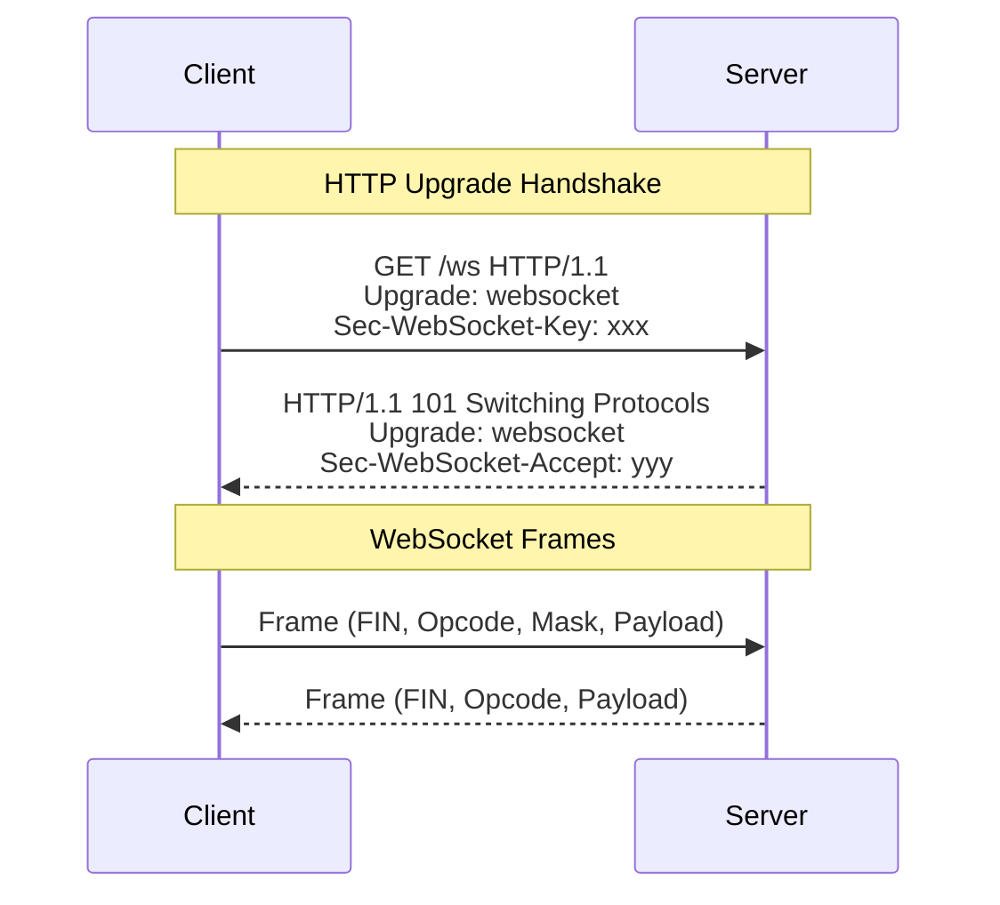
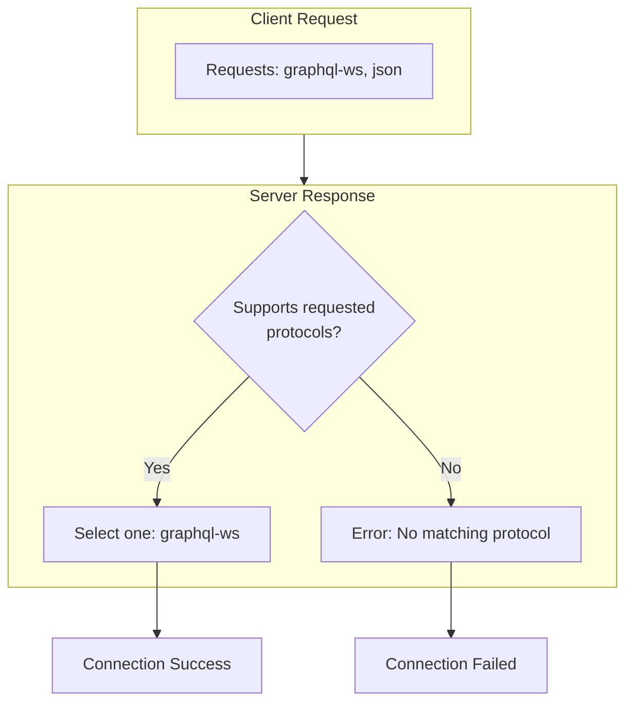
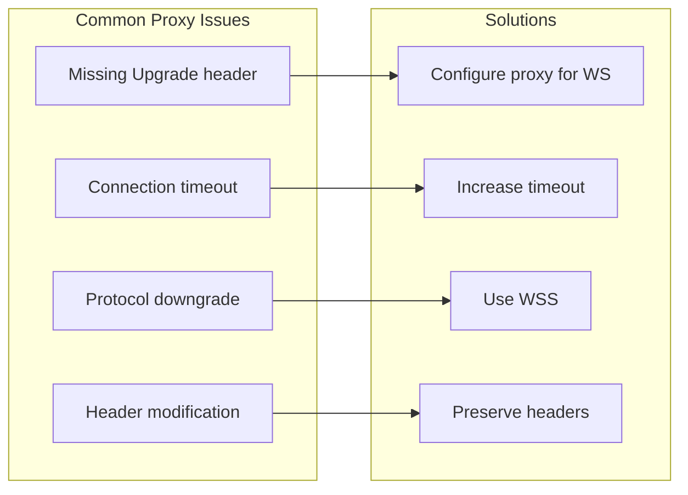
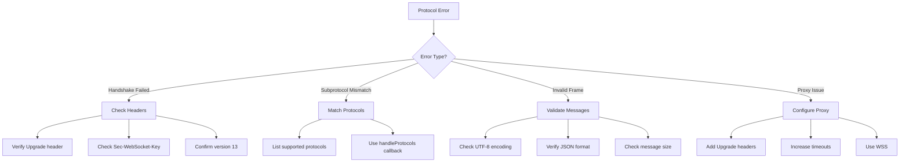

# How to Fix "Protocol Error" in WebSocket Connections

Author: [nawazdhandala](https://www.github.com/nawazdhandala)

Tags: WebSocket, Protocol Error, Debugging, JavaScript, Node.js, Troubleshooting

Description: Learn how to diagnose and fix common WebSocket protocol errors including handshake failures, frame parsing issues, and subprotocol mismatches.

---

WebSocket protocol errors occur when the communication between client and server violates the WebSocket specification defined in RFC 6455. These errors can happen during the initial handshake or during message exchange. This guide covers the most common protocol errors and how to fix them.

## Understanding WebSocket Protocol Structure

Before diving into errors, it helps to understand how WebSocket communication works:



## Error 1: Handshake Failed - Missing or Invalid Headers

The most common protocol error occurs when the HTTP upgrade handshake fails due to missing or invalid headers.

```javascript
// Error example: WebSocket connection failed: Error during WebSocket handshake:
// Unexpected response code: 400

// Client-side: Checking if the error is handshake related
const socket = new WebSocket('wss://api.example.com/ws');

socket.onerror = function(error) {
    console.error('WebSocket error:', error);
    // The error object in browsers is limited
    // Check network tab for actual HTTP response
};

socket.onclose = function(event) {
    // Close codes 1002 (protocol error) or 1007-1011 indicate protocol issues
    console.log('Close code:', event.code);
    console.log('Close reason:', event.reason);

    if (event.code === 1002) {
        console.error('Protocol error during communication');
    }
};
```

```javascript
// Server-side: Proper handshake handling with debugging
const http = require('http');
const crypto = require('crypto');

const WEBSOCKET_GUID = '258EAFA5-E914-47DA-95CA-C5AB0DC85B11';

const server = http.createServer(function(req, res) {
    res.writeHead(426, { 'Content-Type': 'text/plain' });
    res.end('WebSocket upgrade required');
});

server.on('upgrade', function(request, socket, head) {
    // Log all headers for debugging
    console.log('Upgrade request headers:', request.headers);

    // Validate required headers
    const upgrade = request.headers['upgrade'];
    if (!upgrade || upgrade.toLowerCase() !== 'websocket') {
        console.error('Missing or invalid Upgrade header');
        socket.write('HTTP/1.1 400 Bad Request\r\n\r\n');
        socket.destroy();
        return;
    }

    const connection = request.headers['connection'];
    if (!connection || !connection.toLowerCase().includes('upgrade')) {
        console.error('Missing or invalid Connection header');
        socket.write('HTTP/1.1 400 Bad Request\r\n\r\n');
        socket.destroy();
        return;
    }

    const key = request.headers['sec-websocket-key'];
    if (!key) {
        console.error('Missing Sec-WebSocket-Key header');
        socket.write('HTTP/1.1 400 Bad Request\r\n\r\n');
        socket.destroy();
        return;
    }

    const version = request.headers['sec-websocket-version'];
    if (version !== '13') {
        console.error('Unsupported WebSocket version:', version);
        socket.write('HTTP/1.1 426 Upgrade Required\r\n');
        socket.write('Sec-WebSocket-Version: 13\r\n\r\n');
        socket.destroy();
        return;
    }

    // Generate accept key
    const acceptKey = crypto
        .createHash('sha1')
        .update(key + WEBSOCKET_GUID)
        .digest('base64');

    // Send proper handshake response
    const responseHeaders = [
        'HTTP/1.1 101 Switching Protocols',
        'Upgrade: websocket',
        'Connection: Upgrade',
        `Sec-WebSocket-Accept: ${acceptKey}`
    ];

    socket.write(responseHeaders.join('\r\n') + '\r\n\r\n');

    console.log('Handshake completed successfully');
});

server.listen(8080);
```

## Error 2: Subprotocol Mismatch

When client and server cannot agree on a subprotocol, the connection fails.



```javascript
// Client-side: Requesting specific subprotocols
// The server MUST select one of these or the connection fails
const socket = new WebSocket('wss://api.example.com/ws', ['graphql-ws', 'json']);

socket.onopen = function() {
    // Check which protocol was selected
    console.log('Selected protocol:', socket.protocol);

    if (socket.protocol === '') {
        console.warn('No subprotocol selected by server');
    }
};

socket.onerror = function(error) {
    console.error('Connection failed - possible subprotocol mismatch');
};
```

```javascript
// Server-side: Handling subprotocol negotiation
const WebSocket = require('ws');

const wss = new WebSocket.Server({
    port: 8080,
    handleProtocols: function(protocols, request) {
        // protocols is a Set of requested protocols
        console.log('Client requested protocols:', [...protocols]);

        // Define supported protocols in order of preference
        const supportedProtocols = ['graphql-ws', 'graphql-transport-ws', 'json'];

        // Find first matching protocol
        for (const protocol of supportedProtocols) {
            if (protocols.has(protocol)) {
                console.log('Selected protocol:', protocol);
                return protocol;
            }
        }

        // Return false to reject the connection if no match
        // Return undefined to accept without a subprotocol
        console.warn('No matching protocol found');
        return false; // This will cause a protocol error on the client
    }
});

wss.on('connection', function(ws, request) {
    console.log('Client connected with protocol:', ws.protocol);
});
```

## Error 3: Invalid Frame Format

Protocol errors can occur when frames are malformed or violate the specification.

```javascript
// Server-side: Detecting and handling frame errors
const WebSocket = require('ws');

const wss = new WebSocket.Server({ port: 8080 });

wss.on('connection', function(ws) {
    ws.on('error', function(error) {
        // Frame parsing errors will trigger this
        console.error('WebSocket error:', error.message);

        if (error.message.includes('Invalid WebSocket frame')) {
            console.error('Received malformed frame from client');
        }

        if (error.message.includes('RSV')) {
            // RSV bits must be 0 unless extension defines otherwise
            console.error('Invalid RSV bits in frame');
        }

        if (error.message.includes('opcode')) {
            console.error('Unknown or reserved opcode received');
        }
    });

    ws.on('message', function(data, isBinary) {
        try {
            if (!isBinary) {
                // Validate UTF-8 encoding for text frames
                const text = data.toString('utf8');
                JSON.parse(text); // Additional validation if expecting JSON
            }
        } catch (error) {
            console.error('Invalid message format:', error.message);
            ws.close(1007, 'Invalid payload data');
        }
    });
});
```

```javascript
// Client-side: Ensuring proper message format
class SafeWebSocket {
    constructor(url) {
        this.socket = new WebSocket(url);
        this.setupHandlers();
    }

    setupHandlers() {
        this.socket.onclose = (event) => {
            // Interpret close codes
            const closeReasons = {
                1000: 'Normal closure',
                1001: 'Going away',
                1002: 'Protocol error',
                1003: 'Unsupported data type',
                1007: 'Invalid payload data',
                1008: 'Policy violation',
                1009: 'Message too big',
                1010: 'Extension required',
                1011: 'Internal server error'
            };

            console.log(`Connection closed: ${closeReasons[event.code] || 'Unknown'}`);
            console.log('Reason:', event.reason);
        };
    }

    sendJSON(data) {
        try {
            // Ensure valid JSON before sending
            const json = JSON.stringify(data);

            // Check message size (some servers have limits)
            if (json.length > 65536) { // 64KB example limit
                console.warn('Message may be too large');
            }

            this.socket.send(json);
        } catch (error) {
            console.error('Failed to serialize message:', error);
        }
    }

    sendBinary(arrayBuffer) {
        if (!(arrayBuffer instanceof ArrayBuffer)) {
            console.error('Expected ArrayBuffer for binary message');
            return;
        }
        this.socket.send(arrayBuffer);
    }
}
```

## Error 4: Extension Negotiation Failure

WebSocket extensions like compression can cause protocol errors if misconfigured.

```javascript
// Server-side: Handling permessage-deflate extension errors
const WebSocket = require('ws');

// Disable compression if causing issues
const wss = new WebSocket.Server({
    port: 8080,
    perMessageDeflate: false // Disable to rule out compression issues
});

// Or configure compression properly
const wssWithCompression = new WebSocket.Server({
    port: 8081,
    perMessageDeflate: {
        zlibDeflateOptions: {
            chunkSize: 1024,
            memLevel: 7,
            level: 3
        },
        zlibInflateOptions: {
            chunkSize: 10 * 1024
        },
        // Threshold for compressing messages (bytes)
        threshold: 1024,
        // Handle decompression errors gracefully
        serverNoContextTakeover: true,
        clientNoContextTakeover: true
    }
});

wssWithCompression.on('connection', function(ws) {
    ws.on('error', function(error) {
        if (error.message.includes('zlib')) {
            console.error('Compression error:', error.message);
            // May need to reconnect without compression
        }
    });
});
```

## Error 5: Proxy and Load Balancer Issues

Protocol errors often occur when proxies or load balancers interfere with WebSocket connections.



```nginx
# Nginx configuration for WebSocket support
upstream websocket_backend {
    server 127.0.0.1:8080;
}

server {
    listen 443 ssl;
    server_name api.example.com;

    location /ws {
        proxy_pass http://websocket_backend;

        # Required for WebSocket upgrade
        proxy_http_version 1.1;
        proxy_set_header Upgrade $http_upgrade;
        proxy_set_header Connection "upgrade";

        # Preserve original headers
        proxy_set_header Host $host;
        proxy_set_header X-Real-IP $remote_addr;
        proxy_set_header X-Forwarded-For $proxy_add_x_forwarded_for;
        proxy_set_header X-Forwarded-Proto $scheme;

        # Timeouts - adjust based on your needs
        proxy_read_timeout 86400s;
        proxy_send_timeout 86400s;

        # Disable buffering for real-time communication
        proxy_buffering off;
    }
}
```

```javascript
// Client-side: Detecting proxy issues
function testWebSocketConnection(url) {
    return new Promise(function(resolve, reject) {
        const startTime = Date.now();
        const socket = new WebSocket(url);

        const timeout = setTimeout(function() {
            socket.close();
            reject(new Error('Connection timeout - possible proxy issue'));
        }, 10000);

        socket.onopen = function() {
            clearTimeout(timeout);
            const connectionTime = Date.now() - startTime;
            console.log(`Connected in ${connectionTime}ms`);

            // Test if connection is truly WebSocket
            socket.send('ping');
        };

        socket.onmessage = function(event) {
            resolve({
                success: true,
                latency: Date.now() - startTime
            });
            socket.close();
        };

        socket.onerror = function(error) {
            clearTimeout(timeout);
            reject(new Error('Connection failed - check proxy configuration'));
        };

        socket.onclose = function(event) {
            clearTimeout(timeout);
            if (event.code === 1006) {
                reject(new Error('Abnormal closure - proxy may have terminated connection'));
            }
        };
    });
}

// Usage
testWebSocketConnection('wss://api.example.com/ws')
    .then(function(result) {
        console.log('WebSocket working:', result);
    })
    .catch(function(error) {
        console.error('WebSocket issue:', error.message);
    });
```

## Error 6: Message Size Exceeded

Servers often limit message size. Exceeding this causes protocol errors.

```javascript
// Server-side: Configure and enforce message size limits
const WebSocket = require('ws');

const wss = new WebSocket.Server({
    port: 8080,
    maxPayload: 1024 * 1024 // 1MB limit
});

wss.on('connection', function(ws) {
    ws.on('error', function(error) {
        if (error.message.includes('Max payload size exceeded')) {
            console.error('Client sent message exceeding size limit');
        }
    });

    ws.on('message', function(data) {
        console.log(`Received message of ${data.length} bytes`);
    });
});
```

```javascript
// Client-side: Handle large messages by chunking
class ChunkedWebSocket {
    constructor(url, chunkSize = 64 * 1024) {
        this.socket = new WebSocket(url);
        this.chunkSize = chunkSize;
        this.pendingChunks = new Map();
    }

    sendLargeMessage(id, data) {
        const json = JSON.stringify(data);
        const totalChunks = Math.ceil(json.length / this.chunkSize);

        for (let i = 0; i < totalChunks; i++) {
            const chunk = json.slice(i * this.chunkSize, (i + 1) * this.chunkSize);

            this.socket.send(JSON.stringify({
                type: 'CHUNK',
                id: id,
                index: i,
                total: totalChunks,
                data: chunk
            }));
        }
    }

    handleMessage(message) {
        if (message.type === 'CHUNK') {
            return this.handleChunk(message);
        }
        return message;
    }

    handleChunk(chunk) {
        if (!this.pendingChunks.has(chunk.id)) {
            this.pendingChunks.set(chunk.id, {
                chunks: new Array(chunk.total),
                received: 0
            });
        }

        const pending = this.pendingChunks.get(chunk.id);
        pending.chunks[chunk.index] = chunk.data;
        pending.received++;

        if (pending.received === chunk.total) {
            // All chunks received - reassemble
            const fullData = pending.chunks.join('');
            this.pendingChunks.delete(chunk.id);
            return JSON.parse(fullData);
        }

        return null; // Still waiting for more chunks
    }
}
```

## Debugging Protocol Errors

Here is a systematic approach to debugging WebSocket protocol errors:

```javascript
// Comprehensive WebSocket debugger
class WebSocketDebugger {
    constructor(url, protocols) {
        this.url = url;
        this.protocols = protocols;
        this.events = [];
    }

    connect() {
        this.log('INIT', `Connecting to ${this.url}`);

        try {
            this.socket = new WebSocket(this.url, this.protocols);
        } catch (error) {
            this.log('ERROR', `Failed to create WebSocket: ${error.message}`);
            return;
        }

        this.socket.onopen = (event) => {
            this.log('OPEN', {
                protocol: this.socket.protocol,
                extensions: this.socket.extensions,
                url: this.socket.url
            });
        };

        this.socket.onmessage = (event) => {
            this.log('MESSAGE', {
                type: typeof event.data,
                size: event.data.length || event.data.byteLength,
                preview: this.preview(event.data)
            });
        };

        this.socket.onerror = (event) => {
            this.log('ERROR', 'WebSocket error occurred');
            // Check browser console/network tab for details
        };

        this.socket.onclose = (event) => {
            this.log('CLOSE', {
                code: event.code,
                reason: event.reason,
                wasClean: event.wasClean,
                interpretation: this.interpretCloseCode(event.code)
            });
        };
    }

    log(type, data) {
        const entry = {
            timestamp: new Date().toISOString(),
            type: type,
            data: data
        };
        this.events.push(entry);
        console.log(`[WS ${type}]`, data);
    }

    preview(data) {
        if (typeof data === 'string') {
            return data.substring(0, 100) + (data.length > 100 ? '...' : '');
        }
        return `Binary data: ${data.byteLength} bytes`;
    }

    interpretCloseCode(code) {
        const codes = {
            1000: 'Normal closure - connection completed successfully',
            1001: 'Going away - server shutting down or browser navigating away',
            1002: 'Protocol error - endpoint received malformed frame',
            1003: 'Unsupported data - received data type cannot be processed',
            1005: 'No status received - connection closed without status code',
            1006: 'Abnormal closure - connection dropped unexpectedly',
            1007: 'Invalid frame payload - message contained invalid data',
            1008: 'Policy violation - message violated server policy',
            1009: 'Message too big - message exceeded size limit',
            1010: 'Mandatory extension - client expected extension not provided',
            1011: 'Internal server error - server encountered unexpected condition',
            1015: 'TLS handshake failure - secure connection failed'
        };
        return codes[code] || `Unknown close code: ${code}`;
    }

    getReport() {
        return {
            url: this.url,
            protocols: this.protocols,
            events: this.events,
            summary: {
                connected: this.events.some(e => e.type === 'OPEN'),
                messageCount: this.events.filter(e => e.type === 'MESSAGE').length,
                errors: this.events.filter(e => e.type === 'ERROR').length,
                finalCloseCode: this.events.find(e => e.type === 'CLOSE')?.data?.code
            }
        };
    }
}

// Usage
const debugger = new WebSocketDebugger('wss://api.example.com/ws', ['graphql-ws']);
debugger.connect();

// Later, get full report
setTimeout(function() {
    console.log('Debug Report:', JSON.stringify(debugger.getReport(), null, 2));
}, 5000);
```

## Common Protocol Error Solutions Summary



## Summary

WebSocket protocol errors typically fall into these categories:

1. Handshake failures - Missing or invalid HTTP upgrade headers
2. Subprotocol mismatches - Client and server cannot agree on a protocol
3. Invalid frames - Malformed messages or incorrect opcodes
4. Extension issues - Compression or other extension problems
5. Proxy interference - Intermediaries breaking the WebSocket protocol
6. Size limits - Messages exceeding server limits

When debugging, start by examining the network traffic, checking close codes, and validating that all parties (client, server, proxies) are correctly configured for WebSocket communication.
