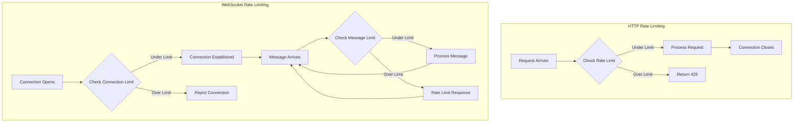
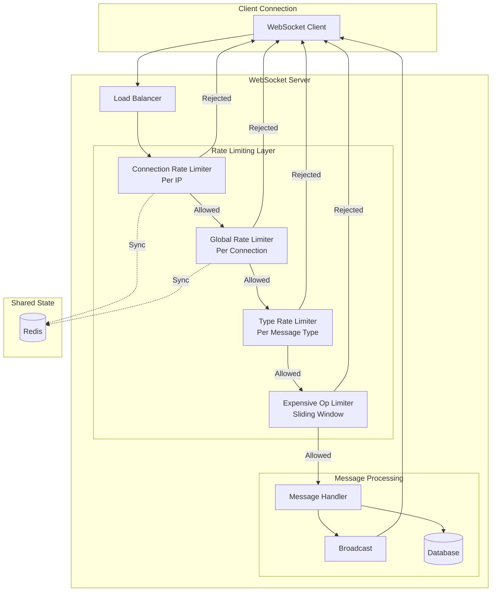

# How to Handle WebSocket Rate Limiting

Author: [nawazdhandala](https://www.github.com/nawazdhandala)

Tags: WebSocket, Rate Limiting, Node.js, Real-time, Security, Performance

Description: Learn how to implement effective rate limiting for WebSocket connections to protect your server from abuse while maintaining quality service for legitimate users.

---

WebSocket connections present unique rate limiting challenges compared to traditional HTTP APIs. Unlike REST endpoints where each request is independent, WebSocket connections are persistent and can send unlimited messages once established. Without proper rate limiting, a single malicious client can overwhelm your server with messages, consume excessive bandwidth, or trigger expensive operations repeatedly.

Rate limiting for WebSockets must operate at multiple levels: connection rate (how many new connections per time window), message rate (how many messages per connection), and payload size limits. Each level addresses different attack vectors and resource consumption patterns.

In this guide, you will learn how to implement comprehensive rate limiting for WebSocket applications. We will cover connection throttling, per-client message rate limiting, sliding window algorithms, and graceful degradation strategies that protect your infrastructure while maintaining good user experience.

## Understanding WebSocket Rate Limiting Challenges

WebSocket rate limiting differs from HTTP rate limiting in several important ways.



Persistent connections mean you cannot simply reject requests. Once a connection is established, you must decide whether to buffer messages, drop them silently, send error responses, or disconnect the client entirely.

## Basic Rate Limiter Implementation

Let us start with a simple token bucket rate limiter that tracks message rates per connection.

The token bucket algorithm allows bursts of messages while enforcing an average rate over time. Tokens are added at a fixed rate, and each message consumes one token. When tokens are exhausted, messages are rate limited.

```javascript
// rate-limiter.js
// Token bucket rate limiter for WebSocket connections

class TokenBucket {
    constructor(options = {}) {
        // Maximum tokens the bucket can hold (burst capacity)
        this.capacity = options.capacity || 10;

        // Tokens added per second (sustained rate)
        this.refillRate = options.refillRate || 5;

        // Current token count
        this.tokens = this.capacity;

        // Last refill timestamp
        this.lastRefill = Date.now();
    }

    // Refill tokens based on elapsed time
    refill() {
        const now = Date.now();
        const elapsed = (now - this.lastRefill) / 1000;

        // Add tokens based on time elapsed
        this.tokens = Math.min(
            this.capacity,
            this.tokens + (elapsed * this.refillRate)
        );

        this.lastRefill = now;
    }

    // Attempt to consume a token
    // Returns true if allowed, false if rate limited
    consume(tokens = 1) {
        this.refill();

        if (this.tokens >= tokens) {
            this.tokens -= tokens;
            return true;
        }

        return false;
    }

    // Check if a consume would succeed without actually consuming
    canConsume(tokens = 1) {
        this.refill();
        return this.tokens >= tokens;
    }

    // Get time until tokens will be available
    getWaitTime(tokens = 1) {
        this.refill();

        if (this.tokens >= tokens) {
            return 0;
        }

        const tokensNeeded = tokens - this.tokens;
        return (tokensNeeded / this.refillRate) * 1000;
    }
}

module.exports = { TokenBucket };
```

## Per-Connection Rate Limiting

Now let us integrate the rate limiter with a WebSocket server. Each connection gets its own rate limiter instance.

```javascript
// websocket-server.js
// WebSocket server with per-connection rate limiting

const WebSocket = require('ws');
const { TokenBucket } = require('./rate-limiter');

// Rate limit configuration
const RATE_LIMIT_CONFIG = {
    // Message rate limiting
    messages: {
        capacity: 20,      // Allow burst of 20 messages
        refillRate: 10     // Sustain 10 messages per second
    },
    // Connection rate limiting (per IP)
    connections: {
        capacity: 5,       // Allow 5 rapid connections
        refillRate: 1      // Sustain 1 new connection per second
    }
};

// Track connection rate limits by IP address
const connectionLimiters = new Map();

// Track message rate limits by connection
const messageLimiters = new WeakMap();

// Get or create connection rate limiter for an IP
function getConnectionLimiter(ip) {
    if (!connectionLimiters.has(ip)) {
        connectionLimiters.set(ip, new TokenBucket(RATE_LIMIT_CONFIG.connections));
    }
    return connectionLimiters.get(ip);
}

// Clean up old connection limiters periodically
setInterval(() => {
    const now = Date.now();
    for (const [ip, limiter] of connectionLimiters) {
        // Remove limiters that have been full for over an hour
        if (now - limiter.lastRefill > 3600000 && limiter.tokens >= limiter.capacity) {
            connectionLimiters.delete(ip);
        }
    }
}, 60000);

// Create WebSocket server
const wss = new WebSocket.Server({ port: 8080 });

wss.on('connection', (ws, req) => {
    // Extract client IP (handle proxies)
    const ip = req.headers['x-forwarded-for']?.split(',')[0].trim()
        || req.socket.remoteAddress;

    // Check connection rate limit
    const connectionLimiter = getConnectionLimiter(ip);
    if (!connectionLimiter.consume()) {
        console.log(`Connection rate limited: ${ip}`);
        ws.close(1008, 'Connection rate limit exceeded');
        return;
    }

    // Create message rate limiter for this connection
    const messageLimiter = new TokenBucket(RATE_LIMIT_CONFIG.messages);
    messageLimiters.set(ws, messageLimiter);

    console.log(`Client connected: ${ip}`);

    ws.on('message', (data) => {
        // Check message rate limit
        if (!messageLimiter.consume()) {
            // Send rate limit error to client
            ws.send(JSON.stringify({
                type: 'error',
                code: 'RATE_LIMITED',
                message: 'Message rate limit exceeded',
                retryAfter: Math.ceil(messageLimiter.getWaitTime())
            }));
            return;
        }

        // Process the message
        handleMessage(ws, data);
    });

    ws.on('close', () => {
        console.log(`Client disconnected: ${ip}`);
    });
});

function handleMessage(ws, data) {
    try {
        const message = JSON.parse(data);
        // Process message based on type
        console.log('Received:', message);

        // Echo back for demo
        ws.send(JSON.stringify({
            type: 'ack',
            received: message
        }));
    } catch (err) {
        ws.send(JSON.stringify({
            type: 'error',
            code: 'INVALID_MESSAGE',
            message: 'Failed to parse message'
        }));
    }
}

console.log('WebSocket server running on port 8080');
```

## Sliding Window Rate Limiting

The sliding window algorithm provides smoother rate limiting than fixed windows by considering the time of each request. This prevents the "burst at window boundaries" problem.

```javascript
// sliding-window-limiter.js
// Sliding window rate limiter with precise timing

class SlidingWindowLimiter {
    constructor(options = {}) {
        // Time window in milliseconds
        this.windowMs = options.windowMs || 60000;

        // Maximum requests per window
        this.maxRequests = options.maxRequests || 100;

        // Store timestamps of recent requests
        this.timestamps = [];
    }

    // Clean up old timestamps outside the window
    cleanup() {
        const cutoff = Date.now() - this.windowMs;
        this.timestamps = this.timestamps.filter(ts => ts > cutoff);
    }

    // Check if request is allowed
    isAllowed() {
        this.cleanup();
        return this.timestamps.length < this.maxRequests;
    }

    // Record a request and check if allowed
    consume() {
        this.cleanup();

        if (this.timestamps.length >= this.maxRequests) {
            return false;
        }

        this.timestamps.push(Date.now());
        return true;
    }

    // Get remaining requests in current window
    getRemaining() {
        this.cleanup();
        return Math.max(0, this.maxRequests - this.timestamps.length);
    }

    // Get time until oldest request expires
    getResetTime() {
        this.cleanup();

        if (this.timestamps.length === 0) {
            return 0;
        }

        const oldestTimestamp = this.timestamps[0];
        const resetTime = oldestTimestamp + this.windowMs - Date.now();
        return Math.max(0, resetTime);
    }

    // Get current request count
    getCount() {
        this.cleanup();
        return this.timestamps.length;
    }
}

// Sliding window counter (memory efficient for high traffic)
// Uses previous and current window counts with weighted calculation
class SlidingWindowCounter {
    constructor(options = {}) {
        this.windowMs = options.windowMs || 60000;
        this.maxRequests = options.maxRequests || 100;

        this.currentWindow = {
            start: this.getCurrentWindowStart(),
            count: 0
        };

        this.previousWindow = {
            start: 0,
            count: 0
        };
    }

    getCurrentWindowStart() {
        return Math.floor(Date.now() / this.windowMs) * this.windowMs;
    }

    // Rotate windows if needed
    rotateWindow() {
        const currentStart = this.getCurrentWindowStart();

        if (currentStart > this.currentWindow.start) {
            // Move current to previous
            this.previousWindow = { ...this.currentWindow };

            // Start new current window
            this.currentWindow = {
                start: currentStart,
                count: 0
            };
        }
    }

    // Calculate weighted count using sliding window approximation
    getWeightedCount() {
        this.rotateWindow();

        const now = Date.now();
        const currentStart = this.currentWindow.start;

        // Weight of previous window (portion still in sliding window)
        const previousWeight = Math.max(0,
            (this.windowMs - (now - currentStart)) / this.windowMs
        );

        return this.currentWindow.count + (this.previousWindow.count * previousWeight);
    }

    consume() {
        this.rotateWindow();

        const weightedCount = this.getWeightedCount();

        if (weightedCount >= this.maxRequests) {
            return false;
        }

        this.currentWindow.count++;
        return true;
    }

    getRemaining() {
        return Math.max(0, Math.floor(this.maxRequests - this.getWeightedCount()));
    }
}

module.exports = { SlidingWindowLimiter, SlidingWindowCounter };
```

## Multi-Tier Rate Limiting

Production systems often need multiple rate limiting tiers that operate simultaneously. This allows different limits for different operation types.

```javascript
// multi-tier-limiter.js
// Multi-tier rate limiting for different message types

const { TokenBucket } = require('./rate-limiter');
const { SlidingWindowCounter } = require('./sliding-window-limiter');

class MultiTierRateLimiter {
    constructor(config = {}) {
        // Global rate limit (all message types)
        this.globalLimiter = new TokenBucket({
            capacity: config.global?.capacity || 100,
            refillRate: config.global?.refillRate || 50
        });

        // Per-type rate limiters
        this.typeLimiters = new Map();
        this.typeConfigs = config.types || {};

        // Expensive operations get stricter limits
        this.expensiveOperations = new SlidingWindowCounter({
            windowMs: config.expensive?.windowMs || 60000,
            maxRequests: config.expensive?.maxRequests || 10
        });
    }

    // Get or create limiter for a message type
    getTypeLimiter(type) {
        if (!this.typeLimiters.has(type)) {
            const config = this.typeConfigs[type] || {
                capacity: 20,
                refillRate: 10
            };
            this.typeLimiters.set(type, new TokenBucket(config));
        }
        return this.typeLimiters.get(type);
    }

    // Check if message is allowed
    // Returns { allowed, reason, retryAfter }
    check(messageType, isExpensive = false) {
        // Check global limit first
        if (!this.globalLimiter.canConsume()) {
            return {
                allowed: false,
                reason: 'GLOBAL_LIMIT',
                retryAfter: this.globalLimiter.getWaitTime()
            };
        }

        // Check type-specific limit
        const typeLimiter = this.getTypeLimiter(messageType);
        if (!typeLimiter.canConsume()) {
            return {
                allowed: false,
                reason: 'TYPE_LIMIT',
                retryAfter: typeLimiter.getWaitTime()
            };
        }

        // Check expensive operation limit
        if (isExpensive && this.expensiveOperations.getRemaining() === 0) {
            return {
                allowed: false,
                reason: 'EXPENSIVE_LIMIT',
                retryAfter: this.expensiveOperations.getResetTime()
            };
        }

        return { allowed: true };
    }

    // Consume tokens for a message
    consume(messageType, isExpensive = false) {
        const checkResult = this.check(messageType, isExpensive);

        if (!checkResult.allowed) {
            return checkResult;
        }

        // Consume from all applicable limiters
        this.globalLimiter.consume();
        this.getTypeLimiter(messageType).consume();

        if (isExpensive) {
            this.expensiveOperations.consume();
        }

        return { allowed: true };
    }

    // Get current limits status
    getStatus(messageType) {
        const typeLimiter = this.getTypeLimiter(messageType);

        return {
            global: {
                remaining: Math.floor(this.globalLimiter.tokens),
                capacity: this.globalLimiter.capacity
            },
            type: {
                remaining: Math.floor(typeLimiter.tokens),
                capacity: typeLimiter.capacity
            },
            expensive: {
                remaining: this.expensiveOperations.getRemaining(),
                resetIn: this.expensiveOperations.getResetTime()
            }
        };
    }
}

module.exports = { MultiTierRateLimiter };
```

## WebSocket Server with Multi-Tier Limiting

Here is a complete WebSocket server implementation using multi-tier rate limiting.

```javascript
// server-with-tiers.js
// Production WebSocket server with multi-tier rate limiting

const WebSocket = require('ws');
const { MultiTierRateLimiter } = require('./multi-tier-limiter');

// Define expensive operations
const EXPENSIVE_OPERATIONS = new Set([
    'search',
    'export',
    'bulk_update',
    'generate_report'
]);

// Rate limit configuration per message type
const RATE_LIMIT_CONFIG = {
    global: {
        capacity: 100,
        refillRate: 50
    },
    types: {
        chat: { capacity: 30, refillRate: 15 },
        typing: { capacity: 10, refillRate: 5 },
        presence: { capacity: 5, refillRate: 2 },
        search: { capacity: 5, refillRate: 1 },
        default: { capacity: 20, refillRate: 10 }
    },
    expensive: {
        windowMs: 60000,
        maxRequests: 5
    }
};

// Client connection class
class Client {
    constructor(ws, ip) {
        this.ws = ws;
        this.ip = ip;
        this.id = crypto.randomUUID();
        this.rateLimiter = new MultiTierRateLimiter(RATE_LIMIT_CONFIG);
        this.warningCount = 0;
        this.connectedAt = Date.now();
    }

    send(data) {
        if (this.ws.readyState === WebSocket.OPEN) {
            this.ws.send(JSON.stringify(data));
        }
    }

    // Handle rate limit violation
    handleRateLimitViolation(result, messageType) {
        this.warningCount++;

        // Send warning to client
        this.send({
            type: 'rate_limit',
            code: result.reason,
            messageType: messageType,
            retryAfter: Math.ceil(result.retryAfter),
            warningCount: this.warningCount
        });

        // Disconnect repeat offenders
        if (this.warningCount >= 10) {
            console.log(`Disconnecting repeat offender: ${this.id}`);
            this.ws.close(1008, 'Rate limit violations');
        }
    }
}

// Track all clients
const clients = new Map();

// Create WebSocket server
const wss = new WebSocket.Server({ port: 8080 });

wss.on('connection', (ws, req) => {
    const ip = req.headers['x-forwarded-for']?.split(',')[0].trim()
        || req.socket.remoteAddress;

    const client = new Client(ws, ip);
    clients.set(client.id, client);

    console.log(`Client connected: ${client.id} from ${ip}`);

    // Send welcome message with rate limit info
    client.send({
        type: 'welcome',
        clientId: client.id,
        rateLimits: {
            global: RATE_LIMIT_CONFIG.global,
            expensive: RATE_LIMIT_CONFIG.expensive
        }
    });

    ws.on('message', (data) => {
        handleClientMessage(client, data);
    });

    ws.on('close', () => {
        clients.delete(client.id);
        console.log(`Client disconnected: ${client.id}`);
    });

    ws.on('error', (err) => {
        console.error(`Client error ${client.id}:`, err);
    });
});

function handleClientMessage(client, data) {
    let message;

    try {
        message = JSON.parse(data);
    } catch (err) {
        client.send({
            type: 'error',
            code: 'INVALID_JSON',
            message: 'Failed to parse message'
        });
        return;
    }

    const messageType = message.type || 'default';
    const isExpensive = EXPENSIVE_OPERATIONS.has(messageType);

    // Check rate limits
    const result = client.rateLimiter.consume(messageType, isExpensive);

    if (!result.allowed) {
        client.handleRateLimitViolation(result, messageType);
        return;
    }

    // Process message based on type
    processMessage(client, message);
}

function processMessage(client, message) {
    switch (message.type) {
        case 'chat':
            // Broadcast chat message
            broadcastToAll({
                type: 'chat',
                from: client.id,
                content: message.content,
                timestamp: Date.now()
            }, client.id);
            break;

        case 'typing':
            // Broadcast typing indicator
            broadcastToAll({
                type: 'typing',
                from: client.id,
                isTyping: message.isTyping
            }, client.id);
            break;

        case 'search':
            // Simulate expensive search operation
            setTimeout(() => {
                client.send({
                    type: 'search_results',
                    query: message.query,
                    results: []
                });
            }, 100);
            break;

        case 'get_limits':
            // Return current rate limit status
            const status = client.rateLimiter.getStatus(message.checkType || 'default');
            client.send({
                type: 'limits_status',
                status: status
            });
            break;

        default:
            client.send({
                type: 'ack',
                messageType: message.type
            });
    }
}

function broadcastToAll(message, excludeId = null) {
    for (const [id, client] of clients) {
        if (id !== excludeId) {
            client.send(message);
        }
    }
}

console.log('WebSocket server with multi-tier rate limiting running on port 8080');
```

## Rate Limiting Architecture

Here is an overview of how the rate limiting components interact in a production system.



## Distributed Rate Limiting with Redis

For horizontally scaled WebSocket servers, rate limits must be shared across instances. Here is a Redis-backed rate limiter.

```javascript
// redis-rate-limiter.js
// Distributed rate limiting with Redis

const Redis = require('ioredis');

class RedisRateLimiter {
    constructor(redis, options = {}) {
        this.redis = redis;
        this.keyPrefix = options.keyPrefix || 'ratelimit:';
        this.windowMs = options.windowMs || 60000;
        this.maxRequests = options.maxRequests || 100;
    }

    // Generate key for a client identifier
    getKey(identifier) {
        return `${this.keyPrefix}${identifier}`;
    }

    // Check and consume using Lua script for atomicity
    async consume(identifier) {
        const key = this.getKey(identifier);
        const now = Date.now();
        const windowStart = now - this.windowMs;

        // Lua script for atomic sliding window rate limiting
        const script = `
            local key = KEYS[1]
            local now = tonumber(ARGV[1])
            local window_start = tonumber(ARGV[2])
            local max_requests = tonumber(ARGV[3])
            local window_ms = tonumber(ARGV[4])

            -- Remove old entries outside the window
            redis.call('ZREMRANGEBYSCORE', key, '-inf', window_start)

            -- Count current requests
            local count = redis.call('ZCARD', key)

            if count < max_requests then
                -- Add new request
                redis.call('ZADD', key, now, now .. '-' .. math.random())
                redis.call('PEXPIRE', key, window_ms)
                return {1, max_requests - count - 1, 0}
            else
                -- Get oldest entry to calculate reset time
                local oldest = redis.call('ZRANGE', key, 0, 0, 'WITHSCORES')
                local reset_time = 0
                if oldest[2] then
                    reset_time = oldest[2] + window_ms - now
                end
                return {0, 0, reset_time}
            end
        `;

        const result = await this.redis.eval(
            script,
            1,
            key,
            now,
            windowStart,
            this.maxRequests,
            this.windowMs
        );

        return {
            allowed: result[0] === 1,
            remaining: result[1],
            resetIn: result[2]
        };
    }

    // Get current status without consuming
    async getStatus(identifier) {
        const key = this.getKey(identifier);
        const now = Date.now();
        const windowStart = now - this.windowMs;

        // Remove old entries and get count
        await this.redis.zremrangebyscore(key, '-inf', windowStart);
        const count = await this.redis.zcard(key);

        return {
            count: count,
            remaining: Math.max(0, this.maxRequests - count),
            limit: this.maxRequests
        };
    }
}

// Token bucket implementation with Redis
class RedisTokenBucket {
    constructor(redis, options = {}) {
        this.redis = redis;
        this.keyPrefix = options.keyPrefix || 'tokenbucket:';
        this.capacity = options.capacity || 10;
        this.refillRate = options.refillRate || 5;
    }

    getKey(identifier) {
        return `${this.keyPrefix}${identifier}`;
    }

    async consume(identifier, tokens = 1) {
        const key = this.getKey(identifier);

        // Lua script for atomic token bucket
        const script = `
            local key = KEYS[1]
            local capacity = tonumber(ARGV[1])
            local refill_rate = tonumber(ARGV[2])
            local tokens_needed = tonumber(ARGV[3])
            local now = tonumber(ARGV[4])

            -- Get current state
            local data = redis.call('HMGET', key, 'tokens', 'last_refill')
            local current_tokens = tonumber(data[1]) or capacity
            local last_refill = tonumber(data[2]) or now

            -- Calculate refill
            local elapsed = (now - last_refill) / 1000
            local new_tokens = math.min(capacity, current_tokens + (elapsed * refill_rate))

            if new_tokens >= tokens_needed then
                -- Consume tokens
                new_tokens = new_tokens - tokens_needed
                redis.call('HMSET', key, 'tokens', new_tokens, 'last_refill', now)
                redis.call('EXPIRE', key, 3600)
                return {1, new_tokens, 0}
            else
                -- Calculate wait time
                local tokens_missing = tokens_needed - new_tokens
                local wait_time = (tokens_missing / refill_rate) * 1000
                redis.call('HMSET', key, 'tokens', new_tokens, 'last_refill', now)
                redis.call('EXPIRE', key, 3600)
                return {0, new_tokens, wait_time}
            end
        `;

        const result = await this.redis.eval(
            script,
            1,
            key,
            this.capacity,
            this.refillRate,
            tokens,
            Date.now()
        );

        return {
            allowed: result[0] === 1,
            remaining: result[1],
            retryAfter: result[2]
        };
    }
}

module.exports = { RedisRateLimiter, RedisTokenBucket };
```

## Client-Side Rate Limit Handling

Clients should handle rate limit responses gracefully by implementing backoff and retry logic.

```javascript
// client-rate-handler.js
// Client-side rate limit handling

class WebSocketClientWithRateLimiting {
    constructor(url) {
        this.url = url;
        this.ws = null;
        this.messageQueue = [];
        this.isRateLimited = false;
        this.retryTimeout = null;
        this.reconnectAttempts = 0;
        this.maxReconnectAttempts = 5;
    }

    connect() {
        return new Promise((resolve, reject) => {
            this.ws = new WebSocket(this.url);

            this.ws.onopen = () => {
                console.log('Connected to server');
                this.reconnectAttempts = 0;
                this.processQueue();
                resolve();
            };

            this.ws.onmessage = (event) => {
                this.handleMessage(JSON.parse(event.data));
            };

            this.ws.onclose = (event) => {
                console.log('Disconnected:', event.code, event.reason);
                this.handleDisconnect();
            };

            this.ws.onerror = (error) => {
                console.error('WebSocket error:', error);
                reject(error);
            };
        });
    }

    handleMessage(message) {
        if (message.type === 'rate_limit') {
            this.handleRateLimit(message);
            return;
        }

        // Handle other message types
        console.log('Received:', message);

        if (this.onMessage) {
            this.onMessage(message);
        }
    }

    handleRateLimit(message) {
        console.warn('Rate limited:', message.code, 'Retry after:', message.retryAfter, 'ms');

        this.isRateLimited = true;

        // Clear any existing retry timeout
        if (this.retryTimeout) {
            clearTimeout(this.retryTimeout);
        }

        // Wait before processing queue
        this.retryTimeout = setTimeout(() => {
            this.isRateLimited = false;
            this.processQueue();
        }, message.retryAfter + 100); // Add small buffer

        if (this.onRateLimited) {
            this.onRateLimited(message);
        }
    }

    handleDisconnect() {
        if (this.reconnectAttempts < this.maxReconnectAttempts) {
            const delay = Math.min(1000 * Math.pow(2, this.reconnectAttempts), 30000);
            console.log(`Reconnecting in ${delay}ms...`);

            setTimeout(() => {
                this.reconnectAttempts++;
                this.connect().catch(console.error);
            }, delay);
        }
    }

    send(message) {
        const data = typeof message === 'string' ? message : JSON.stringify(message);

        if (this.isRateLimited || this.ws.readyState !== WebSocket.OPEN) {
            // Queue message for later
            this.messageQueue.push(data);
            return false;
        }

        this.ws.send(data);
        return true;
    }

    processQueue() {
        if (this.isRateLimited || this.ws.readyState !== WebSocket.OPEN) {
            return;
        }

        while (this.messageQueue.length > 0 && !this.isRateLimited) {
            const message = this.messageQueue.shift();
            this.ws.send(message);

            // Add small delay between queued messages
            // to avoid hitting rate limit immediately
            if (this.messageQueue.length > 0) {
                setTimeout(() => this.processQueue(), 50);
                break;
            }
        }
    }

    // Priority send - skip queue
    sendPriority(message) {
        if (this.ws.readyState !== WebSocket.OPEN) {
            return false;
        }

        const data = typeof message === 'string' ? message : JSON.stringify(message);
        this.ws.send(data);
        return true;
    }

    close() {
        if (this.retryTimeout) {
            clearTimeout(this.retryTimeout);
        }
        this.maxReconnectAttempts = 0;
        this.ws.close();
    }
}

// Usage example
async function main() {
    const client = new WebSocketClientWithRateLimiting('ws://localhost:8080');

    client.onMessage = (msg) => {
        console.log('Message received:', msg);
    };

    client.onRateLimited = (info) => {
        console.warn('We are being rate limited. Slowing down...');
    };

    await client.connect();

    // Send messages - they will be queued if rate limited
    for (let i = 0; i < 100; i++) {
        client.send({ type: 'chat', content: `Message ${i}` });
    }
}
```

## Monitoring Rate Limiting

Track rate limiting metrics to understand usage patterns and tune limits appropriately.

```javascript
// rate-limit-metrics.js
// Rate limiting metrics collection

class RateLimitMetrics {
    constructor() {
        this.metrics = {
            allowed: 0,
            rejected: 0,
            rejectionsByReason: {},
            rejectionsByType: {},
            latencySum: 0,
            latencyCount: 0
        };

        this.intervalMetrics = [];
        this.intervalMs = 60000;
        this.maxIntervals = 60; // Keep 1 hour of history

        // Rotate metrics periodically
        setInterval(() => this.rotateMetrics(), this.intervalMs);
    }

    recordAllowed(messageType, latencyMs) {
        this.metrics.allowed++;
        this.metrics.latencySum += latencyMs;
        this.metrics.latencyCount++;
    }

    recordRejected(messageType, reason) {
        this.metrics.rejected++;

        if (!this.metrics.rejectionsByReason[reason]) {
            this.metrics.rejectionsByReason[reason] = 0;
        }
        this.metrics.rejectionsByReason[reason]++;

        if (!this.metrics.rejectionsByType[messageType]) {
            this.metrics.rejectionsByType[messageType] = 0;
        }
        this.metrics.rejectionsByType[messageType]++;
    }

    rotateMetrics() {
        // Save current interval
        this.intervalMetrics.push({
            timestamp: Date.now(),
            ...this.metrics,
            avgLatency: this.metrics.latencyCount > 0
                ? this.metrics.latencySum / this.metrics.latencyCount
                : 0
        });

        // Trim old intervals
        if (this.intervalMetrics.length > this.maxIntervals) {
            this.intervalMetrics.shift();
        }

        // Reset current metrics
        this.metrics = {
            allowed: 0,
            rejected: 0,
            rejectionsByReason: {},
            rejectionsByType: {},
            latencySum: 0,
            latencyCount: 0
        };
    }

    getStats() {
        const current = { ...this.metrics };

        // Calculate totals from historical data
        let totalAllowed = current.allowed;
        let totalRejected = current.rejected;

        for (const interval of this.intervalMetrics) {
            totalAllowed += interval.allowed;
            totalRejected += interval.rejected;
        }

        const total = totalAllowed + totalRejected;

        return {
            current: current,
            hourly: {
                total: total,
                allowed: totalAllowed,
                rejected: totalRejected,
                rejectionRate: total > 0 ? (totalRejected / total * 100).toFixed(2) + '%' : '0%'
            },
            intervals: this.intervalMetrics
        };
    }

    // Export metrics in Prometheus format
    toPrometheus() {
        const stats = this.getStats();

        let output = '';

        output += '# HELP websocket_rate_limit_total Total rate limit checks\n';
        output += '# TYPE websocket_rate_limit_total counter\n';
        output += `websocket_rate_limit_total{result="allowed"} ${stats.hourly.allowed}\n`;
        output += `websocket_rate_limit_total{result="rejected"} ${stats.hourly.rejected}\n`;

        output += '# HELP websocket_rate_limit_rejections_by_reason Rejections by reason\n';
        output += '# TYPE websocket_rate_limit_rejections_by_reason counter\n';
        for (const [reason, count] of Object.entries(stats.current.rejectionsByReason)) {
            output += `websocket_rate_limit_rejections_by_reason{reason="${reason}"} ${count}\n`;
        }

        return output;
    }
}

module.exports = { RateLimitMetrics };
```

## Best Practices Summary

When implementing WebSocket rate limiting, follow these guidelines.

Start with generous limits and tighten based on observed abuse patterns. Overly aggressive limits frustrate legitimate users.

Use multiple rate limiting tiers. Global limits protect overall system capacity, while per-type limits prevent specific operations from monopolizing resources.

Always provide meaningful feedback to rate-limited clients. Include the retry-after time so clients can implement proper backoff.

Monitor rejection rates closely. A high rejection rate might indicate limits that are too strict or a potential attack.

Consider user tiers for applications with different service levels. Premium users might have higher limits than free users.

Test rate limiting under load to ensure the limiter itself does not become a bottleneck. Redis-backed limiters scale better than in-memory solutions for high-traffic applications.

Implement graceful degradation. When a client is repeatedly rate limited, consider temporarily reducing their allowed message types rather than disconnecting them entirely.

## Conclusion

Effective WebSocket rate limiting requires a multi-layered approach that protects your infrastructure while maintaining good user experience. By implementing token bucket algorithms for bursty traffic, sliding windows for precise control, and distributed storage for horizontal scaling, you can build robust rate limiting that adapts to your application's needs.

The key is finding the right balance between protection and usability. Start with conservative limits, monitor usage patterns, and adjust based on real-world data. With proper instrumentation and metrics, you can continuously refine your rate limiting strategy to handle both legitimate traffic spikes and malicious abuse attempts.
