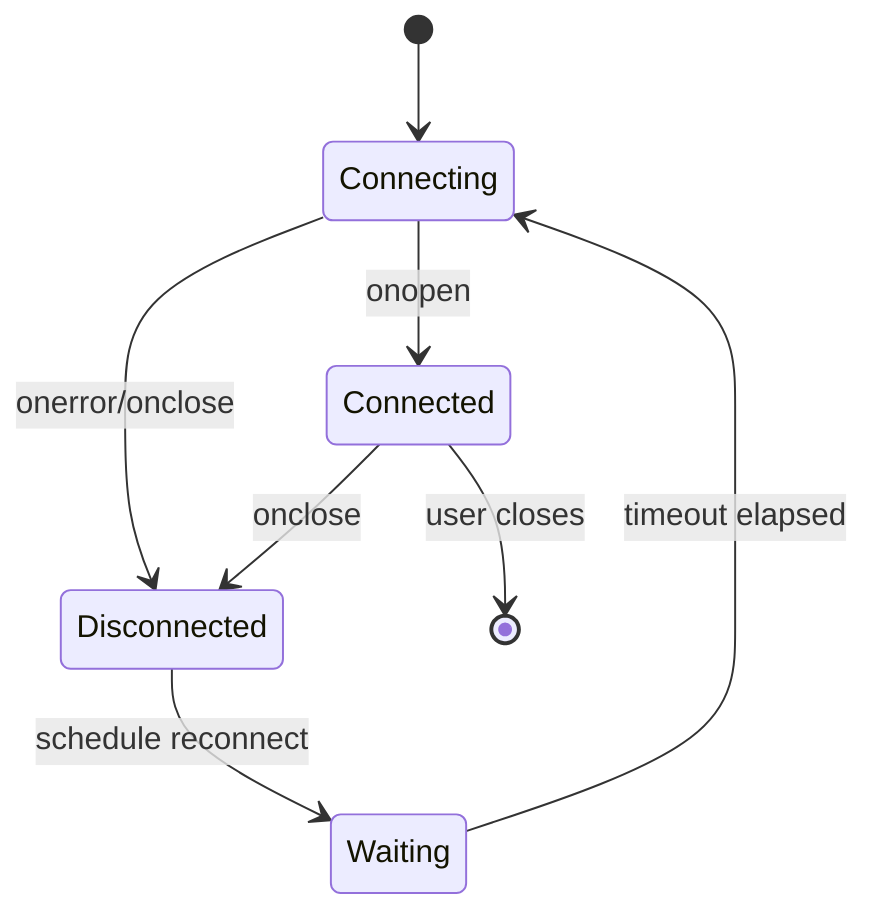
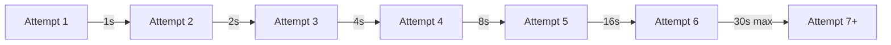

# How to Handle WebSocket Reconnection Logic

Author: [nawazdhandala](https://www.github.com/nawazdhandala)

Tags: WebSocket, JavaScript, Networking, Real-time, Resilience

Description: Learn how to implement robust WebSocket reconnection with exponential backoff, state recovery, and message queuing for production applications.

---

WebSocket connections can drop unexpectedly due to network issues, server restarts, or mobile network transitions. A robust reconnection strategy ensures your real-time application remains functional without manual user intervention. This guide covers implementing reliable reconnection logic.

## Why Reconnection Matters

Unlike HTTP requests that complete quickly, WebSocket connections are long-lived. A single dropped connection can render an entire application feature unusable until the user manually refreshes.



## Basic Reconnection

The simplest reconnection strategy attempts to reconnect immediately after disconnection. However, this can cause issues with rapid reconnection attempts.

```javascript
// basic-reconnect.js
// Simple reconnection - not recommended for production

class SimpleWebSocket {
  constructor(url) {
    this.url = url;
    this.socket = null;
    this.connect();
  }

  connect() {
    this.socket = new WebSocket(this.url);

    this.socket.onopen = () => {
      console.log('Connected');
    };

    this.socket.onclose = () => {
      console.log('Disconnected - reconnecting immediately');
      // Problem: This can cause rapid reconnection loops
      // if the server is down or network is unavailable
      this.connect();
    };

    this.socket.onerror = (error) => {
      console.error('Error:', error);
    };
  }
}
```

The problem with immediate reconnection is that it creates a tight loop when the server is unavailable, wasting resources and potentially causing rate limiting.

## Exponential Backoff

Exponential backoff increases the delay between reconnection attempts, preventing resource waste when the server is temporarily unavailable.

```javascript
// exponential-backoff.js
// Reconnection with exponential backoff

class BackoffWebSocket {
  constructor(url, options = {}) {
    this.url = url;

    // Backoff configuration
    this.initialDelay = options.initialDelay || 1000;    // Start with 1 second
    this.maxDelay = options.maxDelay || 30000;           // Cap at 30 seconds
    this.multiplier = options.multiplier || 2;           // Double each time
    this.jitter = options.jitter || 0.1;                 // 10% randomization

    // State
    this.currentDelay = this.initialDelay;
    this.reconnectTimer = null;
    this.socket = null;
    this.shouldReconnect = true;

    this.connect();
  }

  connect() {
    console.log('Attempting to connect...');
    this.socket = new WebSocket(this.url);

    this.socket.onopen = () => {
      console.log('Connected successfully');
      // Reset backoff on successful connection
      this.currentDelay = this.initialDelay;
    };

    this.socket.onclose = (event) => {
      console.log(`Disconnected: code=${event.code}`);

      if (this.shouldReconnect) {
        this.scheduleReconnect();
      }
    };

    this.socket.onerror = () => {
      // Error is followed by close event, so we handle reconnection there
    };
  }

  scheduleReconnect() {
    // Add jitter to prevent thundering herd when many clients reconnect
    const jitterRange = this.currentDelay * this.jitter;
    const jitterValue = Math.random() * jitterRange - (jitterRange / 2);
    const delay = Math.round(this.currentDelay + jitterValue);

    console.log(`Reconnecting in ${delay}ms`);

    this.reconnectTimer = setTimeout(() => {
      this.connect();
    }, delay);

    // Increase delay for next attempt (with cap)
    this.currentDelay = Math.min(
      this.currentDelay * this.multiplier,
      this.maxDelay
    );
  }

  close() {
    this.shouldReconnect = false;
    if (this.reconnectTimer) {
      clearTimeout(this.reconnectTimer);
    }
    if (this.socket) {
      this.socket.close(1000, 'Client closing');
    }
  }
}
```



## Connection State Management

Track connection state to handle UI updates and message queuing properly.

```javascript
// connection-state.js
// WebSocket with detailed state management

const ConnectionState = {
  CONNECTING: 'connecting',
  CONNECTED: 'connected',
  RECONNECTING: 'reconnecting',
  DISCONNECTED: 'disconnected',
};

class StatefulWebSocket {
  constructor(url) {
    this.url = url;
    this.state = ConnectionState.DISCONNECTED;
    this.stateListeners = new Set();
    this.socket = null;

    // Reconnection config
    this.reconnectAttempts = 0;
    this.maxReconnectAttempts = 10;
    this.baseDelay = 1000;
    this.maxDelay = 30000;

    this.connect();
  }

  connect() {
    this.setState(
      this.reconnectAttempts === 0
        ? ConnectionState.CONNECTING
        : ConnectionState.RECONNECTING
    );

    this.socket = new WebSocket(this.url);

    this.socket.onopen = () => {
      this.reconnectAttempts = 0;
      this.setState(ConnectionState.CONNECTED);
    };

    this.socket.onclose = (event) => {
      if (event.code === 1000) {
        // Normal closure - do not reconnect
        this.setState(ConnectionState.DISCONNECTED);
        return;
      }

      if (this.reconnectAttempts < this.maxReconnectAttempts) {
        this.scheduleReconnect();
      } else {
        console.error('Max reconnection attempts reached');
        this.setState(ConnectionState.DISCONNECTED);
      }
    };
  }

  scheduleReconnect() {
    this.reconnectAttempts++;
    const delay = Math.min(
      this.baseDelay * Math.pow(2, this.reconnectAttempts - 1),
      this.maxDelay
    );

    console.log(`Reconnect attempt ${this.reconnectAttempts} in ${delay}ms`);

    setTimeout(() => this.connect(), delay);
  }

  setState(newState) {
    const oldState = this.state;
    this.state = newState;

    console.log(`State: ${oldState} -> ${newState}`);

    // Notify listeners
    this.stateListeners.forEach(listener => {
      listener(newState, oldState);
    });
  }

  onStateChange(listener) {
    this.stateListeners.add(listener);
    // Return unsubscribe function
    return () => this.stateListeners.delete(listener);
  }

  getState() {
    return this.state;
  }
}

// Usage with UI
const ws = new StatefulWebSocket('wss://api.example.com/ws');

ws.onStateChange((state) => {
  const statusElement = document.getElementById('connection-status');

  switch (state) {
    case ConnectionState.CONNECTED:
      statusElement.textContent = 'Connected';
      statusElement.className = 'status-online';
      break;
    case ConnectionState.CONNECTING:
      statusElement.textContent = 'Connecting...';
      statusElement.className = 'status-connecting';
      break;
    case ConnectionState.RECONNECTING:
      statusElement.textContent = 'Reconnecting...';
      statusElement.className = 'status-reconnecting';
      break;
    case ConnectionState.DISCONNECTED:
      statusElement.textContent = 'Disconnected';
      statusElement.className = 'status-offline';
      break;
  }
});
```

## Message Queuing During Disconnection

Queue messages sent during disconnection and deliver them after reconnection.

```javascript
// message-queue.js
// WebSocket with message queuing

class QueuedWebSocket {
  constructor(url) {
    this.url = url;
    this.socket = null;
    this.messageQueue = [];
    this.maxQueueSize = 100;
    this.isConnected = false;

    this.connect();
  }

  connect() {
    this.socket = new WebSocket(this.url);

    this.socket.onopen = () => {
      console.log('Connected');
      this.isConnected = true;

      // Flush queued messages
      this.flushQueue();
    };

    this.socket.onclose = () => {
      console.log('Disconnected');
      this.isConnected = false;

      // Schedule reconnection
      setTimeout(() => this.connect(), 1000);
    };

    this.socket.onmessage = (event) => {
      // Handle incoming messages
      if (this.onmessage) {
        this.onmessage(event);
      }
    };
  }

  send(data) {
    const message = typeof data === 'string' ? data : JSON.stringify(data);

    if (this.isConnected && this.socket.readyState === WebSocket.OPEN) {
      // Send immediately
      this.socket.send(message);
    } else {
      // Queue for later
      this.queueMessage(message);
    }
  }

  queueMessage(message) {
    if (this.messageQueue.length >= this.maxQueueSize) {
      // Remove oldest message if queue is full
      const dropped = this.messageQueue.shift();
      console.warn('Message queue full, dropped oldest message');
    }

    this.messageQueue.push({
      message,
      timestamp: Date.now(),
    });

    console.log(`Message queued (${this.messageQueue.length} in queue)`);
  }

  flushQueue() {
    if (this.messageQueue.length === 0) return;

    console.log(`Flushing ${this.messageQueue.length} queued messages`);

    // Filter out messages older than 5 minutes
    const maxAge = 5 * 60 * 1000;
    const now = Date.now();

    const validMessages = this.messageQueue.filter(item => {
      return (now - item.timestamp) < maxAge;
    });

    const expiredCount = this.messageQueue.length - validMessages.length;
    if (expiredCount > 0) {
      console.log(`Dropped ${expiredCount} expired messages`);
    }

    // Send valid messages
    validMessages.forEach(item => {
      this.socket.send(item.message);
    });

    // Clear queue
    this.messageQueue = [];
  }
}
```

## State Recovery After Reconnection

When reconnecting, you may need to restore application state such as subscriptions, room memberships, or cursor positions.

```javascript
// state-recovery.js
// WebSocket with automatic state recovery

class RecoverableWebSocket {
  constructor(url) {
    this.url = url;
    this.socket = null;

    // State to recover after reconnection
    this.subscriptions = new Set();
    this.roomMemberships = new Set();
    this.lastEventId = null;

    // Message handlers
    this.messageHandlers = new Map();

    this.connect();
  }

  connect() {
    this.socket = new WebSocket(this.url);

    this.socket.onopen = () => {
      console.log('Connected');
      this.recoverState();
    };

    this.socket.onclose = (event) => {
      if (event.code !== 1000) {
        setTimeout(() => this.connect(), 1000);
      }
    };

    this.socket.onmessage = (event) => {
      const data = JSON.parse(event.data);

      // Track last event ID for resumption
      if (data.eventId) {
        this.lastEventId = data.eventId;
      }

      // Route to appropriate handler
      const handler = this.messageHandlers.get(data.type);
      if (handler) {
        handler(data);
      }
    };
  }

  recoverState() {
    // Re-subscribe to channels
    if (this.subscriptions.size > 0) {
      console.log(`Recovering ${this.subscriptions.size} subscriptions`);
      this.subscriptions.forEach(channel => {
        this.socket.send(JSON.stringify({
          type: 'subscribe',
          channel: channel,
        }));
      });
    }

    // Re-join rooms
    if (this.roomMemberships.size > 0) {
      console.log(`Recovering ${this.roomMemberships.size} room memberships`);
      this.roomMemberships.forEach(room => {
        this.socket.send(JSON.stringify({
          type: 'join',
          room: room,
        }));
      });
    }

    // Request missed events
    if (this.lastEventId) {
      console.log(`Requesting events after ${this.lastEventId}`);
      this.socket.send(JSON.stringify({
        type: 'replay',
        afterEventId: this.lastEventId,
      }));
    }
  }

  // Public API methods that track state

  subscribe(channel) {
    this.subscriptions.add(channel);

    if (this.socket.readyState === WebSocket.OPEN) {
      this.socket.send(JSON.stringify({
        type: 'subscribe',
        channel: channel,
      }));
    }
  }

  unsubscribe(channel) {
    this.subscriptions.delete(channel);

    if (this.socket.readyState === WebSocket.OPEN) {
      this.socket.send(JSON.stringify({
        type: 'unsubscribe',
        channel: channel,
      }));
    }
  }

  joinRoom(room) {
    this.roomMemberships.add(room);

    if (this.socket.readyState === WebSocket.OPEN) {
      this.socket.send(JSON.stringify({
        type: 'join',
        room: room,
      }));
    }
  }

  leaveRoom(room) {
    this.roomMemberships.delete(room);

    if (this.socket.readyState === WebSocket.OPEN) {
      this.socket.send(JSON.stringify({
        type: 'leave',
        room: room,
      }));
    }
  }

  on(type, handler) {
    this.messageHandlers.set(type, handler);
  }
}

// Usage
const ws = new RecoverableWebSocket('wss://api.example.com/ws');

// Subscribe to channels
ws.subscribe('notifications');
ws.subscribe('stock-prices');

// Join a chat room
ws.joinRoom('general');

// Handle messages
ws.on('notification', (data) => {
  console.log('Notification:', data);
});

ws.on('stock-update', (data) => {
  console.log('Stock update:', data);
});
```

## Network Status Detection

Use the browser's Network Information API to detect connectivity changes and adjust reconnection behavior.

```javascript
// network-aware.js
// Network-aware WebSocket reconnection

class NetworkAwareWebSocket {
  constructor(url) {
    this.url = url;
    this.socket = null;
    this.isOnline = navigator.onLine;
    this.reconnectTimer = null;

    // Listen for network status changes
    window.addEventListener('online', () => this.handleOnline());
    window.addEventListener('offline', () => this.handleOffline());

    // Listen for visibility changes (tab focus)
    document.addEventListener('visibilitychange', () => {
      if (document.visibilityState === 'visible') {
        this.handleVisible();
      }
    });

    if (this.isOnline) {
      this.connect();
    }
  }

  connect() {
    if (!navigator.onLine) {
      console.log('Offline - waiting for network');
      return;
    }

    console.log('Connecting...');
    this.socket = new WebSocket(this.url);

    this.socket.onopen = () => {
      console.log('Connected');
    };

    this.socket.onclose = (event) => {
      console.log(`Disconnected: ${event.code}`);

      if (navigator.onLine && event.code !== 1000) {
        this.scheduleReconnect();
      }
    };
  }

  handleOnline() {
    console.log('Network online detected');
    this.isOnline = true;

    // Cancel any pending reconnect timer
    if (this.reconnectTimer) {
      clearTimeout(this.reconnectTimer);
      this.reconnectTimer = null;
    }

    // Reconnect immediately when network comes back
    if (!this.socket || this.socket.readyState !== WebSocket.OPEN) {
      this.connect();
    }
  }

  handleOffline() {
    console.log('Network offline detected');
    this.isOnline = false;

    // Cancel reconnection attempts while offline
    if (this.reconnectTimer) {
      clearTimeout(this.reconnectTimer);
      this.reconnectTimer = null;
    }
  }

  handleVisible() {
    console.log('Tab became visible');

    // Check connection when user returns to tab
    if (this.socket && this.socket.readyState === WebSocket.OPEN) {
      // Send a ping to verify connection is still alive
      this.socket.send(JSON.stringify({ type: 'ping' }));
    } else if (navigator.onLine) {
      // Reconnect if disconnected
      this.connect();
    }
  }

  scheduleReconnect() {
    // Use longer delays when the network might be unstable
    const connection = navigator.connection;
    let delay = 1000;

    if (connection) {
      // Adjust delay based on connection type
      if (connection.effectiveType === '2g' || connection.effectiveType === 'slow-2g') {
        delay = 5000; // Longer delay on slow connections
      } else if (connection.saveData) {
        delay = 10000; // Even longer if data saver is on
      }
    }

    console.log(`Scheduling reconnect in ${delay}ms`);
    this.reconnectTimer = setTimeout(() => this.connect(), delay);
  }
}
```

## Complete Production Implementation

```javascript
// production-websocket.js
// Full-featured production WebSocket client

class ProductionWebSocket {
  constructor(url, options = {}) {
    this.url = url;
    this.options = {
      // Reconnection
      reconnect: true,
      initialReconnectDelay: 1000,
      maxReconnectDelay: 30000,
      reconnectMultiplier: 1.5,
      maxReconnectAttempts: Infinity,

      // Heartbeat
      heartbeatInterval: 30000,
      heartbeatTimeout: 10000,

      // Message queue
      enableQueue: true,
      maxQueueSize: 100,
      maxQueueAge: 300000, // 5 minutes

      ...options,
    };

    // State
    this.socket = null;
    this.state = 'disconnected';
    this.reconnectAttempts = 0;
    this.currentReconnectDelay = this.options.initialReconnectDelay;
    this.messageQueue = [];
    this.subscriptions = new Map();
    this.lastEventId = null;

    // Timers
    this.reconnectTimer = null;
    this.heartbeatTimer = null;
    this.heartbeatTimeoutTimer = null;

    // Event emitter
    this.listeners = new Map();

    // Bind network listeners
    if (typeof window !== 'undefined') {
      window.addEventListener('online', () => this.onNetworkOnline());
      window.addEventListener('offline', () => this.onNetworkOffline());
    }

    this.connect();
  }

  connect() {
    if (this.socket && this.socket.readyState === WebSocket.CONNECTING) {
      return; // Already connecting
    }

    this.setState(this.reconnectAttempts === 0 ? 'connecting' : 'reconnecting');

    try {
      this.socket = new WebSocket(this.url);
    } catch (error) {
      this.handleError(error);
      return;
    }

    this.socket.onopen = () => this.handleOpen();
    this.socket.onclose = (event) => this.handleClose(event);
    this.socket.onerror = (event) => this.handleError(event);
    this.socket.onmessage = (event) => this.handleMessage(event);
  }

  handleOpen() {
    this.setState('connected');
    this.reconnectAttempts = 0;
    this.currentReconnectDelay = this.options.initialReconnectDelay;

    // Start heartbeat
    this.startHeartbeat();

    // Recover state
    this.recoverSubscriptions();

    // Flush message queue
    this.flushQueue();

    // Emit event
    this.emit('open');
  }

  handleClose(event) {
    this.stopHeartbeat();

    const wasConnected = this.state === 'connected';
    this.setState('disconnected');

    this.emit('close', { code: event.code, reason: event.reason, wasClean: event.wasClean });

    // Reconnect if not intentional close
    if (this.options.reconnect && event.code !== 1000) {
      this.scheduleReconnect();
    }
  }

  handleError(error) {
    this.emit('error', error);
  }

  handleMessage(event) {
    // Reset heartbeat timeout
    this.resetHeartbeatTimeout();

    let data;
    try {
      data = JSON.parse(event.data);
    } catch (e) {
      data = event.data;
    }

    // Handle internal messages
    if (data && data.type === 'pong') {
      return;
    }

    // Track event ID
    if (data && data.eventId) {
      this.lastEventId = data.eventId;
    }

    // Emit message event
    this.emit('message', data);

    // Emit typed event if available
    if (data && data.type) {
      this.emit(data.type, data);
    }
  }

  scheduleReconnect() {
    if (this.reconnectAttempts >= this.options.maxReconnectAttempts) {
      this.emit('maxReconnectAttempts');
      return;
    }

    // Add jitter
    const jitter = Math.random() * 0.2 - 0.1; // +/- 10%
    const delay = Math.round(this.currentReconnectDelay * (1 + jitter));

    this.reconnectAttempts++;

    this.emit('reconnecting', { attempt: this.reconnectAttempts, delay });

    this.reconnectTimer = setTimeout(() => {
      this.connect();
    }, delay);

    // Increase delay for next attempt
    this.currentReconnectDelay = Math.min(
      this.currentReconnectDelay * this.options.reconnectMultiplier,
      this.options.maxReconnectDelay
    );
  }

  startHeartbeat() {
    this.heartbeatTimer = setInterval(() => {
      if (this.socket && this.socket.readyState === WebSocket.OPEN) {
        this.socket.send(JSON.stringify({ type: 'ping', timestamp: Date.now() }));
        this.startHeartbeatTimeout();
      }
    }, this.options.heartbeatInterval);
  }

  stopHeartbeat() {
    if (this.heartbeatTimer) {
      clearInterval(this.heartbeatTimer);
      this.heartbeatTimer = null;
    }
    this.resetHeartbeatTimeout();
  }

  startHeartbeatTimeout() {
    this.heartbeatTimeoutTimer = setTimeout(() => {
      console.error('Heartbeat timeout - closing connection');
      this.socket.close();
    }, this.options.heartbeatTimeout);
  }

  resetHeartbeatTimeout() {
    if (this.heartbeatTimeoutTimer) {
      clearTimeout(this.heartbeatTimeoutTimer);
      this.heartbeatTimeoutTimer = null;
    }
  }

  recoverSubscriptions() {
    if (this.subscriptions.size === 0) return;

    this.subscriptions.forEach((handler, channel) => {
      this.socket.send(JSON.stringify({ type: 'subscribe', channel }));
    });

    // Request missed events if we have a last event ID
    if (this.lastEventId) {
      this.socket.send(JSON.stringify({
        type: 'replay',
        afterEventId: this.lastEventId,
      }));
    }
  }

  flushQueue() {
    if (!this.options.enableQueue || this.messageQueue.length === 0) return;

    const now = Date.now();
    const validMessages = this.messageQueue.filter(
      item => now - item.timestamp < this.options.maxQueueAge
    );

    validMessages.forEach(item => {
      this.socket.send(item.message);
    });

    this.messageQueue = [];
  }

  onNetworkOnline() {
    if (this.state !== 'connected') {
      // Clear pending reconnect and try immediately
      if (this.reconnectTimer) {
        clearTimeout(this.reconnectTimer);
        this.reconnectTimer = null;
      }
      this.connect();
    }
  }

  onNetworkOffline() {
    // Cancel reconnection attempts while offline
    if (this.reconnectTimer) {
      clearTimeout(this.reconnectTimer);
      this.reconnectTimer = null;
    }
  }

  setState(newState) {
    const oldState = this.state;
    this.state = newState;
    this.emit('stateChange', { oldState, newState });
  }

  // Public API

  send(data) {
    const message = typeof data === 'string' ? data : JSON.stringify(data);

    if (this.socket && this.socket.readyState === WebSocket.OPEN) {
      this.socket.send(message);
    } else if (this.options.enableQueue) {
      if (this.messageQueue.length < this.options.maxQueueSize) {
        this.messageQueue.push({ message, timestamp: Date.now() });
      }
    }
  }

  subscribe(channel, handler) {
    this.subscriptions.set(channel, handler);
    this.on(channel, handler);

    if (this.socket && this.socket.readyState === WebSocket.OPEN) {
      this.socket.send(JSON.stringify({ type: 'subscribe', channel }));
    }
  }

  unsubscribe(channel) {
    this.subscriptions.delete(channel);
    this.off(channel);

    if (this.socket && this.socket.readyState === WebSocket.OPEN) {
      this.socket.send(JSON.stringify({ type: 'unsubscribe', channel }));
    }
  }

  close() {
    this.options.reconnect = false;
    if (this.reconnectTimer) {
      clearTimeout(this.reconnectTimer);
    }
    this.stopHeartbeat();
    if (this.socket) {
      this.socket.close(1000, 'Client closing');
    }
  }

  // Event emitter

  on(event, handler) {
    if (!this.listeners.has(event)) {
      this.listeners.set(event, new Set());
    }
    this.listeners.get(event).add(handler);
  }

  off(event, handler) {
    if (handler) {
      this.listeners.get(event)?.delete(handler);
    } else {
      this.listeners.delete(event);
    }
  }

  emit(event, data) {
    this.listeners.get(event)?.forEach(handler => handler(data));
  }
}

// Usage
const ws = new ProductionWebSocket('wss://api.example.com/ws', {
  heartbeatInterval: 30000,
  maxReconnectAttempts: 20,
});

ws.on('stateChange', ({ oldState, newState }) => {
  console.log(`Connection: ${oldState} -> ${newState}`);
});

ws.on('reconnecting', ({ attempt, delay }) => {
  console.log(`Reconnecting (attempt ${attempt}) in ${delay}ms`);
});

ws.subscribe('notifications', (data) => {
  console.log('Notification:', data);
});
```

## Summary

| Feature | Purpose |
|---------|---------|
| Exponential backoff | Prevent server overload during outages |
| Jitter | Avoid thundering herd on recovery |
| State tracking | Enable UI updates and message queuing |
| Message queue | Prevent data loss during disconnection |
| State recovery | Restore subscriptions after reconnect |
| Network detection | Optimize reconnection timing |
| Heartbeat | Detect dead connections early |

A robust WebSocket client combines these features to provide seamless real-time communication even in challenging network conditions. Always test reconnection logic under various failure scenarios including server restarts, network transitions, and mobile network switching.
