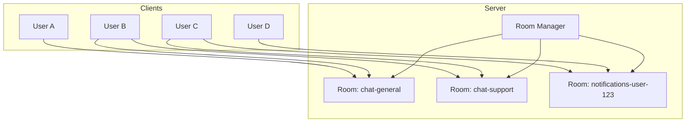
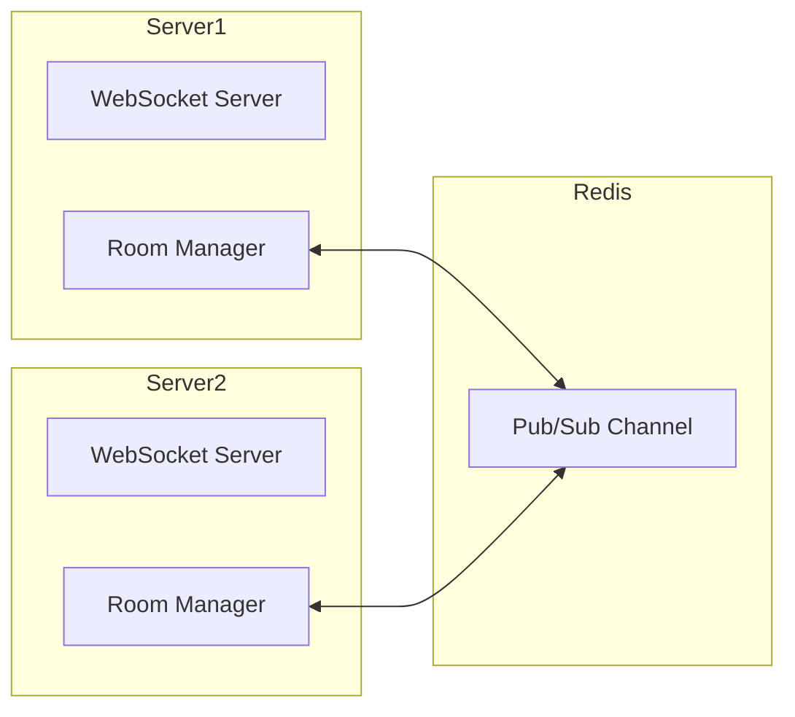

# How to Handle WebSocket Room/Channel Management

Author: [nawazdhandala](https://www.github.com/nawazdhandala)

Tags: WebSocket, Real-time, Node.js, Socket.IO, Architecture, Pub/Sub

Description: A practical guide to implementing room and channel management in WebSocket applications, including patterns for grouping connections, broadcasting messages, and scaling across multiple servers.

---

Room and channel management is essential for building real-time applications where users need to receive targeted messages based on their subscriptions. This guide covers patterns for organizing WebSocket connections into logical groups and broadcasting messages efficiently.

## Understanding Rooms and Channels

Rooms (or channels) are logical groupings of WebSocket connections. Instead of maintaining individual connection references, you assign connections to named rooms and broadcast to all members at once.



## Basic Room Implementation

Here is a pure WebSocket room manager without external dependencies.

```javascript
// room-manager.js
class RoomManager {
  constructor() {
    // Map of room name to Set of WebSocket connections
    this.rooms = new Map();
    // Map of WebSocket to Set of room names
    this.connectionRooms = new Map();
  }

  // Add connection to a room
  join(ws, roomName) {
    // Create room if it does not exist
    if (!this.rooms.has(roomName)) {
      this.rooms.set(roomName, new Set());
    }

    // Add connection to room
    this.rooms.get(roomName).add(ws);

    // Track which rooms this connection is in
    if (!this.connectionRooms.has(ws)) {
      this.connectionRooms.set(ws, new Set());
    }
    this.connectionRooms.get(ws).add(roomName);

    console.log(`Connection joined room: ${roomName}`);
    return true;
  }

  // Remove connection from a room
  leave(ws, roomName) {
    const room = this.rooms.get(roomName);
    if (room) {
      room.delete(ws);

      // Clean up empty rooms
      if (room.size === 0) {
        this.rooms.delete(roomName);
      }
    }

    const wsRooms = this.connectionRooms.get(ws);
    if (wsRooms) {
      wsRooms.delete(roomName);
    }

    console.log(`Connection left room: ${roomName}`);
  }

  // Remove connection from all rooms
  leaveAll(ws) {
    const wsRooms = this.connectionRooms.get(ws);
    if (wsRooms) {
      for (const roomName of wsRooms) {
        const room = this.rooms.get(roomName);
        if (room) {
          room.delete(ws);
          if (room.size === 0) {
            this.rooms.delete(roomName);
          }
        }
      }
      this.connectionRooms.delete(ws);
    }
  }

  // Broadcast to all connections in a room
  broadcast(roomName, message, excludeWs = null) {
    const room = this.rooms.get(roomName);
    if (!room) {
      return 0;
    }

    let count = 0;
    const data = typeof message === 'string' ? message : JSON.stringify(message);

    for (const ws of room) {
      if (ws !== excludeWs && ws.readyState === 1) {  // 1 = OPEN
        ws.send(data);
        count++;
      }
    }

    return count;
  }

  // Get all connections in a room
  getRoom(roomName) {
    return this.rooms.get(roomName) || new Set();
  }

  // Get room count for a connection
  getRooms(ws) {
    return this.connectionRooms.get(ws) || new Set();
  }

  // Get statistics
  getStats() {
    return {
      totalRooms: this.rooms.size,
      totalConnections: this.connectionRooms.size,
      rooms: Array.from(this.rooms.entries()).map(([name, conns]) => ({
        name,
        connections: conns.size
      }))
    };
  }
}

module.exports = RoomManager;
```

## Server Implementation with Room Manager

```javascript
// server.js
const WebSocket = require('ws');
const RoomManager = require('./room-manager');

const wss = new WebSocket.Server({ port: 8080 });
const roomManager = new RoomManager();

wss.on('connection', (ws, req) => {
  // Assign unique ID to connection
  ws.id = generateId();
  console.log(`Client connected: ${ws.id}`);

  ws.on('message', (data) => {
    try {
      const message = JSON.parse(data);
      handleMessage(ws, message);
    } catch (error) {
      ws.send(JSON.stringify({ error: 'Invalid message format' }));
    }
  });

  ws.on('close', () => {
    console.log(`Client disconnected: ${ws.id}`);
    roomManager.leaveAll(ws);
  });

  ws.on('error', (error) => {
    console.error(`WebSocket error for ${ws.id}:`, error.message);
  });
});

function handleMessage(ws, message) {
  switch (message.type) {
    case 'join':
      handleJoin(ws, message);
      break;
    case 'leave':
      handleLeave(ws, message);
      break;
    case 'broadcast':
      handleBroadcast(ws, message);
      break;
    case 'direct':
      handleDirect(ws, message);
      break;
    default:
      ws.send(JSON.stringify({ error: 'Unknown message type' }));
  }
}

function handleJoin(ws, message) {
  const { room } = message;

  if (!room || typeof room !== 'string') {
    ws.send(JSON.stringify({ error: 'Invalid room name' }));
    return;
  }

  roomManager.join(ws, room);

  // Notify the client
  ws.send(JSON.stringify({
    type: 'joined',
    room,
    members: roomManager.getRoom(room).size
  }));

  // Notify others in the room
  roomManager.broadcast(room, {
    type: 'user_joined',
    room,
    userId: ws.id,
    members: roomManager.getRoom(room).size
  }, ws);
}

function handleLeave(ws, message) {
  const { room } = message;

  if (!room) {
    ws.send(JSON.stringify({ error: 'Room name required' }));
    return;
  }

  // Notify others before leaving
  roomManager.broadcast(room, {
    type: 'user_left',
    room,
    userId: ws.id
  }, ws);

  roomManager.leave(ws, room);

  ws.send(JSON.stringify({
    type: 'left',
    room
  }));
}

function handleBroadcast(ws, message) {
  const { room, content } = message;

  if (!room || !content) {
    ws.send(JSON.stringify({ error: 'Room and content required' }));
    return;
  }

  // Check if sender is in the room
  if (!roomManager.getRooms(ws).has(room)) {
    ws.send(JSON.stringify({ error: 'Not a member of this room' }));
    return;
  }

  const count = roomManager.broadcast(room, {
    type: 'message',
    room,
    from: ws.id,
    content,
    timestamp: Date.now()
  });

  ws.send(JSON.stringify({
    type: 'broadcast_sent',
    room,
    recipients: count
  }));
}

function generateId() {
  return Math.random().toString(36).substring(2, 15);
}

console.log('WebSocket server with rooms running on port 8080');
```

## Room Patterns

### Hierarchical Rooms

Organize rooms in a hierarchy for fine-grained subscriptions.

```javascript
// hierarchical-rooms.js
class HierarchicalRoomManager {
  constructor() {
    this.rooms = new Map();
    this.connectionRooms = new Map();
  }

  join(ws, roomPattern) {
    // Store the exact room pattern
    if (!this.rooms.has(roomPattern)) {
      this.rooms.set(roomPattern, new Set());
    }
    this.rooms.get(roomPattern).add(ws);

    if (!this.connectionRooms.has(ws)) {
      this.connectionRooms.set(ws, new Set());
    }
    this.connectionRooms.get(ws).add(roomPattern);
  }

  // Broadcast to rooms matching a pattern
  // e.g., broadcast to "chat:*" reaches "chat:general", "chat:support"
  broadcast(targetRoom, message, excludeWs = null) {
    const data = JSON.stringify(message);
    const sent = new Set();

    for (const [roomPattern, connections] of this.rooms) {
      if (this.matchesPattern(roomPattern, targetRoom)) {
        for (const ws of connections) {
          if (ws !== excludeWs && ws.readyState === 1 && !sent.has(ws)) {
            ws.send(data);
            sent.add(ws);
          }
        }
      }
    }

    return sent.size;
  }

  matchesPattern(subscription, target) {
    // Exact match
    if (subscription === target) return true;

    // Wildcard match
    const subParts = subscription.split(':');
    const targetParts = target.split(':');

    for (let i = 0; i < subParts.length; i++) {
      if (subParts[i] === '*') return true;
      if (subParts[i] !== targetParts[i]) return false;
    }

    return subParts.length === targetParts.length;
  }
}

// Usage example:
// User subscribes to "notifications:*"
// Server broadcasts to "notifications:orders" - user receives it
// Server broadcasts to "notifications:payments" - user receives it
// Server broadcasts to "chat:general" - user does not receive it
```

### Private Rooms with Authentication

```javascript
// private-rooms.js
class PrivateRoomManager {
  constructor() {
    this.rooms = new Map();
    this.connectionRooms = new Map();
    this.roomMetadata = new Map();
  }

  createRoom(roomName, options = {}) {
    if (this.rooms.has(roomName)) {
      return { error: 'Room already exists' };
    }

    this.rooms.set(roomName, new Set());
    this.roomMetadata.set(roomName, {
      owner: options.owner,
      isPrivate: options.isPrivate || false,
      password: options.password || null,
      maxMembers: options.maxMembers || Infinity,
      allowedUsers: new Set(options.allowedUsers || []),
      createdAt: Date.now()
    });

    return { success: true, room: roomName };
  }

  join(ws, roomName, credentials = {}) {
    const metadata = this.roomMetadata.get(roomName);

    if (!metadata) {
      return { error: 'Room does not exist' };
    }

    // Check private room access
    if (metadata.isPrivate) {
      if (metadata.password && credentials.password !== metadata.password) {
        return { error: 'Invalid password' };
      }

      if (metadata.allowedUsers.size > 0 && !metadata.allowedUsers.has(ws.userId)) {
        return { error: 'Access denied' };
      }
    }

    // Check capacity
    const room = this.rooms.get(roomName);
    if (room.size >= metadata.maxMembers) {
      return { error: 'Room is full' };
    }

    room.add(ws);

    if (!this.connectionRooms.has(ws)) {
      this.connectionRooms.set(ws, new Set());
    }
    this.connectionRooms.get(ws).add(roomName);

    return {
      success: true,
      room: roomName,
      members: room.size
    };
  }

  inviteUser(roomName, userId, invitedBy) {
    const metadata = this.roomMetadata.get(roomName);

    if (!metadata) {
      return { error: 'Room does not exist' };
    }

    if (metadata.owner !== invitedBy) {
      return { error: 'Only room owner can invite users' };
    }

    metadata.allowedUsers.add(userId);
    return { success: true };
  }
}
```

## Socket.IO Room Management

Socket.IO provides built-in room support with additional features.

```javascript
// socket-io-rooms.js
const { Server } = require('socket.io');

const io = new Server(3000, {
  cors: {
    origin: '*'
  }
});

io.on('connection', (socket) => {
  console.log(`Client connected: ${socket.id}`);

  // Join a room
  socket.on('join', async (roomName) => {
    // Validate room name
    if (!isValidRoomName(roomName)) {
      socket.emit('error', { message: 'Invalid room name' });
      return;
    }

    // Join the room
    await socket.join(roomName);

    // Get current members
    const members = await io.in(roomName).fetchSockets();

    // Notify the client
    socket.emit('joined', {
      room: roomName,
      members: members.length
    });

    // Notify others in the room
    socket.to(roomName).emit('user_joined', {
      userId: socket.id,
      room: roomName
    });
  });

  // Leave a room
  socket.on('leave', async (roomName) => {
    socket.to(roomName).emit('user_left', {
      userId: socket.id,
      room: roomName
    });

    await socket.leave(roomName);

    socket.emit('left', { room: roomName });
  });

  // Send message to room
  socket.on('message', (data) => {
    const { room, content } = data;

    // Check if in room
    if (!socket.rooms.has(room)) {
      socket.emit('error', { message: 'Not in this room' });
      return;
    }

    // Broadcast to room including sender
    io.in(room).emit('message', {
      from: socket.id,
      room,
      content,
      timestamp: Date.now()
    });
  });

  // Private message to specific user
  socket.on('direct_message', (data) => {
    const { to, content } = data;

    io.to(to).emit('direct_message', {
      from: socket.id,
      content,
      timestamp: Date.now()
    });
  });

  socket.on('disconnect', () => {
    console.log(`Client disconnected: ${socket.id}`);
    // Socket.IO automatically removes from all rooms on disconnect
  });
});

function isValidRoomName(name) {
  return typeof name === 'string' &&
         name.length > 0 &&
         name.length < 100 &&
         /^[a-zA-Z0-9_-]+$/.test(name);
}

// Broadcast to all clients in a namespace
io.emit('announcement', { message: 'Server restarting in 5 minutes' });

// Broadcast to specific room from outside connection handler
function broadcastToRoom(room, event, data) {
  io.to(room).emit(event, data);
}

console.log('Socket.IO server running on port 3000');
```

## Scaling with Redis Pub/Sub

For multi-server deployments, use Redis to synchronize rooms across instances.



```javascript
// redis-room-manager.js
const Redis = require('ioredis');

class RedisRoomManager {
  constructor(redisUrl) {
    // Separate connections for pub and sub
    this.publisher = new Redis(redisUrl);
    this.subscriber = new Redis(redisUrl);

    // Local room tracking
    this.localRooms = new Map();
    this.connectionRooms = new Map();

    // Server identifier
    this.serverId = process.env.SERVER_ID || generateServerId();

    // Subscribe to room messages
    this.setupSubscriber();
  }

  setupSubscriber() {
    this.subscriber.on('message', (channel, message) => {
      const data = JSON.parse(message);

      // Ignore messages from this server
      if (data.serverId === this.serverId) {
        return;
      }

      // Broadcast to local connections in the room
      const room = this.localRooms.get(data.room);
      if (room) {
        for (const ws of room) {
          if (ws.readyState === 1) {
            ws.send(JSON.stringify(data.payload));
          }
        }
      }
    });
  }

  async join(ws, roomName) {
    // Add to local room
    if (!this.localRooms.has(roomName)) {
      this.localRooms.set(roomName, new Set());
      // Subscribe to Redis channel for this room
      await this.subscriber.subscribe(`room:${roomName}`);
    }

    this.localRooms.get(roomName).add(ws);

    if (!this.connectionRooms.has(ws)) {
      this.connectionRooms.set(ws, new Set());
    }
    this.connectionRooms.get(ws).add(roomName);

    // Track global room membership in Redis
    await this.publisher.sadd(`room:${roomName}:servers`, this.serverId);
    await this.publisher.hincrby(`room:${roomName}:counts`, this.serverId, 1);
  }

  async leave(ws, roomName) {
    const room = this.localRooms.get(roomName);
    if (room) {
      room.delete(ws);

      // Update Redis counts
      await this.publisher.hincrby(`room:${roomName}:counts`, this.serverId, -1);

      if (room.size === 0) {
        this.localRooms.delete(roomName);
        await this.subscriber.unsubscribe(`room:${roomName}`);
        await this.publisher.srem(`room:${roomName}:servers`, this.serverId);
        await this.publisher.hdel(`room:${roomName}:counts`, this.serverId);
      }
    }

    const wsRooms = this.connectionRooms.get(ws);
    if (wsRooms) {
      wsRooms.delete(roomName);
    }
  }

  async leaveAll(ws) {
    const rooms = this.connectionRooms.get(ws);
    if (rooms) {
      for (const roomName of rooms) {
        await this.leave(ws, roomName);
      }
      this.connectionRooms.delete(ws);
    }
  }

  async broadcast(roomName, message, excludeWs = null) {
    const payload = {
      type: 'message',
      room: roomName,
      ...message,
      timestamp: Date.now()
    };

    // Broadcast to local connections
    const room = this.localRooms.get(roomName);
    if (room) {
      for (const ws of room) {
        if (ws !== excludeWs && ws.readyState === 1) {
          ws.send(JSON.stringify(payload));
        }
      }
    }

    // Publish to Redis for other servers
    await this.publisher.publish(`room:${roomName}`, JSON.stringify({
      serverId: this.serverId,
      room: roomName,
      payload
    }));
  }

  async getRoomCount(roomName) {
    const counts = await this.publisher.hgetall(`room:${roomName}:counts`);
    return Object.values(counts).reduce((sum, count) => sum + parseInt(count, 10), 0);
  }
}

function generateServerId() {
  return `server-${process.pid}-${Date.now()}`;
}

module.exports = RedisRoomManager;
```

## Client Implementation

```javascript
// client.js
class RoomClient {
  constructor(url) {
    this.url = url;
    this.ws = null;
    this.rooms = new Set();
    this.handlers = new Map();
  }

  connect() {
    return new Promise((resolve, reject) => {
      this.ws = new WebSocket(this.url);

      this.ws.onopen = () => {
        console.log('Connected to server');
        resolve();
      };

      this.ws.onerror = (error) => {
        reject(error);
      };

      this.ws.onmessage = (event) => {
        const message = JSON.parse(event.data);
        this.handleMessage(message);
      };

      this.ws.onclose = () => {
        console.log('Disconnected from server');
        this.rooms.clear();
      };
    });
  }

  handleMessage(message) {
    const handler = this.handlers.get(message.type);
    if (handler) {
      handler(message);
    }
  }

  on(type, handler) {
    this.handlers.set(type, handler);
  }

  join(roomName) {
    this.send({ type: 'join', room: roomName });
    this.rooms.add(roomName);
  }

  leave(roomName) {
    this.send({ type: 'leave', room: roomName });
    this.rooms.delete(roomName);
  }

  broadcast(roomName, content) {
    this.send({
      type: 'broadcast',
      room: roomName,
      content
    });
  }

  send(message) {
    if (this.ws && this.ws.readyState === WebSocket.OPEN) {
      this.ws.send(JSON.stringify(message));
    }
  }
}

// Usage
const client = new RoomClient('ws://localhost:8080');

client.on('joined', (data) => {
  console.log(`Joined room ${data.room} with ${data.members} members`);
});

client.on('message', (data) => {
  console.log(`[${data.room}] ${data.from}: ${data.content}`);
});

client.on('user_joined', (data) => {
  console.log(`User ${data.userId} joined ${data.room}`);
});

client.connect().then(() => {
  client.join('chat-general');
  client.broadcast('chat-general', 'Hello everyone!');
});
```

Effective room management is the foundation of scalable real-time applications. Start with a simple in-memory solution for single-server deployments, then add Redis when you need to scale horizontally. The patterns shown here work for chat applications, collaborative editing, live dashboards, and multiplayer games.
