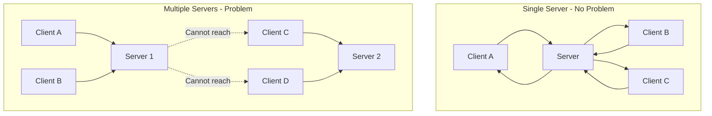
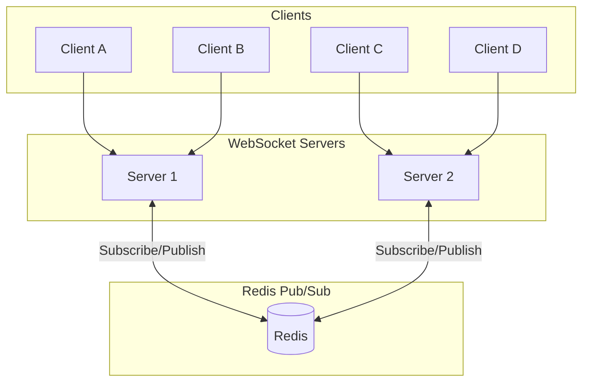
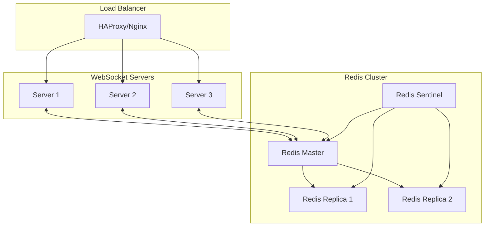

# How to Handle WebSocket Scaling with Redis Pub/Sub

Author: [nawazdhandala](https://www.github.com/nawazdhandala)

Tags: WebSocket, Redis, Pub/Sub, Scaling, Node.js, Distributed Systems, Real-time

Description: A practical guide to scaling WebSocket applications across multiple servers using Redis Pub/Sub for message broadcasting and state synchronization.

---

When your WebSocket application grows beyond a single server, you face a fundamental challenge: clients connected to different servers cannot communicate directly. Redis Pub/Sub solves this by providing a message broker that enables all servers to share messages. This guide covers implementing scalable WebSocket architecture with Redis.

## The Scaling Challenge



When Client A sends a message that should reach all clients, Server 1 can only deliver it to clients connected to itself (A and B), not to clients on Server 2 (C and D).

## Architecture with Redis Pub/Sub



## Basic Implementation

Here is a foundational implementation of WebSocket scaling with Redis:

```javascript
// Server-side: Basic Redis Pub/Sub WebSocket scaling
const WebSocket = require('ws');
const Redis = require('ioredis');
const http = require('http');

// Create Redis clients (need separate connections for pub and sub)
const redisPublisher = new Redis({
    host: process.env.REDIS_HOST || 'localhost',
    port: process.env.REDIS_PORT || 6379,
    password: process.env.REDIS_PASSWORD
});

const redisSubscriber = new Redis({
    host: process.env.REDIS_HOST || 'localhost',
    port: process.env.REDIS_PORT || 6379,
    password: process.env.REDIS_PASSWORD
});

// Create WebSocket server
const server = http.createServer();
const wss = new WebSocket.Server({ server });

// Server identifier for debugging
const SERVER_ID = process.env.SERVER_ID || `server-${process.pid}`;

// Channel name for broadcasting
const BROADCAST_CHANNEL = 'websocket:broadcast';

// Subscribe to Redis channel
redisSubscriber.subscribe(BROADCAST_CHANNEL, function(err) {
    if (err) {
        console.error('Failed to subscribe to Redis channel:', err);
        process.exit(1);
    }
    console.log(`${SERVER_ID} subscribed to ${BROADCAST_CHANNEL}`);
});

// Handle messages from Redis
redisSubscriber.on('message', function(channel, message) {
    if (channel === BROADCAST_CHANNEL) {
        const data = JSON.parse(message);

        // Skip messages from this server to avoid double-delivery
        if (data.serverId === SERVER_ID) {
            return;
        }

        console.log(`${SERVER_ID} received broadcast from ${data.serverId}`);

        // Broadcast to all local clients
        wss.clients.forEach(function(client) {
            if (client.readyState === WebSocket.OPEN) {
                client.send(JSON.stringify(data.payload));
            }
        });
    }
});

// Handle WebSocket connections
wss.on('connection', function(ws, request) {
    console.log(`${SERVER_ID}: Client connected`);

    ws.on('message', function(message) {
        const data = JSON.parse(message);

        if (data.type === 'broadcast') {
            // Publish to Redis for all servers
            redisPublisher.publish(BROADCAST_CHANNEL, JSON.stringify({
                serverId: SERVER_ID,
                payload: data.payload
            }));

            // Also send to local clients
            wss.clients.forEach(function(client) {
                if (client.readyState === WebSocket.OPEN) {
                    client.send(JSON.stringify(data.payload));
                }
            });
        }
    });

    ws.on('close', function() {
        console.log(`${SERVER_ID}: Client disconnected`);
    });
});

const PORT = process.env.PORT || 8080;
server.listen(PORT, function() {
    console.log(`${SERVER_ID} listening on port ${PORT}`);
});
```

## Channel-Based Rooms/Topics

Most applications need to broadcast to specific groups (rooms, topics, channels) rather than all clients:

```javascript
// Server-side: Room-based WebSocket scaling
const WebSocket = require('ws');
const Redis = require('ioredis');

const redisPublisher = new Redis(process.env.REDIS_URL);
const redisSubscriber = new Redis(process.env.REDIS_URL);

const wss = new WebSocket.Server({ port: 8080 });
const SERVER_ID = `server-${process.pid}`;

// Track room subscriptions
const roomSubscriptions = new Map(); // roomId -> Set of WebSocket clients
const subscribedChannels = new Set(); // Redis channels we're subscribed to

class RoomManager {
    constructor() {
        this.setupRedisHandler();
    }

    setupRedisHandler() {
        redisSubscriber.on('message', (channel, message) => {
            // Extract room ID from channel name
            const roomId = channel.replace('room:', '');
            const data = JSON.parse(message);

            // Skip our own messages
            if (data.serverId === SERVER_ID) {
                return;
            }

            // Deliver to local clients in this room
            const clients = roomSubscriptions.get(roomId);
            if (clients) {
                clients.forEach(client => {
                    if (client.readyState === WebSocket.OPEN) {
                        client.send(JSON.stringify(data.payload));
                    }
                });
            }
        });
    }

    async joinRoom(ws, roomId) {
        // Add client to local room tracking
        if (!roomSubscriptions.has(roomId)) {
            roomSubscriptions.set(roomId, new Set());
        }
        roomSubscriptions.get(roomId).add(ws);

        // Track which rooms this client is in
        if (!ws.rooms) {
            ws.rooms = new Set();
        }
        ws.rooms.add(roomId);

        // Subscribe to Redis channel if not already
        const channel = `room:${roomId}`;
        if (!subscribedChannels.has(channel)) {
            await redisSubscriber.subscribe(channel);
            subscribedChannels.add(channel);
            console.log(`${SERVER_ID} subscribed to ${channel}`);
        }

        // Notify room about new member
        this.broadcastToRoom(roomId, {
            type: 'user_joined',
            roomId: roomId,
            timestamp: Date.now()
        });
    }

    leaveRoom(ws, roomId) {
        const clients = roomSubscriptions.get(roomId);
        if (clients) {
            clients.delete(ws);

            // Clean up empty rooms
            if (clients.size === 0) {
                roomSubscriptions.delete(roomId);
                // Optionally unsubscribe from Redis channel
                // But keeping subscription is usually fine
            }
        }

        if (ws.rooms) {
            ws.rooms.delete(roomId);
        }

        // Notify room about member leaving
        this.broadcastToRoom(roomId, {
            type: 'user_left',
            roomId: roomId,
            timestamp: Date.now()
        });
    }

    leaveAllRooms(ws) {
        if (ws.rooms) {
            ws.rooms.forEach(roomId => {
                this.leaveRoom(ws, roomId);
            });
        }
    }

    broadcastToRoom(roomId, payload) {
        const channel = `room:${roomId}`;

        // Publish to Redis for other servers
        redisPublisher.publish(channel, JSON.stringify({
            serverId: SERVER_ID,
            payload: payload
        }));

        // Deliver to local clients
        const clients = roomSubscriptions.get(roomId);
        if (clients) {
            const message = JSON.stringify(payload);
            clients.forEach(client => {
                if (client.readyState === WebSocket.OPEN) {
                    client.send(message);
                }
            });
        }
    }
}

const roomManager = new RoomManager();

wss.on('connection', function(ws) {
    ws.on('message', function(data) {
        const message = JSON.parse(data);

        switch (message.type) {
            case 'join':
                roomManager.joinRoom(ws, message.roomId);
                break;

            case 'leave':
                roomManager.leaveRoom(ws, message.roomId);
                break;

            case 'message':
                roomManager.broadcastToRoom(message.roomId, {
                    type: 'message',
                    roomId: message.roomId,
                    content: message.content,
                    timestamp: Date.now()
                });
                break;
        }
    });

    ws.on('close', function() {
        roomManager.leaveAllRooms(ws);
    });
});
```

## User Presence Across Servers

Track which users are online across all servers:

```javascript
// Server-side: Distributed user presence with Redis
const WebSocket = require('ws');
const Redis = require('ioredis');

const redis = new Redis(process.env.REDIS_URL);
const redisSubscriber = new Redis(process.env.REDIS_URL);

const wss = new WebSocket.Server({ port: 8080 });
const SERVER_ID = `server-${process.pid}`;

// Presence TTL in seconds
const PRESENCE_TTL = 60;
const PRESENCE_REFRESH_INTERVAL = 30000; // 30 seconds

class PresenceManager {
    constructor() {
        this.localUsers = new Map(); // userId -> WebSocket
        this.presenceTimers = new Map(); // userId -> timer

        // Subscribe to presence changes
        redisSubscriber.subscribe('presence:updates');
        redisSubscriber.on('message', (channel, message) => {
            if (channel === 'presence:updates') {
                this.handlePresenceUpdate(JSON.parse(message));
            }
        });
    }

    async userConnected(ws, userId) {
        // Store locally
        this.localUsers.set(userId, ws);
        ws.userId = userId;

        // Store in Redis with TTL
        const key = `presence:${userId}`;
        await redis.hset(key, {
            serverId: SERVER_ID,
            connectedAt: Date.now(),
            lastSeen: Date.now()
        });
        await redis.expire(key, PRESENCE_TTL);

        // Start presence refresh timer
        this.startPresenceRefresh(userId);

        // Publish presence update
        await redis.publish('presence:updates', JSON.stringify({
            type: 'connected',
            userId: userId,
            serverId: SERVER_ID
        }));

        console.log(`User ${userId} connected on ${SERVER_ID}`);
    }

    async userDisconnected(userId) {
        // Remove locally
        this.localUsers.delete(userId);

        // Stop refresh timer
        this.stopPresenceRefresh(userId);

        // Remove from Redis
        await redis.del(`presence:${userId}`);

        // Publish presence update
        await redis.publish('presence:updates', JSON.stringify({
            type: 'disconnected',
            userId: userId,
            serverId: SERVER_ID
        }));

        console.log(`User ${userId} disconnected from ${SERVER_ID}`);
    }

    startPresenceRefresh(userId) {
        const timer = setInterval(async () => {
            const key = `presence:${userId}`;
            await redis.hset(key, 'lastSeen', Date.now());
            await redis.expire(key, PRESENCE_TTL);
        }, PRESENCE_REFRESH_INTERVAL);

        this.presenceTimers.set(userId, timer);
    }

    stopPresenceRefresh(userId) {
        const timer = this.presenceTimers.get(userId);
        if (timer) {
            clearInterval(timer);
            this.presenceTimers.delete(userId);
        }
    }

    async getOnlineUsers() {
        // Get all presence keys
        const keys = await redis.keys('presence:*');
        const users = [];

        for (const key of keys) {
            const data = await redis.hgetall(key);
            const userId = key.replace('presence:', '');
            users.push({
                userId: userId,
                serverId: data.serverId,
                connectedAt: parseInt(data.connectedAt),
                lastSeen: parseInt(data.lastSeen)
            });
        }

        return users;
    }

    async isUserOnline(userId) {
        const exists = await redis.exists(`presence:${userId}`);
        return exists === 1;
    }

    async getUserServer(userId) {
        const data = await redis.hgetall(`presence:${userId}`);
        return data.serverId || null;
    }

    handlePresenceUpdate(update) {
        // Notify local clients about presence changes
        const message = JSON.stringify({
            type: 'presence',
            ...update
        });

        this.localUsers.forEach((ws) => {
            if (ws.readyState === WebSocket.OPEN) {
                ws.send(message);
            }
        });
    }

    // Send message to specific user (wherever they are)
    async sendToUser(userId, payload) {
        // Check if user is local
        const localWs = this.localUsers.get(userId);
        if (localWs && localWs.readyState === WebSocket.OPEN) {
            localWs.send(JSON.stringify(payload));
            return true;
        }

        // User might be on another server - publish targeted message
        await redis.publish(`user:${userId}`, JSON.stringify({
            serverId: SERVER_ID,
            payload: payload
        }));

        return true;
    }
}

const presenceManager = new PresenceManager();

// Subscribe to user-specific channels for targeted messages
wss.on('connection', async function(ws) {
    ws.on('message', async function(data) {
        const message = JSON.parse(data);

        switch (message.type) {
            case 'auth':
                await presenceManager.userConnected(ws, message.userId);

                // Subscribe to user's personal channel
                const userChannel = `user:${message.userId}`;
                redisSubscriber.subscribe(userChannel);
                break;

            case 'get_online_users':
                const users = await presenceManager.getOnlineUsers();
                ws.send(JSON.stringify({
                    type: 'online_users',
                    users: users
                }));
                break;

            case 'direct_message':
                await presenceManager.sendToUser(message.toUserId, {
                    type: 'direct_message',
                    fromUserId: ws.userId,
                    content: message.content
                });
                break;
        }
    });

    ws.on('close', async function() {
        if (ws.userId) {
            await presenceManager.userDisconnected(ws.userId);
        }
    });
});
```

## Message Ordering and Delivery Guarantees

For applications requiring message ordering, use Redis Streams:

```javascript
// Server-side: Using Redis Streams for ordered messages
const WebSocket = require('ws');
const Redis = require('ioredis');

const redis = new Redis(process.env.REDIS_URL);
const wss = new WebSocket.Server({ port: 8080 });
const SERVER_ID = `server-${process.pid}`;

class OrderedMessageBroker {
    constructor() {
        this.consumers = new Map(); // streamName -> consumer group info
        this.lastIds = new Map(); // streamName -> last processed ID
    }

    async publishMessage(streamName, message) {
        // Add message to Redis Stream
        const messageId = await redis.xadd(
            `stream:${streamName}`,
            '*', // Auto-generate ID
            'data', JSON.stringify({
                serverId: SERVER_ID,
                payload: message,
                timestamp: Date.now()
            })
        );

        return messageId;
    }

    async startConsuming(streamName, callback) {
        const stream = `stream:${streamName}`;
        const groupName = `ws-servers`;
        const consumerName = SERVER_ID;

        // Create consumer group if it does not exist
        try {
            await redis.xgroup('CREATE', stream, groupName, '0', 'MKSTREAM');
        } catch (err) {
            // Group already exists, which is fine
        }

        // Start consuming loop
        this.consumeLoop(stream, groupName, consumerName, callback);
    }

    async consumeLoop(stream, groupName, consumerName, callback) {
        while (true) {
            try {
                // Read new messages (block for up to 5 seconds)
                const results = await redis.xreadgroup(
                    'GROUP', groupName, consumerName,
                    'COUNT', 10,
                    'BLOCK', 5000,
                    'STREAMS', stream, '>'
                );

                if (results) {
                    for (const [streamName, messages] of results) {
                        for (const [id, fields] of messages) {
                            const data = JSON.parse(fields[1]); // fields = ['data', jsonString]

                            // Skip messages from this server
                            if (data.serverId !== SERVER_ID) {
                                await callback(data.payload);
                            }

                            // Acknowledge message
                            await redis.xack(stream, groupName, id);
                        }
                    }
                }
            } catch (err) {
                console.error('Error consuming stream:', err);
                await new Promise(resolve => setTimeout(resolve, 1000));
            }
        }
    }

    async getMessageHistory(streamName, count = 50) {
        const stream = `stream:${streamName}`;
        const messages = await redis.xrevrange(stream, '+', '-', 'COUNT', count);

        return messages.map(([id, fields]) => {
            const data = JSON.parse(fields[1]);
            return {
                id: id,
                ...data.payload,
                timestamp: data.timestamp
            };
        }).reverse(); // Return in chronological order
    }
}

const broker = new OrderedMessageBroker();

// Track room subscriptions
const roomClients = new Map();

wss.on('connection', function(ws) {
    ws.on('message', async function(data) {
        const message = JSON.parse(data);

        switch (message.type) {
            case 'join':
                const roomId = message.roomId;

                // Add to local tracking
                if (!roomClients.has(roomId)) {
                    roomClients.set(roomId, new Set());

                    // Start consuming this room's stream
                    broker.startConsuming(roomId, function(payload) {
                        // Deliver to local clients
                        const clients = roomClients.get(roomId);
                        if (clients) {
                            const msg = JSON.stringify(payload);
                            clients.forEach(client => {
                                if (client.readyState === WebSocket.OPEN) {
                                    client.send(msg);
                                }
                            });
                        }
                    });
                }

                roomClients.get(roomId).add(ws);
                ws.roomId = roomId;

                // Send message history
                const history = await broker.getMessageHistory(roomId, 50);
                ws.send(JSON.stringify({
                    type: 'history',
                    messages: history
                }));
                break;

            case 'message':
                // Publish to stream
                await broker.publishMessage(ws.roomId, {
                    type: 'message',
                    content: message.content,
                    userId: ws.userId
                });

                // Also deliver locally
                const clients = roomClients.get(ws.roomId);
                if (clients) {
                    const msg = JSON.stringify({
                        type: 'message',
                        content: message.content,
                        userId: ws.userId
                    });
                    clients.forEach(client => {
                        if (client.readyState === WebSocket.OPEN) {
                            client.send(msg);
                        }
                    });
                }
                break;
        }
    });

    ws.on('close', function() {
        if (ws.roomId) {
            const clients = roomClients.get(ws.roomId);
            if (clients) {
                clients.delete(ws);
            }
        }
    });
});
```

## High Availability Architecture



```javascript
// Server-side: Redis Sentinel configuration for HA
const Redis = require('ioredis');

// Connect via Sentinel for automatic failover
const redis = new Redis({
    sentinels: [
        { host: 'sentinel-1.example.com', port: 26379 },
        { host: 'sentinel-2.example.com', port: 26379 },
        { host: 'sentinel-3.example.com', port: 26379 }
    ],
    name: 'mymaster', // Master name in Sentinel config
    password: process.env.REDIS_PASSWORD,

    // Reconnection settings
    retryStrategy: function(times) {
        const delay = Math.min(times * 50, 2000);
        return delay;
    },

    // Read from replicas for scaling reads
    // Use 'master' for writes
    role: 'master'
});

// Create separate connection for subscriptions
const redisSubscriber = new Redis({
    sentinels: [
        { host: 'sentinel-1.example.com', port: 26379 },
        { host: 'sentinel-2.example.com', port: 26379 },
        { host: 'sentinel-3.example.com', port: 26379 }
    ],
    name: 'mymaster',
    password: process.env.REDIS_PASSWORD
});

// Handle Redis connection events
redis.on('connect', function() {
    console.log('Connected to Redis master');
});

redis.on('error', function(err) {
    console.error('Redis error:', err);
});

redis.on('reconnecting', function() {
    console.log('Reconnecting to Redis...');
});

// Handle failover
redis.on('+switch-master', function(data) {
    console.log('Redis master switched:', data);
});
```

## Performance Optimization

Optimize Redis operations for high-throughput WebSocket applications:

```javascript
// Server-side: Optimized message batching
const WebSocket = require('ws');
const Redis = require('ioredis');

const redis = new Redis(process.env.REDIS_URL);
const redisSubscriber = new Redis(process.env.REDIS_URL);

const wss = new WebSocket.Server({ port: 8080 });
const SERVER_ID = `server-${process.pid}`;

class OptimizedBroadcaster {
    constructor() {
        this.messageBuffer = new Map(); // channel -> messages[]
        this.flushInterval = 50; // Batch messages every 50ms

        // Start flush timer
        setInterval(() => this.flushBuffers(), this.flushInterval);
    }

    queueMessage(channel, message) {
        if (!this.messageBuffer.has(channel)) {
            this.messageBuffer.set(channel, []);
        }
        this.messageBuffer.get(channel).push(message);
    }

    async flushBuffers() {
        if (this.messageBuffer.size === 0) {
            return;
        }

        // Use pipeline for batch publishing
        const pipeline = redis.pipeline();

        this.messageBuffer.forEach((messages, channel) => {
            if (messages.length > 0) {
                // Batch multiple messages into one publish
                pipeline.publish(channel, JSON.stringify({
                    serverId: SERVER_ID,
                    batch: messages
                }));
            }
        });

        // Clear buffers
        this.messageBuffer.clear();

        // Execute pipeline
        await pipeline.exec();
    }
}

class OptimizedReceiver {
    constructor() {
        this.deliveryBuffer = new Map(); // ws -> messages[]
        this.flushInterval = 50;

        setInterval(() => this.flushDeliveries(), this.flushInterval);
    }

    queueDelivery(ws, message) {
        if (!this.deliveryBuffer.has(ws)) {
            this.deliveryBuffer.set(ws, []);
        }
        this.deliveryBuffer.get(ws).push(message);
    }

    flushDeliveries() {
        this.deliveryBuffer.forEach((messages, ws) => {
            if (ws.readyState === WebSocket.OPEN && messages.length > 0) {
                // Send batch as array
                ws.send(JSON.stringify({
                    type: 'batch',
                    messages: messages
                }));
            }
        });

        this.deliveryBuffer.clear();
    }
}

const broadcaster = new OptimizedBroadcaster();
const receiver = new OptimizedReceiver();

// Handle Redis messages with batching
redisSubscriber.on('message', function(channel, message) {
    const data = JSON.parse(message);

    if (data.serverId === SERVER_ID) {
        return;
    }

    // Get local clients for this channel
    const clients = getClientsForChannel(channel);

    // Handle batched messages
    const messages = data.batch || [data.payload];

    clients.forEach(function(ws) {
        messages.forEach(function(msg) {
            receiver.queueDelivery(ws, msg);
        });
    });
});

function getClientsForChannel(channel) {
    // Return clients subscribed to this channel
    return [];
}

// Usage: Queue messages instead of immediate publish
function broadcastToChannel(channel, message) {
    broadcaster.queueMessage(channel, message);
}
```

## Monitoring and Metrics

Track Redis Pub/Sub performance:

```javascript
// Server-side: Redis Pub/Sub metrics
const WebSocket = require('ws');
const Redis = require('ioredis');

const redis = new Redis(process.env.REDIS_URL);
const SERVER_ID = `server-${process.pid}`;

class MetricsCollector {
    constructor() {
        this.metrics = {
            messagesPublished: 0,
            messagesReceived: 0,
            publishLatencySum: 0,
            publishCount: 0,
            deliveryLatencySum: 0,
            deliveryCount: 0,
            errors: 0
        };

        // Report metrics every minute
        setInterval(() => this.reportMetrics(), 60000);
    }

    recordPublish(latencyMs) {
        this.metrics.messagesPublished++;
        this.metrics.publishLatencySum += latencyMs;
        this.metrics.publishCount++;
    }

    recordReceive() {
        this.metrics.messagesReceived++;
    }

    recordDelivery(latencyMs) {
        this.metrics.deliveryLatencySum += latencyMs;
        this.metrics.deliveryCount++;
    }

    recordError() {
        this.metrics.errors++;
    }

    getAveragePublishLatency() {
        return this.metrics.publishCount > 0
            ? this.metrics.publishLatencySum / this.metrics.publishCount
            : 0;
    }

    getAverageDeliveryLatency() {
        return this.metrics.deliveryCount > 0
            ? this.metrics.deliveryLatencySum / this.metrics.deliveryCount
            : 0;
    }

    async reportMetrics() {
        const report = {
            serverId: SERVER_ID,
            timestamp: Date.now(),
            messagesPublished: this.metrics.messagesPublished,
            messagesReceived: this.metrics.messagesReceived,
            avgPublishLatencyMs: this.getAveragePublishLatency().toFixed(2),
            avgDeliveryLatencyMs: this.getAverageDeliveryLatency().toFixed(2),
            errors: this.metrics.errors
        };

        console.log('Metrics:', report);

        // Store in Redis for aggregation
        await redis.hset(`metrics:${SERVER_ID}`, {
            ...report,
            updatedAt: Date.now()
        });
        await redis.expire(`metrics:${SERVER_ID}`, 300); // 5 minute TTL

        // Reset counters
        this.metrics.messagesPublished = 0;
        this.metrics.messagesReceived = 0;
        this.metrics.publishLatencySum = 0;
        this.metrics.publishCount = 0;
        this.metrics.deliveryLatencySum = 0;
        this.metrics.deliveryCount = 0;
        this.metrics.errors = 0;
    }

    async getClusterMetrics() {
        const keys = await redis.keys('metrics:*');
        const metrics = [];

        for (const key of keys) {
            const data = await redis.hgetall(key);
            metrics.push(data);
        }

        return metrics;
    }
}

const metricsCollector = new MetricsCollector();

// Use in publish flow
async function publishWithMetrics(channel, message) {
    const startTime = Date.now();

    try {
        await redis.publish(channel, JSON.stringify(message));
        metricsCollector.recordPublish(Date.now() - startTime);
    } catch (error) {
        metricsCollector.recordError();
        throw error;
    }
}
```

## Summary

Scaling WebSocket applications with Redis Pub/Sub involves:

1. Basic Pub/Sub for broadcasting messages across servers
2. Channel-based rooms for group messaging
3. User presence tracking with TTL-based keys
4. Redis Streams for ordered message delivery and history
5. High availability setup with Redis Sentinel or Cluster
6. Performance optimization through batching and pipelining
7. Comprehensive metrics for monitoring

Redis Pub/Sub provides a reliable and performant foundation for scaling WebSocket applications. Choose the right patterns based on your requirements: simple Pub/Sub for basic broadcasting, Streams for ordering guarantees, and proper HA configuration for production deployments.
