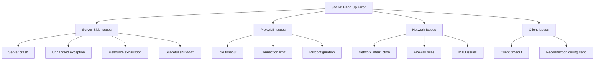
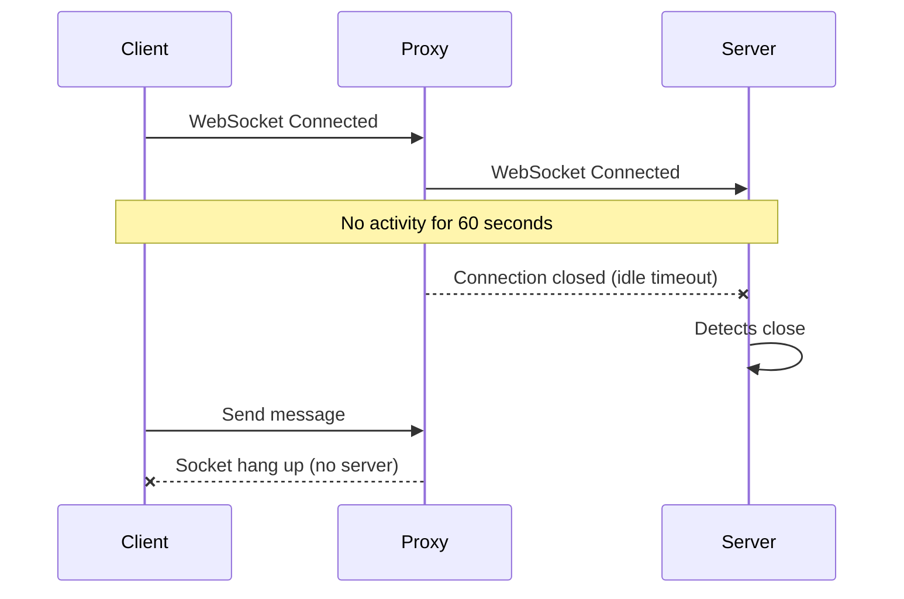

# How to Fix "Socket Hang Up" WebSocket Errors

Author: [nawazdhandala](https://www.github.com/nawazdhandala)

Tags: WebSocket, Debugging, Node.js, Python, Connection Errors, Networking, Troubleshooting

Description: A practical guide to diagnosing and fixing "Socket Hang Up" errors in WebSocket applications caused by abrupt disconnections, timeouts, and server-side issues.

---

> The "Socket Hang Up" error occurs when a TCP connection is unexpectedly terminated by the remote end without a proper close handshake. In WebSocket applications, this typically means the server closed the connection abruptly, a proxy terminated the connection, or a network issue interrupted communication.

Understanding why sockets hang up requires examining the full connection lifecycle from client to server, including any intermediaries like load balancers and proxies.

---

## Common Causes of Socket Hang Up



---

## Server-Side Causes and Solutions

### 1. Unhandled Exceptions Crashing the Server

```javascript
// BAD: Unhandled error crashes the entire server
const WebSocket = require('ws');

const wss = new WebSocket.Server({ port: 8080 });

wss.on('connection', (ws) => {
    ws.on('message', (data) => {
        // If JSON.parse fails, uncaught exception crashes server
        // All clients get "socket hang up"
        const message = JSON.parse(data);
        processMessage(message);
    });
});

// GOOD: Proper error handling prevents crashes
const WebSocket = require('ws');

const wss = new WebSocket.Server({ port: 8080 });

// Global error handlers to prevent crashes
process.on('uncaughtException', (error) => {
    console.error('Uncaught exception:', error);
    // Log but don't exit - let connections continue
});

process.on('unhandledRejection', (reason, promise) => {
    console.error('Unhandled rejection:', reason);
});

wss.on('connection', (ws) => {
    ws.on('message', (data) => {
        try {
            const message = JSON.parse(data);
            processMessage(message);
        } catch (error) {
            console.error('Message processing error:', error);
            // Send error to client instead of crashing
            ws.send(JSON.stringify({
                type: 'error',
                message: 'Invalid message format'
            }));
        }
    });

    ws.on('error', (error) => {
        // Handle per-connection errors
        console.error('WebSocket error:', error);
    });
});

// Graceful shutdown handler
process.on('SIGTERM', () => {
    console.log('Received SIGTERM, closing connections gracefully');

    wss.clients.forEach((client) => {
        // Send close frame with reason
        client.close(1001, 'Server shutting down');
    });

    // Give clients time to receive close frame
    setTimeout(() => {
        process.exit(0);
    }, 5000);
});
```

### 2. Resource Exhaustion

```javascript
const WebSocket = require('ws');
const v8 = require('v8');

const wss = new WebSocket.Server({
    port: 8080,
    // Limit max connections to prevent resource exhaustion
    maxPayload: 1024 * 1024, // 1MB max message
    clientTracking: true
});

// Monitor memory usage
setInterval(() => {
    const heapStats = v8.getHeapStatistics();
    const usedHeapPercent = (heapStats.used_heap_size / heapStats.heap_size_limit) * 100;

    console.log({
        connections: wss.clients.size,
        heapUsedPercent: usedHeapPercent.toFixed(2),
        heapUsedMB: (heapStats.used_heap_size / 1024 / 1024).toFixed(2)
    });

    // Shed load if memory is critical
    if (usedHeapPercent > 90) {
        console.warn('Memory critical, closing oldest connections');
        shedOldestConnections(wss, 10);
    }
}, 30000);

function shedOldestConnections(wss, count) {
    const clients = Array.from(wss.clients);
    // Sort by connection time (requires tracking)
    clients
        .sort((a, b) => a.connectedAt - b.connectedAt)
        .slice(0, count)
        .forEach((client) => {
            client.close(1013, 'Server overloaded, try reconnecting');
        });
}

// Limit concurrent connections per IP
const connectionsPerIP = new Map();
const MAX_CONNECTIONS_PER_IP = 10;

wss.on('connection', (ws, req) => {
    const ip = req.socket.remoteAddress;
    const currentCount = connectionsPerIP.get(ip) || 0;

    if (currentCount >= MAX_CONNECTIONS_PER_IP) {
        ws.close(1008, 'Too many connections from your IP');
        return;
    }

    connectionsPerIP.set(ip, currentCount + 1);
    ws.connectedAt = Date.now();
    ws.clientIP = ip;

    ws.on('close', () => {
        const count = connectionsPerIP.get(ip) || 1;
        if (count <= 1) {
            connectionsPerIP.delete(ip);
        } else {
            connectionsPerIP.set(ip, count - 1);
        }
    });
});
```

### 3. Server Timeout Configuration

```javascript
const WebSocket = require('ws');
const http = require('http');

// Create HTTP server with proper timeouts
const server = http.createServer();

// These timeouts affect WebSocket connections
server.timeout = 0; // Disable HTTP timeout for WebSocket
server.keepAliveTimeout = 0; // Disable keep-alive timeout
server.headersTimeout = 60000; // 60 seconds for headers

const wss = new WebSocket.Server({ server });

wss.on('connection', (ws) => {
    // Implement application-level keepalive
    ws.isAlive = true;

    ws.on('pong', () => {
        ws.isAlive = true;
    });

    ws.on('message', () => {
        ws.isAlive = true;
    });
});

// Ping clients to keep connections alive
const interval = setInterval(() => {
    wss.clients.forEach((ws) => {
        if (ws.isAlive === false) {
            console.log('Terminating unresponsive connection');
            return ws.terminate();
        }

        ws.isAlive = false;
        ws.ping();
    });
}, 30000);

wss.on('close', () => {
    clearInterval(interval);
});

server.listen(8080);
```

---

## Proxy and Load Balancer Issues

### Idle Timeout Causing Disconnections



**Solution: Configure Proxy Timeouts**

```nginx
# Nginx - Increase timeouts significantly
location /ws {
    proxy_pass http://backend;
    proxy_http_version 1.1;
    proxy_set_header Upgrade $http_upgrade;
    proxy_set_header Connection "upgrade";

    # Critical: Long timeouts for WebSocket
    proxy_connect_timeout 7d;
    proxy_send_timeout 7d;
    proxy_read_timeout 7d;
}
```

**Solution: Implement Application-Level Heartbeat**

```javascript
// Server-side heartbeat
const WebSocket = require('ws');

const wss = new WebSocket.Server({ port: 8080 });

const HEARTBEAT_INTERVAL = 25000; // 25 seconds (less than typical 30s proxy timeout)

wss.on('connection', (ws) => {
    ws.isAlive = true;

    // Send ping every 25 seconds to keep connection alive
    const heartbeat = setInterval(() => {
        if (ws.readyState === WebSocket.OPEN) {
            ws.ping();
        }
    }, HEARTBEAT_INTERVAL);

    ws.on('pong', () => {
        ws.isAlive = true;
    });

    ws.on('close', () => {
        clearInterval(heartbeat);
    });

    ws.on('error', () => {
        clearInterval(heartbeat);
    });
});

// Client-side heartbeat
class WebSocketClient {
    constructor(url) {
        this.url = url;
        this.heartbeatInterval = null;
        this.connect();
    }

    connect() {
        this.ws = new WebSocket(this.url);

        this.ws.onopen = () => {
            console.log('Connected');
            this.startHeartbeat();
        };

        this.ws.onclose = (event) => {
            console.log('Disconnected:', event.code, event.reason);
            this.stopHeartbeat();

            // Reconnect unless intentionally closed
            if (event.code !== 1000) {
                setTimeout(() => this.connect(), 3000);
            }
        };

        this.ws.onerror = (error) => {
            console.error('WebSocket error:', error);
        };

        this.ws.onmessage = (event) => {
            if (event.data === 'pong') {
                return; // Heartbeat response
            }
            this.handleMessage(event.data);
        };
    }

    startHeartbeat() {
        // Send ping every 25 seconds
        this.heartbeatInterval = setInterval(() => {
            if (this.ws.readyState === WebSocket.OPEN) {
                this.ws.send('ping');
            }
        }, 25000);
    }

    stopHeartbeat() {
        if (this.heartbeatInterval) {
            clearInterval(this.heartbeatInterval);
            this.heartbeatInterval = null;
        }
    }

    handleMessage(data) {
        // Process message
        console.log('Received:', data);
    }
}
```

---

## Network-Level Issues

### Detecting and Handling Network Interruptions

```python
import asyncio
import websockets
import logging
from contextlib import asynccontextmanager

logging.basicConfig(level=logging.INFO)
logger = logging.getLogger(__name__)

class ResilientWebSocket:
    """WebSocket client with automatic reconnection"""

    def __init__(self, url, max_retries=10, base_delay=1):
        self.url = url
        self.max_retries = max_retries
        self.base_delay = base_delay
        self.ws = None
        self.connected = False
        self.retry_count = 0

    async def connect(self):
        """Connect with exponential backoff retry"""
        while self.retry_count < self.max_retries:
            try:
                self.ws = await websockets.connect(
                    self.url,
                    ping_interval=20,  # Send ping every 20 seconds
                    ping_timeout=10,   # Wait 10 seconds for pong
                    close_timeout=5    # Wait 5 seconds for close handshake
                )
                self.connected = True
                self.retry_count = 0
                logger.info(f"Connected to {self.url}")
                return True

            except (websockets.exceptions.WebSocketException,
                    ConnectionRefusedError,
                    OSError) as e:
                self.retry_count += 1
                delay = self.base_delay * (2 ** self.retry_count)
                logger.warning(
                    f"Connection failed ({e}), retry {self.retry_count}/{self.max_retries} "
                    f"in {delay}s"
                )
                await asyncio.sleep(delay)

        logger.error("Max retries exceeded")
        return False

    async def send(self, message):
        """Send message with reconnection on failure"""
        try:
            await self.ws.send(message)
        except websockets.exceptions.ConnectionClosed as e:
            logger.warning(f"Connection closed during send: {e}")
            self.connected = False
            if await self.connect():
                await self.ws.send(message)
            else:
                raise

    async def receive(self):
        """Receive message with reconnection on failure"""
        try:
            return await self.ws.recv()
        except websockets.exceptions.ConnectionClosed as e:
            logger.warning(f"Connection closed during receive: {e}")
            self.connected = False
            if await self.connect():
                return await self.ws.recv()
            else:
                raise

    async def close(self):
        """Gracefully close the connection"""
        if self.ws:
            await self.ws.close()
            self.connected = False

async def main():
    client = ResilientWebSocket("wss://example.com/ws")

    if await client.connect():
        try:
            while True:
                # Send heartbeat
                await client.send('{"type": "ping"}')

                # Wait for response
                response = await asyncio.wait_for(
                    client.receive(),
                    timeout=30
                )
                logger.info(f"Received: {response}")

                await asyncio.sleep(25)

        except asyncio.TimeoutError:
            logger.error("Response timeout")
        except Exception as e:
            logger.error(f"Error: {e}")
        finally:
            await client.close()

if __name__ == "__main__":
    asyncio.run(main())
```

---

## Debugging Socket Hang Up Errors

### Comprehensive Logging

```javascript
const WebSocket = require('ws');
const http = require('http');

// Enable detailed debugging
process.env.DEBUG = 'ws';

const server = http.createServer();
const wss = new WebSocket.Server({ server });

// Track connection statistics
const stats = {
    totalConnections: 0,
    activeConnections: 0,
    socketHangUps: 0,
    normalCloses: 0,
    errors: 0
};

wss.on('connection', (ws, req) => {
    stats.totalConnections++;
    stats.activeConnections++;

    const connectionId = stats.totalConnections;
    const startTime = Date.now();
    const clientIP = req.headers['x-forwarded-for'] || req.socket.remoteAddress;

    console.log(`[${connectionId}] Connection opened from ${clientIP}`);

    ws.on('message', (data) => {
        console.log(`[${connectionId}] Message received: ${data.length} bytes`);
    });

    ws.on('close', (code, reason) => {
        stats.activeConnections--;
        const duration = (Date.now() - startTime) / 1000;

        // Analyze close code
        let closeType = 'normal';
        if (code === 1006) {
            closeType = 'abnormal (socket hang up)';
            stats.socketHangUps++;
        } else if (code === 1000) {
            closeType = 'normal';
            stats.normalCloses++;
        } else {
            closeType = `code ${code}`;
        }

        console.log(`[${connectionId}] Connection closed: ${closeType}, ` +
                    `reason: "${reason}", duration: ${duration}s`);
        console.log(`Stats: active=${stats.activeConnections}, ` +
                    `hangups=${stats.socketHangUps}, normal=${stats.normalCloses}`);
    });

    ws.on('error', (error) => {
        stats.errors++;
        console.error(`[${connectionId}] Error:`, error.message);

        // Detailed error analysis
        if (error.code === 'ECONNRESET') {
            console.error(`[${connectionId}] Connection reset by peer`);
        } else if (error.code === 'EPIPE') {
            console.error(`[${connectionId}] Broken pipe - client disconnected`);
        } else if (error.code === 'ETIMEDOUT') {
            console.error(`[${connectionId}] Connection timed out`);
        }
    });

    // Log underlying socket events
    const socket = ws._socket;

    socket.on('timeout', () => {
        console.log(`[${connectionId}] Socket timeout`);
    });

    socket.on('end', () => {
        console.log(`[${connectionId}] Socket end (FIN received)`);
    });
});

// Periodic stats logging
setInterval(() => {
    console.log('Connection Stats:', JSON.stringify(stats, null, 2));
}, 60000);

server.listen(8080, () => {
    console.log('WebSocket server listening on port 8080');
});
```

### Network-Level Debugging

```bash
#!/bin/bash
# Debug socket hang up issues

SERVER="ws.example.com"
PORT=443

echo "=== Network Debugging for Socket Hang Up ==="

# Test 1: Basic connectivity
echo ""
echo "1. Testing TCP connectivity..."
nc -zv $SERVER $PORT

# Test 2: TLS handshake
echo ""
echo "2. Testing TLS handshake..."
echo | openssl s_client -connect $SERVER:$PORT 2>/dev/null | head -5

# Test 3: WebSocket upgrade
echo ""
echo "3. Testing WebSocket upgrade..."
curl -sI \
    -H "Connection: Upgrade" \
    -H "Upgrade: websocket" \
    -H "Sec-WebSocket-Key: dGhlIHNhbXBsZSBub25jZQ==" \
    -H "Sec-WebSocket-Version: 13" \
    "https://$SERVER/ws" | head -10

# Test 4: Long connection test
echo ""
echo "4. Testing connection persistence (60 seconds)..."
timeout 60 wscat -c "wss://$SERVER/ws" --no-check 2>&1 &
WS_PID=$!

# Monitor the connection
for i in {1..6}; do
    sleep 10
    if kill -0 $WS_PID 2>/dev/null; then
        echo "   Connection still alive after ${i}0 seconds"
    else
        echo "   Connection died after ${i}0 seconds"
        break
    fi
done

kill $WS_PID 2>/dev/null

# Test 5: Check for intermediate timeouts
echo ""
echo "5. Checking proxy/LB headers..."
curl -sI "https://$SERVER/ws" | grep -i -E "(timeout|keep-alive|connection)"

echo ""
echo "=== Debugging Complete ==="
```

---

## Prevention Strategies

### Graceful Server Shutdown

```javascript
const WebSocket = require('ws');
const http = require('http');

const server = http.createServer();
const wss = new WebSocket.Server({ server });

let isShuttingDown = false;

// Graceful shutdown handler
async function gracefulShutdown(signal) {
    if (isShuttingDown) return;
    isShuttingDown = true;

    console.log(`Received ${signal}, starting graceful shutdown...`);

    // Stop accepting new connections
    server.close();

    // Notify all clients
    const closePromises = [];
    wss.clients.forEach((client) => {
        if (client.readyState === WebSocket.OPEN) {
            // Send close frame with proper code
            client.close(1001, 'Server shutting down');

            closePromises.push(new Promise((resolve) => {
                client.on('close', resolve);
                // Timeout after 5 seconds
                setTimeout(resolve, 5000);
            }));
        }
    });

    // Wait for clients to close (with timeout)
    await Promise.all(closePromises);

    console.log('All connections closed, exiting');
    process.exit(0);
}

process.on('SIGTERM', () => gracefulShutdown('SIGTERM'));
process.on('SIGINT', () => gracefulShutdown('SIGINT'));

wss.on('connection', (ws) => {
    if (isShuttingDown) {
        ws.close(1001, 'Server shutting down');
        return;
    }

    // Normal connection handling
});

server.listen(8080);
```

---

## Summary

| Cause | Solution |
|-------|----------|
| Server crash | Add error handlers, graceful shutdown |
| Resource exhaustion | Limit connections, monitor memory |
| Proxy timeout | Increase timeouts, implement heartbeat |
| Network issues | Automatic reconnection with backoff |
| Graceless shutdown | Close connections properly with codes |

The key to preventing socket hang up errors is:
1. **Robust error handling** - Catch all exceptions to prevent crashes
2. **Heartbeat mechanism** - Keep connections alive through proxies
3. **Graceful shutdown** - Close connections properly on server stop
4. **Automatic reconnection** - Handle transient failures on the client

---

*Need visibility into WebSocket connection stability? [OneUptime](https://oneuptime.com) monitors WebSocket connections and alerts you to abnormal disconnection rates before they impact users.*
