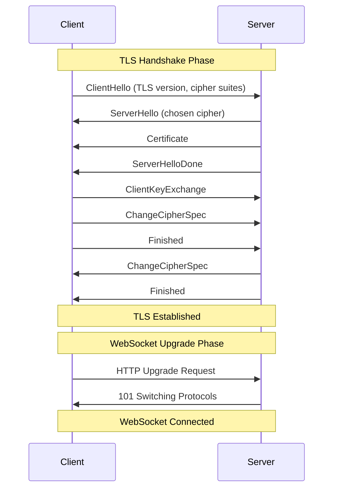
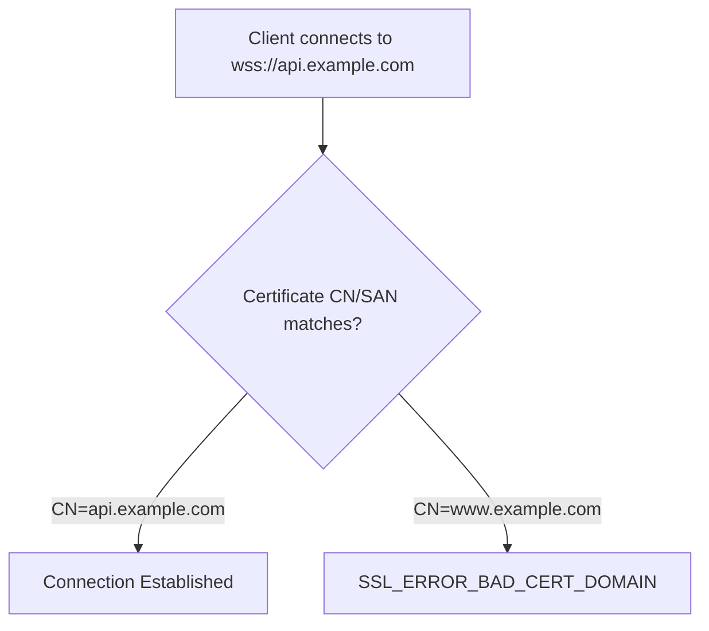

# How to Fix 'SSL Handshake' WebSocket Errors

Author: [nawazdhandala](https://www.github.com/nawazdhandala)

Tags: WebSocket, SSL, TLS, Security, HTTPS, Troubleshooting

Description: A practical guide to diagnosing and fixing SSL/TLS handshake errors in WebSocket connections, covering certificate issues, protocol mismatches, and configuration problems.

---

SSL handshake errors prevent secure WebSocket (WSS) connections from being established. These errors occur during the TLS negotiation phase before any WebSocket communication can happen. Understanding the handshake process helps identify and fix these issues.

## Understanding the SSL/TLS Handshake

The SSL handshake happens before the WebSocket upgrade request. If the handshake fails, the WebSocket connection cannot be established.



## Common SSL Handshake Errors

### 1. Self-Signed Certificate Errors

Self-signed certificates cause trust errors in production but are common in development.

```javascript
// Node.js client - handling self-signed certificates
const WebSocket = require('ws');
const https = require('https');

// Option 1: Disable certificate verification (DEVELOPMENT ONLY)
const ws = new WebSocket('wss://localhost:8443', {
  rejectUnauthorized: false  // Never use in production
});

// Option 2: Provide the CA certificate
const fs = require('fs');
const ca = fs.readFileSync('/path/to/ca-cert.pem');

const ws2 = new WebSocket('wss://localhost:8443', {
  ca: ca
});

ws.on('open', () => {
  console.log('Connected with self-signed cert');
});

ws.on('error', (error) => {
  console.error('Connection error:', error.message);
});
```

Server configuration with self-signed certificates.

```javascript
// server-ssl.js
const https = require('https');
const WebSocket = require('ws');
const fs = require('fs');

// Generate self-signed certificate for development:
// openssl req -x509 -newkey rsa:4096 -keyout key.pem -out cert.pem -days 365 -nodes

const server = https.createServer({
  cert: fs.readFileSync('/path/to/cert.pem'),
  key: fs.readFileSync('/path/to/key.pem')
});

const wss = new WebSocket.Server({ server });

wss.on('connection', (ws) => {
  console.log('Secure WebSocket connection established');

  ws.on('message', (message) => {
    console.log('Received:', message.toString());
  });
});

server.listen(8443, () => {
  console.log('Secure WebSocket server running on wss://localhost:8443');
});
```

### 2. Certificate Chain Incomplete

Missing intermediate certificates cause verification failures.

```bash
# Check certificate chain
openssl s_client -connect example.com:443 -showcerts

# Verify certificate chain
openssl verify -CAfile /path/to/ca-bundle.crt /path/to/server-cert.pem

# Download intermediate certificates
# Combine them in the correct order: server cert first, then intermediates
cat server.crt intermediate.crt root.crt > fullchain.pem
```

Configure server with complete certificate chain.

```javascript
// server-fullchain.js
const https = require('https');
const WebSocket = require('ws');
const fs = require('fs');

const server = https.createServer({
  // Full chain includes server cert + intermediates
  cert: fs.readFileSync('/path/to/fullchain.pem'),
  key: fs.readFileSync('/path/to/privkey.pem'),
  // Optionally specify CA for client certificate verification
  ca: fs.readFileSync('/path/to/ca-bundle.pem')
});

const wss = new WebSocket.Server({ server });

wss.on('connection', (ws, req) => {
  // Access client certificate info if using mTLS
  const cert = req.socket.getPeerCertificate();
  console.log('Client connected:', cert.subject?.CN || 'anonymous');
});

server.listen(443);
```

### 3. Certificate Hostname Mismatch

The certificate must match the hostname used in the connection.



```bash
# Check certificate hostnames
openssl x509 -in cert.pem -text -noout | grep -A1 "Subject Alternative Name"

# Example output showing valid names:
# X509v3 Subject Alternative Name:
#     DNS:api.example.com, DNS:*.example.com
```

Generate certificate with correct hostnames.

```bash
# Create certificate with SAN (Subject Alternative Name)
openssl req -new -newkey rsa:4096 -nodes \
  -keyout server.key \
  -out server.csr \
  -subj "/CN=api.example.com" \
  -addext "subjectAltName=DNS:api.example.com,DNS:ws.example.com,DNS:localhost"
```

### 4. TLS Version Mismatch

Server and client must support compatible TLS versions.

```javascript
// Server with specific TLS versions
const https = require('https');
const tls = require('tls');
const WebSocket = require('ws');
const fs = require('fs');

const server = https.createServer({
  cert: fs.readFileSync('/path/to/cert.pem'),
  key: fs.readFileSync('/path/to/key.pem'),
  // Require TLS 1.2 or higher
  minVersion: 'TLSv1.2',
  maxVersion: 'TLSv1.3',
  // Disable older protocols explicitly
  secureProtocol: 'TLS_method'
});

const wss = new WebSocket.Server({ server });

wss.on('connection', (ws, req) => {
  // Log TLS version used
  const protocol = req.socket.getProtocol();
  console.log(`Client connected using ${protocol}`);
});

server.listen(443);
```

Client with TLS version constraints.

```javascript
// Client specifying TLS version
const WebSocket = require('ws');
const tls = require('tls');

const ws = new WebSocket('wss://api.example.com', {
  minVersion: 'TLSv1.2',
  maxVersion: 'TLSv1.3'
});
```

### 5. Cipher Suite Mismatch

No common cipher suites between client and server.

```javascript
// Server with specific cipher suites
const https = require('https');
const WebSocket = require('ws');
const fs = require('fs');

const server = https.createServer({
  cert: fs.readFileSync('/path/to/cert.pem'),
  key: fs.readFileSync('/path/to/key.pem'),
  // Strong cipher suites only
  ciphers: [
    'ECDHE-ECDSA-AES128-GCM-SHA256',
    'ECDHE-RSA-AES128-GCM-SHA256',
    'ECDHE-ECDSA-AES256-GCM-SHA384',
    'ECDHE-RSA-AES256-GCM-SHA384',
    'DHE-RSA-AES128-GCM-SHA256',
    'DHE-RSA-AES256-GCM-SHA384'
  ].join(':'),
  honorCipherOrder: true
});

const wss = new WebSocket.Server({ server });
server.listen(443);
```

Check supported ciphers.

```bash
# Test server cipher support
nmap --script ssl-enum-ciphers -p 443 example.com

# Test specific cipher
openssl s_client -connect example.com:443 -cipher ECDHE-RSA-AES256-GCM-SHA384
```

### 6. Certificate Expired or Not Yet Valid

```bash
# Check certificate validity dates
openssl x509 -in cert.pem -noout -dates

# Example output:
# notBefore=Jan 1 00:00:00 2024 GMT
# notAfter=Dec 31 23:59:59 2024 GMT

# Check remote certificate expiration
echo | openssl s_client -connect example.com:443 2>/dev/null | openssl x509 -noout -dates
```

Monitor certificate expiration.

```javascript
// certificate-monitor.js
const tls = require('tls');
const https = require('https');

function checkCertificateExpiry(hostname, port = 443) {
  return new Promise((resolve, reject) => {
    const options = {
      host: hostname,
      port: port,
      servername: hostname,
      rejectUnauthorized: false  // Allow checking expired certs
    };

    const socket = tls.connect(options, () => {
      const cert = socket.getPeerCertificate();
      socket.destroy();

      if (!cert || Object.keys(cert).length === 0) {
        reject(new Error('No certificate received'));
        return;
      }

      const expiryDate = new Date(cert.valid_to);
      const now = new Date();
      const daysUntilExpiry = Math.floor((expiryDate - now) / (1000 * 60 * 60 * 24));

      resolve({
        hostname,
        subject: cert.subject?.CN,
        issuer: cert.issuer?.CN,
        validFrom: new Date(cert.valid_from),
        validTo: expiryDate,
        daysUntilExpiry,
        isExpired: daysUntilExpiry < 0,
        expiresSoon: daysUntilExpiry < 30
      });
    });

    socket.on('error', reject);
  });
}

// Usage
checkCertificateExpiry('api.example.com')
  .then((info) => {
    console.log(`Certificate for ${info.hostname}:`);
    console.log(`  Subject: ${info.subject}`);
    console.log(`  Valid until: ${info.validTo}`);
    console.log(`  Days until expiry: ${info.daysUntilExpiry}`);

    if (info.isExpired) {
      console.error('  WARNING: Certificate has expired!');
    } else if (info.expiresSoon) {
      console.warn('  WARNING: Certificate expires soon!');
    }
  })
  .catch((error) => {
    console.error('Failed to check certificate:', error.message);
  });
```

## Browser-Specific Issues

### Mixed Content Errors

Browsers block WSS connections from HTTP pages and WS from HTTPS pages.

```javascript
// Detect protocol and use appropriate WebSocket URL
function getWebSocketUrl(path) {
  const protocol = window.location.protocol === 'https:' ? 'wss:' : 'ws:';
  const host = window.location.host;
  return `${protocol}//${host}${path}`;
}

// Usage
const ws = new WebSocket(getWebSocketUrl('/socket'));
```

### Certificate Trust in Browsers

```javascript
// Browser client with error handling for SSL issues
class SecureWebSocketClient {
  constructor(url) {
    this.url = url;
    this.ws = null;
  }

  connect() {
    return new Promise((resolve, reject) => {
      try {
        this.ws = new WebSocket(this.url);
      } catch (error) {
        // SecurityError may indicate certificate issues
        reject(new Error(`Failed to create WebSocket: ${error.message}`));
        return;
      }

      this.ws.onopen = () => {
        console.log('Secure connection established');
        resolve(this.ws);
      };

      this.ws.onerror = (event) => {
        // Browser does not expose SSL error details for security reasons
        console.error('WebSocket error - possible SSL issues');
        console.log('Check browser console for certificate warnings');
        reject(new Error('Connection failed - check certificate'));
      };

      this.ws.onclose = (event) => {
        if (event.code === 1006) {
          console.error('Abnormal closure - may indicate SSL handshake failure');
        }
      };
    });
  }
}

// Debug SSL issues in browser
async function debugSSLConnection(url) {
  // First test HTTPS to the same host
  const httpsUrl = url.replace('wss://', 'https://').replace(/\/.*$/, '/');

  try {
    const response = await fetch(httpsUrl, { method: 'HEAD' });
    console.log('HTTPS connection successful');
  } catch (error) {
    console.error('HTTPS connection failed:', error.message);
    console.log('SSL certificate may be invalid or untrusted');
  }
}
```

## NGINX SSL Configuration for WebSocket

```nginx
# /etc/nginx/conf.d/websocket-ssl.conf

server {
    listen 443 ssl http2;
    server_name ws.example.com;

    # SSL certificate configuration
    ssl_certificate /etc/nginx/ssl/fullchain.pem;
    ssl_certificate_key /etc/nginx/ssl/privkey.pem;

    # Strong SSL configuration
    ssl_protocols TLSv1.2 TLSv1.3;
    ssl_ciphers ECDHE-ECDSA-AES128-GCM-SHA256:ECDHE-RSA-AES128-GCM-SHA256:ECDHE-ECDSA-AES256-GCM-SHA384:ECDHE-RSA-AES256-GCM-SHA384;
    ssl_prefer_server_ciphers on;
    ssl_session_cache shared:SSL:10m;
    ssl_session_timeout 1d;
    ssl_session_tickets off;

    # OCSP Stapling
    ssl_stapling on;
    ssl_stapling_verify on;
    ssl_trusted_certificate /etc/nginx/ssl/chain.pem;
    resolver 8.8.8.8 8.8.4.4 valid=300s;
    resolver_timeout 5s;

    # Security headers
    add_header Strict-Transport-Security "max-age=63072000" always;

    location /ws {
        proxy_pass http://websocket_backend;
        proxy_http_version 1.1;
        proxy_set_header Upgrade $http_upgrade;
        proxy_set_header Connection "upgrade";
        proxy_set_header Host $host;
        proxy_set_header X-Real-IP $remote_addr;
        proxy_set_header X-Forwarded-For $proxy_add_x_forwarded_for;
        proxy_set_header X-Forwarded-Proto $scheme;

        # Timeouts for WebSocket
        proxy_read_timeout 86400;
        proxy_send_timeout 86400;
    }
}

upstream websocket_backend {
    server 127.0.0.1:8080;
    keepalive 64;
}
```

## Diagnostic Script

```bash
#!/bin/bash
# ssl-websocket-diagnose.sh

HOST="${1:-localhost}"
PORT="${2:-443}"

echo "SSL/TLS Diagnostics for ${HOST}:${PORT}"
echo "========================================"

# Check connectivity
echo -e "\n1. TCP Connectivity:"
if nc -zw5 "${HOST}" "${PORT}" 2>/dev/null; then
    echo "   Port ${PORT} is open"
else
    echo "   ERROR: Cannot connect to port ${PORT}"
    exit 1
fi

# Check certificate
echo -e "\n2. Certificate Information:"
echo | openssl s_client -connect "${HOST}:${PORT}" -servername "${HOST}" 2>/dev/null | \
    openssl x509 -noout -subject -issuer -dates 2>/dev/null || \
    echo "   ERROR: Could not retrieve certificate"

# Check certificate chain
echo -e "\n3. Certificate Chain:"
echo | openssl s_client -connect "${HOST}:${PORT}" -servername "${HOST}" 2>/dev/null | \
    grep -E "^(Certificate chain| [0-9]+ s:)" || \
    echo "   ERROR: Could not verify chain"

# Check TLS versions
echo -e "\n4. Supported TLS Versions:"
for version in tls1 tls1_1 tls1_2 tls1_3; do
    if echo | openssl s_client -connect "${HOST}:${PORT}" -servername "${HOST}" -"${version}" 2>/dev/null | grep -q "Cipher is"; then
        echo "   ${version}: supported"
    else
        echo "   ${version}: not supported"
    fi
done

# Check for common issues
echo -e "\n5. Certificate Validation:"
echo | openssl s_client -connect "${HOST}:${PORT}" -servername "${HOST}" 2>&1 | \
    grep -E "(verify error|verify return)" | head -5

# WebSocket upgrade test over TLS
echo -e "\n6. WebSocket Upgrade Test:"
curl -sI --connect-timeout 5 \
    -H "Connection: Upgrade" \
    -H "Upgrade: websocket" \
    -H "Sec-WebSocket-Key: dGhlIHNhbXBsZSBub25jZQ==" \
    -H "Sec-WebSocket-Version: 13" \
    "https://${HOST}:${PORT}/" 2>/dev/null | head -5 || \
    echo "   WebSocket upgrade test failed"

echo -e "\n========================================"
echo "Diagnostics complete"
```

## Common Solutions Summary

| Error | Cause | Solution |
|-------|-------|----------|
| UNABLE_TO_VERIFY_LEAF_SIGNATURE | Missing intermediate cert | Add intermediate certificates to chain |
| CERT_HAS_EXPIRED | Certificate expired | Renew certificate |
| HOSTNAME_MISMATCH | Wrong CN/SAN | Generate certificate with correct hostnames |
| SELF_SIGNED_CERT_IN_CHAIN | Self-signed certificate | Install CA certificate or use trusted CA |
| TLSV1_ALERT_PROTOCOL_VERSION | TLS version mismatch | Update TLS configuration on server or client |
| NO_CIPHERS_AVAILABLE | No common cipher suites | Configure compatible cipher suites |

SSL handshake errors require systematic debugging. Start with basic connectivity, then verify the certificate chain, check TLS versions, and finally test the WebSocket upgrade. Most issues stem from certificate configuration rather than WebSocket-specific problems.
