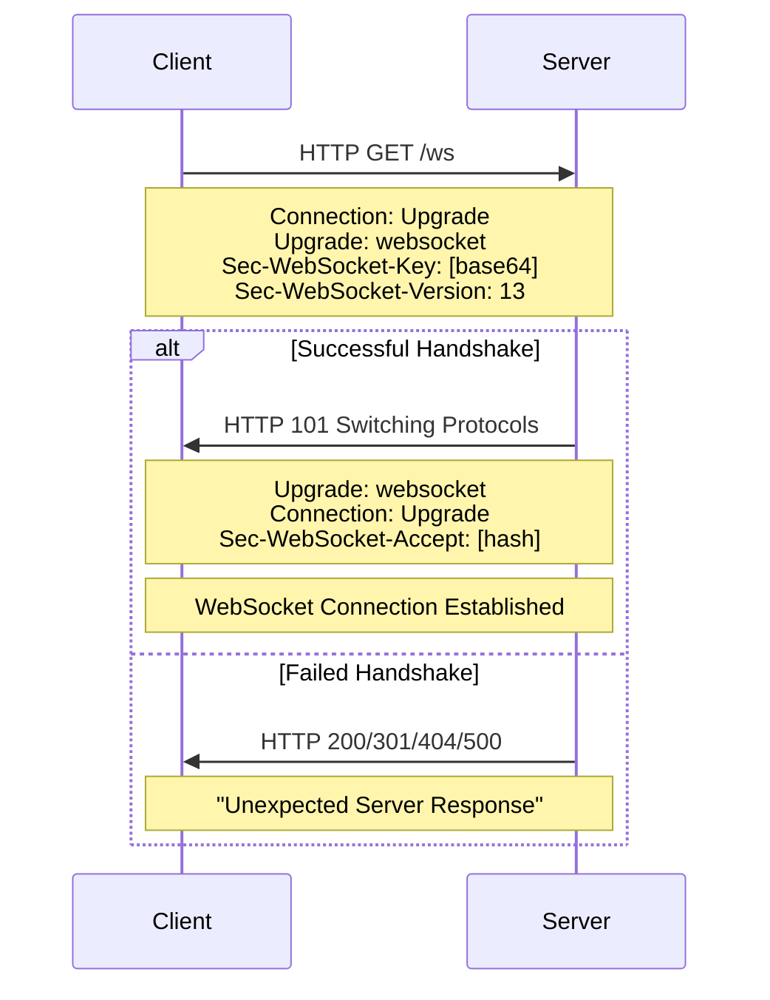
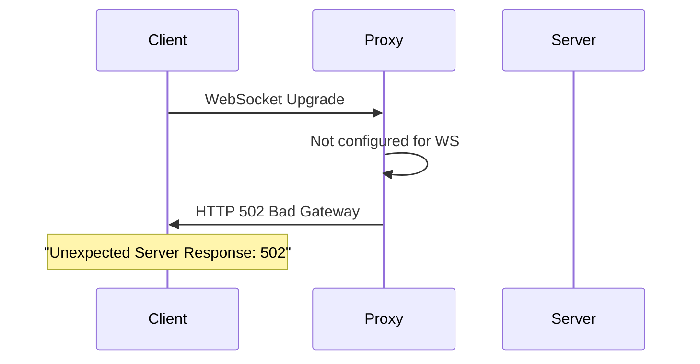

# How to Fix "Unexpected Server Response" WebSocket Errors

Author: [nawazdhandala](https://www.github.com/nawazdhandala)

Tags: WebSocket, Debugging, HTTP, Handshake, Node.js, Python, Error Handling, Troubleshooting

Description: A practical guide to diagnosing and fixing "Unexpected Server Response" WebSocket errors caused by failed handshakes, incorrect status codes, and server misconfigurations.

---

> The "Unexpected Server Response" error occurs during the WebSocket handshake when the server returns an HTTP response that does not match the WebSocket protocol requirements. This typically means the server returned a status code other than 101, is missing required headers, or is not configured to handle WebSocket connections at all.

This error is fundamentally different from errors that occur after a connection is established. It indicates a failure in the initial HTTP upgrade process before any WebSocket communication begins.

---

## Understanding the WebSocket Handshake



---

## Common Causes and Solutions

### 1. Server Not Configured for WebSocket

The most common cause is the server endpoint not being set up for WebSocket connections.

```javascript
// BAD: Regular HTTP endpoint, not WebSocket
const express = require('express');
const app = express();

// This will return HTTP 200, causing "unexpected response"
app.get('/ws', (req, res) => {
    res.send('Hello');
});

// GOOD: Proper WebSocket server setup
const express = require('express');
const http = require('http');
const WebSocket = require('ws');

const app = express();
const server = http.createServer(app);

// Create WebSocket server on the same HTTP server
const wss = new WebSocket.Server({
    server,
    path: '/ws'  // Handle WebSocket at /ws path
});

wss.on('connection', (ws) => {
    console.log('WebSocket connected');
    ws.on('message', (data) => {
        ws.send(`Echo: ${data}`);
    });
});

// Regular HTTP routes still work
app.get('/api/health', (req, res) => {
    res.json({ status: 'ok' });
});

server.listen(8080);
```

### 2. Wrong URL or Path

```javascript
// Client connecting to wrong path
// If server expects /ws but client connects to /websocket

// BAD: Mismatched paths
const ws = new WebSocket('ws://localhost:8080/websocket'); // Wrong path

// Server configured for /ws
const wss = new WebSocket.Server({ server, path: '/ws' });

// GOOD: Matching paths
const ws = new WebSocket('ws://localhost:8080/ws'); // Correct path
```

**Debugging URL issues:**

```javascript
// Server: Log all incoming upgrade requests
const server = http.createServer((req, res) => {
    // Log non-WebSocket requests to /ws path
    if (req.url.startsWith('/ws')) {
        console.log('Non-WebSocket request to WebSocket path:');
        console.log('  Method:', req.method);
        console.log('  URL:', req.url);
        console.log('  Headers:', req.headers);
    }
    res.writeHead(404);
    res.end();
});

const wss = new WebSocket.Server({ server, path: '/ws' });

server.on('upgrade', (request, socket, head) => {
    console.log('Upgrade request received:');
    console.log('  URL:', request.url);
    console.log('  Upgrade:', request.headers.upgrade);
});
```

---

### 3. Proxy Returning Error Response

When a proxy or load balancer is not configured for WebSocket, it may return its own error page.



**Nginx Configuration Fix:**

```nginx
# Check if the error is from Nginx by looking at response headers
# Nginx typically includes "nginx" in Server header

# Correct Nginx configuration for WebSocket
location /ws {
    # Without these, Nginx returns 400 Bad Request
    proxy_http_version 1.1;
    proxy_set_header Upgrade $http_upgrade;
    proxy_set_header Connection "upgrade";

    proxy_pass http://backend:8080;

    # Timeouts must be long for WebSocket
    proxy_read_timeout 86400s;
    proxy_send_timeout 86400s;
}
```

**Test proxy configuration:**

```bash
#!/bin/bash
# Test WebSocket handshake through proxy

URL="https://example.com/ws"

echo "Testing WebSocket handshake..."
curl -sI \
    -H "Connection: Upgrade" \
    -H "Upgrade: websocket" \
    -H "Sec-WebSocket-Key: dGhlIHNhbXBsZSBub25jZQ==" \
    -H "Sec-WebSocket-Version: 13" \
    "$URL"

# Expected output:
# HTTP/1.1 101 Switching Protocols
# Upgrade: websocket
# Connection: Upgrade
# Sec-WebSocket-Accept: s3pPLMBiTxaQ9kYGzzhZRbK+xOo=

# If you see 400, 502, or 404, the proxy is misconfigured
```

---

### 4. HTTP Redirect Instead of 101

Some servers redirect HTTP to HTTPS, causing the WebSocket handshake to fail.

```javascript
// BAD: Server redirects all HTTP to HTTPS
// Client tries ws:// but server returns 301

const ws = new WebSocket('ws://example.com/ws');  // HTTP
// Server returns: 301 Moved Permanently -> https://example.com/ws

// GOOD: Use correct protocol
const ws = new WebSocket('wss://example.com/ws'); // HTTPS/WSS

// Or handle redirect in client (Node.js)
const WebSocket = require('ws');

function connectWithRedirect(url, maxRedirects = 3) {
    return new Promise((resolve, reject) => {
        let redirectCount = 0;

        function connect(currentUrl) {
            const ws = new WebSocket(currentUrl, {
                followRedirects: true,
                maxRedirects: maxRedirects
            });

            ws.on('open', () => resolve(ws));

            ws.on('unexpected-response', (req, res) => {
                if (res.statusCode >= 300 && res.statusCode < 400) {
                    const location = res.headers.location;
                    if (location && redirectCount < maxRedirects) {
                        redirectCount++;
                        console.log(`Redirecting to: ${location}`);
                        ws.close();

                        // Convert http:// to ws://, https:// to wss://
                        const wsUrl = location
                            .replace('http://', 'ws://')
                            .replace('https://', 'wss://');
                        connect(wsUrl);
                    } else {
                        reject(new Error('Too many redirects'));
                    }
                } else {
                    reject(new Error(`Unexpected response: ${res.statusCode}`));
                }
            });

            ws.on('error', reject);
        }

        connect(url);
    });
}

// Usage
connectWithRedirect('ws://example.com/ws')
    .then(ws => {
        console.log('Connected after redirects');
    })
    .catch(error => {
        console.error('Connection failed:', error);
    });
```

---

### 5. Authentication Rejection

Server may return 401 or 403 during handshake if authentication fails.

```javascript
// Server with authentication
const WebSocket = require('ws');
const http = require('http');

const server = http.createServer();
const wss = new WebSocket.Server({ noServer: true });

server.on('upgrade', (request, socket, head) => {
    // Authenticate before completing handshake
    const token = request.headers['authorization'];

    if (!token || !isValidToken(token)) {
        // Return 401 - this causes "unexpected response" on client
        socket.write('HTTP/1.1 401 Unauthorized\r\n\r\n');
        socket.destroy();
        return;
    }

    // Complete handshake for authenticated requests
    wss.handleUpgrade(request, socket, head, (ws) => {
        wss.emit('connection', ws, request);
    });
});

function isValidToken(token) {
    // Validate JWT or API key
    return token === 'Bearer valid-token';
}

server.listen(8080);

// Client with authentication
const ws = new WebSocket('ws://localhost:8080/ws', {
    headers: {
        'Authorization': 'Bearer valid-token'
    }
});

ws.on('open', () => {
    console.log('Authenticated and connected');
});

ws.on('unexpected-response', (req, res) => {
    console.error(`Authentication failed: ${res.statusCode}`);

    // Read error body for details
    let body = '';
    res.on('data', chunk => body += chunk);
    res.on('end', () => {
        console.error('Response body:', body);
    });
});
```

---

### 6. CORS Issues with Browser Clients

While WebSocket itself does not have CORS, the initial HTTP handshake may be blocked.

```javascript
// Server with CORS handling for upgrade requests
const http = require('http');
const WebSocket = require('ws');

const server = http.createServer((req, res) => {
    // Handle CORS preflight for non-WebSocket requests
    if (req.method === 'OPTIONS') {
        res.writeHead(200, {
            'Access-Control-Allow-Origin': '*',
            'Access-Control-Allow-Methods': 'GET, POST, OPTIONS',
            'Access-Control-Allow-Headers': 'Authorization, Content-Type'
        });
        res.end();
        return;
    }

    res.writeHead(404);
    res.end();
});

const wss = new WebSocket.Server({
    server,
    verifyClient: (info, callback) => {
        // Log origin for debugging
        console.log('Connection from origin:', info.origin);

        // Accept connections from specific origins
        const allowedOrigins = [
            'http://localhost:3000',
            'https://myapp.example.com'
        ];

        if (allowedOrigins.includes(info.origin)) {
            callback(true);
        } else {
            console.log('Rejected connection from:', info.origin);
            // This returns 401, causing "unexpected response"
            callback(false, 401, 'Origin not allowed');
        }
    }
});
```

---

## Debugging Unexpected Server Response

### Comprehensive Error Handler

```javascript
const WebSocket = require('ws');

function connectWithDebugging(url, options = {}) {
    return new Promise((resolve, reject) => {
        console.log(`Connecting to: ${url}`);

        const ws = new WebSocket(url, options);

        ws.on('open', () => {
            console.log('Connection established');
            resolve(ws);
        });

        ws.on('unexpected-response', (request, response) => {
            console.error('=== Unexpected Server Response ===');
            console.error(`Status: ${response.statusCode} ${response.statusMessage}`);
            console.error('Headers:');

            Object.entries(response.headers).forEach(([key, value]) => {
                console.error(`  ${key}: ${value}`);
            });

            // Read response body
            let body = '';
            response.on('data', chunk => body += chunk);
            response.on('end', () => {
                if (body) {
                    console.error('Body:', body.substring(0, 500));
                }

                // Provide diagnostic information
                console.error('\n=== Diagnosis ===');

                switch (response.statusCode) {
                    case 200:
                        console.error('Server returned 200 instead of 101.');
                        console.error('The endpoint is not configured for WebSocket.');
                        console.error('Check: Is the path correct? Is WebSocket enabled?');
                        break;
                    case 301:
                    case 302:
                    case 307:
                    case 308:
                        console.error(`Server returned redirect to: ${response.headers.location}`);
                        console.error('Try connecting to the redirect URL directly.');
                        console.error('Or use wss:// instead of ws://');
                        break;
                    case 400:
                        console.error('Bad Request - possible causes:');
                        console.error('  - Missing or invalid WebSocket headers');
                        console.error('  - Proxy not forwarding Upgrade header');
                        console.error('  - Invalid Sec-WebSocket-Version');
                        break;
                    case 401:
                        console.error('Unauthorized - authentication required');
                        console.error('Add Authorization header or credentials');
                        break;
                    case 403:
                        console.error('Forbidden - check:');
                        console.error('  - Origin header validation');
                        console.error('  - IP restrictions');
                        console.error('  - CORS configuration');
                        break;
                    case 404:
                        console.error('Not Found - the WebSocket path does not exist');
                        console.error('Verify the URL path is correct');
                        break;
                    case 502:
                    case 503:
                    case 504:
                        console.error('Gateway error - proxy or load balancer issue');
                        console.error('Check proxy WebSocket configuration');
                        break;
                    default:
                        console.error(`Unexpected status code: ${response.statusCode}`);
                }

                reject(new Error(`Unexpected response: ${response.statusCode}`));
            });
        });

        ws.on('error', (error) => {
            console.error('WebSocket error:', error.message);
            reject(error);
        });
    });
}

// Usage
connectWithDebugging('ws://localhost:8080/ws', {
    headers: {
        'Authorization': 'Bearer token'
    }
}).then(ws => {
    ws.send('Hello');
}).catch(error => {
    console.error('Failed to connect:', error.message);
});
```

### Server-Side Request Logging

```javascript
const http = require('http');
const WebSocket = require('ws');

const server = http.createServer((req, res) => {
    console.log('=== HTTP Request (not upgraded) ===');
    console.log(`${req.method} ${req.url}`);
    console.log('Headers:');
    Object.entries(req.headers).forEach(([key, value]) => {
        console.log(`  ${key}: ${value}`);
    });

    // Check why this wasn't upgraded
    if (req.url.includes('/ws')) {
        console.log('\nThis request to WebSocket path was not upgraded!');
        console.log('Checking headers:');

        if (!req.headers.upgrade) {
            console.log('  - Missing Upgrade header');
        } else if (req.headers.upgrade.toLowerCase() !== 'websocket') {
            console.log(`  - Upgrade header is "${req.headers.upgrade}", not "websocket"`);
        }

        if (!req.headers.connection?.toLowerCase().includes('upgrade')) {
            console.log('  - Missing or incorrect Connection header');
        }

        if (!req.headers['sec-websocket-key']) {
            console.log('  - Missing Sec-WebSocket-Key header');
        }

        if (!req.headers['sec-websocket-version']) {
            console.log('  - Missing Sec-WebSocket-Version header');
        }
    }

    res.writeHead(200, { 'Content-Type': 'text/plain' });
    res.end('This is HTTP, not WebSocket');
});

const wss = new WebSocket.Server({ server, path: '/ws' });

server.on('upgrade', (request, socket, head) => {
    console.log('=== Upgrade Request ===');
    console.log(`URL: ${request.url}`);
    console.log(`Sec-WebSocket-Key: ${request.headers['sec-websocket-key']}`);
    console.log(`Sec-WebSocket-Version: ${request.headers['sec-websocket-version']}`);
    console.log(`Origin: ${request.headers.origin}`);
});

wss.on('connection', (ws, req) => {
    console.log('WebSocket connection established');
});

server.listen(8080);
```

---

## Python Server Debugging

```python
import asyncio
import websockets
import logging
from http import HTTPStatus

# Enable detailed logging
logging.basicConfig(level=logging.DEBUG)
logger = logging.getLogger('websockets')

async def health_check(path, request_headers):
    """Handle HTTP requests that are not WebSocket upgrades"""
    if path == '/health':
        return HTTPStatus.OK, [], b'OK\n'

    # Log non-WebSocket requests to WebSocket path
    if path == '/ws':
        logger.warning(f"Non-WebSocket request to /ws")
        logger.warning(f"Headers: {dict(request_headers)}")

        # Check for missing upgrade headers
        upgrade = request_headers.get('Upgrade', '').lower()
        connection = request_headers.get('Connection', '').lower()

        if upgrade != 'websocket':
            logger.error(f"Missing or wrong Upgrade header: {upgrade}")
        if 'upgrade' not in connection:
            logger.error(f"Missing upgrade in Connection header: {connection}")

    return None  # Continue with normal WebSocket handling

async def handler(websocket, path):
    """Handle WebSocket connections"""
    logger.info(f"WebSocket connected: {path}")

    try:
        async for message in websocket:
            await websocket.send(f"Echo: {message}")
    except websockets.exceptions.ConnectionClosed as e:
        logger.info(f"Connection closed: {e.code} {e.reason}")

async def main():
    async with websockets.serve(
        handler,
        "0.0.0.0",
        8080,
        process_request=health_check,
        logger=logger
    ):
        logger.info("Server started on port 8080")
        await asyncio.Future()

if __name__ == "__main__":
    asyncio.run(main())
```

---

## Common Status Codes and Fixes

| Status | Meaning | Fix |
|--------|---------|-----|
| 101 | Success | No fix needed |
| 200 | HTTP OK (not WS) | Enable WebSocket on endpoint |
| 301/302 | Redirect | Use wss:// or follow redirect |
| 400 | Bad Request | Check headers, proxy config |
| 401 | Unauthorized | Add authentication |
| 403 | Forbidden | Check origin, CORS |
| 404 | Not Found | Verify URL path |
| 426 | Upgrade Required | Use correct WS version |
| 502/503 | Gateway Error | Fix proxy configuration |

---

## Prevention Checklist

```markdown
## WebSocket Deployment Checklist

### Server Configuration
- [ ] WebSocket server is running on the correct port
- [ ] WebSocket path matches client URL
- [ ] Server returns 101 for valid upgrade requests

### Proxy/Load Balancer
- [ ] proxy_http_version 1.1 (Nginx)
- [ ] Upgrade header forwarded
- [ ] Connection: upgrade header set
- [ ] Long timeouts configured (> 60 seconds)

### Authentication
- [ ] Auth tokens accepted in headers
- [ ] Invalid auth returns clear error message
- [ ] CORS/Origin validation configured

### SSL/TLS
- [ ] Using wss:// for HTTPS sites
- [ ] SSL certificates valid
- [ ] SSL termination configured correctly

### Testing
- [ ] curl upgrade test passes
- [ ] wscat connects successfully
- [ ] Browser client connects
- [ ] Reconnection after server restart works
```

---

## Summary

The "Unexpected Server Response" error always indicates a handshake failure before the WebSocket connection is established. The key diagnostic steps are:

1. **Check the status code** - Tells you what went wrong
2. **Examine response headers** - Look for proxy signatures (nginx, cloudflare)
3. **Verify the URL** - Protocol (ws vs wss), host, and path
4. **Test with curl** - Isolate client vs server issues
5. **Check proxy configuration** - Most common cause in production

Once you identify the specific status code, the fix is usually straightforward: configure the proxy for WebSocket, fix authentication, or correct the URL.

---

*Troubleshooting WebSocket deployment issues? [OneUptime](https://oneuptime.com) monitors WebSocket handshake success rates and alerts you to connection failures before they impact your users.*
