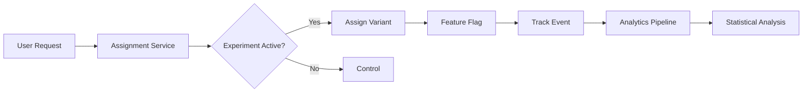

# How to Implement A/B Testing Infrastructure

Author: [nawazdhandala](https://github.com/nawazdhandala)

Tags: A/B Testing, Feature Flags, Experimentation, Analytics, DevOps

Description: Build a complete A/B testing infrastructure with feature flags, experiment assignment, statistical analysis, and observability to make data-driven product decisions.

---

A/B testing lets you make product decisions based on real user behavior rather than guesses. Building the infrastructure correctly requires careful attention to randomization, consistency, and statistical validity. This guide walks through implementing a production-ready A/B testing system from scratch.

## Core Components

A complete A/B testing infrastructure needs several interconnected pieces:



## Experiment Configuration

Start with a clear experiment definition schema. This configuration drives the entire system:

```typescript
// experiment.types.ts
// Define the structure for experiment configuration
interface Experiment {
    id: string;
    name: string;
    description: string;
    // What percentage of eligible users enter the experiment
    trafficAllocation: number; // 0-100
    // The different variants users can be assigned to
    variants: Variant[];
    // Rules to determine eligible users
    targetingRules: TargetingRule[];
    // Metrics to track for this experiment
    metrics: MetricDefinition[];
    status: 'draft' | 'running' | 'paused' | 'completed';
    startDate: Date;
    endDate?: Date;
}

interface Variant {
    id: string;
    name: string;
    // Traffic split within experiment participants
    weight: number; // Weights should sum to 100
    // Feature flag values for this variant
    config: Record<string, any>;
}

interface TargetingRule {
    attribute: string;
    operator: 'equals' | 'contains' | 'gt' | 'lt' | 'in';
    value: any;
}

interface MetricDefinition {
    name: string;
    type: 'conversion' | 'count' | 'revenue' | 'duration';
    eventName: string;
    // For conversion metrics, the success event
    successEvent?: string;
}
```

## Assignment Service

The assignment service determines which variant a user sees. Consistency is critical since a user must always see the same variant for valid results:

```typescript
// assignment.service.ts
import crypto from 'crypto';

class AssignmentService {
    private experiments: Map<string, Experiment> = new Map();
    private assignmentCache: Map<string, string> = new Map();

    // Generate deterministic assignment using consistent hashing
    // This ensures the same user always gets the same variant
    private hashAssignment(userId: string, experimentId: string): number {
        const input = `${userId}:${experimentId}`;
        const hash = crypto.createHash('md5').update(input).digest('hex');
        // Convert first 8 hex chars to number between 0-99
        const hashInt = parseInt(hash.substring(0, 8), 16);
        return hashInt % 100;
    }

    // Check if user matches targeting rules
    private matchesTargeting(
        user: UserContext,
        rules: TargetingRule[]
    ): boolean {
        for (const rule of rules) {
            const userValue = user[rule.attribute];

            switch (rule.operator) {
                case 'equals':
                    if (userValue !== rule.value) return false;
                    break;
                case 'contains':
                    if (!String(userValue).includes(rule.value)) return false;
                    break;
                case 'in':
                    if (!rule.value.includes(userValue)) return false;
                    break;
                case 'gt':
                    if (userValue <= rule.value) return false;
                    break;
                case 'lt':
                    if (userValue >= rule.value) return false;
                    break;
            }
        }
        return true;
    }

    // Main method to get variant assignment for a user
    getAssignment(
        userId: string,
        experimentId: string,
        userContext: UserContext
    ): AssignmentResult {
        const experiment = this.experiments.get(experimentId);

        if (!experiment || experiment.status !== 'running') {
            return { variant: null, inExperiment: false };
        }

        // Check cache for existing assignment
        const cacheKey = `${userId}:${experimentId}`;
        const cachedVariant = this.assignmentCache.get(cacheKey);
        if (cachedVariant) {
            return {
                variant: experiment.variants.find(v => v.id === cachedVariant),
                inExperiment: true,
            };
        }

        // Check targeting rules
        if (!this.matchesTargeting(userContext, experiment.targetingRules)) {
            return { variant: null, inExperiment: false };
        }

        // Determine if user is in experiment traffic
        const trafficHash = this.hashAssignment(userId, `${experimentId}:traffic`);
        if (trafficHash >= experiment.trafficAllocation) {
            return { variant: null, inExperiment: false };
        }

        // Assign to variant based on weights
        const variantHash = this.hashAssignment(userId, experimentId);
        let cumulative = 0;
        let assignedVariant: Variant | null = null;

        for (const variant of experiment.variants) {
            cumulative += variant.weight;
            if (variantHash < cumulative) {
                assignedVariant = variant;
                break;
            }
        }

        // Cache the assignment
        if (assignedVariant) {
            this.assignmentCache.set(cacheKey, assignedVariant.id);
        }

        return {
            variant: assignedVariant,
            inExperiment: true,
        };
    }
}
```

## Feature Flag Integration

Connect experiments to feature flags so variants can control application behavior:

```typescript
// feature-flag.service.ts
class FeatureFlagService {
    private assignmentService: AssignmentService;
    private defaultFlags: Map<string, any> = new Map();

    constructor(assignmentService: AssignmentService) {
        this.assignmentService = assignmentService;
    }

    // Get flag value with experiment override
    getValue<T>(
        flagKey: string,
        userId: string,
        userContext: UserContext,
        defaultValue: T
    ): T {
        // Check each active experiment for this flag
        const experiments = this.getExperimentsForFlag(flagKey);

        for (const experiment of experiments) {
            const assignment = this.assignmentService.getAssignment(
                userId,
                experiment.id,
                userContext
            );

            if (assignment.inExperiment && assignment.variant) {
                const variantValue = assignment.variant.config[flagKey];
                if (variantValue !== undefined) {
                    // Track exposure for analytics
                    this.trackExposure(userId, experiment.id, assignment.variant.id);
                    return variantValue as T;
                }
            }
        }

        // Fall back to default flag value
        return this.defaultFlags.get(flagKey) ?? defaultValue;
    }

    private trackExposure(
        userId: string,
        experimentId: string,
        variantId: string
    ): void {
        // Send exposure event to analytics
        analytics.track({
            event: 'experiment_exposure',
            userId,
            properties: {
                experiment_id: experimentId,
                variant_id: variantId,
                timestamp: new Date().toISOString(),
            },
        });
    }
}
```

## Event Tracking

Track user actions to measure experiment impact:

```typescript
// analytics.service.ts
interface ExperimentEvent {
    userId: string;
    eventName: string;
    experimentId: string;
    variantId: string;
    properties: Record<string, any>;
    timestamp: Date;
}

class AnalyticsService {
    private eventQueue: ExperimentEvent[] = [];
    private batchSize = 100;

    // Track event with experiment context
    trackEvent(
        userId: string,
        eventName: string,
        properties: Record<string, any> = {}
    ): void {
        // Get active experiment assignments for this user
        const activeExperiments = this.getActiveAssignments(userId);

        for (const assignment of activeExperiments) {
            const event: ExperimentEvent = {
                userId,
                eventName,
                experimentId: assignment.experimentId,
                variantId: assignment.variantId,
                properties,
                timestamp: new Date(),
            };

            this.eventQueue.push(event);
        }

        // Flush when batch is full
        if (this.eventQueue.length >= this.batchSize) {
            this.flush();
        }
    }

    private async flush(): Promise<void> {
        const events = this.eventQueue.splice(0, this.batchSize);
        if (events.length === 0) return;

        try {
            // Send to analytics backend
            await fetch('/api/analytics/events', {
                method: 'POST',
                headers: { 'Content-Type': 'application/json' },
                body: JSON.stringify({ events }),
            });
        } catch (error) {
            // Re-queue failed events
            this.eventQueue.unshift(...events);
            console.error('Failed to flush analytics events:', error);
        }
    }
}
```

## Statistical Analysis

Calculate statistical significance to determine experiment winners:

```python
# analysis.py
import numpy as np
from scipy import stats
from dataclasses import dataclass
from typing import List

@dataclass
class VariantStats:
    variant_id: str
    sample_size: int
    conversions: int
    conversion_rate: float

@dataclass
class ExperimentResult:
    control: VariantStats
    treatment: VariantStats
    relative_lift: float
    p_value: float
    confidence_interval: tuple
    is_significant: bool

def calculate_significance(
    control_conversions: int,
    control_total: int,
    treatment_conversions: int,
    treatment_total: int,
    alpha: float = 0.05
) -> ExperimentResult:
    """
    Calculate statistical significance using a two-proportion z-test.
    Returns experiment results with confidence intervals.
    """
    # Calculate conversion rates
    control_rate = control_conversions / control_total
    treatment_rate = treatment_conversions / treatment_total

    # Pooled probability for z-test
    pooled_p = (control_conversions + treatment_conversions) / (
        control_total + treatment_total
    )

    # Standard error
    se = np.sqrt(
        pooled_p * (1 - pooled_p) * (1/control_total + 1/treatment_total)
    )

    # Z-score
    z_score = (treatment_rate - control_rate) / se if se > 0 else 0

    # Two-tailed p-value
    p_value = 2 * (1 - stats.norm.cdf(abs(z_score)))

    # Confidence interval for the difference
    z_critical = stats.norm.ppf(1 - alpha/2)
    margin = z_critical * se
    ci_lower = (treatment_rate - control_rate) - margin
    ci_upper = (treatment_rate - control_rate) + margin

    # Relative lift
    relative_lift = (
        (treatment_rate - control_rate) / control_rate * 100
        if control_rate > 0 else 0
    )

    return ExperimentResult(
        control=VariantStats(
            variant_id='control',
            sample_size=control_total,
            conversions=control_conversions,
            conversion_rate=control_rate
        ),
        treatment=VariantStats(
            variant_id='treatment',
            sample_size=treatment_total,
            conversions=treatment_conversions,
            conversion_rate=treatment_rate
        ),
        relative_lift=relative_lift,
        p_value=p_value,
        confidence_interval=(ci_lower, ci_upper),
        is_significant=p_value < alpha
    )
```

## Sample Size Calculator

Determine how long to run experiments:

```python
def calculate_sample_size(
    baseline_rate: float,
    minimum_detectable_effect: float,
    alpha: float = 0.05,
    power: float = 0.80
) -> int:
    """
    Calculate minimum sample size per variant for statistical power.

    Args:
        baseline_rate: Current conversion rate (e.g., 0.10 for 10%)
        minimum_detectable_effect: Relative change to detect (e.g., 0.10 for 10% lift)
        alpha: Significance level (default 0.05)
        power: Statistical power (default 0.80)

    Returns:
        Required sample size per variant
    """
    # Treatment rate based on expected lift
    treatment_rate = baseline_rate * (1 + minimum_detectable_effect)

    # Z-scores for alpha and power
    z_alpha = stats.norm.ppf(1 - alpha/2)
    z_beta = stats.norm.ppf(power)

    # Pooled standard deviation
    p1 = baseline_rate
    p2 = treatment_rate
    pooled_var = p1 * (1 - p1) + p2 * (1 - p2)

    # Sample size formula
    effect_size = abs(p2 - p1)
    n = ((z_alpha + z_beta) ** 2 * pooled_var) / (effect_size ** 2)

    return int(np.ceil(n))
```

## REST API for Experiment Management

Expose experiment functionality through an API:

```typescript
// experiment.routes.ts
import express from 'express';

const router = express.Router();

// Create new experiment
router.post('/experiments', async (req, res) => {
    const experiment = await experimentService.create(req.body);
    res.status(201).json(experiment);
});

// Get assignment for user
router.get('/experiments/:id/assignment', async (req, res) => {
    const { id } = req.params;
    const { userId } = req.query;
    const userContext = req.headers['x-user-context']
        ? JSON.parse(req.headers['x-user-context'] as string)
        : {};

    const assignment = assignmentService.getAssignment(
        userId as string,
        id,
        userContext
    );

    res.json(assignment);
});

// Get experiment results
router.get('/experiments/:id/results', async (req, res) => {
    const { id } = req.params;
    const results = await analysisService.getResults(id);
    res.json(results);
});

// Start experiment
router.post('/experiments/:id/start', async (req, res) => {
    await experimentService.updateStatus(req.params.id, 'running');
    res.json({ status: 'running' });
});

// Stop experiment and declare winner
router.post('/experiments/:id/complete', async (req, res) => {
    const { winningVariant } = req.body;
    await experimentService.complete(req.params.id, winningVariant);
    res.json({ status: 'completed', winner: winningVariant });
});
```

## Dashboard Metrics

Track experiment health in real-time:

| Metric | Description | Alert Threshold |
|--------|-------------|-----------------|
| **Assignment rate** | Users entering experiment | Below expected traffic |
| **Exposure rate** | Users seeing variant | Significantly different from assignment |
| **Sample ratio mismatch** | Balance between variants | Chi-square p-value below 0.01 |
| **Days to significance** | Estimated completion | Exceeds planned duration |

## Summary

Building A/B testing infrastructure requires attention to several key areas:

| Component | Purpose |
|-----------|---------|
| **Assignment service** | Consistent, deterministic variant allocation |
| **Feature flags** | Control application behavior per variant |
| **Event tracking** | Capture user actions for analysis |
| **Statistical analysis** | Determine significance and winners |
| **Sample size calculation** | Plan experiment duration |

Start with simple experiments, validate your tracking pipeline, and expand complexity as your team gains experience with the platform.
