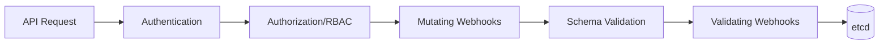

# How to Implement Admission Controllers for Security

Author: [nawazdhandala](https://www.github.com/nawazdhandala)

Tags: Kubernetes, Admission Controllers, Security, OPA, Gatekeeper, Kyverno, Policy Enforcement

Description: Learn how to implement admission controllers for Kubernetes security policy enforcement. This guide covers validating and mutating webhooks, OPA Gatekeeper, and Kyverno with practical examples.

---

> Admission controllers are the gatekeepers of your Kubernetes cluster, intercepting API requests before objects are persisted. They provide a powerful mechanism for enforcing security policies, validating configurations, and automatically mutating resources.

While RBAC controls who can perform actions, admission controllers control what configurations are allowed. This makes them essential for enforcing security baselines, compliance requirements, and organizational standards across all cluster users.

---

## Understanding Admission Controllers

Kubernetes has two types of admission webhooks:

**Validating Admission Webhooks**: Inspect requests and accept or reject them based on policies. They cannot modify the object.

**Mutating Admission Webhooks**: Can modify objects before they are persisted. Useful for injecting sidecars, setting defaults, or adding labels.

The admission flow:



---

## Prerequisites

Before implementing admission controllers:

- Kubernetes cluster (v1.21+)
- kubectl with cluster admin access
- Helm 3.x installed
- Understanding of Kubernetes resource definitions

---

## Built-in Admission Controllers

Kubernetes includes several built-in admission controllers. Ensure critical ones are enabled:

```bash
# Check enabled admission controllers
kubectl api-versions

# Verify specific controllers via API server flags
kubectl get pod -n kube-system -l component=kube-apiserver -o yaml | \
  grep enable-admission-plugins
```

Important built-in controllers:

- **NamespaceLifecycle**: Prevents operations in non-existent or terminating namespaces
- **LimitRanger**: Enforces resource limits from LimitRange objects
- **ServiceAccount**: Automates service account token mounting
- **ResourceQuota**: Enforces resource quotas
- **PodSecurity**: Enforces Pod Security Standards

---

## Deploying OPA Gatekeeper

OPA Gatekeeper provides policy-as-code for Kubernetes:

```yaml
# gatekeeper-values.yaml
# Helm values for OPA Gatekeeper

replicas: 3

# Audit configuration
auditInterval: 60
auditMatchKindOnly: true
auditFromCache: true

# Constraint violation limit
constraintViolationsLimit: 20

# Webhook configuration
validatingWebhookTimeoutSeconds: 3
mutatingWebhookTimeoutSeconds: 3
webhookFailurePolicy: Fail

# Exempt certain namespaces from policies
exemptNamespaces:
  - kube-system
  - gatekeeper-system

# Resource limits
controllerManager:
  resources:
    requests:
      cpu: 100m
      memory: 256Mi
    limits:
      cpu: 1000m
      memory: 512Mi

audit:
  resources:
    requests:
      cpu: 100m
      memory: 256Mi
    limits:
      cpu: 1000m
      memory: 512Mi
```

Deploy Gatekeeper:

```bash
# Add Gatekeeper Helm repository
helm repo add gatekeeper https://open-policy-agent.github.io/gatekeeper/charts
helm repo update

# Install Gatekeeper
helm install gatekeeper gatekeeper/gatekeeper \
  --namespace gatekeeper-system \
  --create-namespace \
  --values gatekeeper-values.yaml

# Verify deployment
kubectl get pods -n gatekeeper-system
```

---

## Creating Gatekeeper Constraints

Define constraint templates and constraints for policy enforcement:

```yaml
# require-labels-template.yaml
# Constraint template requiring specific labels
apiVersion: templates.gatekeeper.sh/v1
kind: ConstraintTemplate
metadata:
  name: k8srequiredlabels
spec:
  crd:
    spec:
      names:
        kind: K8sRequiredLabels
      validation:
        openAPIV3Schema:
          type: object
          properties:
            labels:
              type: array
              items:
                type: string
              description: "List of required labels"
  targets:
  - target: admission.k8s.gatekeeper.sh
    rego: |
      package k8srequiredlabels

      # Check if all required labels are present
      violation[{"msg": msg}] {
        provided := {label | input.review.object.metadata.labels[label]}
        required := {label | label := input.parameters.labels[_]}
        missing := required - provided
        count(missing) > 0
        msg := sprintf("Missing required labels: %v", [missing])
      }

---
# Apply constraint to all pods
apiVersion: constraints.gatekeeper.sh/v1beta1
kind: K8sRequiredLabels
metadata:
  name: pods-must-have-owner
spec:
  match:
    kinds:
    - apiGroups: [""]
      kinds: ["Pod"]
    excludedNamespaces:
    - kube-system
    - gatekeeper-system
  parameters:
    labels:
    - "app"
    - "owner"
```

More security-focused constraints:

```yaml
# no-privileged-containers.yaml
apiVersion: templates.gatekeeper.sh/v1
kind: ConstraintTemplate
metadata:
  name: k8spspprivilegedcontainer
spec:
  crd:
    spec:
      names:
        kind: K8sPSPPrivilegedContainer
  targets:
  - target: admission.k8s.gatekeeper.sh
    rego: |
      package k8spspprivilegedcontainer

      violation[{"msg": msg}] {
        c := input_containers[_]
        c.securityContext.privileged
        msg := sprintf("Privileged container not allowed: %v", [c.name])
      }

      input_containers[c] {
        c := input.review.object.spec.containers[_]
      }

      input_containers[c] {
        c := input.review.object.spec.initContainers[_]
      }

---
apiVersion: constraints.gatekeeper.sh/v1beta1
kind: K8sPSPPrivilegedContainer
metadata:
  name: deny-privileged-containers
spec:
  match:
    kinds:
    - apiGroups: [""]
      kinds: ["Pod"]
    excludedNamespaces:
    - kube-system

---
# no-host-namespace.yaml
apiVersion: templates.gatekeeper.sh/v1
kind: ConstraintTemplate
metadata:
  name: k8spsphostnamespace
spec:
  crd:
    spec:
      names:
        kind: K8sPSPHostNamespace
  targets:
  - target: admission.k8s.gatekeeper.sh
    rego: |
      package k8spsphostnamespace

      violation[{"msg": msg}] {
        input.review.object.spec.hostPID
        msg := "Host PID namespace is not allowed"
      }

      violation[{"msg": msg}] {
        input.review.object.spec.hostIPC
        msg := "Host IPC namespace is not allowed"
      }

      violation[{"msg": msg}] {
        input.review.object.spec.hostNetwork
        msg := "Host network is not allowed"
      }

---
apiVersion: constraints.gatekeeper.sh/v1beta1
kind: K8sPSPHostNamespace
metadata:
  name: deny-host-namespace
spec:
  match:
    kinds:
    - apiGroups: [""]
      kinds: ["Pod"]
    excludedNamespaces:
    - kube-system
```

---

## Deploying Kyverno

Kyverno provides Kubernetes-native policy management:

```yaml
# kyverno-values.yaml
# Helm values for Kyverno

replicaCount: 3

# Webhook configuration
webhookTimeoutSeconds: 10
webhookFailurePolicy: Fail

# Resource limits
resources:
  requests:
    cpu: 100m
    memory: 256Mi
  limits:
    cpu: 500m
    memory: 384Mi

# Background controller for existing resources
backgroundController:
  enabled: true
  resources:
    requests:
      cpu: 100m
      memory: 128Mi

# Cleanup controller
cleanupController:
  enabled: true

# Reports controller
reportsController:
  enabled: true
```

Deploy Kyverno:

```bash
# Add Kyverno Helm repository
helm repo add kyverno https://kyverno.github.io/kyverno
helm repo update

# Install Kyverno
helm install kyverno kyverno/kyverno \
  --namespace kyverno \
  --create-namespace \
  --values kyverno-values.yaml

# Verify deployment
kubectl get pods -n kyverno
```

---

## Kyverno Policy Examples

Create Kyverno policies for security enforcement:

```yaml
# require-readonly-rootfs.yaml
apiVersion: kyverno.io/v1
kind: ClusterPolicy
metadata:
  name: require-readonly-root-filesystem
  annotations:
    policies.kyverno.io/title: Require Read-Only Root Filesystem
    policies.kyverno.io/category: Security
    policies.kyverno.io/severity: medium
spec:
  validationFailureAction: Enforce
  background: true
  rules:
  - name: validate-readonly-root
    match:
      any:
      - resources:
          kinds:
          - Pod
    exclude:
      any:
      - resources:
          namespaces:
          - kube-system
    validate:
      message: "Root filesystem must be read-only"
      pattern:
        spec:
          containers:
          - securityContext:
              readOnlyRootFilesystem: true

---
# disallow-latest-tag.yaml
apiVersion: kyverno.io/v1
kind: ClusterPolicy
metadata:
  name: disallow-latest-tag
  annotations:
    policies.kyverno.io/title: Disallow Latest Tag
    policies.kyverno.io/category: Best Practices
    policies.kyverno.io/severity: medium
spec:
  validationFailureAction: Enforce
  background: true
  rules:
  - name: validate-image-tag
    match:
      any:
      - resources:
          kinds:
          - Pod
    validate:
      message: "Using 'latest' tag is not allowed. Use a specific version tag."
      pattern:
        spec:
          containers:
          - image: "!*:latest"
          initContainers:
          - image: "!*:latest"

---
# require-resource-limits.yaml
apiVersion: kyverno.io/v1
kind: ClusterPolicy
metadata:
  name: require-resource-limits
  annotations:
    policies.kyverno.io/title: Require Resource Limits
    policies.kyverno.io/category: Best Practices
    policies.kyverno.io/severity: medium
spec:
  validationFailureAction: Enforce
  background: true
  rules:
  - name: validate-resources
    match:
      any:
      - resources:
          kinds:
          - Pod
    validate:
      message: "CPU and memory limits are required"
      pattern:
        spec:
          containers:
          - resources:
              limits:
                memory: "?*"
                cpu: "?*"
              requests:
                memory: "?*"
                cpu: "?*"
```

---

## Mutating Policies

Automatically modify resources with mutating policies:

```yaml
# add-default-securitycontext.yaml
apiVersion: kyverno.io/v1
kind: ClusterPolicy
metadata:
  name: add-default-securitycontext
  annotations:
    policies.kyverno.io/title: Add Default Security Context
    policies.kyverno.io/category: Security
spec:
  rules:
  - name: add-security-context
    match:
      any:
      - resources:
          kinds:
          - Pod
    exclude:
      any:
      - resources:
          namespaces:
          - kube-system
    mutate:
      patchStrategicMerge:
        spec:
          securityContext:
            runAsNonRoot: true
            seccompProfile:
              type: RuntimeDefault
          containers:
          - (name): "*"
            securityContext:
              allowPrivilegeEscalation: false
              capabilities:
                drop:
                - ALL

---
# inject-sidecar.yaml
apiVersion: kyverno.io/v1
kind: ClusterPolicy
metadata:
  name: inject-logging-sidecar
  annotations:
    policies.kyverno.io/title: Inject Logging Sidecar
spec:
  rules:
  - name: inject-sidecar
    match:
      any:
      - resources:
          kinds:
          - Pod
          selector:
            matchLabels:
              logging: enabled
    mutate:
      patchesJson6902: |-
        - op: add
          path: /spec/containers/-
          value:
            name: fluentbit
            image: fluent/fluent-bit:2.1
            resources:
              requests:
                cpu: 10m
                memory: 32Mi
              limits:
                cpu: 50m
                memory: 64Mi
            volumeMounts:
            - name: varlog
              mountPath: /var/log
        - op: add
          path: /spec/volumes/-
          value:
            name: varlog
            emptyDir: {}
```

---

## Building Custom Admission Webhooks

Create a custom validating webhook in Go:

```go
// main.go
// Custom admission webhook for Kubernetes

package main

import (
    "encoding/json"
    "fmt"
    "io"
    "log"
    "net/http"

    admissionv1 "k8s.io/api/admission/v1"
    corev1 "k8s.io/api/core/v1"
    metav1 "k8s.io/apimachinery/pkg/apis/meta/v1"
)

func main() {
    http.HandleFunc("/validate", validateHandler)
    http.HandleFunc("/mutate", mutateHandler)
    http.HandleFunc("/health", healthHandler)

    log.Println("Starting webhook server on :8443")
    log.Fatal(http.ListenAndServeTLS(":8443", "/certs/tls.crt", "/certs/tls.key", nil))
}

func validateHandler(w http.ResponseWriter, r *http.Request) {
    // Read request body
    body, err := io.ReadAll(r.Body)
    if err != nil {
        http.Error(w, "Failed to read body", http.StatusBadRequest)
        return
    }

    // Parse admission review
    var admissionReview admissionv1.AdmissionReview
    if err := json.Unmarshal(body, &admissionReview); err != nil {
        http.Error(w, "Failed to parse admission review", http.StatusBadRequest)
        return
    }

    // Validate the pod
    response := validate(admissionReview.Request)

    // Build response
    admissionReview.Response = response
    admissionReview.Response.UID = admissionReview.Request.UID

    // Write response
    respBytes, _ := json.Marshal(admissionReview)
    w.Header().Set("Content-Type", "application/json")
    w.Write(respBytes)
}

func validate(request *admissionv1.AdmissionRequest) *admissionv1.AdmissionResponse {
    // Only process Pod creations
    if request.Kind.Kind != "Pod" {
        return &admissionv1.AdmissionResponse{Allowed: true}
    }

    var pod corev1.Pod
    if err := json.Unmarshal(request.Object.Raw, &pod); err != nil {
        return &admissionv1.AdmissionResponse{
            Allowed: false,
            Result: &metav1.Status{
                Message: fmt.Sprintf("Failed to parse pod: %v", err),
            },
        }
    }

    // Check for required labels
    requiredLabels := []string{"app", "owner", "environment"}
    var missingLabels []string

    for _, label := range requiredLabels {
        if _, exists := pod.Labels[label]; !exists {
            missingLabels = append(missingLabels, label)
        }
    }

    if len(missingLabels) > 0 {
        return &admissionv1.AdmissionResponse{
            Allowed: false,
            Result: &metav1.Status{
                Message: fmt.Sprintf("Missing required labels: %v", missingLabels),
                Reason:  metav1.StatusReasonForbidden,
            },
        }
    }

    // Check for security context
    for _, container := range pod.Spec.Containers {
        if container.SecurityContext == nil ||
           container.SecurityContext.RunAsNonRoot == nil ||
           !*container.SecurityContext.RunAsNonRoot {
            return &admissionv1.AdmissionResponse{
                Allowed: false,
                Result: &metav1.Status{
                    Message: fmt.Sprintf("Container %s must run as non-root", container.Name),
                    Reason:  metav1.StatusReasonForbidden,
                },
            }
        }
    }

    return &admissionv1.AdmissionResponse{Allowed: true}
}

func mutateHandler(w http.ResponseWriter, r *http.Request) {
    // Implementation similar to validate but returns patches
    // See full implementation in repository
}

func healthHandler(w http.ResponseWriter, r *http.Request) {
    w.WriteHeader(http.StatusOK)
    w.Write([]byte("OK"))
}
```

Deploy the webhook:

```yaml
# custom-webhook.yaml
apiVersion: apps/v1
kind: Deployment
metadata:
  name: custom-admission-webhook
  namespace: admission-system
spec:
  replicas: 2
  selector:
    matchLabels:
      app: custom-admission-webhook
  template:
    metadata:
      labels:
        app: custom-admission-webhook
    spec:
      containers:
      - name: webhook
        image: myregistry/admission-webhook:1.0
        ports:
        - containerPort: 8443
        volumeMounts:
        - name: certs
          mountPath: /certs
          readOnly: true
        resources:
          requests:
            cpu: 50m
            memory: 64Mi
          limits:
            cpu: 200m
            memory: 128Mi
        livenessProbe:
          httpGet:
            path: /health
            port: 8443
            scheme: HTTPS
      volumes:
      - name: certs
        secret:
          secretName: webhook-certs

---
apiVersion: v1
kind: Service
metadata:
  name: custom-admission-webhook
  namespace: admission-system
spec:
  ports:
  - port: 443
    targetPort: 8443
  selector:
    app: custom-admission-webhook

---
apiVersion: admissionregistration.k8s.io/v1
kind: ValidatingWebhookConfiguration
metadata:
  name: custom-validation
webhooks:
- name: validate.custom.io
  clientConfig:
    service:
      name: custom-admission-webhook
      namespace: admission-system
      path: /validate
    caBundle: ${CA_BUNDLE}
  rules:
  - operations: ["CREATE", "UPDATE"]
    apiGroups: [""]
    apiVersions: ["v1"]
    resources: ["pods"]
  failurePolicy: Fail
  sideEffects: None
  admissionReviewVersions: ["v1"]
```

---

## Monitoring Admission Controllers

Create alerts for admission controller health:

```yaml
# admission-alerts.yaml
apiVersion: monitoring.coreos.com/v1
kind: PrometheusRule
metadata:
  name: admission-controller-alerts
  namespace: monitoring
spec:
  groups:
  - name: admission-controllers
    rules:
    - alert: AdmissionWebhookErrors
      expr: |
        sum(rate(apiserver_admission_webhook_rejection_count[5m])) > 10
      for: 5m
      labels:
        severity: warning
      annotations:
        summary: "High rate of admission webhook rejections"

    - alert: GatekeeperViolations
      expr: |
        gatekeeper_violations > 0
      for: 15m
      labels:
        severity: warning
      annotations:
        summary: "Gatekeeper policy violations detected"

    - alert: KyvernoBlockedRequests
      expr: |
        sum(rate(kyverno_admission_requests_total{action="block"}[5m])) > 5
      for: 5m
      labels:
        severity: info
      annotations:
        summary: "Kyverno blocking requests"
```

---

## Conclusion

Admission controllers are essential for enforcing security policies in Kubernetes. Whether using OPA Gatekeeper, Kyverno, or custom webhooks, they provide the enforcement mechanism that complements RBAC to ensure only compliant resources run in your cluster.

Start with validating policies in audit mode to understand the impact, then progressively move to enforcement. Use mutating policies to automatically apply security defaults, reducing the burden on application teams while maintaining security standards.

---

*Track your admission controller effectiveness with [OneUptime](https://oneuptime.com). Monitor policy violations, webhook latency, and enforcement rates to ensure your security policies are working as intended.*
