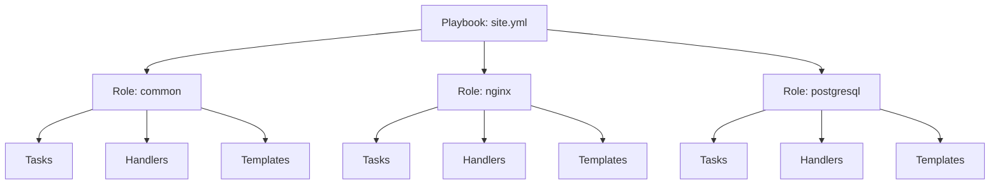

# How to Implement Ansible Roles and Playbooks

Author: [nawazdhandala](https://www.github.com/nawazdhandala)

Tags: Ansible, Roles, Playbooks, DevOps, Configuration Management, Infrastructure as Code

Description: Learn how to structure Ansible automation using roles and playbooks for reusable, maintainable infrastructure code with practical examples and best practices.

---

As your Ansible automation grows beyond simple scripts, organizing code into roles and playbooks becomes essential. Roles provide a standardized way to package related tasks, variables, files, and templates into reusable components. Playbooks orchestrate these roles to configure complete systems.

This guide covers building production-ready roles and composing them into effective playbooks.

## Understanding the Relationship Between Roles and Playbooks

Think of roles as building blocks and playbooks as blueprints. A role encapsulates everything needed to configure a single concern (like installing Nginx or setting up PostgreSQL). A playbook assembles multiple roles and applies them to specific hosts.



## Creating a Role from Scratch

Use `ansible-galaxy` to scaffold a role with the correct directory structure.

```bash
# Create a new role called 'nginx' in the roles directory
ansible-galaxy role init roles/nginx

# This creates the following structure:
# roles/nginx/
# ├── defaults/
# │   └── main.yml      # Default variables (lowest priority)
# ├── files/            # Static files to copy
# ├── handlers/
# │   └── main.yml      # Handler definitions
# ├── meta/
# │   └── main.yml      # Role metadata and dependencies
# ├── tasks/
# │   └── main.yml      # Main task list
# ├── templates/        # Jinja2 templates
# ├── tests/            # Test playbooks
# │   ├── inventory
# │   └── test.yml
# └── vars/
#     └── main.yml      # Role variables (higher priority)
```

## Building an Nginx Role

Let's create a complete Nginx role that installs, configures, and manages the web server.

### Default Variables

```yaml
# roles/nginx/defaults/main.yml
# These variables can be overridden in playbooks or inventory
---
nginx_worker_processes: auto
nginx_worker_connections: 1024
nginx_keepalive_timeout: 65

# Virtual host configuration
nginx_vhosts: []

# SSL settings
nginx_ssl_protocols: "TLSv1.2 TLSv1.3"
nginx_ssl_ciphers: "ECDHE-ECDSA-AES128-GCM-SHA256:ECDHE-RSA-AES128-GCM-SHA256"

# Logging
nginx_access_log: /var/log/nginx/access.log
nginx_error_log: /var/log/nginx/error.log

# Package state: present, latest, or absent
nginx_package_state: present
```

### Main Tasks

```yaml
# roles/nginx/tasks/main.yml
---
- name: Include OS-specific variables
  include_vars: "{{ ansible_os_family | lower }}.yml"

- name: Install Nginx package
  package:
    name: nginx
    state: "{{ nginx_package_state }}"
  notify: restart nginx

- name: Create Nginx configuration directory
  file:
    path: /etc/nginx/conf.d
    state: directory
    owner: root
    group: root
    mode: '0755'

- name: Deploy main Nginx configuration
  template:
    src: nginx.conf.j2
    dest: /etc/nginx/nginx.conf
    owner: root
    group: root
    mode: '0644'
    validate: nginx -t -c %s
  notify: reload nginx

- name: Deploy virtual host configurations
  template:
    src: vhost.conf.j2
    dest: "/etc/nginx/conf.d/{{ item.name }}.conf"
    owner: root
    group: root
    mode: '0644'
  loop: "{{ nginx_vhosts }}"
  when: nginx_vhosts | length > 0
  notify: reload nginx

- name: Remove default virtual host
  file:
    path: /etc/nginx/sites-enabled/default
    state: absent
  notify: reload nginx

- name: Ensure Nginx is started and enabled
  service:
    name: nginx
    state: started
    enabled: yes
```

### Handlers

```yaml
# roles/nginx/handlers/main.yml
# Handlers run only when notified by tasks
---
- name: restart nginx
  service:
    name: nginx
    state: restarted

- name: reload nginx
  service:
    name: nginx
    state: reloaded
```

### Templates

```jinja2
# roles/nginx/templates/nginx.conf.j2
# Main Nginx configuration file

user {{ nginx_user }};
worker_processes {{ nginx_worker_processes }};
pid /run/nginx.pid;

events {
    worker_connections {{ nginx_worker_connections }};
    multi_accept on;
    use epoll;
}

http {
    # Basic settings
    sendfile on;
    tcp_nopush on;
    tcp_nodelay on;
    keepalive_timeout {{ nginx_keepalive_timeout }};
    types_hash_max_size 2048;
    server_tokens off;

    # MIME types
    include /etc/nginx/mime.types;
    default_type application/octet-stream;

    # SSL settings
    ssl_protocols {{ nginx_ssl_protocols }};
    ssl_ciphers {{ nginx_ssl_ciphers }};
    ssl_prefer_server_ciphers on;

    # Logging
    access_log {{ nginx_access_log }};
    error_log {{ nginx_error_log }};

    # Gzip compression
    gzip on;
    gzip_vary on;
    gzip_proxied any;
    gzip_comp_level 6;
    gzip_types text/plain text/css text/xml application/json application/javascript application/xml;

    # Virtual host configs
    include /etc/nginx/conf.d/*.conf;
}
```

```jinja2
# roles/nginx/templates/vhost.conf.j2
# Virtual host configuration

server {
    listen {{ item.listen | default('80') }};
    server_name {{ item.server_name }};


    listen 443 ssl http2;
    ssl_certificate {{ item.ssl_certificate }};
    ssl_certificate_key {{ item.ssl_certificate_key }};


    root {{ item.root }};
    index {{ item.index | default('index.html index.htm') }};


    access_log {{ item.access_log }};



    location {{ location.path }} {

        proxy_pass {{ location.proxy_pass }};
        proxy_set_header Host $host;
        proxy_set_header X-Real-IP $remote_addr;
        proxy_set_header X-Forwarded-For $proxy_add_x_forwarded_for;
        proxy_set_header X-Forwarded-Proto $scheme;


        try_files {{ location.try_files }};

    }


}
```

### OS-Specific Variables

```yaml
# roles/nginx/vars/debian.yml
---
nginx_user: www-data

# roles/nginx/vars/redhat.yml
---
nginx_user: nginx
```

### Role Metadata

```yaml
# roles/nginx/meta/main.yml
---
galaxy_info:
  author: nawazdhandala
  description: Install and configure Nginx web server
  license: MIT
  min_ansible_version: "2.10"
  platforms:
    - name: Ubuntu
      versions:
        - focal
        - jammy
    - name: EL
      versions:
        - "8"
        - "9"
  galaxy_tags:
    - nginx
    - webserver
    - proxy

dependencies: []
```

## Building Playbooks That Use Roles

Now let's create playbooks that orchestrate multiple roles.

### Site-Wide Playbook

```yaml
# playbooks/site.yml
# Master playbook that configures all infrastructure
---
- name: Apply common configuration to all hosts
  hosts: all
  become: yes
  roles:
    - common
    - security

- name: Configure web servers
  hosts: webservers
  become: yes
  roles:
    - nginx
    - certbot
  vars:
    nginx_vhosts:
      - name: api
        server_name: api.example.com
        root: /var/www/api
        ssl: true
        ssl_certificate: /etc/letsencrypt/live/api.example.com/fullchain.pem
        ssl_certificate_key: /etc/letsencrypt/live/api.example.com/privkey.pem
        locations:
          - path: /
            proxy_pass: http://localhost:3000

- name: Configure database servers
  hosts: databases
  become: yes
  roles:
    - role: postgresql
      vars:
        postgresql_version: 15
        postgresql_databases:
          - name: app_production
            owner: app_user
```

### Deployment Playbook

```yaml
# playbooks/deploy.yml
# Application deployment playbook
---
- name: Deploy application
  hosts: webservers
  become: yes
  serial: 1  # Rolling deployment, one host at a time

  vars:
    app_name: myapp
    app_user: deploy
    app_path: /var/www/{{ app_name }}
    git_repo: git@github.com:company/myapp.git
    git_branch: main

  pre_tasks:
    - name: Remove server from load balancer
      uri:
        url: "http://{{ lb_api }}/servers/{{ inventory_hostname }}/disable"
        method: POST
      delegate_to: localhost

  roles:
    - role: app-deploy
      vars:
        deploy_repo: "{{ git_repo }}"
        deploy_branch: "{{ git_branch }}"
        deploy_path: "{{ app_path }}"

  post_tasks:
    - name: Wait for application to be healthy
      uri:
        url: "http://localhost:{{ app_port }}/health"
        status_code: 200
      register: health_check
      until: health_check.status == 200
      retries: 30
      delay: 5

    - name: Add server back to load balancer
      uri:
        url: "http://{{ lb_api }}/servers/{{ inventory_hostname }}/enable"
        method: POST
      delegate_to: localhost
```

## Using Role Variables and Defaults

Control role behavior through variables at different priority levels.

```yaml
# inventory/group_vars/webservers.yml
# Variables for all web servers
---
nginx_worker_processes: 4
nginx_worker_connections: 4096

nginx_vhosts:
  - name: default
    server_name: "_"
    root: /var/www/html
    locations:
      - path: /
        try_files: "$uri $uri/ =404"
```

```yaml
# inventory/host_vars/web1.example.com.yml
# Override for a specific high-traffic server
---
nginx_worker_processes: 8
nginx_worker_connections: 8192
```

## Composing Roles with Dependencies

Define role dependencies in `meta/main.yml` to automatically include prerequisite roles.

```yaml
# roles/app-deploy/meta/main.yml
---
dependencies:
  - role: common
  - role: nginx
    vars:
      nginx_package_state: present
  - role: nodejs
    vars:
      nodejs_version: "18"
```

## Using Tags for Selective Execution

Tags allow running specific parts of playbooks.

```yaml
# playbooks/site.yml with tags
---
- name: Configure web servers
  hosts: webservers
  become: yes

  roles:
    - role: common
      tags: [common, always]
    - role: nginx
      tags: [nginx, webserver]
    - role: certbot
      tags: [certbot, ssl]
    - role: app-deploy
      tags: [deploy, app]
```

```bash
# Run only nginx-related tasks
ansible-playbook playbooks/site.yml --tags nginx

# Run everything except deployment
ansible-playbook playbooks/site.yml --skip-tags deploy

# List all available tags
ansible-playbook playbooks/site.yml --list-tags
```

## Reusable Task Files

Break large roles into smaller, includable task files.

```yaml
# roles/nginx/tasks/main.yml
---
- name: Include installation tasks
  include_tasks: install.yml

- name: Include configuration tasks
  include_tasks: configure.yml

- name: Include virtual host tasks
  include_tasks: vhosts.yml
  when: nginx_vhosts | length > 0

- name: Include SSL tasks
  include_tasks: ssl.yml
  when: nginx_ssl_enabled | default(false)
```

## Testing Roles with Check Mode

Always test changes before applying them to production.

```bash
# Dry run to see what would change
ansible-playbook playbooks/site.yml --check --diff

# Limit to a single host for testing
ansible-playbook playbooks/site.yml --limit web1.example.com --check

# Step through tasks interactively
ansible-playbook playbooks/site.yml --step
```

---

Well-structured roles and playbooks transform Ansible from a scripting tool into a proper infrastructure-as-code solution. Invest time in designing clean role interfaces with sensible defaults, and your automation will scale gracefully as your infrastructure grows. Each role should do one thing well, and playbooks should read like documentation for how your systems are configured.
