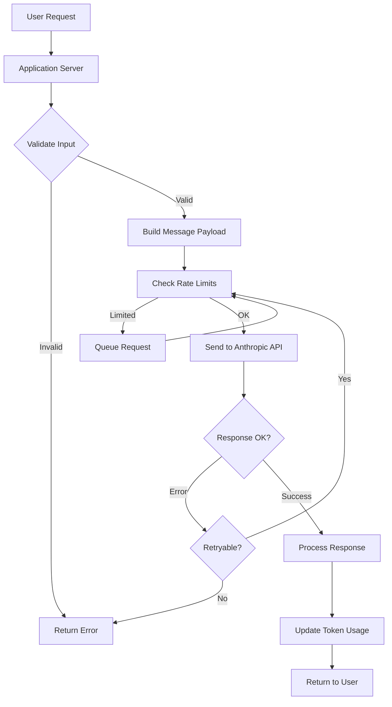

# How to Implement Anthropic API Integration

Author: [nawazdhandala](https://www.github.com/nawazdhandala)

Tags: AI, MLOps, Anthropic, Claude, API Integration, Python, LLM

Description: Learn how to integrate the Anthropic API into your applications for building AI-powered features with Claude. This guide covers authentication, message handling, streaming responses, and production best practices.

---

Integrating large language models into production applications requires careful consideration of authentication, error handling, rate limiting, and response processing. The Anthropic API provides access to Claude models and offers a straightforward interface for building AI-powered features. This guide walks through implementing a robust integration that handles real-world requirements.

## Getting Started with the Anthropic SDK

### Installation

```bash
# Python SDK
pip install anthropic

# Node.js SDK
npm install @anthropic-ai/sdk
```

### Basic Configuration

The SDK requires an API key for authentication. Store this securely using environment variables rather than hardcoding.

```python
import anthropic
import os

# Initialize the client with API key from environment
client = anthropic.Anthropic(
    api_key=os.environ.get("ANTHROPIC_API_KEY")
)

# Verify connection with a simple request
def verify_connection():
    """Test that the API connection works."""
    try:
        response = client.messages.create(
            model="claude-sonnet-4-20250514",
            max_tokens=100,
            messages=[
                {"role": "user", "content": "Hello, Claude!"}
            ]
        )
        print(f"Connection successful. Model: {response.model}")
        return True
    except anthropic.APIError as e:
        print(f"Connection failed: {e}")
        return False
```

## Building a Message Handler

A production integration needs structured message handling with proper error recovery.

```python
import anthropic
from dataclasses import dataclass
from typing import Optional, List
import logging

logger = logging.getLogger(__name__)

@dataclass
class Message:
    role: str  # "user" or "assistant"
    content: str

@dataclass
class ConversationResponse:
    content: str
    model: str
    input_tokens: int
    output_tokens: int
    stop_reason: str

class AnthropicClient:
    """Production-ready Anthropic API client."""

    def __init__(
        self,
        api_key: str,
        default_model: str = "claude-sonnet-4-20250514",
        max_retries: int = 3
    ):
        self.client = anthropic.Anthropic(
            api_key=api_key,
            max_retries=max_retries
        )
        self.default_model = default_model

    def send_message(
        self,
        messages: List[Message],
        system_prompt: Optional[str] = None,
        max_tokens: int = 4096,
        temperature: float = 1.0,
        model: Optional[str] = None
    ) -> ConversationResponse:
        """
        Send a conversation to Claude and get a response.

        Args:
            messages: List of conversation messages
            system_prompt: Optional system instructions
            max_tokens: Maximum tokens in response
            temperature: Sampling temperature (0-1)
            model: Model to use (defaults to client default)

        Returns:
            ConversationResponse with content and metadata
        """
        # Convert messages to API format
        api_messages = [
            {"role": m.role, "content": m.content}
            for m in messages
        ]

        # Build request parameters
        params = {
            "model": model or self.default_model,
            "max_tokens": max_tokens,
            "messages": api_messages,
            "temperature": temperature
        }

        # Add system prompt if provided
        if system_prompt:
            params["system"] = system_prompt

        try:
            response = self.client.messages.create(**params)

            # Extract text from response content blocks
            content = ""
            for block in response.content:
                if block.type == "text":
                    content += block.text

            return ConversationResponse(
                content=content,
                model=response.model,
                input_tokens=response.usage.input_tokens,
                output_tokens=response.usage.output_tokens,
                stop_reason=response.stop_reason
            )

        except anthropic.RateLimitError as e:
            logger.warning(f"Rate limited: {e}")
            raise
        except anthropic.APIStatusError as e:
            logger.error(f"API error: {e.status_code} - {e.message}")
            raise
```

## Implementing Streaming Responses

For better user experience, stream responses token by token instead of waiting for the complete response.

```python
from typing import Generator, Callable

class StreamingAnthropicClient(AnthropicClient):
    """Client with streaming support."""

    def stream_message(
        self,
        messages: List[Message],
        system_prompt: Optional[str] = None,
        max_tokens: int = 4096,
        on_token: Optional[Callable[[str], None]] = None
    ) -> Generator[str, None, ConversationResponse]:
        """
        Stream a response from Claude, yielding tokens as they arrive.

        Args:
            messages: Conversation messages
            system_prompt: Optional system instructions
            max_tokens: Maximum tokens in response
            on_token: Optional callback for each token

        Yields:
            Individual text tokens as they arrive

        Returns:
            Final ConversationResponse with complete content
        """
        api_messages = [
            {"role": m.role, "content": m.content}
            for m in messages
        ]

        params = {
            "model": self.default_model,
            "max_tokens": max_tokens,
            "messages": api_messages
        }

        if system_prompt:
            params["system"] = system_prompt

        full_content = ""
        input_tokens = 0
        output_tokens = 0

        # Use streaming context manager
        with self.client.messages.stream(**params) as stream:
            for text in stream.text_stream:
                full_content += text

                # Yield the token
                yield text

                # Call optional callback
                if on_token:
                    on_token(text)

            # Get final message for metadata
            final_message = stream.get_final_message()
            input_tokens = final_message.usage.input_tokens
            output_tokens = final_message.usage.output_tokens

        return ConversationResponse(
            content=full_content,
            model=self.default_model,
            input_tokens=input_tokens,
            output_tokens=output_tokens,
            stop_reason="end_turn"
        )

# Usage example
def print_streaming_response():
    client = StreamingAnthropicClient(
        api_key=os.environ["ANTHROPIC_API_KEY"]
    )

    messages = [
        Message(role="user", content="Explain how TCP works in simple terms.")
    ]

    print("Response: ", end="", flush=True)
    for token in client.stream_message(messages):
        print(token, end="", flush=True)
    print()  # Newline at end
```

## Conversation Management

Managing multi-turn conversations requires tracking message history and handling context limits.

```python
from collections import deque
import tiktoken

class ConversationManager:
    """Manage multi-turn conversations with context window handling."""

    def __init__(
        self,
        client: AnthropicClient,
        system_prompt: str,
        max_context_tokens: int = 100000
    ):
        self.client = client
        self.system_prompt = system_prompt
        self.max_context_tokens = max_context_tokens
        self.messages: List[Message] = []

        # Use tiktoken for approximate token counting
        # Claude uses a similar tokenizer
        self.encoder = tiktoken.get_encoding("cl100k_base")

    def _count_tokens(self, text: str) -> int:
        """Approximate token count for text."""
        return len(self.encoder.encode(text))

    def _get_conversation_tokens(self) -> int:
        """Count total tokens in conversation."""
        total = self._count_tokens(self.system_prompt)
        for msg in self.messages:
            total += self._count_tokens(msg.content)
        return total

    def _trim_conversation(self, reserve_tokens: int = 4096):
        """
        Remove oldest messages to stay within context limit.
        Always keeps the most recent messages.
        """
        target = self.max_context_tokens - reserve_tokens

        while self._get_conversation_tokens() > target and len(self.messages) > 2:
            # Remove oldest message pair (user + assistant)
            self.messages.pop(0)
            if self.messages and self.messages[0].role == "assistant":
                self.messages.pop(0)

    def send(self, user_message: str) -> str:
        """
        Send a user message and get assistant response.

        Automatically handles context trimming and maintains
        conversation history.
        """
        # Add user message
        self.messages.append(Message(role="user", content=user_message))

        # Trim if needed
        self._trim_conversation()

        # Get response
        response = self.client.send_message(
            messages=self.messages,
            system_prompt=self.system_prompt
        )

        # Add assistant response to history
        self.messages.append(Message(role="assistant", content=response.content))

        return response.content

    def clear(self):
        """Clear conversation history."""
        self.messages = []

# Usage
conversation = ConversationManager(
    client=AnthropicClient(api_key=os.environ["ANTHROPIC_API_KEY"]),
    system_prompt="You are a helpful coding assistant. Be concise and provide working code examples."
)

response1 = conversation.send("How do I read a JSON file in Python?")
response2 = conversation.send("Now show me how to handle errors in that code.")
```

## Error Handling and Retries

Production integrations need robust error handling with exponential backoff.

```python
import time
from functools import wraps

def with_retry(max_retries: int = 3, base_delay: float = 1.0):
    """
    Decorator for retrying API calls with exponential backoff.

    Handles rate limits and transient errors automatically.
    """
    def decorator(func):
        @wraps(func)
        def wrapper(*args, **kwargs):
            last_exception = None

            for attempt in range(max_retries):
                try:
                    return func(*args, **kwargs)

                except anthropic.RateLimitError as e:
                    last_exception = e
                    # Use retry-after header if available
                    retry_after = getattr(e, 'retry_after', None)
                    delay = retry_after or (base_delay * (2 ** attempt))
                    logger.warning(
                        f"Rate limited, retrying in {delay}s "
                        f"(attempt {attempt + 1}/{max_retries})"
                    )
                    time.sleep(delay)

                except anthropic.APIConnectionError as e:
                    last_exception = e
                    delay = base_delay * (2 ** attempt)
                    logger.warning(
                        f"Connection error, retrying in {delay}s "
                        f"(attempt {attempt + 1}/{max_retries})"
                    )
                    time.sleep(delay)

                except anthropic.APIStatusError as e:
                    # Don't retry client errors (4xx except 429)
                    if 400 <= e.status_code < 500 and e.status_code != 429:
                        raise
                    last_exception = e
                    delay = base_delay * (2 ** attempt)
                    time.sleep(delay)

            # All retries exhausted
            raise last_exception

        return wrapper
    return decorator

class RobustAnthropicClient(AnthropicClient):
    """Client with built-in retry logic."""

    @with_retry(max_retries=3, base_delay=1.0)
    def send_message(self, *args, **kwargs):
        return super().send_message(*args, **kwargs)
```

## Request Architecture

The following diagram shows how requests flow through a typical Anthropic integration:



## Monitoring Token Usage

Track token consumption for cost management and quota monitoring.

```python
from datetime import datetime, timedelta
from collections import defaultdict
import threading

class TokenUsageTracker:
    """Track token usage for cost monitoring."""

    # Pricing per 1M tokens (as of early 2026)
    PRICING = {
        "claude-sonnet-4-20250514": {"input": 3.00, "output": 15.00},
        "claude-opus-4-20250514": {"input": 15.00, "output": 75.00},
        "claude-3-5-haiku-20241022": {"input": 0.80, "output": 4.00}
    }

    def __init__(self):
        self.usage = defaultdict(lambda: {"input": 0, "output": 0})
        self.hourly_usage = defaultdict(lambda: defaultdict(lambda: {"input": 0, "output": 0}))
        self._lock = threading.Lock()

    def record(self, model: str, input_tokens: int, output_tokens: int):
        """Record token usage for a request."""
        hour_key = datetime.now().strftime("%Y-%m-%d-%H")

        with self._lock:
            self.usage[model]["input"] += input_tokens
            self.usage[model]["output"] += output_tokens
            self.hourly_usage[hour_key][model]["input"] += input_tokens
            self.hourly_usage[hour_key][model]["output"] += output_tokens

    def get_cost(self, model: str) -> float:
        """Calculate total cost for a model."""
        if model not in self.PRICING:
            return 0.0

        pricing = self.PRICING[model]
        usage = self.usage[model]

        input_cost = (usage["input"] / 1_000_000) * pricing["input"]
        output_cost = (usage["output"] / 1_000_000) * pricing["output"]

        return input_cost + output_cost

    def get_total_cost(self) -> float:
        """Calculate total cost across all models."""
        return sum(self.get_cost(model) for model in self.usage)

    def get_summary(self) -> dict:
        """Get usage summary."""
        return {
            "models": dict(self.usage),
            "total_cost_usd": self.get_total_cost()
        }

# Global tracker instance
usage_tracker = TokenUsageTracker()

class TrackedAnthropicClient(RobustAnthropicClient):
    """Client that tracks token usage."""

    def send_message(self, *args, **kwargs):
        response = super().send_message(*args, **kwargs)

        usage_tracker.record(
            model=response.model,
            input_tokens=response.input_tokens,
            output_tokens=response.output_tokens
        )

        return response
```

## Production Configuration

For production deployments, use environment-based configuration.

```python
from pydantic import BaseSettings

class AnthropicSettings(BaseSettings):
    """Configuration for Anthropic integration."""

    api_key: str
    default_model: str = "claude-sonnet-4-20250514"
    max_retries: int = 3
    timeout_seconds: float = 60.0
    max_tokens_default: int = 4096

    # Rate limiting
    requests_per_minute: int = 50
    tokens_per_minute: int = 100000

    class Config:
        env_prefix = "ANTHROPIC_"

def create_production_client() -> TrackedAnthropicClient:
    """Create a production-configured client."""
    settings = AnthropicSettings()

    return TrackedAnthropicClient(
        api_key=settings.api_key,
        default_model=settings.default_model,
        max_retries=settings.max_retries
    )
```

## Summary

| Component | Purpose |
|-----------|---------|
| **Basic Client** | Simple message sending with error handling |
| **Streaming** | Token-by-token response for better UX |
| **Conversation Manager** | Multi-turn dialogue with context handling |
| **Retry Logic** | Exponential backoff for rate limits |
| **Usage Tracking** | Monitor tokens and costs |

Implementing Anthropic API integration requires handling the nuances of LLM communication: streaming for responsiveness, context management for conversations, and robust error handling for production reliability. With these patterns in place, you can build AI features that perform well under real-world conditions.
