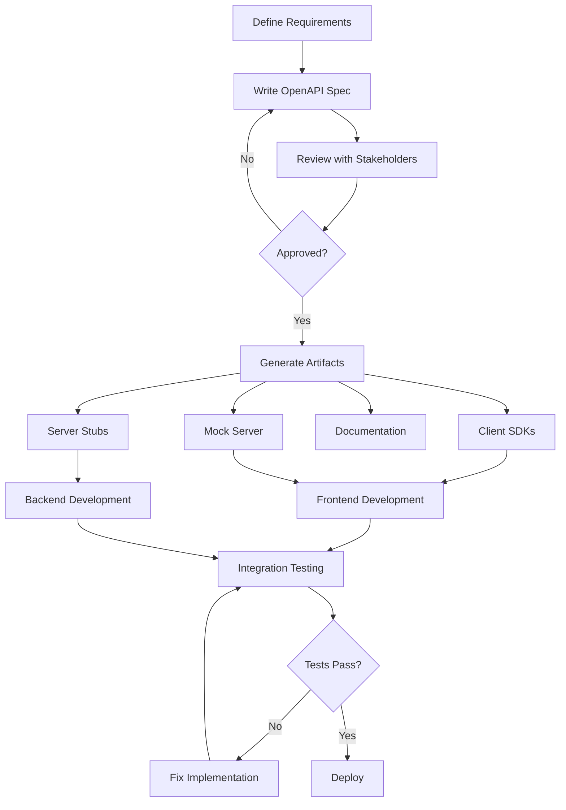

# How to Implement API Design-First Development

Author: [nawazdhandala](https://www.github.com/nawazdhandala)

Tags: API Design, OpenAPI, Developer Experience, REST, Documentation

Description: Learn how to implement API design-first development where you define your API specification before writing code, ensuring better documentation, client generation, and team alignment.

---

Most teams build APIs code-first: write the implementation, then generate documentation from code annotations. This approach leads to inconsistent APIs, poor documentation, and friction between frontend and backend teams. API design-first flips this: define the API contract first, then implement to match that specification.

## Why Design-First?

Design-first development provides several benefits:

- **Better collaboration**: Frontend and backend can work in parallel using the agreed contract
- **Consistent APIs**: Specifications enforce naming conventions and patterns
- **Early feedback**: Stakeholders review API design before implementation effort
- **Generated artifacts**: Clients, mocks, and tests come from the specification
- **Living documentation**: Documentation stays accurate because it is the source of truth

The investment in upfront design pays off throughout the API lifecycle.

## The OpenAPI Specification

OpenAPI (formerly Swagger) is the industry standard for describing REST APIs:

```yaml
# openapi.yaml
openapi: 3.1.0
info:
  title: Order Management API
  description: API for managing customer orders
  version: 1.0.0
  contact:
    name: API Team
    email: api-team@example.com

servers:
  - url: https://api.example.com/v1
    description: Production
  - url: https://api-staging.example.com/v1
    description: Staging
  - url: http://localhost:3000/v1
    description: Local development

tags:
  - name: orders
    description: Order operations
  - name: products
    description: Product catalog

paths:
  /orders:
    get:
      summary: List orders
      description: Retrieve a paginated list of orders with optional filters
      operationId: listOrders
      tags:
        - orders
      parameters:
        - name: status
          in: query
          description: Filter by order status
          schema:
            type: string
            enum: [pending, confirmed, shipped, delivered, cancelled]
        - name: page
          in: query
          description: Page number (1-indexed)
          schema:
            type: integer
            minimum: 1
            default: 1
        - name: limit
          in: query
          description: Items per page
          schema:
            type: integer
            minimum: 1
            maximum: 100
            default: 20
      responses:
        '200':
          description: Successful response
          content:
            application/json:
              schema:
                $ref: '#/components/schemas/OrderList'
        '401':
          $ref: '#/components/responses/Unauthorized'

    post:
      summary: Create order
      description: Create a new order
      operationId: createOrder
      tags:
        - orders
      requestBody:
        required: true
        content:
          application/json:
            schema:
              $ref: '#/components/schemas/CreateOrderRequest'
            examples:
              basic:
                summary: Basic order
                value:
                  customerId: "cust_123"
                  items:
                    - productId: "prod_456"
                      quantity: 2
      responses:
        '201':
          description: Order created
          content:
            application/json:
              schema:
                $ref: '#/components/schemas/Order'
        '400':
          $ref: '#/components/responses/BadRequest'
        '401':
          $ref: '#/components/responses/Unauthorized'

  /orders/{orderId}:
    get:
      summary: Get order
      description: Retrieve a specific order by ID
      operationId: getOrder
      tags:
        - orders
      parameters:
        - name: orderId
          in: path
          required: true
          schema:
            type: string
            pattern: '^ord_[a-zA-Z0-9]+$'
          example: ord_abc123
      responses:
        '200':
          description: Successful response
          content:
            application/json:
              schema:
                $ref: '#/components/schemas/Order'
        '404':
          $ref: '#/components/responses/NotFound'

components:
  schemas:
    Order:
      type: object
      required:
        - id
        - customerId
        - status
        - items
        - createdAt
      properties:
        id:
          type: string
          pattern: '^ord_[a-zA-Z0-9]+$'
          example: ord_abc123
        customerId:
          type: string
          example: cust_123
        status:
          type: string
          enum: [pending, confirmed, shipped, delivered, cancelled]
        items:
          type: array
          items:
            $ref: '#/components/schemas/OrderItem'
        total:
          type: number
          format: decimal
          example: 99.99
        createdAt:
          type: string
          format: date-time
        updatedAt:
          type: string
          format: date-time

    OrderItem:
      type: object
      required:
        - productId
        - quantity
        - price
      properties:
        productId:
          type: string
        productName:
          type: string
        quantity:
          type: integer
          minimum: 1
        price:
          type: number
          format: decimal

    CreateOrderRequest:
      type: object
      required:
        - customerId
        - items
      properties:
        customerId:
          type: string
        items:
          type: array
          minItems: 1
          items:
            type: object
            required:
              - productId
              - quantity
            properties:
              productId:
                type: string
              quantity:
                type: integer
                minimum: 1

    OrderList:
      type: object
      properties:
        data:
          type: array
          items:
            $ref: '#/components/schemas/Order'
        pagination:
          $ref: '#/components/schemas/Pagination'

    Pagination:
      type: object
      properties:
        page:
          type: integer
        limit:
          type: integer
        total:
          type: integer
        totalPages:
          type: integer

    Error:
      type: object
      required:
        - code
        - message
      properties:
        code:
          type: string
        message:
          type: string
        details:
          type: object

  responses:
    BadRequest:
      description: Invalid request
      content:
        application/json:
          schema:
            $ref: '#/components/schemas/Error'
          example:
            code: INVALID_REQUEST
            message: "Validation failed"
            details:
              items: "Must contain at least one item"

    Unauthorized:
      description: Authentication required
      content:
        application/json:
          schema:
            $ref: '#/components/schemas/Error'
          example:
            code: UNAUTHORIZED
            message: "Authentication required"

    NotFound:
      description: Resource not found
      content:
        application/json:
          schema:
            $ref: '#/components/schemas/Error'
          example:
            code: NOT_FOUND
            message: "Order not found"

  securitySchemes:
    bearerAuth:
      type: http
      scheme: bearer
      bearerFormat: JWT

security:
  - bearerAuth: []
```

## API Design Workflow

Here is the design-first workflow:



## Validation and Linting

Validate your OpenAPI specification:

```bash
# Install Redocly CLI
npm install -g @redocly/cli

# Lint the specification
redocly lint openapi.yaml

# Preview documentation
redocly preview-docs openapi.yaml
```

Configure linting rules in `.redocly.yaml`:

```yaml
# .redocly.yaml
extends:
  - recommended

rules:
  # Require operation IDs
  operation-operationId: error

  # Require descriptions
  operation-description: warn
  tag-description: warn

  # Naming conventions
  path-segment-plural: error
  operation-operationId-unique: error

  # Security
  security-defined: error

  # Response standards
  operation-2xx-response: error
  no-path-trailing-slash: error

theme:
  openapi:
    generateCodeSamples:
      languages:
        - lang: curl
        - lang: JavaScript
        - lang: Python
```

## Generating Client SDKs

Generate typed clients from the specification:

```bash
# Install OpenAPI Generator
npm install -g @openapitools/openapi-generator-cli

# Generate TypeScript client
openapi-generator-cli generate \
    -i openapi.yaml \
    -g typescript-fetch \
    -o ./clients/typescript \
    --additional-properties=supportsES6=true,npmName=@acme/orders-client

# Generate Python client
openapi-generator-cli generate \
    -i openapi.yaml \
    -g python \
    -o ./clients/python \
    --additional-properties=packageName=orders_client
```

Use the generated client:

```typescript
// Using generated TypeScript client
import { OrdersApi, Configuration } from '@acme/orders-client';

const api = new OrdersApi(new Configuration({
  basePath: 'https://api.example.com/v1',
  accessToken: 'your-jwt-token',
}));

// Type-safe API calls
const orders = await api.listOrders({ status: 'pending', page: 1 });
console.log(orders.data);

const newOrder = await api.createOrder({
  createOrderRequest: {
    customerId: 'cust_123',
    items: [{ productId: 'prod_456', quantity: 2 }],
  },
});
console.log(newOrder.id);
```

## Mock Server for Frontend Development

Run a mock server while backend is in development:

```bash
# Install Prism mock server
npm install -g @stoplight/prism-cli

# Start mock server
prism mock openapi.yaml

# Mock server runs at http://127.0.0.1:4010
# Returns example responses from the spec
```

Configure mocking in Docker Compose:

```yaml
# docker-compose.yml
version: '3.8'

services:
  api-mock:
    image: stoplight/prism:4
    command: mock -h 0.0.0.0 /api/openapi.yaml
    volumes:
      - ./openapi.yaml:/api/openapi.yaml:ro
    ports:
      - "4010:4010"

  frontend:
    build: ./frontend
    environment:
      - API_URL=http://api-mock:4010
    depends_on:
      - api-mock
```

## Contract Testing

Validate implementations match the specification:

```typescript
// tests/contract.test.ts
import { OpenAPIValidator } from 'express-openapi-validator';
import request from 'supertest';
import app from '../src/app';

describe('API Contract Tests', () => {
  beforeAll(async () => {
    // Install OpenAPI validator middleware
    await OpenAPIValidator.install(app, {
      apiSpec: './openapi.yaml',
      validateRequests: true,
      validateResponses: true,
    });
  });

  describe('GET /orders', () => {
    it('returns valid response matching schema', async () => {
      const response = await request(app)
        .get('/v1/orders')
        .set('Authorization', 'Bearer test-token')
        .expect(200);

      // Response automatically validated against OpenAPI schema
      expect(response.body.data).toBeInstanceOf(Array);
    });
  });

  describe('POST /orders', () => {
    it('validates request body', async () => {
      const response = await request(app)
        .post('/v1/orders')
        .set('Authorization', 'Bearer test-token')
        .send({
          // Missing required field: items
          customerId: 'cust_123',
        })
        .expect(400);

      expect(response.body.code).toBe('INVALID_REQUEST');
    });
  });
});
```

## Documentation Generation

Generate beautiful documentation:

```bash
# Generate static HTML documentation with Redoc
npx @redocly/cli build-docs openapi.yaml -o docs/api.html

# Or serve interactive docs
npx @redocly/cli preview-docs openapi.yaml
```

Embed in your documentation site:

```html
<!-- docs/api.html -->
<!DOCTYPE html>
<html>
<head>
  <title>API Documentation</title>
  <link href="https://fonts.googleapis.com/css?family=Roboto:300,400,700" rel="stylesheet">
  <style>
    body { margin: 0; padding: 0; }
  </style>
</head>
<body>
  <redoc spec-url='openapi.yaml'></redoc>
  <script src="https://cdn.redoc.ly/redoc/latest/bundles/redoc.standalone.js"></script>
</body>
</html>
```

## CI/CD Integration

Validate specifications in CI:

```yaml
# .github/workflows/api.yml
name: API Specification

on:
  push:
    paths:
      - 'openapi.yaml'
      - 'api/**'
  pull_request:
    paths:
      - 'openapi.yaml'
      - 'api/**'

jobs:
  validate:
    runs-on: ubuntu-latest
    steps:
      - uses: actions/checkout@v4

      - name: Setup Node.js
        uses: actions/setup-node@v4
        with:
          node-version: 20

      - name: Install tools
        run: npm install -g @redocly/cli @openapitools/openapi-generator-cli

      - name: Lint specification
        run: redocly lint openapi.yaml

      - name: Check for breaking changes
        run: |
          git fetch origin main
          redocly diff openapi.yaml origin/main:openapi.yaml

      - name: Generate clients
        run: |
          openapi-generator-cli generate -i openapi.yaml -g typescript-fetch -o ./clients/ts
          openapi-generator-cli generate -i openapi.yaml -g python -o ./clients/python

      - name: Build documentation
        run: redocly build-docs openapi.yaml -o docs/api.html

      - name: Upload documentation
        uses: actions/upload-artifact@v4
        with:
          name: api-docs
          path: docs/api.html
```

## Best Practices

1. **Version your API**: Include version in the URL path (`/v1/`) and track breaking changes.

2. **Use consistent naming**: Establish conventions for paths, operations, and schemas. Enforce with linting.

3. **Provide examples**: Include realistic examples in your specification. They populate mocks and documentation.

4. **Review as a team**: Treat API changes like code changes. Require reviews before merging specification updates.

5. **Generate, do not handwrite**: Generate clients, documentation, and validation from the spec. Manual duplication drifts.

API design-first development requires discipline upfront but prevents costly changes later. When teams agree on the contract before implementation, frontend and backend work in parallel, documentation stays accurate, and integration surprises become rare.
