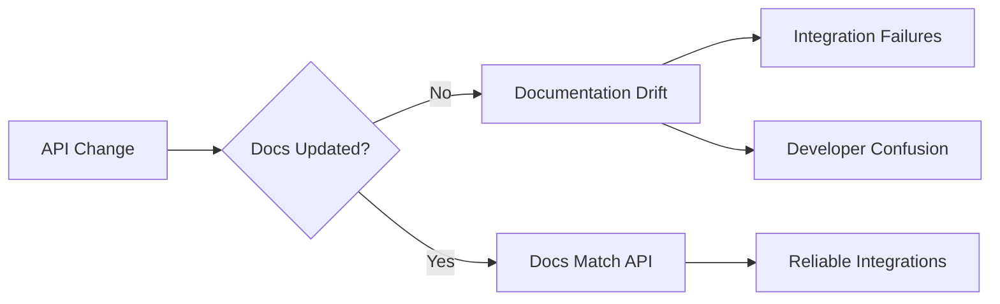

# How to Implement API Documentation Testing

Author: [nawazdhandala](https://github.com/nawazdhandala)

Tags: API Testing, OpenAPI, Documentation, Contract Testing, DevOps

Description: Learn to automatically test that your API implementation matches its documentation using OpenAPI specification validation, preventing documentation drift and contract violations.

---

API documentation that does not match the actual implementation causes integration failures and wasted debugging time. Documentation testing verifies that your API responses match the documented schema, preventing documentation drift. This guide shows how to implement automated documentation testing using OpenAPI specifications.

## The Documentation Drift Problem

Documentation drift occurs when code changes without corresponding documentation updates:



Automated testing catches drift before it reaches production.

## OpenAPI Specification

Start with a well-defined OpenAPI specification:

```yaml
# openapi.yaml
openapi: 3.0.3
info:
  title: Product API
  version: 1.0.0
  description: API for managing products in the catalog

servers:
  - url: https://api.example.com/v1

paths:
  /products:
    get:
      operationId: listProducts
      summary: List all products
      parameters:
        - name: limit
          in: query
          schema:
            type: integer
            minimum: 1
            maximum: 100
            default: 20
        - name: offset
          in: query
          schema:
            type: integer
            minimum: 0
            default: 0
        - name: category
          in: query
          schema:
            type: string
      responses:
        '200':
          description: Successful response
          content:
            application/json:
              schema:
                $ref: '#/components/schemas/ProductList'
        '400':
          description: Invalid parameters
          content:
            application/json:
              schema:
                $ref: '#/components/schemas/Error'

    post:
      operationId: createProduct
      summary: Create a new product
      requestBody:
        required: true
        content:
          application/json:
            schema:
              $ref: '#/components/schemas/CreateProductRequest'
      responses:
        '201':
          description: Product created
          content:
            application/json:
              schema:
                $ref: '#/components/schemas/Product'
        '400':
          description: Invalid request body
          content:
            application/json:
              schema:
                $ref: '#/components/schemas/Error'
        '409':
          description: Product already exists
          content:
            application/json:
              schema:
                $ref: '#/components/schemas/Error'

  /products/{id}:
    get:
      operationId: getProduct
      summary: Get product by ID
      parameters:
        - name: id
          in: path
          required: true
          schema:
            type: string
            format: uuid
      responses:
        '200':
          description: Successful response
          content:
            application/json:
              schema:
                $ref: '#/components/schemas/Product'
        '404':
          description: Product not found
          content:
            application/json:
              schema:
                $ref: '#/components/schemas/Error'

components:
  schemas:
    Product:
      type: object
      required:
        - id
        - name
        - price
        - createdAt
      properties:
        id:
          type: string
          format: uuid
        name:
          type: string
          minLength: 1
          maxLength: 200
        description:
          type: string
          maxLength: 2000
        price:
          type: number
          format: float
          minimum: 0
        category:
          type: string
        inStock:
          type: boolean
          default: true
        createdAt:
          type: string
          format: date-time
        updatedAt:
          type: string
          format: date-time

    CreateProductRequest:
      type: object
      required:
        - name
        - price
      properties:
        name:
          type: string
          minLength: 1
          maxLength: 200
        description:
          type: string
          maxLength: 2000
        price:
          type: number
          format: float
          minimum: 0
        category:
          type: string

    ProductList:
      type: object
      required:
        - items
        - total
      properties:
        items:
          type: array
          items:
            $ref: '#/components/schemas/Product'
        total:
          type: integer
        limit:
          type: integer
        offset:
          type: integer

    Error:
      type: object
      required:
        - code
        - message
      properties:
        code:
          type: string
        message:
          type: string
        details:
          type: object
```

## Response Validation with openapi-backend

Validate API responses against the OpenAPI spec in Node.js:

```typescript
// api-doc-test.ts
import OpenAPIBackend from 'openapi-backend';
import Ajv from 'ajv';
import addFormats from 'ajv-formats';
import axios from 'axios';
import { readFileSync } from 'fs';
import yaml from 'js-yaml';

// Load and parse OpenAPI specification
const spec = yaml.load(readFileSync('./openapi.yaml', 'utf8')) as any;

// Initialize JSON Schema validator with format support
const ajv = new Ajv({ allErrors: true, strict: false });
addFormats(ajv);

// Add all schemas from OpenAPI spec to validator
for (const [name, schema] of Object.entries(spec.components.schemas)) {
    ajv.addSchema(schema, `#/components/schemas/${name}`);
}

interface ValidationResult {
    valid: boolean;
    errors: string[];
    operationId: string;
    statusCode: number;
}

// Validate response against documented schema
function validateResponse(
    operationId: string,
    statusCode: number,
    responseBody: any
): ValidationResult {
    // Find the operation in the spec
    let operation: any = null;
    let foundPath: string = '';

    for (const [path, methods] of Object.entries(spec.paths)) {
        for (const [method, op] of Object.entries(methods as any)) {
            if ((op as any).operationId === operationId) {
                operation = op;
                foundPath = path;
                break;
            }
        }
    }

    if (!operation) {
        return {
            valid: false,
            errors: [`Operation ${operationId} not found in spec`],
            operationId,
            statusCode,
        };
    }

    // Get expected response schema
    const responseSpec = operation.responses[statusCode.toString()];
    if (!responseSpec) {
        return {
            valid: false,
            errors: [`Status code ${statusCode} not documented for ${operationId}`],
            operationId,
            statusCode,
        };
    }

    const schema = responseSpec.content?.['application/json']?.schema;
    if (!schema) {
        // No schema defined, any response is valid
        return { valid: true, errors: [], operationId, statusCode };
    }

    // Resolve $ref if present
    let resolvedSchema = schema;
    if (schema.$ref) {
        const refPath = schema.$ref.replace('#/', '').split('/');
        resolvedSchema = refPath.reduce((obj: any, key: string) => obj[key], spec);
    }

    // Validate response body
    const validate = ajv.compile(resolvedSchema);
    const valid = validate(responseBody);

    return {
        valid: valid as boolean,
        errors: validate.errors?.map(e =>
            `${e.instancePath} ${e.message}`
        ) || [],
        operationId,
        statusCode,
    };
}

// Test suite runner
async function runDocumentationTests(baseUrl: string) {
    const results: ValidationResult[] = [];

    // Test: List products
    console.log('Testing: listProducts');
    const listResponse = await axios.get(`${baseUrl}/products`);
    results.push(validateResponse('listProducts', listResponse.status, listResponse.data));

    // Test: Create product
    console.log('Testing: createProduct');
    const createResponse = await axios.post(`${baseUrl}/products`, {
        name: 'Test Product',
        price: 29.99,
        category: 'electronics',
    });
    results.push(validateResponse('createProduct', createResponse.status, createResponse.data));

    // Test: Get product
    console.log('Testing: getProduct');
    const productId = createResponse.data.id;
    const getResponse = await axios.get(`${baseUrl}/products/${productId}`);
    results.push(validateResponse('getProduct', getResponse.status, getResponse.data));

    // Test: Get non-existent product (404)
    console.log('Testing: getProduct (404)');
    try {
        await axios.get(`${baseUrl}/products/00000000-0000-0000-0000-000000000000`);
    } catch (error: any) {
        results.push(validateResponse('getProduct', error.response.status, error.response.data));
    }

    // Report results
    console.log('\n=== Documentation Test Results ===\n');

    let passed = 0;
    let failed = 0;

    for (const result of results) {
        if (result.valid) {
            console.log(`PASS: ${result.operationId} (${result.statusCode})`);
            passed++;
        } else {
            console.log(`FAIL: ${result.operationId} (${result.statusCode})`);
            console.log(`  Errors: ${result.errors.join(', ')}`);
            failed++;
        }
    }

    console.log(`\nTotal: ${passed} passed, ${failed} failed`);

    return failed === 0;
}

// Run tests
runDocumentationTests('http://localhost:3000/v1')
    .then(success => process.exit(success ? 0 : 1))
    .catch(err => {
        console.error(err);
        process.exit(1);
    });
```

## Python Implementation with Schemathesis

Schemathesis automatically generates tests from your OpenAPI spec:

```python
# test_api_docs.py
import schemathesis
from hypothesis import settings, Phase

# Load OpenAPI specification
schema = schemathesis.from_path("./openapi.yaml", base_url="http://localhost:3000/v1")

# Generate tests for all endpoints
@schema.parametrize()
@settings(max_examples=50, phases=[Phase.generate])
def test_api_matches_documentation(case):
    """
    Schemathesis automatically generates test cases based on
    the OpenAPI specification and validates responses.
    """
    response = case.call()
    case.validate_response(response)
```

Run with pytest:

```bash
pytest test_api_docs.py -v --hypothesis-show-statistics
```

## Request Validation Middleware

Validate incoming requests match documented schemas:

```typescript
// middleware/openapi-validator.ts
import { OpenAPIV3 } from 'openapi-types';
import Ajv, { ValidateFunction } from 'ajv';
import addFormats from 'ajv-formats';
import { Request, Response, NextFunction } from 'express';

interface ValidatorMiddleware {
    validateRequest: (req: Request, res: Response, next: NextFunction) => void;
    validateResponse: (operationId: string) => (req: Request, res: Response, next: NextFunction) => void;
}

export function createOpenAPIValidator(spec: OpenAPIV3.Document): ValidatorMiddleware {
    const ajv = new Ajv({ allErrors: true, coerceTypes: true });
    addFormats(ajv);

    // Compile all schemas
    const validators = new Map<string, ValidateFunction>();

    for (const [name, schema] of Object.entries(spec.components?.schemas || {})) {
        validators.set(name, ajv.compile(schema as any));
    }

    // Build operation lookup
    const operations = new Map<string, {
        path: string;
        method: string;
        operation: OpenAPIV3.OperationObject;
    }>();

    for (const [path, methods] of Object.entries(spec.paths || {})) {
        for (const [method, operation] of Object.entries(methods as any)) {
            if (operation.operationId) {
                operations.set(operation.operationId, {
                    path,
                    method,
                    operation,
                });
            }
        }
    }

    return {
        validateRequest: (req: Request, res: Response, next: NextFunction) => {
            // Find matching operation
            const operationId = req.route?.path ? findOperationId(req, operations) : null;

            if (!operationId) {
                return next();
            }

            const op = operations.get(operationId);
            if (!op) {
                return next();
            }

            // Validate request body if present
            const requestBody = op.operation.requestBody as OpenAPIV3.RequestBodyObject;
            if (requestBody && req.body) {
                const schema = requestBody.content?.['application/json']?.schema;
                if (schema) {
                    const validate = ajv.compile(schema as any);
                    if (!validate(req.body)) {
                        return res.status(400).json({
                            code: 'INVALID_REQUEST',
                            message: 'Request body does not match schema',
                            details: validate.errors,
                        });
                    }
                }
            }

            // Validate query parameters
            const queryParams = op.operation.parameters?.filter(
                (p: any) => p.in === 'query'
            ) || [];

            for (const param of queryParams) {
                const p = param as OpenAPIV3.ParameterObject;
                if (p.required && !req.query[p.name]) {
                    return res.status(400).json({
                        code: 'MISSING_PARAMETER',
                        message: `Required query parameter '${p.name}' is missing`,
                    });
                }
            }

            next();
        },

        validateResponse: (operationId: string) => {
            return (req: Request, res: Response, next: NextFunction) => {
                // Store original json method
                const originalJson = res.json.bind(res);

                // Override json to validate before sending
                res.json = (body: any) => {
                    const op = operations.get(operationId);
                    if (op) {
                        const responseSpec = op.operation.responses[res.statusCode.toString()];
                        if (responseSpec) {
                            const schema = (responseSpec as any).content?.['application/json']?.schema;
                            if (schema) {
                                const validate = ajv.compile(schema as any);
                                if (!validate(body)) {
                                    console.error(
                                        `Response validation failed for ${operationId}:`,
                                        validate.errors
                                    );
                                    // In development, return validation errors
                                    if (process.env.NODE_ENV === 'development') {
                                        return originalJson({
                                            code: 'RESPONSE_VALIDATION_ERROR',
                                            message: 'Response does not match documented schema',
                                            details: validate.errors,
                                        });
                                    }
                                }
                            }
                        }
                    }
                    return originalJson(body);
                };

                next();
            };
        },
    };
}

function findOperationId(
    req: Request,
    operations: Map<string, any>
): string | null {
    // Match request path and method to operation
    for (const [opId, op] of operations) {
        if (req.method.toLowerCase() === op.method && pathMatches(req.path, op.path)) {
            return opId;
        }
    }
    return null;
}

function pathMatches(requestPath: string, specPath: string): boolean {
    // Convert OpenAPI path params to regex
    const pattern = specPath.replace(/{[^}]+}/g, '[^/]+');
    const regex = new RegExp(`^${pattern}$`);
    return regex.test(requestPath);
}
```

## Integration Test Suite

Create comprehensive documentation tests:

```typescript
// __tests__/api-documentation.test.ts
import request from 'supertest';
import { app } from '../app';
import { loadSpec, validateAgainstSpec } from './helpers/openapi-validator';

const spec = loadSpec('./openapi.yaml');

describe('API Documentation Compliance', () => {
    describe('GET /products', () => {
        it('should return response matching documented schema', async () => {
            const response = await request(app)
                .get('/v1/products')
                .expect(200);

            const validation = validateAgainstSpec(
                spec,
                'listProducts',
                200,
                response.body
            );

            expect(validation.valid).toBe(true);
            expect(validation.errors).toHaveLength(0);
        });

        it('should return 400 for invalid limit parameter', async () => {
            const response = await request(app)
                .get('/v1/products?limit=invalid')
                .expect(400);

            const validation = validateAgainstSpec(
                spec,
                'listProducts',
                400,
                response.body
            );

            expect(validation.valid).toBe(true);
            expect(response.body).toHaveProperty('code');
            expect(response.body).toHaveProperty('message');
        });
    });

    describe('POST /products', () => {
        it('should accept valid request body per documentation', async () => {
            const validProduct = {
                name: 'Test Product',
                price: 19.99,
                category: 'test',
            };

            const response = await request(app)
                .post('/v1/products')
                .send(validProduct)
                .expect(201);

            const validation = validateAgainstSpec(
                spec,
                'createProduct',
                201,
                response.body
            );

            expect(validation.valid).toBe(true);
        });

        it('should reject request missing required fields', async () => {
            const invalidProduct = {
                description: 'Missing name and price',
            };

            const response = await request(app)
                .post('/v1/products')
                .send(invalidProduct)
                .expect(400);

            expect(response.body.code).toBe('INVALID_REQUEST');
        });
    });
});
```

## CI/CD Integration

Add documentation tests to your pipeline:

```yaml
# .github/workflows/api-docs.yaml
name: API Documentation Tests

on:
  push:
    paths:
      - 'openapi.yaml'
      - 'src/**'
      - 'tests/**'

jobs:
  validate-spec:
    runs-on: ubuntu-latest
    steps:
      - uses: actions/checkout@v4

      - name: Validate OpenAPI spec
        run: |
          npm install -g @redocly/cli
          redocly lint openapi.yaml

  test-compliance:
    runs-on: ubuntu-latest
    needs: validate-spec
    steps:
      - uses: actions/checkout@v4

      - name: Setup Node.js
        uses: actions/setup-node@v4
        with:
          node-version: '20'

      - name: Install dependencies
        run: npm ci

      - name: Start test server
        run: npm run start:test &

      - name: Wait for server
        run: npx wait-on http://localhost:3000/health

      - name: Run documentation tests
        run: npm run test:docs

      - name: Upload test report
        if: always()
        uses: actions/upload-artifact@v4
        with:
          name: doc-test-results
          path: test-results/
```

## Summary

| Approach | Catches | When to Use |
|----------|---------|-------------|
| **Response validation** | Schema mismatches | Every API test |
| **Request validation** | Invalid input handling | Middleware layer |
| **Generated tests** | Edge cases | CI pipeline |
| **Contract tests** | Breaking changes | Pre-deployment |

Keep your OpenAPI spec as the source of truth and validate against it continuously. This prevents documentation drift and ensures integrators can rely on your documentation.
