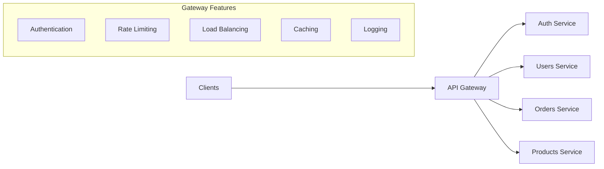

# How to Configure API Gateway

Author: [nawazdhandala](https://www.github.com/nawazdhandala)

Tags: API Gateway, Kong, APISIX, Kubernetes, Microservices, Networking

Description: A practical guide to configuring API gateways for microservices, covering Kong and Apache APISIX setup, authentication, rate limiting, and traffic management patterns.

---

An API gateway acts as the single entry point for all client requests to your microservices. It handles cross-cutting concerns like authentication, rate limiting, and routing, keeping your services focused on business logic. This guide covers practical API gateway implementation.

## API Gateway Architecture



## Kong Gateway Setup

### Install Kong on Kubernetes

```yaml
# kong-namespace.yaml
apiVersion: v1
kind: Namespace
metadata:
  name: kong

---
# kong-deployment.yaml
apiVersion: apps/v1
kind: Deployment
metadata:
  name: kong
  namespace: kong
spec:
  replicas: 2
  selector:
    matchLabels:
      app: kong
  template:
    metadata:
      labels:
        app: kong
    spec:
      containers:
        - name: kong
          image: kong:3.4
          env:
            - name: KONG_DATABASE
              value: "off"
            - name: KONG_DECLARATIVE_CONFIG
              value: "/kong/declarative/kong.yml"
            - name: KONG_PROXY_ACCESS_LOG
              value: "/dev/stdout"
            - name: KONG_ADMIN_ACCESS_LOG
              value: "/dev/stdout"
            - name: KONG_PROXY_ERROR_LOG
              value: "/dev/stderr"
            - name: KONG_ADMIN_ERROR_LOG
              value: "/dev/stderr"
            - name: KONG_ADMIN_LISTEN
              value: "0.0.0.0:8001"
            - name: KONG_PROXY_LISTEN
              value: "0.0.0.0:8000, 0.0.0.0:8443 ssl"
          ports:
            - name: proxy
              containerPort: 8000
            - name: proxy-ssl
              containerPort: 8443
            - name: admin
              containerPort: 8001
          volumeMounts:
            - name: kong-config
              mountPath: /kong/declarative
          readinessProbe:
            httpGet:
              path: /status
              port: 8001
            initialDelaySeconds: 5
          livenessProbe:
            httpGet:
              path: /status
              port: 8001
            initialDelaySeconds: 10
      volumes:
        - name: kong-config
          configMap:
            name: kong-declarative-config

---
apiVersion: v1
kind: Service
metadata:
  name: kong-proxy
  namespace: kong
spec:
  type: LoadBalancer
  ports:
    - name: http
      port: 80
      targetPort: 8000
    - name: https
      port: 443
      targetPort: 8443
  selector:
    app: kong
```

### Kong Declarative Configuration

```yaml
# kong-config.yaml
apiVersion: v1
kind: ConfigMap
metadata:
  name: kong-declarative-config
  namespace: kong
data:
  kong.yml: |
    _format_version: "3.0"

    services:
      # Users API
      - name: users-service
        url: http://users.default.svc.cluster.local:8080
        routes:
          - name: users-route
            paths:
              - /api/users
            strip_path: false
        plugins:
          - name: rate-limiting
            config:
              minute: 100
              policy: local
          - name: key-auth
            config:
              key_names:
                - X-API-Key

      # Orders API
      - name: orders-service
        url: http://orders.default.svc.cluster.local:8080
        routes:
          - name: orders-route
            paths:
              - /api/orders
            strip_path: false
            methods:
              - GET
              - POST
              - PUT
              - DELETE
        plugins:
          - name: rate-limiting
            config:
              minute: 60
              policy: local
          - name: request-size-limiting
            config:
              allowed_payload_size: 10

      # Public products API (no auth)
      - name: products-service
        url: http://products.default.svc.cluster.local:8080
        routes:
          - name: products-route
            paths:
              - /api/products
            strip_path: false
            methods:
              - GET
        plugins:
          - name: proxy-cache
            config:
              response_code:
                - 200
              request_method:
                - GET
              content_type:
                - application/json
              cache_ttl: 300
              strategy: memory

    consumers:
      - username: mobile-app
        keyauth_credentials:
          - key: mobile-secret-key-123
      - username: web-app
        keyauth_credentials:
          - key: web-secret-key-456

    plugins:
      # Global plugins
      - name: correlation-id
        config:
          header_name: X-Request-ID
          generator: uuid
      - name: request-termination
        config:
          status_code: 503
          message: "Service temporarily unavailable"
        enabled: false
```

## Kong Ingress Controller

```yaml
# kong-ingress-controller.yaml
apiVersion: networking.k8s.io/v1
kind: Ingress
metadata:
  name: api-ingress
  annotations:
    konghq.com/strip-path: "false"
    konghq.com/plugins: rate-limit,key-auth
spec:
  ingressClassName: kong
  rules:
    - host: api.example.com
      http:
        paths:
          - path: /api/users
            pathType: Prefix
            backend:
              service:
                name: users
                port:
                  number: 8080
          - path: /api/orders
            pathType: Prefix
            backend:
              service:
                name: orders
                port:
                  number: 8080

---
apiVersion: configuration.konghq.com/v1
kind: KongPlugin
metadata:
  name: rate-limit
spec:
  plugin: rate-limiting
  config:
    minute: 100
    policy: redis
    redis_host: redis.default.svc.cluster.local

---
apiVersion: configuration.konghq.com/v1
kind: KongPlugin
metadata:
  name: key-auth
spec:
  plugin: key-auth
  config:
    key_names:
      - X-API-Key
      - apikey
```

## Apache APISIX Setup

### Install APISIX with Helm

```bash
# Add APISIX Helm repo
helm repo add apisix https://charts.apiseven.com
helm repo update

# Install APISIX
helm install apisix apisix/apisix \
  --namespace apisix \
  --create-namespace \
  --set gateway.type=LoadBalancer \
  --set admin.enabled=true \
  --set admin.allow.ipList="{0.0.0.0/0}" \
  --set etcd.enabled=true
```

### APISIX Route Configuration

```yaml
# apisix-routes.yaml
apiVersion: apisix.apache.org/v2
kind: ApisixRoute
metadata:
  name: api-routes
  namespace: default
spec:
  http:
    - name: users-api
      match:
        hosts:
          - api.example.com
        paths:
          - /api/users/*
      backends:
        - serviceName: users
          servicePort: 8080
      plugins:
        - name: key-auth
          enable: true
        - name: limit-req
          enable: true
          config:
            rate: 100
            burst: 50
            key: remote_addr

    - name: orders-api
      match:
        hosts:
          - api.example.com
        paths:
          - /api/orders/*
      backends:
        - serviceName: orders
          servicePort: 8080
          weight: 100
      plugins:
        - name: jwt-auth
          enable: true
        - name: limit-count
          enable: true
          config:
            count: 1000
            time_window: 3600
            key: consumer_name

    - name: products-api
      match:
        hosts:
          - api.example.com
        paths:
          - /api/products/*
      backends:
        - serviceName: products
          servicePort: 8080
      plugins:
        - name: proxy-cache
          enable: true
          config:
            cache_zone: disk_cache_one
            cache_key:
              - "$uri"
              - "$request_method"
            cache_ttl: 300
```

### APISIX Consumer Configuration

```yaml
# apisix-consumers.yaml
apiVersion: apisix.apache.org/v2
kind: ApisixConsumer
metadata:
  name: mobile-client
spec:
  authParameter:
    keyAuth:
      value:
        key: "mobile-api-key-secure"
    jwtAuth:
      value:
        key: "mobile-jwt-key"
        secret: "mobile-jwt-secret"

---
apiVersion: apisix.apache.org/v2
kind: ApisixConsumer
metadata:
  name: web-client
spec:
  authParameter:
    keyAuth:
      value:
        key: "web-api-key-secure"
```

## JWT Authentication

### Kong JWT Plugin

```yaml
# kong-jwt-config.yaml
_format_version: "3.0"

services:
  - name: protected-api
    url: http://api.default.svc.cluster.local:8080
    routes:
      - name: protected-route
        paths:
          - /api/protected
    plugins:
      - name: jwt
        config:
          claims_to_verify:
            - exp
          key_claim_name: iss
          secret_is_base64: false

consumers:
  - username: api-client
    jwt_secrets:
      - key: "api-client-issuer"
        secret: "your-jwt-secret-key-here"
        algorithm: HS256
```

### APISIX JWT Configuration

```yaml
# apisix-jwt.yaml
apiVersion: apisix.apache.org/v2
kind: ApisixRoute
metadata:
  name: jwt-protected-api
spec:
  http:
    - name: protected-endpoint
      match:
        paths:
          - /api/secure/*
      backends:
        - serviceName: secure-api
          servicePort: 8080
      authentication:
        enable: true
        type: jwtAuth
      plugins:
        - name: jwt-auth
          enable: true
          config:
            key: "your-jwt-key"
            secret: "your-jwt-secret"
            algorithm: HS256
```

## Rate Limiting Patterns

### Tiered Rate Limiting

```yaml
# kong-tiered-rates.yaml
_format_version: "3.0"

consumers:
  - username: free-tier
    plugins:
      - name: rate-limiting
        config:
          minute: 60
          hour: 1000
          policy: redis

  - username: pro-tier
    plugins:
      - name: rate-limiting
        config:
          minute: 600
          hour: 10000
          policy: redis

  - username: enterprise-tier
    plugins:
      - name: rate-limiting
        config:
          minute: 6000
          hour: 100000
          policy: redis
```

### Sliding Window Rate Limiting

```yaml
# apisix-sliding-window.yaml
apiVersion: apisix.apache.org/v2
kind: ApisixRoute
metadata:
  name: rate-limited-api
spec:
  http:
    - name: sliding-window-limit
      match:
        paths:
          - /api/*
      backends:
        - serviceName: api
          servicePort: 8080
      plugins:
        - name: limit-count
          enable: true
          config:
            count: 100
            time_window: 60
            key: remote_addr
            rejected_code: 429
            rejected_msg: "Rate limit exceeded. Try again later."
            policy: sliding_window
```

## Request/Response Transformation

```yaml
# kong-transformations.yaml
_format_version: "3.0"

services:
  - name: legacy-api
    url: http://legacy.default.svc.cluster.local:8080
    routes:
      - name: legacy-route
        paths:
          - /api/v2/legacy
    plugins:
      # Transform request before sending to upstream
      - name: request-transformer
        config:
          add:
            headers:
              - "X-Gateway-Version:2.0"
            querystring:
              - "format:json"
          rename:
            headers:
              - "Authorization:X-Legacy-Auth"
          remove:
            headers:
              - "X-Debug"

      # Transform response before sending to client
      - name: response-transformer
        config:
          add:
            headers:
              - "X-Response-Time:${latency}ms"
          remove:
            headers:
              - "X-Internal-Id"
              - "Server"
```

## Circuit Breaker Pattern

```yaml
# apisix-circuit-breaker.yaml
apiVersion: apisix.apache.org/v2
kind: ApisixUpstream
metadata:
  name: api-upstream
spec:
  loadbalancer:
    type: roundrobin
  healthCheck:
    active:
      type: http
      httpPath: /health
      healthy:
        interval: 5
        successes: 2
      unhealthy:
        interval: 2
        httpFailures: 3
    passive:
      healthy:
        httpStatuses:
          - 200
          - 201
        successes: 3
      unhealthy:
        httpStatuses:
          - 500
          - 502
          - 503
        httpFailures: 3
        tcpFailures: 3
  retries: 2
  timeout:
    connect: 5
    send: 30
    read: 30
```

## Monitoring and Logging

```yaml
# kong-monitoring.yaml
_format_version: "3.0"

plugins:
  # Prometheus metrics
  - name: prometheus
    config:
      per_consumer: true
      status_code_metrics: true
      latency_metrics: true
      bandwidth_metrics: true

  # HTTP logging
  - name: http-log
    config:
      http_endpoint: http://logstash:8080/logs
      method: POST
      content_type: application/json
      flush_timeout: 2
      retry_count: 3

  # Request/response logging
  - name: file-log
    config:
      path: /var/log/kong/access.log
      reopen: true
```

### Grafana Dashboard Query

```promql
# Request rate by service
sum(rate(kong_http_requests_total[5m])) by (service)

# Error rate
sum(rate(kong_http_requests_total{code=~"5.."}[5m])) by (service)
/ sum(rate(kong_http_requests_total[5m])) by (service)

# Latency P99
histogram_quantile(0.99, rate(kong_latency_bucket[5m]))
```

## Testing API Gateway

```bash
#!/bin/bash
# test-gateway.sh

GATEWAY_URL="http://api.example.com"
API_KEY="your-api-key"

echo "=== Test Authentication ==="
# Without API key (should fail)
curl -s -o /dev/null -w "%{http_code}" "$GATEWAY_URL/api/users"

# With API key
curl -s -o /dev/null -w "%{http_code}" -H "X-API-Key: $API_KEY" "$GATEWAY_URL/api/users"

echo -e "\n\n=== Test Rate Limiting ==="
for i in {1..110}; do
    response=$(curl -s -o /dev/null -w "%{http_code}" -H "X-API-Key: $API_KEY" "$GATEWAY_URL/api/users")
    if [ "$response" = "429" ]; then
        echo "Rate limited after $i requests"
        break
    fi
done

echo -e "\n=== Test Response Headers ==="
curl -sI -H "X-API-Key: $API_KEY" "$GATEWAY_URL/api/users" | grep -E "(X-|Rate)"
```

---

API gateways centralize cross-cutting concerns and simplify microservices architecture. Start with basic routing and authentication, then gradually add rate limiting, caching, and monitoring. Kong and APISIX both offer robust features, with Kong having broader plugin ecosystem and APISIX offering better performance for high-traffic scenarios.
