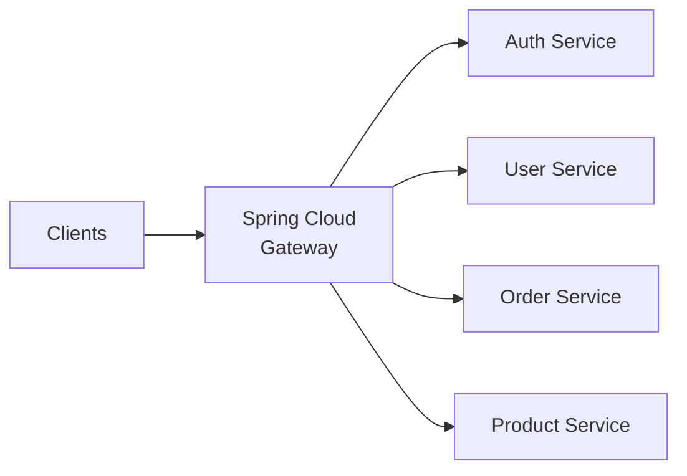

# How to Build API Gateways with Spring Cloud Gateway

Author: [nawazdhandala](https://www.github.com/nawazdhandala)

Tags: Java, Spring Cloud Gateway, API Gateway, Microservices, Routing, Load Balancing, Security, Rate Limiting

Description: Learn how to build production-ready API gateways using Spring Cloud Gateway. This guide covers routing, filters, rate limiting, authentication, and circuit breakers for microservices architectures.

---

> Microservices need a single entry point that handles cross-cutting concerns like authentication, rate limiting, and routing. Spring Cloud Gateway provides a reactive, non-blocking gateway built on Spring WebFlux. It integrates naturally with the Spring ecosystem while delivering high throughput for API traffic.

An API gateway is the front door to your microservices. Spring Cloud Gateway makes it easy to build a robust, scalable one.

---

## Overview



---

## Dependencies

Create a new Spring Boot project with the gateway starter:

```xml
<!-- pom.xml -->
<dependency>
    <groupId>org.springframework.cloud</groupId>
    <artifactId>spring-cloud-starter-gateway</artifactId>
</dependency>
<dependency>
    <groupId>org.springframework.boot</groupId>
    <artifactId>spring-boot-starter-actuator</artifactId>
</dependency>
<dependency>
    <groupId>org.springframework.cloud</groupId>
    <artifactId>spring-cloud-starter-circuitbreaker-reactor-resilience4j</artifactId>
</dependency>
```

Add the Spring Cloud BOM:

```xml
<dependencyManagement>
    <dependencies>
        <dependency>
            <groupId>org.springframework.cloud</groupId>
            <artifactId>spring-cloud-dependencies</artifactId>
            <version>2023.0.0</version>
            <type>pom</type>
            <scope>import</scope>
        </dependency>
    </dependencies>
</dependencyManagement>
```

---

## Basic Routing Configuration

### YAML-Based Routes

Define routes in your application configuration:

```yaml
# application.yml
spring:
  cloud:
    gateway:
      routes:
        # Route to user service
        - id: user-service
          uri: http://localhost:8081
          predicates:
            - Path=/api/users/**
          filters:
            - StripPrefix=1

        # Route to order service
        - id: order-service
          uri: http://localhost:8082
          predicates:
            - Path=/api/orders/**
          filters:
            - StripPrefix=1

        # Route to product service
        - id: product-service
          uri: http://localhost:8083
          predicates:
            - Path=/api/products/**
          filters:
            - StripPrefix=1

server:
  port: 8080
```

With this configuration, a request to `http://gateway:8080/api/users/123` is forwarded to `http://localhost:8081/users/123`.

### Java-Based Route Configuration

For more complex routing logic, configure routes programmatically:

```java
package com.example.gateway.config;

import org.springframework.cloud.gateway.route.RouteLocator;
import org.springframework.cloud.gateway.route.builder.RouteLocatorBuilder;
import org.springframework.context.annotation.Bean;
import org.springframework.context.annotation.Configuration;

@Configuration
public class GatewayConfig {

    @Bean
    public RouteLocator customRouteLocator(RouteLocatorBuilder builder) {
        return builder.routes()
            // User service route
            .route("user-service", r -> r
                .path("/api/users/**")
                .filters(f -> f
                    .stripPrefix(1)
                    .addRequestHeader("X-Gateway-Request-Id", java.util.UUID.randomUUID().toString())
                )
                .uri("http://localhost:8081")
            )
            // Order service with path rewriting
            .route("order-service", r -> r
                .path("/api/orders/**")
                .filters(f -> f
                    .rewritePath("/api/orders/(?<segment>.*)", "/orders/${segment}")
                )
                .uri("http://localhost:8082")
            )
            // Product service with load balancing
            .route("product-service", r -> r
                .path("/api/products/**")
                .filters(f -> f.stripPrefix(1))
                .uri("lb://product-service")
            )
            .build();
    }
}
```

---

## Route Predicates

### Built-in Predicates

Spring Cloud Gateway provides many predicates for matching requests:

```yaml
# application.yml
spring:
  cloud:
    gateway:
      routes:
        # Match by path pattern
        - id: path-route
          uri: http://service:8080
          predicates:
            - Path=/api/**

        # Match by HTTP method
        - id: method-route
          uri: http://service:8080
          predicates:
            - Method=GET,POST

        # Match by header
        - id: header-route
          uri: http://service:8080
          predicates:
            - Header=X-Request-Type, premium

        # Match by query parameter
        - id: query-route
          uri: http://service:8080
          predicates:
            - Query=version, v2

        # Match by host
        - id: host-route
          uri: http://service:8080
          predicates:
            - Host=**.example.com

        # Match by time (useful for maintenance windows)
        - id: time-route
          uri: http://service:8080
          predicates:
            - After=2024-01-01T00:00:00.000-05:00[America/New_York]

        # Combine multiple predicates
        - id: combined-route
          uri: http://service:8080
          predicates:
            - Path=/api/v2/**
            - Method=GET
            - Header=Accept, application/json
```

### Custom Predicates

Create a custom predicate for specialized matching logic:

```java
package com.example.gateway.predicate;

import org.springframework.cloud.gateway.handler.predicate.AbstractRoutePredicateFactory;
import org.springframework.stereotype.Component;
import org.springframework.web.server.ServerWebExchange;

import java.util.Arrays;
import java.util.List;
import java.util.function.Predicate;

@Component
public class ApiVersionPredicateFactory
    extends AbstractRoutePredicateFactory<ApiVersionPredicateFactory.Config> {

    public ApiVersionPredicateFactory() {
        super(Config.class);
    }

    @Override
    public List<String> shortcutFieldOrder() {
        return Arrays.asList("version");
    }

    @Override
    public Predicate<ServerWebExchange> apply(Config config) {
        return exchange -> {
            // Check Accept header for API version
            String acceptHeader = exchange.getRequest()
                .getHeaders()
                .getFirst("Accept");

            if (acceptHeader == null) {
                return false;
            }

            // Match version in Accept header (e.g., application/vnd.api.v2+json)
            return acceptHeader.contains("v" + config.getVersion());
        };
    }

    public static class Config {
        private int version;

        public int getVersion() { return version; }
        public void setVersion(int version) { this.version = version; }
    }
}
```

Use the custom predicate in configuration:

```yaml
spring:
  cloud:
    gateway:
      routes:
        - id: api-v2
          uri: http://api-v2:8080
          predicates:
            - ApiVersion=2
```

---

## Gateway Filters

### Pre and Post Filters

Filters modify requests before they are sent and responses before they are returned:

```yaml
# application.yml
spring:
  cloud:
    gateway:
      routes:
        - id: service-route
          uri: http://service:8080
          predicates:
            - Path=/api/**
          filters:
            # Request modifications
            - AddRequestHeader=X-Request-Source, gateway
            - AddRequestParameter=gateway, true
            - RemoveRequestHeader=Cookie

            # Response modifications
            - AddResponseHeader=X-Response-Time, ${responseTime}
            - RemoveResponseHeader=X-Powered-By

            # Path modifications
            - StripPrefix=1
            - PrefixPath=/v1

            # Retry on failure
            - name: Retry
              args:
                retries: 3
                statuses: BAD_GATEWAY,SERVICE_UNAVAILABLE
                methods: GET
                backoff:
                  firstBackoff: 100ms
                  maxBackoff: 500ms
                  factor: 2
```

### Custom Global Filter

Create a filter that applies to all routes:

```java
package com.example.gateway.filter;

import org.slf4j.Logger;
import org.slf4j.LoggerFactory;
import org.springframework.cloud.gateway.filter.GatewayFilterChain;
import org.springframework.cloud.gateway.filter.GlobalFilter;
import org.springframework.core.Ordered;
import org.springframework.http.server.reactive.ServerHttpRequest;
import org.springframework.stereotype.Component;
import org.springframework.web.server.ServerWebExchange;
import reactor.core.publisher.Mono;

import java.util.UUID;

@Component
public class RequestLoggingFilter implements GlobalFilter, Ordered {

    private static final Logger log = LoggerFactory.getLogger(RequestLoggingFilter.class);
    private static final String REQUEST_ID_HEADER = "X-Request-Id";
    private static final String START_TIME = "startTime";

    @Override
    public Mono<Void> filter(ServerWebExchange exchange, GatewayFilterChain chain) {
        // Generate request ID if not present
        String requestId = exchange.getRequest().getHeaders().getFirst(REQUEST_ID_HEADER);
        if (requestId == null) {
            requestId = UUID.randomUUID().toString();
        }

        // Add request ID to the request
        ServerHttpRequest request = exchange.getRequest().mutate()
            .header(REQUEST_ID_HEADER, requestId)
            .build();

        // Store start time for duration calculation
        exchange.getAttributes().put(START_TIME, System.currentTimeMillis());

        final String finalRequestId = requestId;

        log.info("Incoming request: {} {} [{}]",
            request.getMethod(),
            request.getURI().getPath(),
            finalRequestId);

        // Continue the filter chain and log response
        return chain.filter(exchange.mutate().request(request).build())
            .then(Mono.fromRunnable(() -> {
                Long startTime = exchange.getAttribute(START_TIME);
                long duration = System.currentTimeMillis() - (startTime != null ? startTime : 0);

                log.info("Response: {} {} - {} in {}ms [{}]",
                    request.getMethod(),
                    request.getURI().getPath(),
                    exchange.getResponse().getStatusCode(),
                    duration,
                    finalRequestId);
            }));
    }

    @Override
    public int getOrder() {
        // Run early in the filter chain
        return -100;
    }
}
```

---

## Rate Limiting

### Redis-Based Rate Limiter

Implement rate limiting with Redis:

```xml
<!-- pom.xml -->
<dependency>
    <groupId>org.springframework.boot</groupId>
    <artifactId>spring-boot-starter-data-redis-reactive</artifactId>
</dependency>
```

```yaml
# application.yml
spring:
  redis:
    host: localhost
    port: 6379
  cloud:
    gateway:
      routes:
        - id: rate-limited-service
          uri: http://service:8080
          predicates:
            - Path=/api/**
          filters:
            - name: RequestRateLimiter
              args:
                # Rate limit: 10 requests per second
                redis-rate-limiter.replenishRate: 10
                redis-rate-limiter.burstCapacity: 20
                redis-rate-limiter.requestedTokens: 1
                # Key resolver determines how to group requests
                key-resolver: "#{@userKeyResolver}"
```

Create a key resolver to determine rate limit buckets:

```java
package com.example.gateway.config;

import org.springframework.cloud.gateway.filter.ratelimit.KeyResolver;
import org.springframework.context.annotation.Bean;
import org.springframework.context.annotation.Configuration;
import reactor.core.publisher.Mono;

@Configuration
public class RateLimiterConfig {

    // Rate limit by IP address
    @Bean
    public KeyResolver ipKeyResolver() {
        return exchange -> Mono.just(
            exchange.getRequest().getRemoteAddress().getAddress().getHostAddress()
        );
    }

    // Rate limit by user ID from header
    @Bean
    public KeyResolver userKeyResolver() {
        return exchange -> {
            String userId = exchange.getRequest().getHeaders().getFirst("X-User-Id");
            return Mono.just(userId != null ? userId : "anonymous");
        };
    }

    // Rate limit by API key
    @Bean
    public KeyResolver apiKeyResolver() {
        return exchange -> {
            String apiKey = exchange.getRequest().getHeaders().getFirst("X-API-Key");
            return Mono.just(apiKey != null ? apiKey : "no-key");
        };
    }
}
```

---

## Circuit Breaker Integration

### Resilience4j Circuit Breaker

Add circuit breaker protection to prevent cascade failures:

```yaml
# application.yml
spring:
  cloud:
    gateway:
      routes:
        - id: service-with-circuit-breaker
          uri: http://service:8080
          predicates:
            - Path=/api/**
          filters:
            - name: CircuitBreaker
              args:
                name: serviceCircuitBreaker
                fallbackUri: forward:/fallback/service

# Circuit breaker configuration
resilience4j:
  circuitbreaker:
    instances:
      serviceCircuitBreaker:
        # Number of calls to evaluate before opening circuit
        slidingWindowSize: 10
        # Percentage of failures to trigger open state
        failureRateThreshold: 50
        # Time to wait before trying again
        waitDurationInOpenState: 30s
        # Calls allowed in half-open state
        permittedNumberOfCallsInHalfOpenState: 3
        # Automatically transition from open to half-open
        automaticTransitionFromOpenToHalfOpenEnabled: true
  timelimiter:
    instances:
      serviceCircuitBreaker:
        # Timeout for upstream calls
        timeoutDuration: 5s
```

Create a fallback controller:

```java
package com.example.gateway.controller;

import org.springframework.http.HttpStatus;
import org.springframework.http.ResponseEntity;
import org.springframework.web.bind.annotation.GetMapping;
import org.springframework.web.bind.annotation.RequestMapping;
import org.springframework.web.bind.annotation.RestController;
import reactor.core.publisher.Mono;

import java.util.Map;

@RestController
@RequestMapping("/fallback")
public class FallbackController {

    @GetMapping("/service")
    public Mono<ResponseEntity<Map<String, Object>>> serviceFallback() {
        return Mono.just(ResponseEntity
            .status(HttpStatus.SERVICE_UNAVAILABLE)
            .body(Map.of(
                "status", "error",
                "message", "Service temporarily unavailable. Please try again later.",
                "code", "SERVICE_UNAVAILABLE"
            )));
    }

    @GetMapping("/auth")
    public Mono<ResponseEntity<Map<String, Object>>> authFallback() {
        return Mono.just(ResponseEntity
            .status(HttpStatus.SERVICE_UNAVAILABLE)
            .body(Map.of(
                "status", "error",
                "message", "Authentication service unavailable.",
                "code", "AUTH_UNAVAILABLE"
            )));
    }
}
```

---

## Authentication Filter

### JWT Validation Filter

Create a filter to validate JWT tokens:

```java
package com.example.gateway.filter;

import io.jsonwebtoken.Claims;
import io.jsonwebtoken.Jwts;
import io.jsonwebtoken.security.Keys;
import org.springframework.beans.factory.annotation.Value;
import org.springframework.cloud.gateway.filter.GatewayFilter;
import org.springframework.cloud.gateway.filter.factory.AbstractGatewayFilterFactory;
import org.springframework.http.HttpHeaders;
import org.springframework.http.HttpStatus;
import org.springframework.http.server.reactive.ServerHttpRequest;
import org.springframework.stereotype.Component;
import org.springframework.web.server.ServerWebExchange;
import reactor.core.publisher.Mono;

import javax.crypto.SecretKey;
import java.nio.charset.StandardCharsets;

@Component
public class JwtAuthenticationFilterFactory
    extends AbstractGatewayFilterFactory<JwtAuthenticationFilterFactory.Config> {

    @Value("${jwt.secret}")
    private String jwtSecret;

    public JwtAuthenticationFilterFactory() {
        super(Config.class);
    }

    @Override
    public GatewayFilter apply(Config config) {
        return (exchange, chain) -> {
            String authHeader = exchange.getRequest()
                .getHeaders()
                .getFirst(HttpHeaders.AUTHORIZATION);

            // Check for Authorization header
            if (authHeader == null || !authHeader.startsWith("Bearer ")) {
                return unauthorized(exchange);
            }

            String token = authHeader.substring(7);

            try {
                // Parse and validate JWT
                SecretKey key = Keys.hmacShaKeyFor(jwtSecret.getBytes(StandardCharsets.UTF_8));
                Claims claims = Jwts.parserBuilder()
                    .setSigningKey(key)
                    .build()
                    .parseClaimsJws(token)
                    .getBody();

                // Extract user information and add to headers
                String userId = claims.getSubject();
                String roles = claims.get("roles", String.class);

                ServerHttpRequest request = exchange.getRequest().mutate()
                    .header("X-User-Id", userId)
                    .header("X-User-Roles", roles != null ? roles : "")
                    .build();

                return chain.filter(exchange.mutate().request(request).build());

            } catch (Exception e) {
                return unauthorized(exchange);
            }
        };
    }

    private Mono<Void> unauthorized(ServerWebExchange exchange) {
        exchange.getResponse().setStatusCode(HttpStatus.UNAUTHORIZED);
        return exchange.getResponse().setComplete();
    }

    public static class Config {
        // Configuration properties if needed
    }
}
```

Apply the filter to protected routes:

```yaml
# application.yml
spring:
  cloud:
    gateway:
      routes:
        # Public routes (no auth)
        - id: public-api
          uri: http://public-service:8080
          predicates:
            - Path=/api/public/**

        # Protected routes (require JWT)
        - id: protected-api
          uri: http://protected-service:8080
          predicates:
            - Path=/api/**
          filters:
            - JwtAuthentication
```

---

## Service Discovery Integration

### Eureka Integration

Register with Eureka for dynamic service discovery:

```xml
<!-- pom.xml -->
<dependency>
    <groupId>org.springframework.cloud</groupId>
    <artifactId>spring-cloud-starter-netflix-eureka-client</artifactId>
</dependency>
```

```yaml
# application.yml
spring:
  cloud:
    gateway:
      discovery:
        locator:
          # Automatically create routes for discovered services
          enabled: true
          # Convert service names to lowercase in paths
          lower-case-service-id: true
      routes:
        # Use lb:// prefix for load-balanced routes
        - id: user-service
          uri: lb://USER-SERVICE
          predicates:
            - Path=/api/users/**
          filters:
            - StripPrefix=1

eureka:
  client:
    service-url:
      defaultZone: http://eureka:8761/eureka/
  instance:
    prefer-ip-address: true
```

---

## Monitoring and Observability

### Actuator Configuration

Expose gateway-specific actuator endpoints:

```yaml
# application.yml
management:
  endpoints:
    web:
      exposure:
        include: health,info,gateway,metrics,prometheus
  endpoint:
    gateway:
      enabled: true
    health:
      show-details: always
```

Access gateway information:

```bash
# List all routes
curl http://localhost:8080/actuator/gateway/routes

# Get route filters
curl http://localhost:8080/actuator/gateway/routefilters

# Get global filters
curl http://localhost:8080/actuator/gateway/globalfilters

# Refresh routes
curl -X POST http://localhost:8080/actuator/gateway/refresh
```

### Custom Metrics

Add custom metrics for gateway monitoring:

```java
package com.example.gateway.metrics;

import io.micrometer.core.instrument.Counter;
import io.micrometer.core.instrument.MeterRegistry;
import io.micrometer.core.instrument.Timer;
import org.springframework.cloud.gateway.filter.GatewayFilterChain;
import org.springframework.cloud.gateway.filter.GlobalFilter;
import org.springframework.core.Ordered;
import org.springframework.stereotype.Component;
import org.springframework.web.server.ServerWebExchange;
import reactor.core.publisher.Mono;

@Component
public class MetricsFilter implements GlobalFilter, Ordered {

    private final Counter requestCounter;
    private final Timer requestTimer;

    public MetricsFilter(MeterRegistry registry) {
        this.requestCounter = Counter.builder("gateway.requests.total")
            .description("Total number of requests through the gateway")
            .register(registry);

        this.requestTimer = Timer.builder("gateway.request.duration")
            .description("Request duration through the gateway")
            .register(registry);
    }

    @Override
    public Mono<Void> filter(ServerWebExchange exchange, GatewayFilterChain chain) {
        requestCounter.increment();

        return Mono.fromCallable(System::nanoTime)
            .flatMap(startTime -> chain.filter(exchange)
                .doFinally(signalType -> {
                    long duration = System.nanoTime() - startTime;
                    requestTimer.record(java.time.Duration.ofNanos(duration));
                }));
    }

    @Override
    public int getOrder() {
        return Ordered.HIGHEST_PRECEDENCE;
    }
}
```

---

## Best Practices

1. **Use circuit breakers** - protect against cascade failures from downstream services
2. **Implement rate limiting** - prevent abuse and ensure fair resource allocation
3. **Add request tracing** - propagate trace IDs through the gateway
4. **Configure timeouts** - set appropriate timeouts for all routes
5. **Monitor gateway metrics** - track latency, error rates, and throughput
6. **Secure the gateway** - validate tokens before forwarding requests

---

## Conclusion

Spring Cloud Gateway provides a powerful, reactive foundation for building API gateways. Key takeaways:

- Define routes using YAML configuration or Java DSL
- Use predicates to match requests and filters to modify them
- Implement rate limiting with Redis for scalable traffic control
- Add circuit breakers to handle downstream failures gracefully
- Integrate with service discovery for dynamic routing

A well-designed API gateway simplifies client interactions while providing essential cross-cutting concerns for your microservices architecture.

---

*Building microservices with Spring Cloud Gateway? [OneUptime](https://oneuptime.com) provides comprehensive monitoring for your API gateway with request tracing and performance analytics.*
