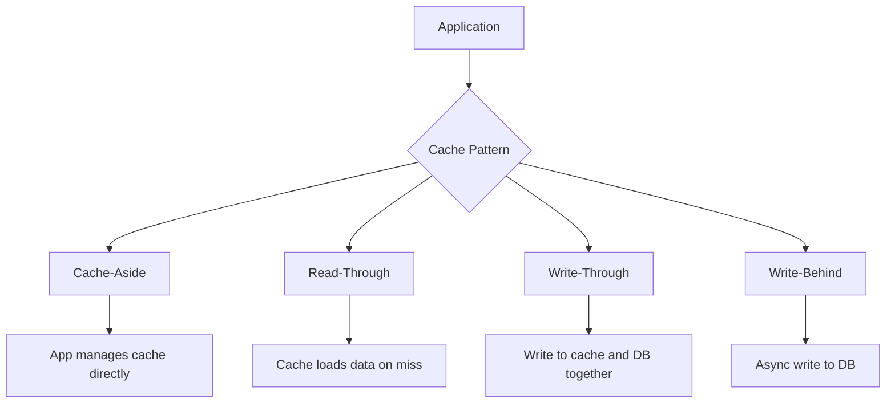

# How to Implement Application Caching Strategies

Author: [nawazdhandala](https://www.github.com/nawazdhandala)

Tags: Caching, Performance, Redis, Memcached, Application Design, Scalability, Backend

Description: Learn how to implement effective caching strategies in your applications. This guide covers cache patterns like cache-aside, write-through, and write-behind, with practical examples for Redis and in-memory caching.

---

> Caching is one of the most effective ways to improve application performance. A well-designed cache can reduce database load by 90%, cut response times from hundreds of milliseconds to single digits, and save significant infrastructure costs. But caching done wrong leads to stale data, thundering herds, and debugging nightmares.

This guide covers proven caching strategies with practical implementations you can use in production today.

---

## Why Caching Matters

Without caching, every request hits your database:
```
Request -> Application -> Database (50ms) -> Response
Throughput: ~20 req/sec per DB connection
```

With caching:
```
Request -> Application -> Cache (1ms) -> Response
Throughput: ~1000 req/sec (cache hit)
```

A 95% cache hit rate means your database handles 20x fewer queries while users experience 50x faster responses.

---

## Cache Patterns Overview



---

## Pattern 1: Cache-Aside (Lazy Loading)

The most common pattern. The application manages the cache explicitly:

```python
# cache_aside.py
import redis
import json
import hashlib
from typing import Optional, Any
from functools import wraps
import logging

logger = logging.getLogger(__name__)

class CacheAside:
    """Cache-aside pattern implementation with Redis"""

    def __init__(self, redis_url: str = "redis://localhost:6379"):
        self.redis = redis.from_url(redis_url, decode_responses=True)
        self.default_ttl = 3600  # 1 hour default

    def get(self, key: str) -> Optional[Any]:
        """Get value from cache"""
        try:
            value = self.redis.get(key)
            if value:
                logger.debug(f"Cache HIT: {key}")
                return json.loads(value)
            logger.debug(f"Cache MISS: {key}")
            return None
        except redis.RedisError as e:
            # Cache failures should not break the application
            logger.warning(f"Cache read error: {e}")
            return None

    def set(self, key: str, value: Any, ttl: int = None) -> bool:
        """Set value in cache with TTL"""
        try:
            ttl = ttl or self.default_ttl
            self.redis.setex(key, ttl, json.dumps(value))
            return True
        except redis.RedisError as e:
            logger.warning(f"Cache write error: {e}")
            return False

    def delete(self, key: str) -> bool:
        """Delete value from cache"""
        try:
            self.redis.delete(key)
            return True
        except redis.RedisError as e:
            logger.warning(f"Cache delete error: {e}")
            return False

    def invalidate_pattern(self, pattern: str) -> int:
        """Delete all keys matching pattern"""
        try:
            keys = self.redis.keys(pattern)
            if keys:
                return self.redis.delete(*keys)
            return 0
        except redis.RedisError as e:
            logger.warning(f"Cache invalidate error: {e}")
            return 0


# Usage with database
cache = CacheAside()

def get_user(user_id: int) -> dict:
    """Get user with cache-aside pattern"""
    cache_key = f"user:{user_id}"

    # Step 1: Check cache first
    user = cache.get(cache_key)
    if user:
        return user

    # Step 2: Cache miss - fetch from database
    user = db.query("SELECT * FROM users WHERE id = %s", (user_id,))

    # Step 3: Store in cache for next time
    if user:
        cache.set(cache_key, user, ttl=3600)

    return user

def update_user(user_id: int, data: dict) -> dict:
    """Update user and invalidate cache"""
    # Step 1: Update database
    user = db.update("UPDATE users SET ... WHERE id = %s", (user_id,))

    # Step 2: Invalidate cache (don't update - could cause race conditions)
    cache.delete(f"user:{user_id}")

    return user
```

### Cache-Aside Decorator Pattern

```python
# cache_decorator.py
from functools import wraps
import hashlib
import json

def cached(ttl: int = 3600, key_prefix: str = None):
    """Decorator for cache-aside pattern"""
    def decorator(func):
        @wraps(func)
        def wrapper(*args, **kwargs):
            # Build cache key from function name and arguments
            prefix = key_prefix or func.__name__
            key_data = json.dumps({"args": args, "kwargs": kwargs}, sort_keys=True)
            key_hash = hashlib.md5(key_data.encode()).hexdigest()[:12]
            cache_key = f"{prefix}:{key_hash}"

            # Check cache
            result = cache.get(cache_key)
            if result is not None:
                return result

            # Execute function and cache result
            result = func(*args, **kwargs)
            if result is not None:
                cache.set(cache_key, result, ttl=ttl)

            return result
        return wrapper
    return decorator

# Usage
@cached(ttl=300, key_prefix="product")
def get_product(product_id: int) -> dict:
    return db.query("SELECT * FROM products WHERE id = %s", (product_id,))

@cached(ttl=60, key_prefix="search")
def search_products(query: str, limit: int = 10) -> list:
    return db.query("SELECT * FROM products WHERE name LIKE %s LIMIT %s",
                    (f"%{query}%", limit))
```

---

## Pattern 2: Write-Through Cache

Data is written to cache and database synchronously. Guarantees cache consistency:

```python
# write_through.py
import redis
import json
from typing import Any, Optional
from contextlib import contextmanager

class WriteThroughCache:
    """Write-through cache - writes go to both cache and DB"""

    def __init__(self, redis_client, db_client):
        self.redis = redis_client
        self.db = db_client
        self.default_ttl = 3600

    def get(self, key: str, db_query: str, params: tuple) -> Optional[Any]:
        """Read with cache-aside on read"""
        # Try cache first
        cached = self.redis.get(key)
        if cached:
            return json.loads(cached)

        # Fetch from DB and populate cache
        result = self.db.query(db_query, params)
        if result:
            self.redis.setex(key, self.default_ttl, json.dumps(result))
        return result

    def set(self, key: str, value: Any, db_query: str, params: tuple,
            ttl: int = None) -> bool:
        """Write to both cache and database atomically"""
        ttl = ttl or self.default_ttl

        try:
            # Write to database first (source of truth)
            self.db.execute(db_query, params)

            # Then update cache
            self.redis.setex(key, ttl, json.dumps(value))
            return True

        except Exception as e:
            # If DB write fails, don't update cache
            # If cache write fails after DB success, that's acceptable
            # Cache will be populated on next read
            raise

    def delete(self, key: str, db_query: str, params: tuple) -> bool:
        """Delete from both cache and database"""
        # Delete from DB first
        self.db.execute(db_query, params)
        # Then invalidate cache
        self.redis.delete(key)
        return True


# Usage
wt_cache = WriteThroughCache(redis_client, db_client)

def create_user(user_data: dict) -> dict:
    """Create user with write-through"""
    user_id = generate_id()
    user_data['id'] = user_id

    wt_cache.set(
        key=f"user:{user_id}",
        value=user_data,
        db_query="INSERT INTO users (id, name, email) VALUES (%s, %s, %s)",
        params=(user_id, user_data['name'], user_data['email']),
        ttl=3600
    )

    return user_data
```

---

## Pattern 3: Write-Behind (Write-Back) Cache

Writes go to cache immediately, then asynchronously to the database. Higher performance but requires careful handling:

```python
# write_behind.py
import redis
import json
import threading
import queue
import time
from typing import Any, Dict
import logging

logger = logging.getLogger(__name__)

class WriteBehindCache:
    """Write-behind cache - async writes to DB for high throughput"""

    def __init__(self, redis_client, db_client, batch_size: int = 100,
                 flush_interval: float = 1.0):
        self.redis = redis_client
        self.db = db_client
        self.batch_size = batch_size
        self.flush_interval = flush_interval

        # Queue for pending writes
        self.write_queue = queue.Queue()

        # Start background writer thread
        self._running = True
        self._writer_thread = threading.Thread(target=self._background_writer)
        self._writer_thread.daemon = True
        self._writer_thread.start()

    def set(self, key: str, value: Any, db_query: str, params: tuple) -> bool:
        """Write to cache immediately, queue DB write"""
        # Immediate cache update
        self.redis.set(key, json.dumps(value))

        # Queue for async DB write
        self.write_queue.put({
            'key': key,
            'value': value,
            'query': db_query,
            'params': params,
            'timestamp': time.time()
        })

        return True

    def _background_writer(self):
        """Background thread that batches and flushes writes to DB"""
        batch = []
        last_flush = time.time()

        while self._running:
            try:
                # Try to get item with timeout
                try:
                    item = self.write_queue.get(timeout=0.1)
                    batch.append(item)
                except queue.Empty:
                    pass

                # Flush if batch is full or interval elapsed
                should_flush = (
                    len(batch) >= self.batch_size or
                    (batch and time.time() - last_flush >= self.flush_interval)
                )

                if should_flush:
                    self._flush_batch(batch)
                    batch = []
                    last_flush = time.time()

            except Exception as e:
                logger.error(f"Background writer error: {e}")

    def _flush_batch(self, batch: list):
        """Flush a batch of writes to the database"""
        if not batch:
            return

        logger.info(f"Flushing {len(batch)} writes to database")

        for item in batch:
            try:
                self.db.execute(item['query'], item['params'])
            except Exception as e:
                logger.error(f"Failed to write {item['key']}: {e}")
                # Could implement retry logic or dead letter queue here

    def stop(self):
        """Stop the background writer gracefully"""
        self._running = False
        self._writer_thread.join(timeout=5)

        # Flush remaining items
        remaining = []
        while not self.write_queue.empty():
            remaining.append(self.write_queue.get_nowait())
        if remaining:
            self._flush_batch(remaining)
```

---

## Multi-Level Caching (L1 + L2)

Combine fast local cache with distributed cache for best performance:

```python
# multilevel_cache.py
from cachetools import TTLCache
import redis
import json
import threading
from typing import Any, Optional

class MultiLevelCache:
    """L1 (local memory) + L2 (Redis) caching"""

    def __init__(self, redis_url: str, l1_maxsize: int = 1000,
                 l1_ttl: int = 60, l2_ttl: int = 3600):
        # L1: Local in-memory cache (fast, limited size)
        self.l1 = TTLCache(maxsize=l1_maxsize, ttl=l1_ttl)
        self.l1_lock = threading.Lock()

        # L2: Redis distributed cache (slower, unlimited)
        self.l2 = redis.from_url(redis_url, decode_responses=True)
        self.l2_ttl = l2_ttl

    def get(self, key: str) -> Optional[Any]:
        """Get from L1, then L2"""
        # Try L1 first (fastest)
        with self.l1_lock:
            if key in self.l1:
                return self.l1[key]

        # Try L2
        try:
            value = self.l2.get(key)
            if value:
                parsed = json.loads(value)
                # Promote to L1
                with self.l1_lock:
                    self.l1[key] = parsed
                return parsed
        except redis.RedisError:
            pass

        return None

    def set(self, key: str, value: Any) -> bool:
        """Set in both L1 and L2"""
        # Set in L1
        with self.l1_lock:
            self.l1[key] = value

        # Set in L2
        try:
            self.l2.setex(key, self.l2_ttl, json.dumps(value))
        except redis.RedisError:
            pass  # L1 still has it

        return True

    def delete(self, key: str) -> bool:
        """Delete from both levels"""
        # Delete from L1
        with self.l1_lock:
            self.l1.pop(key, None)

        # Delete from L2
        try:
            self.l2.delete(key)
        except redis.RedisError:
            pass

        return True


# Usage
cache = MultiLevelCache(
    redis_url="redis://localhost:6379",
    l1_maxsize=10000,  # Keep 10k items in memory
    l1_ttl=60,         # L1 expires in 1 minute
    l2_ttl=3600        # L2 expires in 1 hour
)
```

---

## Handling Cache Stampede (Thundering Herd)

When cache expires, many requests hit the database simultaneously:

```python
# cache_stampede.py
import redis
import time
import random
from typing import Any, Callable, Optional

class StampedeProtectedCache:
    """Cache with stampede protection using probabilistic early expiration"""

    def __init__(self, redis_client):
        self.redis = redis_client
        self.lock_timeout = 5  # seconds

    def get_with_refresh(self, key: str, ttl: int,
                         fetch_func: Callable, beta: float = 1.0) -> Any:
        """
        Get value with probabilistic early recomputation.
        beta: Higher values = earlier recomputation (1.0 is standard)
        """
        data = self.redis.get(key)

        if data:
            cached = json.loads(data)
            value = cached['value']
            expiry = cached['expiry']
            delta = cached['delta']  # Time to compute

            now = time.time()
            remaining = expiry - now

            # Probabilistic early recomputation
            # As expiry approaches, probability of recompute increases
            if remaining > 0:
                xfetch = delta * beta * math.log(random.random())
                if remaining + xfetch > 0:
                    return value  # Use cached value

        # Cache miss or probabilistic refresh - acquire lock and recompute
        return self._locked_fetch(key, ttl, fetch_func)

    def _locked_fetch(self, key: str, ttl: int, fetch_func: Callable) -> Any:
        """Fetch with distributed lock to prevent stampede"""
        lock_key = f"lock:{key}"

        # Try to acquire lock
        acquired = self.redis.set(lock_key, "1", nx=True, ex=self.lock_timeout)

        if not acquired:
            # Another process is fetching, wait and retry
            time.sleep(0.1)
            data = self.redis.get(key)
            if data:
                return json.loads(data)['value']
            # Still no data, try again
            return self._locked_fetch(key, ttl, fetch_func)

        try:
            # We have the lock, fetch fresh data
            start = time.time()
            value = fetch_func()
            delta = time.time() - start

            # Store with metadata for probabilistic refresh
            cached = {
                'value': value,
                'expiry': time.time() + ttl,
                'delta': delta
            }
            self.redis.setex(key, ttl, json.dumps(cached))

            return value
        finally:
            self.redis.delete(lock_key)
```

---

## Cache Invalidation Strategies

```python
# cache_invalidation.py
class CacheInvalidator:
    """Strategies for cache invalidation"""

    def __init__(self, redis_client):
        self.redis = redis_client

    def time_based(self, key: str, value: Any, ttl: int):
        """Simple TTL-based expiration"""
        self.redis.setex(key, ttl, json.dumps(value))

    def version_based(self, entity: str, entity_id: int, value: Any):
        """Version-based invalidation - increment version to invalidate"""
        version = self.redis.incr(f"{entity}:version")
        key = f"{entity}:{entity_id}:v{version}"
        self.redis.setex(key, 3600, json.dumps(value))
        return version

    def tag_based(self, key: str, value: Any, tags: list, ttl: int = 3600):
        """Tag-based invalidation - invalidate by tag"""
        # Store the value
        self.redis.setex(key, ttl, json.dumps(value))

        # Add key to each tag's set
        for tag in tags:
            self.redis.sadd(f"tag:{tag}", key)

    def invalidate_by_tag(self, tag: str):
        """Invalidate all keys with a specific tag"""
        tag_key = f"tag:{tag}"
        keys = self.redis.smembers(tag_key)

        if keys:
            # Delete all tagged keys
            self.redis.delete(*keys)
            # Clear the tag set
            self.redis.delete(tag_key)

        return len(keys)


# Usage
invalidator = CacheInvalidator(redis_client)

# Cache product with tags
invalidator.tag_based(
    key="product:123",
    value=product_data,
    tags=["products", "category:electronics", "featured"]
)

# When category changes, invalidate all products in category
invalidator.invalidate_by_tag("category:electronics")
```

---

## Best Practices Summary

1. **Choose the right pattern**: Cache-aside for most cases, write-through for consistency, write-behind for high write throughput.

2. **Set appropriate TTLs**: Balance freshness vs hit rate. Start with shorter TTLs and increase as you gain confidence.

3. **Handle cache failures gracefully**: Your app should work (slower) when cache is unavailable.

4. **Monitor cache metrics**: Hit rate, latency, memory usage. Aim for 90%+ hit rate.

5. **Use consistent key naming**: `{entity}:{id}:{version}` makes debugging easier.

6. **Protect against stampede**: Use locks or probabilistic refresh for expensive queries.

7. **Plan for invalidation**: Decide your invalidation strategy before implementing caching.

---

## Conclusion

Effective caching is about choosing the right strategy for your use case:

- **Read-heavy workloads**: Cache-aside with TTL
- **Write-heavy with consistency needs**: Write-through
- **High write throughput**: Write-behind with batching
- **Latency-sensitive**: Multi-level caching (L1 + L2)

Start simple with cache-aside, measure your hit rates, and evolve your strategy based on actual production patterns.

---

*Need to monitor your cache performance? [OneUptime](https://oneuptime.com) provides Redis monitoring with hit rate tracking, latency percentiles, and memory usage alerts.*
