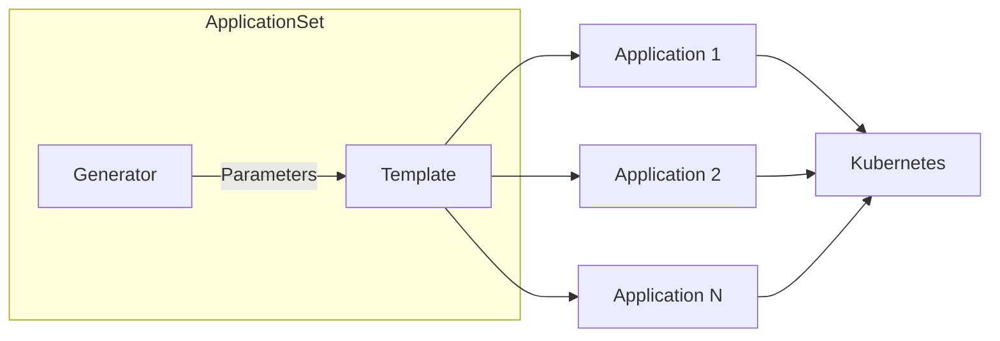

# How to Use Application Sets in ArgoCD

Author: [nawazdhandala](https://www.github.com/nawazdhandala)

Tags: ArgoCD, ApplicationSets, Kubernetes, GitOps, Automation, Multi-Environment

Description: Learn how to use ArgoCD ApplicationSets to automatically generate and manage multiple applications from a single template, covering generators, templating, and real-world patterns.

---

Managing dozens or hundreds of ArgoCD Applications manually gets painful fast. ApplicationSets solve this by generating Applications automatically from templates. Instead of writing 50 nearly identical Application manifests, you write one ApplicationSet and let ArgoCD do the rest.

## What Are ApplicationSets?

ApplicationSets are a controller that extends ArgoCD to automatically generate Application resources based on generators and templates.



Key benefits:
- Deploy the same app across multiple clusters with one manifest
- Generate Applications for each directory in a monorepo
- Manage environments (dev, staging, prod) uniformly
- Automatically add or remove Applications as your infrastructure changes

## Installing ApplicationSets

ApplicationSets are included with ArgoCD since version 2.3. If you are running an older version, install the controller separately:

```bash
kubectl apply -n argocd -f https://raw.githubusercontent.com/argoproj/applicationset/v0.4.1/manifests/install.yaml
```

Verify the controller is running:

```bash
kubectl get pods -n argocd | grep applicationset
```

## The List Generator

The simplest generator uses a static list of elements:

```yaml
# list-generator.yaml
apiVersion: argoproj.io/v1alpha1
kind: ApplicationSet
metadata:
  name: myapp-environments
  namespace: argocd
spec:
  generators:
    # List generator with explicit environments
    - list:
        elements:
          - env: development
            namespace: dev
            replicas: "1"
          - env: staging
            namespace: staging
            replicas: "2"
          - env: production
            namespace: prod
            replicas: "3"
  template:
    metadata:
      # Template uses parameters from the generator
      name: 'myapp-{{env}}'
    spec:
      project: default
      source:
        repoURL: https://github.com/myorg/myapp.git
        targetRevision: HEAD
        path: 'k8s/overlays/{{env}}'
        helm:
          parameters:
            - name: replicas
              value: '{{replicas}}'
      destination:
        server: https://kubernetes.default.svc
        namespace: '{{namespace}}'
      syncPolicy:
        automated:
          prune: true
          selfHeal: true
```

Apply it and watch three Applications appear:

```bash
kubectl apply -f list-generator.yaml

# Check generated applications
argocd app list
```

## The Git Generator

The Git generator is powerful for monorepos. It can create Applications based on directories or files in a repository.

### Directory Generator

Creates an Application for each directory matching a pattern:

```yaml
# git-directory-generator.yaml
apiVersion: argoproj.io/v1alpha1
kind: ApplicationSet
metadata:
  name: microservices
  namespace: argocd
spec:
  generators:
    - git:
        repoURL: https://github.com/myorg/services.git
        revision: HEAD
        directories:
          # Include all directories under services/
          - path: 'services/*'
          # Exclude specific directories
          - path: 'services/deprecated'
            exclude: true
  template:
    metadata:
      # path.basename gives the directory name
      name: '{{path.basename}}'
    spec:
      project: default
      source:
        repoURL: https://github.com/myorg/services.git
        targetRevision: HEAD
        path: '{{path}}'
      destination:
        server: https://kubernetes.default.svc
        namespace: '{{path.basename}}'
      syncPolicy:
        automated:
          prune: true
        syncOptions:
          - CreateNamespace=true
```

With this repository structure:

```
services/
  api-gateway/
    deployment.yaml
    service.yaml
  user-service/
    deployment.yaml
    service.yaml
  order-service/
    deployment.yaml
    service.yaml
```

ArgoCD will create three Applications: `api-gateway`, `user-service`, and `order-service`.

### File Generator

Reads parameters from config files in the repository:

```yaml
# git-file-generator.yaml
apiVersion: argoproj.io/v1alpha1
kind: ApplicationSet
metadata:
  name: cluster-apps
  namespace: argocd
spec:
  generators:
    - git:
        repoURL: https://github.com/myorg/config.git
        revision: HEAD
        files:
          - path: 'clusters/*/config.json'
  template:
    metadata:
      name: '{{cluster.name}}-apps'
    spec:
      project: default
      source:
        repoURL: https://github.com/myorg/apps.git
        targetRevision: HEAD
        path: base
        helm:
          values: |
            environment: {{cluster.environment}}
            region: {{cluster.region}}
      destination:
        server: '{{cluster.server}}'
        namespace: apps
```

Example config file at `clusters/prod-us-east/config.json`:

```json
{
  "cluster": {
    "name": "prod-us-east",
    "environment": "production",
    "region": "us-east-1",
    "server": "https://prod-us-east.example.com"
  }
}
```

## The Cluster Generator

Automatically create Applications for every cluster registered with ArgoCD:

```yaml
# cluster-generator.yaml
apiVersion: argoproj.io/v1alpha1
kind: ApplicationSet
metadata:
  name: monitoring-stack
  namespace: argocd
spec:
  generators:
    - clusters:
        # Select clusters with specific labels
        selector:
          matchLabels:
            monitoring: enabled
  template:
    metadata:
      name: 'monitoring-{{name}}'
    spec:
      project: infrastructure
      source:
        repoURL: https://github.com/myorg/infra.git
        targetRevision: HEAD
        path: monitoring
        helm:
          parameters:
            - name: clusterName
              value: '{{name}}'
      destination:
        # server is the cluster API endpoint
        server: '{{server}}'
        namespace: monitoring
      syncPolicy:
        automated:
          prune: true
        syncOptions:
          - CreateNamespace=true
```

Add labels to your clusters:

```bash
argocd cluster set prod-cluster --label monitoring=enabled
```

## The Matrix Generator

Combine multiple generators to create Applications for all combinations:

```yaml
# matrix-generator.yaml
apiVersion: argoproj.io/v1alpha1
kind: ApplicationSet
metadata:
  name: app-matrix
  namespace: argocd
spec:
  generators:
    - matrix:
        generators:
          # First generator: environments
          - list:
              elements:
                - env: dev
                  branch: develop
                - env: prod
                  branch: main
          # Second generator: services
          - git:
              repoURL: https://github.com/myorg/services.git
              revision: HEAD
              directories:
                - path: 'services/*'
  template:
    metadata:
      # Combines parameters from both generators
      name: '{{path.basename}}-{{env}}'
    spec:
      project: default
      source:
        repoURL: https://github.com/myorg/services.git
        targetRevision: '{{branch}}'
        path: '{{path}}'
      destination:
        server: https://kubernetes.default.svc
        namespace: '{{path.basename}}-{{env}}'
```

This creates an Application for every combination of environment and service.

## The Merge Generator

Combine multiple generators with priority-based merging:

```yaml
# merge-generator.yaml
apiVersion: argoproj.io/v1alpha1
kind: ApplicationSet
metadata:
  name: apps-with-overrides
  namespace: argocd
spec:
  generators:
    - merge:
        mergeKeys:
          - service
        generators:
          # Base configuration for all services
          - list:
              elements:
                - service: api
                  replicas: "2"
                  memory: "256Mi"
                - service: worker
                  replicas: "3"
                  memory: "512Mi"
          # Override specific services
          - list:
              elements:
                - service: api
                  replicas: "5"  # Override replicas for api
  template:
    metadata:
      name: '{{service}}'
    spec:
      project: default
      source:
        repoURL: https://github.com/myorg/apps.git
        path: '{{service}}'
        helm:
          parameters:
            - name: replicas
              value: '{{replicas}}'
            - name: memory
              value: '{{memory}}'
      destination:
        server: https://kubernetes.default.svc
        namespace: '{{service}}'
```

## Template Overrides

Override specific parts of the template for certain Applications:

```yaml
# template-override.yaml
apiVersion: argoproj.io/v1alpha1
kind: ApplicationSet
metadata:
  name: apps-with-patches
  namespace: argocd
spec:
  generators:
    - list:
        elements:
          - app: frontend
            sync: automated
          - app: database
            sync: manual
        template:
          spec:
            # This patches only applications from this generator
            syncPolicy:
              automated: null
  template:
    metadata:
      name: '{{app}}'
    spec:
      project: default
      source:
        repoURL: https://github.com/myorg/apps.git
        path: '{{app}}'
      destination:
        server: https://kubernetes.default.svc
        namespace: '{{app}}'
      syncPolicy:
        automated:
          prune: true
```

## Sync Policy for ApplicationSets

Control how ApplicationSets behave when Applications are deleted:

```yaml
apiVersion: argoproj.io/v1alpha1
kind: ApplicationSet
metadata:
  name: safe-apps
  namespace: argocd
spec:
  generators:
    - list:
        elements:
          - app: critical-service
  # Preserve orphaned applications
  syncPolicy:
    preserveResourcesOnDeletion: true
  template:
    metadata:
      name: '{{app}}'
    spec:
      project: default
      source:
        repoURL: https://github.com/myorg/apps.git
        path: '{{app}}'
      destination:
        server: https://kubernetes.default.svc
        namespace: '{{app}}'
```

## Best Practices

### Use Meaningful Names

```yaml
# Good: descriptive names
name: '{{cluster.region}}-{{app}}-{{env}}'

# Bad: ambiguous names
name: '{{path.basename}}'
```

### Set Resource Limits

```yaml
template:
  metadata:
    name: '{{app}}'
    annotations:
      # Prevent runaway syncs
      argocd.argoproj.io/sync-options: Prune=false
```

### Group by Project

```yaml
spec:
  generators:
    - git:
        repoURL: https://github.com/myorg/apps.git
        directories:
          - path: 'team-a/*'
  template:
    spec:
      # Use different projects for access control
      project: team-a
```

## Debugging ApplicationSets

Check the ApplicationSet controller logs:

```bash
kubectl logs -n argocd deployment/argocd-applicationset-controller -f
```

Describe the ApplicationSet to see generated parameters:

```bash
kubectl describe applicationset myapp-environments -n argocd
```

---

ApplicationSets transform how you manage large-scale Kubernetes deployments. Start with simple list generators, then graduate to Git generators as your repository structure evolves. The matrix and merge generators handle complex multi-dimensional deployments that would be impossible to manage manually.
