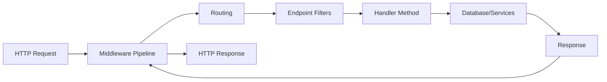

# How to Build REST APIs with ASP.NET Core 8 Minimal APIs

Author: [nawazdhandala](https://www.github.com/nawazdhandala)

Tags: .NET, C#, ASP.NET Core 8, Minimal APIs, REST API, Web Development

Description: Learn how to build clean, fast REST APIs using ASP.NET Core 8 Minimal APIs. This guide covers routing, validation, dependency injection, error handling, and production-ready patterns.

---

ASP.NET Core 8 introduced significant improvements to Minimal APIs, making them a compelling choice for building REST services. Unlike traditional controller-based APIs, Minimal APIs reduce boilerplate and let you focus on the logic that matters. This guide walks through building production-ready APIs with practical code examples.

## Why Minimal APIs?

Minimal APIs offer several advantages:

- **Less ceremony**: No controllers, no attributes, no inheritance
- **Better performance**: Reduced overhead compared to MVC
- **Cleaner code**: Business logic is front and center
- **Native AOT support**: Faster startup times for cloud-native scenarios

They are ideal for microservices, lightweight APIs, and scenarios where you want maximum control with minimal abstraction.

## Getting Started

Create a new Minimal API project:

```bash
dotnet new web -n ProductApi
cd ProductApi
```

The default `Program.cs` is remarkably simple:

```csharp
var builder = WebApplication.CreateBuilder(args);
var app = builder.Build();

app.MapGet("/", () => "Hello World!");

app.Run();
```

## Defining Endpoints

### Basic CRUD Operations

Here is a complete example showing how to structure CRUD endpoints for a product resource:

```csharp
using Microsoft.EntityFrameworkCore;

var builder = WebApplication.CreateBuilder(args);

// Register the database context
builder.Services.AddDbContext<ProductDbContext>(options =>
    options.UseInMemoryDatabase("Products"));

var app = builder.Build();

// GET all products with optional filtering
app.MapGet("/api/products", async (ProductDbContext db, string? category) =>
{
    var query = db.Products.AsQueryable();

    if (!string.IsNullOrEmpty(category))
    {
        query = query.Where(p => p.Category == category);
    }

    return Results.Ok(await query.ToListAsync());
});

// GET single product by ID
app.MapGet("/api/products/{id:int}", async (int id, ProductDbContext db) =>
{
    var product = await db.Products.FindAsync(id);
    return product is not null
        ? Results.Ok(product)
        : Results.NotFound(new { message = "Product not found" });
});

// POST create new product
app.MapPost("/api/products", async (CreateProductRequest request, ProductDbContext db) =>
{
    var product = new Product
    {
        Name = request.Name,
        Price = request.Price,
        Category = request.Category,
        CreatedAt = DateTime.UtcNow
    };

    db.Products.Add(product);
    await db.SaveChangesAsync();

    return Results.Created($"/api/products/{product.Id}", product);
});

// PUT update existing product
app.MapPut("/api/products/{id:int}", async (int id, UpdateProductRequest request, ProductDbContext db) =>
{
    var product = await db.Products.FindAsync(id);

    if (product is null)
    {
        return Results.NotFound(new { message = "Product not found" });
    }

    product.Name = request.Name;
    product.Price = request.Price;
    product.Category = request.Category;
    product.UpdatedAt = DateTime.UtcNow;

    await db.SaveChangesAsync();

    return Results.Ok(product);
});

// DELETE remove product
app.MapDelete("/api/products/{id:int}", async (int id, ProductDbContext db) =>
{
    var product = await db.Products.FindAsync(id);

    if (product is null)
    {
        return Results.NotFound();
    }

    db.Products.Remove(product);
    await db.SaveChangesAsync();

    return Results.NoContent();
});

app.Run();
```

### Request and Response Models

Define clear models for requests and responses:

```csharp
// Request models
public record CreateProductRequest(
    string Name,
    decimal Price,
    string Category
);

public record UpdateProductRequest(
    string Name,
    decimal Price,
    string Category
);

// Entity model
public class Product
{
    public int Id { get; set; }
    public string Name { get; set; } = string.Empty;
    public decimal Price { get; set; }
    public string Category { get; set; } = string.Empty;
    public DateTime CreatedAt { get; set; }
    public DateTime? UpdatedAt { get; set; }
}

// Database context
public class ProductDbContext : DbContext
{
    public ProductDbContext(DbContextOptions<ProductDbContext> options)
        : base(options) { }

    public DbSet<Product> Products => Set<Product>();
}
```

## Validation with Filters

ASP.NET Core 8 supports endpoint filters for cross-cutting concerns like validation:

```csharp
using System.ComponentModel.DataAnnotations;

// Validation filter that works with any request type
public class ValidationFilter<T> : IEndpointFilter where T : class
{
    public async ValueTask<object?> InvokeAsync(
        EndpointFilterInvocationContext context,
        EndpointFilterDelegate next)
    {
        // Find the argument of type T
        var argument = context.Arguments.OfType<T>().FirstOrDefault();

        if (argument is null)
        {
            return Results.BadRequest(new { message = "Request body is required" });
        }

        // Validate using data annotations
        var validationResults = new List<ValidationResult>();
        var validationContext = new ValidationContext(argument);

        if (!Validator.TryValidateObject(argument, validationContext, validationResults, true))
        {
            var errors = validationResults
                .Select(r => new { field = r.MemberNames.FirstOrDefault(), message = r.ErrorMessage })
                .ToList();

            return Results.BadRequest(new { errors });
        }

        return await next(context);
    }
}

// Request with validation attributes
public record CreateProductRequest(
    [Required, MinLength(2), MaxLength(100)] string Name,
    [Range(0.01, 100000)] decimal Price,
    [Required] string Category
);

// Apply the filter to an endpoint
app.MapPost("/api/products", async (CreateProductRequest request, ProductDbContext db) =>
{
    // Validation already passed if we reach here
    var product = new Product { /* ... */ };
    // ...
})
.AddEndpointFilter<ValidationFilter<CreateProductRequest>>();
```

## Organizing Endpoints with Route Groups

As your API grows, organize related endpoints using route groups:

```csharp
var app = builder.Build();

// Create a route group with shared configuration
var productsApi = app.MapGroup("/api/products")
    .WithTags("Products")
    .RequireAuthorization();

productsApi.MapGet("/", GetAllProducts);
productsApi.MapGet("/{id:int}", GetProductById);
productsApi.MapPost("/", CreateProduct)
    .AddEndpointFilter<ValidationFilter<CreateProductRequest>>();
productsApi.MapPut("/{id:int}", UpdateProduct);
productsApi.MapDelete("/{id:int}", DeleteProduct);

// Handler methods defined separately for cleaner code
static async Task<IResult> GetAllProducts(ProductDbContext db)
{
    var products = await db.Products.ToListAsync();
    return Results.Ok(products);
}

static async Task<IResult> GetProductById(int id, ProductDbContext db)
{
    var product = await db.Products.FindAsync(id);
    return product is not null ? Results.Ok(product) : Results.NotFound();
}
```

## Error Handling

Implement consistent error handling with a custom exception handler:

```csharp
var builder = WebApplication.CreateBuilder(args);

// Add problem details service for standardized errors
builder.Services.AddProblemDetails();

var app = builder.Build();

// Global exception handler
app.UseExceptionHandler(errorApp =>
{
    errorApp.Run(async context =>
    {
        context.Response.ContentType = "application/problem+json";

        var exceptionFeature = context.Features.Get<IExceptionHandlerFeature>();
        var exception = exceptionFeature?.Error;

        var (statusCode, title) = exception switch
        {
            ArgumentException => (400, "Bad Request"),
            KeyNotFoundException => (404, "Not Found"),
            UnauthorizedAccessException => (401, "Unauthorized"),
            _ => (500, "Internal Server Error")
        };

        context.Response.StatusCode = statusCode;

        await context.Response.WriteAsJsonAsync(new
        {
            type = $"https://httpstatuses.com/{statusCode}",
            title,
            status = statusCode,
            detail = app.Environment.IsDevelopment() ? exception?.Message : null,
            traceId = context.TraceIdentifier
        });
    });
});
```

## Adding OpenAPI Documentation

Add Swagger/OpenAPI support for documentation and testing:

```csharp
var builder = WebApplication.CreateBuilder(args);

// Add OpenAPI services
builder.Services.AddEndpointsApiExplorer();
builder.Services.AddSwaggerGen(options =>
{
    options.SwaggerDoc("v1", new()
    {
        Title = "Product API",
        Version = "v1",
        Description = "API for managing products"
    });
});

var app = builder.Build();

// Enable Swagger in development
if (app.Environment.IsDevelopment())
{
    app.UseSwagger();
    app.UseSwaggerUI();
}

// Add metadata to endpoints for better documentation
app.MapGet("/api/products", async (ProductDbContext db) =>
{
    return Results.Ok(await db.Products.ToListAsync());
})
.WithName("GetAllProducts")
.WithDescription("Retrieves all products from the catalog")
.Produces<List<Product>>(200)
.WithOpenApi();
```

## Request Flow Overview

The following diagram shows how a request flows through a Minimal API:



## Performance Tips

### Use AsNoTracking for Read Operations

```csharp
app.MapGet("/api/products", async (ProductDbContext db) =>
{
    // AsNoTracking improves performance for read-only queries
    var products = await db.Products
        .AsNoTracking()
        .ToListAsync();

    return Results.Ok(products);
});
```

### Implement Pagination

```csharp
app.MapGet("/api/products", async (
    ProductDbContext db,
    int page = 1,
    int pageSize = 20) =>
{
    // Limit page size to prevent abuse
    pageSize = Math.Min(pageSize, 100);

    var totalCount = await db.Products.CountAsync();
    var products = await db.Products
        .AsNoTracking()
        .Skip((page - 1) * pageSize)
        .Take(pageSize)
        .ToListAsync();

    return Results.Ok(new
    {
        data = products,
        pagination = new
        {
            currentPage = page,
            pageSize,
            totalCount,
            totalPages = (int)Math.Ceiling(totalCount / (double)pageSize)
        }
    });
});
```

## Summary

ASP.NET Core 8 Minimal APIs provide a lightweight, high-performance approach to building REST services. Key takeaways:

| Aspect | Recommendation |
|--------|----------------|
| **Structure** | Use route groups to organize related endpoints |
| **Validation** | Implement endpoint filters for reusable validation |
| **Errors** | Return consistent Problem Details responses |
| **Documentation** | Add OpenAPI metadata for all endpoints |
| **Performance** | Use AsNoTracking, pagination, and response caching |

Minimal APIs are not just for simple projects. With the right patterns, they scale well for production workloads while keeping your codebase clean and maintainable.
