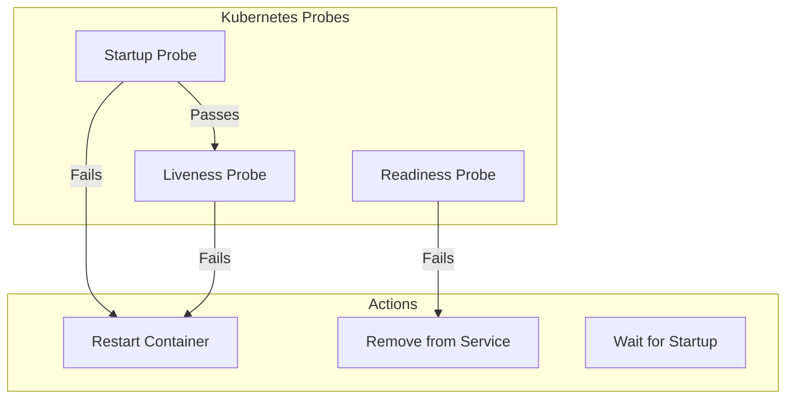

# How to Build Health Probes with ASP.NET Core Health Checks

Author: [nawazdhandala](https://www.github.com/nawazdhandala)

Tags: .NET, ASP.NET Core, Health Checks, C#, Kubernetes, Observability, Monitoring, Reliability

Description: Learn how to implement health probes in ASP.NET Core using the built-in health checks framework. This guide covers liveness, readiness, and startup probes with custom health checks for databases, external services, and more.

---

Health checks are essential for monitoring application health and enabling container orchestrators like Kubernetes to manage your services effectively. ASP.NET Core provides a built-in health checks framework that integrates with Kubernetes probes and monitoring systems.

## Understanding Health Probe Types

Kubernetes uses three types of probes to determine container health:



| Probe Type | Purpose | Failure Action |
|------------|---------|----------------|
| Startup | Check if app has started | Restart container |
| Liveness | Check if app is running | Restart container |
| Readiness | Check if app can serve traffic | Remove from load balancer |

## Basic Health Check Setup

Add health checks to your ASP.NET Core application:

```csharp
// Program.cs
var builder = WebApplication.CreateBuilder(args);

// Add basic health checks
builder.Services.AddHealthChecks();

var app = builder.Build();

// Map the health endpoint
app.MapHealthChecks("/health");

app.Run();
```

This creates a simple health endpoint that returns 200 OK when the application is running.

## Configuring Multiple Health Endpoints

Create separate endpoints for different probe types:

```csharp
// Program.cs
var builder = WebApplication.CreateBuilder(args);

builder.Services.AddHealthChecks()
    // Tag checks for filtering
    .AddCheck("self", () => HealthCheckResult.Healthy(), tags: new[] { "live" })
    .AddCheck<DatabaseHealthCheck>("database", tags: new[] { "ready", "startup" })
    .AddCheck<RedisHealthCheck>("redis", tags: new[] { "ready" })
    .AddCheck<ExternalApiHealthCheck>("external-api", tags: new[] { "ready" });

var app = builder.Build();

// Liveness probe - just checks if the process is alive
app.MapHealthChecks("/health/live", new HealthCheckOptions
{
    Predicate = check => check.Tags.Contains("live")
});

// Readiness probe - checks if dependencies are ready
app.MapHealthChecks("/health/ready", new HealthCheckOptions
{
    Predicate = check => check.Tags.Contains("ready")
});

// Startup probe - checks initial startup requirements
app.MapHealthChecks("/health/startup", new HealthCheckOptions
{
    Predicate = check => check.Tags.Contains("startup")
});

app.Run();
```

## Custom Health Checks

Create custom health checks for your dependencies:

### Database Health Check

```csharp
// HealthChecks/DatabaseHealthCheck.cs
public class DatabaseHealthCheck : IHealthCheck
{
    private readonly ApplicationDbContext _context;
    private readonly ILogger<DatabaseHealthCheck> _logger;

    public DatabaseHealthCheck(
        ApplicationDbContext context,
        ILogger<DatabaseHealthCheck> logger)
    {
        _context = context;
        _logger = logger;
    }

    public async Task<HealthCheckResult> CheckHealthAsync(
        HealthCheckContext context,
        CancellationToken cancellationToken = default)
    {
        try
        {
            // Execute a simple query to verify connectivity
            var canConnect = await _context.Database.CanConnectAsync(cancellationToken);

            if (canConnect)
            {
                // Optionally run a diagnostic query
                await _context.Database.ExecuteSqlRawAsync(
                    "SELECT 1",
                    cancellationToken);

                return HealthCheckResult.Healthy("Database connection successful");
            }

            return HealthCheckResult.Unhealthy("Cannot connect to database");
        }
        catch (Exception ex)
        {
            _logger.LogError(ex, "Database health check failed");

            return HealthCheckResult.Unhealthy(
                description: "Database health check failed",
                exception: ex,
                data: new Dictionary<string, object>
                {
                    { "error", ex.Message }
                });
        }
    }
}
```

### Redis Health Check

```csharp
// HealthChecks/RedisHealthCheck.cs
public class RedisHealthCheck : IHealthCheck
{
    private readonly IConnectionMultiplexer _redis;
    private readonly ILogger<RedisHealthCheck> _logger;

    public RedisHealthCheck(
        IConnectionMultiplexer redis,
        ILogger<RedisHealthCheck> logger)
    {
        _redis = redis;
        _logger = logger;
    }

    public async Task<HealthCheckResult> CheckHealthAsync(
        HealthCheckContext context,
        CancellationToken cancellationToken = default)
    {
        try
        {
            var db = _redis.GetDatabase();

            // Ping Redis
            var latency = await db.PingAsync();

            // Check if latency is acceptable
            if (latency > TimeSpan.FromMilliseconds(100))
            {
                return HealthCheckResult.Degraded(
                    description: $"Redis latency is high: {latency.TotalMilliseconds}ms",
                    data: new Dictionary<string, object>
                    {
                        { "latency_ms", latency.TotalMilliseconds }
                    });
            }

            return HealthCheckResult.Healthy(
                description: $"Redis is responsive (latency: {latency.TotalMilliseconds}ms)");
        }
        catch (Exception ex)
        {
            _logger.LogError(ex, "Redis health check failed");
            return HealthCheckResult.Unhealthy(
                description: "Redis connection failed",
                exception: ex);
        }
    }
}
```

### External API Health Check

```csharp
// HealthChecks/ExternalApiHealthCheck.cs
public class ExternalApiHealthCheck : IHealthCheck
{
    private readonly HttpClient _httpClient;
    private readonly IConfiguration _configuration;
    private readonly ILogger<ExternalApiHealthCheck> _logger;

    public ExternalApiHealthCheck(
        HttpClient httpClient,
        IConfiguration configuration,
        ILogger<ExternalApiHealthCheck> logger)
    {
        _httpClient = httpClient;
        _configuration = configuration;
        _logger = logger;
    }

    public async Task<HealthCheckResult> CheckHealthAsync(
        HealthCheckContext context,
        CancellationToken cancellationToken = default)
    {
        var apiUrl = _configuration["ExternalApi:HealthUrl"];

        try
        {
            using var cts = CancellationTokenSource.CreateLinkedTokenSource(cancellationToken);
            cts.CancelAfter(TimeSpan.FromSeconds(5));

            var response = await _httpClient.GetAsync(apiUrl, cts.Token);

            if (response.IsSuccessStatusCode)
            {
                return HealthCheckResult.Healthy("External API is reachable");
            }

            return HealthCheckResult.Degraded(
                description: $"External API returned {response.StatusCode}",
                data: new Dictionary<string, object>
                {
                    { "status_code", (int)response.StatusCode }
                });
        }
        catch (TaskCanceledException)
        {
            return HealthCheckResult.Unhealthy("External API request timed out");
        }
        catch (HttpRequestException ex)
        {
            _logger.LogWarning(ex, "External API health check failed");
            return HealthCheckResult.Unhealthy(
                description: "Cannot reach external API",
                exception: ex);
        }
    }
}
```

### Message Queue Health Check

```csharp
// HealthChecks/ServiceBusHealthCheck.cs
public class ServiceBusHealthCheck : IHealthCheck
{
    private readonly ServiceBusClient _client;
    private readonly string _queueName;
    private readonly ILogger<ServiceBusHealthCheck> _logger;

    public ServiceBusHealthCheck(
        ServiceBusClient client,
        IConfiguration configuration,
        ILogger<ServiceBusHealthCheck> logger)
    {
        _client = client;
        _queueName = configuration["ServiceBus:QueueName"]!;
        _logger = logger;
    }

    public async Task<HealthCheckResult> CheckHealthAsync(
        HealthCheckContext context,
        CancellationToken cancellationToken = default)
    {
        try
        {
            // Create a receiver to verify queue access
            await using var receiver = _client.CreateReceiver(_queueName);

            // Peek a message without consuming it
            var messages = await receiver.PeekMessagesAsync(
                maxMessages: 1,
                cancellationToken: cancellationToken);

            return HealthCheckResult.Healthy(
                description: "Service Bus queue is accessible");
        }
        catch (ServiceBusException ex) when (ex.Reason == ServiceBusFailureReason.MessagingEntityNotFound)
        {
            return HealthCheckResult.Unhealthy(
                description: $"Queue '{_queueName}' not found");
        }
        catch (Exception ex)
        {
            _logger.LogError(ex, "Service Bus health check failed");
            return HealthCheckResult.Unhealthy(
                description: "Service Bus connection failed",
                exception: ex);
        }
    }
}
```

## Health Check with Timeout

Prevent health checks from hanging:

```csharp
// HealthChecks/TimeoutHealthCheck.cs
public class SlowDependencyHealthCheck : IHealthCheck
{
    private readonly ISlowService _slowService;
    private static readonly TimeSpan Timeout = TimeSpan.FromSeconds(3);

    public SlowDependencyHealthCheck(ISlowService slowService)
    {
        _slowService = slowService;
    }

    public async Task<HealthCheckResult> CheckHealthAsync(
        HealthCheckContext context,
        CancellationToken cancellationToken = default)
    {
        using var cts = CancellationTokenSource.CreateLinkedTokenSource(cancellationToken);
        cts.CancelAfter(Timeout);

        try
        {
            var isHealthy = await _slowService.CheckAsync(cts.Token);

            return isHealthy
                ? HealthCheckResult.Healthy()
                : HealthCheckResult.Unhealthy("Dependency check failed");
        }
        catch (OperationCanceledException) when (cts.IsCancellationRequested)
        {
            return HealthCheckResult.Unhealthy(
                description: $"Health check timed out after {Timeout.TotalSeconds}s");
        }
    }
}
```

## Custom Response Format

Return detailed JSON responses for monitoring systems:

```csharp
// Program.cs
app.MapHealthChecks("/health/detailed", new HealthCheckOptions
{
    ResponseWriter = WriteDetailedResponse
});

// HealthChecks/HealthCheckResponseWriter.cs
static async Task WriteDetailedResponse(
    HttpContext context,
    HealthReport report)
{
    context.Response.ContentType = "application/json";

    var response = new
    {
        status = report.Status.ToString(),
        totalDuration = report.TotalDuration.TotalMilliseconds,
        timestamp = DateTime.UtcNow,
        checks = report.Entries.Select(entry => new
        {
            name = entry.Key,
            status = entry.Value.Status.ToString(),
            description = entry.Value.Description,
            duration = entry.Value.Duration.TotalMilliseconds,
            data = entry.Value.Data,
            exception = entry.Value.Exception?.Message
        })
    };

    await context.Response.WriteAsJsonAsync(response);
}
```

Example response:

```json
{
  "status": "Healthy",
  "totalDuration": 45.23,
  "timestamp": "2026-01-25T10:30:00Z",
  "checks": [
    {
      "name": "database",
      "status": "Healthy",
      "description": "Database connection successful",
      "duration": 12.5,
      "data": {},
      "exception": null
    },
    {
      "name": "redis",
      "status": "Healthy",
      "description": "Redis is responsive (latency: 2.3ms)",
      "duration": 5.2,
      "data": { "latency_ms": 2.3 },
      "exception": null
    }
  ]
}
```

## Using Built-in Health Check Packages

ASP.NET Core has NuGet packages for common dependencies:

```bash
dotnet add package AspNetCore.HealthChecks.SqlServer
dotnet add package AspNetCore.HealthChecks.Redis
dotnet add package AspNetCore.HealthChecks.Npgsql
dotnet add package AspNetCore.HealthChecks.Uris
dotnet add package AspNetCore.HealthChecks.AzureServiceBus
```

```csharp
// Program.cs
builder.Services.AddHealthChecks()
    // SQL Server
    .AddSqlServer(
        connectionString: builder.Configuration.GetConnectionString("Default")!,
        name: "sqlserver",
        tags: new[] { "ready", "database" })

    // PostgreSQL
    .AddNpgSql(
        connectionString: builder.Configuration.GetConnectionString("Postgres")!,
        name: "postgres",
        tags: new[] { "ready", "database" })

    // Redis
    .AddRedis(
        redisConnectionString: builder.Configuration["Redis:ConnectionString"]!,
        name: "redis",
        tags: new[] { "ready", "cache" })

    // URL health check
    .AddUrlGroup(
        new Uri("https://api.external.com/health"),
        name: "external-api",
        tags: new[] { "ready" })

    // Azure Service Bus
    .AddAzureServiceBusQueue(
        connectionString: builder.Configuration["ServiceBus:ConnectionString"]!,
        queueName: "orders",
        name: "servicebus",
        tags: new[] { "ready", "messaging" });
```

## Kubernetes Integration

Configure your Kubernetes deployment to use health probes:

```yaml
# deployment.yaml
apiVersion: apps/v1
kind: Deployment
metadata:
  name: my-api
spec:
  replicas: 3
  template:
    spec:
      containers:
        - name: api
          image: myregistry/my-api:v1.0.0
          ports:
            - containerPort: 8080

          # Startup probe - allows slow-starting containers
          startupProbe:
            httpGet:
              path: /health/startup
              port: 8080
            initialDelaySeconds: 0
            periodSeconds: 3
            failureThreshold: 30    # 90 seconds to start
            successThreshold: 1

          # Liveness probe - restarts unhealthy containers
          livenessProbe:
            httpGet:
              path: /health/live
              port: 8080
            initialDelaySeconds: 0
            periodSeconds: 15
            failureThreshold: 3
            successThreshold: 1
            timeoutSeconds: 5

          # Readiness probe - controls traffic routing
          readinessProbe:
            httpGet:
              path: /health/ready
              port: 8080
            initialDelaySeconds: 5
            periodSeconds: 10
            failureThreshold: 3
            successThreshold: 1
            timeoutSeconds: 5
```

## Health Check UI

Add a dashboard to visualize health check status:

```bash
dotnet add package AspNetCore.HealthChecks.UI
dotnet add package AspNetCore.HealthChecks.UI.InMemory.Storage
```

```csharp
// Program.cs
builder.Services.AddHealthChecksUI(options =>
{
    options.SetEvaluationTimeInSeconds(30);
    options.MaximumHistoryEntriesPerEndpoint(50);

    options.AddHealthCheckEndpoint("API", "/health/detailed");
})
.AddInMemoryStorage();

var app = builder.Build();

app.MapHealthChecks("/health/detailed", new HealthCheckOptions
{
    ResponseWriter = UIResponseWriter.WriteHealthCheckUIResponse
});

app.MapHealthChecksUI(options =>
{
    options.UIPath = "/health-ui";
});
```

## Conditional Health Checks

Run health checks only under certain conditions:

```csharp
// Program.cs
builder.Services.AddHealthChecks()
    .AddCheck<DatabaseHealthCheck>(
        name: "database",
        failureStatus: HealthStatus.Unhealthy,
        tags: new[] { "ready" })

    // Only run in production
    .AddCheck<ExternalApiHealthCheck>(
        name: "external-api",
        tags: new[] { "ready" })
    .AddCheck<DebugHealthCheck>(
        name: "debug",
        tags: new[] { "debug" });

// In development, include debug checks
if (builder.Environment.IsDevelopment())
{
    app.MapHealthChecks("/health/debug", new HealthCheckOptions
    {
        Predicate = check => check.Tags.Contains("debug")
    });
}
```

## Circuit Breaker Pattern

Prevent cascading failures with circuit breaker integration:

```csharp
// HealthChecks/CircuitBreakerAwareHealthCheck.cs
public class CircuitBreakerAwareHealthCheck : IHealthCheck
{
    private readonly CircuitBreakerStateProvider _circuitBreaker;

    public CircuitBreakerAwareHealthCheck(CircuitBreakerStateProvider circuitBreaker)
    {
        _circuitBreaker = circuitBreaker;
    }

    public Task<HealthCheckResult> CheckHealthAsync(
        HealthCheckContext context,
        CancellationToken cancellationToken = default)
    {
        var state = _circuitBreaker.GetState();

        return Task.FromResult(state switch
        {
            CircuitState.Closed => HealthCheckResult.Healthy("Circuit closed"),
            CircuitState.HalfOpen => HealthCheckResult.Degraded("Circuit half-open"),
            CircuitState.Open => HealthCheckResult.Unhealthy("Circuit open"),
            _ => HealthCheckResult.Unhealthy("Unknown circuit state")
        });
    }
}
```

## Best Practices

| Practice | Description |
|----------|-------------|
| Separate endpoints | Use different endpoints for liveness, readiness, and startup |
| Fast checks | Keep liveness checks lightweight |
| Timeout handling | Set timeouts to prevent hanging probes |
| Graceful degradation | Return Degraded instead of Unhealthy when appropriate |
| Meaningful data | Include diagnostic data in health check results |
| Secure endpoints | Consider authentication for detailed health endpoints |

## Summary

ASP.NET Core Health Checks provide a robust framework for monitoring application health:

- Use separate endpoints for liveness, readiness, and startup probes
- Create custom health checks for your specific dependencies
- Use tags to organize and filter health checks
- Return detailed JSON responses for monitoring systems
- Integrate with Kubernetes probes for container orchestration
- Consider using the Health Checks UI for visualization

---

*Need comprehensive health monitoring for your .NET applications? [OneUptime](https://oneuptime.com) provides advanced health check monitoring, alerting, and status pages for your services.*

**Related Reading:**
- [How to Set Up Kubernetes for .NET Applications](https://oneuptime.com/blog/post/2026-01-19-kubernetes-dotnet-applications/view) - Deploy .NET apps to Kubernetes
- [How to Build Background Services with .NET Worker Service](https://oneuptime.com/blog/post/2026-01-25-dotnet-worker-service-background-services/view) - Background processing in .NET
