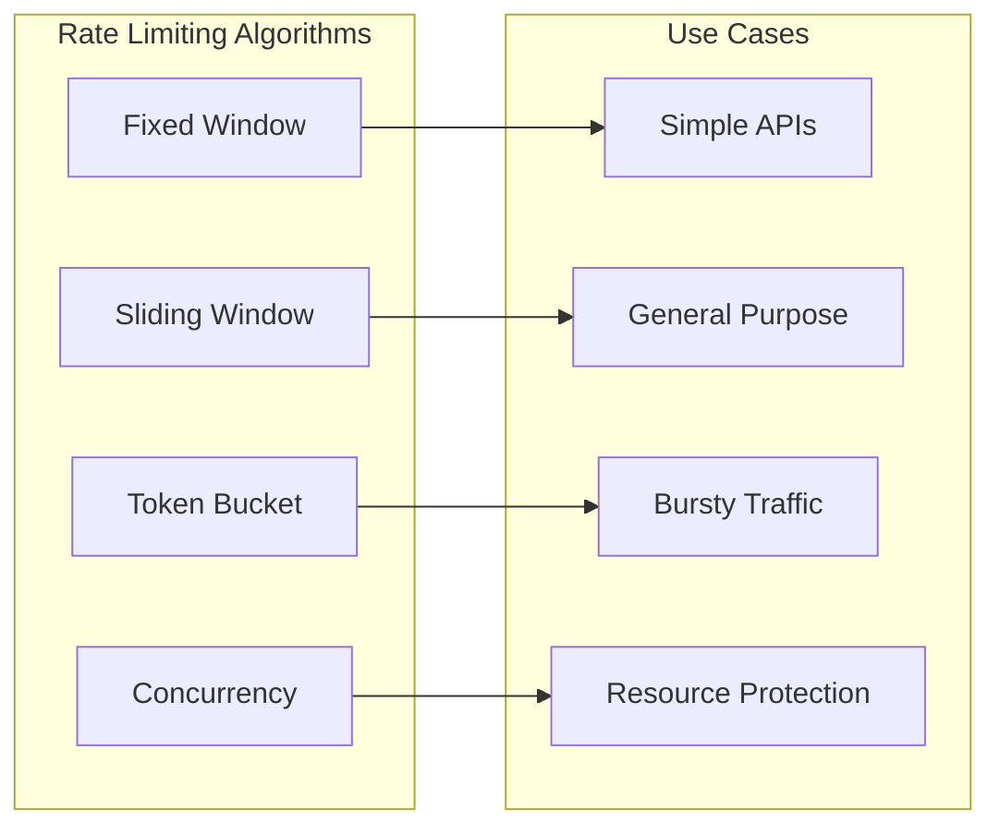

# How to Implement Rate Limiting in ASP.NET Core 8

Author: [nawazdhandala](https://www.github.com/nawazdhandala)

Tags: .NET, ASP.NET Core, Rate Limiting, C#, API Security, Performance, Middleware

Description: Learn how to implement rate limiting in ASP.NET Core 8 using the built-in rate limiting middleware. This guide covers fixed window, sliding window, token bucket, and concurrency limiters with practical examples.

---

Rate limiting protects your API from abuse and ensures fair resource allocation among clients. ASP.NET Core 8 includes built-in rate limiting middleware that eliminates the need for third-party packages. This guide shows you how to implement effective rate limiting strategies for your applications.

## Rate Limiting Algorithms

ASP.NET Core 8 supports four rate limiting algorithms out of the box:



| Algorithm | Description | Best For |
|-----------|-------------|----------|
| Fixed Window | Count requests in fixed time periods | Simple scenarios |
| Sliding Window | Smooth counting across time boundaries | Most APIs |
| Token Bucket | Allow bursts up to a limit | APIs with variable traffic |
| Concurrency | Limit concurrent requests | Protecting limited resources |

## Basic Setup

Add rate limiting to your ASP.NET Core 8 application:

```csharp
// Program.cs
using Microsoft.AspNetCore.RateLimiting;
using System.Threading.RateLimiting;

var builder = WebApplication.CreateBuilder(args);

// Add rate limiting services
builder.Services.AddRateLimiter(options =>
{
    // Global settings
    options.RejectionStatusCode = StatusCodes.Status429TooManyRequests;

    // Add a fixed window policy
    options.AddFixedWindowLimiter("fixed", config =>
    {
        config.PermitLimit = 100;
        config.Window = TimeSpan.FromMinutes(1);
        config.QueueProcessingOrder = QueueProcessingOrder.OldestFirst;
        config.QueueLimit = 10;
    });
});

var app = builder.Build();

// Use rate limiting middleware
app.UseRateLimiter();

app.MapGet("/api/data", () => Results.Ok(new { message = "Success" }))
    .RequireRateLimiting("fixed");

app.Run();
```

## Fixed Window Rate Limiter

Fixed window limits requests within discrete time periods:

```csharp
// Program.cs
builder.Services.AddRateLimiter(options =>
{
    options.AddFixedWindowLimiter("fixed", config =>
    {
        // Maximum 100 requests per window
        config.PermitLimit = 100;

        // Window duration of 1 minute
        config.Window = TimeSpan.FromMinutes(1);

        // Queue up to 5 requests when limit is reached
        config.QueueLimit = 5;

        // Process oldest queued requests first
        config.QueueProcessingOrder = QueueProcessingOrder.OldestFirst;

        // Auto-replenish when window resets
        config.AutoReplenishment = true;
    });
});
```

The fixed window limiter resets the count at the start of each window. This can allow bursts at window boundaries, where a client could make 100 requests at the end of one window and 100 more at the start of the next.

## Sliding Window Rate Limiter

Sliding window provides smoother rate limiting by dividing the window into segments:

```csharp
// Program.cs
builder.Services.AddRateLimiter(options =>
{
    options.AddSlidingWindowLimiter("sliding", config =>
    {
        // Maximum 100 requests per window
        config.PermitLimit = 100;

        // Total window duration
        config.Window = TimeSpan.FromMinutes(1);

        // Divide window into 6 segments of 10 seconds each
        config.SegmentsPerWindow = 6;

        config.QueueLimit = 10;
        config.QueueProcessingOrder = QueueProcessingOrder.OldestFirst;
    });
});
```

With 6 segments in a 1-minute window, each segment is 10 seconds. As time advances, old segments expire and their permits become available again.

## Token Bucket Rate Limiter

Token bucket allows bursts while maintaining a long-term rate:

```csharp
// Program.cs
builder.Services.AddRateLimiter(options =>
{
    options.AddTokenBucketLimiter("token", config =>
    {
        // Maximum burst size
        config.TokenLimit = 50;

        // Tokens added per replenishment
        config.TokensPerPeriod = 10;

        // Replenishment interval
        config.ReplenishmentPeriod = TimeSpan.FromSeconds(10);

        config.QueueLimit = 5;
        config.QueueProcessingOrder = QueueProcessingOrder.OldestFirst;

        // Start with full bucket
        config.AutoReplenishment = true;
    });
});
```

This configuration allows bursts of up to 50 requests, then replenishes 10 tokens every 10 seconds (60 requests per minute sustained).

## Concurrency Limiter

Concurrency limiter restricts how many requests can be processed simultaneously:

```csharp
// Program.cs
builder.Services.AddRateLimiter(options =>
{
    options.AddConcurrencyLimiter("concurrent", config =>
    {
        // Maximum concurrent requests
        config.PermitLimit = 10;

        // Queue up to 20 additional requests
        config.QueueLimit = 20;

        config.QueueProcessingOrder = QueueProcessingOrder.OldestFirst;
    });
});
```

Use concurrency limiting for endpoints that consume limited resources like database connections or external API calls.

## Per-Client Rate Limiting

Rate limit based on client identity using partitioned limiters:

```csharp
// Program.cs
builder.Services.AddRateLimiter(options =>
{
    // Rate limit by client IP address
    options.AddPolicy("per-ip", httpContext =>
        RateLimitPartition.GetFixedWindowLimiter(
            // Partition key is the client IP
            partitionKey: httpContext.Connection.RemoteIpAddress?.ToString() ?? "unknown",
            factory: partition => new FixedWindowRateLimiterOptions
            {
                PermitLimit = 100,
                Window = TimeSpan.FromMinutes(1),
                QueueLimit = 5
            }));

    // Rate limit by authenticated user
    options.AddPolicy("per-user", httpContext =>
    {
        var userId = httpContext.User.FindFirst("sub")?.Value ?? "anonymous";

        return RateLimitPartition.GetSlidingWindowLimiter(
            partitionKey: userId,
            factory: partition => new SlidingWindowRateLimiterOptions
            {
                PermitLimit = 1000,
                Window = TimeSpan.FromHours(1),
                SegmentsPerWindow = 6,
                QueueLimit = 10
            });
    });

    // Rate limit by API key
    options.AddPolicy("per-api-key", httpContext =>
    {
        var apiKey = httpContext.Request.Headers["X-API-Key"].FirstOrDefault() ?? "none";

        return RateLimitPartition.GetTokenBucketLimiter(
            partitionKey: apiKey,
            factory: partition => new TokenBucketRateLimiterOptions
            {
                TokenLimit = 100,
                TokensPerPeriod = 20,
                ReplenishmentPeriod = TimeSpan.FromSeconds(10),
                QueueLimit = 5
            });
    });
});
```

## Applying Rate Limits to Controllers

Apply rate limiting to controllers and actions using attributes:

```csharp
// Controllers/ProductsController.cs
using Microsoft.AspNetCore.RateLimiting;

[ApiController]
[Route("api/[controller]")]
[EnableRateLimiting("per-ip")] // Apply to all actions
public class ProductsController : ControllerBase
{
    // Uses controller-level policy
    [HttpGet]
    public IActionResult GetAll()
    {
        return Ok(new[] { "Product 1", "Product 2" });
    }

    // Override with different policy
    [HttpPost]
    [EnableRateLimiting("concurrent")]
    public IActionResult Create([FromBody] ProductDto product)
    {
        return Created($"/api/products/{product.Id}", product);
    }

    // Disable rate limiting for this action
    [HttpGet("health")]
    [DisableRateLimiting]
    public IActionResult Health()
    {
        return Ok();
    }
}
```

## Tiered Rate Limiting

Implement different rate limits based on subscription tiers:

```csharp
// Services/RateLimitService.cs
public interface IRateLimitService
{
    RateLimitConfig GetConfigForUser(string userId);
}

public class RateLimitService : IRateLimitService
{
    private readonly IUserRepository _userRepository;

    public RateLimitService(IUserRepository userRepository)
    {
        _userRepository = userRepository;
    }

    public RateLimitConfig GetConfigForUser(string userId)
    {
        var user = _userRepository.GetById(userId);

        return user?.Tier switch
        {
            "free" => new RateLimitConfig(100, TimeSpan.FromHours(1)),
            "basic" => new RateLimitConfig(1000, TimeSpan.FromHours(1)),
            "premium" => new RateLimitConfig(10000, TimeSpan.FromHours(1)),
            "enterprise" => new RateLimitConfig(100000, TimeSpan.FromHours(1)),
            _ => new RateLimitConfig(50, TimeSpan.FromHours(1))
        };
    }
}

public record RateLimitConfig(int PermitLimit, TimeSpan Window);
```

```csharp
// Program.cs
builder.Services.AddScoped<IRateLimitService, RateLimitService>();

builder.Services.AddRateLimiter(options =>
{
    options.AddPolicy("tiered", context =>
    {
        var userId = context.User.FindFirst("sub")?.Value;

        if (string.IsNullOrEmpty(userId))
        {
            // Anonymous users get strict limits
            return RateLimitPartition.GetFixedWindowLimiter(
                partitionKey: context.Connection.RemoteIpAddress?.ToString() ?? "unknown",
                factory: _ => new FixedWindowRateLimiterOptions
                {
                    PermitLimit = 20,
                    Window = TimeSpan.FromMinutes(1)
                });
        }

        // Authenticated users get tiered limits
        var rateLimitService = context.RequestServices.GetRequiredService<IRateLimitService>();
        var config = rateLimitService.GetConfigForUser(userId);

        return RateLimitPartition.GetFixedWindowLimiter(
            partitionKey: userId,
            factory: _ => new FixedWindowRateLimiterOptions
            {
                PermitLimit = config.PermitLimit,
                Window = config.Window
            });
    });
});
```

## Custom Rate Limit Response

Customize the response when rate limits are exceeded:

```csharp
// Program.cs
builder.Services.AddRateLimiter(options =>
{
    options.RejectionStatusCode = StatusCodes.Status429TooManyRequests;

    // Custom response handler
    options.OnRejected = async (context, cancellationToken) =>
    {
        context.HttpContext.Response.StatusCode = StatusCodes.Status429TooManyRequests;
        context.HttpContext.Response.ContentType = "application/json";

        // Try to get retry information
        if (context.Lease.TryGetMetadata(MetadataName.RetryAfter, out var retryAfter))
        {
            context.HttpContext.Response.Headers.RetryAfter = retryAfter.TotalSeconds.ToString();
        }

        var response = new
        {
            error = "rate_limit_exceeded",
            message = "Too many requests. Please try again later.",
            retryAfterSeconds = retryAfter.TotalSeconds
        };

        await context.HttpContext.Response.WriteAsJsonAsync(response, cancellationToken);

        // Log the rejection
        var logger = context.HttpContext.RequestServices.GetRequiredService<ILogger<Program>>();
        logger.LogWarning(
            "Rate limit exceeded for {RemoteIp} on {Path}",
            context.HttpContext.Connection.RemoteIpAddress,
            context.HttpContext.Request.Path);
    };
});
```

## Adding Rate Limit Headers

Include rate limit information in response headers:

```csharp
// Middleware/RateLimitHeadersMiddleware.cs
public class RateLimitHeadersMiddleware
{
    private readonly RequestDelegate _next;

    public RateLimitHeadersMiddleware(RequestDelegate next)
    {
        _next = next;
    }

    public async Task InvokeAsync(HttpContext context)
    {
        await _next(context);

        // The rate limiter middleware stores metadata in HttpContext.Items
        if (context.Items.TryGetValue("RateLimitInfo", out var rateLimitInfo)
            && rateLimitInfo is RateLimitInfo info)
        {
            context.Response.Headers["X-RateLimit-Limit"] = info.Limit.ToString();
            context.Response.Headers["X-RateLimit-Remaining"] = info.Remaining.ToString();
            context.Response.Headers["X-RateLimit-Reset"] = info.ResetAt.ToUnixTimeSeconds().ToString();
        }
    }
}

public record RateLimitInfo(int Limit, int Remaining, DateTimeOffset ResetAt);
```

## Distributed Rate Limiting with Redis

For multiple instances, use Redis to share rate limit state:

```csharp
// Extensions/RedisRateLimiterExtensions.cs
public static class RedisRateLimiterExtensions
{
    public static RateLimiterOptions AddRedisFixedWindowLimiter(
        this RateLimiterOptions options,
        string policyName,
        IConnectionMultiplexer redis,
        FixedWindowRateLimiterOptions limiterOptions)
    {
        options.AddPolicy(policyName, context =>
        {
            var key = context.Connection.RemoteIpAddress?.ToString() ?? "unknown";

            return RateLimitPartition.Get(key, _ =>
                new RedisFixedWindowRateLimiter(redis, key, limiterOptions));
        });

        return options;
    }
}
```

```csharp
// RateLimiters/RedisFixedWindowRateLimiter.cs
public class RedisFixedWindowRateLimiter : RateLimiter
{
    private readonly IDatabase _db;
    private readonly string _key;
    private readonly FixedWindowRateLimiterOptions _options;

    public RedisFixedWindowRateLimiter(
        IConnectionMultiplexer redis,
        string key,
        FixedWindowRateLimiterOptions options)
    {
        _db = redis.GetDatabase();
        _key = $"ratelimit:{key}";
        _options = options;
    }

    public override RateLimiterStatistics? GetStatistics() => null;

    protected override RateLimitLease AttemptAcquireCore(int permitCount)
    {
        // Use Lua script for atomic increment and check
        var script = @"
            local current = redis.call('INCR', KEYS[1])
            if current == 1 then
                redis.call('EXPIRE', KEYS[1], ARGV[1])
            end
            return current";

        var result = (long)_db.ScriptEvaluate(
            script,
            new RedisKey[] { _key },
            new RedisValue[] { (int)_options.Window.TotalSeconds });

        if (result <= _options.PermitLimit)
        {
            return new RateLimitLease(true);
        }

        return new RateLimitLease(false);
    }

    protected override ValueTask<RateLimitLease> AcquireAsyncCore(
        int permitCount,
        CancellationToken cancellationToken)
    {
        return new ValueTask<RateLimitLease>(AttemptAcquireCore(permitCount));
    }

    public override TimeSpan? IdleDuration => null;
}
```

## Testing Rate Limits

Write tests to verify your rate limiting configuration:

```csharp
// Tests/RateLimitingTests.cs
public class RateLimitingTests : IClassFixture<WebApplicationFactory<Program>>
{
    private readonly WebApplicationFactory<Program> _factory;

    public RateLimitingTests(WebApplicationFactory<Program> factory)
    {
        _factory = factory;
    }

    [Fact]
    public async Task ExceedingRateLimit_Returns429()
    {
        // Arrange
        var client = _factory.CreateClient();
        var tasks = new List<Task<HttpResponseMessage>>();

        // Act - Send more requests than the limit
        for (int i = 0; i < 150; i++)
        {
            tasks.Add(client.GetAsync("/api/data"));
        }

        var responses = await Task.WhenAll(tasks);

        // Assert - Some should succeed, some should be rate limited
        var successCount = responses.Count(r => r.StatusCode == System.Net.HttpStatusCode.OK);
        var rateLimitedCount = responses.Count(r => r.StatusCode == System.Net.HttpStatusCode.TooManyRequests);

        Assert.True(successCount <= 100); // Permit limit
        Assert.True(rateLimitedCount > 0);
    }
}
```

## Best Practices

| Practice | Recommendation |
|----------|----------------|
| Choose the right algorithm | Use sliding window for most APIs |
| Set appropriate limits | Start conservative and adjust based on metrics |
| Use partitioning | Rate limit by user or API key, not just IP |
| Return helpful headers | Include rate limit info in responses |
| Log rejections | Track rate limit events for monitoring |
| Test thoroughly | Verify limits work under load |

## Summary

ASP.NET Core 8's built-in rate limiting provides everything you need to protect your APIs:

- Use fixed window for simple scenarios
- Use sliding window to prevent boundary bursts
- Use token bucket for APIs with bursty traffic
- Use concurrency limiter for resource protection
- Partition by user or API key for fair access
- Customize responses with retry information

---

*Need to monitor rate limiting in production? [OneUptime](https://oneuptime.com) provides API monitoring with rate limit tracking and alerting for ASP.NET Core applications.*

**Related Reading:**
- [How to Implement Rate Limiting in FastAPI](https://oneuptime.com/blog/post/2025-01-06-fastapi-rate-limiting/view) - Rate limiting in Python
- [How to Build Health Probes with ASP.NET Core Health Checks](https://oneuptime.com/blog/post/2026-01-25-aspnet-core-health-checks/view) - Health monitoring
