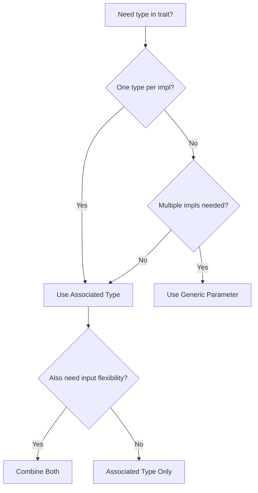

# How to Choose Between Associated Types and Generics in Rust

Author: [nawazdhandala](https://www.github.com/nawazdhandala)

Tags: Rust, Traits, Generics, Associated Types, Type System

Description: Learn when to use associated types versus generic type parameters in Rust traits. Understand the differences, trade-offs, and best practices for each approach.

---

Rust traits can define type relationships using either associated types or generic type parameters. Both achieve similar goals but have different ergonomics and use cases. This guide helps you choose the right approach.

## The Core Difference

Associated types specify a single type per implementation, while generics allow multiple implementations for different types.

```rust
// Associated type: one Output per implementation
trait Iterator {
    type Item;
    fn next(&mut self) -> Option<Self::Item>;
}

// Generic parameter: multiple implementations possible
trait Convertible<T> {
    fn convert(&self) -> T;
}
```

## Associated Types: One Type Per Implementation

Use associated types when there is exactly one logical type for each implementing type:

```rust
// Associated type example
trait Container {
    type Item;

    fn get(&self, index: usize) -> Option<&Self::Item>;
    fn len(&self) -> usize;
}

// Only one Item type per Container implementation
impl Container for Vec<i32> {
    type Item = i32;

    fn get(&self, index: usize) -> Option<&i32> {
        <[i32]>::get(self, index)
    }

    fn len(&self) -> usize {
        self.len()
    }
}

impl Container for Vec<String> {
    type Item = String;

    fn get(&self, index: usize) -> Option<&String> {
        <[String]>::get(self, index)
    }

    fn len(&self) -> usize {
        self.len()
    }
}

fn print_first<C: Container>(container: &C)
where
    C::Item: std::fmt::Display,
{
    if let Some(item) = container.get(0) {
        println!("First item: {}", item);
    }
}

fn main() {
    let numbers = vec![1, 2, 3];
    let words = vec!["hello".to_string(), "world".to_string()];

    print_first(&numbers);
    print_first(&words);
}
```

## Generic Parameters: Multiple Implementations

Use generics when a type can implement the trait multiple times with different types:

```rust
// Generic parameter example
trait From<T> {
    fn from(value: T) -> Self;
}

struct UserId(u64);

// Multiple From implementations for UserId
impl From<u64> for UserId {
    fn from(value: u64) -> Self {
        UserId(value)
    }
}

impl From<i32> for UserId {
    fn from(value: i32) -> Self {
        UserId(value as u64)
    }
}

impl From<String> for UserId {
    fn from(value: String) -> Self {
        UserId(value.parse().unwrap_or(0))
    }
}

fn main() {
    let id1 = UserId::from(42u64);
    let id2 = UserId::from(123i32);
    let id3 = UserId::from("456".to_string());

    println!("IDs: {}, {}, {}", id1.0, id2.0, id3.0);
}
```

## Comparison Table

| Aspect | Associated Types | Generic Parameters |
|--------|------------------|-------------------|
| Implementations per type | One | Multiple |
| User specifies type | No | Sometimes |
| Trait bounds | Simpler | More verbose |
| Use case | Output types | Input types |

## When Associated Types Are Better

### Cleaner Trait Bounds

```rust
// With associated types - clean
trait Graph {
    type Node;
    type Edge;

    fn nodes(&self) -> Vec<&Self::Node>;
    fn edges(&self) -> Vec<&Self::Edge>;
}

fn process_graph<G: Graph>(graph: &G) {
    // Just one type parameter
}

// With generics - verbose
trait GraphGeneric<N, E> {
    fn nodes(&self) -> Vec<&N>;
    fn edges(&self) -> Vec<&E>;
}

fn process_graph_generic<N, E, G: GraphGeneric<N, E>>(graph: &G) {
    // Three type parameters for the same thing
}
```

### Iterator Pattern

```rust
trait MyIterator {
    type Item;

    fn next(&mut self) -> Option<Self::Item>;

    // Can use Item in other methods
    fn collect_vec(mut self) -> Vec<Self::Item>
    where
        Self: Sized,
    {
        let mut result = Vec::new();
        while let Some(item) = self.next() {
            result.push(item);
        }
        result
    }
}

struct Counter {
    current: u32,
    max: u32,
}

impl MyIterator for Counter {
    type Item = u32;

    fn next(&mut self) -> Option<u32> {
        if self.current < self.max {
            self.current += 1;
            Some(self.current)
        } else {
            None
        }
    }
}

fn main() {
    let counter = Counter { current: 0, max: 5 };
    let values = counter.collect_vec();
    println!("Values: {:?}", values);
}
```

## When Generic Parameters Are Better

### Multiple Conversions

```rust
trait Convertible<T> {
    fn convert(&self) -> T;
}

struct Measurement {
    value: f64,
    unit: String,
}

impl Convertible<String> for Measurement {
    fn convert(&self) -> String {
        format!("{} {}", self.value, self.unit)
    }
}

impl Convertible<f64> for Measurement {
    fn convert(&self) -> f64 {
        self.value
    }
}

impl Convertible<i32> for Measurement {
    fn convert(&self) -> i32 {
        self.value as i32
    }
}

fn main() {
    let m = Measurement {
        value: 42.5,
        unit: "kg".to_string(),
    };

    let s: String = m.convert();
    let f: f64 = m.convert();
    let i: i32 = m.convert();

    println!("String: {}, f64: {}, i32: {}", s, f, i);
}
```

### Operator Overloading

```rust
use std::ops::Add;

#[derive(Debug, Clone, Copy)]
struct Point {
    x: f64,
    y: f64,
}

// Add Point to Point
impl Add<Point> for Point {
    type Output = Point;

    fn add(self, other: Point) -> Point {
        Point {
            x: self.x + other.x,
            y: self.y + other.y,
        }
    }
}

// Add f64 to Point (offset both coordinates)
impl Add<f64> for Point {
    type Output = Point;

    fn add(self, offset: f64) -> Point {
        Point {
            x: self.x + offset,
            y: self.y + offset,
        }
    }
}

fn main() {
    let p1 = Point { x: 1.0, y: 2.0 };
    let p2 = Point { x: 3.0, y: 4.0 };

    let sum = p1 + p2;
    println!("p1 + p2 = {:?}", sum);

    let offset = p1 + 10.0;
    println!("p1 + 10.0 = {:?}", offset);
}
```

## Combining Both Approaches

Sometimes you need both associated types and generics:

```rust
trait Transform<Input> {
    type Output;  // Associated type for output

    fn transform(&self, input: Input) -> Self::Output;
}

struct Multiplier {
    factor: i32,
}

// Transform i32 -> i32
impl Transform<i32> for Multiplier {
    type Output = i32;

    fn transform(&self, input: i32) -> i32 {
        input * self.factor
    }
}

// Transform f64 -> f64
impl Transform<f64> for Multiplier {
    type Output = f64;

    fn transform(&self, input: f64) -> f64 {
        input * self.factor as f64
    }
}

// Transform Vec<i32> -> Vec<i32>
impl Transform<Vec<i32>> for Multiplier {
    type Output = Vec<i32>;

    fn transform(&self, input: Vec<i32>) -> Vec<i32> {
        input.into_iter().map(|x| x * self.factor).collect()
    }
}

fn main() {
    let mult = Multiplier { factor: 3 };

    let result1: i32 = mult.transform(5);
    let result2: f64 = mult.transform(5.0);
    let result3: Vec<i32> = mult.transform(vec![1, 2, 3]);

    println!("i32: {}", result1);
    println!("f64: {}", result2);
    println!("Vec: {:?}", result3);
}
```

## Default Associated Types

Associated types can have defaults:

```rust
trait Builder {
    type Output = String;  // Default type

    fn build(&self) -> Self::Output;
}

struct SimpleBuilder;

impl Builder for SimpleBuilder {
    // Uses default Output = String
    fn build(&self) -> String {
        "Simple output".to_string()
    }
}

struct CustomBuilder;

impl Builder for CustomBuilder {
    type Output = Vec<u8>;  // Override default

    fn build(&self) -> Vec<u8> {
        vec![1, 2, 3]
    }
}
```

## Decision Flowchart



## Summary

**Use Associated Types when:**
- Each implementation has exactly one logical type
- The type is an output or internal detail
- You want cleaner trait bounds

**Use Generic Parameters when:**
- Multiple implementations for different types are needed
- The type is an input to the trait
- You need maximum flexibility

**Combine Both when:**
- You need input flexibility (generic) with deterministic output (associated)

Choose associated types as your default for output types, and reach for generics when you need multiple implementations of the same trait for different type combinations.
