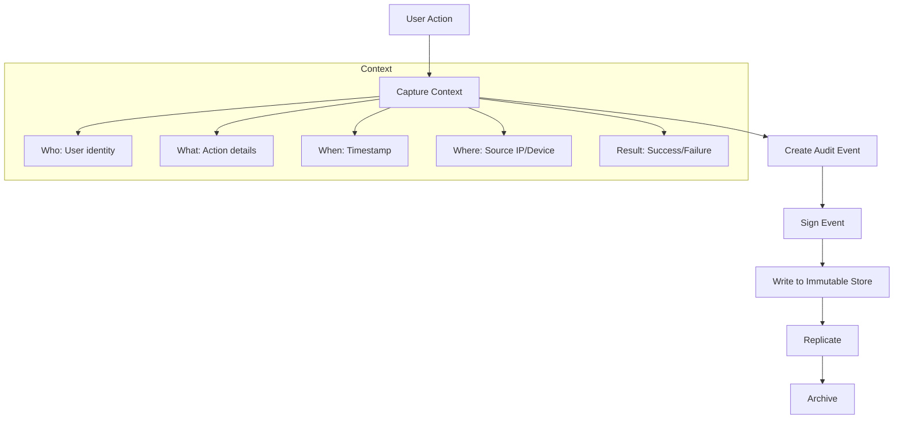

# How to Implement Audit Logging

Author: [nawazdhandala](https://www.github.com/nawazdhandala)

Tags: Audit Logging, Compliance, Security, SOC2, GDPR, HIPAA, Log Management, Governance

Description: Learn how to implement comprehensive audit logging for compliance and security requirements. This guide covers what to log, how to structure audit events, tamper protection, and meeting regulatory requirements.

---

> Audit logging creates an immutable record of who did what, when, and from where. Unlike operational logs that help debug issues, audit logs serve as legal evidence and are often required by regulations like SOC2, HIPAA, and GDPR.

When regulators ask "Can you prove user X never accessed patient Y's records?", your audit logs need to provide a definitive answer. This requires a different approach than typical application logging.

---

## What Makes Audit Logs Different

Audit logs have specific requirements that set them apart from operational logs:

**Immutability**: Once written, audit records cannot be modified or deleted (except through defined retention policies).

**Completeness**: Every relevant action must be logged, with no gaps.

**Non-repudiation**: Logs must prove who performed an action, making it impossible to deny.

**Tamper Evidence**: Any attempt to modify logs must be detectable.

**Long Retention**: Audit logs often must be kept for years, not days.



---

## Designing Audit Event Structure

Create a comprehensive audit event schema:

```typescript
// audit/types.ts
// Audit event type definitions

interface AuditEvent {
  // Unique identifier for this event
  eventId: string;

  // Timestamp in ISO 8601 format with milliseconds
  timestamp: string;

  // Event classification
  eventType: AuditEventType;
  eventCategory: AuditCategory;

  // Actor information (who performed the action)
  actor: {
    userId: string;
    username: string;
    email: string;
    userType: 'user' | 'service' | 'system';
    roles: string[];
    sessionId?: string;
  };

  // Source information (where the action originated)
  source: {
    ipAddress: string;
    userAgent?: string;
    deviceId?: string;
    geoLocation?: {
      country: string;
      region: string;
      city: string;
    };
    application: string;
    applicationVersion: string;
  };

  // Target information (what was acted upon)
  target?: {
    resourceType: string;
    resourceId: string;
    resourceName?: string;
    ownerId?: string;
  };

  // Action details
  action: {
    name: string;
    method: string;
    endpoint?: string;
    parameters?: Record<string, unknown>;
  };

  // Result of the action
  result: {
    status: 'success' | 'failure' | 'partial';
    errorCode?: string;
    errorMessage?: string;
    duration_ms?: number;
  };

  // Change tracking for modifications
  changes?: {
    before: Record<string, unknown>;
    after: Record<string, unknown>;
  };

  // Additional context
  metadata: {
    correlationId: string;
    requestId: string;
    environment: string;
    version: string;
  };

  // Integrity verification
  integrity: {
    signature: string;
    algorithm: string;
    previousEventHash?: string;
  };
}

enum AuditEventType {
  // Authentication events
  LOGIN = 'auth.login',
  LOGOUT = 'auth.logout',
  LOGIN_FAILED = 'auth.login_failed',
  PASSWORD_CHANGED = 'auth.password_changed',
  MFA_ENABLED = 'auth.mfa_enabled',
  MFA_DISABLED = 'auth.mfa_disabled',

  // Data access events
  DATA_READ = 'data.read',
  DATA_CREATED = 'data.created',
  DATA_UPDATED = 'data.updated',
  DATA_DELETED = 'data.deleted',
  DATA_EXPORTED = 'data.exported',

  // Permission events
  PERMISSION_GRANTED = 'permission.granted',
  PERMISSION_REVOKED = 'permission.revoked',
  ROLE_ASSIGNED = 'permission.role_assigned',
  ROLE_REMOVED = 'permission.role_removed',

  // Administrative events
  CONFIG_CHANGED = 'admin.config_changed',
  USER_CREATED = 'admin.user_created',
  USER_DELETED = 'admin.user_deleted',
  SYSTEM_STARTED = 'admin.system_started',
  SYSTEM_SHUTDOWN = 'admin.system_shutdown',

  // Security events
  SECURITY_ALERT = 'security.alert',
  ACCESS_DENIED = 'security.access_denied',
  SUSPICIOUS_ACTIVITY = 'security.suspicious_activity'
}

enum AuditCategory {
  AUTHENTICATION = 'authentication',
  AUTHORIZATION = 'authorization',
  DATA_ACCESS = 'data_access',
  DATA_MODIFICATION = 'data_modification',
  SYSTEM_ADMIN = 'system_admin',
  SECURITY = 'security'
}
```

---

## Implementing the Audit Logger

Build a secure audit logging service:

```typescript
// audit/audit-logger.ts
// Secure audit logging implementation

import crypto from 'crypto';

interface AuditLoggerConfig {
  serviceName: string;
  environment: string;
  signingKey: string;
  storage: AuditStorage;
}

class AuditLogger {
  private config: AuditLoggerConfig;
  private lastEventHash: string | null = null;

  constructor(config: AuditLoggerConfig) {
    this.config = config;
  }

  async log(event: Omit<AuditEvent, 'eventId' | 'timestamp' | 'integrity' | 'metadata'>): Promise<string> {
    const eventId = this.generateEventId();
    const timestamp = new Date().toISOString();

    const fullEvent: AuditEvent = {
      eventId,
      timestamp,
      ...event,
      metadata: {
        correlationId: event.metadata?.correlationId || eventId,
        requestId: event.metadata?.requestId || eventId,
        environment: this.config.environment,
        version: '1.0'
      },
      integrity: {
        signature: '',
        algorithm: 'hmac-sha256',
        previousEventHash: this.lastEventHash || undefined
      }
    };

    // Calculate signature
    fullEvent.integrity.signature = this.signEvent(fullEvent);

    // Update hash chain
    this.lastEventHash = this.hashEvent(fullEvent);

    // Store event
    await this.config.storage.write(fullEvent);

    return eventId;
  }

  private generateEventId(): string {
    return `audit_${Date.now()}_${crypto.randomBytes(8).toString('hex')}`;
  }

  private signEvent(event: AuditEvent): string {
    // Create signature excluding the signature field itself
    const eventCopy = { ...event };
    eventCopy.integrity = { ...event.integrity, signature: '' };

    const payload = JSON.stringify(eventCopy, Object.keys(eventCopy).sort());
    const hmac = crypto.createHmac('sha256', this.config.signingKey);
    hmac.update(payload);
    return hmac.digest('hex');
  }

  private hashEvent(event: AuditEvent): string {
    const payload = JSON.stringify(event);
    return crypto.createHash('sha256').update(payload).digest('hex');
  }

  // Verify event integrity
  verifyEvent(event: AuditEvent): boolean {
    const expectedSignature = this.signEvent(event);
    return crypto.timingSafeEqual(
      Buffer.from(event.integrity.signature),
      Buffer.from(expectedSignature)
    );
  }

  // Convenience methods for common events
  async logAuthentication(
    actor: AuditEvent['actor'],
    source: AuditEvent['source'],
    success: boolean,
    errorMessage?: string
  ): Promise<string> {
    return this.log({
      eventType: success ? AuditEventType.LOGIN : AuditEventType.LOGIN_FAILED,
      eventCategory: AuditCategory.AUTHENTICATION,
      actor,
      source,
      action: {
        name: 'authenticate',
        method: 'POST',
        endpoint: '/auth/login'
      },
      result: {
        status: success ? 'success' : 'failure',
        errorMessage
      }
    });
  }

  async logDataAccess(
    actor: AuditEvent['actor'],
    source: AuditEvent['source'],
    target: AuditEvent['target'],
    action: 'read' | 'create' | 'update' | 'delete',
    changes?: AuditEvent['changes']
  ): Promise<string> {
    const eventTypeMap = {
      read: AuditEventType.DATA_READ,
      create: AuditEventType.DATA_CREATED,
      update: AuditEventType.DATA_UPDATED,
      delete: AuditEventType.DATA_DELETED
    };

    return this.log({
      eventType: eventTypeMap[action],
      eventCategory: action === 'read' ? AuditCategory.DATA_ACCESS : AuditCategory.DATA_MODIFICATION,
      actor,
      source,
      target,
      action: {
        name: action,
        method: action === 'read' ? 'GET' : action === 'create' ? 'POST' : action === 'update' ? 'PUT' : 'DELETE'
      },
      result: { status: 'success' },
      changes
    });
  }

  async logPermissionChange(
    actor: AuditEvent['actor'],
    source: AuditEvent['source'],
    targetUser: string,
    permission: string,
    granted: boolean
  ): Promise<string> {
    return this.log({
      eventType: granted ? AuditEventType.PERMISSION_GRANTED : AuditEventType.PERMISSION_REVOKED,
      eventCategory: AuditCategory.AUTHORIZATION,
      actor,
      source,
      target: {
        resourceType: 'user',
        resourceId: targetUser,
        resourceName: permission
      },
      action: {
        name: granted ? 'grant_permission' : 'revoke_permission',
        method: granted ? 'POST' : 'DELETE',
        parameters: { permission }
      },
      result: { status: 'success' }
    });
  }
}
```

---

## Express Middleware Integration

Automatically capture audit events from HTTP requests:

```typescript
// audit/middleware.ts
// Express middleware for automatic audit logging

import { Request, Response, NextFunction } from 'express';

interface AuditMiddlewareConfig {
  auditLogger: AuditLogger;
  // Routes that require audit logging
  auditedRoutes: AuditRouteConfig[];
  // Function to extract actor from request
  actorExtractor: (req: Request) => AuditEvent['actor'];
}

interface AuditRouteConfig {
  pathPattern: RegExp;
  methods: string[];
  eventType: AuditEventType;
  eventCategory: AuditCategory;
  resourceTypeExtractor?: (req: Request) => string;
  resourceIdExtractor?: (req: Request) => string;
  captureRequestBody?: boolean;
  captureResponseBody?: boolean;
}

function createAuditMiddleware(config: AuditMiddlewareConfig) {
  return async (req: Request, res: Response, next: NextFunction) => {
    // Find matching route config
    const routeConfig = config.auditedRoutes.find(
      route => route.pathPattern.test(req.path) && route.methods.includes(req.method)
    );

    if (!routeConfig) {
      return next();
    }

    const startTime = Date.now();
    const requestBody = routeConfig.captureRequestBody ? { ...req.body } : undefined;

    // Capture response
    const originalJson = res.json.bind(res);
    let responseBody: unknown;

    res.json = (body: unknown) => {
      responseBody = routeConfig.captureResponseBody ? body : undefined;
      return originalJson(body);
    };

    res.on('finish', async () => {
      const duration = Date.now() - startTime;

      try {
        const actor = config.actorExtractor(req);

        await config.auditLogger.log({
          eventType: routeConfig.eventType,
          eventCategory: routeConfig.eventCategory,
          actor,
          source: {
            ipAddress: req.ip || req.socket.remoteAddress || 'unknown',
            userAgent: req.get('user-agent'),
            application: 'web-api',
            applicationVersion: process.env.APP_VERSION || '1.0.0'
          },
          target: routeConfig.resourceIdExtractor ? {
            resourceType: routeConfig.resourceTypeExtractor?.(req) || 'unknown',
            resourceId: routeConfig.resourceIdExtractor(req)
          } : undefined,
          action: {
            name: req.method.toLowerCase(),
            method: req.method,
            endpoint: req.path,
            parameters: requestBody
          },
          result: {
            status: res.statusCode < 400 ? 'success' : 'failure',
            duration_ms: duration
          }
        });
      } catch (error) {
        console.error('Failed to write audit log:', error);
        // Don't fail the request if audit logging fails
        // But do alert on this
      }
    });

    next();
  };
}

// Usage example
const auditMiddleware = createAuditMiddleware({
  auditLogger,
  actorExtractor: (req) => ({
    userId: req.user?.id || 'anonymous',
    username: req.user?.username || 'anonymous',
    email: req.user?.email || '',
    userType: req.user ? 'user' : 'system',
    roles: req.user?.roles || [],
    sessionId: req.session?.id
  }),
  auditedRoutes: [
    {
      pathPattern: /^\/api\/users/,
      methods: ['POST', 'PUT', 'DELETE'],
      eventType: AuditEventType.DATA_UPDATED,
      eventCategory: AuditCategory.DATA_MODIFICATION,
      resourceTypeExtractor: () => 'user',
      resourceIdExtractor: (req) => req.params.userId,
      captureRequestBody: true
    },
    {
      pathPattern: /^\/api\/patients\/\w+\/records/,
      methods: ['GET'],
      eventType: AuditEventType.DATA_READ,
      eventCategory: AuditCategory.DATA_ACCESS,
      resourceTypeExtractor: () => 'patient_record',
      resourceIdExtractor: (req) => req.params.patientId
    }
  ]
});
```

---

## Tamper-Proof Storage

Implement storage that prevents tampering:

```typescript
// audit/storage.ts
// Tamper-proof audit storage implementations

interface AuditStorage {
  write(event: AuditEvent): Promise<void>;
  read(eventId: string): Promise<AuditEvent | null>;
  query(filters: AuditQueryFilters): Promise<AuditEvent[]>;
  verifyIntegrity(startEventId: string, endEventId: string): Promise<boolean>;
}

// Append-only file storage with hash chain
class AppendOnlyFileStorage implements AuditStorage {
  private filePath: string;
  private hashChain: Map<string, string> = new Map();

  constructor(filePath: string) {
    this.filePath = filePath;
  }

  async write(event: AuditEvent): Promise<void> {
    // Format as newline-delimited JSON
    const line = JSON.stringify(event) + '\n';

    // Append to file (atomic on most filesystems)
    await fs.promises.appendFile(this.filePath, line, { flag: 'a' });

    // Update hash chain
    const eventHash = crypto.createHash('sha256')
      .update(JSON.stringify(event))
      .digest('hex');
    this.hashChain.set(event.eventId, eventHash);
  }

  async verifyIntegrity(startEventId: string, endEventId: string): Promise<boolean> {
    const events = await this.readRange(startEventId, endEventId);

    let previousHash: string | null = null;

    for (const event of events) {
      // Verify signature
      const auditLogger = new AuditLogger({ /* config */ });
      if (!auditLogger.verifyEvent(event)) {
        console.error(`Invalid signature for event ${event.eventId}`);
        return false;
      }

      // Verify hash chain
      if (previousHash && event.integrity.previousEventHash !== previousHash) {
        console.error(`Hash chain broken at event ${event.eventId}`);
        return false;
      }

      previousHash = crypto.createHash('sha256')
        .update(JSON.stringify(event))
        .digest('hex');
    }

    return true;
  }
}

// AWS S3 with Object Lock for immutability
class S3ImmutableStorage implements AuditStorage {
  private s3: AWS.S3;
  private bucket: string;

  constructor(bucket: string) {
    this.s3 = new AWS.S3();
    this.bucket = bucket;
  }

  async write(event: AuditEvent): Promise<void> {
    const key = `audit/${event.timestamp.slice(0, 10)}/${event.eventId}.json`;

    await this.s3.putObject({
      Bucket: this.bucket,
      Key: key,
      Body: JSON.stringify(event),
      ContentType: 'application/json',
      // Enable Object Lock for immutability
      ObjectLockMode: 'COMPLIANCE',
      ObjectLockRetainUntilDate: this.calculateRetentionDate()
    }).promise();
  }

  private calculateRetentionDate(): Date {
    // Retain for 7 years (common compliance requirement)
    const date = new Date();
    date.setFullYear(date.getFullYear() + 7);
    return date;
  }
}

// Database storage with triggers to prevent modification
class PostgresAuditStorage implements AuditStorage {
  private pool: Pool;

  async initialize(): Promise<void> {
    // Create table with triggers to prevent UPDATE/DELETE
    await this.pool.query(`
      CREATE TABLE IF NOT EXISTS audit_events (
        event_id VARCHAR(64) PRIMARY KEY,
        timestamp TIMESTAMPTZ NOT NULL,
        event_type VARCHAR(64) NOT NULL,
        event_category VARCHAR(32) NOT NULL,
        actor JSONB NOT NULL,
        source JSONB NOT NULL,
        target JSONB,
        action JSONB NOT NULL,
        result JSONB NOT NULL,
        changes JSONB,
        metadata JSONB NOT NULL,
        integrity JSONB NOT NULL,
        created_at TIMESTAMPTZ DEFAULT NOW()
      );

      -- Create index for common queries
      CREATE INDEX IF NOT EXISTS idx_audit_timestamp ON audit_events(timestamp);
      CREATE INDEX IF NOT EXISTS idx_audit_actor ON audit_events((actor->>'userId'));
      CREATE INDEX IF NOT EXISTS idx_audit_type ON audit_events(event_type);

      -- Prevent updates
      CREATE OR REPLACE FUNCTION prevent_audit_update()
      RETURNS TRIGGER AS $$
      BEGIN
        RAISE EXCEPTION 'Audit records cannot be modified';
      END;
      $$ LANGUAGE plpgsql;

      DROP TRIGGER IF EXISTS prevent_audit_update ON audit_events;
      CREATE TRIGGER prevent_audit_update
        BEFORE UPDATE ON audit_events
        FOR EACH ROW
        EXECUTE FUNCTION prevent_audit_update();

      -- Prevent deletes (except by retention policy)
      CREATE OR REPLACE FUNCTION prevent_audit_delete()
      RETURNS TRIGGER AS $$
      BEGIN
        IF NOT current_setting('audit.retention_cleanup', true)::boolean THEN
          RAISE EXCEPTION 'Audit records cannot be deleted';
        END IF;
        RETURN OLD;
      END;
      $$ LANGUAGE plpgsql;

      DROP TRIGGER IF EXISTS prevent_audit_delete ON audit_events;
      CREATE TRIGGER prevent_audit_delete
        BEFORE DELETE ON audit_events
        FOR EACH ROW
        EXECUTE FUNCTION prevent_audit_delete();
    `);
  }

  async write(event: AuditEvent): Promise<void> {
    await this.pool.query(`
      INSERT INTO audit_events (
        event_id, timestamp, event_type, event_category,
        actor, source, target, action, result, changes,
        metadata, integrity
      ) VALUES ($1, $2, $3, $4, $5, $6, $7, $8, $9, $10, $11, $12)
    `, [
      event.eventId,
      event.timestamp,
      event.eventType,
      event.eventCategory,
      JSON.stringify(event.actor),
      JSON.stringify(event.source),
      JSON.stringify(event.target),
      JSON.stringify(event.action),
      JSON.stringify(event.result),
      JSON.stringify(event.changes),
      JSON.stringify(event.metadata),
      JSON.stringify(event.integrity)
    ]);
  }
}
```

---

## Querying Audit Logs

Provide interfaces for compliance queries:

```typescript
// audit/query.ts
// Audit log query interface

interface AuditQueryFilters {
  startTime?: Date;
  endTime?: Date;
  actorUserId?: string;
  eventTypes?: AuditEventType[];
  categories?: AuditCategory[];
  targetResourceType?: string;
  targetResourceId?: string;
  sourceIpAddress?: string;
  resultStatus?: 'success' | 'failure';
}

class AuditQueryService {
  private storage: AuditStorage;

  constructor(storage: AuditStorage) {
    this.storage = storage;
  }

  // Who accessed this resource?
  async getResourceAccessHistory(
    resourceType: string,
    resourceId: string,
    timeRange: { start: Date; end: Date }
  ): Promise<AuditEvent[]> {
    return this.storage.query({
      targetResourceType: resourceType,
      targetResourceId: resourceId,
      startTime: timeRange.start,
      endTime: timeRange.end,
      eventTypes: [AuditEventType.DATA_READ, AuditEventType.DATA_UPDATED]
    });
  }

  // What did this user do?
  async getUserActivityHistory(
    userId: string,
    timeRange: { start: Date; end: Date }
  ): Promise<AuditEvent[]> {
    return this.storage.query({
      actorUserId: userId,
      startTime: timeRange.start,
      endTime: timeRange.end
    });
  }

  // Failed login attempts
  async getFailedLoginAttempts(
    timeRange: { start: Date; end: Date },
    ipAddress?: string
  ): Promise<AuditEvent[]> {
    return this.storage.query({
      eventTypes: [AuditEventType.LOGIN_FAILED],
      startTime: timeRange.start,
      endTime: timeRange.end,
      sourceIpAddress: ipAddress
    });
  }

  // Generate compliance report
  async generateComplianceReport(
    timeRange: { start: Date; end: Date }
  ): Promise<ComplianceReport> {
    const events = await this.storage.query({
      startTime: timeRange.start,
      endTime: timeRange.end
    });

    return {
      period: timeRange,
      totalEvents: events.length,
      eventsByCategory: this.groupBy(events, e => e.eventCategory),
      eventsByType: this.groupBy(events, e => e.eventType),
      uniqueUsers: new Set(events.map(e => e.actor.userId)).size,
      failedActions: events.filter(e => e.result.status === 'failure').length,
      dataAccessEvents: events.filter(e => e.eventCategory === AuditCategory.DATA_ACCESS).length,
      securityEvents: events.filter(e => e.eventCategory === AuditCategory.SECURITY).length
    };
  }

  private groupBy<T, K extends string>(items: T[], keyFn: (item: T) => K): Record<K, number> {
    return items.reduce((acc, item) => {
      const key = keyFn(item);
      acc[key] = (acc[key] || 0) + 1;
      return acc;
    }, {} as Record<K, number>);
  }
}
```

---

## Summary

Effective audit logging requires careful attention to:

1. **Complete capture**: Log all relevant actions with full context
2. **Immutability**: Prevent modification after writing
3. **Integrity verification**: Detect tampering through signatures and hash chains
4. **Long retention**: Keep logs for compliance periods (often 7+ years)
5. **Efficient querying**: Support common compliance queries

Remember that audit logs are not just for compliance auditors. They are valuable for security investigations, debugging access issues, and understanding system usage patterns.

---

*Need audit logging that meets compliance requirements out of the box? [OneUptime](https://oneuptime.com) provides built-in audit trails with tamper-proof storage, compliance reporting, and integrations with your existing identity providers.*
