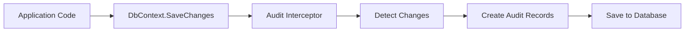

# How to Implement Audit Logs with EF Core Interceptors

Author: [nawazdhandala](https://www.github.com/nawazdhandala)

Tags: .NET, C#, Entity Framework Core, Audit Logs, Database

Description: Learn how to implement automatic audit logging in your .NET applications using Entity Framework Core interceptors to track data changes, user actions, and maintain compliance.

---

Audit logging is a critical requirement for many applications, especially in regulated industries like healthcare, finance, and government. You need to track who changed what data and when. Entity Framework Core interceptors provide an elegant way to automatically capture these changes without cluttering your business logic.

## Why EF Core Interceptors?

Interceptors let you hook into EF Core operations at various points in the pipeline. For audit logging, we intercept the SaveChanges operation to capture entity changes before they hit the database. This approach keeps audit logic separate from business logic and works automatically for all entities.



## Setting Up the Audit Log Entity

First, define what information you want to capture in your audit logs.

```csharp
// AuditLog.cs
public class AuditLog
{
    public long Id { get; set; }

    // What table/entity was modified
    public string EntityName { get; set; } = string.Empty;

    // The primary key of the modified entity
    public string EntityId { get; set; } = string.Empty;

    // Insert, Update, or Delete
    public string Action { get; set; } = string.Empty;

    // Who made the change
    public string? UserId { get; set; }
    public string? UserName { get; set; }

    // When the change occurred
    public DateTime Timestamp { get; set; }

    // JSON representation of old values (for updates and deletes)
    public string? OldValues { get; set; }

    // JSON representation of new values (for inserts and updates)
    public string? NewValues { get; set; }

    // Which properties changed (for updates)
    public string? ChangedProperties { get; set; }

    // Additional context (IP address, correlation ID, etc.)
    public string? AdditionalData { get; set; }
}
```

## Creating the Audit Interceptor

The interceptor hooks into SaveChanges to detect and record entity changes.

```csharp
// AuditSaveChangesInterceptor.cs
using Microsoft.EntityFrameworkCore;
using Microsoft.EntityFrameworkCore.ChangeTracking;
using Microsoft.EntityFrameworkCore.Diagnostics;
using System.Text.Json;

public class AuditSaveChangesInterceptor : SaveChangesInterceptor
{
    private readonly ICurrentUserService _currentUserService;
    private readonly TimeProvider _timeProvider;

    public AuditSaveChangesInterceptor(
        ICurrentUserService currentUserService,
        TimeProvider timeProvider)
    {
        _currentUserService = currentUserService;
        _timeProvider = timeProvider;
    }

    // Called before SaveChanges executes
    public override InterceptionResult<int> SavingChanges(
        DbContextEventData eventData,
        InterceptionResult<int> result)
    {
        if (eventData.Context is not null)
        {
            OnBeforeSaveChanges(eventData.Context);
        }

        return base.SavingChanges(eventData, result);
    }

    // Called before SaveChangesAsync executes
    public override ValueTask<InterceptionResult<int>> SavingChangesAsync(
        DbContextEventData eventData,
        InterceptionResult<int> result,
        CancellationToken cancellationToken = default)
    {
        if (eventData.Context is not null)
        {
            OnBeforeSaveChanges(eventData.Context);
        }

        return base.SavingChangesAsync(eventData, result, cancellationToken);
    }

    private void OnBeforeSaveChanges(DbContext context)
    {
        // Force detection of changes
        context.ChangeTracker.DetectChanges();

        var auditEntries = new List<AuditEntry>();
        var timestamp = _timeProvider.GetUtcNow().DateTime;

        foreach (var entry in context.ChangeTracker.Entries())
        {
            // Skip entities that should not be audited
            if (entry.Entity is AuditLog ||
                entry.State == EntityState.Detached ||
                entry.State == EntityState.Unchanged)
            {
                continue;
            }

            // Check if entity has the NoAudit attribute
            if (entry.Entity.GetType().GetCustomAttribute<NoAuditAttribute>() != null)
            {
                continue;
            }

            var auditEntry = new AuditEntry
            {
                EntityName = entry.Entity.GetType().Name,
                Action = entry.State.ToString(),
                UserId = _currentUserService.UserId,
                UserName = _currentUserService.UserName,
                Timestamp = timestamp
            };

            // Get the primary key value
            auditEntry.EntityId = GetPrimaryKeyValue(entry);

            // Capture property changes based on the operation type
            foreach (var property in entry.Properties)
            {
                // Skip properties marked with NoAudit attribute
                if (property.Metadata.PropertyInfo?
                    .GetCustomAttribute<NoAuditAttribute>() != null)
                {
                    continue;
                }

                var propertyName = property.Metadata.Name;

                switch (entry.State)
                {
                    case EntityState.Added:
                        auditEntry.NewValues[propertyName] = property.CurrentValue;
                        break;

                    case EntityState.Deleted:
                        auditEntry.OldValues[propertyName] = property.OriginalValue;
                        break;

                    case EntityState.Modified:
                        if (property.IsModified)
                        {
                            auditEntry.OldValues[propertyName] = property.OriginalValue;
                            auditEntry.NewValues[propertyName] = property.CurrentValue;
                            auditEntry.ChangedProperties.Add(propertyName);
                        }
                        break;
                }
            }

            auditEntries.Add(auditEntry);
        }

        // Add audit log records to the context
        foreach (var auditEntry in auditEntries)
        {
            context.Set<AuditLog>().Add(auditEntry.ToAuditLog());
        }
    }

    private static string GetPrimaryKeyValue(EntityEntry entry)
    {
        var keyProperties = entry.Metadata.FindPrimaryKey()?.Properties;

        if (keyProperties == null || !keyProperties.Any())
        {
            return "Unknown";
        }

        var keyValues = keyProperties
            .Select(p => entry.Property(p.Name).CurrentValue?.ToString() ?? "null")
            .ToArray();

        return string.Join(",", keyValues);
    }
}

// Helper class to build audit entries
internal class AuditEntry
{
    public string EntityName { get; set; } = string.Empty;
    public string EntityId { get; set; } = string.Empty;
    public string Action { get; set; } = string.Empty;
    public string? UserId { get; set; }
    public string? UserName { get; set; }
    public DateTime Timestamp { get; set; }
    public Dictionary<string, object?> OldValues { get; } = new();
    public Dictionary<string, object?> NewValues { get; } = new();
    public List<string> ChangedProperties { get; } = new();

    public AuditLog ToAuditLog()
    {
        return new AuditLog
        {
            EntityName = EntityName,
            EntityId = EntityId,
            Action = Action,
            UserId = UserId,
            UserName = UserName,
            Timestamp = Timestamp,
            OldValues = OldValues.Count > 0
                ? JsonSerializer.Serialize(OldValues)
                : null,
            NewValues = NewValues.Count > 0
                ? JsonSerializer.Serialize(NewValues)
                : null,
            ChangedProperties = ChangedProperties.Count > 0
                ? string.Join(",", ChangedProperties)
                : null
        };
    }
}
```

## Excluding Entities and Properties from Auditing

Use attributes to mark entities or properties that should not be audited.

```csharp
// NoAuditAttribute.cs
[AttributeUsage(AttributeTargets.Class | AttributeTargets.Property)]
public class NoAuditAttribute : Attribute
{
}

// Example usage on an entity
[NoAudit]  // This entire entity will not be audited
public class TemporaryCache
{
    public int Id { get; set; }
    public string Data { get; set; } = string.Empty;
}

// Example usage on a property
public class User
{
    public int Id { get; set; }
    public string Name { get; set; } = string.Empty;

    [NoAudit]  // Password hash will not appear in audit logs
    public string PasswordHash { get; set; } = string.Empty;

    [NoAudit]  // Sensitive data excluded
    public string SocialSecurityNumber { get; set; } = string.Empty;
}
```

## Current User Service

The interceptor needs to know who is making the changes. Implement a service that extracts user information from the current HTTP context.

```csharp
// ICurrentUserService.cs
public interface ICurrentUserService
{
    string? UserId { get; }
    string? UserName { get; }
    string? IpAddress { get; }
}

// CurrentUserService.cs
public class CurrentUserService : ICurrentUserService
{
    private readonly IHttpContextAccessor _httpContextAccessor;

    public CurrentUserService(IHttpContextAccessor httpContextAccessor)
    {
        _httpContextAccessor = httpContextAccessor;
    }

    public string? UserId =>
        _httpContextAccessor.HttpContext?.User?.FindFirst("sub")?.Value
        ?? _httpContextAccessor.HttpContext?.User?.FindFirst(ClaimTypes.NameIdentifier)?.Value;

    public string? UserName =>
        _httpContextAccessor.HttpContext?.User?.FindFirst("name")?.Value
        ?? _httpContextAccessor.HttpContext?.User?.Identity?.Name;

    public string? IpAddress =>
        _httpContextAccessor.HttpContext?.Connection?.RemoteIpAddress?.ToString();
}
```

## Registering the Interceptor

Configure the interceptor in your application startup.

```csharp
// Program.cs
var builder = WebApplication.CreateBuilder(args);

// Register services
builder.Services.AddHttpContextAccessor();
builder.Services.AddScoped<ICurrentUserService, CurrentUserService>();
builder.Services.AddSingleton(TimeProvider.System);

// Register the interceptor
builder.Services.AddScoped<AuditSaveChangesInterceptor>();

// Configure DbContext with the interceptor
builder.Services.AddDbContext<ApplicationDbContext>((serviceProvider, options) =>
{
    options.UseSqlServer(builder.Configuration.GetConnectionString("Default"));

    // Add the audit interceptor
    var auditInterceptor = serviceProvider
        .GetRequiredService<AuditSaveChangesInterceptor>();
    options.AddInterceptors(auditInterceptor);
});
```

## Querying Audit Logs

Create a service to query audit logs with filtering and pagination.

```csharp
// AuditLogService.cs
public class AuditLogService
{
    private readonly ApplicationDbContext _context;

    public AuditLogService(ApplicationDbContext context)
    {
        _context = context;
    }

    public async Task<PagedResult<AuditLog>> GetAuditLogsAsync(
        AuditLogQuery query,
        CancellationToken cancellationToken = default)
    {
        var queryable = _context.AuditLogs.AsQueryable();

        // Filter by entity name
        if (!string.IsNullOrEmpty(query.EntityName))
        {
            queryable = queryable.Where(a => a.EntityName == query.EntityName);
        }

        // Filter by entity ID
        if (!string.IsNullOrEmpty(query.EntityId))
        {
            queryable = queryable.Where(a => a.EntityId == query.EntityId);
        }

        // Filter by user
        if (!string.IsNullOrEmpty(query.UserId))
        {
            queryable = queryable.Where(a => a.UserId == query.UserId);
        }

        // Filter by action type
        if (!string.IsNullOrEmpty(query.Action))
        {
            queryable = queryable.Where(a => a.Action == query.Action);
        }

        // Filter by date range
        if (query.FromDate.HasValue)
        {
            queryable = queryable.Where(a => a.Timestamp >= query.FromDate.Value);
        }

        if (query.ToDate.HasValue)
        {
            queryable = queryable.Where(a => a.Timestamp <= query.ToDate.Value);
        }

        // Get total count for pagination
        var totalCount = await queryable.CountAsync(cancellationToken);

        // Apply ordering and pagination
        var items = await queryable
            .OrderByDescending(a => a.Timestamp)
            .Skip((query.Page - 1) * query.PageSize)
            .Take(query.PageSize)
            .ToListAsync(cancellationToken);

        return new PagedResult<AuditLog>
        {
            Items = items,
            TotalCount = totalCount,
            Page = query.Page,
            PageSize = query.PageSize
        };
    }

    // Get the complete history of changes for a specific entity
    public async Task<List<AuditLog>> GetEntityHistoryAsync(
        string entityName,
        string entityId,
        CancellationToken cancellationToken = default)
    {
        return await _context.AuditLogs
            .Where(a => a.EntityName == entityName && a.EntityId == entityId)
            .OrderByDescending(a => a.Timestamp)
            .ToListAsync(cancellationToken);
    }
}

public class AuditLogQuery
{
    public string? EntityName { get; set; }
    public string? EntityId { get; set; }
    public string? UserId { get; set; }
    public string? Action { get; set; }
    public DateTime? FromDate { get; set; }
    public DateTime? ToDate { get; set; }
    public int Page { get; set; } = 1;
    public int PageSize { get; set; } = 50;
}
```

## Handling Soft Deletes

If your application uses soft deletes instead of hard deletes, handle them appropriately in the interceptor.

```csharp
// ISoftDeletable.cs
public interface ISoftDeletable
{
    bool IsDeleted { get; set; }
    DateTime? DeletedAt { get; set; }
    string? DeletedBy { get; set; }
}

// Modify the interceptor to detect soft deletes
private void OnBeforeSaveChanges(DbContext context)
{
    context.ChangeTracker.DetectChanges();

    foreach (var entry in context.ChangeTracker.Entries())
    {
        // Detect soft deletes (entity modified with IsDeleted = true)
        if (entry.State == EntityState.Modified &&
            entry.Entity is ISoftDeletable softDeletable)
        {
            var isDeletedProperty = entry.Property(nameof(ISoftDeletable.IsDeleted));

            if (isDeletedProperty.IsModified &&
                (bool)isDeletedProperty.CurrentValue! == true &&
                (bool)isDeletedProperty.OriginalValue! == false)
            {
                // This is a soft delete - record it as a Delete action
                // instead of an Update
                var auditEntry = CreateAuditEntry(entry, "SoftDelete");
                // Add audit entry...
            }
        }
    }
}
```

## Performance Considerations

Audit logging adds overhead to every save operation. Here are some tips to minimize impact:

```csharp
// 1. Use a separate DbContext for audit writes (optional)
public class AuditDbContext : DbContext
{
    public DbSet<AuditLog> AuditLogs => Set<AuditLog>();

    // Configure with minimal tracking for better performance
    protected override void OnConfiguring(DbContextOptionsBuilder optionsBuilder)
    {
        optionsBuilder.UseQueryTrackingBehavior(QueryTrackingBehavior.NoTracking);
    }
}

// 2. Batch audit writes asynchronously (for high-throughput systems)
public class AsyncAuditWriter
{
    private readonly Channel<AuditLog> _channel;
    private readonly IServiceScopeFactory _scopeFactory;

    public AsyncAuditWriter(IServiceScopeFactory scopeFactory)
    {
        _scopeFactory = scopeFactory;
        _channel = Channel.CreateBounded<AuditLog>(
            new BoundedChannelOptions(10000)
            {
                FullMode = BoundedChannelFullMode.Wait
            });

        // Start background writer
        _ = Task.Run(ProcessAuditLogsAsync);
    }

    public async Task QueueAuditLogAsync(AuditLog auditLog)
    {
        await _channel.Writer.WriteAsync(auditLog);
    }

    private async Task ProcessAuditLogsAsync()
    {
        var batch = new List<AuditLog>();

        await foreach (var log in _channel.Reader.ReadAllAsync())
        {
            batch.Add(log);

            // Write in batches of 100 or when channel is empty
            if (batch.Count >= 100 || !_channel.Reader.TryPeek(out _))
            {
                await WriteBatchAsync(batch);
                batch.Clear();
            }
        }
    }

    private async Task WriteBatchAsync(List<AuditLog> batch)
    {
        using var scope = _scopeFactory.CreateScope();
        var context = scope.ServiceProvider.GetRequiredService<AuditDbContext>();

        context.AuditLogs.AddRange(batch);
        await context.SaveChangesAsync();
    }
}
```

## Summary

EF Core interceptors provide a clean way to implement audit logging without polluting your business logic:

| Feature | Implementation |
|---------|----------------|
| Change detection | SaveChangesInterceptor |
| User tracking | ICurrentUserService with HttpContext |
| Selective auditing | NoAuditAttribute |
| Property changes | Track OldValues and NewValues |
| Soft deletes | Detect IsDeleted changes |
| Performance | Async batch writes |

Audit logs are essential for compliance, debugging, and security. With EF Core interceptors, you get automatic, consistent audit logging across your entire application with minimal code changes to your existing entities.
