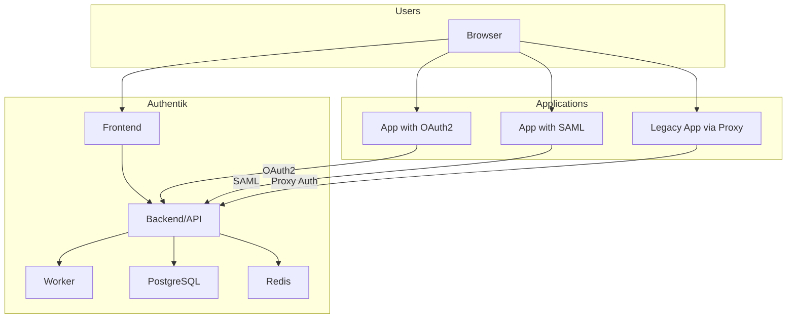

# How to Configure Authentik for SSO

Author: [nawazdhandala](https://www.github.com/nawazdhandala)

Tags: Security, Authentik, SSO, Single Sign-On, Identity Provider, OAuth2, SAML, Authentication

Description: Learn how to deploy and configure Authentik as an open-source identity provider for single sign-on across your applications, with support for OAuth2, SAML, and LDAP.

---

Running multiple applications means managing multiple login systems unless you have Single Sign-On. Authentik is an open-source identity provider that centralizes authentication with support for OAuth2/OIDC, SAML, LDAP, and proxy authentication. This guide covers deployment, provider configuration, and integration patterns for common applications.

## Why Authentik

Authentik offers enterprise features without enterprise costs:

- **Multiple Protocols**: OAuth2, OIDC, SAML 2.0, LDAP
- **Proxy Authentication**: Protect any application with a reverse proxy
- **Flows and Stages**: Customizable authentication workflows
- **MFA Support**: TOTP, WebAuthn, SMS, email
- **User Self-Service**: Password reset, profile management
- **Modern UI**: Clean interface for users and admins
- **Open Source**: MIT licensed, self-hosted

## Architecture Overview



## Deploying Authentik

### Docker Compose

Create the docker-compose file:

```yaml
# docker-compose.yml
version: "3.8"

services:
  postgresql:
    image: postgres:15-alpine
    container_name: authentik-db
    restart: unless-stopped
    environment:
      POSTGRES_DB: authentik
      POSTGRES_USER: authentik
      POSTGRES_PASSWORD: ${PG_PASS:?Set PG_PASS}
    volumes:
      - database:/var/lib/postgresql/data

  redis:
    image: redis:7-alpine
    container_name: authentik-redis
    restart: unless-stopped
    command: --save 60 1 --loglevel warning
    volumes:
      - redis:/data

  server:
    image: ghcr.io/goauthentik/server:2024.1
    container_name: authentik-server
    restart: unless-stopped
    command: server
    environment:
      AUTHENTIK_SECRET_KEY: ${AUTHENTIK_SECRET_KEY:?Set AUTHENTIK_SECRET_KEY}
      AUTHENTIK_REDIS__HOST: redis
      AUTHENTIK_POSTGRESQL__HOST: postgresql
      AUTHENTIK_POSTGRESQL__USER: authentik
      AUTHENTIK_POSTGRESQL__NAME: authentik
      AUTHENTIK_POSTGRESQL__PASSWORD: ${PG_PASS}
    volumes:
      - ./media:/media
      - ./custom-templates:/templates
    ports:
      - "9000:9000"
      - "9443:9443"
    depends_on:
      - postgresql
      - redis

  worker:
    image: ghcr.io/goauthentik/server:2024.1
    container_name: authentik-worker
    restart: unless-stopped
    command: worker
    environment:
      AUTHENTIK_SECRET_KEY: ${AUTHENTIK_SECRET_KEY}
      AUTHENTIK_REDIS__HOST: redis
      AUTHENTIK_POSTGRESQL__HOST: postgresql
      AUTHENTIK_POSTGRESQL__USER: authentik
      AUTHENTIK_POSTGRESQL__NAME: authentik
      AUTHENTIK_POSTGRESQL__PASSWORD: ${PG_PASS}
    volumes:
      - ./media:/media
      - ./certs:/certs
      - ./custom-templates:/templates
    depends_on:
      - postgresql
      - redis

volumes:
  database:
  redis:
```

Create an environment file:

```bash
# .env
PG_PASS=your-secure-database-password
AUTHENTIK_SECRET_KEY=$(openssl rand -base64 60 | tr -d '\n')
```

Start Authentik:

```bash
docker-compose up -d
```

### Initial Setup

1. Open https://localhost:9443/if/flow/initial-setup/
2. Create the admin user
3. Log into the admin interface at https://localhost:9443/if/admin/

### Kubernetes with Helm

```bash
# Add the Authentik Helm repository
helm repo add authentik https://charts.goauthentik.io
helm repo update

# Create values file
cat > values.yaml << 'EOF'
authentik:
  secret_key: "your-secret-key-here"
  postgresql:
    password: "your-db-password"

postgresql:
  enabled: true
  auth:
    password: "your-db-password"

redis:
  enabled: true
EOF

# Install
helm install authentik authentik/authentik \
  --namespace authentik \
  --create-namespace \
  -f values.yaml
```

## Creating an OAuth2/OIDC Provider

For applications that support OAuth2 or OpenID Connect:

1. Go to **Applications > Providers > Create**
2. Select **OAuth2/OpenID Provider**
3. Configure:

```yaml
Name: my-application
Authorization flow: default-provider-authorization-implicit-consent
Client type: Confidential
Client ID: (auto-generated or custom)
Client Secret: (auto-generated)
Redirect URIs:
  - https://myapp.example.com/oauth/callback
  - https://myapp.example.com/auth/callback
Signing Key: authentik Self-signed Certificate
```

4. Create an Application:
   - Go to **Applications > Applications > Create**
   - Name: My Application
   - Slug: my-application
   - Provider: Select the provider you created

5. Note the endpoints:
   - Authorization: https://authentik.example.com/application/o/authorize/
   - Token: https://authentik.example.com/application/o/token/
   - Userinfo: https://authentik.example.com/application/o/userinfo/
   - JWKS: https://authentik.example.com/application/o/my-application/jwks/

## Integrating Applications

### Generic OAuth2 (Node.js Example)

```javascript
// app.js
const express = require('express');
const passport = require('passport');
const OAuth2Strategy = require('passport-oauth2');

const app = express();

passport.use(new OAuth2Strategy({
    authorizationURL: 'https://authentik.example.com/application/o/authorize/',
    tokenURL: 'https://authentik.example.com/application/o/token/',
    clientID: 'your-client-id',
    clientSecret: 'your-client-secret',
    callbackURL: 'https://myapp.example.com/auth/callback',
    scope: ['openid', 'profile', 'email']
  },
  async (accessToken, refreshToken, profile, done) => {
    // Fetch user info
    const response = await fetch('https://authentik.example.com/application/o/userinfo/', {
      headers: { 'Authorization': `Bearer ${accessToken}` }
    });
    const user = await response.json();
    return done(null, user);
  }
));

app.get('/auth/login', passport.authenticate('oauth2'));

app.get('/auth/callback',
  passport.authenticate('oauth2', { failureRedirect: '/login' }),
  (req, res) => {
    res.redirect('/dashboard');
  }
);
```

### Grafana

Configure Grafana to use Authentik:

```ini
# grafana.ini
[auth.generic_oauth]
enabled = true
name = Authentik
allow_sign_up = true
client_id = grafana-client-id
client_secret = grafana-client-secret
scopes = openid profile email
auth_url = https://authentik.example.com/application/o/authorize/
token_url = https://authentik.example.com/application/o/token/
api_url = https://authentik.example.com/application/o/userinfo/
role_attribute_path = contains(groups[*], 'Grafana Admins') && 'Admin' || 'Viewer'
```

### GitLab

```ruby
# gitlab.rb
gitlab_rails['omniauth_providers'] = [
  {
    name: "openid_connect",
    label: "Authentik",
    args: {
      name: "openid_connect",
      scope: ["openid", "profile", "email"],
      response_type: "code",
      issuer: "https://authentik.example.com/application/o/gitlab/",
      discovery: true,
      client_auth_method: "query",
      client_options: {
        identifier: "gitlab-client-id",
        secret: "gitlab-client-secret",
        redirect_uri: "https://gitlab.example.com/users/auth/openid_connect/callback"
      }
    }
  }
]
```

## Creating a SAML Provider

For applications that require SAML:

1. Go to **Applications > Providers > Create**
2. Select **SAML Provider**
3. Configure:

```yaml
Name: saml-application
Authorization flow: default-provider-authorization-implicit-consent
ACS URL: https://app.example.com/saml/acs
Issuer: https://authentik.example.com
Service Provider Binding: Post
Signing Certificate: authentik Self-signed Certificate
```

4. Download the metadata XML for the application configuration
5. Create an Application linked to this provider

## Proxy Authentication

Protect applications that don't support SSO natively using the proxy outpost:

### Create a Proxy Provider

1. Go to **Applications > Providers > Create**
2. Select **Proxy Provider**
3. Configure:

```yaml
Name: legacy-app-proxy
Authorization flow: default-provider-authorization-implicit-consent
External host: https://legacyapp.example.com
Mode: Forward auth (single application)
```

### Deploy the Proxy Outpost

```yaml
# docker-compose.yml (add to existing)
  authentik-proxy:
    image: ghcr.io/goauthentik/proxy:2024.1
    container_name: authentik-proxy
    restart: unless-stopped
    environment:
      AUTHENTIK_HOST: https://authentik.example.com
      AUTHENTIK_INSECURE: "false"
      AUTHENTIK_TOKEN: ${OUTPOST_TOKEN}
    ports:
      - "9001:9000"
      - "9444:9443"
```

### Configure Nginx

```nginx
# nginx.conf
server {
    listen 443 ssl;
    server_name legacyapp.example.com;

    # Forward authentication to Authentik
    location /outpost.goauthentik.io {
        proxy_pass https://authentik-proxy:9443/outpost.goauthentik.io;
        proxy_set_header Host $host;
        proxy_set_header X-Original-URL $scheme://$http_host$request_uri;
    }

    # Protected application
    location / {
        auth_request /outpost.goauthentik.io/auth/nginx;
        error_page 401 = @goauthentik_proxy_signin;

        # Pass user info to backend
        auth_request_set $authentik_username $upstream_http_x_authentik_username;
        auth_request_set $authentik_email $upstream_http_x_authentik_email;
        proxy_set_header X-User $authentik_username;
        proxy_set_header X-Email $authentik_email;

        proxy_pass http://legacy-backend:8080;
    }

    location @goauthentik_proxy_signin {
        internal;
        add_header Set-Cookie $auth_cookie;
        return 302 /outpost.goauthentik.io/start?rd=$request_uri;
    }
}
```

## Customizing Authentication Flows

Authentik uses Flows (sequences of Stages) to define authentication processes:

### Add MFA to Login

1. Go to **Flows & Stages > Stages > Create**
2. Create an Authenticator Validation Stage:
   - Device classes: TOTP, WebAuthn
   - Not configured action: Skip

3. Edit the default authentication flow
4. Add the MFA stage after password validation

### Custom Enrollment Flow

Create a flow for user self-registration:

```yaml
# Export format for reference
stages:
  - name: enrollment-prompt
    type: prompt
    fields:
      - username
      - email
      - password
      - password_repeat

  - name: enrollment-email-verification
    type: email
    subject: Verify your email
    template: email/verification.html

  - name: enrollment-user-write
    type: user_write
    create_users_as_inactive: true

flow:
  name: enrollment
  designation: enrollment
  stages:
    - enrollment-prompt
    - enrollment-user-write
    - enrollment-email-verification
```

## User Federation

### LDAP Source

Connect to an existing LDAP/Active Directory:

1. Go to **Directory > Federation > Create**
2. Select **LDAP Source**
3. Configure:

```yaml
Name: Active Directory
Server URI: ldaps://dc.example.com
Bind CN: cn=authentik,ou=services,dc=example,dc=com
Bind Password: service-account-password
Base DN: dc=example,dc=com
User object filter: (objectClass=user)
Group object filter: (objectClass=group)
Sync users: Yes
Sync groups: Yes
```

## Monitoring

Authentik exposes Prometheus metrics:

```yaml
# prometheus.yml
scrape_configs:
  - job_name: 'authentik'
    static_configs:
      - targets: ['authentik-server:9300']
    metrics_path: /metrics
```

Key metrics:
- `authentik_flows_*`: Flow execution metrics
- `authentik_outpost_*`: Proxy outpost metrics
- `authentik_source_*`: Federation source metrics

---

Authentik brings enterprise identity management to self-hosted environments. Start with OAuth2 for modern applications, add proxy authentication for legacy apps, and customize flows for your specific security requirements. The result is single sign-on across your entire infrastructure without vendor lock-in.
