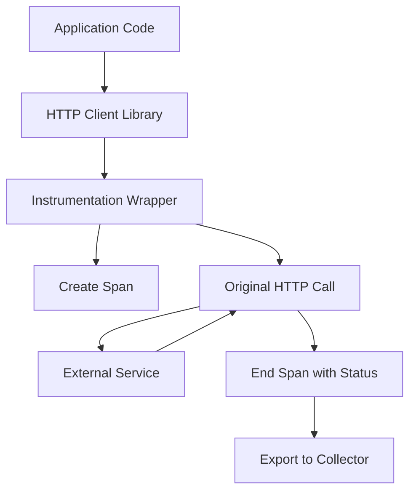

# How to Implement Auto-Instrumentation in OpenTelemetry

Author: [nawazdhandala](https://www.github.com/nawazdhandala)

Tags: OpenTelemetry, Auto-Instrumentation, Tracing, Node.js, Python, Java, Zero-Code Instrumentation

Description: Learn how to implement auto-instrumentation in OpenTelemetry for automatic tracing without code changes. This guide covers setup for Node.js, Python, and Java with practical configuration examples.

---

Auto-instrumentation is one of OpenTelemetry's most powerful features. It allows you to add distributed tracing to your applications without modifying your application code. Libraries for HTTP, databases, message queues, and other common integrations get instrumented automatically.

This guide walks through setting up auto-instrumentation for the three most common languages: Node.js, Python, and Java.

## How Auto-Instrumentation Works

Auto-instrumentation works by patching or wrapping popular libraries at runtime. When your application makes an HTTP request or queries a database, the instrumentation library intercepts these calls and creates spans automatically.



## Node.js Auto-Instrumentation

### Installation

```bash
npm install @opentelemetry/sdk-node \
  @opentelemetry/auto-instrumentations-node \
  @opentelemetry/exporter-trace-otlp-http \
  @opentelemetry/exporter-metrics-otlp-http
```

### Basic Setup

Create a file that runs before your application starts:

```javascript
// tracing.js
const { NodeSDK } = require('@opentelemetry/sdk-node');
const { getNodeAutoInstrumentations } = require('@opentelemetry/auto-instrumentations-node');
const { OTLPTraceExporter } = require('@opentelemetry/exporter-trace-otlp-http');
const { OTLPMetricExporter } = require('@opentelemetry/exporter-metrics-otlp-http');
const { PeriodicExportingMetricReader } = require('@opentelemetry/sdk-metrics');
const { Resource } = require('@opentelemetry/resources');
const { SemanticResourceAttributes } = require('@opentelemetry/semantic-conventions');

// Define service metadata
const resource = new Resource({
  [SemanticResourceAttributes.SERVICE_NAME]: process.env.OTEL_SERVICE_NAME || 'my-service',
  [SemanticResourceAttributes.SERVICE_VERSION]: process.env.npm_package_version || '1.0.0',
  [SemanticResourceAttributes.DEPLOYMENT_ENVIRONMENT]: process.env.NODE_ENV || 'development'
});

// Configure exporters
const traceExporter = new OTLPTraceExporter({
  url: process.env.OTEL_EXPORTER_OTLP_ENDPOINT + '/v1/traces'
});

const metricExporter = new OTLPMetricExporter({
  url: process.env.OTEL_EXPORTER_OTLP_ENDPOINT + '/v1/metrics'
});

// Initialize the SDK with auto-instrumentation
const sdk = new NodeSDK({
  resource,
  traceExporter,
  metricReader: new PeriodicExportingMetricReader({
    exporter: metricExporter,
    exportIntervalMillis: 60000
  }),
  // This single line instruments 20+ popular libraries
  instrumentations: [getNodeAutoInstrumentations()]
});

sdk.start();

// Graceful shutdown
process.on('SIGTERM', () => {
  sdk.shutdown()
    .then(() => console.log('Tracing shut down'))
    .catch((error) => console.error('Error shutting down tracing', error))
    .finally(() => process.exit(0));
});
```

### Running Your Application

Load the tracing file before your application:

```bash
# Using --require flag
node --require ./tracing.js app.js

# Or in package.json
{
  "scripts": {
    "start": "node --require ./tracing.js app.js"
  }
}
```

### Selective Instrumentation

You can enable only specific instrumentations to reduce overhead:

```javascript
// tracing.js
const { getNodeAutoInstrumentations } = require('@opentelemetry/auto-instrumentations-node');

const instrumentations = getNodeAutoInstrumentations({
  // Disable instrumentations you don't need
  '@opentelemetry/instrumentation-fs': { enabled: false },
  '@opentelemetry/instrumentation-dns': { enabled: false },

  // Configure specific instrumentations
  '@opentelemetry/instrumentation-http': {
    // Skip health check endpoints
    ignoreIncomingRequestHook: (request) => {
      return request.url === '/health' || request.url === '/ready';
    },
    // Add custom attributes to HTTP spans
    requestHook: (span, request) => {
      span.setAttribute('http.request_id', request.headers['x-request-id']);
    }
  },

  '@opentelemetry/instrumentation-express': {
    // Capture route parameters
    requestHook: (span, info) => {
      if (info.layerType === 'request_handler') {
        span.setAttribute('express.route', info.route);
      }
    }
  },

  '@opentelemetry/instrumentation-pg': {
    // Add database query to span (be careful with sensitive data)
    enhancedDatabaseReporting: true
  }
});
```

## Python Auto-Instrumentation

### Installation

```bash
pip install opentelemetry-distro opentelemetry-exporter-otlp
opentelemetry-bootstrap -a install
```

The `opentelemetry-bootstrap` command automatically detects and installs instrumentation packages for libraries in your environment.

### Zero-Code Approach

The simplest way to use auto-instrumentation in Python:

```bash
# Set environment variables
export OTEL_SERVICE_NAME=payment-service
export OTEL_EXPORTER_OTLP_ENDPOINT=http://collector:4317
export OTEL_TRACES_EXPORTER=otlp
export OTEL_METRICS_EXPORTER=otlp

# Run with auto-instrumentation
opentelemetry-instrument python app.py
```

### Programmatic Approach

For more control, configure instrumentation in code:

```python
# tracing_config.py
import os
from opentelemetry import trace, metrics
from opentelemetry.sdk.trace import TracerProvider
from opentelemetry.sdk.trace.export import BatchSpanProcessor
from opentelemetry.sdk.metrics import MeterProvider
from opentelemetry.sdk.metrics.export import PeriodicExportingMetricReader
from opentelemetry.exporter.otlp.proto.grpc.trace_exporter import OTLPSpanExporter
from opentelemetry.exporter.otlp.proto.grpc.metric_exporter import OTLPMetricExporter
from opentelemetry.sdk.resources import Resource, SERVICE_NAME, SERVICE_VERSION

# Import instrumentation libraries
from opentelemetry.instrumentation.flask import FlaskInstrumentor
from opentelemetry.instrumentation.requests import RequestsInstrumentor
from opentelemetry.instrumentation.psycopg2 import Psycopg2Instrumentor
from opentelemetry.instrumentation.redis import RedisInstrumentor

def configure_telemetry():
    """
    Configure OpenTelemetry with auto-instrumentation.
    Call this function before creating your Flask app.
    """

    # Create resource with service metadata
    resource = Resource.create({
        SERVICE_NAME: os.getenv("OTEL_SERVICE_NAME", "my-service"),
        SERVICE_VERSION: os.getenv("SERVICE_VERSION", "1.0.0"),
        "deployment.environment": os.getenv("DEPLOY_ENV", "development")
    })

    # Configure tracing
    trace_provider = TracerProvider(resource=resource)
    trace_exporter = OTLPSpanExporter(
        endpoint=os.getenv("OTEL_EXPORTER_OTLP_ENDPOINT", "localhost:4317")
    )
    trace_provider.add_span_processor(BatchSpanProcessor(trace_exporter))
    trace.set_tracer_provider(trace_provider)

    # Configure metrics
    metric_exporter = OTLPMetricExporter(
        endpoint=os.getenv("OTEL_EXPORTER_OTLP_ENDPOINT", "localhost:4317")
    )
    metric_reader = PeriodicExportingMetricReader(metric_exporter)
    meter_provider = MeterProvider(resource=resource, metric_readers=[metric_reader])
    metrics.set_meter_provider(meter_provider)

    # Enable auto-instrumentation for common libraries
    RequestsInstrumentor().instrument()
    Psycopg2Instrumentor().instrument()
    RedisInstrumentor().instrument()

def instrument_flask_app(app):
    """
    Instrument a Flask application.
    Call this after creating your Flask app.
    """
    FlaskInstrumentor().instrument_app(
        app,
        excluded_urls="/health,/ready,/metrics"
    )
```

### Using the Configuration

```python
# app.py
from flask import Flask
from tracing_config import configure_telemetry, instrument_flask_app

# Configure telemetry before creating the app
configure_telemetry()

app = Flask(__name__)
instrument_flask_app(app)

@app.route('/api/orders/<order_id>')
def get_order(order_id):
    # This endpoint is automatically traced
    # HTTP requests to external services are also traced
    return {"order_id": order_id, "status": "completed"}

if __name__ == '__main__':
    app.run()
```

## Java Auto-Instrumentation

Java uses a different approach with a Java agent that attaches at JVM startup.

### Download the Agent

```bash
# Download the latest agent
curl -L -o opentelemetry-javaagent.jar \
  https://github.com/open-telemetry/opentelemetry-java-instrumentation/releases/latest/download/opentelemetry-javaagent.jar
```

### Running with the Agent

```bash
java -javaagent:opentelemetry-javaagent.jar \
  -Dotel.service.name=order-service \
  -Dotel.exporter.otlp.endpoint=http://collector:4317 \
  -jar myapp.jar
```

### Environment Variable Configuration

```bash
export OTEL_SERVICE_NAME=order-service
export OTEL_EXPORTER_OTLP_ENDPOINT=http://collector:4317
export OTEL_TRACES_EXPORTER=otlp
export OTEL_METRICS_EXPORTER=otlp
export OTEL_LOGS_EXPORTER=otlp

# Disable specific instrumentations
export OTEL_INSTRUMENTATION_JDBC_ENABLED=true
export OTEL_INSTRUMENTATION_SERVLET_ENABLED=true
export OTEL_INSTRUMENTATION_SPRING_WEB_ENABLED=true

java -javaagent:opentelemetry-javaagent.jar -jar myapp.jar
```

### Docker Configuration

```dockerfile
FROM eclipse-temurin:17-jdk

WORKDIR /app

# Download the OpenTelemetry Java agent
ADD https://github.com/open-telemetry/opentelemetry-java-instrumentation/releases/latest/download/opentelemetry-javaagent.jar /app/opentelemetry-javaagent.jar

COPY target/myapp.jar /app/myapp.jar

ENV JAVA_TOOL_OPTIONS="-javaagent:/app/opentelemetry-javaagent.jar"
ENV OTEL_SERVICE_NAME=order-service
ENV OTEL_EXPORTER_OTLP_ENDPOINT=http://collector:4317

ENTRYPOINT ["java", "-jar", "myapp.jar"]
```

## What Gets Instrumented

Here is a summary of commonly auto-instrumented libraries:

| Category | Node.js | Python | Java |
|----------|---------|--------|------|
| HTTP Server | Express, Koa, Fastify, Hapi | Flask, Django, FastAPI | Spring MVC, JAX-RS |
| HTTP Client | http, https, node-fetch | requests, urllib3, aiohttp | HttpClient, OkHttp |
| Database | pg, mysql2, mongodb, redis | psycopg2, mysql, pymongo, redis | JDBC, Hibernate |
| Message Queue | amqplib, kafkajs | pika, kafka-python | Kafka, RabbitMQ |
| gRPC | @grpc/grpc-js | grpcio | grpc-java |

## Best Practices

1. **Start with auto-instrumentation**: Get visibility quickly without code changes.

2. **Add manual instrumentation for business logic**: Auto-instrumentation covers libraries, but add custom spans for important business operations.

3. **Filter noisy endpoints**: Exclude health checks and readiness probes from tracing.

4. **Use environment variables**: Configure through environment variables for flexibility across environments.

5. **Test in staging first**: Auto-instrumentation can add overhead. Test performance impact before production.

## Troubleshooting

**No traces appearing**: Check that the exporter endpoint is correct and accessible. Enable debug logging:

```bash
# Node.js
export OTEL_LOG_LEVEL=debug

# Python
export OTEL_PYTHON_LOG_LEVEL=debug

# Java
export OTEL_JAVAAGENT_DEBUG=true
```

**Missing spans for specific libraries**: The library might not be supported or the instrumentation might not be installed. Check the OpenTelemetry registry for available instrumentations.

**High overhead**: Disable instrumentations you do not need. Consider using sampling to reduce the volume of traces.

## Summary

Auto-instrumentation provides immediate visibility into your applications with minimal effort. For Node.js, use the `@opentelemetry/auto-instrumentations-node` package. For Python, use `opentelemetry-instrument` or programmatic instrumentation. For Java, use the Java agent.

Start with auto-instrumentation to get baseline observability, then add manual instrumentation for business-specific operations that auto-instrumentation cannot capture.
