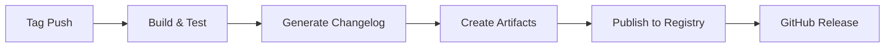

# How to Automate Releases with GitHub Actions

Author: [nawazdhandala](https://www.github.com/nawazdhandala)

Tags: GitHub Actions, CI/CD, Releases, Automation, DevOps, Semantic Versioning

Description: Learn how to automate your entire release process with GitHub Actions, from version bumping to changelog generation, artifact publishing, and GitHub Release creation with practical examples.

---

Manual releases are error-prone and time-consuming. You forget to update the changelog, tag the wrong commit, or publish an incomplete artifact. GitHub Actions can handle all of this automatically, giving you consistent, repeatable releases every time.

## The Release Pipeline Overview

A solid automated release pipeline handles these steps:

1. Detect when a release should happen (tag push, manual trigger, or merge to main)
2. Build and test the code
3. Generate or update the changelog
4. Create release artifacts
5. Publish to package registries
6. Create a GitHub Release with notes and artifacts



## Basic Release Workflow

Start with a workflow that triggers on version tags. This pattern is common for libraries and applications that follow semantic versioning.

```yaml
# .github/workflows/release.yml
name: Release

on:
  push:
    tags:
      - 'v*'  # Trigger on tags like v1.0.0, v2.1.3, etc.

permissions:
  contents: write  # Required to create releases
  packages: write  # Required if publishing to GitHub Packages

jobs:
  release:
    runs-on: ubuntu-latest
    steps:
      # Checkout with full history for changelog generation
      - name: Checkout repository
        uses: actions/checkout@v4
        with:
          fetch-depth: 0  # Full history needed for changelog

      # Set up your language runtime
      - name: Set up Node.js
        uses: actions/setup-node@v4
        with:
          node-version: '20'
          registry-url: 'https://registry.npmjs.org'

      # Install dependencies and build
      - name: Install dependencies
        run: npm ci

      - name: Run tests
        run: npm test

      - name: Build project
        run: npm run build
```

## Automatic Changelog Generation

Generating changelogs manually is tedious. Use conventional commits and automated tools to create changelogs from your commit history.

```yaml
      # Generate changelog from conventional commits
      - name: Generate changelog
        id: changelog
        uses: conventional-changelog/conventional-changelog-action@v4
        with:
          github-token: ${{ secrets.GITHUB_TOKEN }}
          output-file: false  # Don't write to file, use output
          skip-version-file: true
          skip-commit: true

      # Alternative: Use git-cliff for more control
      - name: Generate changelog with git-cliff
        id: cliff
        uses: orhun/git-cliff-action@v3
        with:
          config: cliff.toml
          args: --latest --strip header
        env:
          OUTPUT: CHANGELOG.md
```

For git-cliff, create a configuration file that defines how commits map to changelog sections:

```toml
# cliff.toml
[changelog]
header = """
# Changelog\n
"""
body = """

    ## {{ group | upper_first }}
    
        - {{ commit.message | upper_first }} ({{ commit.id | truncate(length=7, end="") }})\
    
\n
"""

[git]
conventional_commits = true
filter_unconventional = true
commit_parsers = [
    { message = "^feat", group = "Features" },
    { message = "^fix", group = "Bug Fixes" },
    { message = "^docs", group = "Documentation" },
    { message = "^perf", group = "Performance" },
    { message = "^refactor", group = "Refactor" },
]
```

## Creating Release Artifacts

Bundle your build outputs into downloadable artifacts. This is especially useful for CLI tools, binaries, or distributable packages.

```yaml
      # Create distributable archives
      - name: Create release archives
        run: |
          # Create tarball for Unix systems
          tar -czvf myapp-${{ github.ref_name }}-linux.tar.gz -C dist .

          # Create zip for Windows users
          zip -r myapp-${{ github.ref_name }}-windows.zip dist/

      # Calculate checksums for verification
      - name: Generate checksums
        run: |
          sha256sum myapp-*.tar.gz myapp-*.zip > checksums.txt
```

## Publishing to Package Registries

Automatically publish your package to npm, PyPI, or other registries as part of the release.

```yaml
      # Publish to npm
      - name: Publish to npm
        run: npm publish --access public
        env:
          NODE_AUTH_TOKEN: ${{ secrets.NPM_TOKEN }}

      # For scoped packages
      - name: Publish scoped package
        run: npm publish --access public --tag latest
        env:
          NODE_AUTH_TOKEN: ${{ secrets.NPM_TOKEN }}
```

For Python projects, use the official PyPI action:

```yaml
      # Publish to PyPI
      - name: Publish to PyPI
        uses: pypa/gh-action-pypi-publish@release/v1
        with:
          user: __token__
          password: ${{ secrets.PYPI_API_TOKEN }}
```

## Creating the GitHub Release

Tie everything together by creating a GitHub Release with your changelog, artifacts, and checksums.

```yaml
      # Create GitHub Release with all artifacts
      - name: Create GitHub Release
        uses: softprops/action-gh-release@v1
        with:
          name: Release ${{ github.ref_name }}
          body: ${{ steps.changelog.outputs.changelog }}
          draft: false
          prerelease: ${{ contains(github.ref_name, '-') }}  # Pre-release if tag has hyphen
          files: |
            myapp-*.tar.gz
            myapp-*.zip
            checksums.txt
        env:
          GITHUB_TOKEN: ${{ secrets.GITHUB_TOKEN }}
```

## Release Drafter for PR-Based Releases

If you prefer releases based on merged PRs rather than conventional commits, use Release Drafter:

```yaml
# .github/workflows/release-drafter.yml
name: Release Drafter

on:
  push:
    branches:
      - main
  pull_request:
    types: [opened, reopened, synchronize]

permissions:
  contents: read
  pull-requests: write

jobs:
  update_release_draft:
    runs-on: ubuntu-latest
    steps:
      - uses: release-drafter/release-drafter@v5
        env:
          GITHUB_TOKEN: ${{ secrets.GITHUB_TOKEN }}
```

Configure the drafter with labels:

```yaml
# .github/release-drafter.yml
name-template: 'v$RESOLVED_VERSION'
tag-template: 'v$RESOLVED_VERSION'
categories:
  - title: 'New Features'
    labels:
      - 'feature'
      - 'enhancement'
  - title: 'Bug Fixes'
    labels:
      - 'fix'
      - 'bugfix'
  - title: 'Maintenance'
    labels:
      - 'chore'
      - 'dependencies'
change-template: '- $TITLE @$AUTHOR (#$NUMBER)'
version-resolver:
  major:
    labels:
      - 'major'
  minor:
    labels:
      - 'minor'
      - 'feature'
  patch:
    labels:
      - 'patch'
      - 'fix'
  default: patch
```

## Manual Release Trigger

Sometimes you want to trigger a release manually with specific parameters:

```yaml
name: Manual Release

on:
  workflow_dispatch:
    inputs:
      version:
        description: 'Version to release (e.g., 1.2.3)'
        required: true
        type: string
      prerelease:
        description: 'Mark as pre-release'
        required: false
        type: boolean
        default: false

jobs:
  release:
    runs-on: ubuntu-latest
    steps:
      - uses: actions/checkout@v4

      # Create and push the tag
      - name: Create tag
        run: |
          git config user.name "github-actions[bot]"
          git config user.email "github-actions[bot]@users.noreply.github.com"
          git tag -a "v${{ inputs.version }}" -m "Release v${{ inputs.version }}"
          git push origin "v${{ inputs.version }}"

      # The tag push will trigger the main release workflow
```

## Multi-Platform Releases

For applications that need binaries for multiple platforms, use a matrix build:

```yaml
jobs:
  build:
    strategy:
      matrix:
        include:
          - os: ubuntu-latest
            target: x86_64-unknown-linux-gnu
            artifact: myapp-linux-amd64
          - os: macos-latest
            target: x86_64-apple-darwin
            artifact: myapp-darwin-amd64
          - os: windows-latest
            target: x86_64-pc-windows-msvc
            artifact: myapp-windows-amd64.exe
    runs-on: ${{ matrix.os }}
    steps:
      - uses: actions/checkout@v4

      - name: Build
        run: cargo build --release --target ${{ matrix.target }}

      - name: Upload artifact
        uses: actions/upload-artifact@v4
        with:
          name: ${{ matrix.artifact }}
          path: target/${{ matrix.target }}/release/myapp*

  release:
    needs: build
    runs-on: ubuntu-latest
    steps:
      - name: Download all artifacts
        uses: actions/download-artifact@v4

      - name: Create release
        uses: softprops/action-gh-release@v1
        with:
          files: |
            myapp-linux-amd64/myapp
            myapp-darwin-amd64/myapp
            myapp-windows-amd64.exe/myapp.exe
```

## Best Practices

1. **Use semantic versioning** - Follow semver conventions so users know what to expect from each release.

2. **Sign your releases** - Use GPG signing or GitHub's built-in provenance features for supply chain security.

3. **Test before releasing** - Always run your full test suite before publishing. A broken release is worse than a delayed one.

4. **Keep release notes meaningful** - Automated changelogs are a starting point. Add context about breaking changes or migration steps.

5. **Use draft releases for review** - Create draft releases first, then publish after manual review for important projects.

With automated releases, you can ship more frequently with less risk. The workflow handles the tedious parts while you focus on writing code.
