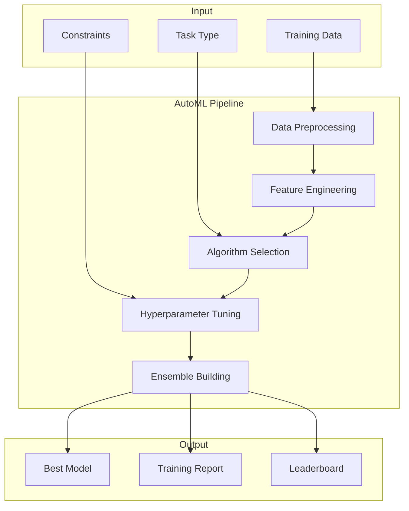

# How to Configure AutoML Pipelines

Author: [nawazdhandala](https://www.github.com/nawazdhandala)

Tags: MLOps, AutoML, Machine Learning, Hyperparameter Tuning, Model Selection, Python, Optuna

Description: Learn how to build AutoML pipelines that automatically select algorithms, tune hyperparameters, and optimize feature engineering for your ML tasks.

---

AutoML automates the tedious parts of machine learning: algorithm selection, hyperparameter tuning, and feature engineering. Instead of manually trying different configurations, AutoML pipelines systematically search for the best approach. This guide covers building production-ready AutoML systems.

## AutoML Pipeline Architecture



## Hyperparameter Optimization with Optuna

```python
# automl/hyperparameter_search.py
import optuna
from optuna.samplers import TPESampler
from optuna.pruners import MedianPruner
import numpy as np
from sklearn.model_selection import cross_val_score
from typing import Dict, Any, Callable
import logging

logging.getLogger('optuna').setLevel(logging.WARNING)

class HyperparameterOptimizer:
    """
    Optimize hyperparameters using Optuna.

    Uses TPE (Tree-structured Parzen Estimator) for efficient
    Bayesian optimization.
    """

    def __init__(
        self,
        n_trials: int = 100,
        timeout_seconds: int = 3600,
        n_jobs: int = -1
    ):
        self.n_trials = n_trials
        self.timeout = timeout_seconds
        self.n_jobs = n_jobs

    def optimize_xgboost(
        self,
        X: np.ndarray,
        y: np.ndarray,
        cv: int = 5
    ) -> Dict[str, Any]:
        """
        Optimize XGBoost hyperparameters.
        """
        import xgboost as xgb

        def objective(trial):
            params = {
                'n_estimators': trial.suggest_int('n_estimators', 50, 500),
                'max_depth': trial.suggest_int('max_depth', 3, 12),
                'learning_rate': trial.suggest_float('learning_rate', 0.01, 0.3, log=True),
                'subsample': trial.suggest_float('subsample', 0.6, 1.0),
                'colsample_bytree': trial.suggest_float('colsample_bytree', 0.6, 1.0),
                'min_child_weight': trial.suggest_int('min_child_weight', 1, 10),
                'reg_alpha': trial.suggest_float('reg_alpha', 1e-8, 10.0, log=True),
                'reg_lambda': trial.suggest_float('reg_lambda', 1e-8, 10.0, log=True),
            }

            model = xgb.XGBClassifier(**params, use_label_encoder=False, eval_metric='logloss')

            scores = cross_val_score(model, X, y, cv=cv, scoring='accuracy', n_jobs=self.n_jobs)

            return scores.mean()

        study = optuna.create_study(
            direction='maximize',
            sampler=TPESampler(seed=42),
            pruner=MedianPruner(n_warmup_steps=10)
        )

        study.optimize(
            objective,
            n_trials=self.n_trials,
            timeout=self.timeout,
            show_progress_bar=True
        )

        return {
            'best_params': study.best_params,
            'best_score': study.best_value,
            'n_trials': len(study.trials)
        }

    def optimize_lightgbm(
        self,
        X: np.ndarray,
        y: np.ndarray,
        cv: int = 5
    ) -> Dict[str, Any]:
        """
        Optimize LightGBM hyperparameters.
        """
        import lightgbm as lgb

        def objective(trial):
            params = {
                'n_estimators': trial.suggest_int('n_estimators', 50, 500),
                'num_leaves': trial.suggest_int('num_leaves', 20, 300),
                'max_depth': trial.suggest_int('max_depth', 3, 15),
                'learning_rate': trial.suggest_float('learning_rate', 0.01, 0.3, log=True),
                'subsample': trial.suggest_float('subsample', 0.6, 1.0),
                'colsample_bytree': trial.suggest_float('colsample_bytree', 0.6, 1.0),
                'min_child_samples': trial.suggest_int('min_child_samples', 5, 100),
                'reg_alpha': trial.suggest_float('reg_alpha', 1e-8, 10.0, log=True),
                'reg_lambda': trial.suggest_float('reg_lambda', 1e-8, 10.0, log=True),
            }

            model = lgb.LGBMClassifier(**params, verbosity=-1)

            scores = cross_val_score(model, X, y, cv=cv, scoring='accuracy', n_jobs=self.n_jobs)

            return scores.mean()

        study = optuna.create_study(
            direction='maximize',
            sampler=TPESampler(seed=42)
        )

        study.optimize(objective, n_trials=self.n_trials, timeout=self.timeout)

        return {
            'best_params': study.best_params,
            'best_score': study.best_value,
            'n_trials': len(study.trials)
        }

    def optimize_random_forest(
        self,
        X: np.ndarray,
        y: np.ndarray,
        cv: int = 5
    ) -> Dict[str, Any]:
        """
        Optimize Random Forest hyperparameters.
        """
        from sklearn.ensemble import RandomForestClassifier

        def objective(trial):
            params = {
                'n_estimators': trial.suggest_int('n_estimators', 50, 500),
                'max_depth': trial.suggest_int('max_depth', 3, 30),
                'min_samples_split': trial.suggest_int('min_samples_split', 2, 20),
                'min_samples_leaf': trial.suggest_int('min_samples_leaf', 1, 10),
                'max_features': trial.suggest_categorical('max_features', ['sqrt', 'log2', None]),
                'bootstrap': trial.suggest_categorical('bootstrap', [True, False])
            }

            model = RandomForestClassifier(**params, n_jobs=self.n_jobs, random_state=42)

            scores = cross_val_score(model, X, y, cv=cv, scoring='accuracy')

            return scores.mean()

        study = optuna.create_study(direction='maximize', sampler=TPESampler(seed=42))
        study.optimize(objective, n_trials=self.n_trials, timeout=self.timeout)

        return {
            'best_params': study.best_params,
            'best_score': study.best_value,
            'n_trials': len(study.trials)
        }
```

## Algorithm Selection

```python
# automl/algorithm_selection.py
from dataclasses import dataclass
from typing import List, Dict, Any, Optional
import numpy as np
from sklearn.model_selection import cross_val_score
from sklearn.ensemble import RandomForestClassifier, GradientBoostingClassifier
from sklearn.linear_model import LogisticRegression
from sklearn.svm import SVC
import xgboost as xgb
import lightgbm as lgb
import time

@dataclass
class AlgorithmResult:
    name: str
    score: float
    std: float
    training_time: float
    params: Dict[str, Any]

class AlgorithmSelector:
    """
    Select best algorithm for a given task.

    Tests multiple algorithms with default parameters and
    returns a ranked list.
    """

    def __init__(self, cv: int = 5, scoring: str = 'accuracy'):
        self.cv = cv
        self.scoring = scoring

        # Candidate algorithms with default parameters
        self.candidates = {
            'logistic_regression': LogisticRegression(max_iter=1000),
            'random_forest': RandomForestClassifier(n_estimators=100, n_jobs=-1),
            'gradient_boosting': GradientBoostingClassifier(n_estimators=100),
            'xgboost': xgb.XGBClassifier(n_estimators=100, use_label_encoder=False, eval_metric='logloss'),
            'lightgbm': lgb.LGBMClassifier(n_estimators=100, verbosity=-1),
        }

    def evaluate_all(
        self,
        X: np.ndarray,
        y: np.ndarray
    ) -> List[AlgorithmResult]:
        """
        Evaluate all candidate algorithms.

        Returns sorted list of results (best first).
        """
        results = []

        for name, model in self.candidates.items():
            start_time = time.time()

            try:
                scores = cross_val_score(
                    model, X, y,
                    cv=self.cv,
                    scoring=self.scoring,
                    n_jobs=-1
                )

                training_time = time.time() - start_time

                results.append(AlgorithmResult(
                    name=name,
                    score=float(scores.mean()),
                    std=float(scores.std()),
                    training_time=training_time,
                    params=model.get_params()
                ))

            except Exception as e:
                print(f"Error evaluating {name}: {e}")

        # Sort by score (descending)
        results.sort(key=lambda x: x.score, reverse=True)

        return results

    def quick_select(
        self,
        X: np.ndarray,
        y: np.ndarray,
        max_time_seconds: int = 300
    ) -> AlgorithmResult:
        """
        Quickly select best algorithm within time budget.
        """
        start_time = time.time()
        best_result = None

        for name, model in self.candidates.items():
            if time.time() - start_time > max_time_seconds:
                break

            try:
                scores = cross_val_score(
                    model, X, y,
                    cv=3,  # Reduced CV for speed
                    scoring=self.scoring,
                    n_jobs=-1
                )

                result = AlgorithmResult(
                    name=name,
                    score=float(scores.mean()),
                    std=float(scores.std()),
                    training_time=time.time() - start_time,
                    params=model.get_params()
                )

                if best_result is None or result.score > best_result.score:
                    best_result = result

            except Exception as e:
                print(f"Error evaluating {name}: {e}")

        return best_result
```

## Automated Feature Engineering

```python
# automl/feature_engineering.py
import numpy as np
import pandas as pd
from sklearn.preprocessing import StandardScaler, PolynomialFeatures
from sklearn.feature_selection import SelectKBest, mutual_info_classif
from typing import List, Tuple, Optional
from dataclasses import dataclass

@dataclass
class FeatureEngineering Result:
    original_features: int
    engineered_features: int
    selected_features: int
    feature_names: List[str]
    transformations_applied: List[str]

class AutoFeatureEngineer:
    """
    Automated feature engineering pipeline.

    Creates polynomial features, interactions, and
    selects the most informative subset.
    """

    def __init__(
        self,
        max_features: int = 100,
        polynomial_degree: int = 2,
        interaction_only: bool = False
    ):
        self.max_features = max_features
        self.polynomial_degree = polynomial_degree
        self.interaction_only = interaction_only

        self.scaler = StandardScaler()
        self.poly = None
        self.selector = None
        self.feature_names_ = None

    def fit_transform(
        self,
        X: pd.DataFrame,
        y: np.ndarray
    ) -> Tuple[np.ndarray, FeatureEngineeringResult]:
        """
        Engineer and select features.
        """
        transformations = []
        original_features = X.shape[1]
        feature_names = list(X.columns)

        # Convert to numpy
        X_np = X.values if isinstance(X, pd.DataFrame) else X

        # Scale features
        X_scaled = self.scaler.fit_transform(X_np)
        transformations.append('StandardScaler')

        # Polynomial features
        if self.polynomial_degree > 1:
            self.poly = PolynomialFeatures(
                degree=self.polynomial_degree,
                interaction_only=self.interaction_only,
                include_bias=False
            )
            X_poly = self.poly.fit_transform(X_scaled)
            feature_names = self.poly.get_feature_names_out(feature_names)
            transformations.append(f'PolynomialFeatures(degree={self.polynomial_degree})')
        else:
            X_poly = X_scaled

        # Feature selection
        k = min(self.max_features, X_poly.shape[1])
        self.selector = SelectKBest(mutual_info_classif, k=k)
        X_selected = self.selector.fit_transform(X_poly, y)

        # Get selected feature names
        selected_indices = self.selector.get_support(indices=True)
        self.feature_names_ = [feature_names[i] for i in selected_indices]

        transformations.append(f'SelectKBest(k={k})')

        result = FeatureEngineeringResult(
            original_features=original_features,
            engineered_features=X_poly.shape[1],
            selected_features=X_selected.shape[1],
            feature_names=self.feature_names_,
            transformations_applied=transformations
        )

        return X_selected, result

    def transform(self, X: pd.DataFrame) -> np.ndarray:
        """
        Transform new data using fitted pipeline.
        """
        X_np = X.values if isinstance(X, pd.DataFrame) else X
        X_scaled = self.scaler.transform(X_np)

        if self.poly is not None:
            X_poly = self.poly.transform(X_scaled)
        else:
            X_poly = X_scaled

        X_selected = self.selector.transform(X_poly)

        return X_selected
```

## Complete AutoML Pipeline

```python
# automl/pipeline.py
from dataclasses import dataclass
from typing import Dict, Any, List, Optional
import numpy as np
import pandas as pd
from sklearn.model_selection import train_test_split
import mlflow
import time

@dataclass
class AutoMLResult:
    best_algorithm: str
    best_params: Dict[str, Any]
    best_score: float
    feature_engineering: FeatureEngineeringResult
    leaderboard: List[AlgorithmResult]
    total_time_seconds: float
    model: Any

class AutoMLPipeline:
    """
    Complete AutoML pipeline.

    Combines feature engineering, algorithm selection,
    and hyperparameter tuning.
    """

    def __init__(
        self,
        max_time_minutes: int = 60,
        cv_folds: int = 5,
        n_trials: int = 50,
        metric: str = 'accuracy'
    ):
        self.max_time = max_time_minutes * 60
        self.cv_folds = cv_folds
        self.n_trials = n_trials
        self.metric = metric

        self.feature_engineer = AutoFeatureEngineer()
        self.algorithm_selector = AlgorithmSelector(cv=cv_folds, scoring=metric)
        self.hyperopt = HyperparameterOptimizer(n_trials=n_trials)

    def fit(
        self,
        X: pd.DataFrame,
        y: np.ndarray,
        experiment_name: str = "automl"
    ) -> AutoMLResult:
        """
        Run complete AutoML pipeline.
        """
        start_time = time.time()

        mlflow.set_experiment(experiment_name)

        with mlflow.start_run(run_name="automl_search"):
            # Step 1: Feature Engineering
            print("Step 1: Feature Engineering...")
            X_engineered, fe_result = self.feature_engineer.fit_transform(X, y)

            mlflow.log_param("original_features", fe_result.original_features)
            mlflow.log_param("selected_features", fe_result.selected_features)

            # Step 2: Algorithm Selection
            print("Step 2: Algorithm Selection...")
            leaderboard = self.algorithm_selector.evaluate_all(X_engineered, y)

            for i, result in enumerate(leaderboard[:5]):
                mlflow.log_metric(f"algo_{result.name}_score", result.score)

            top_algorithms = [r.name for r in leaderboard[:3]]
            print(f"Top algorithms: {top_algorithms}")

            # Step 3: Hyperparameter Tuning for Top Algorithm
            print(f"Step 3: Tuning {leaderboard[0].name}...")

            best_algo = leaderboard[0].name
            remaining_time = self.max_time - (time.time() - start_time)

            if best_algo == 'xgboost':
                tune_result = self.hyperopt.optimize_xgboost(X_engineered, y)
            elif best_algo == 'lightgbm':
                tune_result = self.hyperopt.optimize_lightgbm(X_engineered, y)
            elif best_algo == 'random_forest':
                tune_result = self.hyperopt.optimize_random_forest(X_engineered, y)
            else:
                tune_result = {'best_params': {}, 'best_score': leaderboard[0].score}

            # Step 4: Train Final Model
            print("Step 4: Training final model...")
            final_model = self._create_model(best_algo, tune_result['best_params'])
            final_model.fit(X_engineered, y)

            # Log final results
            mlflow.log_params(tune_result['best_params'])
            mlflow.log_metric("best_score", tune_result['best_score'])
            mlflow.sklearn.log_model(final_model, "model")

            total_time = time.time() - start_time

            return AutoMLResult(
                best_algorithm=best_algo,
                best_params=tune_result['best_params'],
                best_score=tune_result['best_score'],
                feature_engineering=fe_result,
                leaderboard=leaderboard,
                total_time_seconds=total_time,
                model=final_model
            )

    def _create_model(self, algo_name: str, params: Dict[str, Any]):
        """Create model with optimized parameters."""
        import xgboost as xgb
        import lightgbm as lgb
        from sklearn.ensemble import RandomForestClassifier

        if algo_name == 'xgboost':
            return xgb.XGBClassifier(**params, use_label_encoder=False, eval_metric='logloss')
        elif algo_name == 'lightgbm':
            return lgb.LGBMClassifier(**params, verbosity=-1)
        elif algo_name == 'random_forest':
            return RandomForestClassifier(**params, n_jobs=-1)
        else:
            raise ValueError(f"Unknown algorithm: {algo_name}")

    def predict(self, X: pd.DataFrame) -> np.ndarray:
        """Make predictions with the trained model."""
        X_engineered = self.feature_engineer.transform(X)
        return self.result.model.predict(X_engineered)

# Usage
pipeline = AutoMLPipeline(
    max_time_minutes=30,
    cv_folds=5,
    n_trials=50
)

result = pipeline.fit(X_train, y_train, experiment_name="fraud_detection_automl")

print(f"Best algorithm: {result.best_algorithm}")
print(f"Best score: {result.best_score:.4f}")
print(f"Total time: {result.total_time_seconds/60:.1f} minutes")
```

## Neural Architecture Search

```python
# automl/nas.py
import optuna
from typing import Dict, Any
import tensorflow as tf
from tensorflow import keras

class NeuralArchitectureSearch:
    """
    Simple neural architecture search for tabular data.
    """

    def __init__(
        self,
        input_dim: int,
        output_dim: int,
        n_trials: int = 50
    ):
        self.input_dim = input_dim
        self.output_dim = output_dim
        self.n_trials = n_trials

    def search(
        self,
        X_train: np.ndarray,
        y_train: np.ndarray,
        X_val: np.ndarray,
        y_val: np.ndarray
    ) -> Dict[str, Any]:
        """
        Search for optimal neural network architecture.
        """
        def objective(trial):
            # Architecture parameters
            n_layers = trial.suggest_int('n_layers', 1, 4)
            units = []
            for i in range(n_layers):
                units.append(trial.suggest_int(f'units_l{i}', 32, 512))

            dropout_rate = trial.suggest_float('dropout', 0.1, 0.5)
            learning_rate = trial.suggest_float('lr', 1e-5, 1e-2, log=True)
            batch_size = trial.suggest_categorical('batch_size', [32, 64, 128, 256])

            # Build model
            model = keras.Sequential()
            model.add(keras.layers.Input(shape=(self.input_dim,)))

            for i, u in enumerate(units):
                model.add(keras.layers.Dense(u, activation='relu'))
                model.add(keras.layers.Dropout(dropout_rate))

            model.add(keras.layers.Dense(self.output_dim, activation='softmax'))

            model.compile(
                optimizer=keras.optimizers.Adam(learning_rate=learning_rate),
                loss='sparse_categorical_crossentropy',
                metrics=['accuracy']
            )

            # Train with early stopping
            early_stop = keras.callbacks.EarlyStopping(
                patience=5, restore_best_weights=True
            )

            history = model.fit(
                X_train, y_train,
                validation_data=(X_val, y_val),
                epochs=50,
                batch_size=batch_size,
                callbacks=[early_stop],
                verbose=0
            )

            return max(history.history['val_accuracy'])

        study = optuna.create_study(direction='maximize')
        study.optimize(objective, n_trials=self.n_trials)

        return {
            'best_params': study.best_params,
            'best_score': study.best_value
        }
```

## Summary

| Component | Purpose | Time Budget |
|-----------|---------|-------------|
| **Feature Engineering** | Create useful features | 10-20% |
| **Algorithm Selection** | Find best algorithm family | 10-20% |
| **Hyperparameter Tuning** | Optimize selected algorithm | 50-70% |
| **Ensemble** | Combine top models | 10-20% |

AutoML pipelines automate the repetitive work of model development, but they require careful configuration of time budgets and search spaces. Start with quick iterations to identify promising directions, then allocate more time for hyperparameter tuning of the best candidates.
