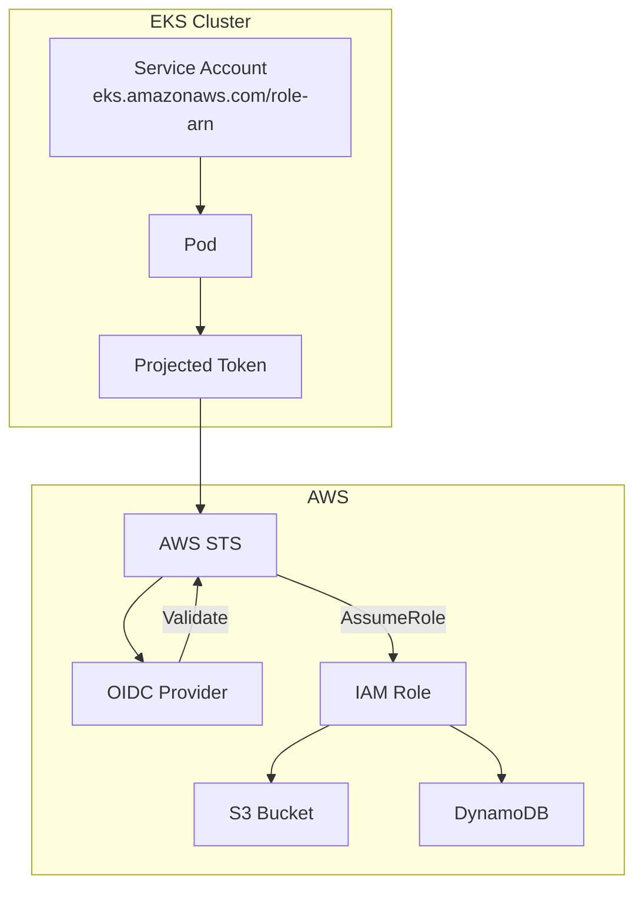

# How to Configure AWS IAM for Kubernetes

Author: [nawazdhandala](https://www.github.com/nawazdhandala)

Tags: AWS, IAM, Kubernetes, EKS, IRSA, Security, Identity Management

Description: Learn how to configure AWS IAM for Kubernetes workloads using IAM Roles for Service Accounts (IRSA). This guide covers setup, pod identity, and security best practices for EKS clusters.

---

> AWS IAM integration with Kubernetes enables fine-grained access control for pods accessing AWS services. Using IAM Roles for Service Accounts (IRSA), you can assign specific AWS permissions to individual pods without sharing long-lived credentials.

Traditional approaches to AWS access from Kubernetes involve node-level IAM roles or injecting access keys. Both approaches create security risks through over-privileged access or credential exposure. IRSA solves these problems by enabling pod-level identity.

---

## Understanding IRSA Architecture

IAM Roles for Service Accounts works through the following components:

**OIDC Identity Provider**: EKS clusters expose an OIDC endpoint that AWS IAM trusts for authentication.

**Service Account Annotations**: Kubernetes service accounts are annotated with the ARN of the IAM role they should assume.

**Projected Token Volume**: Pods receive a projected service account token that AWS STS accepts for authentication.



---

## Prerequisites

Before configuring IRSA:

- EKS cluster (v1.21+)
- AWS CLI configured with appropriate permissions
- eksctl or Terraform for infrastructure management
- kubectl configured for your cluster

---

## Enabling IRSA on EKS

Create an EKS cluster with IRSA enabled or enable it on existing clusters:

```bash
# Create new cluster with IRSA enabled
eksctl create cluster \
  --name production \
  --region us-east-1 \
  --version 1.28 \
  --with-oidc

# Enable IRSA on existing cluster
eksctl utils associate-iam-oidc-provider \
  --cluster production \
  --region us-east-1 \
  --approve

# Verify OIDC provider
aws eks describe-cluster \
  --name production \
  --query "cluster.identity.oidc.issuer" \
  --output text
```

Using Terraform:

```hcl
# eks-irsa.tf
# EKS cluster with IRSA configuration

resource "aws_eks_cluster" "production" {
  name     = "production"
  role_arn = aws_iam_role.cluster.arn
  version  = "1.28"

  vpc_config {
    subnet_ids = var.subnet_ids
  }
}

# OIDC provider for IRSA
data "tls_certificate" "eks" {
  url = aws_eks_cluster.production.identity[0].oidc[0].issuer
}

resource "aws_iam_openid_connect_provider" "eks" {
  url             = aws_eks_cluster.production.identity[0].oidc[0].issuer
  client_id_list  = ["sts.amazonaws.com"]
  thumbprint_list = [data.tls_certificate.eks.certificates[0].sha1_fingerprint]
}

# Output OIDC provider ARN for role creation
output "oidc_provider_arn" {
  value = aws_iam_openid_connect_provider.eks.arn
}

output "oidc_provider_url" {
  value = aws_eks_cluster.production.identity[0].oidc[0].issuer
}
```

---

## Creating IAM Roles for Service Accounts

Create an IAM role with the appropriate trust policy:

```hcl
# iam-role.tf
# IAM role for application service account

locals {
  oidc_provider_url = replace(aws_eks_cluster.production.identity[0].oidc[0].issuer, "https://", "")
}

# IAM role for the application
resource "aws_iam_role" "app_role" {
  name = "eks-app-role"

  assume_role_policy = jsonencode({
    Version = "2012-10-17"
    Statement = [
      {
        Effect = "Allow"
        Principal = {
          Federated = aws_iam_openid_connect_provider.eks.arn
        }
        Action = "sts:AssumeRoleWithWebIdentity"
        Condition = {
          StringEquals = {
            # Restrict to specific namespace and service account
            "${local.oidc_provider_url}:sub" = "system:serviceaccount:production:my-app"
            "${local.oidc_provider_url}:aud" = "sts.amazonaws.com"
          }
        }
      }
    ]
  })

  tags = {
    Environment = "production"
    ManagedBy   = "terraform"
  }
}

# Policy for S3 access
resource "aws_iam_role_policy" "s3_access" {
  name = "s3-access"
  role = aws_iam_role.app_role.id

  policy = jsonencode({
    Version = "2012-10-17"
    Statement = [
      {
        Effect = "Allow"
        Action = [
          "s3:GetObject",
          "s3:PutObject",
          "s3:DeleteObject",
          "s3:ListBucket"
        ]
        Resource = [
          "arn:aws:s3:::my-app-bucket",
          "arn:aws:s3:::my-app-bucket/*"
        ]
      }
    ]
  })
}

# Policy for DynamoDB access
resource "aws_iam_role_policy" "dynamodb_access" {
  name = "dynamodb-access"
  role = aws_iam_role.app_role.id

  policy = jsonencode({
    Version = "2012-10-17"
    Statement = [
      {
        Effect = "Allow"
        Action = [
          "dynamodb:GetItem",
          "dynamodb:PutItem",
          "dynamodb:UpdateItem",
          "dynamodb:DeleteItem",
          "dynamodb:Query",
          "dynamodb:Scan"
        ]
        Resource = [
          "arn:aws:dynamodb:us-east-1:${data.aws_caller_identity.current.account_id}:table/my-app-table"
        ]
      }
    ]
  })
}

output "role_arn" {
  value = aws_iam_role.app_role.arn
}
```

Using eksctl for simplified role creation:

```bash
# Create IAM role and service account together
eksctl create iamserviceaccount \
  --cluster production \
  --namespace production \
  --name my-app \
  --role-name eks-my-app-role \
  --attach-policy-arn arn:aws:iam::aws:policy/AmazonS3ReadOnlyAccess \
  --approve
```

---

## Configuring Kubernetes Service Accounts

Create and annotate the service account:

```yaml
# service-account.yaml
apiVersion: v1
kind: ServiceAccount
metadata:
  name: my-app
  namespace: production
  annotations:
    # Link to IAM role
    eks.amazonaws.com/role-arn: arn:aws:iam::123456789012:role/eks-app-role
    # Optional: Set STS regional endpoint for better performance
    eks.amazonaws.com/sts-regional-endpoints: "true"
```

Deploy pods using the service account:

```yaml
# deployment.yaml
apiVersion: apps/v1
kind: Deployment
metadata:
  name: my-app
  namespace: production
spec:
  replicas: 3
  selector:
    matchLabels:
      app: my-app
  template:
    metadata:
      labels:
        app: my-app
    spec:
      # Use the annotated service account
      serviceAccountName: my-app

      containers:
      - name: app
        image: my-app:1.0
        env:
        # AWS SDK automatically uses IRSA when these are set
        - name: AWS_REGION
          value: us-east-1
        # Optional: Override default token path
        - name: AWS_WEB_IDENTITY_TOKEN_FILE
          value: /var/run/secrets/eks.amazonaws.com/serviceaccount/token
        - name: AWS_ROLE_ARN
          value: arn:aws:iam::123456789012:role/eks-app-role

        resources:
          requests:
            cpu: 100m
            memory: 128Mi
          limits:
            cpu: 500m
            memory: 256Mi

        # Security context
        securityContext:
          runAsNonRoot: true
          readOnlyRootFilesystem: true
```

---

## Verifying IRSA Configuration

Test that IRSA is working correctly:

```bash
# Check service account annotation
kubectl get serviceaccount my-app -n production -o yaml

# Verify token is projected into pod
kubectl exec -it -n production deploy/my-app -- \
  ls -la /var/run/secrets/eks.amazonaws.com/serviceaccount/

# Verify AWS identity inside pod
kubectl exec -it -n production deploy/my-app -- \
  aws sts get-caller-identity

# Expected output:
# {
#     "UserId": "AROA...:botocore-session-...",
#     "Account": "123456789012",
#     "Arn": "arn:aws:sts::123456789012:assumed-role/eks-app-role/botocore-session-..."
# }

# Test actual AWS access
kubectl exec -it -n production deploy/my-app -- \
  aws s3 ls s3://my-app-bucket/
```

---

## Role Chaining and Cross-Account Access

Configure access to resources in different AWS accounts:

```hcl
# cross-account-role.tf
# Role in Account B that trusts the IRSA role in Account A

resource "aws_iam_role" "cross_account_role" {
  provider = aws.account_b
  name     = "cross-account-eks-role"

  assume_role_policy = jsonencode({
    Version = "2012-10-17"
    Statement = [
      {
        Effect = "Allow"
        Principal = {
          # Trust the IRSA role from Account A
          AWS = "arn:aws:iam::${var.account_a_id}:role/eks-app-role"
        }
        Action = "sts:AssumeRole"
      }
    ]
  })
}

# Policy for cross-account access
resource "aws_iam_role_policy" "cross_account_s3" {
  provider = aws.account_b
  name     = "s3-access"
  role     = aws_iam_role.cross_account_role.id

  policy = jsonencode({
    Version = "2012-10-17"
    Statement = [
      {
        Effect = "Allow"
        Action = [
          "s3:GetObject",
          "s3:ListBucket"
        ]
        Resource = [
          "arn:aws:s3:::shared-data-bucket",
          "arn:aws:s3:::shared-data-bucket/*"
        ]
      }
    ]
  })
}
```

Application code for role chaining:

```python
# app.py
# Python application using IRSA with role chaining

import boto3
from botocore.config import Config

def get_cross_account_client(service_name, role_arn, region='us-east-1'):
    """
    Create a boto3 client that assumes a cross-account role.
    The initial credentials come from IRSA automatically.
    """

    # STS client uses IRSA credentials automatically
    sts = boto3.client('sts', region_name=region)

    # Assume the cross-account role
    response = sts.assume_role(
        RoleArn=role_arn,
        RoleSessionName='cross-account-session',
        DurationSeconds=3600
    )

    credentials = response['Credentials']

    # Create client with assumed role credentials
    return boto3.client(
        service_name,
        region_name=region,
        aws_access_key_id=credentials['AccessKeyId'],
        aws_secret_access_key=credentials['SecretAccessKey'],
        aws_session_token=credentials['SessionToken']
    )

# Usage
s3_cross_account = get_cross_account_client(
    's3',
    'arn:aws:iam::987654321098:role/cross-account-eks-role'
)

# Access resources in the other account
objects = s3_cross_account.list_objects_v2(Bucket='shared-data-bucket')
```

---

## EKS Pod Identity (New Approach)

EKS Pod Identity is a newer, simpler alternative to IRSA:

```bash
# Create Pod Identity association
aws eks create-pod-identity-association \
  --cluster-name production \
  --namespace production \
  --service-account my-app \
  --role-arn arn:aws:iam::123456789012:role/eks-app-role

# Install Pod Identity agent addon
aws eks create-addon \
  --cluster-name production \
  --addon-name eks-pod-identity-agent \
  --addon-version v1.0.0-eksbuild.1
```

Using Terraform:

```hcl
# pod-identity.tf
# EKS Pod Identity configuration

# Install Pod Identity addon
resource "aws_eks_addon" "pod_identity" {
  cluster_name = aws_eks_cluster.production.name
  addon_name   = "eks-pod-identity-agent"
}

# Create Pod Identity association
resource "aws_eks_pod_identity_association" "app" {
  cluster_name    = aws_eks_cluster.production.name
  namespace       = "production"
  service_account = "my-app"
  role_arn        = aws_iam_role.app_role.arn
}

# Role for Pod Identity (simpler trust policy)
resource "aws_iam_role" "pod_identity_role" {
  name = "eks-pod-identity-role"

  assume_role_policy = jsonencode({
    Version = "2012-10-17"
    Statement = [
      {
        Effect = "Allow"
        Principal = {
          Service = "pods.eks.amazonaws.com"
        }
        Action = [
          "sts:AssumeRole",
          "sts:TagSession"
        ]
      }
    ]
  })
}
```

---

## Security Best Practices

Follow these practices for secure IAM integration:

```yaml
# secure-deployment.yaml
apiVersion: apps/v1
kind: Deployment
metadata:
  name: secure-app
  namespace: production
spec:
  replicas: 3
  selector:
    matchLabels:
      app: secure-app
  template:
    metadata:
      labels:
        app: secure-app
    spec:
      serviceAccountName: secure-app

      # Don't mount default service account token
      automountServiceAccountToken: false

      containers:
      - name: app
        image: my-app:1.0

        # Only expose necessary environment variables
        env:
        - name: AWS_REGION
          value: us-east-1
        # Don't hardcode role ARN in env vars

        securityContext:
          runAsNonRoot: true
          readOnlyRootFilesystem: true
          allowPrivilegeEscalation: false
          capabilities:
            drop:
            - ALL

        # Mount IRSA token explicitly
        volumeMounts:
        - name: aws-token
          mountPath: /var/run/secrets/eks.amazonaws.com/serviceaccount
          readOnly: true

      volumes:
      - name: aws-token
        projected:
          sources:
          - serviceAccountToken:
              path: token
              expirationSeconds: 3600
              audience: sts.amazonaws.com
```

Restrict role assumption with conditions:

```hcl
# restricted-role.tf
# IAM role with restrictive conditions

resource "aws_iam_role" "restricted_role" {
  name = "eks-restricted-role"

  assume_role_policy = jsonencode({
    Version = "2012-10-17"
    Statement = [
      {
        Effect = "Allow"
        Principal = {
          Federated = aws_iam_openid_connect_provider.eks.arn
        }
        Action = "sts:AssumeRoleWithWebIdentity"
        Condition = {
          StringEquals = {
            "${local.oidc_provider_url}:sub" = "system:serviceaccount:production:my-app"
            "${local.oidc_provider_url}:aud" = "sts.amazonaws.com"
          }
          # Additional IP restriction
          IpAddress = {
            "aws:SourceIp" = var.allowed_ip_ranges
          }
        }
      }
    ]
  })
}
```

---

## Monitoring and Auditing

Track IAM role usage with CloudTrail:

```hcl
# cloudtrail.tf
# CloudTrail for IRSA monitoring

resource "aws_cloudwatch_log_group" "irsa_audit" {
  name              = "/aws/cloudtrail/irsa-audit"
  retention_in_days = 90
}

resource "aws_cloudtrail" "irsa" {
  name                       = "irsa-audit-trail"
  s3_bucket_name            = aws_s3_bucket.cloudtrail.id
  cloud_watch_logs_group_arn = "${aws_cloudwatch_log_group.irsa_audit.arn}:*"
  cloud_watch_logs_role_arn  = aws_iam_role.cloudtrail.arn

  event_selector {
    read_write_type           = "All"
    include_management_events = true
  }
}

# CloudWatch alarm for suspicious activity
resource "aws_cloudwatch_metric_alarm" "irsa_errors" {
  alarm_name          = "irsa-assume-role-errors"
  comparison_operator = "GreaterThanThreshold"
  evaluation_periods  = 2
  metric_name         = "CallCount"
  namespace           = "AWS/STS"
  period              = 300
  statistic           = "Sum"
  threshold           = 10
  alarm_description   = "High rate of STS AssumeRole errors"

  dimensions = {
    ErrorCode = "AccessDenied"
  }
}
```

---

## Conclusion

AWS IAM integration with Kubernetes through IRSA provides secure, least-privilege access to AWS services. By assigning IAM roles to individual service accounts, you eliminate the need for shared credentials while maintaining fine-grained access control.

Start by enabling IRSA on your EKS cluster, then migrate workloads from node-level IAM roles to service account roles. Use restrictive trust policies and monitor role usage through CloudTrail to maintain a strong security posture.

---

*Monitor your AWS-integrated Kubernetes workloads with [OneUptime](https://oneuptime.com). Track IAM authentication errors, API latency, and resource access patterns across your EKS clusters.*
