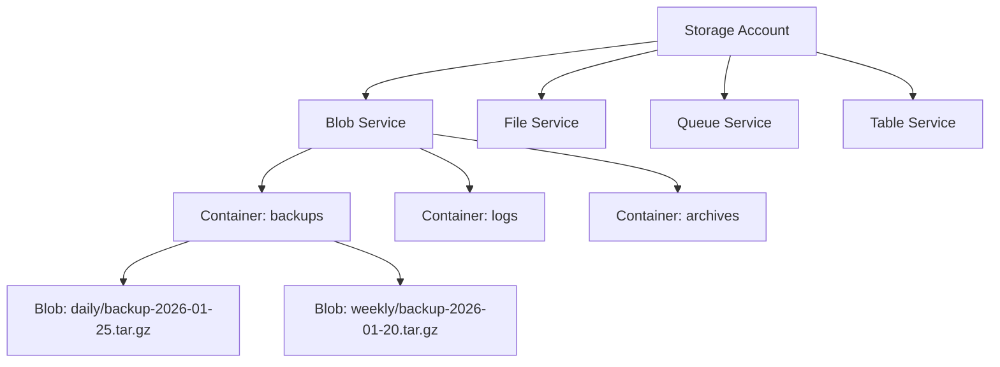

# How to Configure Azure Blob Storage Integration

Author: [nawazdhandala](https://www.github.com/nawazdhandala)

Tags: Azure, Blob Storage, Backup, Cloud Storage, DevOps

Description: A hands-on guide to integrating Azure Blob Storage for backups and application data, covering account setup, access tiers, lifecycle management, and replication options.

---

Azure Blob Storage is Microsoft's object storage service, designed for storing massive amounts of unstructured data. For backup strategies, it offers tiered storage, geo-replication, and immutability policies that meet compliance requirements. This guide covers practical integration patterns from account creation to automated backup workflows.

## Why Azure Blob Storage?

Azure Blob Storage provides several backup-friendly features:

1. **Access tiers:** Hot, Cool, Cold, and Archive tiers optimize cost based on access frequency.
2. **Geo-redundancy:** Options from local redundancy to geo-zone redundancy.
3. **Immutable storage:** WORM (Write Once, Read Many) for compliance requirements.
4. **Integration:** Native support in Azure services and backup tools.

The tradeoff is complexity in authentication options and tier management.

## Storage Account Architecture



## Creating a Storage Account

Create a storage account using Azure CLI:

```bash
# Login to Azure
az login

# Create resource group
az group create \
    --name backup-resources \
    --location eastus

# Create storage account with GRS redundancy
az storage account create \
    --name companybackups2026 \
    --resource-group backup-resources \
    --location eastus \
    --sku Standard_GRS \
    --kind StorageV2 \
    --access-tier Hot \
    --min-tls-version TLS1_2 \
    --allow-blob-public-access false

# Get connection string
az storage account show-connection-string \
    --name companybackups2026 \
    --resource-group backup-resources \
    --query connectionString \
    --output tsv
```

## Creating Containers

Organize backups with containers:

```bash
# Set connection string as environment variable
export AZURE_STORAGE_CONNECTION_STRING="DefaultEndpointsProtocol=https;AccountName=companybackups2026;..."

# Create containers
az storage container create --name daily-backups
az storage container create --name weekly-backups
az storage container create --name monthly-backups

# Create container with specific access tier
az storage container create \
    --name archives \
    --default-encryption-scope "\$account-encryption-key"

# List containers
az storage container list --output table
```

## Redundancy Options

| Option | Description | Use Case |
|--------|-------------|----------|
| LRS | 3 copies in one datacenter | Development, non-critical data |
| ZRS | 3 copies across availability zones | Production, regional availability |
| GRS | 6 copies across two regions | Disaster recovery |
| GZRS | ZRS + async copy to secondary region | Maximum durability |
| RA-GRS | GRS with read access to secondary | Read during outage |

Check current redundancy:

```bash
az storage account show \
    --name companybackups2026 \
    --resource-group backup-resources \
    --query "sku.name" \
    --output tsv
```

## Uploading Backups

Upload files using Azure CLI:

```bash
# Upload a single file
az storage blob upload \
    --container-name daily-backups \
    --name "2026-01-25/database.dump" \
    --file ./database.dump \
    --tier Hot

# Upload with metadata
az storage blob upload \
    --container-name daily-backups \
    --name "2026-01-25/app-files.tar.gz" \
    --file ./app-files.tar.gz \
    --metadata hostname=web-01 backup_type=daily

# Upload entire directory
az storage blob upload-batch \
    --destination daily-backups \
    --source ./backup-dir/ \
    --pattern "*.tar.gz"

# Download a backup
az storage blob download \
    --container-name daily-backups \
    --name "2026-01-25/database.dump" \
    --file ./restored-database.dump
```

## Access Tiers and Lifecycle Management

Azure offers multiple access tiers with different pricing:

| Tier | Storage Cost | Access Cost | Retrieval Time |
|------|--------------|-------------|----------------|
| Hot | Higher | Lower | Instant |
| Cool | Lower | Higher | Instant |
| Cold | Lower than Cool | Higher than Cool | Instant |
| Archive | Lowest | Highest | Hours |

Set blob tier on upload:

```bash
# Upload directly to Cool tier
az storage blob upload \
    --container-name weekly-backups \
    --name "backup.tar.gz" \
    --file ./backup.tar.gz \
    --tier Cool

# Change tier of existing blob
az storage blob set-tier \
    --container-name weekly-backups \
    --name "old-backup.tar.gz" \
    --tier Archive
```

Create lifecycle management policy:

```json
{
    "rules": [
        {
            "enabled": true,
            "name": "MoveToCool",
            "type": "Lifecycle",
            "definition": {
                "actions": {
                    "baseBlob": {
                        "tierToCool": {
                            "daysAfterModificationGreaterThan": 30
                        }
                    }
                },
                "filters": {
                    "blobTypes": ["blockBlob"],
                    "prefixMatch": ["daily-backups/"]
                }
            }
        },
        {
            "enabled": true,
            "name": "MoveToArchive",
            "type": "Lifecycle",
            "definition": {
                "actions": {
                    "baseBlob": {
                        "tierToArchive": {
                            "daysAfterModificationGreaterThan": 180
                        }
                    }
                },
                "filters": {
                    "blobTypes": ["blockBlob"],
                    "prefixMatch": ["daily-backups/", "weekly-backups/"]
                }
            }
        },
        {
            "enabled": true,
            "name": "DeleteOldBackups",
            "type": "Lifecycle",
            "definition": {
                "actions": {
                    "baseBlob": {
                        "delete": {
                            "daysAfterModificationGreaterThan": 730
                        }
                    }
                },
                "filters": {
                    "blobTypes": ["blockBlob"],
                    "prefixMatch": ["daily-backups/"]
                }
            }
        }
    ]
}
```

Apply the policy:

```bash
az storage account management-policy create \
    --account-name companybackups2026 \
    --resource-group backup-resources \
    --policy @lifecycle-policy.json
```

## Authentication Options

### Shared Access Signatures (SAS)

Generate time-limited access tokens:

```bash
# Generate SAS token for container (valid for 24 hours)
END_DATE=$(date -u -d "+1 day" '+%Y-%m-%dT%H:%MZ')

az storage container generate-sas \
    --name daily-backups \
    --permissions rwdl \
    --expiry "$END_DATE" \
    --output tsv

# Generate account-level SAS
az storage account generate-sas \
    --account-name companybackups2026 \
    --services b \
    --resource-types sco \
    --permissions rwdlacup \
    --expiry "$END_DATE" \
    --output tsv
```

### Service Principal Authentication

For automated backups, use a service principal:

```bash
# Create service principal
az ad sp create-for-rbac \
    --name backup-service-principal \
    --role "Storage Blob Data Contributor" \
    --scopes /subscriptions/{subscription-id}/resourceGroups/backup-resources/providers/Microsoft.Storage/storageAccounts/companybackups2026

# Output:
# {
#   "appId": "xxxxxxxx-xxxx-xxxx-xxxx-xxxxxxxxxxxx",
#   "password": "xxxxxxxxxxxxxxxxxxxxxxxxxxxxxxxx",
#   "tenant": "xxxxxxxx-xxxx-xxxx-xxxx-xxxxxxxxxxxx"
# }
```

Use in backup scripts:

```bash
#!/bin/bash
# azure-backup.sh

# Authenticate with service principal
az login --service-principal \
    --username "$AZURE_CLIENT_ID" \
    --password "$AZURE_CLIENT_SECRET" \
    --tenant "$AZURE_TENANT_ID"

# Run backup
az storage blob upload \
    --account-name companybackups2026 \
    --container-name daily-backups \
    --name "$(date +%Y-%m-%d)/backup.tar.gz" \
    --file ./backup.tar.gz \
    --auth-mode login
```

## Backup Script with Azure SDK

Python script for automated backups:

```python
#!/usr/bin/env python3
# azure_backup.py

import os
import datetime
from azure.storage.blob import BlobServiceClient, BlobClient
from azure.identity import DefaultAzureCredential

def upload_backup(local_file, container_name, blob_name):
    """Upload a backup file to Azure Blob Storage."""

    # Use DefaultAzureCredential for flexible authentication
    # Works with environment variables, managed identity, or Azure CLI
    credential = DefaultAzureCredential()

    account_url = "https://companybackups2026.blob.core.windows.net"
    blob_service_client = BlobServiceClient(account_url, credential=credential)

    # Get container client
    container_client = blob_service_client.get_container_client(container_name)

    # Upload blob with metadata
    blob_client = container_client.get_blob_client(blob_name)

    with open(local_file, "rb") as data:
        blob_client.upload_blob(
            data,
            overwrite=True,
            metadata={
                "backup_date": datetime.datetime.now().isoformat(),
                "hostname": os.uname().nodename,
                "source_file": local_file
            }
        )

    print(f"Uploaded {local_file} to {container_name}/{blob_name}")

def list_backups(container_name, prefix=""):
    """List backups in a container."""

    credential = DefaultAzureCredential()
    account_url = "https://companybackups2026.blob.core.windows.net"
    blob_service_client = BlobServiceClient(account_url, credential=credential)

    container_client = blob_service_client.get_container_client(container_name)

    blobs = container_client.list_blobs(name_starts_with=prefix)

    for blob in blobs:
        print(f"{blob.name} - {blob.size} bytes - {blob.last_modified}")

if __name__ == "__main__":
    # Example usage
    today = datetime.date.today().isoformat()

    upload_backup(
        local_file="./backup.tar.gz",
        container_name="daily-backups",
        blob_name=f"{today}/backup.tar.gz"
    )

    print("\nRecent backups:")
    list_backups("daily-backups", prefix="2026-01")
```

## Immutable Storage for Compliance

Enable immutability for regulatory compliance:

```bash
# Create container with immutability policy
az storage container immutability-policy create \
    --container-name compliance-backups \
    --account-name companybackups2026 \
    --period 365

# Lock the policy (irreversible!)
az storage container immutability-policy lock \
    --container-name compliance-backups \
    --account-name companybackups2026 \
    --if-match "<etag>"
```

## Monitoring and Alerting

Set up diagnostics and alerts:

```bash
# Enable diagnostic logging
az monitor diagnostic-settings create \
    --name backup-diagnostics \
    --resource /subscriptions/{sub-id}/resourceGroups/backup-resources/providers/Microsoft.Storage/storageAccounts/companybackups2026/blobServices/default \
    --logs '[{"category": "StorageRead", "enabled": true}, {"category": "StorageWrite", "enabled": true}]' \
    --metrics '[{"category": "Transaction", "enabled": true}]' \
    --workspace /subscriptions/{sub-id}/resourceGroups/backup-resources/providers/Microsoft.OperationalInsights/workspaces/backup-logs

# Create alert for storage capacity
az monitor metrics alert create \
    --name high-storage-usage \
    --resource-group backup-resources \
    --scopes /subscriptions/{sub-id}/resourceGroups/backup-resources/providers/Microsoft.Storage/storageAccounts/companybackups2026 \
    --condition "avg UsedCapacity > 900000000000" \
    --description "Storage account approaching 900GB"
```

## Integration with Backup Tools

### Restic with Azure

```bash
export AZURE_ACCOUNT_NAME=companybackups2026
export AZURE_ACCOUNT_KEY="your-account-key"
export RESTIC_REPOSITORY="azure:daily-backups:/"
export RESTIC_PASSWORD_FILE=/etc/restic/password

restic init
restic backup /var/www/app
```

### Velero with Azure

```bash
velero install \
    --provider azure \
    --plugins velero/velero-plugin-for-microsoft-azure:v1.9.0 \
    --bucket velero-backups \
    --backup-location-config resourceGroup=backup-resources,storageAccount=companybackups2026 \
    --secret-file ./credentials-velero
```

## Best Practices

1. **Use lifecycle policies from the start.** Moving old data to Archive tier significantly reduces costs.

2. **Enable soft delete.** Protects against accidental deletion for 7-365 days.
   ```bash
   az storage blob service-properties delete-policy update \
       --account-name companybackups2026 \
       --enable true \
       --days-retained 30
   ```

3. **Use managed identities for Azure resources.** Avoid storing credentials in backup scripts.

4. **Test archive retrieval.** Rehydrating from Archive tier takes hours. Know the process before you need it.

5. **Monitor egress costs.** Downloading large backups incurs egress charges. Budget for disaster recovery drills.

## Wrapping Up

Azure Blob Storage provides a reliable foundation for backup strategies with its tiered storage, geo-replication, and compliance features. Start with Hot tier for recent backups, configure lifecycle policies to move older data to cooler tiers, and enable immutability for compliance workloads. The key is automation. Manual processes fail when you need them most.
