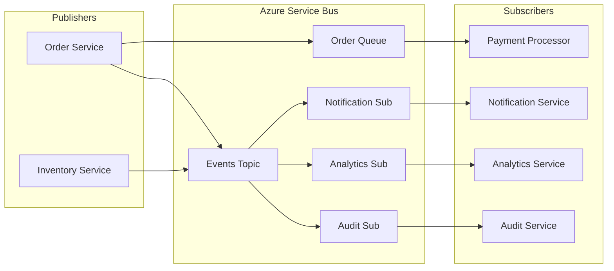

# How to Build Event-Driven Microservices with Azure Service Bus

Author: [nawazdhandala](https://www.github.com/nawazdhandala)

Tags: .NET, Azure Service Bus, Microservices, Event-Driven Architecture, C#, Messaging, Async Communication

Description: Learn how to build event-driven microservices using Azure Service Bus in .NET. This guide covers queues, topics, subscriptions, message handling patterns, and reliability features.

---

Event-driven architecture enables loose coupling between microservices by communicating through messages rather than direct API calls. Azure Service Bus provides enterprise-grade messaging capabilities that help you build reliable, scalable distributed systems.

## Azure Service Bus Architecture

Azure Service Bus offers two main messaging patterns: queues for point-to-point and topics for publish-subscribe.



## Setting Up Azure Service Bus

First, add the required NuGet package:

```bash
dotnet add package Azure.Messaging.ServiceBus
```

Configure the connection in your application:

```csharp
// Program.cs
var builder = WebApplication.CreateBuilder(args);

// Register Service Bus client
builder.Services.AddSingleton(serviceProvider =>
{
    var connectionString = builder.Configuration["AzureServiceBus:ConnectionString"];
    return new ServiceBusClient(connectionString);
});

// Register the sender for a specific queue
builder.Services.AddSingleton(serviceProvider =>
{
    var client = serviceProvider.GetRequiredService<ServiceBusClient>();
    return client.CreateSender("orders-queue");
});
```

## Sending Messages to Queues

Create a message publisher service:

```csharp
// Services/OrderMessagePublisher.cs
public interface IOrderMessagePublisher
{
    Task PublishOrderCreatedAsync(OrderCreatedMessage message, CancellationToken cancellationToken = default);
}

public class OrderMessagePublisher : IOrderMessagePublisher
{
    private readonly ServiceBusSender _sender;
    private readonly ILogger<OrderMessagePublisher> _logger;

    public OrderMessagePublisher(
        ServiceBusSender sender,
        ILogger<OrderMessagePublisher> logger)
    {
        _sender = sender;
        _logger = logger;
    }

    public async Task PublishOrderCreatedAsync(
        OrderCreatedMessage message,
        CancellationToken cancellationToken = default)
    {
        // Serialize the message to JSON
        var jsonMessage = JsonSerializer.Serialize(message);

        // Create the Service Bus message
        var serviceBusMessage = new ServiceBusMessage(jsonMessage)
        {
            // Unique message identifier for deduplication
            MessageId = message.OrderId.ToString(),

            // Content type for deserialization
            ContentType = "application/json",

            // Message subject for filtering
            Subject = "OrderCreated",

            // Correlation ID for tracking
            CorrelationId = message.CorrelationId,

            // Custom properties for routing and filtering
            ApplicationProperties =
            {
                { "EventType", "OrderCreated" },
                { "CustomerId", message.CustomerId },
                { "TotalAmount", message.TotalAmount }
            }
        };

        // Set time-to-live if needed
        serviceBusMessage.TimeToLive = TimeSpan.FromHours(24);

        try
        {
            await _sender.SendMessageAsync(serviceBusMessage, cancellationToken);
            _logger.LogInformation("Published OrderCreated message for order {OrderId}", message.OrderId);
        }
        catch (ServiceBusException ex)
        {
            _logger.LogError(ex, "Failed to publish OrderCreated message for order {OrderId}", message.OrderId);
            throw;
        }
    }
}

// Messages/OrderCreatedMessage.cs
public record OrderCreatedMessage(
    Guid OrderId,
    string CustomerId,
    decimal TotalAmount,
    List<OrderItem> Items,
    DateTime CreatedAt,
    string CorrelationId);

public record OrderItem(string ProductId, int Quantity, decimal Price);
```

## Batch Message Publishing

For high-throughput scenarios, send messages in batches:

```csharp
// Services/BatchMessagePublisher.cs
public class BatchMessagePublisher
{
    private readonly ServiceBusSender _sender;
    private readonly ILogger<BatchMessagePublisher> _logger;

    public BatchMessagePublisher(ServiceBusSender sender, ILogger<BatchMessagePublisher> logger)
    {
        _sender = sender;
        _logger = logger;
    }

    public async Task PublishBatchAsync<T>(
        IEnumerable<T> messages,
        CancellationToken cancellationToken = default)
    {
        // Create a batch for efficient sending
        using var messageBatch = await _sender.CreateMessageBatchAsync(cancellationToken);

        var processedCount = 0;
        var batchCount = 0;

        foreach (var message in messages)
        {
            var json = JsonSerializer.Serialize(message);
            var serviceBusMessage = new ServiceBusMessage(json)
            {
                ContentType = "application/json"
            };

            // Try to add the message to the batch
            if (!messageBatch.TryAddMessage(serviceBusMessage))
            {
                // Batch is full, send it and create a new one
                if (messageBatch.Count > 0)
                {
                    await _sender.SendMessagesAsync(messageBatch, cancellationToken);
                    batchCount++;
                    _logger.LogInformation("Sent batch {BatchNumber} with {Count} messages",
                        batchCount, messageBatch.Count);
                }

                // Start a new batch with the current message
                using var newBatch = await _sender.CreateMessageBatchAsync(cancellationToken);
                if (!newBatch.TryAddMessage(serviceBusMessage))
                {
                    throw new InvalidOperationException("Message too large for Service Bus");
                }
            }

            processedCount++;
        }

        // Send remaining messages
        if (messageBatch.Count > 0)
        {
            await _sender.SendMessagesAsync(messageBatch, cancellationToken);
            batchCount++;
        }

        _logger.LogInformation("Published {Total} messages in {Batches} batches",
            processedCount, batchCount);
    }
}
```

## Processing Messages from Queues

Create a background worker to process queue messages:

```csharp
// Workers/OrderProcessorWorker.cs
public class OrderProcessorWorker : BackgroundService
{
    private readonly ServiceBusProcessor _processor;
    private readonly IServiceScopeFactory _scopeFactory;
    private readonly ILogger<OrderProcessorWorker> _logger;

    public OrderProcessorWorker(
        ServiceBusClient client,
        IServiceScopeFactory scopeFactory,
        ILogger<OrderProcessorWorker> logger)
    {
        _scopeFactory = scopeFactory;
        _logger = logger;

        // Create a processor for the queue
        _processor = client.CreateProcessor("orders-queue", new ServiceBusProcessorOptions
        {
            // Number of concurrent calls
            MaxConcurrentCalls = 10,

            // Auto-complete messages after processing
            AutoCompleteMessages = false,

            // Prefetch messages for performance
            PrefetchCount = 20,

            // Receive mode
            ReceiveMode = ServiceBusReceiveMode.PeekLock
        });

        // Register handlers
        _processor.ProcessMessageAsync += ProcessMessageAsync;
        _processor.ProcessErrorAsync += ProcessErrorAsync;
    }

    protected override async Task ExecuteAsync(CancellationToken stoppingToken)
    {
        _logger.LogInformation("Starting Order Processor Worker");
        await _processor.StartProcessingAsync(stoppingToken);

        // Keep running until cancelled
        await Task.Delay(Timeout.Infinite, stoppingToken);
    }

    public override async Task StopAsync(CancellationToken cancellationToken)
    {
        _logger.LogInformation("Stopping Order Processor Worker");
        await _processor.StopProcessingAsync(cancellationToken);
        await base.StopAsync(cancellationToken);
    }

    private async Task ProcessMessageAsync(ProcessMessageEventArgs args)
    {
        var messageId = args.Message.MessageId;
        var correlationId = args.Message.CorrelationId;

        _logger.LogInformation("Processing message {MessageId} with correlation {CorrelationId}",
            messageId, correlationId);

        try
        {
            // Deserialize the message
            var orderMessage = JsonSerializer.Deserialize<OrderCreatedMessage>(
                args.Message.Body.ToString());

            if (orderMessage == null)
            {
                _logger.LogWarning("Failed to deserialize message {MessageId}", messageId);
                await args.DeadLetterMessageAsync(args.Message,
                    "DeserializationError",
                    "Could not deserialize message body");
                return;
            }

            // Create a scope for scoped services
            using var scope = _scopeFactory.CreateScope();
            var orderService = scope.ServiceProvider.GetRequiredService<IOrderService>();

            // Process the order
            await orderService.ProcessOrderAsync(orderMessage, args.CancellationToken);

            // Complete the message to remove from queue
            await args.CompleteMessageAsync(args.Message);
            _logger.LogInformation("Successfully processed message {MessageId}", messageId);
        }
        catch (Exception ex)
        {
            _logger.LogError(ex, "Error processing message {MessageId}", messageId);

            // Check delivery count for poison message handling
            if (args.Message.DeliveryCount >= 5)
            {
                _logger.LogWarning("Message {MessageId} exceeded max delivery count, dead-lettering",
                    messageId);
                await args.DeadLetterMessageAsync(args.Message,
                    "MaxDeliveryCountExceeded",
                    ex.Message);
            }
            else
            {
                // Abandon to retry later
                await args.AbandonMessageAsync(args.Message);
            }
        }
    }

    private Task ProcessErrorAsync(ProcessErrorEventArgs args)
    {
        _logger.LogError(args.Exception,
            "Error in message processor. Source: {Source}, Namespace: {Namespace}, Entity: {Entity}",
            args.ErrorSource,
            args.FullyQualifiedNamespace,
            args.EntityPath);

        return Task.CompletedTask;
    }
}
```

## Topics and Subscriptions

For publish-subscribe patterns, use topics and subscriptions:

```csharp
// Services/EventPublisher.cs
public class EventPublisher : IEventPublisher
{
    private readonly ServiceBusClient _client;
    private readonly ILogger<EventPublisher> _logger;

    public EventPublisher(ServiceBusClient client, ILogger<EventPublisher> logger)
    {
        _client = client;
        _logger = logger;
    }

    public async Task PublishAsync<T>(T @event, CancellationToken cancellationToken = default)
        where T : IIntegrationEvent
    {
        var topicName = GetTopicName(@event);
        await using var sender = _client.CreateSender(topicName);

        var message = new ServiceBusMessage(JsonSerializer.Serialize(@event))
        {
            MessageId = @event.EventId.ToString(),
            Subject = @event.GetType().Name,
            ContentType = "application/json",
            CorrelationId = @event.CorrelationId,
            ApplicationProperties =
            {
                { "EventType", @event.GetType().Name },
                { "EventVersion", @event.Version },
                { "Timestamp", @event.Timestamp.ToString("O") }
            }
        };

        await sender.SendMessageAsync(message, cancellationToken);
        _logger.LogInformation("Published event {EventType} with ID {EventId}",
            @event.GetType().Name, @event.EventId);
    }

    private string GetTopicName<T>(T @event) where T : IIntegrationEvent
    {
        // Map event types to topics
        return @event switch
        {
            OrderEvent => "order-events",
            InventoryEvent => "inventory-events",
            PaymentEvent => "payment-events",
            _ => "default-events"
        };
    }
}

// Events/IntegrationEvent.cs
public interface IIntegrationEvent
{
    Guid EventId { get; }
    string CorrelationId { get; }
    DateTime Timestamp { get; }
    int Version { get; }
}

public abstract record IntegrationEvent : IIntegrationEvent
{
    public Guid EventId { get; init; } = Guid.NewGuid();
    public string CorrelationId { get; init; } = Guid.NewGuid().ToString();
    public DateTime Timestamp { get; init; } = DateTime.UtcNow;
    public int Version { get; init; } = 1;
}

public abstract record OrderEvent : IntegrationEvent;
public record OrderPlacedEvent(Guid OrderId, string CustomerId, decimal Total) : OrderEvent;
public record OrderShippedEvent(Guid OrderId, string TrackingNumber) : OrderEvent;
```

## Subscription Worker with Filtering

Process messages from topic subscriptions with filters:

```csharp
// Workers/NotificationWorker.cs
public class NotificationWorker : BackgroundService
{
    private readonly ServiceBusProcessor _processor;
    private readonly IServiceScopeFactory _scopeFactory;
    private readonly ILogger<NotificationWorker> _logger;

    public NotificationWorker(
        ServiceBusClient client,
        IServiceScopeFactory scopeFactory,
        ILogger<NotificationWorker> logger)
    {
        _scopeFactory = scopeFactory;
        _logger = logger;

        // Create processor for topic subscription
        _processor = client.CreateProcessor(
            topicName: "order-events",
            subscriptionName: "notification-subscription",
            new ServiceBusProcessorOptions
            {
                MaxConcurrentCalls = 5,
                AutoCompleteMessages = false
            });

        _processor.ProcessMessageAsync += HandleMessageAsync;
        _processor.ProcessErrorAsync += HandleErrorAsync;
    }

    protected override async Task ExecuteAsync(CancellationToken stoppingToken)
    {
        await _processor.StartProcessingAsync(stoppingToken);
        await Task.Delay(Timeout.Infinite, stoppingToken);
    }

    private async Task HandleMessageAsync(ProcessMessageEventArgs args)
    {
        var eventType = args.Message.ApplicationProperties["EventType"]?.ToString();

        using var scope = _scopeFactory.CreateScope();
        var notificationService = scope.ServiceProvider.GetRequiredService<INotificationService>();

        try
        {
            switch (eventType)
            {
                case nameof(OrderPlacedEvent):
                    var orderPlaced = JsonSerializer.Deserialize<OrderPlacedEvent>(
                        args.Message.Body.ToString());
                    await notificationService.SendOrderConfirmationAsync(orderPlaced!);
                    break;

                case nameof(OrderShippedEvent):
                    var orderShipped = JsonSerializer.Deserialize<OrderShippedEvent>(
                        args.Message.Body.ToString());
                    await notificationService.SendShipmentNotificationAsync(orderShipped!);
                    break;

                default:
                    _logger.LogWarning("Unknown event type: {EventType}", eventType);
                    break;
            }

            await args.CompleteMessageAsync(args.Message);
        }
        catch (Exception ex)
        {
            _logger.LogError(ex, "Failed to process {EventType}", eventType);
            await args.AbandonMessageAsync(args.Message);
        }
    }

    private Task HandleErrorAsync(ProcessErrorEventArgs args)
    {
        _logger.LogError(args.Exception, "Notification worker error");
        return Task.CompletedTask;
    }
}
```

## Message Scheduling and Deferral

Schedule messages for future delivery:

```csharp
// Services/ScheduledMessageService.cs
public class ScheduledMessageService
{
    private readonly ServiceBusSender _sender;

    public ScheduledMessageService(ServiceBusSender sender)
    {
        _sender = sender;
    }

    // Schedule a message for future delivery
    public async Task<long> ScheduleReminderAsync(
        ReminderMessage reminder,
        DateTimeOffset scheduledTime,
        CancellationToken cancellationToken = default)
    {
        var message = new ServiceBusMessage(JsonSerializer.Serialize(reminder))
        {
            MessageId = Guid.NewGuid().ToString(),
            Subject = "Reminder"
        };

        // Schedule the message and get the sequence number
        var sequenceNumber = await _sender.ScheduleMessageAsync(
            message,
            scheduledTime,
            cancellationToken);

        return sequenceNumber;
    }

    // Cancel a scheduled message
    public async Task CancelScheduledMessageAsync(
        long sequenceNumber,
        CancellationToken cancellationToken = default)
    {
        await _sender.CancelScheduledMessageAsync(sequenceNumber, cancellationToken);
    }
}
```

## Session-Based Processing

For ordered message processing, use sessions:

```csharp
// Workers/SessionWorker.cs
public class SessionWorker : BackgroundService
{
    private readonly ServiceBusSessionProcessor _processor;
    private readonly ILogger<SessionWorker> _logger;

    public SessionWorker(ServiceBusClient client, ILogger<SessionWorker> logger)
    {
        _logger = logger;

        // Create a session processor
        _processor = client.CreateSessionProcessor("session-queue",
            new ServiceBusSessionProcessorOptions
            {
                MaxConcurrentSessions = 8,
                MaxConcurrentCallsPerSession = 1, // Ordered processing
                AutoCompleteMessages = false
            });

        _processor.ProcessMessageAsync += ProcessSessionMessageAsync;
        _processor.ProcessErrorAsync += ProcessErrorAsync;
    }

    protected override async Task ExecuteAsync(CancellationToken stoppingToken)
    {
        await _processor.StartProcessingAsync(stoppingToken);
        await Task.Delay(Timeout.Infinite, stoppingToken);
    }

    private async Task ProcessSessionMessageAsync(ProcessSessionMessageEventArgs args)
    {
        var sessionId = args.SessionId;
        var sequenceNumber = args.Message.SequenceNumber;

        _logger.LogInformation(
            "Processing message {Sequence} in session {Session}",
            sequenceNumber, sessionId);

        // Messages within a session are processed in order
        // Process your message here

        await args.CompleteMessageAsync(args.Message);
    }

    private Task ProcessErrorAsync(ProcessErrorEventArgs args)
    {
        _logger.LogError(args.Exception, "Session processor error");
        return Task.CompletedTask;
    }
}

// Sending session messages
public async Task SendSessionMessageAsync(string sessionId, object payload)
{
    var message = new ServiceBusMessage(JsonSerializer.Serialize(payload))
    {
        SessionId = sessionId // Messages with same SessionId are processed in order
    };

    await _sender.SendMessageAsync(message);
}
```

## Dead Letter Queue Handling

Process messages that failed processing:

```csharp
// Workers/DeadLetterProcessor.cs
public class DeadLetterProcessor : BackgroundService
{
    private readonly ServiceBusReceiver _receiver;
    private readonly IServiceScopeFactory _scopeFactory;
    private readonly ILogger<DeadLetterProcessor> _logger;

    public DeadLetterProcessor(
        ServiceBusClient client,
        IServiceScopeFactory scopeFactory,
        ILogger<DeadLetterProcessor> logger)
    {
        _scopeFactory = scopeFactory;
        _logger = logger;

        // Create receiver for dead letter queue
        _receiver = client.CreateReceiver(
            "orders-queue",
            new ServiceBusReceiverOptions
            {
                SubQueue = SubQueue.DeadLetter,
                ReceiveMode = ServiceBusReceiveMode.PeekLock
            });
    }

    protected override async Task ExecuteAsync(CancellationToken stoppingToken)
    {
        while (!stoppingToken.IsCancellationRequested)
        {
            var messages = await _receiver.ReceiveMessagesAsync(
                maxMessages: 10,
                maxWaitTime: TimeSpan.FromSeconds(30),
                cancellationToken: stoppingToken);

            foreach (var message in messages)
            {
                await ProcessDeadLetterAsync(message, stoppingToken);
            }

            await Task.Delay(TimeSpan.FromMinutes(1), stoppingToken);
        }
    }

    private async Task ProcessDeadLetterAsync(
        ServiceBusReceivedMessage message,
        CancellationToken cancellationToken)
    {
        var deadLetterReason = message.DeadLetterReason;
        var deadLetterDescription = message.DeadLetterErrorDescription;

        _logger.LogWarning(
            "Processing dead letter: {Reason} - {Description}",
            deadLetterReason, deadLetterDescription);

        using var scope = _scopeFactory.CreateScope();
        var alertService = scope.ServiceProvider.GetRequiredService<IAlertService>();

        // Send alert for investigation
        await alertService.SendDeadLetterAlertAsync(new DeadLetterAlert
        {
            MessageId = message.MessageId,
            Reason = deadLetterReason,
            Description = deadLetterDescription,
            Body = message.Body.ToString(),
            EnqueuedTime = message.EnqueuedTime
        });

        // Complete to remove from DLQ
        await _receiver.CompleteMessageAsync(message, cancellationToken);
    }
}
```

## Best Practices

| Practice | Description |
|----------|-------------|
| Use message IDs | Enable duplicate detection with unique IDs |
| Set TTL appropriately | Prevent queue buildup with message expiration |
| Handle dead letters | Monitor and process failed messages |
| Use sessions for ordering | Group related messages by session ID |
| Implement idempotency | Handle duplicate message delivery |
| Monitor queue metrics | Track queue depth and processing rates |

## Summary

Azure Service Bus provides robust messaging capabilities for event-driven microservices:

- Use queues for point-to-point messaging
- Use topics and subscriptions for publish-subscribe patterns
- Implement proper error handling with dead letter queues
- Use sessions for ordered message processing
- Schedule messages for delayed delivery
- Process messages in batches for high throughput

---

*Need to monitor your event-driven microservices? [OneUptime](https://oneuptime.com) provides comprehensive observability for distributed systems with Azure Service Bus integration.*

**Related Reading:**
- [How to Build Background Services with .NET Worker Service](https://oneuptime.com/blog/post/2026-01-25-dotnet-worker-service-background-services/view) - Background processing
- [How to Build Health Probes with ASP.NET Core Health Checks](https://oneuptime.com/blog/post/2026-01-25-aspnet-core-health-checks/view) - Service health monitoring
