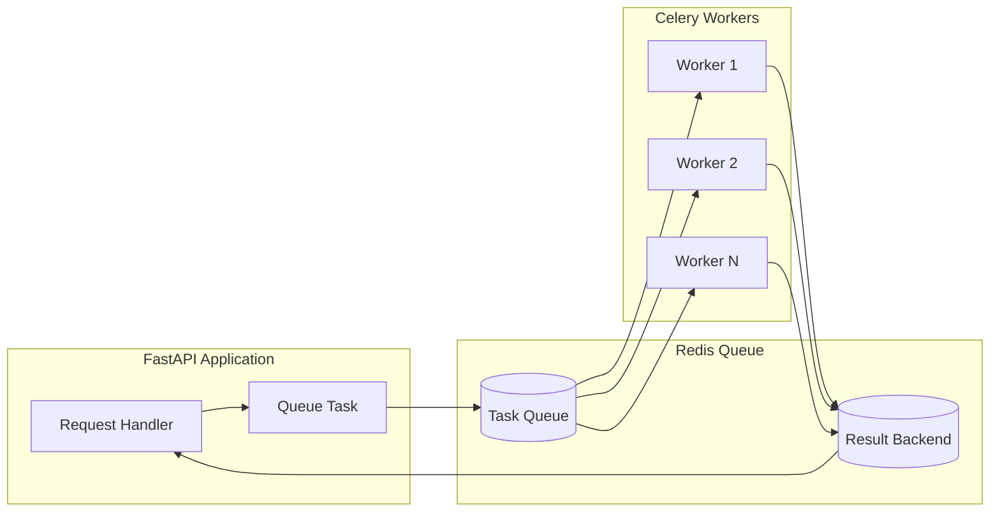

# How to Build Background Task Processing in FastAPI

Author: [nawazdhandala](https://www.github.com/nawazdhandala)

Tags: Python, FastAPI, Background Tasks, Async, Celery, Redis, Task Queue, Performance

Description: Learn how to implement background task processing in FastAPI using built-in BackgroundTasks, Celery with Redis, and custom task queues. This guide covers practical patterns for offloading work from your API handlers.

---

> When your API needs to do something that takes longer than a few hundred milliseconds, you should not make your users wait. Background tasks let you acknowledge the request immediately and do the heavy lifting asynchronously.

Every production API eventually needs background task processing. Whether you are sending emails, processing uploads, generating reports, or syncing data with external services, blocking your request handlers is not an option. FastAPI provides multiple approaches to solve this problem, each with different tradeoffs.

---

## Understanding Background Task Patterns

Before diving into code, let us understand when to use each approach:

| Pattern | Best For | Persistence | Scalability |
|---------|----------|-------------|-------------|
| **BackgroundTasks** | Quick, fire-and-forget tasks | None | Single process |
| **asyncio.create_task** | Async I/O bound tasks | None | Single process |
| **Celery + Redis** | Long-running, distributed tasks | Yes | Horizontal |
| **Custom Queue** | Full control over behavior | Configurable | Depends |

---

## FastAPI Built-in BackgroundTasks

FastAPI includes a simple mechanism for running tasks after a response is sent. This is perfect for lightweight operations that do not need persistence or distribution.

```python
# background_tasks_basic.py
# Using FastAPI's built-in BackgroundTasks for simple async work
from fastapi import FastAPI, BackgroundTasks
from datetime import datetime
import time

app = FastAPI()

def write_audit_log(user_id: str, action: str):
    """
    Write an audit log entry to a file.
    This runs after the response is sent to the client.
    """
    timestamp = datetime.utcnow().isoformat()
    log_entry = f"{timestamp} - User {user_id}: {action}\n"

    # Simulate some I/O work
    with open("audit.log", "a") as f:
        f.write(log_entry)

def send_welcome_email(email: str, name: str):
    """
    Send a welcome email to a new user.
    In production, this would call your email service.
    """
    # Simulate email sending delay
    time.sleep(2)
    print(f"Welcome email sent to {name} at {email}")

@app.post("/users/")
async def create_user(
    email: str,
    name: str,
    background_tasks: BackgroundTasks
):
    """
    Create a new user and schedule background tasks.
    The response returns immediately while tasks run in the background.
    """
    # Create user in database (simulated)
    user_id = "user_12345"

    # Schedule background tasks - these run AFTER the response
    background_tasks.add_task(write_audit_log, user_id, "account_created")
    background_tasks.add_task(send_welcome_email, email, name)

    # Response sent immediately - user does not wait for email
    return {
        "user_id": user_id,
        "message": "User created successfully"
    }
```

### Chaining Multiple Background Tasks

You can add multiple tasks, and they will run sequentially after the response is sent.

```python
# background_tasks_chain.py
# Chaining multiple background tasks with dependencies
from fastapi import FastAPI, BackgroundTasks, Depends
from typing import List

app = FastAPI()

class TaskCollector:
    """Collects tasks from multiple dependencies"""

    def __init__(self):
        self.tasks: List[tuple] = []

    def add(self, func, *args, **kwargs):
        self.tasks.append((func, args, kwargs))

async def get_task_collector():
    """Dependency that provides a task collector"""
    return TaskCollector()

def process_image(image_id: str, operations: List[str]):
    """Process an image with the given operations"""
    for op in operations:
        print(f"Applying {op} to image {image_id}")
        # Simulate processing time
        time.sleep(1)

def update_search_index(image_id: str, metadata: dict):
    """Update the search index with image metadata"""
    print(f"Indexing image {image_id}: {metadata}")

def notify_webhooks(image_id: str, event: str):
    """Notify registered webhooks about the image event"""
    print(f"Sending webhook for {event} on image {image_id}")

@app.post("/images/{image_id}/process")
async def process_image_endpoint(
    image_id: str,
    operations: List[str],
    background_tasks: BackgroundTasks
):
    """
    Queue multiple processing tasks for an image.
    Tasks run in the order they are added.
    """
    # Queue the tasks in order of dependency
    background_tasks.add_task(
        process_image,
        image_id,
        operations
    )
    background_tasks.add_task(
        update_search_index,
        image_id,
        {"operations": operations, "status": "processed"}
    )
    background_tasks.add_task(
        notify_webhooks,
        image_id,
        "processing_complete"
    )

    return {"status": "processing_queued", "image_id": image_id}
```

---

## Using asyncio for Async Background Tasks

When your background work is I/O bound and you want it to run concurrently with other async operations, use `asyncio.create_task`.

```python
# async_background_tasks.py
# Using asyncio for concurrent background task execution
from fastapi import FastAPI
import asyncio
import httpx
from datetime import datetime

app = FastAPI()

# Store for tracking running tasks
running_tasks: set = set()

async def fetch_and_cache_data(url: str, cache_key: str):
    """
    Fetch data from an external API and cache it.
    This runs concurrently with other async operations.
    """
    async with httpx.AsyncClient() as client:
        try:
            response = await client.get(url, timeout=30.0)
            data = response.json()

            # Cache the result (using a simple dict for demo)
            cache[cache_key] = {
                "data": data,
                "fetched_at": datetime.utcnow().isoformat()
            }
            print(f"Cached data for {cache_key}")

        except Exception as e:
            print(f"Failed to fetch {url}: {e}")

# Simple in-memory cache
cache: dict = {}

async def sync_external_service(user_id: str, changes: dict):
    """
    Sync user changes to an external service.
    Runs in the background without blocking the response.
    """
    async with httpx.AsyncClient() as client:
        try:
            await client.post(
                f"https://api.example.com/users/{user_id}/sync",
                json=changes,
                timeout=60.0
            )
        except Exception as e:
            # Log the error but do not crash - this is background work
            print(f"Sync failed for user {user_id}: {e}")

def create_tracked_task(coro):
    """
    Create a task and track it so we can wait for cleanup.
    """
    task = asyncio.create_task(coro)
    running_tasks.add(task)
    task.add_done_callback(running_tasks.discard)
    return task

@app.post("/users/{user_id}/settings")
async def update_user_settings(user_id: str, settings: dict):
    """
    Update user settings and sync to external services.
    The sync happens in the background after response.
    """
    # Update settings in local database
    # ... database update code ...

    # Fire and forget - sync to external service in background
    create_tracked_task(
        sync_external_service(user_id, settings)
    )

    # Response returns immediately
    return {"status": "updated", "user_id": user_id}

@app.on_event("shutdown")
async def shutdown():
    """Wait for background tasks to complete on shutdown"""
    if running_tasks:
        print(f"Waiting for {len(running_tasks)} background tasks...")
        await asyncio.gather(*running_tasks, return_exceptions=True)
```

---

## Production-Ready Celery Integration

For tasks that need persistence, retries, and horizontal scaling, Celery with Redis is the standard choice. Here is a complete setup.

```python
# celery_config.py
# Celery configuration for production task processing
from celery import Celery
from kombu import Exchange, Queue

# Create Celery application with Redis as broker and backend
celery_app = Celery(
    "tasks",
    broker="redis://localhost:6379/0",
    backend="redis://localhost:6379/1"
)

# Configure Celery for production use
celery_app.conf.update(
    # Serialization settings
    task_serializer="json",
    accept_content=["json"],
    result_serializer="json",

    # Timezone handling
    timezone="UTC",
    enable_utc=True,

    # Task execution settings
    task_acks_late=True,  # Acknowledge after task completes
    task_reject_on_worker_lost=True,  # Re-queue if worker dies

    # Result expiration (1 hour)
    result_expires=3600,

    # Concurrency settings
    worker_prefetch_multiplier=1,  # Fetch one task at a time

    # Retry settings
    task_default_retry_delay=60,  # 1 minute between retries
    task_max_retries=3,

    # Define queues for different task priorities
    task_queues=(
        Queue("high", Exchange("high"), routing_key="high"),
        Queue("default", Exchange("default"), routing_key="default"),
        Queue("low", Exchange("low"), routing_key="low"),
    ),
    task_default_queue="default",
)
```

```python
# tasks.py
# Celery task definitions with retry logic and error handling
from celery_config import celery_app
from celery.exceptions import MaxRetriesExceededError
import httpx
import time

@celery_app.task(
    bind=True,
    max_retries=3,
    default_retry_delay=60,
    autoretry_for=(httpx.HTTPError,),
    retry_backoff=True  # Exponential backoff on retries
)
def send_email_task(self, to_email: str, subject: str, body: str):
    """
    Send an email via external service.
    Automatically retries on HTTP errors with exponential backoff.
    """
    try:
        with httpx.Client() as client:
            response = client.post(
                "https://api.emailservice.com/send",
                json={
                    "to": to_email,
                    "subject": subject,
                    "body": body
                },
                timeout=30.0
            )
            response.raise_for_status()
            return {"status": "sent", "email": to_email}

    except httpx.HTTPError as e:
        # Log the retry attempt
        print(f"Email send failed, attempt {self.request.retries + 1}: {e}")
        raise  # Let Celery handle the retry

@celery_app.task(bind=True)
def process_report_task(self, report_id: str, parameters: dict):
    """
    Generate a report - this can take several minutes.
    Updates status in database so users can track progress.
    """
    try:
        # Update status to processing
        update_report_status(report_id, "processing", 0)

        # Step 1: Fetch data (25%)
        data = fetch_report_data(parameters)
        update_report_status(report_id, "processing", 25)

        # Step 2: Transform data (50%)
        transformed = transform_data(data)
        update_report_status(report_id, "processing", 50)

        # Step 3: Generate output (75%)
        output = generate_output(transformed)
        update_report_status(report_id, "processing", 75)

        # Step 4: Save and complete (100%)
        save_report(report_id, output)
        update_report_status(report_id, "complete", 100)

        return {"status": "complete", "report_id": report_id}

    except Exception as e:
        update_report_status(report_id, "failed", error=str(e))
        raise

@celery_app.task(
    bind=True,
    queue="high"  # Route to high priority queue
)
def critical_notification_task(self, user_id: str, message: str):
    """
    Send a critical notification - routed to high priority queue.
    """
    # Send via multiple channels for critical alerts
    send_push_notification(user_id, message)
    send_sms_notification(user_id, message)
    return {"status": "sent", "user_id": user_id}
```

```python
# fastapi_celery.py
# FastAPI integration with Celery task queue
from fastapi import FastAPI, HTTPException
from celery.result import AsyncResult
from tasks import send_email_task, process_report_task

app = FastAPI()

@app.post("/reports/")
async def create_report(parameters: dict):
    """
    Queue a report generation job.
    Returns a task ID that can be used to check status.
    """
    report_id = generate_report_id()

    # Queue the task - returns immediately
    task = process_report_task.delay(report_id, parameters)

    return {
        "report_id": report_id,
        "task_id": task.id,
        "status": "queued",
        "status_url": f"/reports/{report_id}/status"
    }

@app.get("/reports/{report_id}/status")
async def get_report_status(report_id: str):
    """
    Check the status of a report generation task.
    """
    # Get status from database (set by the task)
    status = get_report_status_from_db(report_id)

    if not status:
        raise HTTPException(status_code=404, detail="Report not found")

    return status

@app.get("/tasks/{task_id}")
async def get_task_status(task_id: str):
    """
    Check the status of any Celery task by ID.
    """
    result = AsyncResult(task_id)

    response = {
        "task_id": task_id,
        "status": result.status,
    }

    if result.ready():
        if result.successful():
            response["result"] = result.get()
        else:
            response["error"] = str(result.result)

    return response
```

---

## Task Queue Architecture

Here is how the components interact in a production setup:



---

## Custom In-Process Task Queue

Sometimes you need more control than BackgroundTasks provides but do not want the complexity of Celery. Here is a custom solution using asyncio queues.

```python
# custom_task_queue.py
# Custom async task queue with worker pool and graceful shutdown
import asyncio
from typing import Callable, Any
from dataclasses import dataclass
from datetime import datetime
import uuid

@dataclass
class Task:
    """Represents a queued task"""
    id: str
    func: Callable
    args: tuple
    kwargs: dict
    created_at: datetime
    priority: int = 0  # Higher number = higher priority

class TaskQueue:
    """
    Custom async task queue with configurable worker pool.
    Provides more control than BackgroundTasks without Celery overhead.
    """

    def __init__(self, num_workers: int = 4, max_queue_size: int = 1000):
        self.num_workers = num_workers
        self.max_queue_size = max_queue_size
        self.queue: asyncio.PriorityQueue = None
        self.workers: list = []
        self.shutdown_event: asyncio.Event = None
        self.results: dict = {}  # Store task results

    async def start(self):
        """Initialize the queue and start worker tasks"""
        self.queue = asyncio.PriorityQueue(maxsize=self.max_queue_size)
        self.shutdown_event = asyncio.Event()

        # Start worker coroutines
        for i in range(self.num_workers):
            worker = asyncio.create_task(self._worker(f"worker-{i}"))
            self.workers.append(worker)

        print(f"Started {self.num_workers} task queue workers")

    async def stop(self, timeout: float = 30.0):
        """Gracefully shutdown the queue and workers"""
        print("Shutting down task queue...")
        self.shutdown_event.set()

        # Wait for workers to finish with timeout
        try:
            await asyncio.wait_for(
                asyncio.gather(*self.workers, return_exceptions=True),
                timeout=timeout
            )
        except asyncio.TimeoutError:
            print("Timeout waiting for workers, cancelling...")
            for worker in self.workers:
                worker.cancel()

    async def enqueue(
        self,
        func: Callable,
        *args,
        priority: int = 0,
        **kwargs
    ) -> str:
        """
        Add a task to the queue.
        Returns a task ID for status tracking.
        """
        task_id = str(uuid.uuid4())
        task = Task(
            id=task_id,
            func=func,
            args=args,
            kwargs=kwargs,
            created_at=datetime.utcnow(),
            priority=-priority  # Negative because PriorityQueue is min-heap
        )

        # Store initial status
        self.results[task_id] = {"status": "queued"}

        # Add to queue (blocks if queue is full)
        await self.queue.put((task.priority, task))

        return task_id

    def get_status(self, task_id: str) -> dict:
        """Get the status of a task by ID"""
        return self.results.get(task_id, {"status": "unknown"})

    async def _worker(self, worker_name: str):
        """Worker coroutine that processes tasks from the queue"""
        while not self.shutdown_event.is_set():
            try:
                # Wait for a task with timeout so we can check shutdown
                priority, task = await asyncio.wait_for(
                    self.queue.get(),
                    timeout=1.0
                )
            except asyncio.TimeoutError:
                continue  # Check shutdown_event and try again

            # Update status to running
            self.results[task.id] = {"status": "running", "worker": worker_name}

            try:
                # Execute the task
                if asyncio.iscoroutinefunction(task.func):
                    result = await task.func(*task.args, **task.kwargs)
                else:
                    # Run sync functions in thread pool
                    result = await asyncio.get_event_loop().run_in_executor(
                        None,
                        lambda: task.func(*task.args, **task.kwargs)
                    )

                # Store successful result
                self.results[task.id] = {
                    "status": "complete",
                    "result": result,
                    "completed_at": datetime.utcnow().isoformat()
                }

            except Exception as e:
                # Store error information
                self.results[task.id] = {
                    "status": "failed",
                    "error": str(e),
                    "failed_at": datetime.utcnow().isoformat()
                }

            finally:
                self.queue.task_done()
```

```python
# fastapi_custom_queue.py
# FastAPI integration with custom task queue
from fastapi import FastAPI
from contextlib import asynccontextmanager
from custom_task_queue import TaskQueue

# Create the task queue instance
task_queue = TaskQueue(num_workers=4)

@asynccontextmanager
async def lifespan(app: FastAPI):
    """Manage task queue lifecycle"""
    await task_queue.start()
    yield
    await task_queue.stop()

app = FastAPI(lifespan=lifespan)

async def expensive_computation(data: dict) -> dict:
    """Simulate an expensive async computation"""
    await asyncio.sleep(5)  # Simulate work
    return {"processed": data, "timestamp": datetime.utcnow().isoformat()}

@app.post("/compute/")
async def queue_computation(data: dict):
    """Queue an expensive computation"""
    task_id = await task_queue.enqueue(
        expensive_computation,
        data,
        priority=1  # Higher priority
    )

    return {
        "task_id": task_id,
        "status_url": f"/tasks/{task_id}"
    }

@app.get("/tasks/{task_id}")
async def get_task_status(task_id: str):
    """Check task status"""
    return task_queue.get_status(task_id)
```

---

## Best Practices

### 1. Choose the Right Tool

```python
# Quick, non-critical tasks - use BackgroundTasks
@app.post("/action")
async def action(background_tasks: BackgroundTasks):
    background_tasks.add_task(log_analytics_event, ...)
    return {"status": "ok"}

# Critical tasks needing persistence - use Celery
@app.post("/payment")
async def process_payment(payment: dict):
    task = process_payment_task.delay(payment)
    return {"task_id": task.id}
```

### 2. Always Handle Failures Gracefully

```python
@celery_app.task(bind=True, max_retries=3)
def unreliable_task(self, data):
    try:
        do_work(data)
    except TransientError:
        # Retry with exponential backoff
        raise self.retry(countdown=2 ** self.request.retries)
    except PermanentError:
        # Do not retry, log and alert
        log_permanent_failure(data)
        raise
```

### 3. Monitor Your Queue Depth

```python
# Expose queue metrics for monitoring
@app.get("/metrics/queue")
async def queue_metrics():
    return {
        "queue_depth": task_queue.queue.qsize(),
        "active_workers": sum(1 for w in task_queue.workers if not w.done()),
        "pending_results": len(task_queue.results)
    }
```

---

## Conclusion

Background task processing is essential for building responsive APIs. Start with FastAPI's built-in BackgroundTasks for simple cases, graduate to asyncio tasks for concurrent I/O work, and use Celery when you need persistence, retries, and horizontal scaling. The key is matching the complexity of your solution to the requirements of your tasks.

---

*Need to monitor your background task queues? [OneUptime](https://oneuptime.com) provides real-time monitoring for Celery workers, queue depths, and task failure rates.*

**Related Reading:**
- [How to Build a Graceful Shutdown Handler in Python](https://oneuptime.com/blog/post/2025-01-06-python-graceful-shutdown-kubernetes/view)
- [How to Implement Rate Limiting in FastAPI](https://oneuptime.com/blog/post/2025-01-06-fastapi-rate-limiting/view)
