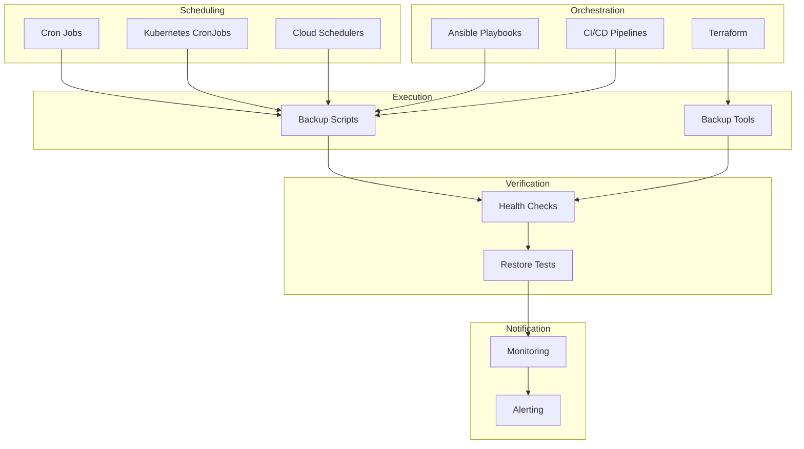

# How to Implement Backup Automation

Author: [nawazdhandala](https://www.github.com/nawazdhandala)

Tags: Backup, Automation, DevOps, Infrastructure as Code, CI/CD

Description: A comprehensive guide to automating backup processes using scripts, schedulers, and infrastructure as code, ensuring reliable backups without manual intervention.

---

Manual backup processes do not scale and inevitably fail. Someone forgets, someone is on vacation, or someone assumes someone else did it. Backup automation removes human error from the equation and ensures backups happen consistently, regardless of who is on call.

This guide covers building automated backup systems from simple cron jobs to sophisticated infrastructure-as-code deployments.

## Why Automate Backups?

Automation addresses the fundamental weakness of backup systems:

1. **Consistency:** Backups run on schedule, every time
2. **Reliability:** No forgotten steps or configuration drift
3. **Scalability:** Adding new systems does not require manual setup
4. **Auditability:** Automated processes leave consistent logs
5. **Recovery time:** Automated restores are faster than manual procedures

The effort to automate pays dividends every time a backup completes without human intervention.

## Automation Architecture



## Systemd Timer-Based Automation

Modern Linux systems can use systemd timers instead of cron:

```ini
# /etc/systemd/system/backup.service
[Unit]
Description=Database Backup Service
After=network.target postgresql.service

[Service]
Type=oneshot
User=backup
Group=backup
ExecStart=/usr/local/bin/backup.sh
ExecStartPost=/usr/local/bin/backup-notify.sh
StandardOutput=journal
StandardError=journal

[Install]
WantedBy=multi-user.target
```

```ini
# /etc/systemd/system/backup.timer
[Unit]
Description=Run Backup Daily

[Timer]
OnCalendar=*-*-* 02:00:00
RandomizedDelaySec=1800
Persistent=true

[Install]
WantedBy=timers.target
```

```bash
#!/bin/bash
# /usr/local/bin/backup.sh

set -euo pipefail

LOG_TAG="backup"
BACKUP_DIR="/var/backups"
TIMESTAMP=$(date +%Y%m%d-%H%M%S)

log() {
    logger -t "$LOG_TAG" "$1"
    echo "[$(date '+%Y-%m-%d %H:%M:%S')] $1"
}

log "Starting automated backup"

# Database backup
log "Backing up PostgreSQL"
pg_dump -h localhost -U backup -Fc production > "${BACKUP_DIR}/db-${TIMESTAMP}.dump"

# Application files
log "Backing up application files"
tar -czf "${BACKUP_DIR}/app-${TIMESTAMP}.tar.gz" \
    --exclude='*.log' \
    --exclude='cache/*' \
    /var/www/app

# Upload to remote storage
log "Uploading to S3"
aws s3 sync "$BACKUP_DIR" s3://company-backups/servers/$(hostname)/

# Cleanup old local backups
log "Cleaning up old backups"
find "$BACKUP_DIR" -name "*.dump" -mtime +7 -delete
find "$BACKUP_DIR" -name "*.tar.gz" -mtime +7 -delete

log "Backup completed successfully"
```

Enable and start:

```bash
sudo systemctl daemon-reload
sudo systemctl enable backup.timer
sudo systemctl start backup.timer

# Check timer status
systemctl list-timers | grep backup
```

## Kubernetes CronJob Automation

For Kubernetes environments, use CronJobs:

```yaml
# backup-cronjob.yaml
apiVersion: batch/v1
kind: CronJob
metadata:
  name: database-backup
  namespace: production
spec:
  schedule: "0 2 * * *"
  concurrencyPolicy: Forbid
  successfulJobsHistoryLimit: 3
  failedJobsHistoryLimit: 3
  jobTemplate:
    spec:
      backoffLimit: 2
      activeDeadlineSeconds: 3600
      template:
        spec:
          serviceAccountName: backup-service-account
          restartPolicy: OnFailure
          containers:
            - name: backup
              image: company/backup-runner:latest
              env:
                - name: PGHOST
                  value: postgres.production.svc.cluster.local
                - name: PGUSER
                  valueFrom:
                    secretKeyRef:
                      name: postgres-credentials
                      key: username
                - name: PGPASSWORD
                  valueFrom:
                    secretKeyRef:
                      name: postgres-credentials
                      key: password
                - name: AWS_ACCESS_KEY_ID
                  valueFrom:
                    secretKeyRef:
                      name: aws-backup-credentials
                      key: access-key
                - name: AWS_SECRET_ACCESS_KEY
                  valueFrom:
                    secretKeyRef:
                      name: aws-backup-credentials
                      key: secret-key
              command:
                - /bin/bash
                - -c
                - |
                  set -euo pipefail

                  TIMESTAMP=$(date +%Y%m%d-%H%M%S)
                  BACKUP_FILE="/tmp/backup-${TIMESTAMP}.dump"

                  echo "Starting database backup"
                  pg_dump -Fc production > "$BACKUP_FILE"

                  echo "Uploading to S3"
                  aws s3 cp "$BACKUP_FILE" s3://company-backups/k8s/production/db/

                  echo "Backup completed"
              resources:
                requests:
                  memory: "512Mi"
                  cpu: "500m"
                limits:
                  memory: "1Gi"
                  cpu: "1000m"
```

## Ansible Playbook Automation

Use Ansible for cross-server backup orchestration:

```yaml
# backup-playbook.yaml
---
- name: Configure and Run Backups
  hosts: all
  become: yes
  vars:
    backup_dir: /var/backups
    s3_bucket: company-backups
    retention_days: 7

  tasks:
    - name: Install backup dependencies
      apt:
        name:
          - postgresql-client
          - awscli
          - restic
        state: present
      when: ansible_os_family == "Debian"

    - name: Create backup directory
      file:
        path: "{{ backup_dir }}"
        state: directory
        owner: backup
        group: backup
        mode: '0750'

    - name: Deploy backup script
      template:
        src: templates/backup.sh.j2
        dest: /usr/local/bin/backup.sh
        owner: root
        group: root
        mode: '0755'

    - name: Deploy backup credentials
      template:
        src: templates/backup-credentials.j2
        dest: /etc/backup/credentials
        owner: backup
        group: backup
        mode: '0600'

    - name: Create systemd service
      template:
        src: templates/backup.service.j2
        dest: /etc/systemd/system/backup.service
      notify: Reload systemd

    - name: Create systemd timer
      template:
        src: templates/backup.timer.j2
        dest: /etc/systemd/system/backup.timer
      notify:
        - Reload systemd
        - Enable backup timer

    - name: Run initial backup
      command: /usr/local/bin/backup.sh
      when: run_initial_backup | default(false)

  handlers:
    - name: Reload systemd
      systemd:
        daemon_reload: yes

    - name: Enable backup timer
      systemd:
        name: backup.timer
        enabled: yes
        state: started
```

```jinja2
{# templates/backup.sh.j2 #}
#!/bin/bash
set -euo pipefail

source /etc/backup/credentials

BACKUP_DIR="{{ backup_dir }}"
S3_BUCKET="{{ s3_bucket }}"
HOSTNAME=$(hostname)
TIMESTAMP=$(date +%Y%m%d-%H%M%S)


# Database backups

echo "Backing up database: {{ db.name }}"
pg_dump -h {{ db.host }} -U {{ db.user }} -Fc {{ db.name }} > "${BACKUP_DIR}/{{ db.name }}-${TIMESTAMP}.dump"




# Directory backups

echo "Backing up directory: {{ dir.path }}"
tar -czf "${BACKUP_DIR}/{{ dir.name }}-${TIMESTAMP}.tar.gz" {{ dir.path }}



# Upload to S3
aws s3 sync "$BACKUP_DIR" "s3://${S3_BUCKET}/${HOSTNAME}/"

# Cleanup
find "$BACKUP_DIR" -type f -mtime +{{ retention_days }} -delete

echo "Backup completed at $(date)"
```

## Terraform-Managed Backup Infrastructure

Define backup infrastructure as code:

```hcl
# backup-infrastructure.tf

# S3 Bucket for backups
resource "aws_s3_bucket" "backups" {
  bucket = "company-backups-${var.environment}"

  tags = {
    Name        = "Backup Storage"
    Environment = var.environment
  }
}

resource "aws_s3_bucket_versioning" "backups" {
  bucket = aws_s3_bucket.backups.id
  versioning_configuration {
    status = "Enabled"
  }
}

resource "aws_s3_bucket_lifecycle_configuration" "backups" {
  bucket = aws_s3_bucket.backups.id

  rule {
    id     = "transition-to-glacier"
    status = "Enabled"

    transition {
      days          = 30
      storage_class = "STANDARD_IA"
    }

    transition {
      days          = 90
      storage_class = "GLACIER"
    }

    expiration {
      days = 365
    }
  }
}

# IAM role for backup jobs
resource "aws_iam_role" "backup_role" {
  name = "backup-role-${var.environment}"

  assume_role_policy = jsonencode({
    Version = "2012-10-17"
    Statement = [{
      Action = "sts:AssumeRole"
      Effect = "Allow"
      Principal = {
        Service = "ec2.amazonaws.com"
      }
    }]
  })
}

resource "aws_iam_role_policy" "backup_policy" {
  name = "backup-policy"
  role = aws_iam_role.backup_role.id

  policy = jsonencode({
    Version = "2012-10-17"
    Statement = [{
      Effect = "Allow"
      Action = [
        "s3:PutObject",
        "s3:GetObject",
        "s3:ListBucket",
        "s3:DeleteObject"
      ]
      Resource = [
        aws_s3_bucket.backups.arn,
        "${aws_s3_bucket.backups.arn}/*"
      ]
    }]
  })
}

# AWS Backup Plan
resource "aws_backup_plan" "daily" {
  name = "daily-backup-plan"

  rule {
    rule_name         = "daily-backup"
    target_vault_name = aws_backup_vault.main.name
    schedule          = "cron(0 2 * * ? *)"

    lifecycle {
      delete_after = 35
    }

    copy_action {
      destination_vault_arn = aws_backup_vault.dr.arn
      lifecycle {
        delete_after = 90
      }
    }
  }
}

resource "aws_backup_vault" "main" {
  name = "main-backup-vault"
}

resource "aws_backup_vault" "dr" {
  name     = "dr-backup-vault"
  provider = aws.dr_region
}

resource "aws_backup_selection" "tagged_resources" {
  name         = "tagged-resources"
  plan_id      = aws_backup_plan.daily.id
  iam_role_arn = aws_iam_role.backup_role.arn

  selection_tag {
    type  = "STRINGEQUALS"
    key   = "Backup"
    value = "true"
  }
}
```

## CI/CD Pipeline Integration

Integrate backup verification into CI/CD:

```yaml
# .github/workflows/backup-verification.yaml
name: Backup Verification

on:
  schedule:
    - cron: '0 6 * * *'  # Daily at 6 AM
  workflow_dispatch:

jobs:
  verify-backups:
    runs-on: ubuntu-latest
    steps:
      - uses: actions/checkout@v4

      - name: Configure AWS Credentials
        uses: aws-actions/configure-aws-credentials@v4
        with:
          aws-access-key-id: ${{ secrets.AWS_ACCESS_KEY_ID }}
          aws-secret-access-key: ${{ secrets.AWS_SECRET_ACCESS_KEY }}
          aws-region: us-east-1

      - name: Check backup exists
        run: |
          LATEST=$(aws s3 ls s3://company-backups/production/db/ --recursive | tail -1)
          if [ -z "$LATEST" ]; then
            echo "No backups found!"
            exit 1
          fi
          echo "Latest backup: $LATEST"

      - name: Download and verify backup
        run: |
          LATEST_KEY=$(aws s3 ls s3://company-backups/production/db/ --recursive | tail -1 | awk '{print $4}')
          aws s3 cp "s3://company-backups/$LATEST_KEY" ./backup.dump

          # Verify backup is valid
          pg_restore --list ./backup.dump > /dev/null

      - name: Test restore
        run: |
          docker run -d --name postgres-test -e POSTGRES_PASSWORD=test -p 5432:5432 postgres:15
          sleep 10

          PGPASSWORD=test createdb -h localhost -U postgres testdb
          PGPASSWORD=test pg_restore -h localhost -U postgres -d testdb ./backup.dump

          # Run verification query
          PGPASSWORD=test psql -h localhost -U postgres -d testdb -c "SELECT COUNT(*) FROM users;"

      - name: Notify on failure
        if: failure()
        run: |
          curl -X POST ${{ secrets.SLACK_WEBHOOK }} \
            -H 'Content-Type: application/json' \
            -d '{"text": "Backup verification failed!"}'

  cleanup-old-backups:
    runs-on: ubuntu-latest
    needs: verify-backups
    steps:
      - name: Configure AWS Credentials
        uses: aws-actions/configure-aws-credentials@v4
        with:
          aws-access-key-id: ${{ secrets.AWS_ACCESS_KEY_ID }}
          aws-secret-access-key: ${{ secrets.AWS_SECRET_ACCESS_KEY }}
          aws-region: us-east-1

      - name: Remove backups older than retention
        run: |
          CUTOFF=$(date -d '30 days ago' +%Y-%m-%d)
          aws s3 ls s3://company-backups/production/db/ | while read line; do
            DATE=$(echo $line | awk '{print $1}')
            FILE=$(echo $line | awk '{print $4}')
            if [[ "$DATE" < "$CUTOFF" ]]; then
              echo "Deleting old backup: $FILE"
              aws s3 rm "s3://company-backups/production/db/$FILE"
            fi
          done
```

## Self-Healing Backup System

Build automation that detects and recovers from failures:

```python
#!/usr/bin/env python3
# self_healing_backup.py

import subprocess
import time
import logging
from datetime import datetime, timedelta

logging.basicConfig(level=logging.INFO)
logger = logging.getLogger(__name__)

class BackupManager:
    def __init__(self, config):
        self.config = config
        self.max_retries = 3
        self.retry_delay = 300  # 5 minutes

    def run_backup(self, backup_name):
        """Run a backup with automatic retry."""

        for attempt in range(self.max_retries):
            try:
                logger.info(f"Running backup {backup_name} (attempt {attempt + 1})")

                result = subprocess.run(
                    self.config['commands'][backup_name],
                    shell=True,
                    capture_output=True,
                    text=True,
                    timeout=self.config.get('timeout', 3600)
                )

                if result.returncode == 0:
                    logger.info(f"Backup {backup_name} completed successfully")
                    return True
                else:
                    logger.error(f"Backup failed: {result.stderr}")

            except subprocess.TimeoutExpired:
                logger.error(f"Backup {backup_name} timed out")

            except Exception as e:
                logger.error(f"Backup error: {e}")

            if attempt < self.max_retries - 1:
                logger.info(f"Retrying in {self.retry_delay} seconds...")
                time.sleep(self.retry_delay)

        logger.critical(f"Backup {backup_name} failed after {self.max_retries} attempts")
        self.send_alert(backup_name, "Backup failed after all retries")
        return False

    def check_backup_health(self):
        """Check if recent backups exist and are valid."""

        cutoff = datetime.now() - timedelta(hours=25)
        issues = []

        for backup_name, check_command in self.config['health_checks'].items():
            try:
                result = subprocess.run(
                    check_command,
                    shell=True,
                    capture_output=True,
                    text=True
                )

                if result.returncode != 0:
                    issues.append(f"{backup_name}: health check failed")

            except Exception as e:
                issues.append(f"{backup_name}: {e}")

        return issues

    def self_heal(self):
        """Detect issues and automatically remediate."""

        issues = self.check_backup_health()

        for issue in issues:
            backup_name = issue.split(':')[0]
            logger.warning(f"Detected issue: {issue}")

            # Attempt to re-run the failed backup
            if backup_name in self.config['commands']:
                logger.info(f"Attempting to heal by re-running {backup_name}")
                self.run_backup(backup_name)

    def send_alert(self, backup_name, message):
        """Send alert for backup failures."""

        logger.critical(f"ALERT: {backup_name} - {message}")
        # Implement your alerting mechanism here

if __name__ == "__main__":
    config = {
        'commands': {
            'database': 'pg_dump -h localhost -U backup production | gzip > /backups/db.gz',
            'files': 'tar -czf /backups/files.tar.gz /var/www/app'
        },
        'health_checks': {
            'database': 'test -f /backups/db.gz && test $(find /backups/db.gz -mmin -1440)',
            'files': 'test -f /backups/files.tar.gz && test $(find /backups/files.tar.gz -mmin -1440)'
        },
        'timeout': 3600
    }

    manager = BackupManager(config)
    manager.self_heal()
```

## Best Practices

1. **Version control everything.** Backup scripts, configurations, and infrastructure definitions should be in git.

2. **Use idempotent operations.** Backup scripts should be safe to run multiple times.

3. **Implement health checks.** Automated systems need automated verification.

4. **Log everything.** Detailed logs make debugging automation failures possible.

5. **Test automation regularly.** Periodically verify that scheduled jobs are still running.

6. **Document manual overrides.** When automation fails, document how to run backups manually.

## Wrapping Up

Backup automation eliminates the human factors that cause backup failures. Start with simple scheduled scripts, evolve to infrastructure-as-code definitions, and add self-healing capabilities for resilience. The goal is a backup system that runs reliably without daily attention, freeing your team to focus on improvements rather than maintenance.
