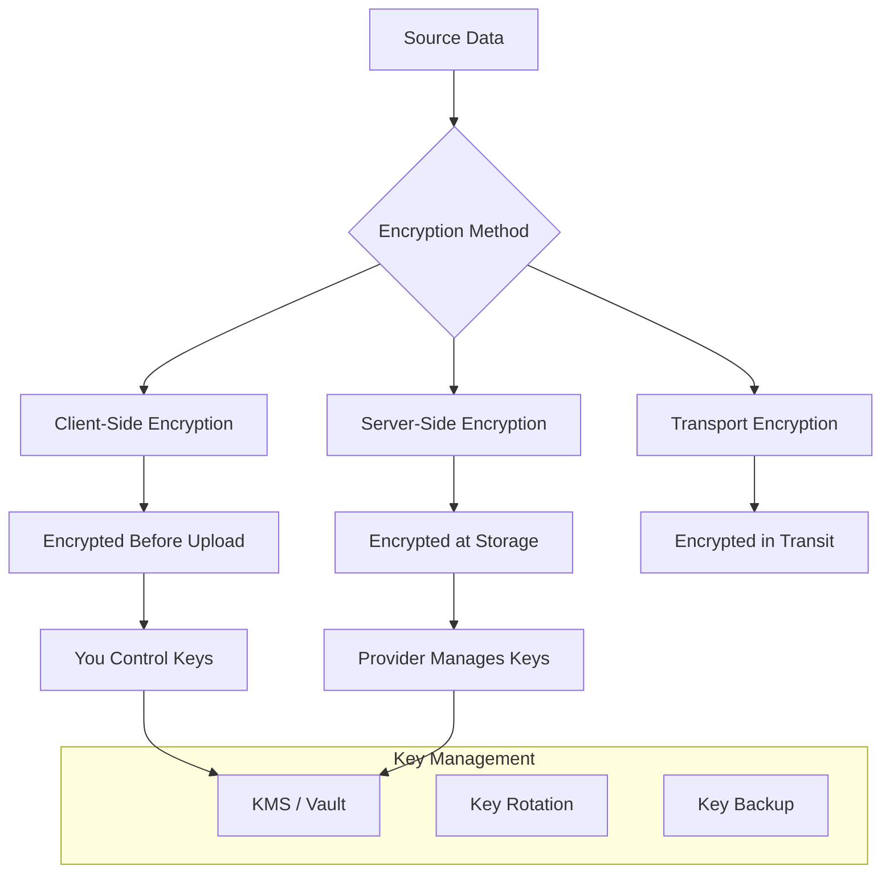

# How to Configure Backup Encryption

Author: [nawazdhandala](https://www.github.com/nawazdhandala)

Tags: Encryption, Backup, Security, DevOps, Data Protection

Description: Learn how to implement encryption for backup data at rest and in transit, including key management strategies, tool configurations, and compliance considerations.

---

Unencrypted backups are a data breach waiting to happen. They contain the same sensitive data as your production systems but often with weaker access controls. Encrypting backups protects data even if backup storage is compromised, stolen, or accessed by unauthorized parties.

This guide covers encryption strategies for backup data, from choosing algorithms to managing encryption keys.

## Why Encrypt Backups?

Backup encryption addresses several risks:

1. **Storage compromise:** Cloud storage credentials leak or storage is misconfigured
2. **Physical theft:** Backup media or drives are stolen
3. **Insider threats:** Unauthorized employees access backup files
4. **Compliance requirements:** GDPR, HIPAA, PCI-DSS mandate encryption
5. **Third-party exposure:** Backup vendors or contractors access data

Encryption ensures that even if backup files are accessed, the data remains unreadable without the encryption key.

## Encryption Architecture



## Client-Side Encryption

Client-side encryption encrypts data before it leaves your systems. You control the keys completely.

### GPG Encryption

```bash
#!/bin/bash
# encrypt-backup-gpg.sh

BACKUP_FILE="$1"
RECIPIENT="backup-key@example.com"

# Encrypt with GPG
gpg --encrypt --recipient "$RECIPIENT" --output "${BACKUP_FILE}.gpg" "$BACKUP_FILE"

# Verify encryption
gpg --list-packets "${BACKUP_FILE}.gpg" | head -5

# Remove unencrypted file
shred -u "$BACKUP_FILE"

echo "Encrypted backup: ${BACKUP_FILE}.gpg"
```

Generate and manage GPG keys:

```bash
# Generate backup encryption key
gpg --full-generate-key
# Choose: RSA and RSA, 4096 bits, no expiration

# Export public key (for encrypting)
gpg --export --armor backup-key@example.com > backup-public.key

# Export private key (keep secure!)
gpg --export-secret-keys --armor backup-key@example.com > backup-private.key

# Import key on another system
gpg --import backup-public.key
```

### OpenSSL Encryption

```bash
#!/bin/bash
# encrypt-backup-openssl.sh

BACKUP_FILE="$1"
PASSWORD_FILE="/etc/backup/encryption-password"

# Encrypt with AES-256-CBC
openssl enc -aes-256-cbc -salt -pbkdf2 -iter 100000 \
    -in "$BACKUP_FILE" \
    -out "${BACKUP_FILE}.enc" \
    -pass file:"$PASSWORD_FILE"

# Verify by decrypting header
openssl enc -aes-256-cbc -d -pbkdf2 -iter 100000 \
    -in "${BACKUP_FILE}.enc" \
    -pass file:"$PASSWORD_FILE" \
    2>/dev/null | head -c 100 > /dev/null && echo "Encryption verified"

# Remove unencrypted file
shred -u "$BACKUP_FILE"
```

Decrypt when restoring:

```bash
# Decrypt backup
openssl enc -aes-256-cbc -d -pbkdf2 -iter 100000 \
    -in backup.tar.gz.enc \
    -out backup.tar.gz \
    -pass file:/etc/backup/encryption-password
```

### Age Encryption

Age is a modern, simple encryption tool designed to replace GPG:

```bash
# Install age
# macOS: brew install age
# Linux: apt install age

# Generate key pair
age-keygen -o backup.key
# Public key: age1xxxxxxxxxx...

# Encrypt backup
age -r age1xxxxxxxxxx... -o backup.tar.gz.age backup.tar.gz

# Decrypt backup
age -d -i backup.key -o backup.tar.gz backup.tar.gz.age
```

## Backup Tool Native Encryption

Many backup tools include built-in encryption.

### Restic Encryption

Restic encrypts all data by default using AES-256:

```bash
# Initialize encrypted repository
export RESTIC_REPOSITORY="s3:s3.amazonaws.com/backups"
export RESTIC_PASSWORD="your-secure-password"

restic init
# Repository is automatically encrypted

# Run backups (encryption is automatic)
restic backup /var/www

# Key management
restic key list
restic key add    # Add new key
restic key remove # Remove old key
```

Store password securely:

```bash
# Use password file
export RESTIC_PASSWORD_FILE=/etc/restic/password
chmod 600 /etc/restic/password

# Or use password command
export RESTIC_PASSWORD_COMMAND="vault kv get -field=password secret/restic"
```

### Borg Encryption

Borg supports multiple encryption modes:

```bash
# Initialize with repokey encryption (key stored in repo)
borg init --encryption=repokey /mnt/backup/repo

# Initialize with keyfile encryption (key stored locally)
borg init --encryption=keyfile /mnt/backup/repo

# Export key for safekeeping
borg key export /mnt/backup/repo > /safe/location/borg.key

# Change passphrase
borg key change-passphrase /mnt/backup/repo
```

### Duplicity Encryption

```bash
# Set GPG key for encryption
export PASSPHRASE="your-gpg-passphrase"
export GPG_KEY="backup-key@example.com"

# Run encrypted backup
duplicity /var/www s3://s3.amazonaws.com/backups

# Backup with specific encryption options
duplicity --encrypt-key "$GPG_KEY" \
    --sign-key "$GPG_KEY" \
    /var/www s3://s3.amazonaws.com/backups
```

## Server-Side Encryption

Cloud providers offer encryption at the storage layer.

### AWS S3 Server-Side Encryption

```bash
# Enable default bucket encryption (SSE-S3)
aws s3api put-bucket-encryption \
    --bucket my-backup-bucket \
    --server-side-encryption-configuration '{
        "Rules": [{
            "ApplyServerSideEncryptionByDefault": {
                "SSEAlgorithm": "AES256"
            },
            "BucketKeyEnabled": true
        }]
    }'

# Use SSE-KMS with customer managed key
aws s3api put-bucket-encryption \
    --bucket my-backup-bucket \
    --server-side-encryption-configuration '{
        "Rules": [{
            "ApplyServerSideEncryptionByDefault": {
                "SSEAlgorithm": "aws:kms",
                "KMSMasterKeyID": "arn:aws:kms:us-east-1:123456789:key/xxx"
            },
            "BucketKeyEnabled": true
        }]
    }'

# Upload with explicit encryption
aws s3 cp backup.tar.gz s3://my-backup-bucket/ \
    --sse aws:kms \
    --sse-kms-key-id arn:aws:kms:us-east-1:123456789:key/xxx
```

### Azure Storage Encryption

```bash
# Enable encryption with customer-managed key
az storage account update \
    --name mystorageaccount \
    --resource-group myresources \
    --encryption-key-source Microsoft.Keyvault \
    --encryption-key-vault https://myvault.vault.azure.net \
    --encryption-key-name backup-encryption-key
```

### Google Cloud Storage Encryption

```bash
# Create Cloud KMS key
gcloud kms keys create backup-key \
    --location=global \
    --keyring=backup-keyring \
    --purpose=encryption

# Set default encryption key for bucket
gsutil kms encryption \
    -k projects/my-project/locations/global/keyRings/backup-keyring/cryptoKeys/backup-key \
    gs://my-backup-bucket
```

## Key Management

Encryption is only as secure as your key management.

### HashiCorp Vault Integration

```bash
#!/bin/bash
# backup-with-vault.sh

# Get encryption key from Vault
ENCRYPTION_KEY=$(vault kv get -field=key secret/backup/encryption)

# Create backup
tar -czf - /var/www | \
    openssl enc -aes-256-cbc -pbkdf2 -iter 100000 \
        -pass "pass:${ENCRYPTION_KEY}" | \
    aws s3 cp - s3://backups/backup-$(date +%Y%m%d).tar.gz.enc

# Clear key from memory
unset ENCRYPTION_KEY
```

Vault policy for backup encryption:

```hcl
# backup-policy.hcl
path "secret/data/backup/*" {
  capabilities = ["read"]
}

path "transit/encrypt/backup-key" {
  capabilities = ["update"]
}

path "transit/decrypt/backup-key" {
  capabilities = ["update"]
}
```

### AWS KMS Integration

```python
#!/usr/bin/env python3
# kms_encrypt_backup.py

import boto3
import base64
from cryptography.fernet import Fernet
from cryptography.hazmat.primitives import hashes
from cryptography.hazmat.primitives.kdf.pbkdf2 import PBKDF2HMAC

def get_data_key():
    """Generate data key using AWS KMS."""
    kms = boto3.client('kms')

    response = kms.generate_data_key(
        KeyId='alias/backup-key',
        KeySpec='AES_256'
    )

    # Return plaintext key for encryption and encrypted key for storage
    return response['Plaintext'], response['CiphertextBlob']

def encrypt_backup(input_file, output_file):
    """Encrypt backup file using KMS-generated data key."""

    # Get data key from KMS
    plaintext_key, encrypted_key = get_data_key()

    # Derive Fernet key from KMS key
    kdf = PBKDF2HMAC(
        algorithm=hashes.SHA256(),
        length=32,
        salt=b'backup-salt',  # Use unique salt in production
        iterations=100000,
    )
    fernet_key = base64.urlsafe_b64encode(kdf.derive(plaintext_key))
    fernet = Fernet(fernet_key)

    # Encrypt file
    with open(input_file, 'rb') as f:
        data = f.read()

    encrypted_data = fernet.encrypt(data)

    # Write encrypted key + encrypted data
    with open(output_file, 'wb') as f:
        # First 256 bytes: encrypted data key
        f.write(len(encrypted_key).to_bytes(4, 'big'))
        f.write(encrypted_key)
        # Rest: encrypted backup data
        f.write(encrypted_data)

    print(f"Encrypted backup written to {output_file}")

if __name__ == "__main__":
    import sys
    encrypt_backup(sys.argv[1], sys.argv[2])
```

### Key Rotation

Implement regular key rotation:

```bash
#!/bin/bash
# rotate-backup-keys.sh

set -euo pipefail

echo "Starting backup key rotation..."

# Generate new key
NEW_KEY=$(openssl rand -base64 32)

# Re-encrypt recent backups with new key
for backup in $(aws s3 ls s3://backups/ | awk '{print $4}' | head -30); do
    echo "Re-encrypting $backup..."

    # Download and decrypt with old key
    aws s3 cp "s3://backups/$backup" - | \
        openssl enc -aes-256-cbc -d -pbkdf2 -pass file:/etc/backup/old-key | \
        openssl enc -aes-256-cbc -pbkdf2 -pass "pass:${NEW_KEY}" | \
        aws s3 cp - "s3://backups/$backup"
done

# Update key in Vault
vault kv put secret/backup/encryption key="$NEW_KEY"

# Archive old key (keep for historical backups)
vault kv put secret/backup/encryption-archive/$(date +%Y%m%d) \
    key="$(cat /etc/backup/old-key)"

# Update local key file
echo "$NEW_KEY" > /etc/backup/encryption-key
chmod 600 /etc/backup/encryption-key

echo "Key rotation complete"
```

## Transport Encryption

Ensure data is encrypted during transfer.

### HTTPS/TLS Configuration

```bash
# Verify TLS is used for S3
aws s3 cp backup.tar.gz s3://backups/ --debug 2>&1 | grep -i "https"

# Force HTTPS in bucket policy
cat > bucket-policy.json <<EOF
{
    "Version": "2012-10-17",
    "Statement": [{
        "Sid": "ForceHTTPS",
        "Effect": "Deny",
        "Principal": "*",
        "Action": "s3:*",
        "Resource": [
            "arn:aws:s3:::my-backup-bucket",
            "arn:aws:s3:::my-backup-bucket/*"
        ],
        "Condition": {
            "Bool": {
                "aws:SecureTransport": "false"
            }
        }
    }]
}
EOF

aws s3api put-bucket-policy --bucket my-backup-bucket --policy file://bucket-policy.json
```

### SSH/SFTP Configuration

```bash
# Use SSH for remote backups
rsync -avz -e "ssh -o StrictHostKeyChecking=yes" \
    /var/www backup@storage.example.com:/backups/

# SFTP with key authentication
sftp -i ~/.ssh/backup_key backup@storage.example.com <<EOF
put backup.tar.gz /backups/
quit
EOF
```

## Compliance Considerations

Different regulations have specific encryption requirements:

| Regulation | Encryption Requirements |
|------------|------------------------|
| GDPR | "Appropriate" security measures including encryption |
| HIPAA | Must implement encryption mechanism for ePHI |
| PCI-DSS | Strong cryptography for stored cardholder data |
| SOC 2 | Encryption controls for data in transit and at rest |

Document your encryption practices:

```markdown
# Backup Encryption Documentation

## Encryption at Rest
- Algorithm: AES-256-GCM
- Key Management: AWS KMS with customer-managed keys
- Key Rotation: Quarterly, automated

## Encryption in Transit
- Protocol: TLS 1.3
- Certificate: AWS Certificate Manager

## Key Access Controls
- Production keys: Infrastructure team only
- Key recovery: Requires two authorized personnel
- Audit logging: CloudTrail enabled for all KMS operations
```

## Best Practices

1. **Always use client-side encryption for sensitive data.** Server-side encryption protects against storage provider issues but not against compromised credentials.

2. **Test decryption regularly.** Encrypt a backup, then decrypt and verify it works. Do this monthly.

3. **Back up your encryption keys separately.** Keys should be stored in a different location than the encrypted backups.

4. **Use strong key derivation for passwords.** PBKDF2 with at least 100,000 iterations or Argon2.

5. **Rotate keys periodically.** Annual rotation at minimum, more frequently for high-security environments.

6. **Audit key access.** Log and alert on all encryption key usage.

## Wrapping Up

Backup encryption is not optional for production systems handling sensitive data. Choose client-side encryption when you need full control, add server-side encryption for defense in depth, and always encrypt data in transit. The key management strategy matters as much as the encryption itself. Plan for key rotation, document recovery procedures, and test decryption regularly. An encrypted backup you cannot decrypt is worse than no backup at all.
