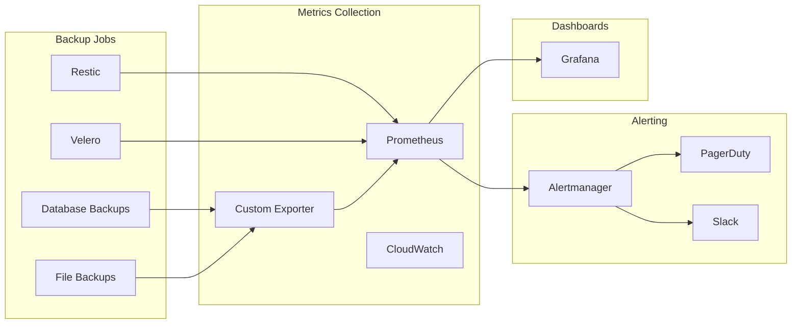

# How to Configure Backup Monitoring and Alerting

Author: [nawazdhandala](https://www.github.com/nawazdhandala)

Tags: Monitoring, Alerting, Backup, Observability, DevOps

Description: Learn how to implement comprehensive monitoring and alerting for backup systems, ensuring backup jobs complete successfully and failures are detected immediately.

---

Backup systems fail silently more often than they succeed loudly. A backup job that has been failing for weeks goes unnoticed until recovery is needed. By then, it is too late. Monitoring and alerting transform backups from hoped-for safety nets into verified protection.

This guide covers implementing monitoring for backup systems, creating meaningful alerts, and building dashboards for backup health visibility.

## Why Monitor Backups?

Backup monitoring catches problems before they matter:

1. **Job failures:** Detect when backups stop completing
2. **Duration anomalies:** Identify when backups take unusually long
3. **Storage issues:** Catch capacity problems before they block backups
4. **Verification failures:** Know when backup integrity checks fail
5. **Gap detection:** Alert when backup schedules are missed

Without monitoring, backup failures compound until recovery is impossible.

## Monitoring Architecture



## Key Metrics to Monitor

### Essential Backup Metrics

| Metric | Description | Alert Threshold |
|--------|-------------|-----------------|
| `backup_last_success_timestamp` | When the last successful backup completed | > 25 hours ago |
| `backup_duration_seconds` | How long the backup took | > 2x average |
| `backup_size_bytes` | Size of the backup | < 50% of average |
| `backup_errors_total` | Count of backup errors | > 0 |
| `backup_files_processed` | Number of files backed up | < 50% of average |
| `storage_used_bytes` | Backup storage utilization | > 80% capacity |

### Prometheus Metrics Exporter

```python
#!/usr/bin/env python3
# backup_exporter.py

from prometheus_client import start_http_server, Gauge, Counter
import os
import time
import subprocess
import json
from datetime import datetime

# Define metrics
backup_last_success = Gauge(
    'backup_last_success_timestamp',
    'Timestamp of last successful backup',
    ['backup_name', 'backup_type']
)

backup_duration = Gauge(
    'backup_duration_seconds',
    'Duration of last backup in seconds',
    ['backup_name', 'backup_type']
)

backup_size = Gauge(
    'backup_size_bytes',
    'Size of last backup in bytes',
    ['backup_name', 'backup_type']
)

backup_errors = Counter(
    'backup_errors_total',
    'Total number of backup errors',
    ['backup_name', 'backup_type', 'error_type']
)

def check_restic_backups():
    """Check Restic backup status."""

    try:
        result = subprocess.run(
            ['restic', 'snapshots', '--json', '--latest', '1'],
            capture_output=True,
            text=True,
            env={
                **os.environ,
                'RESTIC_REPOSITORY': os.getenv('RESTIC_REPOSITORY'),
                'RESTIC_PASSWORD_FILE': os.getenv('RESTIC_PASSWORD_FILE')
            }
        )

        if result.returncode == 0:
            snapshots = json.loads(result.stdout)
            if snapshots:
                latest = snapshots[0]
                backup_time = datetime.fromisoformat(latest['time'].replace('Z', '+00:00'))
                backup_last_success.labels(
                    backup_name='restic',
                    backup_type='full'
                ).set(backup_time.timestamp())
        else:
            backup_errors.labels(
                backup_name='restic',
                backup_type='full',
                error_type='check_failed'
            ).inc()

    except Exception as e:
        backup_errors.labels(
            backup_name='restic',
            backup_type='full',
            error_type='exception'
        ).inc()
        print(f"Error checking Restic: {e}")

def check_velero_backups():
    """Check Velero backup status."""

    try:
        result = subprocess.run(
            ['kubectl', 'get', 'backups', '-n', 'velero', '-o', 'json'],
            capture_output=True,
            text=True
        )

        if result.returncode == 0:
            backups = json.loads(result.stdout)
            for backup in backups.get('items', []):
                name = backup['metadata']['name']
                status = backup.get('status', {})

                if status.get('phase') == 'Completed':
                    completion_time = datetime.fromisoformat(
                        status['completionTimestamp'].replace('Z', '+00:00')
                    )
                    backup_last_success.labels(
                        backup_name=name,
                        backup_type='velero'
                    ).set(completion_time.timestamp())

                elif status.get('phase') == 'Failed':
                    backup_errors.labels(
                        backup_name=name,
                        backup_type='velero',
                        error_type='backup_failed'
                    ).inc()

    except Exception as e:
        print(f"Error checking Velero: {e}")

def main():
    # Start Prometheus metrics server
    start_http_server(9090)
    print("Backup exporter started on port 9090")

    while True:
        check_restic_backups()
        check_velero_backups()
        time.sleep(60)  # Check every minute

if __name__ == "__main__":
    main()
```

## Alerting Rules

### Prometheus Alerting Rules

```yaml
# backup-alerts.yaml
groups:
  - name: backup-alerts
    interval: 5m
    rules:
      - alert: BackupMissing
        expr: time() - backup_last_success_timestamp > 90000  # 25 hours
        for: 10m
        labels:
          severity: critical
        annotations:
          summary: "Backup missing for {{ $labels.backup_name }}"
          description: "No successful backup for {{ $labels.backup_name }} in over 25 hours"
          runbook_url: "https://wiki.example.com/runbooks/backup-missing"

      - alert: BackupDurationAnomaly
        expr: >
          backup_duration_seconds > 2 *
          avg_over_time(backup_duration_seconds[7d])
        for: 30m
        labels:
          severity: warning
        annotations:
          summary: "Backup taking unusually long for {{ $labels.backup_name }}"
          description: "Backup duration is more than 2x the weekly average"

      - alert: BackupSizeAnomaly
        expr: >
          backup_size_bytes < 0.5 *
          avg_over_time(backup_size_bytes[7d])
        for: 10m
        labels:
          severity: warning
        annotations:
          summary: "Backup size unexpectedly small for {{ $labels.backup_name }}"
          description: "Backup size is less than 50% of the weekly average"

      - alert: BackupStorageHigh
        expr: storage_used_bytes / storage_total_bytes > 0.8
        for: 1h
        labels:
          severity: warning
        annotations:
          summary: "Backup storage over 80% capacity"
          description: "Storage at {{ $value | humanizePercentage }} capacity"

      - alert: BackupStorageCritical
        expr: storage_used_bytes / storage_total_bytes > 0.95
        for: 15m
        labels:
          severity: critical
        annotations:
          summary: "Backup storage critically full"
          description: "Storage at {{ $value | humanizePercentage }} - backups may fail"

      - alert: BackupJobFailed
        expr: increase(backup_errors_total[1h]) > 0
        for: 5m
        labels:
          severity: critical
        annotations:
          summary: "Backup job failed for {{ $labels.backup_name }}"
          description: "{{ $labels.error_type }} error occurred"
```

### Alertmanager Configuration

```yaml
# alertmanager.yaml
global:
  slack_api_url: 'https://hooks.slack.com/services/xxx/yyy/zzz'
  pagerduty_url: 'https://events.pagerduty.com/v2/enqueue'

route:
  group_by: ['alertname', 'backup_name']
  group_wait: 30s
  group_interval: 5m
  repeat_interval: 4h
  receiver: 'slack-warnings'

  routes:
    - match:
        severity: critical
      receiver: 'pagerduty-critical'
      continue: true

    - match:
        severity: critical
      receiver: 'slack-critical'

receivers:
  - name: 'slack-warnings'
    slack_configs:
      - channel: '#backup-alerts'
        title: '{{ .GroupLabels.alertname }}'
        text: '{{ range .Alerts }}{{ .Annotations.description }}{{ end }}'

  - name: 'slack-critical'
    slack_configs:
      - channel: '#incidents'
        title: 'CRITICAL: {{ .GroupLabels.alertname }}'
        text: '{{ range .Alerts }}{{ .Annotations.description }}{{ end }}'
        color: 'danger'

  - name: 'pagerduty-critical'
    pagerduty_configs:
      - service_key: 'your-pagerduty-service-key'
        severity: critical
        description: '{{ .GroupLabels.alertname }}'
```

## Backup Job Wrapper

Wrap backup scripts to emit metrics:

```bash
#!/bin/bash
# backup-wrapper.sh

set -euo pipefail

BACKUP_NAME="${1:-default}"
BACKUP_COMMAND="${@:2}"
METRICS_URL="${METRICS_URL:-http://localhost:9091}"
START_TIME=$(date +%s)

log() {
    echo "[$(date '+%Y-%m-%d %H:%M:%S')] $1"
}

push_metric() {
    local metric_name="$1"
    local value="$2"
    local labels="${3:-}"

    cat <<EOF | curl --data-binary @- "${METRICS_URL}/metrics/job/backup/backup_name/${BACKUP_NAME}"
# TYPE ${metric_name} gauge
${metric_name}${labels} ${value}
EOF
}

log "Starting backup: $BACKUP_NAME"

# Run the backup command
if $BACKUP_COMMAND; then
    STATUS="success"
    EXIT_CODE=0
    log "Backup completed successfully"
else
    STATUS="failure"
    EXIT_CODE=$?
    log "Backup failed with exit code $EXIT_CODE"
fi

END_TIME=$(date +%s)
DURATION=$((END_TIME - START_TIME))

# Push metrics
push_metric "backup_duration_seconds" "$DURATION"

if [ "$STATUS" = "success" ]; then
    push_metric "backup_last_success_timestamp" "$END_TIME"
    push_metric "backup_success" "1"
else
    push_metric "backup_success" "0"
fi

log "Pushed metrics: duration=${DURATION}s, status=${STATUS}"

exit $EXIT_CODE
```

Usage:

```bash
# Wrap any backup command
./backup-wrapper.sh production-db pg_dump -h localhost -U postgres -d mydb -f backup.sql
./backup-wrapper.sh restic-files restic backup /var/www
```

## Grafana Dashboard

Create a comprehensive backup dashboard:

```json
{
  "dashboard": {
    "title": "Backup Health",
    "panels": [
      {
        "title": "Time Since Last Backup",
        "type": "stat",
        "targets": [
          {
            "expr": "time() - backup_last_success_timestamp",
            "legendFormat": "{{ backup_name }}"
          }
        ],
        "fieldConfig": {
          "defaults": {
            "unit": "s",
            "thresholds": {
              "steps": [
                {"color": "green", "value": 0},
                {"color": "yellow", "value": 43200},
                {"color": "red", "value": 86400}
              ]
            }
          }
        }
      },
      {
        "title": "Backup Duration Trend",
        "type": "timeseries",
        "targets": [
          {
            "expr": "backup_duration_seconds",
            "legendFormat": "{{ backup_name }}"
          }
        ]
      },
      {
        "title": "Backup Size Trend",
        "type": "timeseries",
        "targets": [
          {
            "expr": "backup_size_bytes",
            "legendFormat": "{{ backup_name }}"
          }
        ],
        "fieldConfig": {
          "defaults": {
            "unit": "bytes"
          }
        }
      },
      {
        "title": "Backup Errors (24h)",
        "type": "stat",
        "targets": [
          {
            "expr": "increase(backup_errors_total[24h])",
            "legendFormat": "{{ backup_name }}"
          }
        ],
        "fieldConfig": {
          "defaults": {
            "thresholds": {
              "steps": [
                {"color": "green", "value": 0},
                {"color": "red", "value": 1}
              ]
            }
          }
        }
      },
      {
        "title": "Storage Utilization",
        "type": "gauge",
        "targets": [
          {
            "expr": "storage_used_bytes / storage_total_bytes * 100"
          }
        ],
        "fieldConfig": {
          "defaults": {
            "unit": "percent",
            "min": 0,
            "max": 100,
            "thresholds": {
              "steps": [
                {"color": "green", "value": 0},
                {"color": "yellow", "value": 70},
                {"color": "red", "value": 90}
              ]
            }
          }
        }
      },
      {
        "title": "Backup Schedule Status",
        "type": "table",
        "targets": [
          {
            "expr": "backup_last_success_timestamp",
            "format": "table",
            "instant": true
          }
        ],
        "transformations": [
          {
            "id": "organize",
            "options": {
              "includeByName": {
                "backup_name": true,
                "Value": true
              },
              "renameByName": {
                "Value": "Last Success"
              }
            }
          }
        ]
      }
    ]
  }
}
```

## Cloud Provider Monitoring

### AWS Backup Monitoring

```python
#!/usr/bin/env python3
# aws_backup_monitor.py

import boto3
from datetime import datetime, timedelta

def check_aws_backup_jobs():
    """Monitor AWS Backup job status."""

    backup = boto3.client('backup')

    # Get jobs from last 24 hours
    start_time = datetime.now() - timedelta(hours=24)

    response = backup.list_backup_jobs(
        ByCreatedAfter=start_time,
        ByState='FAILED'
    )

    failed_jobs = response.get('BackupJobs', [])

    if failed_jobs:
        print(f"Found {len(failed_jobs)} failed backup jobs:")
        for job in failed_jobs:
            print(f"  - {job['BackupJobId']}: {job.get('StatusMessage', 'No message')}")

        # Send alert
        # send_alert(f"AWS Backup: {len(failed_jobs)} jobs failed in last 24h")
        return False

    print("All AWS Backup jobs successful")
    return True

def check_rds_snapshots():
    """Verify RDS automated snapshots exist."""

    rds = boto3.client('rds')

    instances = rds.describe_db_instances()

    for instance in instances['DBInstances']:
        instance_id = instance['DBInstanceIdentifier']

        snapshots = rds.describe_db_snapshots(
            DBInstanceIdentifier=instance_id,
            SnapshotType='automated'
        )

        if snapshots['DBSnapshots']:
            latest = max(snapshots['DBSnapshots'],
                        key=lambda x: x['SnapshotCreateTime'])
            age_hours = (datetime.now(latest['SnapshotCreateTime'].tzinfo) -
                        latest['SnapshotCreateTime']).total_seconds() / 3600

            if age_hours > 25:
                print(f"WARNING: {instance_id} snapshot is {age_hours:.1f} hours old")
        else:
            print(f"WARNING: No snapshots found for {instance_id}")

if __name__ == "__main__":
    check_aws_backup_jobs()
    check_rds_snapshots()
```

### CloudWatch Alarms

```bash
# Create CloudWatch alarm for backup failures
aws cloudwatch put-metric-alarm \
    --alarm-name "AWSBackupFailures" \
    --metric-name "NumberOfBackupJobsFailed" \
    --namespace "AWS/Backup" \
    --statistic Sum \
    --period 3600 \
    --evaluation-periods 1 \
    --threshold 1 \
    --comparison-operator GreaterThanOrEqualToThreshold \
    --alarm-actions "arn:aws:sns:us-east-1:123456789012:backup-alerts"
```

## Heartbeat Monitoring

Use heartbeat checks for cron-based backups:

```bash
#!/bin/bash
# backup-with-heartbeat.sh

HEARTBEAT_URL="https://hc-ping.com/your-uuid"

# Ping start
curl -fsS --retry 3 "${HEARTBEAT_URL}/start" > /dev/null

# Run backup
if ./backup.sh; then
    # Ping success
    curl -fsS --retry 3 "${HEARTBEAT_URL}" > /dev/null
else
    # Ping failure
    curl -fsS --retry 3 "${HEARTBEAT_URL}/fail" > /dev/null
    exit 1
fi
```

## Best Practices

1. **Alert on absence, not just failure.** A backup that never runs does not generate error logs. Alert when expected backups do not appear.

2. **Monitor backup size trends.** Sudden size changes often indicate problems even when backups "succeed."

3. **Include verification in monitoring.** Backup completion is not enough. Monitor verification jobs too.

4. **Set appropriate thresholds.** Adjust alert thresholds based on your backup schedule. Daily backups need different thresholds than hourly ones.

5. **Test alert delivery.** Periodically verify that alerts actually reach on-call personnel.

6. **Document runbooks.** Every alert should link to a runbook explaining investigation and remediation steps.

## Wrapping Up

Backup monitoring closes the gap between hoping backups work and knowing they do. Instrument your backup jobs to emit metrics, create alerts for missing or failed backups, and build dashboards for visibility. The goal is not just detecting failures but detecting them fast enough to fix them before recovery is needed. A backup system without monitoring is a backup system waiting to disappoint you.
