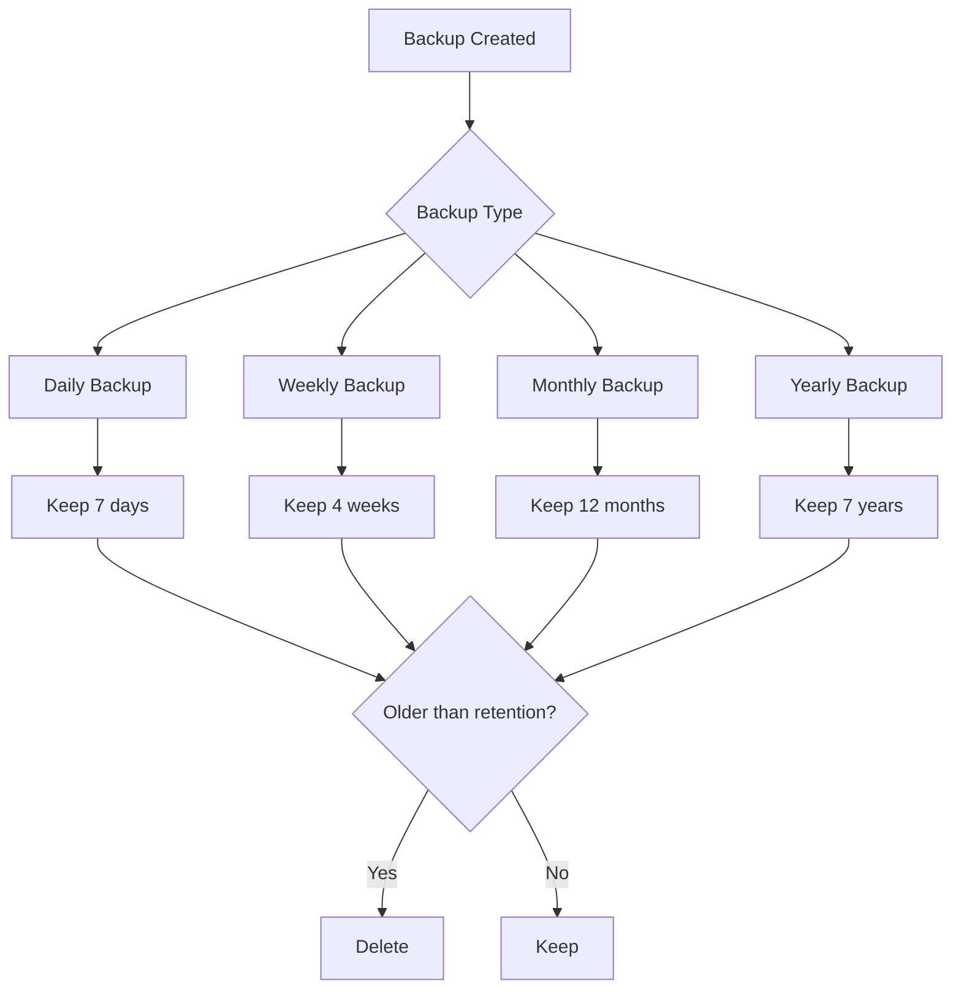

# How to Implement Backup Retention Policies

Author: [nawazdhandala](https://www.github.com/nawazdhandala)

Tags: Backup, Retention, Compliance, DevOps, Data Management

Description: Learn how to design and implement backup retention policies that balance data protection, compliance requirements, and storage costs with practical examples and automation strategies.

---

Retention policies determine how long you keep backups. Keep them too short and you cannot recover from slow-moving disasters like data corruption. Keep them too long and storage costs spiral while compliance risks increase. Getting retention right requires balancing recovery needs, regulatory requirements, and budget constraints.

This guide covers designing retention policies, implementing them across backup tools, and automating enforcement.

## Why Retention Policies Matter

Without explicit policies, backup management fails in predictable ways:

1. **Storage explosion:** Backups accumulate indefinitely, costs grow unbounded
2. **Compliance violations:** Data kept beyond legal retention limits
3. **Recovery gaps:** Old backups deleted before corruption is discovered
4. **Legal discovery risks:** Data retained creates liability exposure

A good retention policy provides clear rules for how long each type of backup is kept.

## Retention Policy Framework



## Designing Retention Policies

### Grandfather-Father-Son (GFS) Strategy

GFS is the most common retention strategy:

| Level | Frequency | Retention | Purpose |
|-------|-----------|-----------|---------|
| Daily (Son) | Every day | 7 days | Quick recovery from recent issues |
| Weekly (Father) | Every Sunday | 4 weeks | Medium-term recovery |
| Monthly (Grandfather) | 1st of month | 12 months | Long-term recovery |
| Yearly (Archive) | January 1st | 7 years | Compliance and auditing |

Example implementation:

```bash
#!/bin/bash
# gfs-retention.sh

BACKUP_DIR="/backups"
TODAY=$(date +%Y%m%d)
DAY_OF_WEEK=$(date +%u)  # 1=Monday, 7=Sunday
DAY_OF_MONTH=$(date +%d)
MONTH=$(date +%m)

# Determine backup tier
if [ "$MONTH" = "01" ] && [ "$DAY_OF_MONTH" = "01" ]; then
    TIER="yearly"
    RETENTION_DAYS=2555  # ~7 years
elif [ "$DAY_OF_MONTH" = "01" ]; then
    TIER="monthly"
    RETENTION_DAYS=365   # 12 months
elif [ "$DAY_OF_WEEK" = "7" ]; then
    TIER="weekly"
    RETENTION_DAYS=28    # 4 weeks
else
    TIER="daily"
    RETENTION_DAYS=7     # 7 days
fi

# Create backup with tier label
BACKUP_NAME="backup-${TODAY}-${TIER}.tar.gz"
tar -czf "${BACKUP_DIR}/${BACKUP_NAME}" /var/www

# Clean up old backups by tier
find "$BACKUP_DIR" -name "backup-*-daily.tar.gz" -mtime +7 -delete
find "$BACKUP_DIR" -name "backup-*-weekly.tar.gz" -mtime +28 -delete
find "$BACKUP_DIR" -name "backup-*-monthly.tar.gz" -mtime +365 -delete
find "$BACKUP_DIR" -name "backup-*-yearly.tar.gz" -mtime +2555 -delete

echo "Created $TIER backup: $BACKUP_NAME"
```

### Compliance-Driven Retention

Different regulations require specific retention periods:

| Regulation | Data Type | Minimum Retention |
|------------|-----------|-------------------|
| HIPAA | Medical records | 6 years |
| SOX | Financial records | 7 years |
| GDPR | Personal data | Only as long as necessary |
| PCI-DSS | Audit logs | 1 year |
| IRS | Tax records | 7 years |

Implement compliance-aware retention:

```bash
#!/bin/bash
# compliance-retention.sh

# Configuration per data type
declare -A RETENTION_DAYS
RETENTION_DAYS["financial"]=2555   # 7 years for SOX
RETENTION_DAYS["medical"]=2190     # 6 years for HIPAA
RETENTION_DAYS["audit"]=365        # 1 year for PCI-DSS
RETENTION_DAYS["operational"]=90   # 90 days for general ops

apply_retention() {
    local data_type="$1"
    local backup_path="$2"
    local retention="${RETENTION_DAYS[$data_type]}"

    if [ -z "$retention" ]; then
        echo "Unknown data type: $data_type"
        return 1
    fi

    echo "Applying $retention day retention to $backup_path ($data_type)"
    find "$backup_path" -type f -mtime +$retention -delete
}

# Apply retention per data type
apply_retention "financial" "/backups/financial"
apply_retention "medical" "/backups/medical"
apply_retention "audit" "/backups/audit"
apply_retention "operational" "/backups/operational"
```

## Tool-Specific Implementation

### Restic Retention

```bash
#!/bin/bash
# restic-retention.sh

export RESTIC_REPOSITORY="s3:s3.amazonaws.com/backups"
export RESTIC_PASSWORD_FILE="/etc/restic/password"

# Apply GFS retention policy
restic forget \
    --keep-daily 7 \
    --keep-weekly 4 \
    --keep-monthly 12 \
    --keep-yearly 7 \
    --prune

# Or with tags for different policies
restic forget \
    --tag critical \
    --keep-daily 14 \
    --keep-weekly 8 \
    --keep-monthly 24 \
    --keep-yearly 10

restic forget \
    --tag standard \
    --keep-daily 7 \
    --keep-weekly 4 \
    --keep-monthly 12 \
    --prune
```

### Borg Retention

```bash
#!/bin/bash
# borg-retention.sh

export BORG_REPO="/mnt/backup/repo"
export BORG_PASSPHRASE="your-passphrase"

# Apply retention policy
borg prune \
    --keep-within 1d \
    --keep-daily 7 \
    --keep-weekly 4 \
    --keep-monthly 12 \
    --keep-yearly 7 \
    --stats

# Compact repository to reclaim space
borg compact
```

### Velero Retention

```bash
# Create schedule with TTL
velero schedule create daily-backup \
    --schedule="0 2 * * *" \
    --ttl 168h  # 7 days

velero schedule create weekly-backup \
    --schedule="0 3 * * 0" \
    --ttl 672h  # 28 days

velero schedule create monthly-backup \
    --schedule="0 4 1 * *" \
    --ttl 8760h  # 365 days
```

### S3 Lifecycle Rules

```json
{
    "Rules": [
        {
            "ID": "DailyBackupRetention",
            "Status": "Enabled",
            "Filter": {
                "Prefix": "daily/"
            },
            "Expiration": {
                "Days": 7
            }
        },
        {
            "ID": "WeeklyBackupRetention",
            "Status": "Enabled",
            "Filter": {
                "Prefix": "weekly/"
            },
            "Expiration": {
                "Days": 28
            }
        },
        {
            "ID": "MonthlyBackupRetention",
            "Status": "Enabled",
            "Filter": {
                "Prefix": "monthly/"
            },
            "Transitions": [
                {
                    "Days": 30,
                    "StorageClass": "STANDARD_IA"
                },
                {
                    "Days": 90,
                    "StorageClass": "GLACIER"
                }
            ],
            "Expiration": {
                "Days": 365
            }
        },
        {
            "ID": "YearlyArchiveRetention",
            "Status": "Enabled",
            "Filter": {
                "Prefix": "yearly/"
            },
            "Transitions": [
                {
                    "Days": 1,
                    "StorageClass": "GLACIER_DEEP_ARCHIVE"
                }
            ],
            "Expiration": {
                "Days": 2555
            }
        }
    ]
}
```

Apply the policy:

```bash
aws s3api put-bucket-lifecycle-configuration \
    --bucket my-backup-bucket \
    --lifecycle-configuration file://lifecycle-policy.json
```

## Database-Specific Retention

### PostgreSQL WAL Retention

```ini
# postgresql.conf
wal_keep_size = 1GB
archive_command = 'test ! -f /archive/%f && cp %p /archive/%f'
```

```bash
# Clean up old WAL archives
find /archive -name "*.backup" -mtime +7 -delete
find /archive -type f ! -name "*.backup" -mtime +1 -delete
```

### MySQL Binary Log Retention

```ini
# my.cnf
expire_logs_days = 7
# Or for MySQL 8.0+:
binlog_expire_logs_seconds = 604800
```

```sql
-- Manual purge if needed
PURGE BINARY LOGS BEFORE DATE(NOW() - INTERVAL 7 DAY);
```

## Monitoring Retention Compliance

Track that retention policies are being applied:

```python
#!/usr/bin/env python3
# monitor_retention.py

import boto3
from datetime import datetime, timedelta

def check_s3_retention(bucket_name, prefix, max_age_days):
    """Check if old backups exist that should have been deleted."""

    s3 = boto3.client('s3')
    cutoff_date = datetime.now() - timedelta(days=max_age_days)

    paginator = s3.get_paginator('list_objects_v2')
    violations = []

    for page in paginator.paginate(Bucket=bucket_name, Prefix=prefix):
        for obj in page.get('Contents', []):
            if obj['LastModified'].replace(tzinfo=None) < cutoff_date:
                violations.append({
                    'key': obj['Key'],
                    'age_days': (datetime.now() - obj['LastModified'].replace(tzinfo=None)).days,
                    'size': obj['Size']
                })

    return violations

def report_violations(violations):
    """Report retention policy violations."""

    if violations:
        print(f"Found {len(violations)} retention violations:")
        for v in violations[:10]:  # Show first 10
            print(f"  - {v['key']}: {v['age_days']} days old")

        # Send alert
        # send_alert(f"Backup retention violation: {len(violations)} old backups found")
    else:
        print("No retention violations found")

if __name__ == "__main__":
    # Check different backup tiers
    checks = [
        ("my-backup-bucket", "daily/", 7),
        ("my-backup-bucket", "weekly/", 28),
        ("my-backup-bucket", "monthly/", 365),
    ]

    for bucket, prefix, max_age in checks:
        print(f"Checking {prefix} (max age: {max_age} days)")
        violations = check_s3_retention(bucket, prefix, max_age)
        report_violations(violations)
```

## Legal Hold and Litigation

Sometimes you need to suspend retention for legal reasons:

```bash
#!/bin/bash
# legal-hold.sh

ACTION="$1"  # enable or disable
BUCKET="my-backup-bucket"
PREFIX="$2"

case "$ACTION" in
    enable)
        echo "Enabling legal hold on $PREFIX"
        aws s3api put-object-legal-hold \
            --bucket "$BUCKET" \
            --key "$PREFIX" \
            --legal-hold Status=ON
        ;;
    disable)
        echo "Disabling legal hold on $PREFIX"
        aws s3api put-object-legal-hold \
            --bucket "$BUCKET" \
            --key "$PREFIX" \
            --legal-hold Status=OFF
        ;;
    *)
        echo "Usage: $0 [enable|disable] <prefix>"
        exit 1
        ;;
esac
```

## Documentation Template

Document your retention policies clearly:

```markdown
# Backup Retention Policy

## Overview
This document defines retention periods for all backup data.

## Policy Summary

| Data Category | Daily | Weekly | Monthly | Yearly | Total Retention |
|---------------|-------|--------|---------|--------|-----------------|
| Production DB | 7 days | 4 weeks | 12 months | 7 years | 7 years |
| Application Files | 7 days | 4 weeks | 6 months | None | 6 months |
| Logs | 7 days | None | None | None | 7 days |
| Audit Data | 30 days | None | 12 months | 7 years | 7 years |

## Compliance Requirements
- Financial data: 7 years (SOX)
- Audit logs: 1 year minimum (PCI-DSS)
- Personal data: Delete upon request (GDPR)

## Exception Process
1. Legal hold requests must be submitted to legal@example.com
2. Retention exceptions require VP approval
3. All exceptions must be documented in the ticketing system

## Review Schedule
This policy is reviewed annually and updated as needed.

Last Review: 2026-01-25
Next Review: 2027-01-25
```

## Cost Optimization

Balance retention needs against storage costs:

```python
#!/usr/bin/env python3
# retention_cost_analysis.py

import boto3
from datetime import datetime, timedelta

def analyze_retention_costs(bucket_name):
    """Analyze storage costs by backup age."""

    s3 = boto3.client('s3')
    paginator = s3.get_paginator('list_objects_v2')

    age_buckets = {
        '0-7 days': 0,
        '8-30 days': 0,
        '31-90 days': 0,
        '91-365 days': 0,
        '1-7 years': 0
    }

    for page in paginator.paginate(Bucket=bucket_name):
        for obj in page.get('Contents', []):
            age = (datetime.now() - obj['LastModified'].replace(tzinfo=None)).days
            size_gb = obj['Size'] / (1024**3)

            if age <= 7:
                age_buckets['0-7 days'] += size_gb
            elif age <= 30:
                age_buckets['8-30 days'] += size_gb
            elif age <= 90:
                age_buckets['31-90 days'] += size_gb
            elif age <= 365:
                age_buckets['91-365 days'] += size_gb
            else:
                age_buckets['1-7 years'] += size_gb

    # Calculate costs (example rates)
    rates = {
        '0-7 days': 0.023,      # Standard
        '8-30 days': 0.023,     # Standard
        '31-90 days': 0.0125,   # Standard-IA
        '91-365 days': 0.004,   # Glacier
        '1-7 years': 0.00099    # Deep Archive
    }

    print("Storage Analysis:")
    print("-" * 50)
    total_cost = 0
    for period, size in age_buckets.items():
        cost = size * rates[period]
        total_cost += cost
        print(f"{period}: {size:.2f} GB, ${cost:.2f}/month")

    print("-" * 50)
    print(f"Total: ${total_cost:.2f}/month")

if __name__ == "__main__":
    analyze_retention_costs("my-backup-bucket")
```

## Best Practices

1. **Document policies formally.** Written policies ensure consistency and support compliance audits.

2. **Automate enforcement.** Manual retention management is unreliable. Use lifecycle rules and scheduled jobs.

3. **Monitor compliance.** Track that retention rules are actually being applied. Alert on violations.

4. **Consider recovery scenarios.** Retention must cover realistic recovery needs, not just minimum requirements.

5. **Review annually.** Business needs and regulations change. Review and update policies yearly.

6. **Test restores from old backups.** Verify that retained backups are actually usable.

## Wrapping Up

Retention policies are the guardrails that keep backup storage manageable and compliant. Start with a GFS strategy, adjust for compliance requirements, and automate enforcement at the storage layer. The goal is predictable storage costs and the confidence that backups exist when you need them. Review policies annually and test restores from older backups to ensure your retention periods actually meet recovery needs.
