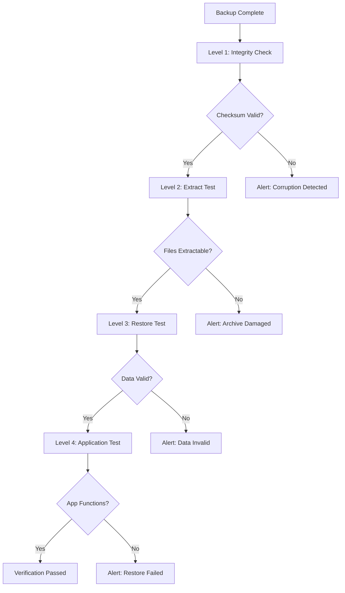

# How to Configure Backup Verification Testing

Author: [nawazdhandala](https://www.github.com/nawazdhandala)

Tags: Backup, Testing, Disaster Recovery, DevOps, Data Protection

Description: Learn how to implement automated backup verification testing to ensure your backups are actually restorable, including integrity checks, automated restore tests, and monitoring strategies.

---

A backup that has never been restored is just hope stored on disk. Too many teams discover their backups are corrupted, incomplete, or missing critical data only when disaster strikes. Backup verification testing closes this gap by regularly proving that your backups can actually restore working systems.

This guide covers verification strategies from simple integrity checks to full automated restore testing.

## Why Verification Matters

Backups fail silently in many ways:

1. **Corrupted archives:** Bit rot, incomplete writes, or storage failures damage backup files.
2. **Missing data:** Exclusion patterns accidentally skip critical files or databases.
3. **Schema drift:** Database backups work but cannot restore to newer application versions.
4. **Credential issues:** Encryption keys are lost or passwords have changed.
5. **Process failures:** Backup jobs error out but nobody notices.

Verification testing catches these problems before they matter.

## Verification Testing Levels



## Level 1: Integrity Checks

The simplest verification confirms the backup file is not corrupted.

### Checksum Verification

```bash
#!/bin/bash
# verify-checksum.sh

BACKUP_FILE="$1"
CHECKSUM_FILE="${BACKUP_FILE}.sha256"

# Generate checksum during backup
sha256sum "$BACKUP_FILE" > "$CHECKSUM_FILE"

# Verify checksum
sha256sum -c "$CHECKSUM_FILE"
if [ $? -ne 0 ]; then
    echo "ERROR: Checksum verification failed for $BACKUP_FILE"
    exit 1
fi

echo "Checksum verified: $BACKUP_FILE"
```

### Archive Integrity Testing

```bash
#!/bin/bash
# verify-archive.sh

BACKUP_FILE="$1"

# Test gzip archive integrity
if [[ "$BACKUP_FILE" == *.gz ]]; then
    gzip -t "$BACKUP_FILE"
    if [ $? -ne 0 ]; then
        echo "ERROR: Gzip integrity test failed"
        exit 1
    fi
fi

# Test tar archive contents
if [[ "$BACKUP_FILE" == *.tar* ]]; then
    tar -tzf "$BACKUP_FILE" > /dev/null
    if [ $? -ne 0 ]; then
        echo "ERROR: Tar archive test failed"
        exit 1
    fi
fi

# Test zip archive
if [[ "$BACKUP_FILE" == *.zip ]]; then
    unzip -t "$BACKUP_FILE" > /dev/null
    if [ $? -ne 0 ]; then
        echo "ERROR: Zip archive test failed"
        exit 1
    fi
fi

echo "Archive integrity verified: $BACKUP_FILE"
```

### Restic Backup Verification

```bash
#!/bin/bash
# verify-restic.sh

export RESTIC_REPOSITORY="s3:s3.amazonaws.com/company-backups/restic"
export RESTIC_PASSWORD_FILE="/etc/restic/password"

# Quick integrity check
restic check
if [ $? -ne 0 ]; then
    echo "ERROR: Restic repository check failed"
    exit 1
fi

# Full data verification (run weekly)
if [ "$(date +%u)" -eq 7 ]; then
    restic check --read-data
    if [ $? -ne 0 ]; then
        echo "ERROR: Restic data verification failed"
        exit 1
    fi
fi

echo "Restic repository verified"
```

## Level 2: Extract Testing

Verify that backup contents can be extracted.

```bash
#!/bin/bash
# verify-extract.sh

BACKUP_FILE="$1"
TEST_DIR="/tmp/backup-verify-$$"

mkdir -p "$TEST_DIR"
trap "rm -rf $TEST_DIR" EXIT

# Extract to temporary directory
tar -xzf "$BACKUP_FILE" -C "$TEST_DIR"
if [ $? -ne 0 ]; then
    echo "ERROR: Failed to extract backup"
    exit 1
fi

# Verify expected files exist
EXPECTED_FILES=(
    "database.dump"
    "app-files.tar.gz"
    "config.tar.gz"
)

for file in "${EXPECTED_FILES[@]}"; do
    if [ ! -f "$TEST_DIR/$file" ]; then
        echo "ERROR: Missing expected file: $file"
        exit 1
    fi
done

# Check file sizes are reasonable
for file in "$TEST_DIR"/*; do
    size=$(stat -c %s "$file")
    if [ "$size" -lt 1000 ]; then
        echo "WARNING: Suspiciously small file: $file ($size bytes)"
    fi
done

echo "Extract test passed"
```

## Level 3: Database Restore Testing

Restore database backups to a test environment.

```bash
#!/bin/bash
# verify-database-restore.sh

BACKUP_FILE="$1"
TEST_DB="restore_test_$(date +%s)"

# PostgreSQL restore test
verify_postgres() {
    # Create test database
    createdb -h localhost -U postgres "$TEST_DB"

    # Restore backup
    pg_restore -h localhost -U postgres -d "$TEST_DB" "$BACKUP_FILE"
    if [ $? -ne 0 ]; then
        echo "ERROR: PostgreSQL restore failed"
        dropdb -h localhost -U postgres "$TEST_DB"
        exit 1
    fi

    # Run basic integrity queries
    psql -h localhost -U postgres -d "$TEST_DB" -c "SELECT COUNT(*) FROM users;" > /dev/null
    if [ $? -ne 0 ]; then
        echo "ERROR: Database query failed after restore"
        dropdb -h localhost -U postgres "$TEST_DB"
        exit 1
    fi

    # Get row counts for comparison
    psql -h localhost -U postgres -d "$TEST_DB" -c "
        SELECT schemaname, relname, n_live_tup
        FROM pg_stat_user_tables
        ORDER BY n_live_tup DESC
        LIMIT 10;
    "

    # Cleanup
    dropdb -h localhost -U postgres "$TEST_DB"

    echo "PostgreSQL restore test passed"
}

# MySQL restore test
verify_mysql() {
    # Create test database
    mysql -u root -e "CREATE DATABASE $TEST_DB;"

    # Restore backup
    mysql -u root "$TEST_DB" < "$BACKUP_FILE"
    if [ $? -ne 0 ]; then
        echo "ERROR: MySQL restore failed"
        mysql -u root -e "DROP DATABASE $TEST_DB;"
        exit 1
    fi

    # Run integrity query
    mysql -u root -e "SELECT COUNT(*) FROM $TEST_DB.users;" > /dev/null
    if [ $? -ne 0 ]; then
        echo "ERROR: MySQL query failed after restore"
        mysql -u root -e "DROP DATABASE $TEST_DB;"
        exit 1
    fi

    # Cleanup
    mysql -u root -e "DROP DATABASE $TEST_DB;"

    echo "MySQL restore test passed"
}

# Detect backup type and run appropriate test
if file "$BACKUP_FILE" | grep -q "PostgreSQL"; then
    verify_postgres
elif file "$BACKUP_FILE" | grep -q "MySQL"; then
    verify_mysql
else
    echo "Unknown database backup format"
    exit 1
fi
```

## Level 4: Application Restore Testing

The gold standard: restore everything and verify the application works.

```bash
#!/bin/bash
# full-restore-test.sh

BACKUP_TIMESTAMP="$1"
TEST_NAMESPACE="restore-test-$(date +%s)"

# Create isolated test environment
kubectl create namespace "$TEST_NAMESPACE"

# Restore using Velero to test namespace
velero restore create "test-restore-$BACKUP_TIMESTAMP" \
    --from-backup "production-$BACKUP_TIMESTAMP" \
    --namespace-mappings production:$TEST_NAMESPACE \
    --wait

# Wait for pods to be ready
kubectl -n "$TEST_NAMESPACE" wait --for=condition=ready pod -l app=webapp --timeout=300s
if [ $? -ne 0 ]; then
    echo "ERROR: Pods did not become ready after restore"
    kubectl delete namespace "$TEST_NAMESPACE"
    exit 1
fi

# Run health checks
WEBAPP_POD=$(kubectl -n "$TEST_NAMESPACE" get pod -l app=webapp -o jsonpath='{.items[0].metadata.name}')
kubectl -n "$TEST_NAMESPACE" exec "$WEBAPP_POD" -- curl -s http://localhost:8080/health
if [ $? -ne 0 ]; then
    echo "ERROR: Health check failed after restore"
    kubectl delete namespace "$TEST_NAMESPACE"
    exit 1
fi

# Run application-specific tests
kubectl -n "$TEST_NAMESPACE" exec "$WEBAPP_POD" -- /app/scripts/smoke-test.sh
if [ $? -ne 0 ]; then
    echo "ERROR: Smoke tests failed after restore"
    kubectl delete namespace "$TEST_NAMESPACE"
    exit 1
fi

# Cleanup
kubectl delete namespace "$TEST_NAMESPACE"

echo "Full restore test passed"
```

## Automated Verification Pipeline

Create a comprehensive verification pipeline:

```yaml
# verify-backups.yaml (GitHub Actions)
name: Backup Verification

on:
  schedule:
    - cron: '0 6 * * *'  # Daily at 6 AM
  workflow_dispatch:

jobs:
  verify-database-backup:
    runs-on: ubuntu-latest
    steps:
      - uses: actions/checkout@v4

      - name: Download latest backup
        run: |
          aws s3 cp s3://company-backups/daily/latest/database.dump ./database.dump

      - name: Start PostgreSQL
        run: |
          docker run -d --name postgres \
            -e POSTGRES_PASSWORD=test \
            -p 5432:5432 \
            postgres:15
          sleep 10

      - name: Restore and verify
        run: |
          PGPASSWORD=test createdb -h localhost -U postgres testdb
          PGPASSWORD=test pg_restore -h localhost -U postgres -d testdb ./database.dump
          PGPASSWORD=test psql -h localhost -U postgres -d testdb -c "SELECT COUNT(*) FROM users;"

      - name: Send notification on failure
        if: failure()
        run: |
          curl -X POST "${{ secrets.SLACK_WEBHOOK }}" \
            -H 'Content-Type: application/json' \
            -d '{"text": "Database backup verification failed!"}'

  verify-file-backup:
    runs-on: ubuntu-latest
    steps:
      - uses: actions/checkout@v4

      - name: Download and verify archive
        run: |
          aws s3 cp s3://company-backups/daily/latest/files.tar.gz ./files.tar.gz
          tar -tzf files.tar.gz > /dev/null

      - name: Check expected files
        run: |
          tar -tzf files.tar.gz | grep -q "config/settings.yaml"
          tar -tzf files.tar.gz | grep -q "data/uploads"

      - name: Send notification on failure
        if: failure()
        run: |
          curl -X POST "${{ secrets.SLACK_WEBHOOK }}" \
            -H 'Content-Type: application/json' \
            -d '{"text": "File backup verification failed!"}'
```

## Monitoring and Alerting

Track verification results with metrics:

```python
#!/usr/bin/env python3
# verify_and_report.py

import subprocess
import time
import requests
from datetime import datetime

def run_verification(backup_path):
    """Run verification checks and return results."""

    results = {
        "timestamp": datetime.now().isoformat(),
        "backup_path": backup_path,
        "checksum_valid": False,
        "extract_successful": False,
        "restore_successful": False,
        "duration_seconds": 0
    }

    start_time = time.time()

    # Checksum verification
    try:
        subprocess.run(
            ["sha256sum", "-c", f"{backup_path}.sha256"],
            check=True,
            capture_output=True
        )
        results["checksum_valid"] = True
    except subprocess.CalledProcessError:
        pass

    # Extract test
    if results["checksum_valid"]:
        try:
            subprocess.run(
                ["tar", "-tzf", backup_path],
                check=True,
                capture_output=True
            )
            results["extract_successful"] = True
        except subprocess.CalledProcessError:
            pass

    # Restore test (simplified)
    if results["extract_successful"]:
        try:
            # Run restore test script
            subprocess.run(
                ["./verify-restore.sh", backup_path],
                check=True,
                capture_output=True,
                timeout=600
            )
            results["restore_successful"] = True
        except (subprocess.CalledProcessError, subprocess.TimeoutExpired):
            pass

    results["duration_seconds"] = time.time() - start_time

    return results

def send_metrics(results):
    """Send verification metrics to monitoring system."""

    # Push to Prometheus Pushgateway
    metrics = f"""
# TYPE backup_verification_success gauge
backup_verification_success{{backup="{results['backup_path']}"}} {1 if results['restore_successful'] else 0}
# TYPE backup_verification_duration_seconds gauge
backup_verification_duration_seconds{{backup="{results['backup_path']}"}} {results['duration_seconds']}
"""

    requests.post(
        "http://prometheus-pushgateway:9091/metrics/job/backup_verification",
        data=metrics
    )

def send_alert(results):
    """Send alert if verification failed."""

    if not results["restore_successful"]:
        message = f"Backup verification failed for {results['backup_path']}"

        if not results["checksum_valid"]:
            message += " - Checksum invalid"
        elif not results["extract_successful"]:
            message += " - Extract failed"
        else:
            message += " - Restore failed"

        requests.post(
            "https://hooks.slack.com/services/xxx/yyy/zzz",
            json={"text": message}
        )

if __name__ == "__main__":
    import sys
    backup_path = sys.argv[1]

    results = run_verification(backup_path)
    send_metrics(results)
    send_alert(results)

    if results["restore_successful"]:
        print("Verification passed")
        sys.exit(0)
    else:
        print("Verification failed")
        sys.exit(1)
```

## Verification Schedule

| Test Type | Frequency | Duration | Coverage |
|-----------|-----------|----------|----------|
| Checksum | Every backup | Seconds | All backups |
| Extract test | Daily | Minutes | Latest backup |
| Database restore | Weekly | 30-60 min | Latest backup |
| Full application restore | Monthly | 2-4 hours | Latest backup |
| Disaster recovery drill | Quarterly | 4-8 hours | Cross-region |

## Best Practices

1. **Automate everything.** Manual verification gets skipped under pressure. Automated checks run reliably.

2. **Test in isolation.** Use separate databases, namespaces, and environments for restore tests. Never test against production.

3. **Track metrics over time.** Monitor verification duration and success rates. Sudden changes indicate problems.

4. **Rotate verification targets.** Do not always test the same backup. Randomly select from recent backups to catch intermittent issues.

5. **Document recovery procedures.** Verification tests should mirror actual disaster recovery steps. Update documentation when tests reveal gaps.

6. **Alert on failure immediately.** Backup verification failures require prompt attention. Integrate with your on-call system.

## Wrapping Up

Backup verification testing transforms backups from theoretical safety nets into proven recovery tools. Start with integrity checks that run after every backup, add weekly restore tests to catch corruption early, and schedule monthly full application restores to validate end-to-end recovery. The time invested in verification pays off when disaster strikes and you can restore confidently instead of hoping.
