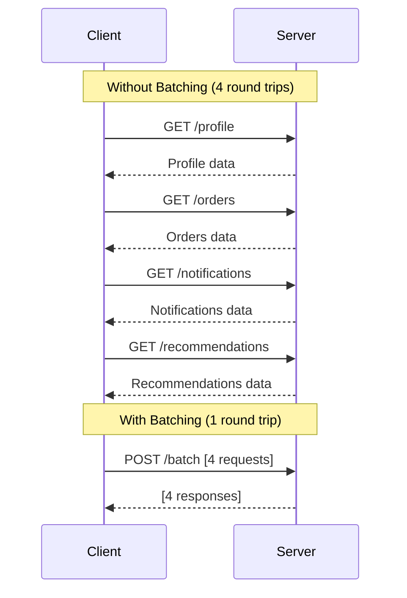

# How to Batch API Requests in ASP.NET Core

Author: [nawazdhandala](https://www.github.com/nawazdhandala)

Tags: .NET, ASP.NET Core, API, Performance, REST, Optimization

Description: Learn how to implement request batching in ASP.NET Core to reduce HTTP overhead, improve client performance, and handle multiple operations in a single round trip.

---

Every HTTP request has overhead. DNS lookup, TCP handshake, TLS negotiation, and serialization add latency even before your code runs. When clients need to make dozens of related requests, this overhead dominates. Request batching combines multiple operations into a single HTTP call, cutting latency dramatically for mobile apps, SPAs, and integrations.

## When to Use Batching

Batching shines when clients make many small, independent requests. Consider a dashboard that loads user profile, recent orders, notifications, and recommendations. Four separate requests mean four round trips. A batch request sends all four in one trip and receives all responses together.



## Simple Batch Endpoint

Start with a basic batch endpoint that executes multiple requests internally.

```csharp
// Request and response models for batching
public class BatchRequest
{
    public string Id { get; set; } = string.Empty;
    public string Method { get; set; } = "GET";
    public string Path { get; set; } = string.Empty;
    public Dictionary<string, string>? Headers { get; set; }
    public object? Body { get; set; }
}

public class BatchResponse
{
    public string Id { get; set; } = string.Empty;
    public int StatusCode { get; set; }
    public Dictionary<string, string> Headers { get; set; } = new();
    public object? Body { get; set; }
}

// Controller that handles batch requests
[ApiController]
[Route("api/[controller]")]
public class BatchController : ControllerBase
{
    private readonly IHttpClientFactory _httpClientFactory;
    private readonly IConfiguration _configuration;

    public BatchController(
        IHttpClientFactory httpClientFactory,
        IConfiguration configuration)
    {
        _httpClientFactory = httpClientFactory;
        _configuration = configuration;
    }

    [HttpPost]
    public async Task<ActionResult<List<BatchResponse>>> ExecuteBatch(
        [FromBody] List<BatchRequest> requests)
    {
        // Limit batch size to prevent abuse
        if (requests.Count > 20)
        {
            return BadRequest("Batch size cannot exceed 20 requests");
        }

        // Execute all requests in parallel
        var tasks = requests.Select(ExecuteRequest);
        var responses = await Task.WhenAll(tasks);

        return Ok(responses.ToList());
    }

    private async Task<BatchResponse> ExecuteRequest(BatchRequest request)
    {
        try
        {
            // Create internal HTTP request
            var client = _httpClientFactory.CreateClient("Internal");
            var baseUrl = _configuration["BaseUrl"];

            var httpRequest = new HttpRequestMessage(
                new HttpMethod(request.Method),
                $"{baseUrl}{request.Path}");

            // Copy headers from batch request
            if (request.Headers != null)
            {
                foreach (var header in request.Headers)
                {
                    httpRequest.Headers.TryAddWithoutValidation(
                        header.Key,
                        header.Value);
                }
            }

            // Add body for POST/PUT/PATCH
            if (request.Body != null)
            {
                httpRequest.Content = JsonContent.Create(request.Body);
            }

            // Forward authentication from original request
            if (HttpContext.Request.Headers.TryGetValue(
                "Authorization",
                out var authHeader))
            {
                httpRequest.Headers.TryAddWithoutValidation(
                    "Authorization",
                    authHeader.ToString());
            }

            var response = await client.SendAsync(httpRequest);

            // Build batch response
            var body = await response.Content.ReadAsStringAsync();
            object? parsedBody = null;

            try
            {
                parsedBody = JsonSerializer.Deserialize<JsonElement>(body);
            }
            catch
            {
                parsedBody = body;
            }

            return new BatchResponse
            {
                Id = request.Id,
                StatusCode = (int)response.StatusCode,
                Headers = response.Headers
                    .ToDictionary(h => h.Key, h => string.Join(",", h.Value)),
                Body = parsedBody
            };
        }
        catch (Exception ex)
        {
            return new BatchResponse
            {
                Id = request.Id,
                StatusCode = 500,
                Body = new { Error = ex.Message }
            };
        }
    }
}
```

## In-Process Batch Execution

Making HTTP calls to yourself adds overhead. For better performance, invoke controllers directly using the ASP.NET Core pipeline.

```csharp
// Service that executes batch requests in-process
// Avoids HTTP overhead by directly invoking the ASP.NET Core pipeline
public class InProcessBatchExecutor
{
    private readonly IServiceProvider _serviceProvider;
    private readonly ILogger<InProcessBatchExecutor> _logger;

    public InProcessBatchExecutor(
        IServiceProvider serviceProvider,
        ILogger<InProcessBatchExecutor> logger)
    {
        _serviceProvider = serviceProvider;
        _logger = logger;
    }

    public async Task<List<BatchResponse>> ExecuteAsync(
        HttpContext originalContext,
        List<BatchRequest> requests)
    {
        var responses = new List<BatchResponse>();

        // Execute requests in parallel with limited concurrency
        var semaphore = new SemaphoreSlim(5); // Max 5 concurrent
        var tasks = requests.Select(async request =>
        {
            await semaphore.WaitAsync();
            try
            {
                return await ExecuteSingleRequest(originalContext, request);
            }
            finally
            {
                semaphore.Release();
            }
        });

        var results = await Task.WhenAll(tasks);
        return results.ToList();
    }

    private async Task<BatchResponse> ExecuteSingleRequest(
        HttpContext originalContext,
        BatchRequest request)
    {
        // Create a new HttpContext for the subrequest
        var features = new FeatureCollection();
        var requestFeature = new HttpRequestFeature
        {
            Method = request.Method,
            Path = request.Path,
            Protocol = "HTTP/1.1",
            Scheme = "https"
        };

        // Copy query string if present
        var uri = new Uri($"https://localhost{request.Path}");
        if (!string.IsNullOrEmpty(uri.Query))
        {
            requestFeature.QueryString = uri.Query;
            requestFeature.Path = uri.AbsolutePath;
        }

        features.Set<IHttpRequestFeature>(requestFeature);
        features.Set<IHttpResponseFeature>(new HttpResponseFeature());
        features.Set<IHttpResponseBodyFeature>(
            new StreamResponseBodyFeature(new MemoryStream()));

        var subContext = new DefaultHttpContext(features);
        subContext.RequestServices = _serviceProvider;

        // Copy authentication from original context
        subContext.User = originalContext.User;

        // Copy specified headers
        if (request.Headers != null)
        {
            foreach (var header in request.Headers)
            {
                subContext.Request.Headers[header.Key] = header.Value;
            }
        }

        // Set body if present
        if (request.Body != null)
        {
            var json = JsonSerializer.Serialize(request.Body);
            var bytes = Encoding.UTF8.GetBytes(json);
            subContext.Request.Body = new MemoryStream(bytes);
            subContext.Request.ContentLength = bytes.Length;
            subContext.Request.ContentType = "application/json";
        }

        try
        {
            // Get the request delegate and execute
            var routeEndpoint = await ResolveEndpoint(subContext, request.Path);
            if (routeEndpoint == null)
            {
                return new BatchResponse
                {
                    Id = request.Id,
                    StatusCode = 404,
                    Body = new { Error = "Endpoint not found" }
                };
            }

            await routeEndpoint.RequestDelegate!(subContext);

            // Read response
            var responseBody = subContext.Response.Body as MemoryStream;
            responseBody?.Seek(0, SeekOrigin.Begin);
            var bodyText = responseBody != null
                ? await new StreamReader(responseBody).ReadToEndAsync()
                : string.Empty;

            object? parsedBody = null;
            if (!string.IsNullOrEmpty(bodyText))
            {
                try
                {
                    parsedBody = JsonSerializer.Deserialize<JsonElement>(bodyText);
                }
                catch
                {
                    parsedBody = bodyText;
                }
            }

            return new BatchResponse
            {
                Id = request.Id,
                StatusCode = subContext.Response.StatusCode,
                Body = parsedBody
            };
        }
        catch (Exception ex)
        {
            _logger.LogError(ex, "Batch request failed: {Path}", request.Path);
            return new BatchResponse
            {
                Id = request.Id,
                StatusCode = 500,
                Body = new { Error = ex.Message }
            };
        }
    }

    private async Task<RouteEndpoint?> ResolveEndpoint(
        HttpContext context,
        string path)
    {
        var endpointDataSource = _serviceProvider
            .GetRequiredService<EndpointDataSource>();

        // Simple path matching - production code should use proper routing
        foreach (var endpoint in endpointDataSource.Endpoints)
        {
            if (endpoint is RouteEndpoint routeEndpoint)
            {
                // Check if route pattern matches
                if (routeEndpoint.RoutePattern.RawText == path.TrimStart('/'))
                {
                    return routeEndpoint;
                }
            }
        }

        return null;
    }
}
```

## Dependent Batch Requests

Sometimes batch requests depend on each other. Request B needs the ID from request A's response. Support this with placeholders.

```csharp
// Extended batch request with dependency support
public class DependentBatchRequest : BatchRequest
{
    // IDs of requests this depends on
    public List<string>? DependsOn { get; set; }

    // Template placeholders like {{request1.body.id}}
    public bool HasPlaceholders =>
        Path.Contains("{{") ||
        (Body?.ToString()?.Contains("{{") ?? false);
}

// Executor that handles request dependencies
public class DependentBatchExecutor
{
    private readonly IHttpClientFactory _httpClientFactory;
    private readonly IConfiguration _configuration;

    public DependentBatchExecutor(
        IHttpClientFactory httpClientFactory,
        IConfiguration configuration)
    {
        _httpClientFactory = httpClientFactory;
        _configuration = configuration;
    }

    public async Task<List<BatchResponse>> ExecuteAsync(
        List<DependentBatchRequest> requests,
        HttpContext context)
    {
        var responses = new Dictionary<string, BatchResponse>();
        var pending = new Queue<DependentBatchRequest>(requests);
        var maxIterations = requests.Count * 2; // Prevent infinite loops
        var iterations = 0;

        while (pending.Count > 0 && iterations < maxIterations)
        {
            iterations++;
            var request = pending.Dequeue();

            // Check if dependencies are satisfied
            if (request.DependsOn != null &&
                !request.DependsOn.All(d => responses.ContainsKey(d)))
            {
                // Dependencies not ready, put back in queue
                pending.Enqueue(request);
                continue;
            }

            // Resolve placeholders in path and body
            var resolvedRequest = ResolvePlaceholders(request, responses);

            // Execute the request
            var response = await ExecuteRequest(resolvedRequest, context);
            responses[request.Id] = response;
        }

        // Return responses in original order
        return requests
            .Select(r => responses.TryGetValue(r.Id, out var resp)
                ? resp
                : new BatchResponse { Id = r.Id, StatusCode = 500 })
            .ToList();
    }

    private DependentBatchRequest ResolvePlaceholders(
        DependentBatchRequest request,
        Dictionary<string, BatchResponse> responses)
    {
        var resolved = new DependentBatchRequest
        {
            Id = request.Id,
            Method = request.Method,
            Path = request.Path,
            Headers = request.Headers,
            Body = request.Body,
            DependsOn = request.DependsOn
        };

        // Pattern: {{requestId.body.propertyPath}}
        var pattern = @"\{\{(\w+)\.body\.([^}]+)\}\}";

        // Resolve path placeholders
        resolved.Path = Regex.Replace(resolved.Path, pattern, match =>
        {
            var requestId = match.Groups[1].Value;
            var propertyPath = match.Groups[2].Value;
            return ExtractValue(responses[requestId].Body, propertyPath);
        });

        // Resolve body placeholders
        if (resolved.Body != null)
        {
            var bodyJson = JsonSerializer.Serialize(resolved.Body);
            bodyJson = Regex.Replace(bodyJson, pattern, match =>
            {
                var requestId = match.Groups[1].Value;
                var propertyPath = match.Groups[2].Value;
                return ExtractValue(responses[requestId].Body, propertyPath);
            });
            resolved.Body = JsonSerializer.Deserialize<JsonElement>(bodyJson);
        }

        return resolved;
    }

    private string ExtractValue(object? body, string propertyPath)
    {
        if (body == null) return string.Empty;

        var element = (JsonElement)body;
        foreach (var part in propertyPath.Split('.'))
        {
            if (element.TryGetProperty(part, out var child))
            {
                element = child;
            }
            else
            {
                return string.Empty;
            }
        }

        return element.ToString();
    }

    private async Task<BatchResponse> ExecuteRequest(
        DependentBatchRequest request,
        HttpContext context)
    {
        var client = _httpClientFactory.CreateClient("Internal");
        var baseUrl = _configuration["BaseUrl"];

        var httpRequest = new HttpRequestMessage(
            new HttpMethod(request.Method),
            $"{baseUrl}{request.Path}");

        if (request.Body != null)
        {
            httpRequest.Content = JsonContent.Create(request.Body);
        }

        // Forward auth
        if (context.Request.Headers.TryGetValue("Authorization", out var auth))
        {
            httpRequest.Headers.Authorization =
                AuthenticationHeaderValue.Parse(auth.ToString());
        }

        var response = await client.SendAsync(httpRequest);
        var body = await response.Content.ReadFromJsonAsync<JsonElement>();

        return new BatchResponse
        {
            Id = request.Id,
            StatusCode = (int)response.StatusCode,
            Body = body
        };
    }
}
```

## OData-Style Batch Requests

For REST APIs, OData's batch format provides a standardized approach using multipart content.

```csharp
// OData-style batch controller using multipart/mixed content type
[ApiController]
[Route("api/$batch")]
public class ODataBatchController : ControllerBase
{
    private readonly IHttpClientFactory _httpClientFactory;
    private readonly IConfiguration _configuration;

    public ODataBatchController(
        IHttpClientFactory httpClientFactory,
        IConfiguration configuration)
    {
        _httpClientFactory = httpClientFactory;
        _configuration = configuration;
    }

    [HttpPost]
    [Consumes("multipart/mixed")]
    public async Task<IActionResult> Post()
    {
        var boundary = GetBoundary(Request.ContentType);
        var reader = new MultipartReader(boundary, Request.Body);
        var responses = new List<string>();

        // Read each part of the multipart request
        MultipartSection? section;
        while ((section = await reader.ReadNextSectionAsync()) != null)
        {
            // Parse the HTTP request from the section
            using var streamReader = new StreamReader(section.Body);
            var content = await streamReader.ReadToEndAsync();

            var response = await ExecutePartRequest(content);
            responses.Add(response);
        }

        // Build multipart response
        var responseBoundary = $"batch_{Guid.NewGuid()}";
        var responseContent = BuildMultipartResponse(responses, responseBoundary);

        return Content(
            responseContent,
            $"multipart/mixed; boundary={responseBoundary}");
    }

    private string? GetBoundary(string? contentType)
    {
        if (string.IsNullOrEmpty(contentType)) return null;

        var boundaryMatch = Regex.Match(contentType, @"boundary=(.+)");
        return boundaryMatch.Success ? boundaryMatch.Groups[1].Value : null;
    }

    private async Task<string> ExecutePartRequest(string httpContent)
    {
        // Parse HTTP request from multipart content
        var lines = httpContent.Split('\n');
        var requestLine = lines[0].Trim();
        var parts = requestLine.Split(' ');

        var method = parts[0];
        var path = parts[1];

        var client = _httpClientFactory.CreateClient("Internal");
        var baseUrl = _configuration["BaseUrl"];

        var request = new HttpRequestMessage(
            new HttpMethod(method),
            $"{baseUrl}{path}");

        var response = await client.SendAsync(request);
        var body = await response.Content.ReadAsStringAsync();

        return $"HTTP/1.1 {(int)response.StatusCode} {response.StatusCode}\r\n" +
               $"Content-Type: application/json\r\n\r\n{body}";
    }

    private string BuildMultipartResponse(
        List<string> responses,
        string boundary)
    {
        var sb = new StringBuilder();

        foreach (var response in responses)
        {
            sb.AppendLine($"--{boundary}");
            sb.AppendLine("Content-Type: application/http");
            sb.AppendLine();
            sb.AppendLine(response);
        }

        sb.AppendLine($"--{boundary}--");
        return sb.ToString();
    }
}
```

## Client-Side Batching

Provide a client library that collects requests and batches them automatically.

```csharp
// Client-side batch collector that groups requests automatically
public class BatchingHttpClient
{
    private readonly HttpClient _httpClient;
    private readonly List<PendingRequest> _pendingRequests = new();
    private readonly SemaphoreSlim _lock = new(1);
    private readonly int _maxBatchSize;
    private readonly TimeSpan _batchWindow;
    private CancellationTokenSource? _windowCts;

    public BatchingHttpClient(
        HttpClient httpClient,
        int maxBatchSize = 10,
        int batchWindowMs = 50)
    {
        _httpClient = httpClient;
        _maxBatchSize = maxBatchSize;
        _batchWindow = TimeSpan.FromMilliseconds(batchWindowMs);
    }

    public async Task<T?> GetAsync<T>(string path)
    {
        var tcs = new TaskCompletionSource<BatchResponse>();

        await _lock.WaitAsync();
        try
        {
            _pendingRequests.Add(new PendingRequest
            {
                Request = new BatchRequest
                {
                    Id = Guid.NewGuid().ToString(),
                    Method = "GET",
                    Path = path
                },
                CompletionSource = tcs
            });

            // Start batch window timer if this is the first request
            if (_pendingRequests.Count == 1)
            {
                _windowCts = new CancellationTokenSource();
                _ = StartBatchWindow(_windowCts.Token);
            }

            // Flush immediately if batch is full
            if (_pendingRequests.Count >= _maxBatchSize)
            {
                _windowCts?.Cancel();
                await FlushBatch();
            }
        }
        finally
        {
            _lock.Release();
        }

        var response = await tcs.Task;

        if (response.StatusCode >= 400)
        {
            throw new HttpRequestException($"Request failed: {response.StatusCode}");
        }

        return JsonSerializer.Deserialize<T>(response.Body?.ToString() ?? "null");
    }

    private async Task StartBatchWindow(CancellationToken ct)
    {
        try
        {
            await Task.Delay(_batchWindow, ct);
            await FlushBatch();
        }
        catch (TaskCanceledException)
        {
            // Window was canceled because batch was full
        }
    }

    private async Task FlushBatch()
    {
        List<PendingRequest> batch;

        await _lock.WaitAsync();
        try
        {
            batch = _pendingRequests.ToList();
            _pendingRequests.Clear();
        }
        finally
        {
            _lock.Release();
        }

        if (batch.Count == 0) return;

        try
        {
            // Send batch request
            var requests = batch.Select(p => p.Request).ToList();
            var response = await _httpClient.PostAsJsonAsync("/api/batch", requests);
            var responses = await response.Content
                .ReadFromJsonAsync<List<BatchResponse>>();

            // Complete individual tasks
            var responseMap = responses!.ToDictionary(r => r.Id);
            foreach (var pending in batch)
            {
                if (responseMap.TryGetValue(pending.Request.Id, out var resp))
                {
                    pending.CompletionSource.SetResult(resp);
                }
                else
                {
                    pending.CompletionSource.SetException(
                        new Exception("Response missing from batch"));
                }
            }
        }
        catch (Exception ex)
        {
            // Fail all pending requests
            foreach (var pending in batch)
            {
                pending.CompletionSource.SetException(ex);
            }
        }
    }

    private class PendingRequest
    {
        public BatchRequest Request { get; set; } = null!;
        public TaskCompletionSource<BatchResponse> CompletionSource { get; set; } = null!;
    }
}

// Usage
var client = new BatchingHttpClient(httpClient, maxBatchSize: 10, batchWindowMs: 50);

// These requests will be automatically batched
var tasks = new[]
{
    client.GetAsync<User>("/api/users/1"),
    client.GetAsync<User>("/api/users/2"),
    client.GetAsync<Profile>("/api/profile"),
    client.GetAsync<Settings>("/api/settings")
};

var results = await Task.WhenAll(tasks);
```

## Summary

Request batching significantly reduces latency for clients making multiple API calls. Choose the right approach based on your needs:

| Approach | Pros | Cons |
|----------|------|------|
| HTTP-based | Simple, works everywhere | Network overhead |
| In-process | Faster, no network | Complex setup |
| Dependent | Handles sequences | More complex |
| OData style | Standardized | Verbose format |
| Auto-batching client | Transparent | Client complexity |

Set reasonable limits on batch size and timeout to prevent abuse. Monitor batch endpoint performance separately since one slow request blocks the entire batch response.
