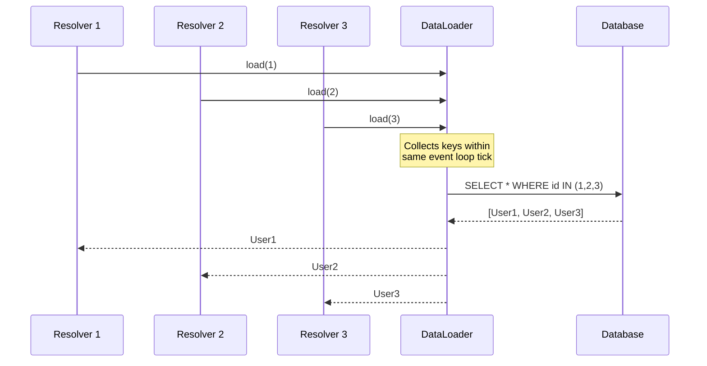

# How to Batch API Requests into Single Queries in Node.js

Author: [nawazdhandala](https://www.github.com/nawazdhandala)

Tags: NodeJS, TypeScript, API, Performance, Optimization, Backend

Description: Learn how to batch multiple API requests into single queries in Node.js using DataLoader patterns, reducing network overhead and improving application performance.

---

Making individual API calls for every piece of data is inefficient. When your application needs to fetch user profiles, product details, or related entities, batching those requests into single queries can cut response times dramatically. This guide shows you how to implement request batching in Node.js applications.

## Why Batch API Requests?

Consider a scenario where you need to fetch 100 user profiles. Making 100 individual HTTP requests creates significant overhead:

| Approach | Requests | Network Overhead | Typical Latency |
|----------|----------|------------------|-----------------|
| Individual calls | 100 | High | 5-10 seconds |
| Batched call | 1 | Low | 50-200ms |

Batching reduces network round trips, lowers server load, and improves response times by orders of magnitude.

## The DataLoader Pattern

Facebook's DataLoader pattern collects individual requests within a single event loop tick and executes them as a batch. This pattern works exceptionally well in GraphQL resolvers and REST API aggregation layers.

```typescript
// dataloader.ts
// A simple DataLoader implementation that batches requests
// within the same event loop tick

type BatchFunction<K, V> = (keys: K[]) => Promise<V[]>;

class DataLoader<K, V> {
  private batchFunction: BatchFunction<K, V>;
  private cache: Map<K, Promise<V>>;
  private queue: K[];
  private scheduled: boolean;

  constructor(batchFunction: BatchFunction<K, V>) {
    this.batchFunction = batchFunction;
    this.cache = new Map();
    this.queue = [];
    this.scheduled = false;
  }

  // Load a single key, batching happens automatically
  async load(key: K): Promise<V> {
    // Check cache first
    const cached = this.cache.get(key);
    if (cached) {
      return cached;
    }

    // Create a promise for this key
    const promise = new Promise<V>((resolve, reject) => {
      this.queue.push(key);

      // Schedule batch execution on next tick
      if (!this.scheduled) {
        this.scheduled = true;
        process.nextTick(() => this.executeBatch());
      }

      // Store resolver to call later
      const index = this.queue.length - 1;
      this.resolvers.set(index, { resolve, reject });
    });

    this.cache.set(key, promise);
    return promise;
  }

  private resolvers: Map<number, {
    resolve: (value: V) => void;
    reject: (error: Error) => void
  }> = new Map();

  private async executeBatch(): Promise<void> {
    // Grab current queue and reset
    const keys = [...this.queue];
    const resolvers = new Map(this.resolvers);
    this.queue = [];
    this.resolvers.clear();
    this.scheduled = false;

    try {
      // Execute batch function
      const results = await this.batchFunction(keys);

      // Resolve individual promises
      keys.forEach((_, index) => {
        const resolver = resolvers.get(index);
        if (resolver) {
          resolver.resolve(results[index]);
        }
      });
    } catch (error) {
      // Reject all promises on error
      resolvers.forEach(resolver => {
        resolver.reject(error as Error);
      });
    }
  }

  // Clear cache for fresh data
  clear(key: K): void {
    this.cache.delete(key);
  }

  clearAll(): void {
    this.cache.clear();
  }
}

export default DataLoader;
```

## Using DataLoader with Database Queries

The most common use case is batching database queries. Instead of running N individual SELECT statements, you run one query with an IN clause.

```typescript
// userLoader.ts
import DataLoader from './dataloader';
import { Pool } from 'pg';

interface User {
  id: number;
  name: string;
  email: string;
}

const pool = new Pool({
  connectionString: process.env.DATABASE_URL
});

// Batch function that loads multiple users in one query
async function batchLoadUsers(userIds: number[]): Promise<User[]> {
  // Single query with IN clause instead of N individual queries
  const result = await pool.query<User>(
    `SELECT id, name, email FROM users WHERE id = ANY($1)`,
    [userIds]
  );

  // DataLoader expects results in the same order as input keys
  const userMap = new Map(result.rows.map(user => [user.id, user]));

  return userIds.map(id => {
    const user = userMap.get(id);
    if (!user) {
      throw new Error(`User not found: ${id}`);
    }
    return user;
  });
}

// Create loader instance
const userLoader = new DataLoader<number, User>(batchLoadUsers);

// Usage in resolver or handler
async function getPostWithAuthor(postId: number) {
  const post = await getPost(postId);

  // This call will be batched with other load() calls
  // in the same event loop tick
  const author = await userLoader.load(post.authorId);

  return { ...post, author };
}
```

## Batching External API Requests

When calling external APIs, batching reduces both latency and rate limit consumption.

```typescript
// apiBatcher.ts
import DataLoader from './dataloader';

interface Product {
  id: string;
  name: string;
  price: number;
}

// Many APIs support batch endpoints like /products?ids=1,2,3
async function batchFetchProducts(productIds: string[]): Promise<Product[]> {
  const response = await fetch(
    `https://api.example.com/products?ids=${productIds.join(',')}`
  );

  if (!response.ok) {
    throw new Error(`API error: ${response.status}`);
  }

  const products: Product[] = await response.json();

  // Map results back to input order
  const productMap = new Map(products.map(p => [p.id, p]));

  return productIds.map(id => {
    const product = productMap.get(id);
    if (!product) {
      throw new Error(`Product not found: ${id}`);
    }
    return product;
  });
}

const productLoader = new DataLoader<string, Product>(batchFetchProducts);

// Example: Loading products for multiple orders
async function enrichOrders(orders: Order[]) {
  return Promise.all(
    orders.map(async (order) => {
      // All these load calls batch into one API request
      const products = await Promise.all(
        order.productIds.map(id => productLoader.load(id))
      );
      return { ...order, products };
    })
  );
}
```

## Request Coalescing with Time Windows

Sometimes you want to wait a short time to collect more requests before executing. This is useful when requests trickle in over a few milliseconds.

```typescript
// coalescingLoader.ts
// Batches requests within a time window, not just a single tick

class CoalescingLoader<K, V> {
  private batchFunction: (keys: K[]) => Promise<V[]>;
  private windowMs: number;
  private maxBatchSize: number;
  private queue: Array<{
    key: K;
    resolve: (value: V) => void;
    reject: (error: Error) => void;
  }> = [];
  private timer: NodeJS.Timeout | null = null;

  constructor(
    batchFunction: (keys: K[]) => Promise<V[]>,
    options: { windowMs?: number; maxBatchSize?: number } = {}
  ) {
    this.batchFunction = batchFunction;
    this.windowMs = options.windowMs || 10; // Default 10ms window
    this.maxBatchSize = options.maxBatchSize || 100;
  }

  load(key: K): Promise<V> {
    return new Promise((resolve, reject) => {
      this.queue.push({ key, resolve, reject });

      // Execute immediately if batch is full
      if (this.queue.length >= this.maxBatchSize) {
        this.executeBatch();
        return;
      }

      // Otherwise, schedule execution after window
      if (!this.timer) {
        this.timer = setTimeout(() => this.executeBatch(), this.windowMs);
      }
    });
  }

  private async executeBatch(): Promise<void> {
    // Clear timer
    if (this.timer) {
      clearTimeout(this.timer);
      this.timer = null;
    }

    // Grab current queue
    const batch = [...this.queue];
    this.queue = [];

    if (batch.length === 0) return;

    const keys = batch.map(item => item.key);

    try {
      const results = await this.batchFunction(keys);

      batch.forEach((item, index) => {
        item.resolve(results[index]);
      });
    } catch (error) {
      batch.forEach(item => {
        item.reject(error as Error);
      });
    }
  }
}

// Usage with a 20ms collection window
const loader = new CoalescingLoader<string, Product>(
  batchFetchProducts,
  { windowMs: 20, maxBatchSize: 50 }
);
```

## Batching in GraphQL Resolvers

GraphQL naturally benefits from batching because resolvers run independently but often need related data.

```typescript
// graphql-context.ts
import DataLoader from 'dataloader';
import { Pool } from 'pg';

// Create fresh loaders per request to avoid stale data
function createLoaders(pool: Pool) {
  return {
    userLoader: new DataLoader<number, User>(async (ids) => {
      const result = await pool.query(
        'SELECT * FROM users WHERE id = ANY($1)',
        [ids]
      );
      const userMap = new Map(result.rows.map(u => [u.id, u]));
      return ids.map(id => userMap.get(id) || null);
    }),

    postLoader: new DataLoader<number, Post>(async (ids) => {
      const result = await pool.query(
        'SELECT * FROM posts WHERE id = ANY($1)',
        [ids]
      );
      const postMap = new Map(result.rows.map(p => [p.id, p]));
      return ids.map(id => postMap.get(id) || null);
    }),

    commentsByPostLoader: new DataLoader<number, Comment[]>(async (postIds) => {
      const result = await pool.query(
        'SELECT * FROM comments WHERE post_id = ANY($1)',
        [postIds]
      );

      // Group comments by post_id
      const commentsByPost = new Map<number, Comment[]>();
      result.rows.forEach(comment => {
        const existing = commentsByPost.get(comment.post_id) || [];
        existing.push(comment);
        commentsByPost.set(comment.post_id, existing);
      });

      return postIds.map(id => commentsByPost.get(id) || []);
    }),
  };
}

// In your GraphQL server setup
const server = new ApolloServer({
  typeDefs,
  resolvers,
  context: ({ req }) => ({
    loaders: createLoaders(pool),
    user: authenticateRequest(req),
  }),
});

// resolver.ts
const resolvers = {
  Post: {
    // These calls batch automatically across all posts
    author: (post, _, { loaders }) => loaders.userLoader.load(post.authorId),
    comments: (post, _, { loaders }) => loaders.commentsByPostLoader.load(post.id),
  },
  Comment: {
    author: (comment, _, { loaders }) => loaders.userLoader.load(comment.authorId),
  },
};
```

## Handling Partial Failures

When some items in a batch fail, you need to handle errors gracefully without failing the entire batch.

```typescript
// partialBatch.ts
// Handles cases where some items succeed and others fail

type BatchResult<V> = { success: true; value: V } | { success: false; error: Error };

async function batchWithPartialFailure<K, V>(
  keys: K[],
  fetchFn: (keys: K[]) => Promise<Map<K, V>>
): Promise<BatchResult<V>[]> {
  try {
    const resultMap = await fetchFn(keys);

    return keys.map(key => {
      const value = resultMap.get(key);
      if (value !== undefined) {
        return { success: true, value };
      }
      return {
        success: false,
        error: new Error(`Key not found: ${key}`)
      };
    });
  } catch (error) {
    // Total failure - all items failed
    return keys.map(() => ({
      success: false,
      error: error as Error
    }));
  }
}

// Using dataloader with error objects for missing items
const userLoader = new DataLoader<number, User | Error>(async (ids) => {
  const result = await pool.query(
    'SELECT * FROM users WHERE id = ANY($1)',
    [ids as number[]]
  );

  const userMap = new Map(result.rows.map(u => [u.id, u]));

  // Return Error objects for missing users instead of throwing
  return ids.map(id => {
    const user = userMap.get(id);
    return user || new Error(`User ${id} not found`);
  });
});
```

## Batch Flow Diagram



## Performance Comparison

Here is a benchmark comparing individual vs batched queries for loading 100 users:

```typescript
// benchmark.ts
async function benchmark() {
  const userIds = Array.from({ length: 100 }, (_, i) => i + 1);

  // Individual queries
  console.time('Individual queries');
  for (const id of userIds) {
    await pool.query('SELECT * FROM users WHERE id = $1', [id]);
  }
  console.timeEnd('Individual queries');
  // Result: ~800ms

  // Batched query
  console.time('Batched query');
  await pool.query('SELECT * FROM users WHERE id = ANY($1)', [userIds]);
  console.timeEnd('Batched query');
  // Result: ~15ms
}
```

## Summary

| Pattern | Use Case | Benefit |
|---------|----------|---------|
| DataLoader | GraphQL resolvers | Automatic per-tick batching |
| Coalescing | Streaming requests | Time-window collection |
| Partial failure | Unreliable sources | Graceful degradation |
| Per-request loaders | Web servers | Cache isolation |

Batching API requests transforms O(N) network calls into O(1), making your Node.js applications faster and more efficient. The DataLoader pattern integrates naturally with async/await and works particularly well with GraphQL resolvers where data dependencies create natural batching opportunities.
