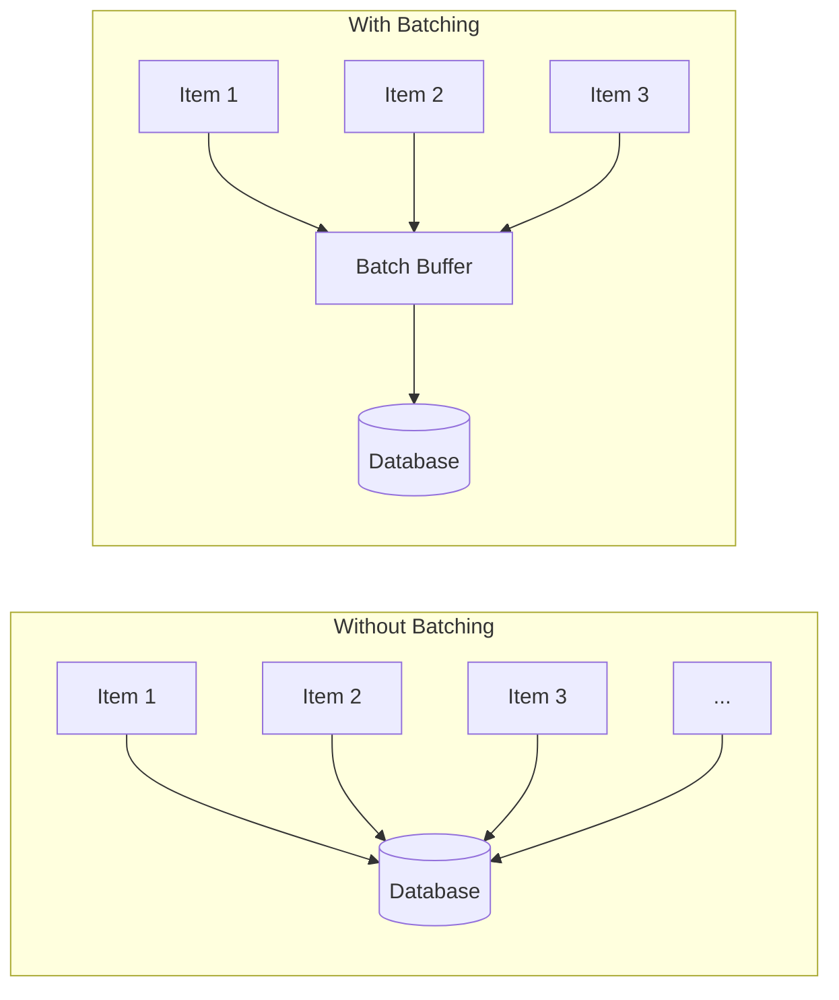

# How to Implement Batch Processing for Performance

Author: [nawazdhandala](https://www.github.com/nawazdhandala)

Tags: Batch Processing, Performance, Database, Python, Java, Backend, Optimization, ETL

Description: Learn how to implement batch processing patterns to dramatically improve application performance. This guide covers database batch operations, message batching, file processing, and monitoring strategies with practical examples.

---

> Processing items one at a time is almost always slower than processing them in batches. Whether you are inserting database records, sending messages, or processing files, batching can reduce latency by 10-100x and increase throughput proportionally. This guide shows you how to implement effective batch processing.

The overhead of each individual operation (network round trip, transaction commit, API call) dominates when processing one item at a time. Batching amortizes this overhead across many items.

---

## Why Batching Matters

```
Without batching:
1000 inserts * 5ms each = 5000ms total

With batching (batch size 100):
10 batch inserts * 50ms each = 500ms total (10x faster)
```



---

## Database Batch Inserts

### Python with PostgreSQL

```python
# batch_insert.py
import psycopg2
from psycopg2.extras import execute_values, execute_batch
from typing import List, Dict, Any
import time

class BatchInserter:
    """Efficient batch insert operations for PostgreSQL"""

    def __init__(self, connection_string: str, batch_size: int = 1000):
        self.conn = psycopg2.connect(connection_string)
        self.batch_size = batch_size

    def insert_one_by_one(self, table: str, records: List[Dict]) -> float:
        """Slow: Insert records one at a time"""
        start = time.perf_counter()

        with self.conn.cursor() as cur:
            for record in records:
                columns = ', '.join(record.keys())
                placeholders = ', '.join(['%s'] * len(record))
                query = f"INSERT INTO {table} ({columns}) VALUES ({placeholders})"
                cur.execute(query, list(record.values()))
            self.conn.commit()

        return time.perf_counter() - start

    def insert_execute_batch(self, table: str, records: List[Dict],
                             page_size: int = 1000) -> float:
        """Medium: Use execute_batch for better performance"""
        start = time.perf_counter()

        if not records:
            return 0

        columns = ', '.join(records[0].keys())
        placeholders = ', '.join(['%s'] * len(records[0]))
        query = f"INSERT INTO {table} ({columns}) VALUES ({placeholders})"

        with self.conn.cursor() as cur:
            execute_batch(
                cur,
                query,
                [list(r.values()) for r in records],
                page_size=page_size
            )
            self.conn.commit()

        return time.perf_counter() - start

    def insert_execute_values(self, table: str, records: List[Dict],
                              page_size: int = 1000) -> float:
        """Fast: Use execute_values for best performance"""
        start = time.perf_counter()

        if not records:
            return 0

        columns = ', '.join(records[0].keys())
        query = f"INSERT INTO {table} ({columns}) VALUES %s"

        with self.conn.cursor() as cur:
            execute_values(
                cur,
                query,
                [tuple(r.values()) for r in records],
                page_size=page_size
            )
            self.conn.commit()

        return time.perf_counter() - start

    def insert_copy(self, table: str, records: List[Dict]) -> float:
        """Fastest: Use COPY for maximum throughput"""
        start = time.perf_counter()

        if not records:
            return 0

        import io
        columns = list(records[0].keys())

        # Create in-memory file
        buffer = io.StringIO()
        for record in records:
            line = '\t'.join(str(record[col]) for col in columns)
            buffer.write(line + '\n')
        buffer.seek(0)

        with self.conn.cursor() as cur:
            cur.copy_from(buffer, table, columns=columns, sep='\t')
            self.conn.commit()

        return time.perf_counter() - start


# Benchmark comparison
inserter = BatchInserter("postgresql://localhost/testdb")
records = [{"name": f"User {i}", "email": f"user{i}@example.com"}
           for i in range(10000)]

# Results on typical hardware:
# One by one:      ~30 seconds
# execute_batch:   ~3 seconds
# execute_values:  ~1 second
# COPY:            ~0.3 seconds
```

### Batch Upsert (Insert or Update)

```python
# batch_upsert.py
from psycopg2.extras import execute_values

def batch_upsert(conn, table: str, records: List[Dict],
                 conflict_columns: List[str], update_columns: List[str]):
    """
    Batch upsert (insert or update on conflict).
    Uses PostgreSQL ON CONFLICT ... DO UPDATE
    """
    if not records:
        return 0

    columns = list(records[0].keys())
    columns_str = ', '.join(columns)

    # Build ON CONFLICT clause
    conflict_str = ', '.join(conflict_columns)
    update_str = ', '.join(
        f"{col} = EXCLUDED.{col}" for col in update_columns
    )

    query = f"""
        INSERT INTO {table} ({columns_str})
        VALUES %s
        ON CONFLICT ({conflict_str})
        DO UPDATE SET {update_str}
    """

    with conn.cursor() as cur:
        execute_values(cur, query, [tuple(r.values()) for r in records])
        affected = cur.rowcount
        conn.commit()

    return affected


# Usage
records = [
    {"id": 1, "name": "Alice", "email": "alice@new.com"},
    {"id": 2, "name": "Bob", "email": "bob@new.com"},
    {"id": 3, "name": "Charlie", "email": "charlie@new.com"},
]

affected = batch_upsert(
    conn=connection,
    table="users",
    records=records,
    conflict_columns=["id"],
    update_columns=["name", "email"]
)
```

---

## Message Queue Batching

### Kafka Batch Producer

```python
# kafka_batch_producer.py
from confluent_kafka import Producer
from typing import List, Dict, Any
import json
import time

class BatchKafkaProducer:
    """Kafka producer with batching for high throughput"""

    def __init__(self, bootstrap_servers: str, batch_size: int = 100,
                 linger_ms: int = 5):
        self.producer = Producer({
            'bootstrap.servers': bootstrap_servers,
            'batch.size': 16384,  # 16KB batch
            'linger.ms': linger_ms,  # Wait for batch to fill
            'compression.type': 'snappy',
            'acks': 'all',
            'retries': 3
        })
        self.batch_size = batch_size
        self.pending_count = 0

    def _delivery_callback(self, err, msg):
        """Callback for delivery confirmation"""
        if err:
            print(f"Delivery failed: {err}")
        self.pending_count -= 1

    def send(self, topic: str, messages: List[Dict]):
        """Send messages in batches"""
        for i, msg in enumerate(messages):
            # Serialize message
            value = json.dumps(msg).encode('utf-8')
            key = msg.get('id', str(i)).encode('utf-8')

            self.producer.produce(
                topic,
                value=value,
                key=key,
                callback=self._delivery_callback
            )
            self.pending_count += 1

            # Flush periodically to prevent memory buildup
            if self.pending_count >= self.batch_size:
                self.producer.poll(0)  # Trigger callbacks

        # Final flush
        self.producer.flush()

    def send_batched(self, topic: str, messages: List[Dict],
                     batch_key_fn=None):
        """Send with explicit batching by key"""
        # Group messages by key for ordered delivery
        batches: Dict[str, List] = {}
        for msg in messages:
            key = batch_key_fn(msg) if batch_key_fn else 'default'
            batches.setdefault(key, []).append(msg)

        # Send each batch
        for key, batch in batches.items():
            for msg in batch:
                self.producer.produce(
                    topic,
                    value=json.dumps(msg).encode('utf-8'),
                    key=key.encode('utf-8'),
                    callback=self._delivery_callback
                )
            # Flush after each key batch for ordering
            self.producer.flush()


# Usage
producer = BatchKafkaProducer(
    bootstrap_servers='localhost:9092',
    batch_size=1000,
    linger_ms=10
)

events = [{"user_id": i, "action": "click", "timestamp": time.time()}
          for i in range(10000)]

producer.send("user-events", events)
```

### Redis Pipeline Batching

```python
# redis_batch.py
import redis
from typing import List, Tuple, Any
import time

class RedisBatcher:
    """Redis operations with pipelining for batch performance"""

    def __init__(self, redis_url: str = "redis://localhost:6379"):
        self.redis = redis.from_url(redis_url)

    def set_many_slow(self, items: List[Tuple[str, Any]]) -> float:
        """Slow: Set items one at a time"""
        start = time.perf_counter()

        for key, value in items:
            self.redis.set(key, value)

        return time.perf_counter() - start

    def set_many_pipeline(self, items: List[Tuple[str, Any]],
                          batch_size: int = 1000) -> float:
        """Fast: Use pipeline for batched operations"""
        start = time.perf_counter()

        # Process in batches to avoid memory issues
        for i in range(0, len(items), batch_size):
            batch = items[i:i + batch_size]

            pipe = self.redis.pipeline()
            for key, value in batch:
                pipe.set(key, value)
            pipe.execute()

        return time.perf_counter() - start

    def mset_batch(self, items: List[Tuple[str, Any]]) -> float:
        """Fastest for simple sets: Use MSET"""
        start = time.perf_counter()

        # MSET takes a dict
        mapping = {k: v for k, v in items}
        self.redis.mset(mapping)

        return time.perf_counter() - start

    def get_many_pipeline(self, keys: List[str]) -> List[Any]:
        """Get multiple keys with pipeline"""
        pipe = self.redis.pipeline()
        for key in keys:
            pipe.get(key)
        return pipe.execute()


# Benchmark
batcher = RedisBatcher()
items = [(f"key:{i}", f"value:{i}") for i in range(10000)]

# Results:
# One at a time: ~5 seconds
# Pipeline:      ~0.2 seconds
# MSET:          ~0.1 seconds
```

---

## API Request Batching

### Batch HTTP Requests

```python
# batch_http.py
import asyncio
import aiohttp
from typing import List, Dict, Any
from dataclasses import dataclass
import time

@dataclass
class BatchResult:
    successful: List[Dict]
    failed: List[Dict]
    duration_ms: float

class BatchHttpClient:
    """HTTP client with request batching"""

    def __init__(self, max_concurrent: int = 50):
        self.max_concurrent = max_concurrent
        self.semaphore = asyncio.Semaphore(max_concurrent)

    async def _fetch_one(self, session: aiohttp.ClientSession,
                         request: Dict) -> Dict:
        """Fetch a single URL with rate limiting"""
        async with self.semaphore:
            try:
                async with session.request(
                    method=request.get('method', 'GET'),
                    url=request['url'],
                    json=request.get('body'),
                    headers=request.get('headers', {}),
                    timeout=aiohttp.ClientTimeout(total=30)
                ) as response:
                    return {
                        'url': request['url'],
                        'status': response.status,
                        'body': await response.json() if response.status == 200 else None,
                        'success': response.status < 400
                    }
            except Exception as e:
                return {
                    'url': request['url'],
                    'status': 0,
                    'error': str(e),
                    'success': False
                }

    async def batch_request(self, requests: List[Dict]) -> BatchResult:
        """Execute multiple HTTP requests concurrently"""
        start = time.perf_counter()

        async with aiohttp.ClientSession() as session:
            tasks = [self._fetch_one(session, req) for req in requests]
            results = await asyncio.gather(*tasks)

        duration = (time.perf_counter() - start) * 1000

        successful = [r for r in results if r['success']]
        failed = [r for r in results if not r['success']]

        return BatchResult(
            successful=successful,
            failed=failed,
            duration_ms=duration
        )


# Usage
async def main():
    client = BatchHttpClient(max_concurrent=100)

    requests = [
        {"url": f"https://api.example.com/users/{i}"}
        for i in range(1000)
    ]

    result = await client.batch_request(requests)
    print(f"Completed in {result.duration_ms:.0f}ms")
    print(f"Success: {len(result.successful)}, Failed: {len(result.failed)}")

asyncio.run(main())
```

---

## File Processing Batching

### Batch File Reader

```python
# batch_file_processor.py
import csv
from typing import Iterator, List, Dict, Callable, Any
import logging

logger = logging.getLogger(__name__)

class BatchFileProcessor:
    """Process large files in batches to manage memory"""

    def __init__(self, batch_size: int = 10000):
        self.batch_size = batch_size

    def read_csv_batches(self, filepath: str) -> Iterator[List[Dict]]:
        """Read CSV file in batches"""
        batch = []

        with open(filepath, 'r', newline='', encoding='utf-8') as f:
            reader = csv.DictReader(f)

            for row in reader:
                batch.append(row)

                if len(batch) >= self.batch_size:
                    yield batch
                    batch = []

            # Yield remaining items
            if batch:
                yield batch

    def process_file(self, filepath: str,
                     processor: Callable[[List[Dict]], Any]) -> Dict:
        """Process a file in batches with a processor function"""
        total_processed = 0
        batch_count = 0
        errors = []

        for batch in self.read_csv_batches(filepath):
            try:
                processor(batch)
                total_processed += len(batch)
                batch_count += 1

                if batch_count % 10 == 0:
                    logger.info(f"Processed {total_processed} records...")

            except Exception as e:
                errors.append({
                    'batch': batch_count,
                    'error': str(e)
                })
                logger.error(f"Error in batch {batch_count}: {e}")

        return {
            'total_processed': total_processed,
            'batch_count': batch_count,
            'errors': errors
        }


# Usage
processor = BatchFileProcessor(batch_size=10000)

def process_users(batch: List[Dict]):
    """Process a batch of user records"""
    # Batch insert to database
    inserter.insert_execute_values("users", batch)

result = processor.process_file(
    "large_users_export.csv",
    process_users
)
print(f"Processed {result['total_processed']} records in {result['batch_count']} batches")
```

---

## Batch Processing with Backpressure

```python
# batch_with_backpressure.py
import asyncio
from typing import List, Callable, Any, TypeVar
from dataclasses import dataclass
import time

T = TypeVar('T')

@dataclass
class BatchConfig:
    batch_size: int = 100
    max_wait_ms: int = 100  # Max time to wait for batch to fill
    max_queue_size: int = 10000

class BatchProcessor:
    """
    Batch processor with time-based flushing and backpressure.
    Collects items and processes them in batches either when:
    - Batch size is reached, or
    - Max wait time is reached
    """

    def __init__(self, config: BatchConfig,
                 processor: Callable[[List[T]], Any]):
        self.config = config
        self.processor = processor
        self.queue: asyncio.Queue = asyncio.Queue(maxsize=config.max_queue_size)
        self.batch: List[T] = []
        self.last_flush = time.time()
        self._running = False
        self._task = None

    async def start(self):
        """Start the batch processor"""
        self._running = True
        self._task = asyncio.create_task(self._process_loop())

    async def stop(self):
        """Stop the processor and flush remaining items"""
        self._running = False
        if self._task:
            await self._task
        # Final flush
        if self.batch:
            await self._flush()

    async def add(self, item: T):
        """Add item to batch queue (blocks if queue is full)"""
        await self.queue.put(item)

    def add_nowait(self, item: T) -> bool:
        """Add item without waiting (returns False if queue is full)"""
        try:
            self.queue.put_nowait(item)
            return True
        except asyncio.QueueFull:
            return False

    async def _process_loop(self):
        """Main processing loop"""
        while self._running or not self.queue.empty():
            try:
                # Wait for item with timeout
                timeout = self.config.max_wait_ms / 1000
                item = await asyncio.wait_for(
                    self.queue.get(),
                    timeout=timeout
                )
                self.batch.append(item)

                # Flush if batch is full
                if len(self.batch) >= self.config.batch_size:
                    await self._flush()

            except asyncio.TimeoutError:
                # Timeout reached, flush if we have items
                if self.batch:
                    await self._flush()

    async def _flush(self):
        """Flush the current batch"""
        if not self.batch:
            return

        batch_to_process = self.batch
        self.batch = []
        self.last_flush = time.time()

        try:
            await self.processor(batch_to_process)
        except Exception as e:
            # Handle processing errors (could implement retry, dead letter, etc.)
            print(f"Batch processing error: {e}")

    @property
    def queue_size(self) -> int:
        return self.queue.qsize()


# Usage
async def process_events(events: List[Dict]):
    """Batch insert events to database"""
    print(f"Processing batch of {len(events)} events")
    await db.batch_insert("events", events)

processor = BatchProcessor(
    config=BatchConfig(batch_size=100, max_wait_ms=50),
    processor=process_events
)

await processor.start()

# Add events (will be batched automatically)
for event in incoming_events:
    await processor.add(event)

await processor.stop()
```

---

## Monitoring Batch Processing

```python
# batch_metrics.py
from prometheus_client import Counter, Histogram, Gauge
import time
from functools import wraps

# Metrics
batch_size_histogram = Histogram(
    'batch_processing_size',
    'Size of processed batches',
    ['operation'],
    buckets=[10, 50, 100, 500, 1000, 5000, 10000]
)

batch_duration_histogram = Histogram(
    'batch_processing_duration_seconds',
    'Time to process a batch',
    ['operation'],
    buckets=[0.01, 0.05, 0.1, 0.5, 1, 5, 10]
)

batch_items_counter = Counter(
    'batch_items_processed_total',
    'Total items processed in batches',
    ['operation', 'status']
)

batch_queue_size = Gauge(
    'batch_queue_size',
    'Current size of batch queue',
    ['operation']
)

def monitored_batch_processor(operation: str):
    """Decorator to add monitoring to batch processing functions"""
    def decorator(func):
        @wraps(func)
        async def wrapper(batch, *args, **kwargs):
            start = time.perf_counter()

            try:
                result = await func(batch, *args, **kwargs)
                status = 'success'
            except Exception as e:
                status = 'error'
                raise
            finally:
                duration = time.perf_counter() - start

                batch_size_histogram.labels(operation=operation).observe(len(batch))
                batch_duration_histogram.labels(operation=operation).observe(duration)
                batch_items_counter.labels(
                    operation=operation, status=status
                ).inc(len(batch))

            return result
        return wrapper
    return decorator

# Usage
@monitored_batch_processor('user_import')
async def import_users(batch: List[Dict]):
    await db.batch_insert("users", batch)
```

---

## Best Practices Summary

| Scenario | Recommended Batch Size | Notes |
|----------|----------------------|-------|
| Database inserts | 1000-10000 | Use COPY for PostgreSQL if possible |
| Redis operations | 1000-5000 | Use MSET/MGET for simple ops |
| Kafka messages | 100-1000 | Balance latency vs throughput |
| HTTP requests | 50-200 | Depends on target API limits |
| File processing | 10000-100000 | Based on available memory |

---

## Conclusion

Batch processing is one of the most effective performance optimizations:

1. **Amortize overhead**: Network round trips, transaction commits, API calls
2. **Choose appropriate batch sizes**: Too small = overhead, too large = memory issues
3. **Implement backpressure**: Prevent memory exhaustion with bounded queues
4. **Time-based flushing**: Do not wait forever for batch to fill
5. **Monitor**: Track batch sizes, durations, and queue depths

Start with batch sizes around 100-1000 and tune based on your specific workload and latency requirements.

---

*Need to monitor your batch processing jobs? [OneUptime](https://oneuptime.com) provides job monitoring with batch metrics, throughput tracking, and alerting for failed batches.*
