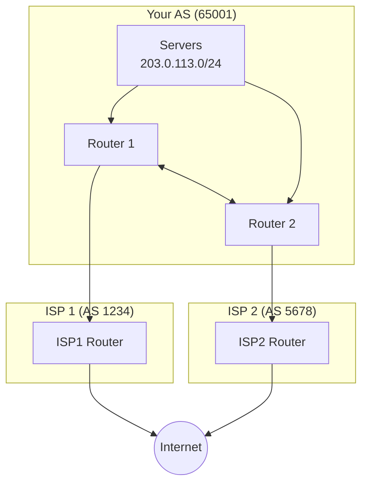
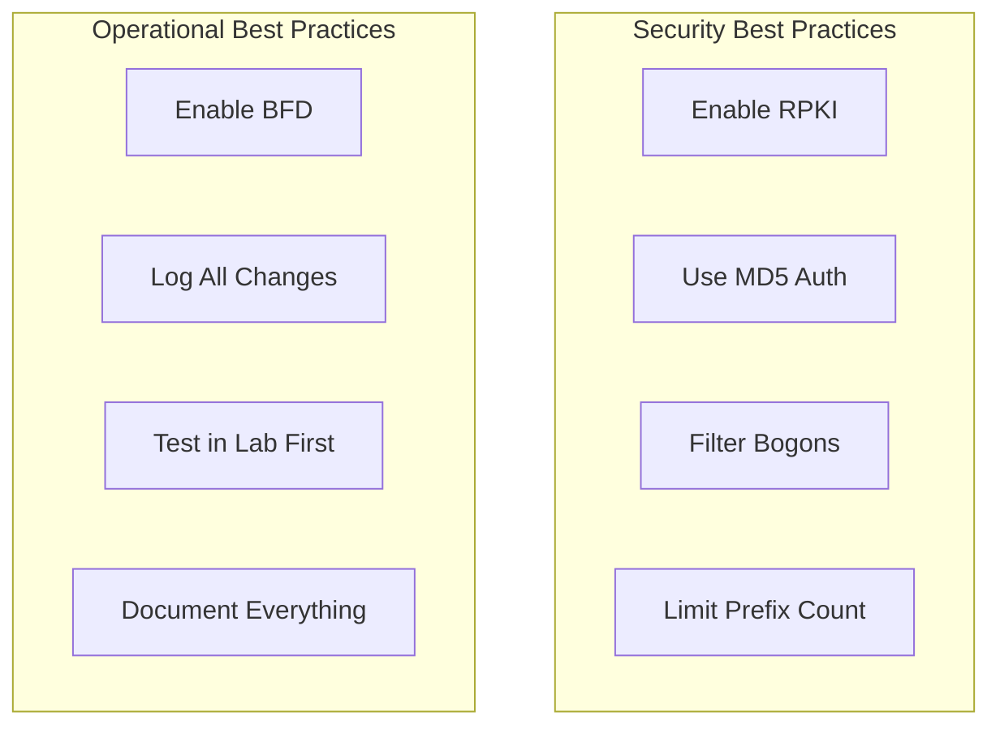

# How to Implement BGP Routing

Author: [nawazdhandala](https://www.github.com/nawazdhandala)

Tags: BGP, Networking, Routing, Infrastructure, Anycast, DevOps

Description: A practical guide to implementing BGP routing for multi-homed networks, covering peer configuration, route announcements, traffic engineering, and common troubleshooting scenarios.

---

BGP (Border Gateway Protocol) is the protocol that makes the internet work. When you need control over how your network connects to the world, whether for redundancy, performance, or anycast, you need BGP. This guide walks through practical BGP implementation.

## BGP Fundamentals



## BIRD BGP Configuration

BIRD is a popular routing daemon for Linux systems.

### Basic BIRD Configuration

```bash
# /etc/bird/bird.conf

# Router identification
router id 203.0.113.1;

# Logging
log syslog all;
log "/var/log/bird.log" { debug, trace, info, remote, warning, error, auth, fatal, bug };

# Define your networks
define MY_AS = 65001;
define MY_PREFIXES = [ 203.0.113.0/24 ];

# Protocol for kernel routing table
protocol kernel {
    scan time 60;
    import none;
    export filter {
        if proto = "static_bgp" then accept;
        reject;
    };
}

# Device protocol
protocol device {
    scan time 60;
}

# Static routes for your prefixes
protocol static static_bgp {
    route 203.0.113.0/24 blackhole;
}

# Filter for outgoing announcements
filter export_filter {
    if net ~ MY_PREFIXES then accept;
    reject;
}

# Filter for incoming routes
filter import_filter {
    # Reject private AS numbers in path
    if bgp_path ~ [64512..65534] then reject;

    # Reject bogon prefixes
    if net ~ [ 0.0.0.0/8+, 10.0.0.0/8+, 127.0.0.0/8+,
               169.254.0.0/16+, 172.16.0.0/12+,
               192.168.0.0/16+, 224.0.0.0/4+ ] then reject;

    # Accept everything else
    accept;
}

# BGP session with ISP 1
protocol bgp isp1 {
    description "ISP 1 - Primary";
    local 192.0.2.2 as MY_AS;
    neighbor 192.0.2.1 as 1234;

    # Timers (hold time, keepalive)
    hold time 90;
    keepalive time 30;

    # Graceful restart
    graceful restart on;

    import filter import_filter;
    export filter export_filter;

    # Prefer this path (higher local pref = more preferred)
    import filter {
        bgp_local_pref = 200;
        accept;
    };
}

# BGP session with ISP 2
protocol bgp isp2 {
    description "ISP 2 - Backup";
    local 198.51.100.2 as MY_AS;
    neighbor 198.51.100.1 as 5678;

    hold time 90;
    keepalive time 30;
    graceful restart on;

    import filter import_filter;
    export filter export_filter;

    # Lower preference for backup path
    import filter {
        bgp_local_pref = 100;
        accept;
    };
}
```

### Advanced Traffic Engineering

```bash
# /etc/bird/bird.conf - Traffic engineering additions

# AS path prepending for outbound traffic engineering
filter export_to_isp2 {
    if net ~ MY_PREFIXES then {
        # Prepend our AS to make this path less attractive
        bgp_path.prepend(MY_AS);
        bgp_path.prepend(MY_AS);
        accept;
    }
    reject;
}

# Community-based routing
define COMMUNITY_BLACKHOLE = (65001, 666);
define COMMUNITY_NO_EXPORT = (65001, 65281);

filter import_with_communities {
    # Honor blackhole community
    if (COMMUNITY_BLACKHOLE ~ bgp_community) then {
        dest = RTD_BLACKHOLE;
        accept;
    }

    # Set local preference based on community
    if ((1234, 100) ~ bgp_community) then bgp_local_pref = 100;
    if ((1234, 200) ~ bgp_community) then bgp_local_pref = 200;

    accept;
}

# Multiple exit discriminator (MED) for inbound traffic
filter export_with_med {
    if net ~ MY_PREFIXES then {
        # Lower MED = more preferred (by peers)
        bgp_med = 100;  # Primary link
        accept;
    }
    reject;
}

protocol bgp isp1_engineered {
    local 192.0.2.2 as MY_AS;
    neighbor 192.0.2.1 as 1234;

    import filter import_with_communities;
    export filter export_with_med;
}
```

## FRRouting (FRR) Configuration

FRR is another popular routing suite, especially for larger deployments.

### Basic FRR BGP Setup

```bash
# /etc/frr/frr.conf

frr version 8.4
frr defaults datacenter
hostname router1
log syslog informational
service integrated-vtysh-config

# BGP configuration
router bgp 65001
 bgp router-id 203.0.113.1

 # Neighbors
 neighbor 192.0.2.1 remote-as 1234
 neighbor 192.0.2.1 description ISP1-Primary
 neighbor 198.51.100.1 remote-as 5678
 neighbor 198.51.100.1 description ISP2-Backup

 # Address family IPv4
 address-family ipv4 unicast
  network 203.0.113.0/24
  neighbor 192.0.2.1 soft-reconfiguration inbound
  neighbor 192.0.2.1 route-map ISP1-IN in
  neighbor 192.0.2.1 route-map ISP1-OUT out
  neighbor 198.51.100.1 soft-reconfiguration inbound
  neighbor 198.51.100.1 route-map ISP2-IN in
  neighbor 198.51.100.1 route-map ISP2-OUT out
 exit-address-family

# Route maps
route-map ISP1-IN permit 10
 set local-preference 200

route-map ISP2-IN permit 10
 set local-preference 100

route-map ISP1-OUT permit 10
 match ip address prefix-list MY-PREFIXES

route-map ISP2-OUT permit 10
 match ip address prefix-list MY-PREFIXES
 set as-path prepend 65001 65001

# Prefix lists
ip prefix-list MY-PREFIXES seq 10 permit 203.0.113.0/24

# BFD for fast failure detection
bfd
 peer 192.0.2.1
  receive-interval 300
  transmit-interval 300
  echo-interval 100
 !
 peer 198.51.100.1
  receive-interval 300
  transmit-interval 300
```

## Anycast BGP Configuration

Anycast allows the same IP to be announced from multiple locations.

```bash
# /etc/bird/bird.conf - Anycast configuration

# Same anycast IP announced from multiple locations
define ANYCAST_IP = 192.0.2.100/32;

# Health check integration
protocol static anycast_routes {
    # Only announce if service is healthy
    route 192.0.2.100/32 blackhole;
}

# Watch file for health status
protocol bfd {
    # BFD for fast failover
}

# Conditional announcement based on health
filter export_anycast {
    # Check if local service is healthy
    if net = 192.0.2.100/32 then {
        # Only announce if health check passes
        if defined(health_check_ok) then accept;
        else reject;
    }
    reject;
}
```

### Health-Based BGP Announcement Script

```bash
#!/bin/bash
# /usr/local/bin/bgp-health-check.sh

HEALTH_ENDPOINT="http://localhost:8080/health"
BIRD_SOCKET="/var/run/bird/bird.ctl"
PREFIX="192.0.2.100/32"

check_health() {
    curl -sf --max-time 2 "$HEALTH_ENDPOINT" > /dev/null
    return $?
}

announce_route() {
    birdc -s "$BIRD_SOCKET" << EOF
configure soft "static_anycast"
EOF
}

withdraw_route() {
    birdc -s "$BIRD_SOCKET" << EOF
disable static_anycast
EOF
}

# Main loop
while true; do
    if check_health; then
        # Service healthy - ensure route is announced
        announce_route
    else
        # Service unhealthy - withdraw route
        withdraw_route
    fi
    sleep 5
done
```

## BGP Security

### RPKI Validation

```bash
# /etc/bird/bird.conf - RPKI configuration

# RPKI ROA table
roa4 table roa_v4;

# RPKI-RTR connection to validator
protocol rpki rpki_validator {
    roa4 { table roa_v4; };
    remote "127.0.0.1" port 8323;
    retry keep 90;
    refresh keep 900;
    expire keep 172800;
}

# Import filter with RPKI validation
filter import_rpki {
    # Check ROA validity
    if (roa_check(roa_v4, net, bgp_path.last) = ROA_INVALID) then {
        print "RPKI INVALID: ", net, " from AS", bgp_path.last;
        reject;
    }

    if (roa_check(roa_v4, net, bgp_path.last) = ROA_UNKNOWN) then {
        # Log but accept unknown (for now)
        print "RPKI UNKNOWN: ", net;
    }

    accept;
}
```

### MD5 Authentication

```bash
# BIRD MD5 authentication
protocol bgp isp1_secure {
    local 192.0.2.2 as 65001;
    neighbor 192.0.2.1 as 1234;
    password "shared-secret-key";

    import filter import_filter;
    export filter export_filter;
}
```

## Monitoring and Troubleshooting

### BIRD Commands

```bash
# Check BGP session status
birdc show protocols all

# Show routes from specific protocol
birdc show route protocol isp1

# Show route details
birdc show route for 8.8.8.8 all

# Show BGP neighbor details
birdc show protocols all isp1

# Soft reset BGP session
birdc configure soft
```

### FRR Commands

```bash
# Enter vtysh
vtysh

# Show BGP summary
show bgp summary

# Show BGP neighbor details
show bgp neighbors 192.0.2.1

# Show received routes
show bgp ipv4 unicast neighbors 192.0.2.1 received-routes

# Show advertised routes
show bgp ipv4 unicast neighbors 192.0.2.1 advertised-routes

# Clear BGP session
clear bgp 192.0.2.1 soft in
```

### Monitoring Script

```bash
#!/bin/bash
# bgp-monitor.sh - Monitor BGP session health

check_bird_session() {
    local session=$1
    local status=$(birdc show protocols $session | grep -E "^$session" | awk '{print $6}')

    if [ "$status" = "Established" ]; then
        echo "$session: UP"
        return 0
    else
        echo "$session: DOWN ($status)"
        return 1
    fi
}

# Check all sessions
echo "=== BGP Session Status ==="
for session in isp1 isp2; do
    check_bird_session $session
done

# Check route count
echo -e "\n=== Route Counts ==="
birdc show route count

# Check for specific prefix
echo -e "\n=== Our Prefix Status ==="
birdc show route for 203.0.113.0/24 all
```

## Best Practices



### Prefix Filtering Template

```bash
# Import filter - protect against route leaks
filter import_safe {
    # Reject our own prefixes (prevent loops)
    if net ~ MY_PREFIXES then reject;

    # Reject too specific prefixes
    if net.len > 24 then reject;

    # Reject default route unless explicitly wanted
    if net = 0.0.0.0/0 then reject;

    # Reject bogons
    if net ~ BOGON_PREFIXES then reject;

    # Limit AS path length
    if bgp_path.len > 50 then reject;

    accept;
}
```

---

BGP gives you control over your network's connectivity to the internet. Start with a simple dual-homed setup, test thoroughly before making changes, and always have a rollback plan. BGP mistakes can take down not just your network but potentially affect others, so proceed carefully and validate your configurations.
