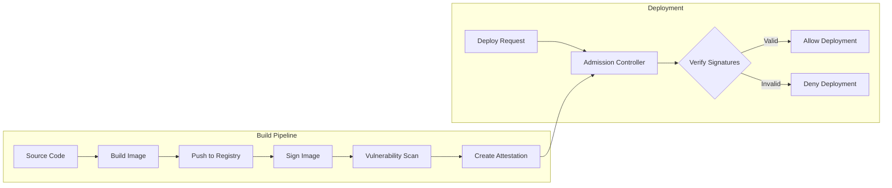

# How to Implement Binary Authorization in Kubernetes

Author: [nawazdhandala](https://www.github.com/nawazdhandala)

Tags: Kubernetes, Security, Binary Authorization, Container Signing, Supply Chain, Image Verification

Description: Learn how to implement Binary Authorization in Kubernetes to ensure only verified and signed container images run in your clusters. This guide covers image signing, attestation, and policy enforcement.

---

> Binary Authorization ensures that only trusted container images are deployed to your Kubernetes clusters. By requiring cryptographic attestations, you create a verifiable chain of custody from source code to production deployment.

Supply chain security has become critical for Kubernetes deployments. Binary Authorization provides the mechanism to verify that container images meet your organization's security and compliance requirements before they can run in production.

---

## Understanding Binary Authorization

Binary Authorization works through three key concepts:

**Attestations**: Cryptographic signatures that verify an image has passed specific checks (vulnerability scanning, code review, build verification).

**Attestors**: Authorities that create attestations. These can be your CI/CD system, security scanners, or human approvers.

**Policies**: Rules that determine which attestations are required for an image to be deployed.

---

## Prerequisites

For this guide, you will need:

- Kubernetes cluster with admission controller support
- Container registry (GCR, ECR, Docker Hub, or Harbor)
- Sigstore/Cosign installed for signing
- CI/CD pipeline (GitHub Actions, GitLab CI, or Jenkins)

---

## Architecture Overview



---

## Installing Sigstore Cosign

Cosign provides container image signing and verification:

```bash
# Install Cosign on Linux
curl -sSL https://github.com/sigstore/cosign/releases/latest/download/cosign-linux-amd64 \
  -o /usr/local/bin/cosign
chmod +x /usr/local/bin/cosign

# Verify installation
cosign version

# Generate a key pair for signing
# Store the private key securely - it is used for all signing operations
cosign generate-key-pair

# This creates:
# - cosign.key (private key - keep secure)
# - cosign.pub (public key - distribute to verifiers)
```

For keyless signing using OIDC identity (recommended for CI/CD):

```bash
# Enable keyless signing with Fulcio
export COSIGN_EXPERIMENTAL=1

# Sign using your OIDC identity (GitHub, Google, etc.)
cosign sign --identity-token=$(gcloud auth print-identity-token) \
  gcr.io/my-project/my-image:v1.0.0
```

---

## Signing Container Images in CI/CD

Integrate signing into your build pipeline. Here is a GitHub Actions example:

```yaml
# .github/workflows/build-and-sign.yaml
name: Build, Sign, and Push

on:
  push:
    branches: [main]
    tags: ['v*']

env:
  REGISTRY: ghcr.io
  IMAGE_NAME: ${{ github.repository }}

jobs:
  build-and-sign:
    runs-on: ubuntu-latest
    permissions:
      contents: read
      packages: write
      id-token: write  # Required for keyless signing

    steps:
    - name: Checkout repository
      uses: actions/checkout@v4

    - name: Set up Docker Buildx
      uses: docker/setup-buildx-action@v3

    - name: Login to Container Registry
      uses: docker/login-action@v3
      with:
        registry: ${{ env.REGISTRY }}
        username: ${{ github.actor }}
        password: ${{ secrets.GITHUB_TOKEN }}

    - name: Extract metadata
      id: meta
      uses: docker/metadata-action@v5
      with:
        images: ${{ env.REGISTRY }}/${{ env.IMAGE_NAME }}
        tags: |
          type=ref,event=branch
          type=semver,pattern={{version}}
          type=sha,prefix=

    - name: Build and push image
      id: build
      uses: docker/build-push-action@v5
      with:
        context: .
        push: true
        tags: ${{ steps.meta.outputs.tags }}
        labels: ${{ steps.meta.outputs.labels }}
        # Include build provenance
        provenance: true
        sbom: true

    - name: Install Cosign
      uses: sigstore/cosign-installer@v3

    - name: Sign the container image
      env:
        DIGEST: ${{ steps.build.outputs.digest }}
        TAGS: ${{ steps.meta.outputs.tags }}
      run: |
        # Sign each tag with keyless signing
        images=""
        for tag in ${TAGS}; do
          images+="${tag}@${DIGEST} "
        done

        # Keyless sign using GitHub OIDC
        cosign sign --yes ${images}

    - name: Verify signature
      run: |
        cosign verify \
          --certificate-identity-regexp="https://github.com/${{ github.repository }}/*" \
          --certificate-oidc-issuer="https://token.actions.githubusercontent.com" \
          ${{ env.REGISTRY }}/${{ env.IMAGE_NAME }}@${{ steps.build.outputs.digest }}
```

---

## Creating Attestations

Attestations provide verifiable claims about your image. Create attestations for different stages:

```bash
#!/bin/bash
# create-attestations.sh
# Creates attestations for a container image

IMAGE="${1}"
DIGEST="${2}"

# Attestation for vulnerability scan results
create_vuln_attestation() {
    # Run vulnerability scan
    trivy image --format json "${IMAGE}@${DIGEST}" > vuln-report.json

    # Check if scan passed (no critical/high vulnerabilities)
    CRITICAL=$(jq '[.Results[].Vulnerabilities[]? | select(.Severity=="CRITICAL")] | length' vuln-report.json)
    HIGH=$(jq '[.Results[].Vulnerabilities[]? | select(.Severity=="HIGH")] | length' vuln-report.json)

    if [ "$CRITICAL" -eq 0 ] && [ "$HIGH" -eq 0 ]; then
        echo "Vulnerability scan passed"

        # Create attestation payload
        cat <<EOF > vuln-attestation.json
{
    "_type": "https://in-toto.io/Statement/v0.1",
    "predicateType": "https://example.com/vulnerability-scan/v1",
    "subject": [{
        "name": "${IMAGE}",
        "digest": {"sha256": "${DIGEST#sha256:}"}
    }],
    "predicate": {
        "scanner": "trivy",
        "scanTime": "$(date -u +%Y-%m-%dT%H:%M:%SZ)",
        "result": "passed",
        "criticalCount": 0,
        "highCount": 0
    }
}
EOF

        # Sign and attach attestation
        cosign attest --predicate vuln-attestation.json \
          --type custom \
          "${IMAGE}@${DIGEST}"
    else
        echo "Vulnerability scan failed: ${CRITICAL} critical, ${HIGH} high"
        exit 1
    fi
}

# Attestation for SBOM (Software Bill of Materials)
create_sbom_attestation() {
    # Generate SBOM using syft
    syft "${IMAGE}@${DIGEST}" -o spdx-json > sbom.json

    # Create attestation
    cosign attest --predicate sbom.json \
      --type spdxjson \
      "${IMAGE}@${DIGEST}"
}

# Attestation for build provenance
create_provenance_attestation() {
    cat <<EOF > provenance.json
{
    "_type": "https://in-toto.io/Statement/v0.1",
    "predicateType": "https://slsa.dev/provenance/v0.2",
    "subject": [{
        "name": "${IMAGE}",
        "digest": {"sha256": "${DIGEST#sha256:}"}
    }],
    "predicate": {
        "builder": {
            "id": "${GITHUB_SERVER_URL}/${GITHUB_REPOSITORY}/actions/runs/${GITHUB_RUN_ID}"
        },
        "buildType": "https://github.com/actions",
        "invocation": {
            "configSource": {
                "uri": "${GITHUB_SERVER_URL}/${GITHUB_REPOSITORY}",
                "digest": {"sha1": "${GITHUB_SHA}"},
                "entryPoint": ".github/workflows/build.yaml"
            }
        },
        "metadata": {
            "buildStartedOn": "$(date -u +%Y-%m-%dT%H:%M:%SZ)",
            "completeness": {
                "parameters": true,
                "environment": true,
                "materials": true
            }
        }
    }
}
EOF

    cosign attest --predicate provenance.json \
      --type slsaprovenance \
      "${IMAGE}@${DIGEST}"
}

# Run all attestations
create_vuln_attestation
create_sbom_attestation
create_provenance_attestation

echo "All attestations created successfully"
```

---

## Deploying the Policy Controller

Install Sigstore Policy Controller for Kubernetes admission:

```yaml
# policy-controller-values.yaml
# Helm values for Sigstore Policy Controller

# Webhook configuration
webhook:
  replicas: 2
  # Fail closed - deny pods if webhook is unavailable
  failurePolicy: Fail

  resources:
    requests:
      cpu: 100m
      memory: 128Mi
    limits:
      cpu: 500m
      memory: 256Mi

# Namespace selector - which namespaces to enforce
namespaceSelector:
  matchExpressions:
  - key: policy.sigstore.dev/include
    operator: In
    values: ["true"]

# Cosign verification settings
cosign:
  # Default to deny unsigned images
  noMatchPolicy: deny
```

Install the controller:

```bash
# Add Sigstore Helm repository
helm repo add sigstore https://sigstore.github.io/helm-charts
helm repo update

# Install Policy Controller
helm install policy-controller sigstore/policy-controller \
  --namespace sigstore-system \
  --create-namespace \
  --values policy-controller-values.yaml
```

---

## Creating Cluster Image Policies

Define what signatures and attestations are required:

```yaml
# cluster-image-policy.yaml
apiVersion: policy.sigstore.dev/v1beta1
kind: ClusterImagePolicy
metadata:
  name: require-signed-images
spec:
  # Which images this policy applies to
  images:
  - glob: "ghcr.io/myorg/**"
  - glob: "gcr.io/myproject/**"

  # Authorities that can sign images
  authorities:
  # Keyless verification using GitHub Actions OIDC
  - name: github-actions
    keyless:
      # Trust signatures from GitHub Actions
      identities:
      - issuer: https://token.actions.githubusercontent.com
        subjectRegExp: https://github.com/myorg/.*

  # Key-based verification for manual signing
  - name: release-key
    key:
      # Public key stored in secret
      secretRef:
        name: cosign-public-key

---
# Policy requiring vulnerability attestations
apiVersion: policy.sigstore.dev/v1beta1
kind: ClusterImagePolicy
metadata:
  name: require-vuln-scan
spec:
  images:
  - glob: "ghcr.io/myorg/**"

  authorities:
  - name: vulnerability-scanner
    keyless:
      identities:
      - issuer: https://token.actions.githubusercontent.com
        subjectRegExp: https://github.com/myorg/.*
    # Require attestation
    attestations:
    - name: vuln-scan
      predicateType: https://example.com/vulnerability-scan/v1
      # Policy to evaluate attestation content
      policy:
        type: cue
        data: |
          predicateType: "https://example.com/vulnerability-scan/v1"
          predicate: {
            result: "passed"
            criticalCount: 0
            highCount: <=5
          }
```

Apply the policies:

```bash
# Apply cluster image policies
kubectl apply -f cluster-image-policy.yaml

# Label namespace to enable enforcement
kubectl label namespace production policy.sigstore.dev/include=true
```

---

## Testing Policy Enforcement

Verify the policies work correctly:

```bash
# Test with unsigned image - should be denied
kubectl run test-unsigned --image=nginx:latest -n production
# Error: admission webhook denied the request

# Test with signed image - should succeed
kubectl run test-signed --image=ghcr.io/myorg/myapp:v1.0.0 -n production
# pod/test-signed created

# Verify the signature manually
cosign verify \
  --certificate-identity-regexp="https://github.com/myorg/*" \
  --certificate-oidc-issuer="https://token.actions.githubusercontent.com" \
  ghcr.io/myorg/myapp:v1.0.0

# List attestations
cosign verify-attestation \
  --type custom \
  --certificate-identity-regexp="https://github.com/myorg/*" \
  --certificate-oidc-issuer="https://token.actions.githubusercontent.com" \
  ghcr.io/myorg/myapp:v1.0.0
```

---

## Handling Exceptions

Some images may need exemptions from signing requirements:

```yaml
# exception-policy.yaml
apiVersion: policy.sigstore.dev/v1beta1
kind: ClusterImagePolicy
metadata:
  name: allow-system-images
spec:
  # System images that are exempt
  images:
  - glob: "k8s.gcr.io/**"
  - glob: "gcr.io/google-containers/**"
  - glob: "quay.io/prometheus/**"

  # No authorities required - images are allowed
  authorities: []

  # This is a permissive policy
  mode: allow
```

---

## Monitoring and Alerts

Track policy violations and signing status:

```yaml
# prometheus-rules.yaml
apiVersion: monitoring.coreos.com/v1
kind: PrometheusRule
metadata:
  name: binary-authorization-alerts
spec:
  groups:
  - name: binary-authorization
    rules:
    # Alert on policy violations
    - alert: ImagePolicyViolation
      expr: |
        sum(rate(policy_controller_requests_total{result="denied"}[5m])) > 0
      for: 1m
      labels:
        severity: warning
      annotations:
        summary: "Container image policy violations detected"
        description: "{{ $value }} image deployments denied in the last 5 minutes"

    # Alert on webhook failures
    - alert: PolicyWebhookErrors
      expr: |
        sum(rate(policy_controller_webhook_errors_total[5m])) > 0.1
      for: 5m
      labels:
        severity: critical
      annotations:
        summary: "Policy Controller webhook errors"
        description: "Policy webhook experiencing errors - enforcement may be degraded"
```

---

## Conclusion

Binary Authorization creates a strong security boundary for your Kubernetes deployments. By requiring cryptographic proof that images have passed security checks, you establish trust in your software supply chain.

Start by signing images in CI/CD, then progressively add attestation requirements for vulnerability scanning and provenance. The combination of signing and attestations provides defense in depth against supply chain attacks.

---

*Need visibility into your deployment security? [OneUptime](https://oneuptime.com) provides monitoring and alerting for Kubernetes deployments, helping you track when policy violations occur and correlate them with incidents.*
