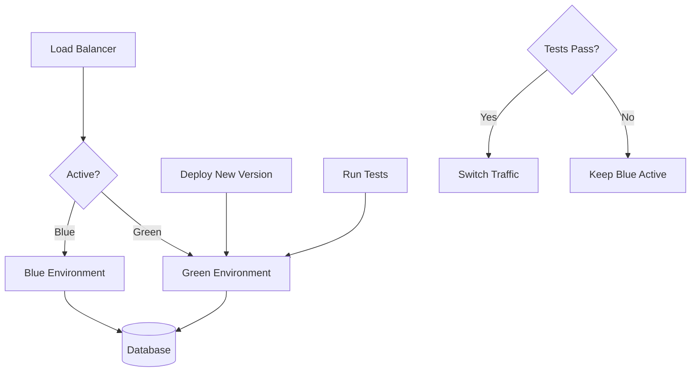

# How to Implement Blue-Green Deployment Testing

Author: [nawazdhandala](https://github.com/nawazdhandala)

Tags: Blue-Green Deployment, Testing, Kubernetes, DevOps, CI/CD

Description: Learn to implement comprehensive testing for blue-green deployments, including pre-switch validation, traffic comparison, and automated rollback triggers in Kubernetes environments.

---

Blue-green deployments maintain two identical production environments. One serves live traffic (blue) while the other receives updates (green). After testing the green environment, traffic switches instantly. This guide covers testing strategies that ensure safe blue-green deployments.

## Blue-Green Architecture



## Kubernetes Setup

Configure blue-green deployments with services and deployments:

```yaml
# blue-deployment.yaml
apiVersion: apps/v1
kind: Deployment
metadata:
  name: api-blue
  namespace: production
  labels:
    app: api
    version: blue
spec:
  replicas: 3
  selector:
    matchLabels:
      app: api
      version: blue
  template:
    metadata:
      labels:
        app: api
        version: blue
    spec:
      containers:
        - name: api
          image: myregistry/api:v1.0.0
          ports:
            - containerPort: 8080
          readinessProbe:
            httpGet:
              path: /health/ready
              port: 8080
            initialDelaySeconds: 5
            periodSeconds: 5
          livenessProbe:
            httpGet:
              path: /health/live
              port: 8080
            initialDelaySeconds: 10
            periodSeconds: 10
---
# green-deployment.yaml
apiVersion: apps/v1
kind: Deployment
metadata:
  name: api-green
  namespace: production
  labels:
    app: api
    version: green
spec:
  replicas: 3
  selector:
    matchLabels:
      app: api
      version: green
  template:
    metadata:
      labels:
        app: api
        version: green
    spec:
      containers:
        - name: api
          image: myregistry/api:v1.1.0
          ports:
            - containerPort: 8080
          readinessProbe:
            httpGet:
              path: /health/ready
              port: 8080
            initialDelaySeconds: 5
            periodSeconds: 5
          livenessProbe:
            httpGet:
              path: /health/live
              port: 8080
            initialDelaySeconds: 10
            periodSeconds: 10
---
# production-service.yaml
# This service routes traffic to the active environment
apiVersion: v1
kind: Service
metadata:
  name: api
  namespace: production
spec:
  selector:
    app: api
    version: blue  # Switch this to 'green' to change active environment
  ports:
    - port: 80
      targetPort: 8080
---
# test-service.yaml
# Direct access to green environment for testing
apiVersion: v1
kind: Service
metadata:
  name: api-green-test
  namespace: production
spec:
  selector:
    app: api
    version: green
  ports:
    - port: 80
      targetPort: 8080
```

## Pre-Switch Validation Tests

Run comprehensive tests against the green environment before switching traffic:

```typescript
// pre-switch-tests.ts
import axios, { AxiosInstance } from 'axios';

interface TestResult {
    name: string;
    passed: boolean;
    duration: number;
    error?: string;
}

class BlueGreenTestRunner {
    private greenClient: AxiosInstance;
    private blueClient: AxiosInstance;

    constructor(greenUrl: string, blueUrl: string) {
        this.greenClient = axios.create({
            baseURL: greenUrl,
            timeout: 10000,
        });
        this.blueClient = axios.create({
            baseURL: blueUrl,
            timeout: 10000,
        });
    }

    // Health check validation
    async testHealthEndpoints(): Promise<TestResult> {
        const start = Date.now();
        try {
            const liveness = await this.greenClient.get('/health/live');
            const readiness = await this.greenClient.get('/health/ready');

            const passed = liveness.status === 200 && readiness.status === 200;

            return {
                name: 'Health Endpoints',
                passed,
                duration: Date.now() - start,
            };
        } catch (error: any) {
            return {
                name: 'Health Endpoints',
                passed: false,
                duration: Date.now() - start,
                error: error.message,
            };
        }
    }

    // Smoke test critical endpoints
    async testCriticalEndpoints(): Promise<TestResult> {
        const start = Date.now();
        const endpoints = [
            { method: 'GET', path: '/api/products' },
            { method: 'GET', path: '/api/categories' },
            { method: 'GET', path: '/api/users/me' },
        ];

        try {
            for (const endpoint of endpoints) {
                const response = await this.greenClient.request({
                    method: endpoint.method,
                    url: endpoint.path,
                    headers: { 'Authorization': 'Bearer test-token' },
                });

                if (response.status >= 400) {
                    return {
                        name: 'Critical Endpoints',
                        passed: false,
                        duration: Date.now() - start,
                        error: `${endpoint.path} returned ${response.status}`,
                    };
                }
            }

            return {
                name: 'Critical Endpoints',
                passed: true,
                duration: Date.now() - start,
            };
        } catch (error: any) {
            return {
                name: 'Critical Endpoints',
                passed: false,
                duration: Date.now() - start,
                error: error.message,
            };
        }
    }

    // Compare response schemas between blue and green
    async testResponseCompatibility(): Promise<TestResult> {
        const start = Date.now();
        const testCases = [
            '/api/products',
            '/api/products/1',
            '/api/categories',
        ];

        try {
            for (const path of testCases) {
                const [blueResponse, greenResponse] = await Promise.all([
                    this.blueClient.get(path),
                    this.greenClient.get(path),
                ]);

                // Compare response structure
                const blueKeys = Object.keys(blueResponse.data);
                const greenKeys = Object.keys(greenResponse.data);

                // Green should have all keys that blue has (backward compatible)
                for (const key of blueKeys) {
                    if (!greenKeys.includes(key)) {
                        return {
                            name: 'Response Compatibility',
                            passed: false,
                            duration: Date.now() - start,
                            error: `${path}: Missing key '${key}' in green response`,
                        };
                    }
                }
            }

            return {
                name: 'Response Compatibility',
                passed: true,
                duration: Date.now() - start,
            };
        } catch (error: any) {
            return {
                name: 'Response Compatibility',
                passed: false,
                duration: Date.now() - start,
                error: error.message,
            };
        }
    }

    // Performance comparison
    async testPerformance(): Promise<TestResult> {
        const start = Date.now();
        const iterations = 100;
        const path = '/api/products';

        try {
            // Measure blue performance
            const blueLatencies: number[] = [];
            for (let i = 0; i < iterations; i++) {
                const reqStart = Date.now();
                await this.blueClient.get(path);
                blueLatencies.push(Date.now() - reqStart);
            }

            // Measure green performance
            const greenLatencies: number[] = [];
            for (let i = 0; i < iterations; i++) {
                const reqStart = Date.now();
                await this.greenClient.get(path);
                greenLatencies.push(Date.now() - reqStart);
            }

            // Calculate P95 for both
            const blueP95 = this.percentile(blueLatencies, 95);
            const greenP95 = this.percentile(greenLatencies, 95);

            // Green should not be more than 20% slower
            const degradationThreshold = 1.2;
            const passed = greenP95 <= blueP95 * degradationThreshold;

            return {
                name: 'Performance Comparison',
                passed,
                duration: Date.now() - start,
                error: passed ? undefined :
                    `Green P95 (${greenP95}ms) exceeds Blue P95 (${blueP95}ms) by more than 20%`,
            };
        } catch (error: any) {
            return {
                name: 'Performance Comparison',
                passed: false,
                duration: Date.now() - start,
                error: error.message,
            };
        }
    }

    // Database migration verification
    async testDatabaseMigration(): Promise<TestResult> {
        const start = Date.now();
        try {
            // Check if green can read data written by blue
            const blueProduct = await this.blueClient.post('/api/products', {
                name: 'Migration Test Product',
                price: 99.99,
            });

            const productId = blueProduct.data.id;

            // Green should be able to read it
            const greenProduct = await this.greenClient.get(`/api/products/${productId}`);

            // Clean up
            await this.blueClient.delete(`/api/products/${productId}`);

            const passed = greenProduct.status === 200 &&
                greenProduct.data.name === 'Migration Test Product';

            return {
                name: 'Database Migration',
                passed,
                duration: Date.now() - start,
            };
        } catch (error: any) {
            return {
                name: 'Database Migration',
                passed: false,
                duration: Date.now() - start,
                error: error.message,
            };
        }
    }

    private percentile(arr: number[], p: number): number {
        const sorted = arr.sort((a, b) => a - b);
        const index = Math.ceil((p / 100) * sorted.length) - 1;
        return sorted[index];
    }

    // Run all tests
    async runAllTests(): Promise<{
        passed: boolean;
        results: TestResult[];
    }> {
        const results = await Promise.all([
            this.testHealthEndpoints(),
            this.testCriticalEndpoints(),
            this.testResponseCompatibility(),
            this.testPerformance(),
            this.testDatabaseMigration(),
        ]);

        const passed = results.every(r => r.passed);

        return { passed, results };
    }
}

// Usage
async function validateGreenEnvironment() {
    const runner = new BlueGreenTestRunner(
        'http://api-green-test.production.svc.cluster.local',
        'http://api.production.svc.cluster.local'
    );

    const { passed, results } = await runner.runAllTests();

    console.log('\n=== Blue-Green Pre-Switch Validation ===\n');

    for (const result of results) {
        const status = result.passed ? 'PASS' : 'FAIL';
        console.log(`${status}: ${result.name} (${result.duration}ms)`);
        if (result.error) {
            console.log(`  Error: ${result.error}`);
        }
    }

    console.log(`\nOverall: ${passed ? 'READY TO SWITCH' : 'DO NOT SWITCH'}`);

    return passed;
}
```

## Traffic Switch Script

Automate the traffic switch with validation:

```bash
#!/bin/bash
# switch-traffic.sh

set -e

NAMESPACE="production"
SERVICE_NAME="api"
TARGET_VERSION="$1"  # 'blue' or 'green'

if [ -z "$TARGET_VERSION" ]; then
    echo "Usage: $0 <blue|green>"
    exit 1
fi

echo "Switching traffic to $TARGET_VERSION environment..."

# Get current version
CURRENT_VERSION=$(kubectl get svc $SERVICE_NAME -n $NAMESPACE \
    -o jsonpath='{.spec.selector.version}')

if [ "$CURRENT_VERSION" == "$TARGET_VERSION" ]; then
    echo "Traffic is already routed to $TARGET_VERSION"
    exit 0
fi

# Verify target deployment is healthy
echo "Verifying $TARGET_VERSION deployment health..."
READY_PODS=$(kubectl get deployment api-$TARGET_VERSION -n $NAMESPACE \
    -o jsonpath='{.status.readyReplicas}')
DESIRED_PODS=$(kubectl get deployment api-$TARGET_VERSION -n $NAMESPACE \
    -o jsonpath='{.spec.replicas}')

if [ "$READY_PODS" != "$DESIRED_PODS" ]; then
    echo "ERROR: $TARGET_VERSION deployment not fully ready ($READY_PODS/$DESIRED_PODS)"
    exit 1
fi

# Switch traffic
echo "Patching service selector..."
kubectl patch svc $SERVICE_NAME -n $NAMESPACE \
    -p "{\"spec\":{\"selector\":{\"version\":\"$TARGET_VERSION\"}}}"

# Verify switch
NEW_VERSION=$(kubectl get svc $SERVICE_NAME -n $NAMESPACE \
    -o jsonpath='{.spec.selector.version}')

if [ "$NEW_VERSION" == "$TARGET_VERSION" ]; then
    echo "Successfully switched traffic to $TARGET_VERSION"
else
    echo "ERROR: Traffic switch failed"
    exit 1
fi

# Wait and verify
echo "Waiting for traffic to stabilize..."
sleep 10

# Run quick health check
echo "Running post-switch health check..."
if curl -s -f "http://api.$NAMESPACE.svc.cluster.local/health/ready" > /dev/null; then
    echo "Health check passed"
else
    echo "ERROR: Health check failed, rolling back..."
    kubectl patch svc $SERVICE_NAME -n $NAMESPACE \
        -p "{\"spec\":{\"selector\":{\"version\":\"$CURRENT_VERSION\"}}}"
    exit 1
fi

echo "Traffic switch complete"
```

## Automated Rollback

Implement automatic rollback based on metrics:

```typescript
// rollback-monitor.ts
import { KubeConfig, CoreV1Api } from '@kubernetes/client-node';
import axios from 'axios';

interface MetricThreshold {
    name: string;
    query: string;
    threshold: number;
    comparison: 'lt' | 'gt';
}

class RollbackMonitor {
    private k8sApi: CoreV1Api;
    private prometheusUrl: string;
    private namespace: string;
    private serviceName: string;
    private thresholds: MetricThreshold[];

    constructor(config: {
        prometheusUrl: string;
        namespace: string;
        serviceName: string;
        thresholds: MetricThreshold[];
    }) {
        const kc = new KubeConfig();
        kc.loadFromDefault();
        this.k8sApi = kc.makeApiClient(CoreV1Api);

        this.prometheusUrl = config.prometheusUrl;
        this.namespace = config.namespace;
        this.serviceName = config.serviceName;
        this.thresholds = config.thresholds;
    }

    // Query Prometheus for metric value
    async queryMetric(query: string): Promise<number> {
        const response = await axios.get(`${this.prometheusUrl}/api/v1/query`, {
            params: { query },
        });

        const result = response.data.data.result[0];
        return result ? parseFloat(result.value[1]) : 0;
    }

    // Check all metric thresholds
    async checkThresholds(): Promise<{
        healthy: boolean;
        violations: string[];
    }> {
        const violations: string[] = [];

        for (const threshold of this.thresholds) {
            const value = await this.queryMetric(threshold.query);
            let violated = false;

            if (threshold.comparison === 'lt' && value < threshold.threshold) {
                violated = true;
            } else if (threshold.comparison === 'gt' && value > threshold.threshold) {
                violated = true;
            }

            if (violated) {
                violations.push(
                    `${threshold.name}: ${value} ${threshold.comparison === 'lt' ? '<' : '>'} ${threshold.threshold}`
                );
            }
        }

        return {
            healthy: violations.length === 0,
            violations,
        };
    }

    // Get current active version
    async getCurrentVersion(): Promise<string> {
        const service = await this.k8sApi.readNamespacedService(
            this.serviceName,
            this.namespace
        );
        return service.body.spec?.selector?.version || 'unknown';
    }

    // Switch to specified version
    async switchTo(version: string): Promise<void> {
        await this.k8sApi.patchNamespacedService(
            this.serviceName,
            this.namespace,
            {
                spec: {
                    selector: {
                        app: 'api',
                        version: version,
                    },
                },
            },
            undefined,
            undefined,
            undefined,
            undefined,
            undefined,
            { headers: { 'Content-Type': 'application/strategic-merge-patch+json' } }
        );
    }

    // Monitor and rollback if needed
    async monitorWithRollback(
        duration: number,
        checkInterval: number,
        previousVersion: string
    ): Promise<{ rolledBack: boolean; reason?: string }> {
        const endTime = Date.now() + duration;

        while (Date.now() < endTime) {
            const { healthy, violations } = await this.checkThresholds();

            if (!healthy) {
                console.log(`Threshold violations detected: ${violations.join(', ')}`);
                console.log(`Initiating rollback to ${previousVersion}...`);

                await this.switchTo(previousVersion);

                return {
                    rolledBack: true,
                    reason: violations.join('; '),
                };
            }

            await new Promise(r => setTimeout(r, checkInterval));
        }

        return { rolledBack: false };
    }
}

// Usage
const monitor = new RollbackMonitor({
    prometheusUrl: 'http://prometheus:9090',
    namespace: 'production',
    serviceName: 'api',
    thresholds: [
        {
            name: 'Error Rate',
            query: 'sum(rate(http_requests_total{status=~"5.."}[1m])) / sum(rate(http_requests_total[1m]))',
            threshold: 0.01,
            comparison: 'gt',
        },
        {
            name: 'P99 Latency',
            query: 'histogram_quantile(0.99, sum(rate(http_request_duration_seconds_bucket[1m])) by (le))',
            threshold: 1.0,
            comparison: 'gt',
        },
        {
            name: 'Success Rate',
            query: 'sum(rate(http_requests_total{status=~"2.."}[1m])) / sum(rate(http_requests_total[1m]))',
            threshold: 0.99,
            comparison: 'lt',
        },
    ],
});

// Monitor for 30 minutes after switch
monitor.monitorWithRollback(
    30 * 60 * 1000,  // 30 minutes
    10 * 1000,       // Check every 10 seconds
    'blue'           // Previous version to rollback to
);
```

## CI/CD Pipeline

Complete pipeline for blue-green deployment:

```yaml
# .github/workflows/blue-green-deploy.yaml
name: Blue-Green Deployment

on:
  push:
    branches: [main]

jobs:
  build:
    runs-on: ubuntu-latest
    outputs:
      image_tag: ${{ steps.build.outputs.tag }}
    steps:
      - uses: actions/checkout@v4

      - name: Build and push image
        id: build
        run: |
          TAG="${{ github.sha }}"
          docker build -t myregistry/api:$TAG .
          docker push myregistry/api:$TAG
          echo "tag=$TAG" >> $GITHUB_OUTPUT

  deploy-green:
    needs: build
    runs-on: ubuntu-latest
    steps:
      - uses: actions/checkout@v4

      - name: Deploy to green
        run: |
          kubectl set image deployment/api-green \
            api=myregistry/api:${{ needs.build.outputs.image_tag }} \
            -n production

      - name: Wait for rollout
        run: |
          kubectl rollout status deployment/api-green -n production --timeout=5m

  test-green:
    needs: deploy-green
    runs-on: ubuntu-latest
    steps:
      - uses: actions/checkout@v4

      - name: Run pre-switch tests
        run: npx ts-node tests/blue-green-validation.ts

  switch-traffic:
    needs: test-green
    runs-on: ubuntu-latest
    steps:
      - name: Switch to green
        run: |
          kubectl patch svc api -n production \
            -p '{"spec":{"selector":{"version":"green"}}}'

      - name: Monitor for 10 minutes
        run: npx ts-node scripts/rollback-monitor.ts --duration=600
```

## Summary

| Phase | Tests | Rollback Trigger |
|-------|-------|------------------|
| **Pre-switch** | Health, smoke, compatibility | Any test failure |
| **During switch** | Zero-downtime verification | Connection errors |
| **Post-switch** | Metrics monitoring | Threshold violations |

Blue-green deployments provide instant rollback capability, but thorough testing before the switch minimizes the need for rollbacks. Always maintain the previous environment until the new deployment is proven stable.
