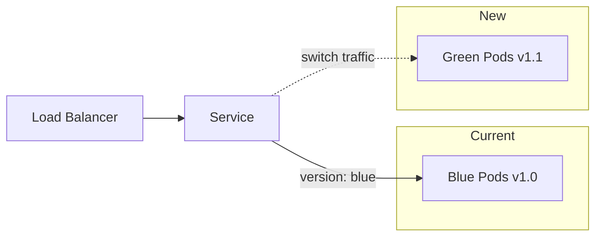

# How to Implement Blue-Green Deployments in Kubernetes

Author: [nawazdhandala](https://www.github.com/nawazdhandala)

Tags: Kubernetes, Blue-Green Deployment, Zero Downtime, Deployments, DevOps, CI/CD

Description: Learn how to implement blue-green deployments in Kubernetes for zero-downtime releases. This guide covers manual Service switching, Ingress-based routing, and automated approaches with practical examples.

---

Blue-green deployments let you release new versions with zero downtime and instant rollback capability. You run two identical environments (blue and green), route traffic to one while deploying to the other, then switch traffic once the new version is verified. Here is how to implement this pattern in Kubernetes.

## Understanding Blue-Green Architecture



The key idea is simple: deploy the new version alongside the old one, verify it works, then switch all traffic at once.

## Method 1: Service Label Selector Switching

The simplest approach uses Kubernetes Services with label selectors.

### Step 1: Deploy the Blue Version

```yaml
# blue-deployment.yaml
apiVersion: apps/v1
kind: Deployment
metadata:
  name: myapp-blue
  namespace: production
spec:
  replicas: 3
  selector:
    matchLabels:
      app: myapp
      version: blue
  template:
    metadata:
      labels:
        app: myapp
        version: blue
    spec:
      containers:
        - name: myapp
          image: myapp:1.0.0
          ports:
            - containerPort: 8080
          readinessProbe:
            httpGet:
              path: /health
              port: 8080
            initialDelaySeconds: 5
            periodSeconds: 5
          resources:
            requests:
              memory: "256Mi"
              cpu: "100m"
            limits:
              memory: "512Mi"
              cpu: "200m"
```

### Step 2: Create the Service

The Service initially points to blue:

```yaml
# myapp-service.yaml
apiVersion: v1
kind: Service
metadata:
  name: myapp
  namespace: production
spec:
  selector:
    app: myapp
    version: blue  # Points to blue deployment
  ports:
    - port: 80
      targetPort: 8080
  type: ClusterIP
```

Apply both:

```bash
kubectl apply -f blue-deployment.yaml
kubectl apply -f myapp-service.yaml

# Verify traffic goes to blue
kubectl get endpoints myapp -n production
```

### Step 3: Deploy the Green Version

Deploy the new version without receiving traffic:

```yaml
# green-deployment.yaml
apiVersion: apps/v1
kind: Deployment
metadata:
  name: myapp-green
  namespace: production
spec:
  replicas: 3
  selector:
    matchLabels:
      app: myapp
      version: green
  template:
    metadata:
      labels:
        app: myapp
        version: green
    spec:
      containers:
        - name: myapp
          image: myapp:1.1.0  # New version
          ports:
            - containerPort: 8080
          readinessProbe:
            httpGet:
              path: /health
              port: 8080
            initialDelaySeconds: 5
            periodSeconds: 5
          resources:
            requests:
              memory: "256Mi"
              cpu: "100m"
            limits:
              memory: "512Mi"
              cpu: "200m"
```

```bash
kubectl apply -f green-deployment.yaml

# Wait for green pods to be ready
kubectl rollout status deployment/myapp-green -n production
```

### Step 4: Test the Green Version

Create a temporary Service or use port-forward to test:

```bash
# Port forward to test green directly
kubectl port-forward deployment/myapp-green 8081:8080 -n production

# In another terminal, test the new version
curl http://localhost:8081/health
curl http://localhost:8081/api/version
```

### Step 5: Switch Traffic to Green

Once verified, update the Service selector:

```bash
# Switch traffic to green
kubectl patch service myapp -n production \
  -p '{"spec":{"selector":{"version":"green"}}}'

# Verify endpoints changed
kubectl get endpoints myapp -n production

# The switch is instant - all traffic now goes to green
```

### Step 6: Rollback if Needed

If something goes wrong, switch back immediately:

```bash
# Instant rollback to blue
kubectl patch service myapp -n production \
  -p '{"spec":{"selector":{"version":"blue"}}}'
```

### Step 7: Cleanup Old Version

After the new version is stable, remove the old deployment:

```bash
# Delete the blue deployment
kubectl delete deployment myapp-blue -n production
```

## Method 2: Ingress-Based Blue-Green

For external traffic, use Ingress annotations to control routing.

### Using nginx Ingress Controller

```yaml
# blue-green-ingress.yaml
apiVersion: networking.k8s.io/v1
kind: Ingress
metadata:
  name: myapp
  namespace: production
  annotations:
    nginx.ingress.kubernetes.io/canary: "false"
spec:
  ingressClassName: nginx
  rules:
    - host: myapp.example.com
      http:
        paths:
          - path: /
            pathType: Prefix
            backend:
              service:
                name: myapp-blue  # Current production
                port:
                  number: 80
```

Create separate Services for blue and green:

```yaml
# myapp-blue-service.yaml
apiVersion: v1
kind: Service
metadata:
  name: myapp-blue
  namespace: production
spec:
  selector:
    app: myapp
    version: blue
  ports:
    - port: 80
      targetPort: 8080
---
# myapp-green-service.yaml
apiVersion: v1
kind: Service
metadata:
  name: myapp-green
  namespace: production
spec:
  selector:
    app: myapp
    version: green
  ports:
    - port: 80
      targetPort: 8080
```

Switch traffic by updating the Ingress:

```bash
# Switch to green
kubectl patch ingress myapp -n production \
  --type='json' \
  -p='[{"op": "replace", "path": "/spec/rules/0/http/paths/0/backend/service/name", "value":"myapp-green"}]'

# Rollback to blue
kubectl patch ingress myapp -n production \
  --type='json' \
  -p='[{"op": "replace", "path": "/spec/rules/0/http/paths/0/backend/service/name", "value":"myapp-blue"}]'
```

## Method 3: Automated with Scripts

Create a script for repeatable blue-green deployments:

```bash
#!/bin/bash
# blue-green-deploy.sh

set -e

NAMESPACE=${NAMESPACE:-production}
APP_NAME=${APP_NAME:-myapp}
NEW_VERSION=$1
NEW_IMAGE=$2

if [ -z "$NEW_VERSION" ] || [ -z "$NEW_IMAGE" ]; then
    echo "Usage: $0 <version> <image>"
    echo "Example: $0 green myapp:1.1.0"
    exit 1
fi

# Determine current version
CURRENT_VERSION=$(kubectl get service $APP_NAME -n $NAMESPACE \
    -o jsonpath='{.spec.selector.version}')
echo "Current version: $CURRENT_VERSION"

# Create the new deployment
cat <<EOF | kubectl apply -f -
apiVersion: apps/v1
kind: Deployment
metadata:
  name: ${APP_NAME}-${NEW_VERSION}
  namespace: $NAMESPACE
spec:
  replicas: 3
  selector:
    matchLabels:
      app: $APP_NAME
      version: $NEW_VERSION
  template:
    metadata:
      labels:
        app: $APP_NAME
        version: $NEW_VERSION
    spec:
      containers:
        - name: $APP_NAME
          image: $NEW_IMAGE
          ports:
            - containerPort: 8080
          readinessProbe:
            httpGet:
              path: /health
              port: 8080
            initialDelaySeconds: 5
            periodSeconds: 5
EOF

# Wait for new deployment to be ready
echo "Waiting for $NEW_VERSION deployment to be ready..."
kubectl rollout status deployment/${APP_NAME}-${NEW_VERSION} -n $NAMESPACE

# Run smoke tests
echo "Running smoke tests..."
POD=$(kubectl get pods -n $NAMESPACE -l app=$APP_NAME,version=$NEW_VERSION \
    -o jsonpath='{.items[0].metadata.name}')
kubectl exec -n $NAMESPACE $POD -- curl -s localhost:8080/health

# Switch traffic
echo "Switching traffic to $NEW_VERSION..."
kubectl patch service $APP_NAME -n $NAMESPACE \
    -p "{\"spec\":{\"selector\":{\"version\":\"$NEW_VERSION\"}}}"

echo "Deployment complete. Traffic now routed to $NEW_VERSION"
echo "To rollback, run: kubectl patch service $APP_NAME -n $NAMESPACE -p '{\"spec\":{\"selector\":{\"version\":\"$CURRENT_VERSION\"}}}'"
```

Usage:

```bash
./blue-green-deploy.sh green myapp:1.1.0
```

## Testing Before Switching

Always test the new version before switching traffic.

### Internal Testing with Temporary Service

```yaml
# green-test-service.yaml
apiVersion: v1
kind: Service
metadata:
  name: myapp-green-test
  namespace: production
spec:
  selector:
    app: myapp
    version: green
  ports:
    - port: 80
      targetPort: 8080
  type: ClusterIP
```

```bash
# Create test service
kubectl apply -f green-test-service.yaml

# Run tests against it
kubectl run test-pod --rm -it --image=curlimages/curl -- \
    curl http://myapp-green-test/health

# Clean up
kubectl delete service myapp-green-test -n production
```

### Automated Smoke Tests

```bash
#!/bin/bash
# smoke-test.sh

SERVICE_URL=$1
TESTS_PASSED=0
TESTS_FAILED=0

run_test() {
    local name=$1
    local url=$2
    local expected=$3

    response=$(curl -s -o /dev/null -w "%{http_code}" $url)

    if [ "$response" == "$expected" ]; then
        echo "PASS: $name"
        ((TESTS_PASSED++))
    else
        echo "FAIL: $name (expected $expected, got $response)"
        ((TESTS_FAILED++))
    fi
}

run_test "Health check" "$SERVICE_URL/health" "200"
run_test "API endpoint" "$SERVICE_URL/api/status" "200"
run_test "Auth required" "$SERVICE_URL/api/admin" "401"

echo ""
echo "Results: $TESTS_PASSED passed, $TESTS_FAILED failed"

if [ $TESTS_FAILED -gt 0 ]; then
    exit 1
fi
```

## Best Practices

### Use Pod Disruption Budgets

Protect both deployments during cluster maintenance:

```yaml
apiVersion: policy/v1
kind: PodDisruptionBudget
metadata:
  name: myapp-pdb
  namespace: production
spec:
  minAvailable: 2
  selector:
    matchLabels:
      app: myapp
```

### Resource Management

Running two deployments doubles resource usage. Plan accordingly:

```bash
# Check resource usage before deploying green
kubectl top pods -n production -l app=myapp

# Consider scaling down blue after switching
kubectl scale deployment myapp-blue -n production --replicas=1
```

### Monitor After Switching

Watch metrics closely after switching traffic:

```bash
# Watch pod status
kubectl get pods -n production -l app=myapp -w

# Check for errors
kubectl logs -n production -l app=myapp,version=green --tail=100 -f
```

## Comparison with Other Strategies

| Feature | Blue-Green | Rolling Update | Canary |
|---------|------------|----------------|--------|
| Rollback Speed | Instant | Slow | Medium |
| Resource Usage | 2x during deploy | 1x + buffer | 1x + small |
| Testing | Full before switch | Limited | Gradual |
| Risk | All or nothing | Gradual | Controlled |

---

Blue-green deployments give you confidence in releases. Deploy the new version, verify it completely, then switch traffic instantly. If something breaks, roll back just as fast. The extra resource cost during deployment is worth the peace of mind.
