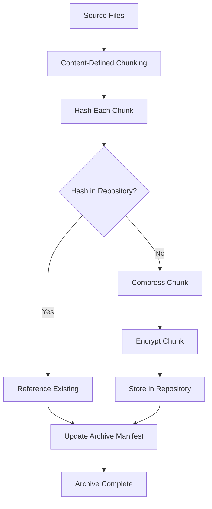

# How to Implement Borg for Incremental Backups

Author: [nawazdhandala](https://www.github.com/nawazdhandala)

Tags: Borg, Backup, Linux, Data Protection, Deduplication

Description: A hands-on guide to using BorgBackup for space-efficient incremental backups, covering repository setup, encryption modes, automated scheduling, and practical restore scenarios.

---

BorgBackup (Borg) is a deduplicating backup program that excels at storing many versions of your data efficiently. It splits files into variable-length chunks, computes hashes, and stores each unique chunk only once. When combined with compression and encryption, Borg delivers backups that are secure, fast, and surprisingly small.

This guide walks through installing Borg, creating encrypted repositories, running backups, managing archives, and restoring data.

## Why Borg?

Borg solves several pain points with traditional backup approaches:

1. **Deduplication across all archives:** Change one file in a million and only that chunk gets stored again.
2. **Compression:** Built-in LZ4, zstd, zlib, and lzma support.
3. **Authenticated encryption:** AES-256-CTR with HMAC-SHA256.
4. **Append-only mode:** Protect against ransomware by preventing deletion of old archives.
5. **Fast operations:** Local caching makes repeated backups almost instant.

The tradeoff is that Borg requires either local disk or SSH access to the repository. There is no native S3 support (though you can use rclone as a workaround).

## Installing Borg

Borg is available in most package managers:

```bash
# Ubuntu/Debian
sudo apt update && sudo apt install borgbackup

# macOS
brew install borgbackup

# Fedora/RHEL
sudo dnf install borgbackup

# Or install via pip
pip install borgbackup

# Verify installation
borg --version
# borg 1.2.7
```

For remote backups, install Borg on both the client and the server.

## Creating a Repository

A Borg repository holds all archives and deduplication data. Initialize it before your first backup:

```bash
# Create a local encrypted repository
borg init --encryption=repokey /mnt/backup/myrepo

# You will be prompted to set a passphrase
# Enter new passphrase:
# Enter same passphrase again:

# Initialize on a remote server via SSH
borg init --encryption=repokey ssh://backupuser@server.example.com/~/backups/myrepo
```

Encryption modes:
- `repokey`: Key stored in the repository, protected by passphrase. Easiest to set up.
- `keyfile`: Key stored locally in `~/.config/borg/keys/`. More secure but requires key backup.
- `none`: No encryption. Only use for non-sensitive data on trusted storage.

**Important:** Export and save your key immediately:

```bash
borg key export /mnt/backup/myrepo /safe/location/myrepo.key
```

Without this key and your passphrase, encrypted backups are unrecoverable.

## Running Your First Backup

Create an archive with the `borg create` command:

```bash
# Basic backup of home directory
export BORG_REPO=/mnt/backup/myrepo
export BORG_PASSPHRASE='your-secure-passphrase'

borg create ::home-{now} ~/

# The archive name includes a timestamp
# Archive name: home-2026-01-25T10:30:00

# Backup specific directories with exclusions
borg create ::webserver-{now} \
    /var/www \
    /etc/nginx \
    --exclude '*.log' \
    --exclude '/var/www/*/cache' \
    --exclude '/var/www/*/tmp'

# Show progress and statistics
borg create --stats --progress ::full-{now} /home /etc /var/www
```

Sample output:

```
------------------------------------------------------------------------------
Archive name: full-2026-01-25T10:30:00
Archive fingerprint: a1b2c3d4...
Time (start): Sat, 2026-01-25 10:30:00
Time (end):   Sat, 2026-01-25 10:30:45
Duration: 45.23 seconds
Number of files: 48291
Utilization of max. archive size: 0%
------------------------------------------------------------------------------
                       Original size      Compressed size    Deduplicated size
This archive:               12.45 GB              8.23 GB              1.12 GB
All archives:              124.50 GB             82.30 GB             15.67 GB
------------------------------------------------------------------------------
```

Notice how "Deduplicated size" is much smaller than "Original size" after multiple backups.

## Borg Deduplication Process



## Listing and Inspecting Archives

View what is stored in your repository:

```bash
# List all archives
borg list /mnt/backup/myrepo

# Sample output:
# home-2026-01-20T02:00:00    Sat, 2026-01-20 02:00:00
# home-2026-01-21T02:00:00    Sun, 2026-01-21 02:00:00
# home-2026-01-22T02:00:00    Mon, 2026-01-22 02:00:00

# List files in a specific archive
borg list ::home-2026-01-22T02:00:00

# Show archive metadata
borg info ::home-2026-01-22T02:00:00

# Show repository statistics
borg info /mnt/backup/myrepo
```

## Restoring Data

Borg offers multiple restore methods depending on your needs:

```bash
# Extract entire archive to current directory
cd /tmp/restore
borg extract ::home-2026-01-22T02:00:00

# Extract specific files or directories
borg extract ::home-2026-01-22T02:00:00 home/user/Documents

# Extract with different destination
borg extract ::home-2026-01-22T02:00:00 --strip-components 2 home/user/Documents

# Dry run to see what would be extracted
borg extract --dry-run --list ::home-2026-01-22T02:00:00

# Mount archive as FUSE filesystem for browsing
mkdir /mnt/borg-mount
borg mount ::home-2026-01-22T02:00:00 /mnt/borg-mount
# Browse files at /mnt/borg-mount
# When done:
borg umount /mnt/borg-mount
```

## Automating Backups

Create a backup script for automation:

```bash
#!/bin/bash
# /usr/local/bin/borg-backup.sh

set -euo pipefail

# Configuration
export BORG_REPO='ssh://backup@server.example.com/~/backups/workstation'
export BORG_PASSPHRASE='your-secure-passphrase'

# Logging
LOG_FILE="/var/log/borg-backup.log"
exec > >(tee -a "$LOG_FILE") 2>&1

echo "=== Backup started at $(date) ==="

# Create backup
borg create \
    --verbose \
    --stats \
    --compression zstd,3 \
    --exclude-caches \
    --exclude '/home/*/.cache' \
    --exclude '/home/*/.local/share/Trash' \
    --exclude '/home/*/Downloads' \
    --exclude '*.pyc' \
    --exclude '__pycache__' \
    ::'{hostname}-{now}' \
    /home \
    /etc

# Prune old archives
borg prune \
    --keep-daily 7 \
    --keep-weekly 4 \
    --keep-monthly 6 \
    --keep-yearly 2

# Compact repository (Borg 1.2+)
borg compact

echo "=== Backup completed at $(date) ==="
```

Schedule with cron:

```bash
# Edit crontab
crontab -e

# Add daily backup at 2 AM
0 2 * * * /usr/local/bin/borg-backup.sh
```

Or use systemd timer:

```ini
# /etc/systemd/system/borg-backup.service
[Unit]
Description=Borg Backup
After=network-online.target
Wants=network-online.target

[Service]
Type=oneshot
ExecStart=/usr/local/bin/borg-backup.sh
Nice=19
IOSchedulingClass=idle
```

```ini
# /etc/systemd/system/borg-backup.timer
[Unit]
Description=Daily Borg Backup

[Timer]
OnCalendar=*-*-* 02:00:00
RandomizedDelaySec=1800
Persistent=true

[Install]
WantedBy=timers.target
```

## Pruning and Retention

Archives accumulate over time. Use `borg prune` to enforce retention policies:

```bash
# Keep 7 daily, 4 weekly, 12 monthly, and 5 yearly archives
borg prune \
    --keep-daily 7 \
    --keep-weekly 4 \
    --keep-monthly 12 \
    --keep-yearly 5 \
    --stats

# Dry run to preview what would be deleted
borg prune --dry-run --list --keep-daily 7

# Delete a specific archive
borg delete ::home-2026-01-15T02:00:00
```

After pruning, run `borg compact` to reclaim disk space:

```bash
borg compact --progress /mnt/backup/myrepo
```

## Checking Repository Integrity

Verify your backups periodically:

```bash
# Quick consistency check
borg check /mnt/backup/myrepo

# Full verification including data integrity
borg check --verify-data /mnt/backup/myrepo

# Check and repair (use cautiously)
borg check --repair /mnt/backup/myrepo
```

## Compression Options

Borg supports multiple compression algorithms:

```bash
# No compression (fastest, largest)
borg create --compression none ::archive /data

# LZ4 (fast, moderate compression)
borg create --compression lz4 ::archive /data

# Zstandard (balanced, recommended default)
borg create --compression zstd,3 ::archive /data
# Levels 1-22, higher = better compression but slower

# LZMA (slow, best compression)
borg create --compression lzma,6 ::archive /data
```

For mixed workloads, use `auto,zstd,3` to skip already-compressed files:

```bash
borg create --compression auto,zstd,3 ::archive /data
```

## Append-Only Mode for Security

Protect against ransomware or accidental deletion by enabling append-only mode on the server:

```bash
# On the backup server, restrict the repository
# Add to ~/.ssh/authorized_keys:
command="borg serve --append-only --restrict-to-path /home/backup/repos",restrict ssh-rsa AAAA... client@workstation
```

In append-only mode, clients can create new archives but cannot delete or prune existing ones. An administrator must run prune operations directly on the server.

## Remote Backup Best Practices

When backing up to a remote server:

1. **Use SSH keys:** Configure passwordless SSH for automation.
   ```bash
   ssh-keygen -t ed25519 -f ~/.ssh/borg_backup
   ssh-copy-id -i ~/.ssh/borg_backup backup@server.example.com
   ```

2. **Limit SSH key permissions:** Use `command=` restrictions in authorized_keys.

3. **Set connection options:**
   ```bash
   export BORG_RSH='ssh -i ~/.ssh/borg_backup -o BatchMode=yes'
   ```

4. **Handle interruptions:** Borg is crash-safe. If a backup is interrupted, the next run continues cleanly.

## Monitoring and Alerting

Integrate backup status with your monitoring system:

```bash
#!/bin/bash
# borg-backup-monitored.sh

START=$(date +%s)

if /usr/local/bin/borg-backup.sh; then
    STATUS="ok"
    EXIT_CODE=0
else
    STATUS="critical"
    EXIT_CODE=1
fi

END=$(date +%s)
DURATION=$((END - START))

# Report to monitoring
curl -s -X POST "https://monitoring.example.com/api/v1/backup" \
    -H "Content-Type: application/json" \
    -d "{\"host\": \"$(hostname)\", \"status\": \"$STATUS\", \"duration\": $DURATION}"

exit $EXIT_CODE
```

## Wrapping Up

Borg delivers efficient, encrypted backups with minimal storage overhead. Its deduplication means your tenth backup takes almost as long as your first but uses only a fraction of the space. Start with a local repository to learn the workflow, then graduate to SSH-based remote backups for disaster recovery. Test restores quarterly because a backup you have never restored is just hope with encryption.
