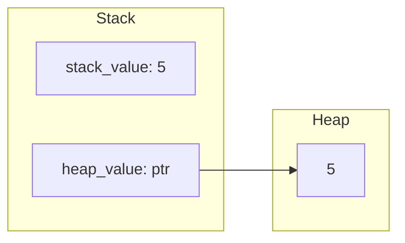

# How to Use Box for Heap Allocation in Rust

Author: [nawazdhandala](https://www.github.com/nawazdhandala)

Tags: Rust, Box, Heap, Memory, Smart Pointers

Description: Learn when and how to use Box for heap allocation in Rust. Understand the use cases including recursive types, large data, and trait objects with practical examples.

---

`Box<T>` is Rust's simplest smart pointer for heap allocation. It provides owned heap storage with a pointer on the stack. While Rust prefers stack allocation for performance, several situations require or benefit from heap allocation through Box.

## What Box Does

Box allocates data on the heap and stores a pointer on the stack:

```rust
fn main() {
    // Stack allocation
    let stack_value = 5;
    println!("Stack value: {}", stack_value);

    // Heap allocation with Box
    let heap_value = Box::new(5);
    println!("Heap value: {}", heap_value);

    // Box automatically dereferences
    let sum = *heap_value + 10;
    println!("Sum: {}", sum);

    // When Box goes out of scope, heap memory is freed
}
```

Memory layout:



## Use Case 1: Recursive Types

Recursive types have unknown size at compile time. Box provides indirection:

```rust
// Won't compile - size unknown
// enum List {
//     Cons(i32, List),
//     Nil,
// }

// Works with Box - known pointer size
enum List {
    Cons(i32, Box<List>),
    Nil,
}

use List::{Cons, Nil};

fn main() {
    // Build a linked list: 1 -> 2 -> 3 -> Nil
    let list = Cons(1, Box::new(Cons(2, Box::new(Cons(3, Box::new(Nil))))));

    // Print the list
    fn print_list(list: &List) {
        match list {
            Cons(value, next) => {
                print!("{} -> ", value);
                print_list(next);
            }
            Nil => println!("Nil"),
        }
    }

    print_list(&list);
}
```

### Binary Tree Example

```rust
#[derive(Debug)]
struct TreeNode {
    value: i32,
    left: Option<Box<TreeNode>>,
    right: Option<Box<TreeNode>>,
}

impl TreeNode {
    fn new(value: i32) -> Self {
        TreeNode {
            value,
            left: None,
            right: None,
        }
    }

    fn insert(&mut self, value: i32) {
        if value < self.value {
            match &mut self.left {
                Some(left) => left.insert(value),
                None => self.left = Some(Box::new(TreeNode::new(value))),
            }
        } else {
            match &mut self.right {
                Some(right) => right.insert(value),
                None => self.right = Some(Box::new(TreeNode::new(value))),
            }
        }
    }

    fn contains(&self, value: i32) -> bool {
        if value == self.value {
            true
        } else if value < self.value {
            self.left.as_ref().map_or(false, |n| n.contains(value))
        } else {
            self.right.as_ref().map_or(false, |n| n.contains(value))
        }
    }
}

fn main() {
    let mut tree = TreeNode::new(5);
    tree.insert(3);
    tree.insert(7);
    tree.insert(1);
    tree.insert(9);

    println!("Contains 7: {}", tree.contains(7));
    println!("Contains 4: {}", tree.contains(4));
    println!("Tree: {:#?}", tree);
}
```

## Use Case 2: Large Data

Avoid stack overflow with large data structures:

```rust
fn main() {
    // Large array on stack might overflow
    // let big_array: [u8; 10_000_000] = [0; 10_000_000];

    // Box puts it on the heap
    let big_array: Box<[u8; 10_000_000]> = Box::new([0; 10_000_000]);
    println!("Array size: {} bytes", big_array.len());

    // Or use vec for dynamic sizing
    let big_vec: Vec<u8> = vec![0; 10_000_000];
    println!("Vec size: {} bytes", big_vec.len());
}
```

## Use Case 3: Trait Objects

Box enables dynamic dispatch with trait objects:

```rust
trait Animal {
    fn speak(&self);
    fn name(&self) -> &str;
}

struct Dog {
    name: String,
}

struct Cat {
    name: String,
}

impl Animal for Dog {
    fn speak(&self) {
        println!("{} says woof!", self.name);
    }

    fn name(&self) -> &str {
        &self.name
    }
}

impl Animal for Cat {
    fn speak(&self) {
        println!("{} says meow!", self.name);
    }

    fn name(&self) -> &str {
        &self.name
    }
}

fn main() {
    // Store different types implementing Animal
    let animals: Vec<Box<dyn Animal>> = vec![
        Box::new(Dog { name: "Rex".to_string() }),
        Box::new(Cat { name: "Whiskers".to_string() }),
        Box::new(Dog { name: "Buddy".to_string() }),
    ];

    for animal in &animals {
        animal.speak();
    }
}
```

### Strategy Pattern

```rust
trait Formatter {
    fn format(&self, text: &str) -> String;
}

struct UpperCase;
struct LowerCase;
struct TitleCase;

impl Formatter for UpperCase {
    fn format(&self, text: &str) -> String {
        text.to_uppercase()
    }
}

impl Formatter for LowerCase {
    fn format(&self, text: &str) -> String {
        text.to_lowercase()
    }
}

impl Formatter for TitleCase {
    fn format(&self, text: &str) -> String {
        text.split_whitespace()
            .map(|word| {
                let mut chars = word.chars();
                match chars.next() {
                    None => String::new(),
                    Some(c) => c.to_uppercase().to_string() + chars.as_str(),
                }
            })
            .collect::<Vec<_>>()
            .join(" ")
    }
}

fn get_formatter(style: &str) -> Box<dyn Formatter> {
    match style {
        "upper" => Box::new(UpperCase),
        "lower" => Box::new(LowerCase),
        "title" => Box::new(TitleCase),
        _ => Box::new(LowerCase),
    }
}

fn main() {
    let text = "hello world from rust";

    for style in &["upper", "lower", "title"] {
        let formatter = get_formatter(style);
        println!("{}: {}", style, formatter.format(text));
    }
}
```

## Use Case 4: Transfer Ownership Without Copy

Move large data efficiently:

```rust
struct LargeData {
    buffer: [u8; 1000],
    metadata: String,
}

fn process_data(data: Box<LargeData>) {
    // Only the pointer is moved, not 1000+ bytes
    println!("Processing: {}", data.metadata);
}

fn main() {
    let data = Box::new(LargeData {
        buffer: [0; 1000],
        metadata: "Important data".to_string(),
    });

    process_data(data);  // Efficient move
}
```

## Box Methods

```rust
fn main() {
    // Create boxed value
    let boxed = Box::new(42);

    // Dereference
    let value = *boxed;
    println!("Value: {}", value);

    // Box::into_inner (moves out the value)
    let boxed = Box::new(String::from("hello"));
    let s: String = *boxed;  // Move string out of box
    println!("String: {}", s);

    // Box::leak - leak memory for static lifetime
    let leaked: &'static str = Box::leak(Box::new(String::from("static")));
    println!("Leaked: {}", leaked);

    // Box::from_raw and into_raw for FFI
    let boxed = Box::new(100);
    let raw = Box::into_raw(boxed);  // Get raw pointer
    unsafe {
        println!("Raw: {}", *raw);
        let _ = Box::from_raw(raw);  // Reclaim to drop
    }
}
```

## Box vs Other Smart Pointers

| Type | Ownership | Thread Safe | Use Case |
|------|-----------|-------------|----------|
| `Box<T>` | Single owner | Send if T: Send | Heap allocation, trait objects |
| `Rc<T>` | Multiple owners | No | Shared ownership, single thread |
| `Arc<T>` | Multiple owners | Yes | Shared ownership, multi-thread |
| `RefCell<T>` | Single owner | No | Interior mutability |

## Performance Considerations

```rust
use std::time::Instant;

fn main() {
    let iterations = 1_000_000;

    // Stack allocation (faster for small data)
    let start = Instant::now();
    for _ in 0..iterations {
        let _x = 42;
    }
    println!("Stack: {:?}", start.elapsed());

    // Heap allocation (slower due to allocation)
    let start = Instant::now();
    for _ in 0..iterations {
        let _x = Box::new(42);
    }
    println!("Heap: {:?}", start.elapsed());

    // But for large data, heap prevents stack overflow
    // and enables efficient moves
}
```

## Summary

Use `Box<T>` when you need:

1. **Recursive types** - Compile-time size requirement
2. **Large data** - Avoid stack overflow
3. **Trait objects** - Dynamic dispatch with `Box<dyn Trait>`
4. **Ownership transfer** - Move large data efficiently
5. **FFI** - Interface with C code expecting pointers

Box is the simplest smart pointer. Use it when you need heap allocation without shared ownership. For shared ownership, consider `Rc` or `Arc` instead.
