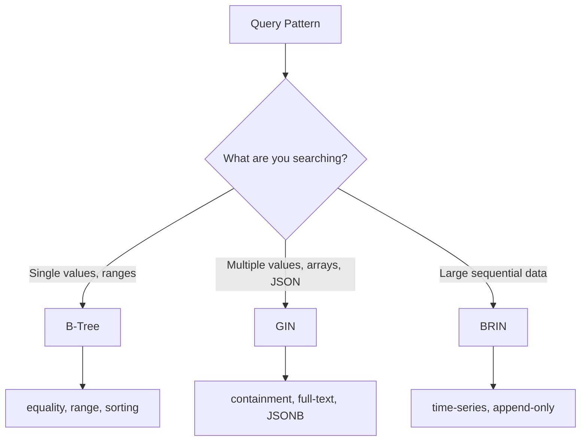

# How to Choose Between B-Tree, GIN, and BRIN Indexes in PostgreSQL

Author: [nawazdhandala](https://www.github.com/nawazdhandala)

Tags: PostgreSQL, Indexes, B-Tree, GIN, BRIN, Performance, Database Optimization

Description: Learn when to use B-Tree, GIN, and BRIN indexes in PostgreSQL. This guide covers the internals of each index type, their ideal use cases, and practical examples to help you choose the right index for your queries.

---

> Choosing the wrong index type can mean the difference between a 5ms query and a 5-second query. PostgreSQL offers multiple index types, each optimized for different access patterns. Understanding when to use B-Tree, GIN, or BRIN can dramatically improve your database performance without changing a line of application code.

---

## Index Types Overview



---

## B-Tree Indexes: The Default Workhorse

B-Tree (Balanced Tree) is PostgreSQL's default index type. It works well for most common queries.

### When to Use B-Tree

- Equality comparisons: `WHERE status = 'active'`
- Range queries: `WHERE created_at > '2024-01-01'`
- Sorting: `ORDER BY created_at DESC`
- Pattern matching with left-anchored LIKE: `WHERE name LIKE 'John%'`

### How B-Tree Works

```
                    [50]
                   /    \
              [25]      [75]
             /    \    /    \
         [10,20] [30,40] [60,70] [80,90]
```

B-Tree stores data in sorted order, enabling binary search. Each lookup has O(log n) complexity.

### B-Tree Examples

```sql
-- Standard B-Tree index (default)
CREATE INDEX idx_users_email ON users (email);

-- Composite B-Tree for multi-column queries
CREATE INDEX idx_orders_status_date ON orders (status, created_at DESC);

-- Partial index for frequently filtered subsets
CREATE INDEX idx_orders_pending ON orders (created_at)
WHERE status = 'pending';

-- Covering index to avoid table lookups
CREATE INDEX idx_orders_covering ON orders (customer_id)
INCLUDE (total, status);
```

### Query Analysis

```sql
-- Good B-Tree usage
EXPLAIN ANALYZE
SELECT * FROM orders WHERE created_at > '2024-01-01';
-- Index Scan using idx_orders_created_at

-- Good: composite index with leftmost column
EXPLAIN ANALYZE
SELECT * FROM orders WHERE status = 'pending' AND created_at > '2024-01-01';
-- Index Scan using idx_orders_status_date

-- Bad: skipping leftmost column
EXPLAIN ANALYZE
SELECT * FROM orders WHERE created_at > '2024-01-01';
-- If only idx_orders_status_date exists, might use Seq Scan
```

### B-Tree Limitations

```sql
-- NOT suitable for: array containment
-- This query cannot use a B-Tree index efficiently
SELECT * FROM products WHERE tags @> ARRAY['electronics'];

-- NOT suitable for: full-text search
SELECT * FROM articles WHERE body LIKE '%postgresql%';

-- NOT suitable for: JSONB field queries
SELECT * FROM events WHERE data->>'type' = 'click';
```

---

## GIN Indexes: For Composite Values

GIN (Generalized Inverted Index) is designed for values that contain multiple elements, like arrays, JSONB, and full-text search vectors.

### When to Use GIN

- Array operations: `WHERE tags @> ARRAY['urgent']`
- JSONB queries: `WHERE data @> '{"status": "active"}'`
- Full-text search: `WHERE search_vector @@ to_tsquery('postgresql')`
- Trigram similarity: `WHERE name % 'john'`

### How GIN Works

```
Inverted Index Structure:

'electronics' -> [1, 5, 12, 89]     (documents containing 'electronics')
'clothing'    -> [2, 3, 7, 45]      (documents containing 'clothing')
'furniture'   -> [4, 12, 23]        (documents containing 'furniture')
```

GIN maps each element to the rows containing it, enabling fast lookups for "find all rows containing X".

### GIN Examples

```sql
-- GIN for array columns
CREATE TABLE products (
    id SERIAL PRIMARY KEY,
    name VARCHAR(255),
    tags TEXT[]
);

CREATE INDEX idx_products_tags ON products USING GIN (tags);

-- Query using array containment
SELECT * FROM products WHERE tags @> ARRAY['electronics', 'sale'];
-- Uses GIN index efficiently

-- GIN for JSONB
CREATE TABLE events (
    id SERIAL PRIMARY KEY,
    data JSONB NOT NULL
);

CREATE INDEX idx_events_data ON events USING GIN (data);

-- Query JSONB containment
SELECT * FROM events WHERE data @> '{"type": "purchase", "amount": 100}';
-- Uses GIN index

-- GIN for specific JSONB paths (more selective)
CREATE INDEX idx_events_type ON events USING GIN ((data->'type'));

-- GIN for full-text search
CREATE INDEX idx_articles_search ON articles USING GIN (
    to_tsvector('english', title || ' ' || body)
);
```

### GIN Performance Tuning

```sql
-- Check GIN index size
SELECT
    indexrelname,
    pg_size_pretty(pg_relation_size(indexrelid)) AS size
FROM pg_stat_user_indexes
WHERE indexrelname LIKE '%gin%';

-- GIN with fast updates (better write performance)
CREATE INDEX idx_products_tags ON products
USING GIN (tags) WITH (fastupdate = on);

-- GIN pending list cleanup
SELECT gin_clean_pending_list('idx_products_tags');
```

### GIN Limitations

- Larger than B-Tree indexes
- Slower to update (especially without fastupdate)
- Not suitable for range queries
- Not suitable for sorting

---

## BRIN Indexes: For Sequential Data

BRIN (Block Range Index) stores summary information about ranges of physical table blocks. It is extremely small but only works well for naturally ordered data.

### When to Use BRIN

- Time-series data inserted in order
- Log tables with sequential timestamps
- Any data where physical order correlates with logical order

### How BRIN Works

```
Block Range    | Min Value  | Max Value
-------------- | ---------- | ----------
Blocks 1-128   | 2024-01-01 | 2024-01-15
Blocks 129-256 | 2024-01-15 | 2024-01-31
Blocks 257-384 | 2024-02-01 | 2024-02-14
```

BRIN stores min/max values per block range. When querying, PostgreSQL can skip entire block ranges that do not match.

### BRIN Examples

```sql
-- BRIN for time-series data
CREATE TABLE sensor_readings (
    id BIGSERIAL PRIMARY KEY,
    sensor_id INTEGER NOT NULL,
    reading DECIMAL(10, 4) NOT NULL,
    recorded_at TIMESTAMP NOT NULL DEFAULT NOW()
);

-- BRIN index on timestamp (assumes chronological inserts)
CREATE INDEX idx_readings_time ON sensor_readings
USING BRIN (recorded_at) WITH (pages_per_range = 128);

-- Query benefits from BRIN
EXPLAIN ANALYZE
SELECT * FROM sensor_readings
WHERE recorded_at BETWEEN '2024-06-01' AND '2024-06-30';
-- Bitmap Index Scan using idx_readings_time
-- Skips block ranges outside the date range

-- BRIN for log tables
CREATE TABLE application_logs (
    id BIGSERIAL,
    level VARCHAR(10),
    message TEXT,
    created_at TIMESTAMP DEFAULT NOW()
);

CREATE INDEX idx_logs_created ON application_logs
USING BRIN (created_at);
```

### BRIN Index Size Comparison

```sql
-- Compare index sizes on 10 million row table
CREATE TABLE test_data AS
SELECT
    generate_series(1, 10000000) AS id,
    NOW() - (random() * INTERVAL '365 days') AS created_at;

-- B-Tree index
CREATE INDEX idx_test_btree ON test_data (created_at);
-- Size: ~214 MB

-- BRIN index
CREATE INDEX idx_test_brin ON test_data USING BRIN (created_at);
-- Size: ~48 KB (4000x smaller!)
```

### BRIN Limitations

```sql
-- BRIN does NOT work well for:

-- 1. Randomly ordered data
-- If data is not physically clustered, BRIN cannot skip blocks
UPDATE test_data SET created_at = NOW() - (random() * INTERVAL '365 days');
-- Now BRIN scans many more blocks than necessary

-- 2. Point lookups (exact matches)
SELECT * FROM sensor_readings WHERE recorded_at = '2024-06-15 10:30:00';
-- B-Tree would be much faster for this

-- 3. Data with frequent updates
-- Updates can break the physical ordering that BRIN depends on
```

### Maintaining BRIN Effectiveness

```sql
-- Check if BRIN is still effective
SELECT
    indexrelname,
    idx_scan,
    idx_tup_read,
    idx_tup_fetch
FROM pg_stat_user_indexes
WHERE indexrelname LIKE '%brin%';

-- Re-cluster table if physical order is degraded
CLUSTER sensor_readings USING sensor_readings_pkey;

-- Or use pg_repack for online clustering
-- pg_repack -t sensor_readings -o recorded_at
```

---

## Comparison Summary

| Feature | B-Tree | GIN | BRIN |
|---------|--------|-----|------|
| **Best for** | Single values, ranges | Arrays, JSONB, FTS | Sequential data |
| **Index size** | Medium | Large | Very small |
| **Write speed** | Fast | Slower | Fast |
| **Equality** | Excellent | Excellent | Poor |
| **Range queries** | Excellent | Poor | Good (if ordered) |
| **Array containment** | No | Excellent | No |
| **Sorting** | Yes | No | No |

---

## Practical Decision Guide

### Scenario 1: User Lookup by Email

```sql
-- Use B-Tree
CREATE INDEX idx_users_email ON users (email);
-- Reason: Exact match on single scalar value
```

### Scenario 2: Products with Multiple Tags

```sql
-- Use GIN
CREATE INDEX idx_products_tags ON products USING GIN (tags);
-- Reason: Need to search for products containing specific tags
```

### Scenario 3: Time-Series Metrics

```sql
-- Use BRIN
CREATE INDEX idx_metrics_time ON metrics USING BRIN (recorded_at);
-- Reason: Data is append-only, queries are always by time range
```

### Scenario 4: JSONB Document Search

```sql
-- Use GIN
CREATE INDEX idx_docs_data ON documents USING GIN (data jsonb_path_ops);
-- Reason: Need to search within JSON documents
-- jsonb_path_ops is smaller and faster for containment queries
```

### Scenario 5: Mixed Workload

```sql
-- Sometimes you need multiple index types
CREATE TABLE orders (
    id SERIAL PRIMARY KEY,
    customer_id INTEGER,
    status VARCHAR(20),
    items JSONB,
    created_at TIMESTAMP
);

-- B-Tree for customer lookups and status filtering
CREATE INDEX idx_orders_customer ON orders (customer_id);
CREATE INDEX idx_orders_status ON orders (status, created_at);

-- GIN for searching within order items
CREATE INDEX idx_orders_items ON orders USING GIN (items);

-- BRIN for time-range reports (if data is chronological)
CREATE INDEX idx_orders_time ON orders USING BRIN (created_at);
```

---

## Conclusion

Choosing the right index type is about matching the index to your query patterns:

1. **B-Tree**: Default choice for most single-value queries and ranges
2. **GIN**: Required for arrays, JSONB, and full-text search
3. **BRIN**: Excellent for large, sequentially-ordered datasets

Test your indexes with EXPLAIN ANALYZE to verify they are being used effectively. And remember, the best index is one that matches how your application actually queries data.

---

*Need to monitor your index performance? [OneUptime](https://oneuptime.com) provides database monitoring with index usage analytics, query performance tracking, and optimization recommendations for PostgreSQL.*

**Related Reading:**
- [How to Build Full-Text Search with GIN Indexes in PostgreSQL](https://oneuptime.com/blog/post/2026-01-25-full-text-search-gin-postgresql/view)
- [How to Read and Optimize Slow Queries with EXPLAIN ANALYZE](https://oneuptime.com/blog/post/2026-01-25-explain-analyze-postgresql/view)
