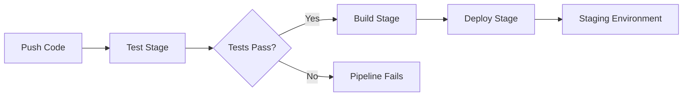

# How to Build CI/CD Pipelines with GitLab CI

Author: [nawazdhandala](https://www.github.com/nawazdhandala)

Tags: GitLab CI, CI/CD, DevOps, Automation, Pipelines

Description: Learn how to build complete CI/CD pipelines with GitLab CI from scratch, covering stages, jobs, artifacts, and deployment strategies that streamline your development workflow.

---

GitLab CI/CD is one of the most powerful continuous integration platforms available today. Unlike external CI tools, it lives right inside your GitLab repository, making pipeline management seamless. This guide walks you through building production-ready pipelines that handle testing, building, and deploying your applications.

## Understanding GitLab CI Basics

GitLab CI uses a YAML file named `.gitlab-ci.yml` at the root of your repository. This file defines your entire pipeline structure. When you push code to GitLab, the platform automatically picks up this file and executes the defined jobs.

The core concepts you need to understand are stages, jobs, and runners. Stages define the order of execution, jobs contain the actual work, and runners are the machines that execute those jobs.

## Your First Pipeline

Let's start with a simple pipeline that tests a Node.js application.

```yaml
# .gitlab-ci.yml
# Define the stages in order of execution
stages:
  - test
  - build
  - deploy

# Global variables available to all jobs
variables:
  NODE_VERSION: "20"

# Job to run unit tests
test-unit:
  stage: test
  image: node:${NODE_VERSION}
  script:
    # Install dependencies with clean install for CI
    - npm ci
    # Run the test suite
    - npm test
  # Cache node_modules between pipeline runs
  cache:
    key: ${CI_COMMIT_REF_SLUG}
    paths:
      - node_modules/
```

This configuration creates a test job that runs in a Node.js container. The `npm ci` command ensures a clean install from package-lock.json, which is faster and more reliable than `npm install` in CI environments.

## Adding Build and Deploy Stages

A real pipeline needs more than just tests. Here's an expanded version with building and deployment.

```yaml
stages:
  - test
  - build
  - deploy

variables:
  NODE_VERSION: "20"
  APP_NAME: "my-app"

# Base template for Node.js jobs
.node-base:
  image: node:${NODE_VERSION}
  cache:
    key: ${CI_COMMIT_REF_SLUG}
    paths:
      - node_modules/
  before_script:
    - npm ci

# Unit tests job
test-unit:
  extends: .node-base
  stage: test
  script:
    - npm test
  # Generate coverage reports
  coverage: '/All files[^|]*\|[^|]*\s+([\d\.]+)/'
  artifacts:
    reports:
      coverage_report:
        coverage_format: cobertura
        path: coverage/cobertura-coverage.xml

# Lint code for style issues
test-lint:
  extends: .node-base
  stage: test
  script:
    - npm run lint

# Build the application
build-app:
  extends: .node-base
  stage: build
  script:
    # Build production bundle
    - npm run build
  artifacts:
    paths:
      - dist/
    expire_in: 1 week

# Deploy to staging environment
deploy-staging:
  stage: deploy
  image: alpine:latest
  script:
    - apk add --no-cache curl
    # Deploy using your preferred method
    - ./scripts/deploy.sh staging
  environment:
    name: staging
    url: https://staging.example.com
  only:
    - develop
```

The `extends` keyword lets you inherit configuration from a template, reducing duplication. Notice how both test jobs share the same base configuration.

## Pipeline Flow Visualization

Here's how the stages execute in sequence:



## Working with Multiple Environments

Production pipelines typically deploy to multiple environments. Here's how to set up a deployment flow with manual gates.

```yaml
stages:
  - test
  - build
  - deploy-staging
  - deploy-production

# Deploy to staging automatically on develop branch
deploy-staging:
  stage: deploy-staging
  script:
    - echo "Deploying to staging..."
    - ./deploy.sh staging
  environment:
    name: staging
    url: https://staging.example.com
  only:
    - develop

# Deploy to production with manual approval
deploy-production:
  stage: deploy-production
  script:
    - echo "Deploying to production..."
    - ./deploy.sh production
  environment:
    name: production
    url: https://example.com
  # Require manual trigger for production
  when: manual
  # Only deploy tagged releases
  only:
    - tags
  # Prevent accidental parallel production deployments
  resource_group: production
```

The `when: manual` setting creates a play button in the GitLab UI. Someone must click it to trigger the production deployment. The `resource_group` ensures only one production deployment runs at a time.

## Parallel Job Execution

Speed up your pipelines by running independent jobs in parallel.

```yaml
stages:
  - test
  - build

# These jobs run in parallel during the test stage
test-unit:
  stage: test
  script:
    - npm test

test-integration:
  stage: test
  script:
    - npm run test:integration

test-e2e:
  stage: test
  script:
    - npm run test:e2e

# This job waits for all test jobs to complete
build-app:
  stage: build
  script:
    - npm run build
  # Explicitly list dependencies if needed
  needs:
    - test-unit
    - test-integration
```

All three test jobs execute simultaneously, then the build job runs after they complete. This can cut your pipeline time significantly.

## Handling Secrets and Credentials

Never put secrets directly in your `.gitlab-ci.yml`. Use GitLab CI/CD variables instead.

```yaml
deploy-production:
  stage: deploy
  script:
    # These variables are set in GitLab UI under Settings > CI/CD > Variables
    - echo "Deploying with key ${DEPLOY_KEY}"
    - aws configure set aws_access_key_id ${AWS_ACCESS_KEY_ID}
    - aws configure set aws_secret_access_key ${AWS_SECRET_ACCESS_KEY}
    - aws s3 sync dist/ s3://${S3_BUCKET}/
  # Mask sensitive output
  variables:
    GIT_STRATEGY: none
```

Set variables in your GitLab project under Settings, then CI/CD, then Variables. Mark sensitive values as masked and protected for additional security.

## Pipeline Optimization Tips

Long pipelines frustrate developers. Here are practical ways to speed them up.

First, use caching effectively. Cache dependencies between pipeline runs to avoid downloading them every time.

```yaml
# Global cache configuration
cache:
  key:
    files:
      - package-lock.json
  paths:
    - node_modules/
```

Second, use the `needs` keyword to create a directed acyclic graph (DAG) that allows jobs to start as soon as their dependencies finish, rather than waiting for the entire previous stage.

```yaml
build-frontend:
  stage: build
  script:
    - npm run build:frontend
  needs: []  # Start immediately, don't wait for test stage

build-backend:
  stage: build
  script:
    - npm run build:backend
  needs: []
```

Third, consider using smaller, purpose-built Docker images. A slim Node.js image loads faster than one packed with unnecessary tools.

## Monitoring Pipeline Health

Track your pipeline performance using GitLab's built-in analytics. Navigate to your project's CI/CD Analytics to see success rates, duration trends, and failure patterns.

Set up pipeline status badges in your README to show build status at a glance.

```markdown
[](https://gitlab.com/namespace/project/-/commits/main)
```

## Common Pitfalls to Avoid

Watch out for these frequent mistakes when building GitLab CI pipelines.

Avoid running heavy jobs on every commit. Use rules to skip expensive tests on draft merge requests or WIP branches.

Don't ignore artifact expiration. Unlimited artifacts consume storage quickly. Set reasonable expiration times.

Never hardcode environment-specific values. Use variables for anything that changes between environments.

Test your pipeline changes in a feature branch before merging. A broken pipeline on your main branch blocks everyone.

---

GitLab CI provides everything you need to automate your software delivery process. Start with a simple pipeline, then add complexity as your needs grow. The key is iterating gradually and measuring the impact of each change on your deployment velocity.
