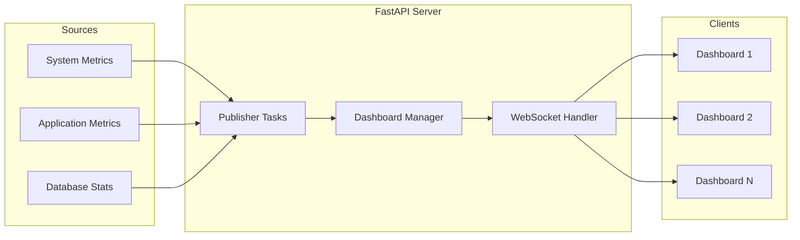

# How to Build Real-Time Dashboards with FastAPI

Author: [nawazdhandala](https://www.github.com/nawazdhandala)

Tags: Python, FastAPI, WebSocket, Real-time, Dashboard, SSE, Async

Description: Learn how to build real-time dashboards in Python using FastAPI with WebSocket and Server-Sent Events. This guide covers live data streaming, connection management, and practical patterns for monitoring dashboards.

---

> Real-time dashboards give you instant visibility into your systems. Instead of refreshing the page every few seconds, data flows to your browser the moment it changes. This guide shows you how to build production-ready real-time dashboards using FastAPI.

Whether you are building a monitoring dashboard, analytics display, or live status page, the techniques covered here will help you deliver updates to users instantly.

---

## Choosing Between WebSocket and SSE

Before writing code, you need to pick the right technology for your use case.

| Feature | WebSocket | Server-Sent Events (SSE) |
|---------|-----------|--------------------------|
| Direction | Bidirectional | Server to client only |
| Protocol | Custom binary/text | HTTP with text/event-stream |
| Reconnection | Manual | Automatic (built-in) |
| Browser support | Universal | Universal (except IE) |
| Proxy friendly | Sometimes issues | Works through HTTP |

For dashboards that only display data (no user input back to server), SSE is often simpler. For interactive dashboards where users can send commands, WebSocket is the better choice.

---

## Server-Sent Events Dashboard

SSE uses standard HTTP connections that stay open. The server pushes events as they occur. This example creates a metrics streaming endpoint that sends CPU, memory, and request counts every second.

```python
# sse_dashboard.py
# Real-time dashboard using Server-Sent Events
from fastapi import FastAPI, Request
from fastapi.responses import StreamingResponse
import asyncio
import json
import psutil  # For system metrics
from datetime import datetime

app = FastAPI()

async def generate_metrics():
    """Generator that yields metrics as SSE events"""
    while True:
        # Collect system metrics
        metrics = {
            "timestamp": datetime.utcnow().isoformat(),
            "cpu_percent": psutil.cpu_percent(),
            "memory_percent": psutil.virtual_memory().percent,
            "disk_percent": psutil.disk_usage('/').percent,
            "network_bytes_sent": psutil.net_io_counters().bytes_sent,
            "network_bytes_recv": psutil.net_io_counters().bytes_recv
        }

        # Format as SSE event (data: prefix, double newline to end)
        yield f"data: {json.dumps(metrics)}\n\n"

        # Wait before sending next update
        await asyncio.sleep(1)

@app.get("/metrics/stream")
async def stream_metrics(request: Request):
    """SSE endpoint for real-time metrics"""

    async def event_generator():
        try:
            async for event in generate_metrics():
                # Check if client disconnected
                if await request.is_disconnected():
                    break
                yield event
        except asyncio.CancelledError:
            # Client closed connection
            pass

    return StreamingResponse(
        event_generator(),
        media_type="text/event-stream",
        headers={
            "Cache-Control": "no-cache",  # Prevent caching
            "Connection": "keep-alive",    # Keep connection open
            "X-Accel-Buffering": "no"      # Disable nginx buffering
        }
    )
```

The client connects using the standard EventSource API:

```javascript
// dashboard.js
// Connect to SSE endpoint and update dashboard
const eventSource = new EventSource('/metrics/stream');

eventSource.onmessage = function(event) {
    const metrics = JSON.parse(event.data);

    // Update dashboard elements
    document.getElementById('cpu').textContent = metrics.cpu_percent + '%';
    document.getElementById('memory').textContent = metrics.memory_percent + '%';
    document.getElementById('disk').textContent = metrics.disk_percent + '%';
};

eventSource.onerror = function(error) {
    console.error('SSE connection error:', error);
    // EventSource will automatically reconnect
};
```

---

## WebSocket Dashboard with Multiple Channels

For dashboards that need bidirectional communication or multiple data channels, WebSocket provides more flexibility. This implementation supports subscribing to specific metrics channels.

```python
# websocket_dashboard.py
# Real-time dashboard with WebSocket and channel subscriptions
from fastapi import FastAPI, WebSocket, WebSocketDisconnect
from typing import Dict, Set
import asyncio
import json
from datetime import datetime

app = FastAPI()

class DashboardManager:
    """Manages WebSocket connections and channel subscriptions"""

    def __init__(self):
        self.connections: Dict[str, WebSocket] = {}  # client_id -> websocket
        self.subscriptions: Dict[str, Set[str]] = {}  # channel -> client_ids
        self.running = True

    async def connect(self, websocket: WebSocket, client_id: str):
        """Accept new connection"""
        await websocket.accept()
        self.connections[client_id] = websocket
        # Subscribe to default channel
        self.subscribe(client_id, "system")

    def disconnect(self, client_id: str):
        """Clean up on disconnect"""
        if client_id in self.connections:
            del self.connections[client_id]
        # Remove from all channel subscriptions
        for subscribers in self.subscriptions.values():
            subscribers.discard(client_id)

    def subscribe(self, client_id: str, channel: str):
        """Add client to channel"""
        if channel not in self.subscriptions:
            self.subscriptions[channel] = set()
        self.subscriptions[channel].add(client_id)

    def unsubscribe(self, client_id: str, channel: str):
        """Remove client from channel"""
        if channel in self.subscriptions:
            self.subscriptions[channel].discard(client_id)

    async def broadcast_to_channel(self, channel: str, data: dict):
        """Send data to all subscribers of a channel"""
        if channel not in self.subscriptions:
            return

        message = json.dumps({"channel": channel, "data": data})
        disconnected = []

        for client_id in self.subscriptions[channel]:
            if client_id in self.connections:
                try:
                    await self.connections[client_id].send_text(message)
                except Exception:
                    disconnected.append(client_id)

        # Clean up disconnected clients
        for client_id in disconnected:
            self.disconnect(client_id)

# Global manager instance
manager = DashboardManager()

@app.websocket("/ws/dashboard/{client_id}")
async def dashboard_websocket(websocket: WebSocket, client_id: str):
    """WebSocket endpoint for dashboard connections"""
    await manager.connect(websocket, client_id)

    try:
        while True:
            # Receive commands from client
            data = await websocket.receive_json()

            # Handle subscription commands
            if data.get("action") == "subscribe":
                channel = data.get("channel")
                manager.subscribe(client_id, channel)
                await websocket.send_json({
                    "status": "subscribed",
                    "channel": channel
                })

            elif data.get("action") == "unsubscribe":
                channel = data.get("channel")
                manager.unsubscribe(client_id, channel)
                await websocket.send_json({
                    "status": "unsubscribed",
                    "channel": channel
                })

    except WebSocketDisconnect:
        manager.disconnect(client_id)
```

---

## Background Data Publisher

The dashboard needs a background task that collects metrics and pushes them to connected clients. This publisher runs independently and broadcasts to the appropriate channels.

```python
# publisher.py
# Background task that publishes metrics to dashboard channels
import asyncio
import psutil
import random
from datetime import datetime

async def publish_system_metrics(manager: DashboardManager):
    """Publish system metrics every second"""
    while manager.running:
        metrics = {
            "timestamp": datetime.utcnow().isoformat(),
            "cpu_percent": psutil.cpu_percent(interval=None),
            "memory_used_gb": psutil.virtual_memory().used / (1024**3),
            "memory_total_gb": psutil.virtual_memory().total / (1024**3)
        }
        await manager.broadcast_to_channel("system", metrics)
        await asyncio.sleep(1)

async def publish_application_metrics(manager: DashboardManager):
    """Publish application-specific metrics"""
    # Simulated application metrics
    request_count = 0
    error_count = 0

    while manager.running:
        # In production, these would come from actual counters
        request_count += random.randint(10, 50)
        error_count += random.randint(0, 2)

        metrics = {
            "timestamp": datetime.utcnow().isoformat(),
            "requests_total": request_count,
            "errors_total": error_count,
            "error_rate": error_count / max(request_count, 1) * 100,
            "avg_response_ms": random.uniform(50, 200)
        }
        await manager.broadcast_to_channel("application", metrics)
        await asyncio.sleep(1)

@app.on_event("startup")
async def start_publishers():
    """Start background metric publishers"""
    asyncio.create_task(publish_system_metrics(manager))
    asyncio.create_task(publish_application_metrics(manager))

@app.on_event("shutdown")
async def stop_publishers():
    """Signal publishers to stop"""
    manager.running = False
```

---

## Data Flow Architecture

The following diagram shows how data flows from metric sources through the FastAPI server to connected dashboard clients.



---

## Aggregated Metrics Endpoint

For dashboards that need historical context, you can maintain a sliding window of recent metrics. This allows showing trends and sparklines without a full time-series database.

```python
# aggregated_metrics.py
# Maintain sliding window of metrics for trend display
from collections import deque
from dataclasses import dataclass, field
from typing import List, Deque
from datetime import datetime
import statistics

@dataclass
class MetricWindow:
    """Sliding window of metric values"""
    name: str
    max_size: int = 60  # Keep last 60 readings (1 minute at 1/sec)
    values: Deque = field(default_factory=deque)
    timestamps: Deque = field(default_factory=deque)

    def add(self, value: float):
        """Add new value, removing oldest if at capacity"""
        self.values.append(value)
        self.timestamps.append(datetime.utcnow())

        if len(self.values) > self.max_size:
            self.values.popleft()
            self.timestamps.popleft()

    def get_stats(self) -> dict:
        """Calculate statistics over the window"""
        if not self.values:
            return {"current": None, "min": None, "max": None, "avg": None}

        values_list = list(self.values)
        return {
            "current": values_list[-1],
            "min": min(values_list),
            "max": max(values_list),
            "avg": statistics.mean(values_list),
            "trend": self._calculate_trend(values_list)
        }

    def _calculate_trend(self, values: List[float]) -> str:
        """Determine if metric is rising, falling, or stable"""
        if len(values) < 2:
            return "stable"

        recent = values[-5:]  # Last 5 values
        older = values[-10:-5] if len(values) >= 10 else values[:len(values)//2]

        if not older:
            return "stable"

        recent_avg = statistics.mean(recent)
        older_avg = statistics.mean(older)
        diff_percent = ((recent_avg - older_avg) / older_avg) * 100 if older_avg else 0

        if diff_percent > 5:
            return "rising"
        elif diff_percent < -5:
            return "falling"
        return "stable"

class MetricsAggregator:
    """Aggregates metrics with sliding windows"""

    def __init__(self):
        self.windows: Dict[str, MetricWindow] = {}

    def record(self, name: str, value: float):
        """Record a metric value"""
        if name not in self.windows:
            self.windows[name] = MetricWindow(name=name)
        self.windows[name].add(value)

    def get_dashboard_data(self) -> dict:
        """Get all metrics with stats for dashboard display"""
        return {
            name: window.get_stats()
            for name, window in self.windows.items()
        }

# Usage in publisher
aggregator = MetricsAggregator()

async def collect_and_publish(manager: DashboardManager):
    """Collect metrics, aggregate, and publish"""
    while manager.running:
        cpu = psutil.cpu_percent()
        memory = psutil.virtual_memory().percent

        # Record for aggregation
        aggregator.record("cpu", cpu)
        aggregator.record("memory", memory)

        # Publish aggregated data with trends
        await manager.broadcast_to_channel(
            "dashboard",
            aggregator.get_dashboard_data()
        )
        await asyncio.sleep(1)
```

---

## Connection Health Monitoring

Production dashboards need to handle network issues gracefully. This heartbeat mechanism detects stale connections and cleans them up.

```python
# connection_health.py
# Monitor WebSocket connection health with heartbeats
import asyncio
from datetime import datetime, timedelta

class HealthyDashboardManager(DashboardManager):
    """Dashboard manager with connection health monitoring"""

    def __init__(self, heartbeat_interval: int = 30):
        super().__init__()
        self.last_pong: Dict[str, datetime] = {}
        self.heartbeat_interval = heartbeat_interval

    async def connect(self, websocket: WebSocket, client_id: str):
        await super().connect(websocket, client_id)
        self.last_pong[client_id] = datetime.utcnow()

    def disconnect(self, client_id: str):
        super().disconnect(client_id)
        if client_id in self.last_pong:
            del self.last_pong[client_id]

    def record_pong(self, client_id: str):
        """Record that client responded to ping"""
        self.last_pong[client_id] = datetime.utcnow()

    async def heartbeat_loop(self):
        """Send pings and check for stale connections"""
        while self.running:
            stale_clients = []
            now = datetime.utcnow()

            for client_id, last_seen in self.last_pong.items():
                # Check if client missed too many heartbeats
                if now - last_seen > timedelta(seconds=self.heartbeat_interval * 2):
                    stale_clients.append(client_id)
                elif client_id in self.connections:
                    # Send ping to active clients
                    try:
                        await self.connections[client_id].send_json({
                            "type": "ping",
                            "timestamp": now.isoformat()
                        })
                    except Exception:
                        stale_clients.append(client_id)

            # Clean up stale connections
            for client_id in stale_clients:
                self.disconnect(client_id)

            await asyncio.sleep(self.heartbeat_interval)
```

---

## Best Practices

### Buffer Updates for Efficiency

```python
# Instead of sending every change immediately
# Buffer updates and send in batches

class BufferedPublisher:
    def __init__(self, flush_interval: float = 0.1):
        self.buffer: List[dict] = []
        self.flush_interval = flush_interval

    async def add(self, data: dict):
        self.buffer.append(data)

    async def flush_loop(self, manager: DashboardManager, channel: str):
        while manager.running:
            if self.buffer:
                # Send all buffered updates at once
                await manager.broadcast_to_channel(channel, {
                    "updates": self.buffer.copy()
                })
                self.buffer.clear()
            await asyncio.sleep(self.flush_interval)
```

### Handle Slow Clients

```python
# Use asyncio.wait_for to prevent slow clients from blocking others

async def send_with_timeout(websocket: WebSocket, data: str, timeout: float = 5.0):
    try:
        await asyncio.wait_for(websocket.send_text(data), timeout=timeout)
        return True
    except asyncio.TimeoutError:
        return False  # Client too slow, should be disconnected
```

### Client-Side Reconnection

```javascript
// Robust WebSocket client with exponential backoff
class DashboardClient {
    constructor(url) {
        this.url = url;
        this.reconnectDelay = 1000;
        this.maxDelay = 30000;
        this.connect();
    }

    connect() {
        this.ws = new WebSocket(this.url);

        this.ws.onopen = () => {
            this.reconnectDelay = 1000;  // Reset on successful connect
            this.subscribe('system');
            this.subscribe('application');
        };

        this.ws.onclose = () => {
            setTimeout(() => this.connect(), this.reconnectDelay);
            this.reconnectDelay = Math.min(this.reconnectDelay * 2, this.maxDelay);
        };

        this.ws.onmessage = (event) => {
            const message = JSON.parse(event.data);
            if (message.type === 'ping') {
                this.ws.send(JSON.stringify({type: 'pong'}));
            } else {
                this.updateDashboard(message);
            }
        };
    }
}
```

---

## Conclusion

Building real-time dashboards with FastAPI involves several components working together:

- **SSE** works well for simple one-way data streams
- **WebSocket** provides bidirectional communication for interactive dashboards
- **Background publishers** collect and distribute metrics
- **Aggregators** maintain historical context for trends
- **Health monitoring** ensures connections stay active

The patterns shown here scale to hundreds of concurrent dashboard viewers. For larger deployments, consider adding Redis pub/sub for horizontal scaling across multiple server instances.

---

*Need to monitor your real-time dashboards? [OneUptime](https://oneuptime.com) provides comprehensive monitoring for your WebSocket connections and dashboard infrastructure.*

**Related Reading:**
- [How to Implement WebSocket Connections in Python with FastAPI](https://oneuptime.com/blog/post/2025-01-06-python-websocket-fastapi/view)
- [How to Build Health Checks and Readiness Probes in Python](https://oneuptime.com/blog/post/2025-01-06-python-health-checks-kubernetes/view)
