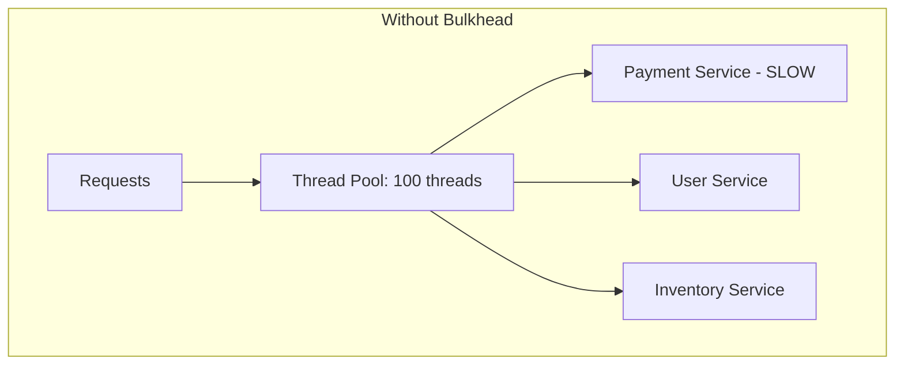
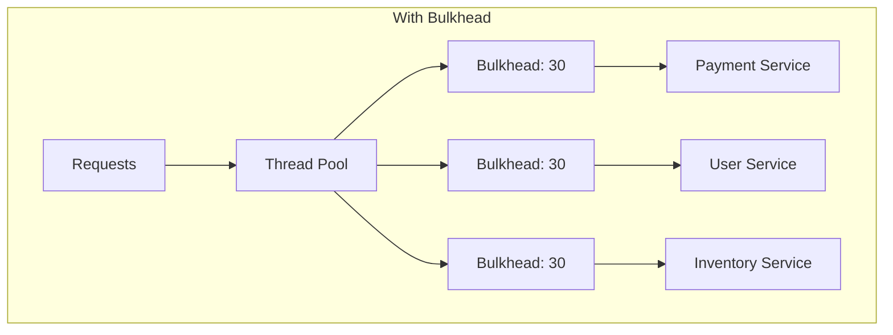

# How to Implement Bulkhead Pattern in Python

Author: [nawazdhandala](https://www.github.com/nawazdhandala)

Tags: Python, Bulkhead Pattern, Resilience, Fault Isolation, asyncio, Design Patterns, Microservices

Description: Learn how to implement the bulkhead pattern in Python to isolate failures and prevent cascading outages. This guide covers semaphore-based bulkheads, thread pool isolation, and patterns for building resilient systems.

---

> A single slow dependency can bring down your entire application. When your payment service becomes unresponsive, all your threads get stuck waiting for it, leaving none available to handle other requests. The bulkhead pattern isolates components so one failure cannot sink the entire ship.

The name comes from ship construction. Ships have watertight compartments (bulkheads) that contain flooding to one section, preventing the entire vessel from sinking. Software bulkheads work the same way - they contain failures to one component.

---

## The Problem: Cascading Failures

Without isolation, a single slow service consumes all resources:



When the payment service slows down, all 100 threads get stuck waiting for it. The user service and inventory service become unreachable even though they are healthy.

With bulkheads:



Each service gets its own limited pool of resources. A slow payment service only affects its 30 allocated slots.

---

## Semaphore-Based Bulkhead

The simplest bulkhead uses a semaphore to limit concurrent calls:

```python
# bulkhead.py
import asyncio
from dataclasses import dataclass, field
from typing import TypeVar, Callable, Any, Optional
from datetime import datetime, timedelta
import logging

logger = logging.getLogger(__name__)

T = TypeVar('T')


@dataclass
class BulkheadStats:
    """Statistics for bulkhead monitoring"""
    name: str
    max_concurrent: int
    current_concurrent: int = 0
    total_calls: int = 0
    rejected_calls: int = 0
    successful_calls: int = 0
    failed_calls: int = 0


class Bulkhead:
    """
    Semaphore-based bulkhead for limiting concurrent operations.

    The bulkhead pattern isolates failures by limiting the number of
    concurrent calls to a resource. This prevents one slow dependency
    from consuming all available threads or connections.
    """

    def __init__(
        self,
        name: str,
        max_concurrent: int,
        max_wait: float = 0.0  # Max seconds to wait for a slot
    ):
        self.name = name
        self.max_concurrent = max_concurrent
        self.max_wait = max_wait
        self._semaphore = asyncio.Semaphore(max_concurrent)
        self._current = 0
        self._stats = BulkheadStats(name=name, max_concurrent=max_concurrent)
        self._lock = asyncio.Lock()

    async def acquire(self) -> bool:
        """
        Attempt to acquire a bulkhead slot.
        Returns True if acquired, False if rejected.
        """
        self._stats.total_calls += 1

        if self.max_wait > 0:
            # Try to acquire with timeout
            try:
                await asyncio.wait_for(
                    self._semaphore.acquire(),
                    timeout=self.max_wait
                )
            except asyncio.TimeoutError:
                self._stats.rejected_calls += 1
                logger.warning(f"Bulkhead {self.name}: request rejected (timeout)")
                return False
        else:
            # Immediate rejection if no slots available
            acquired = self._semaphore.locked()
            if not self._semaphore.locked() or self._semaphore._value > 0:
                await self._semaphore.acquire()
            else:
                self._stats.rejected_calls += 1
                logger.warning(f"Bulkhead {self.name}: request rejected (full)")
                return False

        async with self._lock:
            self._current += 1
            self._stats.current_concurrent = self._current

        return True

    async def release(self, success: bool = True) -> None:
        """Release a bulkhead slot"""
        self._semaphore.release()

        async with self._lock:
            self._current -= 1
            self._stats.current_concurrent = self._current
            if success:
                self._stats.successful_calls += 1
            else:
                self._stats.failed_calls += 1

    async def execute(
        self,
        func: Callable[..., Any],
        *args,
        **kwargs
    ) -> Any:
        """
        Execute a function within the bulkhead.
        Raises BulkheadFullError if no slots available.
        """
        if not await self.acquire():
            raise BulkheadFullError(
                f"Bulkhead {self.name} is full ({self.max_concurrent} concurrent)"
            )

        success = False
        try:
            result = await func(*args, **kwargs)
            success = True
            return result
        finally:
            await self.release(success)

    def get_stats(self) -> BulkheadStats:
        """Get current bulkhead statistics"""
        return self._stats

    @property
    def available_slots(self) -> int:
        """Number of available slots"""
        return self.max_concurrent - self._current


class BulkheadFullError(Exception):
    """Raised when bulkhead has no available slots"""
    pass


# Decorator for applying bulkhead to functions
def bulkhead(
    name: str,
    max_concurrent: int,
    max_wait: float = 0.0
):
    """Decorator to apply bulkhead pattern to a function"""
    _bulkhead = Bulkhead(name, max_concurrent, max_wait)

    def decorator(func: Callable) -> Callable:
        async def wrapper(*args, **kwargs):
            return await _bulkhead.execute(func, *args, **kwargs)
        wrapper._bulkhead = _bulkhead  # Expose bulkhead for testing
        return wrapper
    return decorator


# Usage example
@bulkhead(name="payment-service", max_concurrent=10, max_wait=5.0)
async def call_payment_service(order_id: str, amount: float) -> dict:
    """Call external payment service with bulkhead protection"""
    # Simulated API call
    await asyncio.sleep(0.5)
    return {"order_id": order_id, "status": "paid", "amount": amount}


async def example():
    # This will limit concurrent calls to 10
    result = await call_payment_service("order-123", 99.99)
    print(result)
```

---

## Bulkhead Registry

Manage multiple bulkheads across your application:

```python
# bulkhead_registry.py
from typing import Dict, Optional
import asyncio
import logging

logger = logging.getLogger(__name__)


class BulkheadRegistry:
    """
    Central registry for managing bulkheads across the application.
    Use this to create, retrieve, and monitor bulkheads.
    """

    _instance: Optional['BulkheadRegistry'] = None
    _lock = asyncio.Lock()

    def __init__(self):
        self._bulkheads: Dict[str, Bulkhead] = {}

    @classmethod
    async def get_instance(cls) -> 'BulkheadRegistry':
        """Get singleton registry instance"""
        async with cls._lock:
            if cls._instance is None:
                cls._instance = cls()
            return cls._instance

    def register(
        self,
        name: str,
        max_concurrent: int,
        max_wait: float = 0.0
    ) -> Bulkhead:
        """Register a new bulkhead"""
        if name in self._bulkheads:
            raise ValueError(f"Bulkhead '{name}' already exists")

        bulkhead = Bulkhead(name, max_concurrent, max_wait)
        self._bulkheads[name] = bulkhead
        logger.info(f"Registered bulkhead: {name} (max={max_concurrent})")
        return bulkhead

    def get(self, name: str) -> Optional[Bulkhead]:
        """Get a bulkhead by name"""
        return self._bulkheads.get(name)

    def get_or_create(
        self,
        name: str,
        max_concurrent: int,
        max_wait: float = 0.0
    ) -> Bulkhead:
        """Get existing bulkhead or create new one"""
        if name not in self._bulkheads:
            return self.register(name, max_concurrent, max_wait)
        return self._bulkheads[name]

    def get_all_stats(self) -> Dict[str, BulkheadStats]:
        """Get statistics for all bulkheads"""
        return {
            name: bh.get_stats()
            for name, bh in self._bulkheads.items()
        }

    def remove(self, name: str) -> bool:
        """Remove a bulkhead from registry"""
        if name in self._bulkheads:
            del self._bulkheads[name]
            return True
        return False


# Usage
async def setup_bulkheads():
    registry = await BulkheadRegistry.get_instance()

    # Register bulkheads for different services
    registry.register("payment-api", max_concurrent=20, max_wait=5.0)
    registry.register("user-api", max_concurrent=50, max_wait=2.0)
    registry.register("inventory-api", max_concurrent=30, max_wait=3.0)
    registry.register("email-service", max_concurrent=10, max_wait=0.0)

    return registry
```

---

## Thread Pool Isolation

For CPU-bound operations, use thread pool bulkheads:

```python
# thread_bulkhead.py
import asyncio
from concurrent.futures import ThreadPoolExecutor, TimeoutError as FuturesTimeout
from typing import Callable, Any
from dataclasses import dataclass
import logging

logger = logging.getLogger(__name__)


@dataclass
class ThreadBulkheadStats:
    """Statistics for thread pool bulkhead"""
    name: str
    max_workers: int
    active_threads: int = 0
    queued_tasks: int = 0
    completed_tasks: int = 0
    rejected_tasks: int = 0
    failed_tasks: int = 0


class ThreadPoolBulkhead:
    """
    Thread pool-based bulkhead for CPU-bound operations.

    Unlike semaphore bulkheads which limit concurrent async operations,
    this uses a dedicated thread pool to truly isolate blocking operations.
    """

    def __init__(
        self,
        name: str,
        max_workers: int,
        queue_size: int = 0,
        timeout: float = 30.0
    ):
        self.name = name
        self.max_workers = max_workers
        self.queue_size = queue_size
        self.timeout = timeout

        # Create a dedicated thread pool
        self._executor = ThreadPoolExecutor(
            max_workers=max_workers,
            thread_name_prefix=f"bulkhead-{name}"
        )
        self._stats = ThreadBulkheadStats(name=name, max_workers=max_workers)
        self._active_count = 0
        self._queued_count = 0

    async def execute(
        self,
        func: Callable[..., Any],
        *args,
        **kwargs
    ) -> Any:
        """Execute a blocking function in the thread pool"""
        loop = asyncio.get_event_loop()

        # Check if we should reject
        if self.queue_size > 0 and self._queued_count >= self.queue_size:
            self._stats.rejected_tasks += 1
            raise BulkheadFullError(
                f"Thread bulkhead {self.name} queue is full"
            )

        self._queued_count += 1

        try:
            # Run in thread pool with timeout
            future = loop.run_in_executor(
                self._executor,
                lambda: func(*args, **kwargs)
            )

            self._active_count += 1
            self._stats.active_threads = self._active_count

            try:
                result = await asyncio.wait_for(future, timeout=self.timeout)
                self._stats.completed_tasks += 1
                return result
            except asyncio.TimeoutError:
                self._stats.failed_tasks += 1
                raise
            finally:
                self._active_count -= 1
                self._stats.active_threads = self._active_count

        finally:
            self._queued_count -= 1
            self._stats.queued_tasks = self._queued_count

    def get_stats(self) -> ThreadBulkheadStats:
        """Get current statistics"""
        return self._stats

    def shutdown(self, wait: bool = True) -> None:
        """Shutdown the thread pool"""
        self._executor.shutdown(wait=wait)
        logger.info(f"Thread bulkhead {self.name} shutdown")


# Usage for CPU-bound tasks
def cpu_intensive_task(data: bytes) -> bytes:
    """A CPU-bound task that should be isolated"""
    import hashlib
    result = data
    for _ in range(1000):
        result = hashlib.sha256(result).digest()
    return result


async def example():
    bulkhead = ThreadPoolBulkhead(
        name="crypto-operations",
        max_workers=4,
        queue_size=10,
        timeout=5.0
    )

    data = b"Hello, World!"

    # This runs in an isolated thread pool
    result = await bulkhead.execute(cpu_intensive_task, data)
    print(f"Hash: {result.hex()}")

    stats = bulkhead.get_stats()
    print(f"Completed: {stats.completed_tasks}")

    bulkhead.shutdown()
```

---

## Combined Bulkhead and Circuit Breaker

For maximum resilience, combine bulkhead with circuit breaker:

```python
# resilient_client.py
import asyncio
from dataclasses import dataclass, field
from typing import Callable, Any, Optional
from datetime import datetime, timedelta
from enum import Enum, auto
import logging

logger = logging.getLogger(__name__)


class CircuitState(Enum):
    CLOSED = auto()    # Normal operation
    OPEN = auto()      # Failing, reject calls
    HALF_OPEN = auto() # Testing if recovered


@dataclass
class CircuitBreakerConfig:
    """Configuration for circuit breaker"""
    failure_threshold: int = 5       # Failures before opening
    success_threshold: int = 3       # Successes to close from half-open
    timeout: float = 30.0            # Seconds before trying half-open
    excluded_exceptions: tuple = ()  # Exceptions that don't count as failures


class CircuitBreaker:
    """Circuit breaker that opens after repeated failures"""

    def __init__(self, name: str, config: CircuitBreakerConfig = None):
        self.name = name
        self.config = config or CircuitBreakerConfig()
        self._state = CircuitState.CLOSED
        self._failure_count = 0
        self._success_count = 0
        self._last_failure_time: Optional[datetime] = None

    @property
    def state(self) -> CircuitState:
        """Get current circuit state, checking for timeout"""
        if self._state == CircuitState.OPEN:
            if self._should_try_reset():
                self._state = CircuitState.HALF_OPEN
                logger.info(f"Circuit {self.name}: OPEN -> HALF_OPEN")
        return self._state

    def _should_try_reset(self) -> bool:
        """Check if enough time has passed to try half-open"""
        if self._last_failure_time is None:
            return True
        elapsed = (datetime.utcnow() - self._last_failure_time).total_seconds()
        return elapsed >= self.config.timeout

    def record_success(self) -> None:
        """Record a successful call"""
        if self._state == CircuitState.HALF_OPEN:
            self._success_count += 1
            if self._success_count >= self.config.success_threshold:
                self._state = CircuitState.CLOSED
                self._failure_count = 0
                self._success_count = 0
                logger.info(f"Circuit {self.name}: HALF_OPEN -> CLOSED")
        elif self._state == CircuitState.CLOSED:
            self._failure_count = 0

    def record_failure(self, error: Exception) -> None:
        """Record a failed call"""
        # Don't count excluded exceptions
        if isinstance(error, self.config.excluded_exceptions):
            return

        self._failure_count += 1
        self._last_failure_time = datetime.utcnow()

        if self._state == CircuitState.HALF_OPEN:
            self._state = CircuitState.OPEN
            self._success_count = 0
            logger.warning(f"Circuit {self.name}: HALF_OPEN -> OPEN")
        elif self._state == CircuitState.CLOSED:
            if self._failure_count >= self.config.failure_threshold:
                self._state = CircuitState.OPEN
                logger.warning(f"Circuit {self.name}: CLOSED -> OPEN")


class CircuitOpenError(Exception):
    """Raised when circuit breaker is open"""
    pass


@dataclass
class ResilientClientConfig:
    """Configuration for resilient client"""
    bulkhead_max_concurrent: int = 20
    bulkhead_max_wait: float = 5.0
    circuit_failure_threshold: int = 5
    circuit_success_threshold: int = 3
    circuit_timeout: float = 30.0


class ResilientClient:
    """
    Client wrapper with bulkhead and circuit breaker protection.

    Combines:
    - Bulkhead: Limits concurrent calls to prevent resource exhaustion
    - Circuit Breaker: Stops calling failing services to allow recovery
    """

    def __init__(self, name: str, config: ResilientClientConfig = None):
        self.name = name
        self.config = config or ResilientClientConfig()

        # Create bulkhead
        self._bulkhead = Bulkhead(
            name=f"{name}-bulkhead",
            max_concurrent=self.config.bulkhead_max_concurrent,
            max_wait=self.config.bulkhead_max_wait
        )

        # Create circuit breaker
        self._circuit = CircuitBreaker(
            name=f"{name}-circuit",
            config=CircuitBreakerConfig(
                failure_threshold=self.config.circuit_failure_threshold,
                success_threshold=self.config.circuit_success_threshold,
                timeout=self.config.circuit_timeout
            )
        )

    async def execute(
        self,
        func: Callable[..., Any],
        *args,
        **kwargs
    ) -> Any:
        """Execute function with bulkhead and circuit breaker protection"""
        # Check circuit breaker first
        if self._circuit.state == CircuitState.OPEN:
            raise CircuitOpenError(
                f"Circuit breaker {self.name} is open"
            )

        # Then try to acquire bulkhead slot
        try:
            return await self._bulkhead.execute(
                self._execute_with_circuit,
                func, *args, **kwargs
            )
        except BulkheadFullError:
            # Bulkhead full, but don't trip circuit
            raise

    async def _execute_with_circuit(
        self,
        func: Callable[..., Any],
        *args,
        **kwargs
    ) -> Any:
        """Execute with circuit breaker tracking"""
        try:
            result = await func(*args, **kwargs)
            self._circuit.record_success()
            return result
        except Exception as e:
            self._circuit.record_failure(e)
            raise

    def get_status(self) -> dict:
        """Get current client status"""
        return {
            "name": self.name,
            "bulkhead": {
                "available_slots": self._bulkhead.available_slots,
                "stats": self._bulkhead.get_stats()
            },
            "circuit_breaker": {
                "state": self._circuit.state.name,
                "failure_count": self._circuit._failure_count
            }
        }


# Usage example
async def example():
    # Create resilient client
    client = ResilientClient(
        name="payment-service",
        config=ResilientClientConfig(
            bulkhead_max_concurrent=10,
            circuit_failure_threshold=3
        )
    )

    async def call_payment_api(order_id: str) -> dict:
        # Simulated API call
        await asyncio.sleep(0.1)
        return {"order_id": order_id, "status": "paid"}

    try:
        result = await client.execute(call_payment_api, "order-123")
        print(f"Result: {result}")
    except BulkheadFullError:
        print("Service is overloaded, try again later")
    except CircuitOpenError:
        print("Service is unavailable, circuit breaker is open")
    except Exception as e:
        print(f"Call failed: {e}")

    print(f"Status: {client.get_status()}")
```

---

## FastAPI Integration

Integrate bulkheads with FastAPI endpoints:

```python
# fastapi_bulkhead.py
from fastapi import FastAPI, HTTPException, Depends
from contextlib import asynccontextmanager
import asyncio

# Store bulkheads in app state
bulkheads: Dict[str, Bulkhead] = {}


@asynccontextmanager
async def lifespan(app: FastAPI):
    # Setup bulkheads on startup
    bulkheads["payment"] = Bulkhead("payment", max_concurrent=20, max_wait=5.0)
    bulkheads["inventory"] = Bulkhead("inventory", max_concurrent=30, max_wait=3.0)
    bulkheads["user"] = Bulkhead("user", max_concurrent=50, max_wait=2.0)
    yield
    # Cleanup
    bulkheads.clear()


app = FastAPI(lifespan=lifespan)


def get_bulkhead(name: str) -> Bulkhead:
    """Dependency to get a bulkhead by name"""
    if name not in bulkheads:
        raise HTTPException(500, f"Bulkhead {name} not configured")
    return bulkheads[name]


@app.post("/orders/{order_id}/pay")
async def process_payment(order_id: str):
    """Process payment with bulkhead protection"""
    bulkhead = get_bulkhead("payment")

    async def call_payment_service():
        await asyncio.sleep(0.5)  # Simulated API call
        return {"order_id": order_id, "status": "paid"}

    try:
        result = await bulkhead.execute(call_payment_service)
        return result
    except BulkheadFullError:
        raise HTTPException(
            status_code=503,
            detail="Payment service is currently overloaded"
        )


@app.get("/bulkheads/stats")
async def get_bulkhead_stats():
    """Get statistics for all bulkheads"""
    return {
        name: {
            "max_concurrent": bh.max_concurrent,
            "available_slots": bh.available_slots,
            "total_calls": bh.get_stats().total_calls,
            "rejected_calls": bh.get_stats().rejected_calls
        }
        for name, bh in bulkheads.items()
    }
```

---

## Best Practices

**1. Size bulkheads based on downstream capacity:**
```python
# If payment service can handle 100 RPS and you have 5 instances
# Each instance should limit to ~20 concurrent calls
bulkhead = Bulkhead("payment", max_concurrent=20)
```

**2. Monitor rejection rates:**
```python
stats = bulkhead.get_stats()
rejection_rate = stats.rejected_calls / max(stats.total_calls, 1)
if rejection_rate > 0.1:  # More than 10% rejections
    logger.warning(f"High rejection rate: {rejection_rate:.2%}")
```

**3. Use different bulkheads for different criticality:**
```python
# Critical operations get more capacity
critical_bulkhead = Bulkhead("critical-ops", max_concurrent=50)
# Background tasks get less
background_bulkhead = Bulkhead("background", max_concurrent=5)
```

**4. Combine with timeouts:**
```python
async def call_with_timeout(bulkhead: Bulkhead, func, timeout: float):
    async def wrapped():
        return await asyncio.wait_for(func(), timeout=timeout)
    return await bulkhead.execute(wrapped)
```

---

## Conclusion

The bulkhead pattern is essential for building resilient systems. Key takeaways:

- **Isolate failures**: Prevent one slow service from consuming all resources
- **Size appropriately**: Match bulkhead size to downstream capacity
- **Combine with circuit breaker**: Stop calling failing services entirely
- **Monitor metrics**: Track rejection rates to identify capacity issues
- **Fail fast**: Reject requests immediately rather than queueing indefinitely

Without bulkheads, a single degraded dependency can cascade into a system-wide outage. With them, failures stay contained.

---

*Need to monitor your bulkhead metrics? [OneUptime](https://oneuptime.com) provides real-time metrics and alerting to help you track rejection rates and identify capacity issues before they become outages.*

**Related Reading:**
- [How to Implement Retry Logic with Exponential Backoff in Python](https://oneuptime.com/blog/post/2025-01-06-python-retry-exponential-backoff/view)
